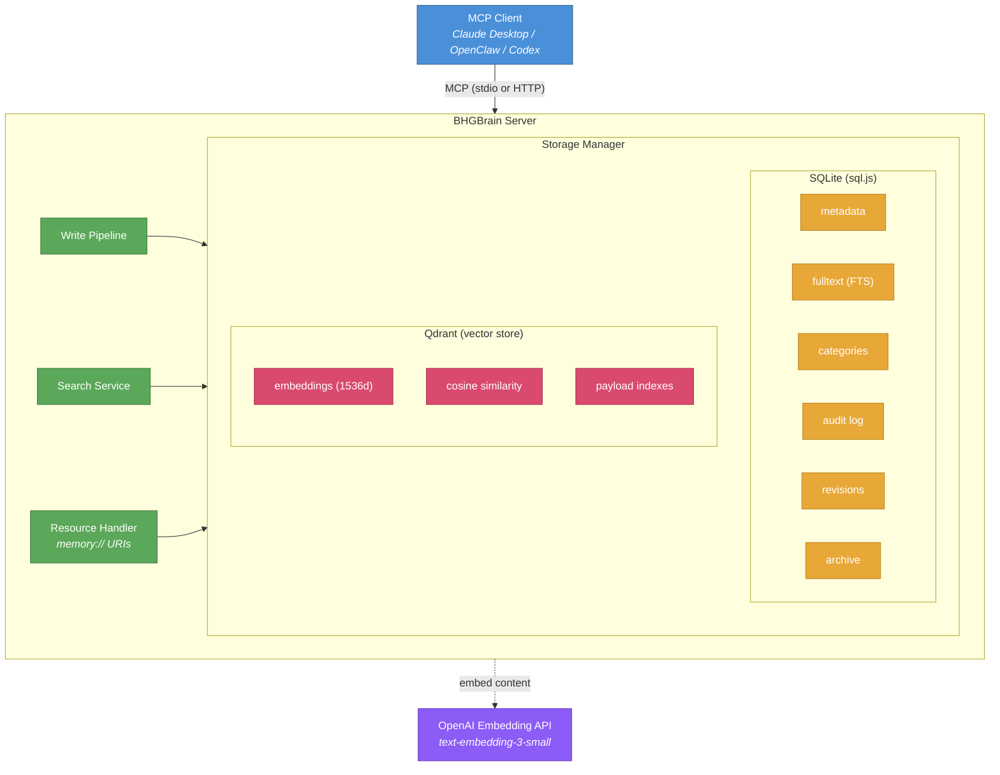
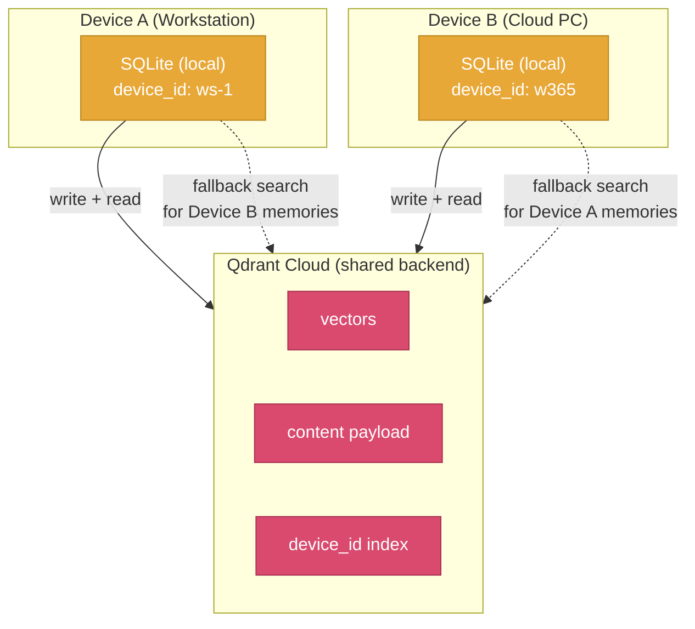
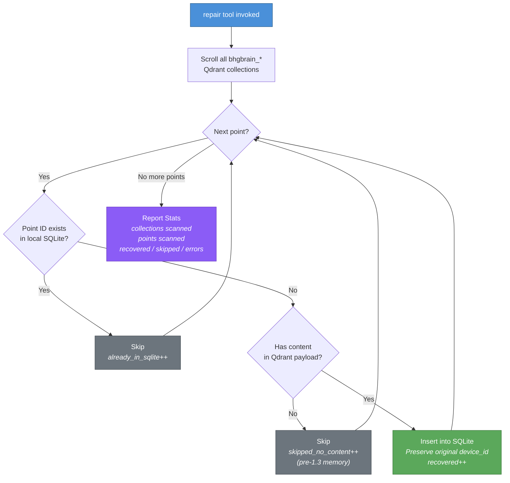
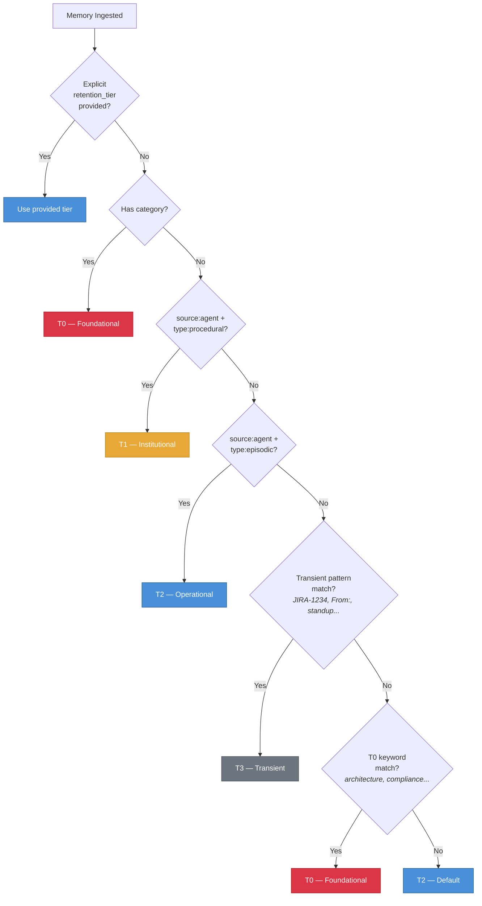
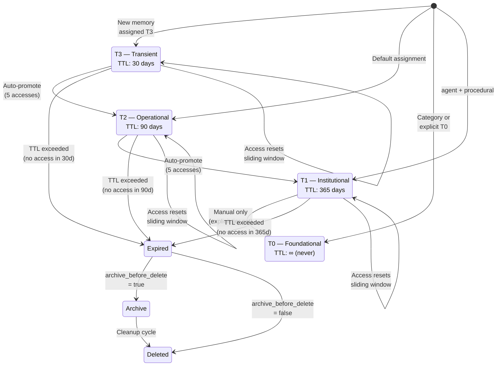
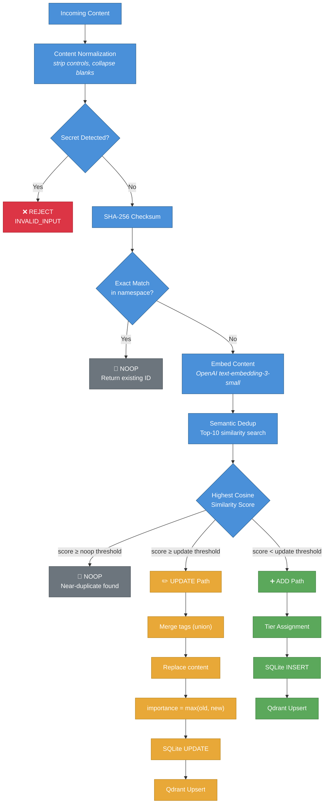
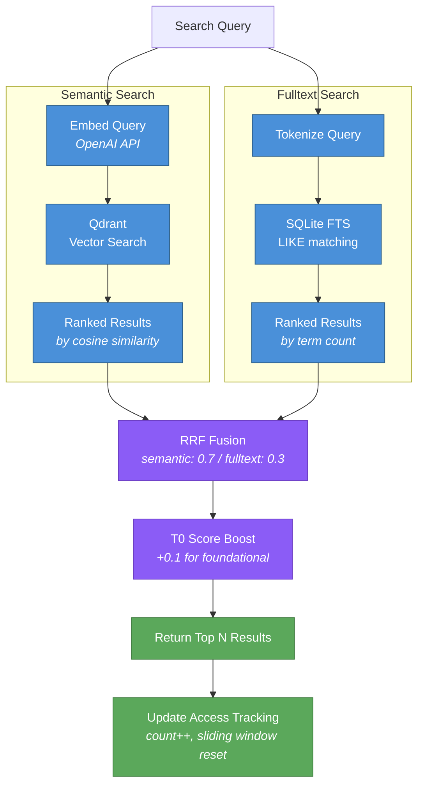
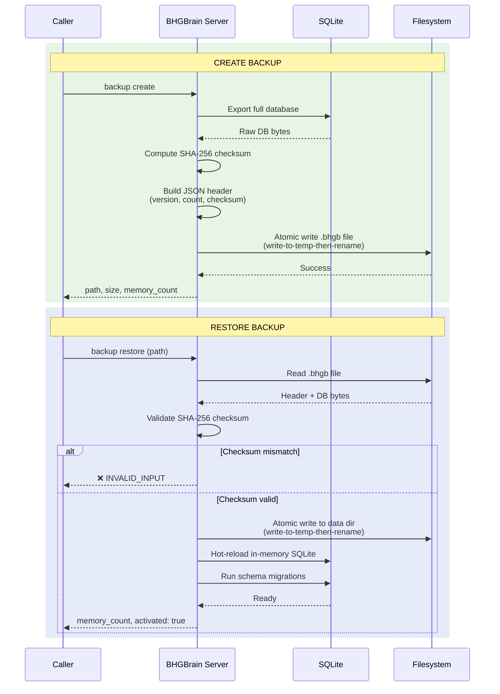

# BHGBrain

Persistentes, vektorbasiertes Gedächtnis für MCP-Clients (Claude, Codex, OpenClaw usw.).

BHGBrain speichert Erinnerungen in SQLite (Metadaten + Volltextsuche) und Qdrant (semantische Vektoren) und stellt sie über das Model Context Protocol (MCP) per stdio oder HTTP bereit. Es ist darauf ausgelegt, KI-Agenten ein dauerhaftes, durchsuchbares Zweitgehirn zu geben, das sitzungsübergreifend bestehen bleibt – mit vollständiger Lebenszyklusverwaltung, automatischer Deduplizierung, gestufter Aufbewahrung und Hybridsuche.

---

## Inhaltsverzeichnis

1. [Überblick & Architektur](#überblick--architektur)
2. [Voraussetzungen](#voraussetzungen)
3. [Qdrant-Einrichtung](#qdrant-einrichtung)
4. [Installation](#installation)
5. [Konfiguration](#konfiguration)
6. [Umgebungsvariablen](#umgebungsvariablen)
7. [Server starten](#server-starten)
8. [MCP-Client-Konfiguration](#mcp-client-konfiguration)
9. [Multi-Device-Speicher](#multi-device-speicher)
   - [Funktionsweise](#funktionsweise)
   - [Geräteidentitätsauflösung](#geräteidentitätsauflösung)
   - [Gemeinsames Qdrant, lokales SQLite](#gemeinsames-qdrant-lokales-sqlite)
   - [Reparatur und Wiederherstellung](#reparatur-und-wiederherstellung)
10. [Speicherverwaltung](#speicherverwaltung)
    - [Speicher-Datenmodell](#speicher-datenmodell)
    - [Speichertypen](#speichertypen)
    - [Namensräume und Sammlungen](#namensräume-und-sammlungen)
    - [Aufbewahrungsstufen](#aufbewahrungsstufen)
    - [Stufenlebenszyklus – Zuweisung, Beförderung, Gleitendes Fenster](#stufenlebenszyklus--zuweisung-beförderung-gleitendes-fenster)
    - [Deduplizierung](#deduplizierung)
    - [Inhaltsnormalisierung](#inhaltsnormalisierung)
    - [Wichtigkeitsbewertung](#wichtigkeitsbewertung)
    - [Kategorien – Persistente Richtlinien-Slots](#kategorien--persistente-richtlinien-slots)
    - [Verfall, Bereinigung und Archivierung](#verfall-bereinigung-und-archivierung)
    - [Warnungen vor Ablauf](#warnungen-vor-ablauf)
    - [Ressourcenlimits und Kapazitätsbudgets](#ressourcenlimits-und-kapazitätsbudgets)
11. [Suche](#suche)
    - [Semantische Suche](#semantische-suche)
    - [Volltextsuche](#volltextsuche)
    - [Hybridsuche](#hybridsuche)
    - [Recall vs. Search – Unterschiede](#recall-vs-search--unterschiede)
    - [Filterung](#filterung)
    - [Score-Schwellenwerte und Stufenverstärkungen](#score-schwellenwerte-und-stufenverstärkungen)
12. [Sicherung & Wiederherstellung](#sicherung--wiederherstellung)
13. [Gesundheitszustand & Metriken](#gesundheitszustand--metriken)
14. [Sicherheit](#sicherheit)
15. [MCP-Ressourcen](#mcp-ressourcen)
16. [Bootstrap-Prompt](#bootstrap-prompt)
17. [CLI-Referenz](#cli-referenz)
18. [MCP-Tools-Referenz](#mcp-tools-referenz)
19. [Upgrade](#upgrade)
20. [Verhaltenshinweise](#verhaltenshinweise)

---

## Überblick & Architektur

BHGBrain ist ein persistenter Speicherserver, der auf dem Model Context Protocol aufbaut. Er speichert alles, was KI-Agenten sitzungsübergreifend lernen, entscheiden und beobachten – und macht dieses Wissen per semantischem Recall, Volltextsuche und eingebettetem Kontext verfügbar.

### Dual-Store-Architektur



- **SQLite** (über `sql.js`, im Arbeitsspeicher mit periodischem atomarem Flush auf die Festplatte) ist das **System of Record** für alle Speicher-Metadaten, den Volltextsuchindex, Kategorien, das Audit-Protokoll, den Revisionsverlauf und Archivdatensätze.
- **Qdrant** enthält semantische Vektoreinbettungen für die Ähnlichkeitssuche. Qdrant wird stets nach einem erfolgreichen SQLite-Schreibvorgang beschrieben; Fehler werden über das Flag `vector_synced` verfolgt und im Health-Endpunkt angezeigt.
- **OpenAI text-embedding-3-small** (Standard, konfigurierbar) erzeugt 1536-dimensionale Einbettungen für jede Erinnerung.
- **Atomare Schreibvorgänge** stellen sicher, dass Datenbankdateien niemals teilweise geschrieben werden – alle Festplatten-I/O-Vorgänge nutzen das Prinzip Schreiben-in-Temp-dann-Umbenennen.
- **Verzögerter Flush** bündelt Metadaten-Updates zum Zugriffsverhalten (bis zu 5 Sekunden), um pro Anfrage ausgelöste Datenbank-Flushes auf leselastigen Pfaden zu vermeiden.

---

## Voraussetzungen

| Anforderung | Version | Hinweise |
|---|---|---|
| Node.js | ≥ 20.0.0 | LTS empfohlen |
| Qdrant | ≥ 1.9 | Muss vor dem Start von BHGBrain laufen |
| OpenAI API-Schlüssel | — | Für Einbettungen (`text-embedding-3-small` standardmäßig). Der Server startet im Degraded-Modus, wenn er fehlt. |

---

## Qdrant-Einrichtung

BHGBrain **erfordert eine externe Qdrant-Instanz**. Auch im Standard-`embedded`-Modus verbindet sich der Server mit `http://localhost:6333` – es ist kein gebündeltes Qdrant-Binary enthalten. Sie müssen es selbst betreiben.

### Option A: Docker (empfohlen)

```bash
docker run -d \
  --name qdrant \
  --restart unless-stopped \
  -p 6333:6333 \
  -v qdrant_storage:/qdrant/storage \
  qdrant/qdrant
```

Prüfen, ob Qdrant läuft:

```bash
curl http://localhost:6333/health
# → {"title":"qdrant - vector search engine","version":"..."}
```

### Option B: Docker Compose

```yaml
services:
  qdrant:
    image: qdrant/qdrant
    restart: unless-stopped
    ports:
      - "6333:6333"
    volumes:
      - qdrant_storage:/qdrant/storage

volumes:
  qdrant_storage:
```

### Option C: Natives Binary

Herunterladen von [https://github.com/qdrant/qdrant/releases](https://github.com/qdrant/qdrant/releases) und ausführen:

```bash
./qdrant
```

### Option D: Qdrant Cloud (externer Modus)

Setzen Sie `qdrant.mode` in Ihrer Konfiguration auf `external` und verweisen Sie `external_url` auf die URL Ihres Cloud-Clusters. Setzen Sie `qdrant.api_key_env` auf den Namen der Umgebungsvariable, die Ihren Qdrant API-Schlüssel enthält.

```jsonc
{
  "qdrant": {
    "mode": "external",
    "external_url": "https://your-cluster.cloud.qdrant.io",
    "api_key_env": "QDRANT_API_KEY"
  }
}
```

---

## Installation

```bash
git clone https://github.com/Big-Hat-Group-Inc/BHGBrain.git
cd BHGBrain
npm install
npm run build
```

Zur globalen Installation als CLI:

```bash
npm install -g .
bhgbrain --help
```

---

## Konfiguration

BHGBrain lädt seine Konfiguration aus:

- **Windows:** `%LOCALAPPDATA%\BHGBrain\config.json`
- **Linux/macOS:** `~/.bhgbrain/config.json`

Die Datei wird beim ersten Start automatisch mit allen Standardwerten erstellt. Bearbeiten Sie sie, um das Verhalten anzupassen. Sie können beim Serverstart auch einen benutzerdefinierten Konfigurationspfad mit `--config=<Pfad>` angeben.

### Vollständige Konfigurationsreferenz

```jsonc
{
  // Datenverzeichnis (absoluter Pfad). Standardmäßig plattformspezifischer Ort.
  "data_dir": null,

  // Geräteidentität für Multi-Device-Setups (siehe Abschnitt Multi-Device-Speicher)
  "device": {
    // Stabiler Gerätebezeichner. Wird automatisch aus dem Hostnamen generiert, wenn nicht angegeben.
    // Muster: ^[a-zA-Z0-9._-]{1,64}$
    // Kann auch über die Umgebungsvariable BHGBRAIN_DEVICE_ID gesetzt werden.
    "id": null
  },

  // Konfiguration des Einbettungsanbieters
  "embedding": {
    // Derzeit wird nur "openai" unterstützt
    "provider": "openai",
    // OpenAI-Modell für Einbettungen
    "model": "text-embedding-3-small",
    // Name der Umgebungsvariable mit dem OpenAI API-Schlüssel
    "api_key_env": "OPENAI_API_KEY",
    // Vektordimensionen des Modells. Muss mit der Modellausgabe übereinstimmen.
    // WICHTIG: Eine Änderung nach dem Erstellen von Sammlungen erfordert deren Neuerstellung.
    "dimensions": 1536
  },

  // Qdrant-Verbindungskonfiguration
  "qdrant": {
    // "embedded" = Verbindung zu localhost:6333
    // "external" = Verbindung zu external_url (Qdrant Cloud, Remote-Instanz usw.)
    "mode": "embedded",
    // Wird nur im Embedded-Modus verwendet (derzeit ungenutzt – Qdrant muss extern gestartet werden)
    "embedded_path": "./qdrant",
    // Externe Qdrant-URL (wird verwendet wenn mode = "external")
    "external_url": null,
    // Name der Umgebungsvariable mit dem Qdrant API-Schlüssel (wird verwendet wenn mode = "external")
    "api_key_env": null
  },

  // Transport-Konfiguration
  "transport": {
    "http": {
      // HTTP-Transport aktivieren
      "enabled": true,
      // Host zum Binden. Verwenden Sie 127.0.0.1 nur für Loopback (Standard, sicher).
      // Nicht-Loopback erfordert, dass BHGBRAIN_TOKEN gesetzt ist (oder allow_unauthenticated_http).
      "host": "127.0.0.1",
      // Port, auf dem gehört werden soll
      "port": 3721,
      // Name der Umgebungsvariable mit dem Bearer-Token für HTTP-Authentifizierung
      "bearer_token_env": "BHGBRAIN_TOKEN"
    },
    "stdio": {
      // MCP stdio-Transport aktivieren
      "enabled": true
    }
  },

  // Standardwerte, die angewendet werden, wenn Aufrufer keine Angaben machen
  "defaults": {
    // Standard-Namensraum für alle Operationen
    "namespace": "global",
    // Standard-Sammlung für alle Operationen
    "collection": "general",
    // Standard-Ergebnislimit für Recall-Operationen
    "recall_limit": 5,
    // Standard-Mindestscore für semantische Ähnlichkeit (0-1) beim Recall
    "min_score": 0.6,
    // Maximale Anzahl automatisch eingebetteter Erinnerungen
    "auto_inject_limit": 10,
    // Maximale Zeichenanzahl in Tool-Antwort-Payloads
    "max_response_chars": 50000
  },

  // Einstellungen für Aufbewahrung und Lebenszyklus von Erinnerungen
  "retention": {
    // Tage ohne Zugriff, nach denen eine Erinnerung als Stale-Kandidat gilt
    "decay_after_days": 180,
    // Maximale SQLite-Datenbankgröße in Gigabyte, bevor der Gesundheitsstatus auf degraded wechselt
    "max_db_size_gb": 2,
    // Maximale Gesamtanzahl an Erinnerungen, bevor der Gesundheitsstatus auf over-capacity wechselt
    "max_memories": 500000,
    // Prozentsatz von max_memories, ab dem der Gesundheitsstatus auf degraded wechselt
    "warn_at_percent": 80,

    // TTL pro Stufe in Tagen (null = läuft nie ab)
    "tier_ttl": {
      "T0": null,    // Grundlegend: läuft nie ab
      "T1": 365,     // Institutionell: 1 Jahr ohne Zugriff
      "T2": 90,      // Operativ: 90 Tage ohne Zugriff
      "T3": 30       // Transient: 30 Tage ohne Zugriff
    },

    // Kapazitätsbudgets pro Stufe (null = unbegrenzt)
    "tier_budgets": {
      "T0": null,      // Kein Limit für grundlegendes Wissen
      "T1": 100000,    // 100k institutionelle Erinnerungen
      "T2": 200000,    // 200k operative Erinnerungen
      "T3": 200000     // 200k transiente Erinnerungen
    },

    // Zugriffsanzahl, ab der eine Erinnerung automatisch eine Stufe aufsteigt
    "auto_promote_access_threshold": 5,

    // Wenn true, setzt jeder Zugriff die TTL-Uhr zurück (gleitendes Fenster)
    "sliding_window_enabled": true,

    // Wenn true, werden abgelaufene Erinnerungen vor dem Löschen in die Archivtabelle geschrieben
    "archive_before_delete": true,

    // Cron-Zeitplan für den Hintergrund-Bereinigungsauftrag (Standard: täglich 2 Uhr)
    "cleanup_schedule": "0 2 * * *",

    // Tage vor Ablauf, ab denen Erinnerungen als expiring_soon markiert werden
    "pre_expiry_warning_days": 7,

    // Qdrant-Segment-Kompaktierungsschwelle (kompaktieren, wenn dieser Anteil eines Segments gelöscht ist)
    "compaction_deleted_threshold": 0.10
  },

  // Deduplizierungseinstellungen
  "deduplication": {
    // Semantische Deduplizierung beim Schreiben aktivieren
    "enabled": true,
    // Cosinus-Ähnlichkeitsschwelle, ab der neuer Inhalt als UPDATE eines vorhandenen Inhalts gilt.
    // Stufenspezifische Anpassungen werden zusätzlich angewendet (siehe Abschnitt Deduplizierung unten).
    "similarity_threshold": 0.92
  },

  // Suchkonfiguration
  "search": {
    // Gewichtungen für Reciprocal Rank Fusion (RRF) im Hybrid-Modus
    // Müssen sich zu 1.0 summieren
    "hybrid_weights": {
      "semantic": 0.7,
      "fulltext": 0.3
    }
  },

  // Sicherheitseinstellungen
  "security": {
    // Nicht-Loopback-HTTP-Bindungen standardmäßig ablehnen (fail-closed)
    "require_loopback_http": true,
    // Unauthentifiziertes externes HTTP explizit zulassen (protokolliert eine deutliche Warnung)
    "allow_unauthenticated_http": false,
    // Token-Werte in strukturierten Logs redigieren
    "log_redaction": true,
    // Maximale Anfragen pro Minute pro Client-IP für den HTTP-Transport
    "rate_limit_rpm": 100,
    // Maximale HTTP-Anfrage-Body-Größe in Bytes
    "max_request_size_bytes": 1048576
  },

  // Auto-Inject-Payload-Budget (für die memory://inject-Ressource)
  "auto_inject": {
    // Maximale im Inject-Payload enthaltene Zeichenanzahl
    "max_chars": 30000,
    // Token-Budget (null = unbegrenzt, Zeichenbudget gilt)
    "max_tokens": null
  },

  // Observability-Einstellungen
  "observability": {
    // In-Process-Metrikenerfassung aktivieren
    "metrics_enabled": false,
    // Strukturiertes JSON-Logging verwenden (via pino)
    "structured_logging": true,
    // Log-Level: "debug" | "info" | "warn" | "error"
    "log_level": "info"
  },

  // Ingestion-Pipeline-Einstellungen
  "pipeline": {
    // Extraktionsdurchgang aktivieren (führt derzeit deterministische Einzelkandidaten-Extraktion aus)
    "extraction_enabled": true,
    // Modell für LLM-basierte Extraktion (für zukünftige Verwendung geplant)
    "extraction_model": "gpt-4o-mini",
    // Name der Umgebungsvariable für den API-Schlüssel des Extraktionsmodells
    "extraction_model_env": "BHGBRAIN_EXTRACTION_API_KEY",
    // Wenn true, Fallback auf nur-Prüfsummen-Deduplizierung, falls Einbettung nicht verfügbar
    "fallback_to_threshold_dedup": true
  },

  // Speicherinhalt bei der Ingestion automatisch zusammenfassen
  "auto_summarize": true
}
```

---

## Umgebungsvariablen

| Variable | Erforderlich | Standard | Beschreibung |
|---|---|---|---|
| `OPENAI_API_KEY` | Ja (für Einbettungen) | — | OpenAI API-Schlüssel. Der Server startet im **Degraded-Modus**, wenn er fehlt – semantische Suche und Ingestion schlagen fehl, Volltextsuche und Kategorie-Lesezugriffe funktionieren weiterhin. |
| `BHGBRAIN_TOKEN` | Erforderlich für nicht-Loopback-HTTP | — | Bearer-Token für HTTP-Authentifizierung. Der Server **verweigert den Start**, wenn der Host nicht Loopback ist und dieser Wert nicht gesetzt ist (außer `allow_unauthenticated_http: true`). |
| `QDRANT_API_KEY` | Erforderlich für Qdrant Cloud | — | Setzen Sie `qdrant.api_key_env` in der Konfiguration auf den Namen dieser Variable. Der Standard-Konfigurationsfeldname ist `QDRANT_API_KEY`. |
| `BHGBRAIN_DEVICE_ID` | Nein | Automatisch aus dem Hostnamen generiert | Überschreibt den Gerätebezeichner für Multi-Device-Setups. Siehe [Geräteidentitätsauflösung](#geräteidentitätsauflösung). |
| `BHGBRAIN_EXTRACTION_API_KEY` | Nein | Fällt auf `OPENAI_API_KEY` zurück | API-Schlüssel für das LLM-Extraktionsmodell (zukünftige Verwendung). |

Sicheres Bearer-Token generieren:

```bash
bhgbrain server token
# oder ohne die CLI:
node -e "console.log(require('crypto').randomBytes(32).toString('hex'))"
```

---

## Server starten

### stdio-Modus (MCP über stdin/stdout)

Dies ist der Standardmodus für MCP-Clients wie Claude Desktop. Das Flag `--stdio` fordert explizit den stdio-Transport an.

```bash
# Entwicklung (kein Build erforderlich)
npm run dev

# Produktion über CLI
node dist/index.js --stdio

# Mit einer benutzerdefinierten Konfigurationsdatei
node dist/index.js --stdio --config=/path/to/config.json
```

### HTTP-Modus

HTTP ist standardmäßig auf `127.0.0.1:3721` aktiviert. Setzen Sie `BHGBRAIN_TOKEN` vor dem Start, wenn Sie authentifizierten Zugriff wünschen:

```bash
export OPENAI_API_KEY=sk-...
export BHGBRAIN_TOKEN=<your-token>
node dist/index.js
```

Der Server hört standardmäßig auf `http://127.0.0.1:3721`. Verfügbare HTTP-Endpunkte:

| Endpunkt | Authentifizierung erforderlich | Beschreibung |
|---|---|---|
| `GET /health` | Nein | Gesundheitsprüfung (unauthentifiziert für Probe-Kompatibilität) |
| `POST /tool/:name` | Ja | Benanntes MCP-Tool aufrufen |
| `GET /resource?uri=...` | Ja | MCP-Ressource per URI lesen |
| `GET /metrics` | Ja | Metriken im Prometheus-Format (wenn `metrics_enabled: true`) |

Beispiel Gesundheitsprüfung:

```bash
curl http://127.0.0.1:3721/health
```

Beispiel Tool-Aufruf über HTTP:

```bash
curl -X POST http://127.0.0.1:3721/tool/remember \
  -H "Authorization: Bearer <your-token>" \
  -H "Content-Type: application/json" \
  -d '{"content": "Our auth service uses JWT with 1h expiry", "type": "semantic", "tags": ["auth", "architecture"]}'
```

---

## MCP-Client-Konfiguration

### Claude Desktop (`claude_desktop_config.json`)

```json
{
  "mcpServers": {
    "bhgbrain": {
      "command": "node",
      "args": ["C:/path/to/BHGBrain/dist/index.js"],
      "env": {
        "OPENAI_API_KEY": "sk-..."
      }
    }
  }
}
```

### Claude Desktop (global installierte CLI)

```json
{
  "mcpServers": {
    "bhgbrain": {
      "command": "bhgbrain",
      "args": ["server", "start"],
      "env": {
        "OPENAI_API_KEY": "sk-..."
      }
    }
  }
}
```

### OpenClaw / mcporter (HTTP-Transport)

```json
{
  "mcpServers": {
    "bhgbrain": {
      "transport": "http",
      "url": "http://127.0.0.1:3721",
      "headers": {
        "Authorization": "Bearer <your-token>"
      }
    }
  }
}
```

Oder mit Umgebungsvariablen-Lookup, wenn Ihr mcporter dies unterstützt:

```json
{
  "mcpServers": {
    "bhgbrain": {
      "transport": "stdio",
      "command": "node",
      "args": ["C:/Temp/GitHub/BHGBrain/dist/index.js"],
      "env": {
        "OPENAI_API_KEY": "sk-...",
        "QDRANT_API_KEY": "..."
      }
    }
  }
}
```

---

## Multi-Device-Speicher

BHGBrain unterstützt den Betrieb mehrerer Instanzen auf verschiedenen Maschinen (z. B. eine primäre Workstation und eine Cloud-Entwicklungsumgebung), die dasselbe Qdrant-Cloud-Backend teilen. Jede Instanz pflegt ihre eigene lokale SQLite-Datenbank und liest von einem gemeinsamen Vektorspeicher und schreibt in diesen.

### Funktionsweise



Jeder Speicherschreibvorgang speichert den vollständigen Inhalt sowohl in SQLite (lokal) als auch im Qdrant-Payload (gemeinsam). Das bedeutet:

- **Kein Single Point of Failure**: Wenn die SQLite-Datenbank eines Geräts verloren geht, kann der Inhalt aus Qdrant wiederhergestellt werden.
- **Geräteübergreifende Sichtbarkeit**: Alle Geräte sehen alle Erinnerungen über Qdrant, auch wenn ihr lokales SQLite nur eine Teilmenge enthält.
- **Herkunftsverfolgung**: Jede Erinnerung wird mit der `device_id` der Instanz getaggt, die sie erstellt hat.

### Geräteidentitätsauflösung

Jede BHGBrain-Instanz löst beim Start eine stabile `device_id` auf, wobei folgende Prioritätsreihenfolge gilt:

1. **Explizite Konfiguration**: Feld `device.id` in `config.json`
2. **Umgebungsvariable**: `BHGBRAIN_DEVICE_ID`
3. **Automatisch generiert**: Abgeleitet von `os.hostname()`, in Kleinbuchstaben umgewandelt und auf `[a-zA-Z0-9._-]` bereinigt

Beim ersten Start wird die aufgelöste ID in `config.json` persistiert, damit sie über Neustarts hinweg stabil bleibt, auch wenn sich der Hostname später ändert.

```jsonc
// config.json — device-Abschnitt
{
  "device": {
    "id": "cpc-kevin-98f91"   // automatisch aus dem Hostnamen generiert, oder explizit gesetzt
  }
}
```

Die `device_id` erscheint in:
- Jedem Qdrant-Payload (als schlüsselwort-indiziertes Feld)
- Jedem SQLite-Erinnerungsdatensatz
- Suchergebnissen (damit Aufrufer identifizieren können, welches Gerät eine Erinnerung erstellt hat)

### Gemeinsames Qdrant, lokales SQLite

Jedes Gerät pflegt seine eigene SQLite-Datenbank unabhängig. Es gibt kein Synchronisationsprotokoll zwischen Geräten — Qdrant ist die gemeinsame Schicht.

**Was jedes Gerät sieht:**

| Quelle | Gerät A sieht | Gerät B sieht |
|---|---|---|
| Erinnerungen von Gerät A (über lokales SQLite) | ✅ Vollständiger Datensatz | ❌ Nicht im lokalen SQLite |
| Erinnerungen von Gerät A (über Qdrant-Fallback) | ✅ Vollständiger Datensatz | ✅ Inhalt aus Qdrant-Payload |
| Erinnerungen von Gerät B (über lokales SQLite) | ❌ Nicht im lokalen SQLite | ✅ Vollständiger Datensatz |
| Erinnerungen von Gerät B (über Qdrant-Fallback) | ✅ Inhalt aus Qdrant-Payload | ✅ Vollständiger Datensatz |

Wenn eine Suche eine Erinnerung zurückgibt, die in Qdrant existiert, aber nicht im lokalen SQLite, konstruiert BHGBrain das Ergebnis aus dem Qdrant-Payload, anstatt es stillschweigend zu verwerfen. Das bedeutet, dass beide Geräte vollständige Suchergebnisse erhalten, unabhängig davon, welches Gerät die Erinnerung erstellt hat.

### Reparatur und Wiederherstellung



Das `repair`-Tool rekonstruiert die lokale SQLite-Datenbank eines Geräts aus Qdrant. Verwenden Sie es nach:

- Einrichtung eines neuen Geräts, das ein bestehendes Qdrant-Backend teilt
- Wiederherstellung nach SQLite-Datenverlust
- Migration auf eine neue Maschine

```json
// Vorschau, was wiederhergestellt würde (keine Änderungen)
{ "dry_run": true }

// Alle Erinnerungen aus Qdrant in lokales SQLite wiederherstellen
{ "dry_run": false }

// Nur Erinnerungen eines bestimmten Geräts wiederherstellen
{ "device_id": "cpc-kevin-98f91", "dry_run": false }
```

Das repair-Tool:
- Durchläuft alle Punkte über alle `bhgbrain_*` Qdrant-Sammlungen
- Fügt jede Erinnerung mit `content` in ihrem Qdrant-Payload, die im lokalen SQLite fehlt, ein
- Bewahrt die ursprüngliche `device_id`-Herkunft (oder taggt mit der lokalen Geräte-ID, falls keine vorhanden)
- Berichtet: durchsuchte Sammlungen, durchsuchte Punkte, wiederhergestellt, übersprungen (kein Inhalt), Fehler

**Hinweis**: Erinnerungen, die vor dem Feature Content-in-Qdrant gespeichert wurden (vor 1.3), haben keinen Inhalt in ihrem Qdrant-Payload und können nicht über repair wiederhergestellt werden. Nur Metadaten (Tags, Typ, Wichtigkeit) bleiben für diese Einträge erhalten.

### Multi-Device-Konfigurationsbeispiel

**Gerät A** (`config.json`):
```jsonc
{
  "device": { "id": "workstation" },
  "qdrant": {
    "mode": "external",
    "external_url": "https://your-cluster.cloud.qdrant.io",
    "api_key_env": "QDRANT_API_KEY"
  }
}
```

**Gerät B** (`config.json`):
```jsonc
{
  "device": { "id": "cloud-pc" },
  "qdrant": {
    "mode": "external",
    "external_url": "https://your-cluster.cloud.qdrant.io",
    "api_key_env": "QDRANT_API_KEY"
  }
}
```

Beide verweisen auf denselben Qdrant-Cluster. Jedes erhält seine eigene `device_id`. Alle Erinnerungen fließen in dieselben Vektorsammlungen und sind für beide Instanzen sichtbar.

---

## Speicherverwaltung

Dieser Abschnitt beschreibt den vollständigen Speicherlebenszyklus – von der Aufnahme über die Klassifizierung, Deduplizierung, Zugriffsverfolgung, Beförderung, Verfall bis hin zum endgültigen Ablauf oder zur dauerhaften Aufbewahrung.

### Speicher-Datenmodell

Jede in BHGBrain gespeicherte Erinnerung ist ein `MemoryRecord` mit folgenden Feldern:

| Feld | Typ | Beschreibung |
|---|---|---|
| `id` | `string (UUID)` | Global eindeutiger Bezeichner |
| `namespace` | `string` | Scoping-Namensraum (z. B. `"global"`, `"project/alpha"`, `"user/kevin"`) |
| `collection` | `string` | Untergruppe innerhalb eines Namensraums (z. B. `"general"`, `"architecture"`, `"decisions"`) |
| `type` | `"episodic" \| "semantic" \| "procedural"` | Speichertyp (siehe Speichertypen) |
| `category` | `string \| null` | Kategoriename, wenn diese Erinnerung an eine persistente Richtlinienkategorie gebunden ist |
| `content` | `string` | Der vollständige Speicherinhalt (bis zu 100.000 Zeichen) |
| `summary` | `string` | Automatisch generierte Zusammenfassung der ersten Zeile (bis zu 120 Zeichen) |
| `tags` | `string[]` | Freie Tags (alphanumerisch + Bindestriche, max. 20 Tags, max. 100 Zeichen je Tag) |
| `source` | `"cli" \| "api" \| "agent" \| "import"` | Wie die Erinnerung erstellt wurde |
| `checksum` | `string` | SHA-256-Hash des normalisierten Inhalts (wird für exakte Deduplizierung verwendet) |
| `embedding` | `number[]` | Vektoreinbettung (nicht in SQLite gespeichert; liegt in Qdrant) |
| `importance` | `number (0–1)` | Wichtigkeitsbewertung (Standard 0.5) |
| `retention_tier` | `"T0" \| "T1" \| "T2" \| "T3"` | Lebenszyklusstufe, die TTL und Bereinigungsverhalten steuert |
| `expires_at` | `string (ISO 8601) \| null` | Ablaufzeitstempel (null für T0 – läuft nie ab) |
| `decay_eligible` | `boolean` | Ob die Erinnerung an der TTL-Bereinigung teilnimmt (false für T0) |
| `review_due` | `string (ISO 8601) \| null` | T1-Überprüfungsdatum (gesetzt auf created_at + 365 Tage; bei Zugriff zurückgesetzt) |
| `access_count` | `number` | Anzahl der Abrufe dieser Erinnerung |
| `last_accessed` | `string (ISO 8601)` | Zeitstempel des letzten Abrufs |
| `last_operation` | `"ADD" \| "UPDATE" \| "DELETE" \| "NOOP"` | Zuletzt angewendeter Schreibvorgang |
| `merged_from` | `string \| null` | ID der Erinnerung, aus der diese zusammengeführt wurde (Deduplizierungs-UPDATE-Pfad) |
| `archived` | `boolean` | Ob diese Erinnerung soft-archiviert ist (von Suche/Recall ausgeschlossen) |
| `vector_synced` | `boolean` | Ob der Qdrant-Vektor mit dem SQLite-Zustand synchron ist |
| `device_id` | `string \| null` | Bezeichner der BHGBrain-Instanz, die diese Erinnerung erstellt hat (siehe [Multi-Device-Speicher](#multi-device-speicher)) |
| `created_at` | `string (ISO 8601)` | Erstellungszeitstempel |
| `updated_at` | `string (ISO 8601)` | Letzter Aktualisierungszeitstempel |
| `last_accessed` | `string (ISO 8601)` | Letzter Abrufzeitstempel |

#### SQLite-Schema

Die Tabelle `memories` verfügt über umfassende Indizes für effizientes Filtern:

```sql
CREATE INDEX idx_memories_namespace   ON memories(namespace);
CREATE INDEX idx_memories_collection  ON memories(namespace, collection);
CREATE INDEX idx_memories_checksum    ON memories(namespace, checksum);
CREATE INDEX idx_memories_type        ON memories(namespace, type);
CREATE INDEX idx_memories_category    ON memories(category);
CREATE INDEX idx_memories_tier        ON memories(namespace, collection, retention_tier);
CREATE INDEX idx_memories_expiry      ON memories(decay_eligible, expires_at);
CREATE INDEX idx_memories_review_due  ON memories(retention_tier, review_due);
CREATE INDEX idx_memories_archived    ON memories(archived);
CREATE INDEX idx_memories_vector_sync ON memories(vector_synced);
```

#### Qdrant-Payload-Indizes

Jede Qdrant-Sammlung pflegt folgende Payload-Indizes für effizientes vektorseitiges Filtern:

- `namespace` (Schlüsselwort)
- `type` (Schlüsselwort)
- `retention_tier` (Schlüsselwort)
- `decay_eligible` (Boolean)
- `expires_at` (Integer – gespeichert als Unix-Epoch-Sekunden)
- `device_id` (Schlüsselwort)

---

### Speichertypen

Jede Erinnerung wird einem von drei semantischen Typen zugeordnet. Der Typ wird für die Filterung bei Recall und Suche verwendet und beeinflusst die bei der Aufnahme zugewiesene Standard-Aufbewahrungsstufe.

| Typ | Bedeutung | Typische Inhalte | Standard-Stufe |
|---|---|---|---|
| `episodic` | Ein spezifisches Ereignis, eine Beobachtung oder ein Vorfall zu einem bestimmten Zeitpunkt | Besprechungsergebnisse, Debugging-Sitzungen, Aufgabenkontext, was während eines Sprints passiert ist | `T2` (operativ) |
| `semantic` | Eine Tatsache, ein Konzept oder ein Wissenselement, das nicht an einen bestimmten Zeitpunkt gebunden ist | Wie ein System funktioniert, was ein Begriff bedeutet, ein Konfigurationswert, ein Datenmodell | `T2` (operativ) |
| `procedural` | Ein Prozess, ein Arbeitsablauf oder eine Schritt-für-Schritt-Anleitung | Runbooks, Deployment-Schritte, Codierungsstandards, Vorgehensweisen bei Aufgaben | `T1` (institutionell) |

**Wie der Typ die Stufenzuweisung beeinflusst:**
- `source: agent` + `type: procedural` → automatisch `T1` (institutionell) zugewiesen
- `source: agent` + `type: episodic` → automatisch `T2` (operativ) zugewiesen
- `source: cli` (beliebiger Typ) → automatisch `T2` (operativ) zugewiesen
- `source: import` mit T0-Inhaltssignalen → `T0` unabhängig vom Typ

Wenn Sie keinen Typ angeben, verwendet die Pipeline standardmäßig `"semantic"`.

---

### Namensräume und Sammlungen

**Namensräume** sind übergeordnete Scoping-Bezeichner, die Erinnerungen aus verschiedenen Kontexten, Benutzern oder Projekten voneinander isolieren. Alle Tool-Operationen erfordern einen Namensraum (Standard: `"global"`).

- Namensraum-Muster: `^[a-zA-Z0-9/-]{1,200}$` – alphanumerische Zeichen, Bindestriche und Schrägstriche
- Beispiele: `"global"`, `"project/alpha"`, `"user/kevin"`, `"tenant/acme-corp"`
- Erinnerungen in verschiedenen Namensräumen werden in gegenseitigen Suchen niemals zurückgegeben
- Jedes Namensraum+Sammlungs-Paar wird einer eigenen Qdrant-Sammlung zugeordnet (benannt `bhgbrain_{namespace}_{collection}`)

**Sammlungen** sind Untergruppen innerhalb eines Namensraums. Sie ermöglichen es, Erinnerungen nach Thema oder Zweck zu partitionieren, ohne vollständig getrennte Namensräume zu erstellen.

- Sammlungs-Muster: `^[a-zA-Z0-9-]{1,100}$`
- Beispiele: `"general"`, `"architecture"`, `"decisions"`, `"onboarding"`
- Sammlungen werden in der SQLite-Tabelle `collections` mit ihrem Einbettungsmodell und ihren Dimensionen verfolgt, die bei der Erstellung festgelegt werden – Sie können keine Einbettungsmodelle innerhalb einer Sammlung mischen
- Verwenden Sie das MCP-Tool `collections`, um Sammlungen aufzulisten, zu erstellen oder zu löschen

**Isolierungsgarantien:**
- SQLite-Abfragen filtern immer zuerst nach `namespace`
- Qdrant-Suchen enthalten einen `namespace`-Payload-Filter, auch wenn eine bestimmte Sammlung durchsucht wird
- Das Löschen einer Sammlung entfernt alle zugehörigen Erinnerungen aus sowohl SQLite als auch Qdrant

---

### Aufbewahrungsstufen

Jeder Erinnerung wird bei der Aufnahme eine **Aufbewahrungsstufe** zugewiesen, die ihren gesamten Lebenszyklus bestimmt – wie lange sie gespeichert bleibt, wie sie bereinigt wird, wie streng sie dedupliziert wird und ob sie jemals abläuft.

| Stufe | Bezeichnung | Standard-TTL | Verfallsberechtigt | Beispiele |
|---|---|---|---|---|
| `T0` | **Grundlegend** | Nie (dauerhaft) | Nein | Architektur-Referenzen, gesetzliche Anforderungen, Unternehmensrichtlinien, Compliance-Vorgaben, Buchhaltungsstandards, ADRs, Sicherheits-Runbooks |
| `T1` | **Institutionell** | 365 Tage seit letztem Zugriff | Ja (mit review_due-Verfolgung) | Software-Designentscheidungen, API-Verträge, Deployment-Runbooks, Codierungsstandards, Lieferantenvereinbarungen, prozedurales Wissen |
| `T2` | **Operativ** | 90 Tage seit letztem Zugriff | Ja | Projektstatus, Sprint-Entscheidungen, Besprechungsergebnisse, technische Untersuchungen, aktueller Aufgabenkontext |
| `T3` | **Transient** | 30 Tage seit letztem Zugriff | Ja | Trouble-Tickets, E-Mail-Zusammenfassungen, Tagesberichte, ad-hoc-Debugging-Sitzungen, kurzlebige Aufgabennotizen |

**Wesentliche Eigenschaften nach Stufe:**

- **T0**: `expires_at` ist immer `null`. `decay_eligible` ist immer `false`. T0-Erinnerungen können nicht automatisch bereinigt werden. Aktualisierungen von T0-Erinnerungen lösen einen Revisions-Snapshot in der Tabelle `memory_revisions` aus (append-only-Verlauf). T0-Erinnerungen erhalten in Hybrid-Suchergebnissen einen Score-Bonus von +0.1.

- **T1**: `review_due` wird auf `created_at + 365 Tage` gesetzt und bei jedem Zugriff zurückgesetzt. Erinnerungen, die ihrem `expires_at` nahekommen, werden in den Suchergebnissen mit `expiring_soon: true` markiert.

- **T2**: Die Standard-Stufe für die meisten Erinnerungen. 90-Tage-Gleitfenster – jeder Zugriff setzt die TTL-Uhr zurück.

- **T3**: Die aggressivste Stufe. Per Mustererkennung identifizierte transiente Inhalte (Tickets, E-Mails, Standup-Notizen) werden automatisch hier eingestuft. 30-Tage-Gleitfenster.

**Kapazitätsbudgets:**

| Stufe | Standard-Budget | Hinweise |
|---|---|---|
| T0 | Unbegrenzt | Grundlegendes Wissen muss immer Platz finden |
| T1 | 100.000 | Institutionelles Wissen |
| T2 | 200.000 | Operative Erinnerungen |
| T3 | 200.000 | Transiente Erinnerungen |

Wenn ein Stufenbudget überschritten wird, meldet der Health-Endpunkt `degraded` und der Bereinigungsauftrag priorisiert diese Stufe im nächsten Zyklus.

---

### Stufenlebenszyklus – Zuweisung, Beförderung, Gleitendes Fenster

#### Stufenzuweisung

Die Stufenzuweisung erfolgt in der Schreibpipeline in dieser Prioritätsreihenfolge:

1. **Explizite Aufrufer-Überschreibung:** Wenn `retention_tier` an das Tool `remember` übergeben wird, wird dieser Wert bedingungslos verwendet.

2. **Kategoriebasiert:** Wenn die Erinnerung an eine Kategorie gebunden ist (über das Feld `category`), ist sie immer `T0`. Kategorien repräsentieren persistente Richtlinien-Slots und laufen nie ab.

3. **Quelle + Typ-Heuristiken:**
   - `source: agent` + `type: procedural` → `T1`
   - `source: agent` + `type: episodic` → `T2`
   - `source: cli` → `T2`

4. **Inhalts-Mustererkennung für transiente Signale (→ T3):**
   - Jira/Ticket-Referenzen: `JIRA-1234`, `incident-456`, `case-789`
   - E-Mail-Metadaten: `From:`, `Subject:`, `fw:`, `re:`
   - Zeitliche Marker: `today`, `this week`, `by friday`, `standup`, `meeting minutes`, `action items`
   - Quartalreferenzen: `Q1 2026`, `Q3 2025`

5. **T0-Schlüsselwortsignale (→ T0 für Importe):**
   Wenn `source: import` und der Inhalt oder die Tags eines der folgenden enthält:
   `architecture`, `design decision`, `adr`, `rfc`, `contract`, `schema`, `legal`, `compliance`, `policy`, `standard`, `accounting`, `security`, `runbook`
   → wird `T0` zugewiesen.

6. **T0-Schlüsselwortsignale (→ T0 für alle Quellen):**
   Die gleichen T0-Schlüsselwörter werden für alle Quellen geprüft (die T3-transienten Muster werden zuerst geprüft). Wenn ein T0-Schlüsselwort ohne transientes Muster übereinstimmt, ist die Erinnerung `T0`.

7. **Standard:** `T2` – der sichere, nachsichtige Standard.



#### Bei Zuweisung berechnete Stufenmetadaten

```typescript
{
  retention_tier: "T2",               // zugewiesene Stufe
  expires_at: "2026-06-14T12:00:00Z", // created_at + TTL-Tage
  decay_eligible: true,               // false nur für T0
  review_due: null                    // nur für T1 gesetzt
}
```

Für T1-Erinnerungen wird `review_due` auf `created_at + tier_ttl.T1` (Standard 365 Tage) gesetzt und bei jedem Abruf zurückgesetzt.

#### Automatische Beförderung bei Zugriff

Wenn eine Erinnerung in Stufe `T2` oder `T3` den Zugriffsschwellenwert (`auto_promote_access_threshold`, Standard 5) erreicht, wird sie automatisch eine Stufe befördert:

- `T3` → `T2`
- `T2` → `T1`

Eine automatische Beförderung zu `T0` ist nicht möglich. Das manuelle Hochstufen auf `T0` ist möglich, indem `retention_tier: "T0"` bei einem nachfolgenden `remember`-Aufruf übergeben wird (was den UPDATE-Pfad auslöst) oder über die CLI `bhgbrain tier set <id> T0`.

Beförderung ist **monoton** – eine automatische Rückstufung findet nie statt. Eine Stufenrückstufung erfordert eine explizite Benutzeraktion.

Wenn eine Erinnerung befördert wird, wird ihr `expires_at` aus der TTL der neuen Stufe neu berechnet, wobei der aktuelle Zeitstempel als Gleitfenster-Ankerpunkt verwendet wird.



#### Gleitende Fenster-Ablaufzeit

Wenn `sliding_window_enabled: true` (der Standard), setzt jeder erfolgreiche Abruf über `recall`, `search` oder `memory://inject` die TTL-Uhr zurück:

```
neues expires_at = max(aktuelles expires_at, jetzt + tier_ttl)
```

Das bedeutet: Eine aktiv genutzte Erinnerung läuft nie ab, während eine nie abgerufene Erinnerung ihre TTL erreicht und bereinigt wird. Erinnerungen, auf die kurz vor Ablauf einmalig zugegriffen wird, erhalten ab diesem Zugriff ein vollständiges neues TTL-Fenster.

Die Zugriffsverfolgung erfolgt gebündelt nach jeder Suche (bis zu 5 Sekunden verzögerter Flush), um synchrone Datenbankschreibvorgänge auf dem Lesepfad zu vermeiden.

---

### Deduplizierung

BHGBrain verhindert das Speichern doppelter oder nahezu doppelter Inhalte durch eine zweiphasige Deduplizierungspipeline.



#### Phase 1: Exakte Deduplizierung (Prüfsumme)

Bevor eine Einbettung generiert wird, wird der normalisierte Inhalt mit SHA-256 gehasht. Wenn bereits eine Erinnerung mit demselben Namensraum und derselben Prüfsumme existiert (und nicht archiviert ist), gibt die Operation sofort `NOOP` zurück, ohne API-Aufrufe zu machen.

```
checksum = SHA-256(normalizeContent(content))
```

#### Phase 2: Semantische Deduplizierung (Vektorähnlichkeit)

Wenn keine exakte Übereinstimmung gefunden wird, wird der Inhalt eingebettet und die 10 ähnlichsten vorhandenen Erinnerungen in der Sammlung werden aus Qdrant abgerufen. Basierend auf Kosinus-Ähnlichkeitsscores und der zugewiesenen Stufe der Erinnerung wird eine von drei Entscheidungen getroffen:

| Entscheidung | Bedingung | Auswirkung |
|---|---|---|
| `NOOP` | Score ≥ NOOP-Schwellenwert | Inhalt gilt als Duplikat; ID der vorhandenen Erinnerung wird ohne Schreibvorgang zurückgegeben |
| `UPDATE` | Score ≥ UPDATE-Schwellenwert | Inhalt ist eine Aktualisierung einer vorhandenen; Tags zusammenführen, Inhalt und Prüfsumme aktualisieren, ID beibehalten |
| `ADD` | Score < UPDATE-Schwellenwert | Wirklich neue Erinnerung; mit neuer UUID erstellen |

**Stufenspezifische Deduplizierungsschwellenwerte:**

Der Basis-`similarity_threshold` (Standard 0.92) wird pro Stufe angepasst, da T0/T1-Erinnerungen strengere Übereinstimmung erfordern (Beinahe-Duplikate können beabsichtigte Versionierung darstellen), und T3 aggressiver ist:

| Stufe | NOOP-Schwellenwert | UPDATE-Schwellenwert |
|---|---|---|
| `T0` | 0.98 | max(Basis, 0.95) |
| `T1` | 0.98 | max(Basis, 0.95) |
| `T2` | 0.98 | Basis (0.92) |
| `T3` | 0.95 | max(Basis, 0.90) |

**UPDATE-Zusammenführungsverhalten:**
- Tags werden vereinigt (vorhandene Tags ∪ neue Tags)
- Inhalt wird durch die neue Version ersetzt
- Wichtigkeit wird auf `max(vorhandene Wichtigkeit, neue Wichtigkeit)` gesetzt
- Aufbewahrungsstufe und Ablaufzeit werden aus der Klassifizierung des neuen Inhalts neu berechnet

**Fallback-Verhalten:**
Wenn der Einbettungsanbieter nicht verfügbar ist und `pipeline.fallback_to_threshold_dedup: true`, fällt die Pipeline auf nur-Prüfsummen-Deduplizierung zurück und schreibt die Erinnerung nur in SQLite (mit `vector_synced: false`). Die Erinnerung ist für die Volltextsuche verfügbar, aber nicht für die semantische Suche, bis die Qdrant-Synchronisation wiederhergestellt ist.

---

### Inhaltsnormalisierung

Vor der Prüfsummenbildung, Einbettung oder Speicherung durchläuft jeder Inhalt die Normalisierungspipeline:

1. **Entfernung von Steuerzeichen:** ASCII-Steuerzeichen (0x00–0x08, 0x0B, 0x0C, 0x0E–0x1F, 0x7F) werden entfernt. Zeilenvorschub (0x0A) und Wagenrücklauf (0x0D) bleiben erhalten.

2. **CRLF-Normalisierung:** `\r\n` → `\n`

3. **Entfernung abschließender Leerzeichen:** Leerzeichen und Tabulatoren am Zeilenende werden entfernt.

4. **Zusammenfassung übermäßiger Leerzeilen:** Drei oder mehr aufeinanderfolgende Zeilenumbrüche werden auf zwei reduziert.

5. **Trimmung führender/abschließender Leerzeichen:** Der gesamte String wird getrimmt.

6. **Geheimnis-Erkennung:** Vor der Speicherung wird der Inhalt auf Muster für gängige Anmeldedaten-Formate geprüft:
   - `api_key=...`, `secret=...`, `token=...`, `password=...`
   - AWS-Zugriffsschlüssel-IDs (`AKIA...`)
   - GitHub Personal Access Tokens (`ghp_...`)
   - OpenAI API-Schlüssel (`sk-...`)
   - PEM-Private-Keys (`-----BEGIN ... PRIVATE KEY-----`)

   Wenn ein Geheimnis erkannt wird, wird der Schreibvorgang mit `INVALID_INPUT` **abgelehnt**:
   > `Content appears to contain credentials or secrets. Memory rejected for safety.`

7. **Zusammenfassungsgenerierung:** Die erste Zeile des normalisierten Inhalts wird als Zusammenfassung extrahiert (bei mehr als 120 Zeichen mit `...` gekürzt). Die Zusammenfassung wird in SQLite gespeichert und für die einfache Anzeige ohne Abruf des vollständigen Inhalts verwendet.

---

### Wichtigkeitsbewertung

Jede Erinnerung hat ein Feld `importance` – ein Float-Wert von 0.0 bis 1.0.

**Standard:** `0.5`, wenn nicht vom Aufrufer angegeben.

**Verwendung:**
- Bei Deduplizierungs-UPDATE-Zusammenführungen wird die Wichtigkeit auf `max(vorhandene, neue)` gesetzt – Wichtigkeit steigt durch Zusammenführungen nur.
- Stale-Erinnerungskandidaten (vom Konsolidierungsdurchgang markiert) müssen `importance < 0.5` haben und keine Kategorie, um für den Stale-Markierungsdurchgang in Frage zu kommen. Dies schützt hochwertige Erinnerungen vor der Stale-Markierung.
- Zukünftige LLM-basierte Extraktion kann Wichtigkeit basierend auf Inhaltsanalyse zuweisen.

**Wichtigkeit setzen:**
Übergeben Sie `importance` explizit im Tool `remember`. Werte reichen von `0.0` (sehr geringer Wert, sollte aggressiv verfallen) bis `1.0` (kritisch, sollte erhalten bleiben).

```json
{
  "content": "Our HIPAA BAA requires all PHI to be encrypted at rest using AES-256",
  "type": "semantic",
  "tags": ["compliance", "hipaa", "security"],
  "importance": 0.9,
  "retention_tier": "T0"
}
```

---

### Kategorien – Persistente Richtlinien-Slots

Kategorien sind ein spezieller Speichermechanismus für persistenten, immer eingebetteten Richtlinienkontext. Im Gegensatz zu regulären Erinnerungen (die über semantische Suche abgerufen werden) ist Kategorieninhalt immer im Payload der Ressource `memory://inject` enthalten.

Kategorien sind für Informationen konzipiert, die immer im Kontextfenster der KI vorhanden sein sollen: Unternehmenswerte, Architekturprinzipien, Codierungsstandards und ähnliche dauerhaft gültige Richtlinien.

#### Kategorie-Slots

Jede Kategorie wird einem von vier benannten Slots zugewiesen:

| Slot | Zweck | Beispiele |
|---|---|---|
| `company-values` | Kernprinzipien, Unternehmenskultur, Markenstimme | „Wir priorisieren Sicherheit über Geschwindigkeit", „Keine PII in Logs speichern" |
| `architecture` | Systemarchitektur, Komponententopologie, wichtige Designentscheidungen | Service-Map, API-Verträge, Technologieentscheidungen |
| `coding-requirements` | Codierungsstandards, Konventionen, erforderliche Muster | „Immer async/await verwenden", „Zod für alle Validierungen verwenden", Namenskonventionen |
| `custom` | Alles andere, das dauerhaften Kontext verdient | Projektspezifische Regeln, Disambiguierungsleitfäden, Entitätskarten |

#### Kategorienverhalten

- Kategorien sind **immer T0** – sie laufen nie ab, verfallen nie und können nicht durch das Aufbewahrungssystem bereinigt werden.
- Kategorieninhalt wird als Volltext in SQLite gespeichert (nicht in Qdrant eingebettet).
- Im Payload von `memory://inject` wird Kategorieninhalt vor allen regulären Erinnerungen vorangestellt.
- Kategorien unterstützen Revisionen – wenn Sie eine Kategorie mit `category set` aktualisieren, erhöht sich der Zähler `revision`.
- Kategorienamen müssen eindeutig sein. Sie können mehrere Kategorien pro Slot haben (z. B. `"api-contracts"` und `"database-schema"` beide im Slot `"architecture"`).
- Kategorieninhalt kann bis zu 100.000 Zeichen umfassen.

#### Kategorien verwalten

```json
// Alle Kategorien auflisten
{ "action": "list" }

// Eine bestimmte Kategorie abrufen
{ "action": "get", "name": "api-contracts" }

// Kategorie erstellen oder aktualisieren
{
  "action": "set",
  "name": "coding-standards",
  "slot": "coding-requirements",
  "content": "## Coding Standards\n\n- Use TypeScript strict mode\n- All functions must have JSDoc comments\n- Tests required for all public APIs"
}

// Kategorie löschen
{ "action": "delete", "name": "coding-standards" }
```

---

### Verfall, Bereinigung und Archivierung

#### Hintergrund-Bereinigung

Das Aufbewahrungssystem führt einen geplanten Bereinigungsauftrag aus (Standard: täglich um 2:00 Uhr, konfigurierbar über `retention.cleanup_schedule` als Cron-Ausdruck). Sie können die Bereinigung auch manuell über `bhgbrain gc` auslösen.

**Bereinigungsphasen:**

1. **Abgelaufene Erinnerungen identifizieren:** SQLite nach allen Erinnerungen abfragen, bei denen `decay_eligible = true` UND `expires_at < now()`. T0-Erinnerungen sind immer ausgeschlossen (T0 ist nie verfallsberechtigt).

2. **Vor dem Löschen archivieren (wenn aktiviert):** Für jede abgelaufene Erinnerung wird ein Zusammenfassungsdatensatz in die Tabelle `memory_archive` geschrieben:

   ```sql
   memory_archive {
     id            INTEGER (autoincrement)
     memory_id     TEXT    -- original memory UUID
     summary       TEXT    -- the memory's summary text
     tier          TEXT    -- tier it was in when deleted
     namespace     TEXT    -- namespace it belonged to
     created_at    TEXT    -- original creation timestamp
     expired_at    TEXT    -- when cleanup ran
     access_count  INTEGER -- total accesses during lifetime
     tags          TEXT    -- JSON array of tags
   }
   ```

3. **Aus Qdrant löschen:** Alle abgelaufenen Punkt-IDs stapelweise aus den jeweiligen Qdrant-Sammlungen löschen.

4. **Aus SQLite löschen:** Abgelaufene Zeilen aus den Tabellen `memories` und `memories_fts` entfernen.

5. **Audit-Protokoll:** Jede Löschung wird in der Tabelle `audit_log` mit `operation: FORGET` und `client_id: "system"` aufgezeichnet.

6. **Flush:** SQLite wird nach allen Löschungen atomar auf die Festplatte geschrieben.

#### T0-Revisionsverlauf

Wenn eine T0 (grundlegende) Erinnerung über das Tool `remember` aktualisiert wird (was den UPDATE-Deduplizierungspfad auslöst), wird der vorherige Inhalt vor Anwendung der Aktualisierung in die Tabelle `memory_revisions` gespeichert:

```sql
memory_revisions {
  id         INTEGER (autoincrement)
  memory_id  TEXT    -- the T0 memory's UUID
  revision   INTEGER -- incrementing revision number
  content    TEXT    -- full prior content
  updated_at TEXT    -- when the update occurred
  updated_by TEXT    -- client_id that performed the update
}
```

Nur T0-Erinnerungen haben einen Revisionsverlauf. Die Vektoreinbettung in Qdrant spiegelt immer nur den aktuellen Inhalt wider.

#### Stale-Markierung (Konsolidierungsdurchgang)

Der Befehl `bhgbrain gc --consolidate` (oder `RetentionService.runConsolidation()`) führt einen sekundären Durchgang durch, der Erinnerungen als **Stale**-Kandidaten markiert:

- Jede Erinnerung, auf die in den letzten `retention.decay_after_days` (Standard 180) Tagen nicht zugegriffen wurde, wird als Stale-Kandidat markiert.
- Nur Erinnerungen mit `importance < 0.5` und ohne Kategorie sind berechtigt.
- Stale-Erinnerungen werden nicht sofort gelöscht; sie werden zu Kandidaten für den nächsten GC-Bereinigungszyklus.

#### Archivsuche und Wiederherstellung

Gelöschte Erinnerungen (wenn `archive_before_delete: true`) können eingesehen und wiederhergestellt werden:

```bash
bhgbrain archive list                 # Kürzlich archivierte Erinnerungen auflisten
bhgbrain archive search <query>       # Archiv per Text durchsuchen
bhgbrain archive restore <memory_id>  # Eine archivierte Erinnerung wiederherstellen
```

**Wiederherstellungssemantik:** Eine wiederhergestellte Erinnerung wird als **neue** `T2`-Erinnerung aus dem archivierten Zusammenfassungstext neu erstellt. Der ursprüngliche Inhalt (wenn er länger als die Zusammenfassung war) kann nicht wiederhergestellt werden – das Archiv speichert nur die 120-Zeichen-Zusammenfassung. Die wiederhergestellte Erinnerung erhält neue Zeitstempel und eine neue UUID und wird in Qdrant neu eingebettet.

---

### Warnungen vor Ablauf

Erinnerungen, die dem Ablauf nahekommen (innerhalb von `retention.pre_expiry_warning_days` Tagen, Standard 7), werden in den Suchergebnissen markiert:

```json
{
  "id": "...",
  "content": "...",
  "retention_tier": "T2",
  "expires_at": "2026-03-22T12:00:00Z",
  "expiring_soon": true
}
```

Das Flag `expiring_soon` erscheint in:
- `recall`-Ergebnissen
- `search`-Ergebnissen
- Dem Payload der Ressource `memory://inject`

Dies ermöglicht KI-Agenten zu erkennen, wenn Erinnerungen kurz vor dem Ablauf stehen, und zu entscheiden, ob sie befördert werden sollen (durch erneutes Speichern mit einem expliziten `retention_tier: "T1"` oder `"T0"`).

---

### Ressourcenlimits und Kapazitätsbudgets

BHGBrain überwacht die Kapazität und meldet Warnungen über das Gesundheitssystem:

| Limit | Konfigurationsschlüssel | Standard | Verhalten bei Überschreitung |
|---|---|---|---|
| Maximale Gesamterinnerungen | `retention.max_memories` | 500.000 | Gesundheitsstatus meldet `degraded`; Bereinigungsauftrag priorisiert Bereinigung |
| Maximale DB-Größe | `retention.max_db_size_gb` | 2 GB | Gesundheitsstatus meldet `degraded` (überwacht, nicht durchgesetzt) |
| Warnschwelle | `retention.warn_at_percent` | 80 % | Gesundheitsstatus meldet `degraded`, wenn `Anzahl > max_memories * 0.8` |
| T1-Budget | `retention.tier_budgets.T1` | 100.000 | Gesundheitsstatus meldet `over_capacity: true`; Aufbewahrungskomponente degradiert |
| T2-Budget | `retention.tier_budgets.T2` | 200.000 | Gleich |
| T3-Budget | `retention.tier_budgets.T3` | 200.000 | Gleich |

T0 hat kein Kapazitätsbudget. Grundlegendes Wissen muss immer erhalten bleiben.

Das Feld `retention.over_capacity` des Health-Endpunkts ist `true`, wenn ein konfiguriertes Budget überschritten wird. Das Objekt `retention.counts_by_tier` zeigt die aktuelle Anzahl in jeder Stufe, die Sie mit Ihren konfigurierten Budgets vergleichen können.

---

## Suche

BHGBrain unterstützt drei Suchmodi, die unabhängig oder kombiniert verwendet werden können.

### Semantische Suche

Die semantische Suche verwendet OpenAI-Einbettungen und Qdrant-Vektorähnlichkeit (Kosinus-Distanz), um Erinnerungen zu finden, die konzeptionell ähnlich zur Abfrage sind – auch wenn sie andere Wörter verwenden.

**Funktionsweise:**
1. Der Abfragestring wird mit demselben Modell wie die gespeicherten Erinnerungen eingebettet (`text-embedding-3-small`, 1536 Dimensionen).
2. Qdrant wird nach den nächsten Nachbarn in der Zielsammlung abgefragt.
3. Qdrant wendet Payload-Filter an, um abgelaufene Erinnerungen auszuschließen: Nur Erinnerungen, bei denen `decay_eligible = false` (T0/T1) ODER `expires_at > now()`, werden zurückgegeben.
4. Ergebnisse werden nach Kosinus-Ähnlichkeitsscore sortiert (0.0–1.0, höher bedeutet ähnlicher).
5. Zugriffsmetadaten werden für jede zurückgegebene Erinnerung aktualisiert (access_count++, last_accessed, gleitende Fenster-Ablaufzeitrücksetzung).

**Wann zu verwenden:** Konzeptuelle Abfragen, Fragen zur Funktionsweise von Systemen, Abrufen von Architekturentscheidungen ohne genaue Schlüsselwörter zu kennen.

**Anforderungen:** Erfordert, dass der Einbettungsanbieter gesund ist. Gibt `EMBEDDING_UNAVAILABLE`-Fehler zurück, wenn OpenAI nicht erreichbar ist.

```json
// Semantische Suche über das search-Tool
{
  "query": "how does authentication work",
  "mode": "semantic",
  "namespace": "global",
  "limit": 10
}
```

---

### Volltextsuche

Die Volltextsuche verwendet SQLites interne Textübereinstimmung, um Erinnerungen zu finden, die bestimmte Wörter oder Phrasen enthalten.

**Funktionsweise:**
1. Die Abfrage wird in Kleinbuchstaben-Terme aufgeteilt.
2. Jeder Term wird gegen die Schattentabelle `memories_fts` mit `LIKE %term%` auf den Spalten `content`, `summary` und `tags` abgeglichen.
3. Ergebnisse werden nach der Anzahl übereinstimmender Terme sortiert (mehr Übereinstimmungen = höherer Rang).
4. Der Rang wird auf einen Score von 0.0–1.0 normalisiert: `min(1.0, Termanzahl / 10)`.
5. Archivierte Erinnerungen sind ausgeschlossen (die FTS-Tabelle wird mit der Haupterinnerungstabelle synchron gehalten – archivierte Zeilen werden aus FTS entfernt).
6. Zugriffsmetadaten werden für zurückgegebene Ergebnisse aktualisiert.

**Wann zu verwenden:** Exakte Schlüsselwortsuchen, Suche nach spezifischen Bezeichnern (Speicher-IDs, Projektnamen, Systemnamen), wenn Sie die genaue verwendete Terminologie kennen.

**Anforderungen:** Funktioniert auch wenn der Einbettungsanbieter nicht verfügbar ist (kein Qdrant für Volltextsuche erforderlich).

```json
// Volltextsuche über das search-Tool
{
  "query": "JIRA-1234 authentication",
  "mode": "fulltext",
  "namespace": "global",
  "limit": 10
}
```

---

### Hybridsuche



Die Hybridsuche kombiniert semantische und Volltextergebnisse mit **Reciprocal Rank Fusion (RRF)**, einem rangbasierten Fusionsalgorithmus, der robust gegenüber Score-Skalenunterschieden zwischen den beiden Retrievalsystemen ist.

**Funktionsweise:**
1. Sowohl semantische Suche als auch Volltextsuche werden unabhängig ausgeführt (wo möglich parallel).
2. Jede Methode ruft bis zu `limit * 2` Kandidaten ab.
3. RRF-Fusion kombiniert die sortierten Listen:

   ```
   RRF_score(Element) = (semantic_weight / (K + semantischer_Rang))
                      + (fulltext_weight  / (K + Volltext_Rang))
   ```
   
   Wobei `K = 60` (Standard-RRF-Konstante), `semantic_weight = 0.7`, `fulltext_weight = 0.3` (konfigurierbar über `search.hybrid_weights`).

4. Elemente, die nur in einer Liste erscheinen, erhalten `0` Beitrag von der anderen.
5. Die zusammengeführte Liste wird nach RRF-Score (absteigend) sortiert.
6. T0-Erinnerungen erhalten nach der RRF-Fusion einen **+0.1 Score-Bonus**, um sicherzustellen, dass grundlegendes Wissen prominent angezeigt wird.
7. Die Top-`limit`-Ergebnisse werden zurückgegeben.

**Graceful Degradation:** Wenn der Einbettungsanbieter nicht verfügbar ist, fällt die Hybridsuche stillschweigend auf nur-Volltext-Ergebnisse zurück, anstatt einen Fehler zu melden.

**Wann zu verwenden:** Standard für die meisten Abfragen – die Hybridsuche liefert den besten Recall, da eine Erinnerung durch semantisches Matching zurückgegeben werden kann, auch wenn die Schlüsselwörter nicht übereinstimmen, oder durch Volltext, auch wenn die Einbettung leicht abweicht.

```json
// Hybridsuche (Standardmodus)
{
  "query": "authentication JWT expiry",
  "mode": "hybrid",
  "namespace": "global",
  "limit": 10
}
```

---

### Recall vs. Search – Unterschiede

BHGBrain bietet zwei Tools für den Speicherabruf mit unterschiedlicher Semantik:

| Aspekt | `recall` | `search` |
|---|---|---|
| **Hauptzweck** | Die für den aktuellen Kontext relevantesten Erinnerungen abrufen | Den Speicher erkunden und untersuchen |
| **Suchmodus** | Immer semantisch (Vektorähnlichkeit) | Konfigurierbar: `semantic`, `fulltext` oder `hybrid` (Standard) |
| **Ergebnislimit** | 1–20 (Standard 5) | 1–50 (Standard 10) |
| **Score-Filterung** | `min_score`-Filter angewendet (Standard 0.6) | Kein Score-Filter |
| **Typ-Filterung** | Optionaler `type`-Filter (`episodic`/`semantic`/`procedural`) | Kein Typ-Filter |
| **Tag-Filterung** | Optionaler `tags`-Filter (beliebiger übereinstimmender Tag) | Kein Tag-Filter |
| **Namensraum** | Erforderlich (Standard `global`) | Erforderlich (Standard `global`) |
| **Sammlung** | Optional – weglassen, um alle Sammlungen zu durchsuchen | Optional |
| **Zugriffsverfolgung** | Ja – jeder Recall aktualisiert access_count und gleitendes Fenster | Ja – gleiches Verhalten |
| **Beabsichtigter Aufrufer** | KI-Agenten während der Aufgabenausführung | Menschen oder Admin-Agenten bei Untersuchungen |

**Score-Filterung bei Recall:**
Der Parameter `min_score` (Standard 0.6) fungiert als Qualitätssicherung – nur Erinnerungen mit einer Kosinus-Ähnlichkeit ≥ 0.6 werden zurückgegeben. Dies verhindert irrelevante Ergebnisse. Sie können `min_score` senken, um mehr Ergebnisse auf Kosten der Präzision abzurufen.

```json
// Recall-Beispiel – semantisch, gefiltert nach Typ und Tags
{
  "query": "authentication architecture decisions",
  "namespace": "global",
  "type": "semantic",
  "tags": ["auth", "architecture"],
  "limit": 5,
  "min_score": 0.6
}
```

---

### Filterung

Sowohl `recall` als auch `search` unterstützen Namensraum- und Sammlungs-Scoping. `recall` unterstützt zusätzlich Typ- und Tag-Filterung.

**Namensraum-Filterung:** Wird immer angewendet. Alle Suchen sind auf einen einzelnen Namensraum beschränkt. Es gibt keine namensraumübergreifende Suche.

**Sammlungs-Filterung:** Optional. Wenn weggelassen:
- Bei der semantischen Suche wird die Qdrant-Sammlung `bhgbrain_{namespace}_general` durchsucht (die Standard-Sammlung für den Namensraum).
- Bei der Volltextsuche werden alle Erinnerungen im Namensraum unabhängig von der Sammlung durchsucht.

**Typ-Filterung (nur `recall`):** Übergeben Sie `"type": "episodic"` | `"semantic"` | `"procedural"`, um Ergebnisse auf einen einzelnen Speichertyp zu beschränken. Die Filterung wird nach der semantischen Suche angewendet, sodass der vollständige Kandidatensatz zuerst aus Qdrant abgerufen wird.

**Tag-Filterung (nur `recall`):** Übergeben Sie `"tags": ["auth", "security"]`, um Ergebnisse auf Erinnerungen zu beschränken, die mindestens einen der angegebenen Tags haben. Die Filterung wird nach dem Abruf angewendet.

---

### Score-Schwellenwerte und Stufenverstärkungen

**`min_score` (nur recall):** Ein Mindestkosinus-Ähnlichkeitsscore zwischen 0 und 1. Erinnerungen unter diesem Schwellenwert werden aus `recall`-Ergebnissen ausgeschlossen. Standard: 0.6.

**Ausschluss abgelaufener Erinnerungen:** Qdrants Vektorsuchfilter schließt Erinnerungen aus, bei denen `decay_eligible = true UND expires_at < now()`. T0/T1-Erinnerungen (decay_eligible = false) werden nie durch den vektorseitigen Filter ausgeschlossen. Auf der SQLite-Seite überprüft der Lifecycle-Service den Ablauf jeder aus dem Vektorspeicher zurückgegebenen Erinnerung erneut.

**T0 Score-Bonus (Hybridsuche):** Nach der RRF-Fusion erhalten T0 (grundlegende) Erinnerungen zusätzliche +0.1 zu ihrem Score. Dies stellt sicher, dass architektonisch bedeutsame Inhalte in Hybrid-Ergebnissen auch dann angezeigt werden, wenn ihre genaue Terminologie nicht gut zur Abfrage passt.

---

## Sicherung & Wiederherstellung



### Sicherung erstellen

```json
{ "action": "create" }
```

Oder über CLI:
```bash
bhgbrain backup create
```

Sicherungen erfassen die gesamte SQLite-Datenbank (alle Erinnerungen, Kategorien, Sammlungen, Audit-Protokoll, Revisionen und Archivdatensätze) als einzelne `.bhgb`-Datei im Unterverzeichnis `backups/` Ihres Datenverzeichnisses.

**Sicherungsdateiformat:**
```
[4 Bytes: Header-Länge (UInt32LE)]
[Header-Bytes: JSON-Header]
[verbleibende Bytes: SQLite-Datenbankexport]
```

Der JSON-Header enthält:
```json
{
  "version": 1,
  "memory_count": 1234,
  "checksum": "<sha256 of db data>",
  "created_at": "2026-03-15T12:00:00Z",
  "embedding_model": "text-embedding-3-small",
  "embedding_dimensions": 1536
}
```

**Was NICHT in der Sicherung enthalten ist:**
- Qdrant-Vektordaten sind **nicht** enthalten. Nach der Wiederherstellung aus einer Sicherung müssen Qdrant-Sammlungen durch erneutes Einbetten der Inhalte neu aufgebaut werden. Bis dahin funktioniert die Volltextsuche, aber nicht die semantische Suche.

**Sicherungsintegrität:** Ein SHA-256-Prüfsumme der Datenbankdaten wird im Header gespeichert und bei der Wiederherstellung überprüft. Wenn die Datei beschädigt ist, schlägt die Wiederherstellung mit `INVALID_INPUT: Backup integrity check failed` fehl.

**Sicherungsmetadaten** werden in der SQLite-Tabelle `backup_metadata` verfolgt, damit `backup list` Informationen über historische Sicherungen zurückgeben kann.

### Sicherungen auflisten

```json
{ "action": "list" }
```

Gibt zurück:
```json
{
  "backups": [
    {
      "path": "/home/user/.bhgbrain/backups/2026-03-15T12-00-00-000Z.bhgb",
      "size_bytes": 2048576,
      "memory_count": 1234,
      "created_at": "2026-03-15T12:00:00Z"
    }
  ]
}
```

### Aus Sicherung wiederherstellen

```json
{
  "action": "restore",
  "path": "/home/user/.bhgbrain/backups/2026-03-15T12-00-00-000Z.bhgb"
}
```

**Wiederherstellungsprozess:**
1. Prüfen, ob die Datei vorhanden ist und die Integritätsprüfsumme übereinstimmt.

2. Die eingebettete SQLite-Datenbank atomar in das Datenverzeichnis schreiben (Schreiben-in-Temp-dann-Umbenennen).
3. Die im-Arbeitsspeicher-SQLite-Datenbank aus der wiederhergestellten Datei ohne Neustart des Prozesses neu laden.
4. Schema-Migrationen auf der neu geladenen Datenbank ausführen, um Vorwärtskompatibilität sicherzustellen.
5. `{ memory_count: <Anzahl>, activated: true }` zurückgeben.

**Wiederherstellung ist live:** Die wiederhergestellte Datenbank ist sofort aktiv. Ein Neustart des Servers ist nicht erforderlich. Die Antwort enthält `activated: true` zur Bestätigung.

**Schutz vor gleichzeitiger Wiederherstellung:** Wenn bereits eine Wiederherstellung läuft, geben nachfolgende Wiederherstellungsanfragen `INVALID_INPUT: Backup restore already in progress` zurück.

---

## Gesundheitszustand & Metriken

### Health-Endpunkt

```bash
GET /health        # HTTP
# oder über CLI:
bhgbrain health
```

Gibt einen `HealthSnapshot` zurück:

```json
{
  "status": "healthy",
  "components": {
    "sqlite": { "status": "healthy" },
    "qdrant": { "status": "healthy" },
    "embedding": { "status": "healthy" },
    "retention": { "status": "healthy" }
  },
  "memory_count": 1234,
  "db_size_bytes": 8388608,
  "uptime_seconds": 86400,
  "retention": {
    "counts_by_tier": {
      "T0": 42,
      "T1": 310,
      "T2": 882,
      "T3": 0
    },
    "expiring_soon": 5,
    "archived_count": 128,
    "unsynced_vectors": 0,
    "over_capacity": false
  }
}
```

**Gesamtstatus-Logik:**
- `unhealthy` — wenn SQLite oder Qdrant fehlerhaft ist
- `degraded` — wenn Einbettung degradiert/fehlerhaft ist, ODER Aufbewahrung degradiert ist (über Kapazität oder nicht synchronisierte Vektoren)
- `healthy` — alle Komponenten sind gesund

**Komponentenstatus:**

| Komponente | Gesunder Zustand | Degradierter Zustand | Fehlerhafter Zustand |
|---|---|---|---|
| `sqlite` | `SELECT 1` erfolgreich | — | Abfrage wirft Fehler |
| `qdrant` | `getCollections()` erfolgreich | — | Verbindung abgelehnt |
| `embedding` | Embed-API-Aufruf erfolgreich | Fehlende Anmeldedaten oder nicht erreichbar | — |
| `retention` | Alle Budgets innerhalb der Limits, keine nicht synchronisierten Vektoren | Budget überschritten ODER nicht synchronisierte Vektoren > 0 | — |

**HTTP-Statuscodes:**
- `200` für sowohl `healthy` als auch `degraded`
- `503` für `unhealthy`

Einbettungsgesundheit wird 30 Sekunden lang zwischengespeichert, um API-Aufrufe zu OpenAI pro Probe zu vermeiden.

### Metriken

Wenn `observability.metrics_enabled: true`, ist ein Metriken-Endpunkt verfügbar:

```bash
GET /metrics
```

Gibt Nur-Text-Schlüssel-Wert-Metriken zurück (Prometheus-kompatibles Format):

| Metrik | Typ | Beschreibung |
|---|---|---|
| `bhgbrain_tool_calls_total` | Zähler | Gesamte Tool-Aufrufe |
| `bhgbrain_tool_duration_seconds_avg` | Histogramm | Durchschnittliche Tool-Aufruf-Dauer |
| `bhgbrain_tool_duration_seconds_count` | Zähler | Anzahl der Tool-Aufruf-Dauermessungen |
| `bhgbrain_memory_count` | Messuhr | Aktuelle Gesamt-Erinnerungsanzahl (bei Schreiben/Löschen aktualisiert) |
| `bhgbrain_rate_limit_buckets` | Messuhr | Aktive Rate-Limit-Verfolgungseimer |
| `bhgbrain_rate_limited_total` | Zähler | Gesamt rate-limitierte Anfragen |

Histogramme verwenden einen begrenzten Ringpuffer der letzten 1.000 Messungen. Metriken sind nur im Prozess – es gibt keinen externen Push.

---

## Sicherheit

### HTTP-Authentifizierung

Im HTTP-Modus erfordern Anfragen an alle Endpunkte außer `/health` ein Bearer-Token:

```
Authorization: Bearer <your-token>
```

Der Token-Wert wird aus der in `transport.http.bearer_token_env` genannten Umgebungsvariable gelesen (Standard: `BHGBRAIN_TOKEN`). Wenn die Umgebungsvariable nicht gesetzt ist, werden alle HTTP-Anfragen durchgelassen (eine Warnung wird protokolliert, aber Auth wird nicht durchgesetzt – für nur-Loopback-Bindungen ist dies akzeptabel).

**Fail-Closed für externe Bindungen:** Wenn der HTTP-Host nicht Loopback ist (nicht `127.0.0.1`, `localhost` oder `::1`) und kein Token konfiguriert ist, **verweigert der Server den Start**:

```
SECURITY: HTTP binding to "0.0.0.0" is externally reachable but no bearer token is configured...
```

Um unauthentifizierten externen Zugriff explizit zuzulassen (nicht empfohlen), setzen Sie:
```json
{ "security": { "allow_unauthenticated_http": true } }
```

Beim Start wird eine deutlich sichtbare Warnung protokolliert, wenn dies aktiv ist.

### Loopback-Durchsetzung

Standardmäßig werden nicht-Loopback-HTTP-Bindungen abgelehnt, noch bevor die Auth-Prüfung erfolgt:

```json
{ "security": { "require_loopback_http": true } }
```

Um an eine nicht-Loopback-Adresse zu binden (z. B. für Remote-Clients in einem LAN):
```json
{
  "transport": { "http": { "host": "0.0.0.0" } },
  "security": { "require_loopback_http": false }
}
```

Stellen Sie sicher, dass `BHGBRAIN_TOKEN` in dieser Konfiguration gesetzt ist.

### Rate Limiting

HTTP-Anfragen werden pro Client-IP-Adresse rate-limitiert:

- Standard: 100 Anfragen pro Minute (`security.rate_limit_rpm`)
- Rate-Limit-Status ist auf die vertrauenswürdige IP geknüpft (nicht den `x-client-id`-Header)
- Überschreitende Clients erhalten HTTP 429 mit `{ error: { code: "RATE_LIMITED", retryable: true } }`
- Antwortheader enthalten `X-RateLimit-Limit` und `X-RateLimit-Remaining`
- Abgelaufene Rate-Limit-Eimer werden alle 30 Sekunden bereinigt

### Begrenzung der Anfragegröße

HTTP-Anfrage-Bodies sind auf `security.max_request_size_bytes` begrenzt (Standard 1 MB = 1.048.576 Bytes). Zu große Anfragen erhalten HTTP 413.

### Log-Redigierung

Wenn `security.log_redaction: true` (Standard), werden in der Log-Ausgabe erscheinende Bearer-Tokens redigiert. Logs über Authentifizierungsfehler zeigen nur eine verkürzte Vorschau ungültiger Tokens.

### Geheimnis-Erkennung im Inhalt

Die Schreibpipeline scannt alle eingehenden Speicherinhalte auf Anmeldedaten und Geheimnisse vor der Speicherung. Alle Inhalte, die Anmeldedaten-Mustern entsprechen, werden mit `INVALID_INPUT` abgelehnt. Dies gilt für alle Tools und Transporte.

---

## MCP-Ressourcen

BHGBrain stellt zusätzlich zu Tools MCP-Ressourcen (lesbar über `ReadResource`) bereit.

### Statische Ressourcen

| URI | Name | Beschreibung |
|---|---|---|
| `memory://list` | Erinnerungsliste | Cursor-paginierte Liste von Erinnerungen (neueste zuerst) |
| `memory://inject` | Sitzungs-Inject | Budgetierter Kontextblock für Auto-Inject (Kategorien + top Erinnerungen) |
| `category://list` | Kategorien | Alle Kategorien mit Vorschau |
| `collection://list` | Sammlungen | Alle Sammlungen mit Erinnerungsanzahl |
| `health://status` | Gesundheitsstatus | Vollständiger Gesundheits-Snapshot |

### Ressourcen-Templates (Parametrisiert)

| URI-Template | Name | Beschreibung |
|---|---|---|
| `memory://{id}` | Erinnerungsdetails | Vollständiger Erinnerungsdatensatz per UUID |
| `category://{name}` | Kategorie | Vollständiger Kategorieninhalt nach Name |
| `collection://{name}` | Sammlung | Erinnerungen in einer bestimmten Sammlung |

### `memory://list` — Paginierte Erinnerungsauflistung

Abfrageparameter:
- `namespace` — aufzulistender Namensraum (Standard: `global`)
- `limit` — Seitengröße, 1–100 (Standard: 20)
- `cursor` — undurchsichtiger Cursor aus vorheriger Antwort für Paginierung

Antwort:
```json
{
  "items": [/* MemoryRecord-Objekte */],
  "cursor": "2026-03-15T12:00:00.000Z|<uuid>",
  "total_results": 1234,
  "truncated": true
}
```

Die Paginierung verwendet zusammengesetzte Cursor (`created_at|id`) für stabile Sortierung. Gleichstände mit demselben Zeitstempel werden durch die ID aufgelöst, sodass keine Zeile über Seiten hinweg übersprungen oder dupliziert wird.

### `memory://inject` — Sitzungskontext-Injektion

Die Inject-Ressource erstellt einen budgetierten Text-Payload für die Einbettung in ein LLM-Kontextfenster:

1. Alle Kategorieninhalte werden zuerst vorangestellt (vollständiger Inhalt, in Reihenfolge).
2. Die top aktuellen Erinnerungen werden angehängt (Inhalt oder Zusammenfassung je nach verfügbarem Platz).
3. Der Payload wird bei `auto_inject.max_chars` (Standard 30.000 Zeichen) abgeschnitten.

Abfrageparameter:
- `namespace` — Namensraum für den Inject (Standard: `global`)

Antwort:
```json
{
  "content": "## company-standards (company-values)\n...\n## api-contracts (architecture)\n...\n- [semantic] Our auth service uses JWT...\n",
  "truncated": false,
  "total_results": 42,
  "categories_count": 2,
  "memories_count": 10
}
```

Das Berühren einer Erinnerung über `memory://{id}` erhöht deren Zugriffsanzahl und plant einen verzögerten Flush.

---

## Bootstrap-Prompt

`BootstrapPrompt.txt` enthält einen strukturierten Interview-Prompt zum Aufbau eines **beruflichen Zweitgehirn-Profils** mit einem KI-Agenten.

Verwenden Sie es, wenn Sie einen neuen KI-Assistenten einrichten oder wenn Sie BHGBrain mit einem umfangreichen, strukturierten Profil Ihres Arbeitskontexts, Entitäten, Mandanten und Disambiguierungsregeln befüllen möchten.

### Verwendung

1. Beginnen Sie eine neue Unterhaltung mit Ihrem KI-Assistenten (Claude, GPT-4 usw.).
2. Fügen Sie den gesamten Inhalt von `BootstrapPrompt.txt` als erste Nachricht ein.
3. Lassen Sie den Agenten Sie Abschnitt für Abschnitt interviewen.
4. Am Ende produziert der Agent ein strukturiertes Profil, das Sie über `bhgbrain.remember`-Aufrufe (oder `mcporter call bhgbrain.remember`) in BHGBrain speichern können.

### Abgedeckte Themen

Das Interview durchläuft 10 Abschnitte:

| Abschnitt | Was erfasst wird |
|---|---|
| 1. Identität & Rolle | Name, Titel, primäre vs. kundenorientierte Rollen |
| 2. Verantwortlichkeiten | Was Sie verantworten, was Sie beeinflussen |
| 3. Ziele | 30-Tage-, Quartals- und Jahresziele |
| 4. Kommunikationsstil | Wie Sie Informationen präsentiert haben möchten |
| 5. Arbeitsmuster | Strategisches Denken vs. Ausführungsfenster |
| 6. Tools & Systeme | Informationsquellen, wichtige Plattformen |
| 7. Unternehmens- & Entitätskarte | Jede Organisation, Kunde, Produkt und Beziehung |
| 8. GitHub / Repository-Struktur | Organisationen, Repos, wem was gehört |
| 9. Mandanten- & Umgebungskarte | Azure-Mandanten, Entwicklung/Staging/Produktion |
| 10. Betriebsregeln | Namenskonventionen, Disambiguierung, Standardannahmen |

Das Ergebnis ist ein sauberes strukturiertes Profil mit allen 10 Abschnitten plus einem Disambiguierungsleitfaden – genau das, was BHGBrain benötigt, um Fragen zu Ihrer Arbeit zuverlässig zu beantworten.

**Bootstrap-Erinnerungen werden standardmäßig T0.** Über den Bootstrap-Prozess aufgenommene Inhalte sollten mit `source: import` und `tags: ["bootstrap", "profile"]` markiert werden. Der heuristische Klassifizierer erkennt diese Signale und weist die T0 (grundlegende) Stufe zu.

---

## CLI-Referenz

```bash
# Speicheroperationen
bhgbrain list                         # Aktuelle Erinnerungen auflisten (neueste zuerst)
bhgbrain search <query>               # Hybridsuche
bhgbrain show <id>                    # Vollständige Erinnerungsdetails anzeigen
bhgbrain forget <id>                  # Erinnerung dauerhaft löschen

# Stufenverwaltung
bhgbrain tier show <id>               # Stufe, Ablauf, Zugriffsanzahl für eine Erinnerung anzeigen
bhgbrain tier set <id> <T0|T1|T2|T3> # Aufbewahrungsstufe einer Erinnerung ändern
bhgbrain tier list --tier T0          # Alle Erinnerungen in einer bestimmten Stufe auflisten

# Archivverwaltung
bhgbrain archive list                 # Archivierte (gelöschte) Erinnerungszusammenfassungen auflisten
bhgbrain archive search <query>       # Archiv per Text durchsuchen
bhgbrain archive restore <id>         # Archivierte Erinnerung als neue T2-Erinnerung wiederherstellen

# Statistiken und Diagnosen
bhgbrain stats                        # DB-Statistiken, Sammlungsübersicht
bhgbrain stats --by-tier              # Erinnerungsanzahl aufgeteilt nach Aufbewahrungsstufe
bhgbrain stats --expiring             # Erinnerungen anzeigen, die in den nächsten 7 Tagen ablaufen
bhgbrain health                       # Vollständige Systemgesundheitsprüfung

# Garbage Collection
bhgbrain gc                           # Bereinigung ausführen (abgelaufene Nicht-T0-Erinnerungen löschen)
bhgbrain gc --dry-run                 # Zeigen, was bereinigt würde, ohne zu löschen
bhgbrain gc --tier T3                 # Nur T3-Erinnerungen bereinigen
bhgbrain gc --consolidate             # GC + Stale-Markierungs-Konsolidierungsdurchgang
bhgbrain gc --force-compact           # Qdrant-Segment-Kompaktierung nach GC erzwingen

# Audit-Protokoll
bhgbrain audit                        # Aktuelle Audit-Einträge anzeigen

# Kategorieverwaltung
bhgbrain category list                # Alle Kategorien auflisten
bhgbrain category get <name>          # Kategorieninhalt anzeigen
bhgbrain category set <name>          # Kategorieninhalt setzen/aktualisieren (interaktiv)
bhgbrain category delete <name>       # Kategorie löschen

# Sicherungsverwaltung
bhgbrain backup create                # Sicherung im Datenverzeichnis erstellen
bhgbrain backup list                  # Alle bekannten Sicherungen auflisten
bhgbrain backup restore <path>        # Aus einer .bhgb-Sicherungsdatei wiederherstellen

# Serververwaltung
bhgbrain server start                 # MCP-Server starten
bhgbrain server status                # Prüfen, ob der Server läuft und gesund ist
bhgbrain server token                 # Neues zufälliges Bearer-Token generieren
```

---

## MCP-Tools-Referenz

BHGBrain stellt 9 MCP-Tools bereit. Alle Tools validieren Eingaben mit Zod-Schemas und geben strukturiertes JSON zurück. Fehler verwenden einen konsistenten Umschlag:

```json
{
  "error": {
    "code": "INVALID_INPUT | NOT_FOUND | CONFLICT | AUTH_REQUIRED | RATE_LIMITED | EMBEDDING_UNAVAILABLE | INTERNAL",
    "message": "Menschenlesbare Beschreibung",
    "retryable": true
  }
}
```

---

### `remember` — Erinnerung speichern

Inhalt in BHGBrain mit automatischer Deduplizierung, Normalisierung, Einbettung und Stufenklassifizierung speichern.

**Eingabe:**

| Parameter | Typ | Erforderlich | Standard | Beschreibung |
|---|---|---|---|---|
| `content` | `string` | **Ja** | — | Der zu speichernde Inhalt. Max. 100.000 Zeichen. Steuerzeichen werden entfernt. Inhalte, die Geheimnismuster enthalten, werden abgelehnt. |
| `namespace` | `string` | Nein | `"global"` | Namensraum-Scope. Muster: `^[a-zA-Z0-9/-]{1,200}$` |
| `collection` | `string` | Nein | `"general"` | Sammlung innerhalb des Namensraums. Max. 100 Zeichen. |
| `type` | `"episodic" \| "semantic" \| "procedural"` | Nein | `"semantic"` | Speichertyp. Beeinflusst die Standard-Stufenzuweisung. |
| `tags` | `string[]` | Nein | `[]` | Tags für Filterung und Klassifizierung. Max. 20 Tags, jeder max. 100 Zeichen. Muster: `^[a-zA-Z0-9-]+$` |
| `category` | `string` | Nein | — | An einen Kategorie-Slot binden (impliziert T0-Stufe). Max. 100 Zeichen. |
| `importance` | `number (0–1)` | Nein | `0.5` | Wichtigkeitsbewertung. Höhere Werte werden bei der Stale-Bereinigung priorisiert. |
| `source` | `"cli" \| "api" \| "agent" \| "import"` | Nein | `"cli"` | Quelle der Erinnerung. Beeinflusst die Standard-Stufe (z. B. agent+procedural → T1). |
| `retention_tier` | `"T0" \| "T1" \| "T2" \| "T3"` | Nein | automatisch zugewiesen | Explizite Stufenüberschreibung. Hat Vorrang vor allen Heuristiken. |

**Ausgabe:**

```json
{
  "id": "3f4a1b2c-...",
  "summary": "Our auth service uses JWT with 1h expiry",
  "type": "semantic",
  "operation": "ADD",
  "created_at": "2026-03-15T12:00:00Z"
}
```

`operation` ist eines von:
- `ADD` — neue Erinnerung erstellt
- `UPDATE` — vorhandene ähnliche Erinnerung aktualisiert (Inhalt zusammengeführt)
- `NOOP` — exaktes oder nahezu exaktes Duplikat; vorhandene Erinnerung zurückgegeben

Bei `UPDATE`-Operationen enthält `merged_with_id` die ID der aktualisierten Erinnerung.

**Beispiele:**

```json
// Architekturentscheidung speichern (T0)
{
  "content": "Authentication uses JWT tokens signed with RS256. Public keys are rotated every 90 days and published at /.well-known/jwks.json",
  "type": "semantic",
  "tags": ["auth", "jwt", "architecture"],
  "importance": 0.9,
  "retention_tier": "T0"
}

// Besprechungsergebnis speichern (T2, automatisch zugewiesen)
{
  "content": "Sprint 14 retrospective: team agreed to add integration tests before merging new endpoints",
  "type": "episodic",
  "tags": ["sprint", "retrospective"],
  "source": "agent"
}

// Runbook speichern (T1 über prozeduralen Typ)
{
  "content": "## Deployment Runbook\n1. Run `npm run build`\n2. Push to staging\n3. Run smoke tests\n4. Tag release\n5. Deploy to prod",
  "type": "procedural",
  "tags": ["deployment", "runbook"],
  "source": "import",
  "importance": 0.8
}
```

---

### `recall` — Semantischer Recall

Die relevantesten Erinnerungen für eine Abfrage mithilfe semantischer (Vektor-) Ähnlichkeitssuche mit optionaler Filterung abrufen.

**Eingabe:**

| Parameter | Typ | Erforderlich | Standard | Beschreibung |
|---|---|---|---|---|
| `query` | `string` | **Ja** | — | Recall-Abfrage. Max. 500 Zeichen. |
| `namespace` | `string` | Nein | `"global"` | Zu durchsuchender Namensraum. |
| `collection` | `string` | Nein | — | Auf eine bestimmte Sammlung beschränken. Weglassen, um die Standard-Sammlung zu durchsuchen. |
| `type` | `"episodic" \| "semantic" \| "procedural"` | Nein | — | Ergebnisse auf einen bestimmten Speichertyp filtern. Wird nach dem Abruf angewendet. |
| `tags` | `string[]` | Nein | — | Auf Erinnerungen mit mindestens einem übereinstimmenden Tag filtern. Wird nach dem Abruf angewendet. |
| `limit` | `integer (1–20)` | Nein | `5` | Maximale Anzahl der Ergebnisse. |
| `min_score` | `number (0–1)` | Nein | `0.6` | Mindestkosinus-Ähnlichkeitsscore. Ergebnisse unter diesem Schwellenwert werden ausgeschlossen. |

**Ausgabe:**

```json
{
  "results": [
    {
      "id": "3f4a1b2c-...",
      "content": "Authentication uses JWT tokens signed with RS256...",
      "summary": "Authentication uses JWT tokens signed with RS256",
      "type": "semantic",
      "tags": ["auth", "jwt", "architecture"],
      "score": 0.87,
      "semantic_score": 0.87,
      "retention_tier": "T0",
      "expires_at": null,
      "expiring_soon": false,
      "created_at": "2026-01-01T00:00:00Z",
      "last_accessed": "2026-03-15T12:00:00Z"
    }
  ]
}
```

---

### `forget` — Erinnerung löschen

Eine bestimmte Erinnerung dauerhaft per UUID löschen. Entfernt aus sowohl SQLite als auch Qdrant. Erstellt einen Audit-Protokolleintrag.

**Eingabe:**

| Parameter | Typ | Erforderlich | Beschreibung |
|---|---|---|---|
| `id` | `string (UUID)` | **Ja** | Die zu löschende Erinnerungs-ID. |

**Ausgabe:**

```json
{
  "deleted": true,
  "id": "3f4a1b2c-..."
}
```

Gibt `NOT_FOUND`-Fehler zurück, wenn die ID nicht existiert oder bereits archiviert ist.

---

### `search` — Multi-Modus-Suche

Erinnerungen mithilfe semantischer, Volltext- oder Hybrid-Modi durchsuchen. Bietet mehr Kontrolle als `recall` und unterstützt höhere Ergebnislimits.

**Eingabe:**

| Parameter | Typ | Erforderlich | Standard | Beschreibung |
|---|---|---|---|---|
| `query` | `string` | **Ja** | — | Suchabfrage. Max. 500 Zeichen. |
| `namespace` | `string` | Nein | `"global"` | Zu durchsuchender Namensraum. |
| `collection` | `string` | Nein | — | Auf eine bestimmte Sammlung beschränken. |
| `mode` | `"semantic" \| "fulltext" \| "hybrid"` | Nein | `"hybrid"` | Suchalgorithmus. |
| `limit` | `integer (1–50)` | Nein | `10` | Maximale Anzahl der Ergebnisse. |

**Ausgabe:** Gleiche Struktur wie `recall` — `{ "results": [...] }` — aber ohne den `min_score`-Filter und mit Unterstützung von bis zu 50 Ergebnissen.

---

### `tag` — Tags verwalten

Tags zu einer Erinnerung hinzufügen oder entfernen. Tags werden atomar zusammengeführt/gefiltert; Inhalt und Einbettung der Erinnerung sind nicht betroffen.

**Eingabe:**

| Parameter | Typ | Erforderlich | Standard | Beschreibung |
|---|---|---|---|---|
| `id` | `string (UUID)` | **Ja** | — | Zu tagende Erinnerung. |
| `add` | `string[]` | Nein | `[]` | Hinzuzufügende Tags. Max. 20 Tags insgesamt nach der Zusammenführung. |
| `remove` | `string[]` | Nein | `[]` | Zu entfernende Tags. |

**Ausgabe:**

```json
{
  "id": "3f4a1b2c-...",
  "tags": ["auth", "architecture", "jwt"]
}
```

Gibt `INVALID_INPUT` zurück, wenn das Hinzufügen von Tags das Limit von 20 Tags überschreiten würde.

---

### `collections` — Sammlungen verwalten

Sammlungen innerhalb eines Namensraums auflisten, erstellen oder löschen.

**Eingabe:**

| Parameter | Typ | Erforderlich | Standard | Beschreibung |
|---|---|---|---|---|
| `action` | `"list" \| "create" \| "delete"` | **Ja** | — | Auszuführende Aktion. |
| `namespace` | `string` | Nein | `"global"` | Namensraum-Kontext. |
| `name` | `string` | Erforderlich für `create`/`delete` | — | Sammlungsname. Max. 100 Zeichen. |
| `force` | `boolean` | Nein | `false` | Erforderlich, um eine nicht leere Sammlung zu löschen (löscht alle Erinnerungen). |

**`list`-Ausgabe:**
```json
{
  "collections": [
    { "name": "general", "count": 42 },
    { "name": "architecture", "count": 10 }
  ]
}
```

**`create`-Ausgabe:**
```json
{ "ok": true, "namespace": "global", "name": "architecture" }
```

**`delete`-Ausgabe:**
```json
{ "ok": true, "namespace": "global", "name": "architecture", "deleted_memory_count": 10 }
```

**Wichtig:** Das Löschen einer nicht leeren Sammlung ohne `force: true` gibt einen `CONFLICT`-Fehler zurück:
```json
{
  "error": {
    "code": "CONFLICT",
    "message": "Collection \"architecture\" is not empty (10 memories). Retry with force=true to delete all collection data.",
    "retryable": false
  }
}
```

---

### `category` — Richtlinienkategorien verwalten

Persistente Richtlinienkategorien verwalten – immer verfügbare Kontextblöcke, die jedem `memory://inject`-Payload vorangestellt werden.

**Eingabe:**

| Parameter | Typ | Erforderlich | Beschreibung |
|---|---|---|---|
| `action` | `"list" \| "get" \| "set" \| "delete"` | **Ja** | Auszuführende Aktion. |
| `name` | `string` | Erforderlich für `get`/`set`/`delete` | Kategoriename. Max. 100 Zeichen. |
| `slot` | `"company-values" \| "architecture" \| "coding-requirements" \| "custom"` | Erforderlich für `set` (Standard `"custom"`) | Kategorie-Slot-Typ. |
| `content` | `string` | Erforderlich für `set` | Kategorieninhalt. Max. 100.000 Zeichen. |

**`list`-Ausgabe:**
```json
{
  "categories": [
    {
      "name": "coding-standards",
      "slot": "coding-requirements",
      "preview": "## Coding Standards\n\n- Use TypeScript strict mode...",
      "revision": 3,
      "updated_at": "2026-03-01T10:00:00Z"
    }
  ]
}
```

**`get`-Ausgabe:**
```json
{
  "name": "coding-standards",
  "slot": "coding-requirements",
  "content": "## Coding Standards\n\n- Use TypeScript strict mode\n...",
  "revision": 3,
  "updated_at": "2026-03-01T10:00:00Z"
}
```

**`set`-Ausgabe:** Gibt den vollständigen Kategoriedatensatz zurück (gleich wie `get`).

**`delete`-Ausgabe:**
```json
{ "ok": true, "name": "coding-standards" }
```

---

### `backup` — Sicherung und Wiederherstellung

Speichersicherungen erstellen, auflisten oder wiederherstellen.

**Eingabe:**

| Parameter | Typ | Erforderlich | Beschreibung |
|---|---|---|---|
| `action` | `"create" \| "list" \| "restore"` | **Ja** | Auszuführende Aktion. |
| `path` | `string` | Erforderlich für `restore` | Absoluter Pfad zur `.bhgb`-Sicherungsdatei. |

**`create`-Ausgabe:**
```json
{
  "path": "/home/user/.bhgbrain/backups/2026-03-15T12-00-00-000Z.bhgb",
  "size_bytes": 2048576,
  "memory_count": 1234,
  "created_at": "2026-03-15T12:00:00Z"
}
```

**`list`-Ausgabe:**
```json
{
  "backups": [
    {
      "path": "...",
      "size_bytes": 2048576,
      "memory_count": 1234,
      "created_at": "2026-03-15T12:00:00Z"
    }
  ]
}
```

**`restore`-Ausgabe:**
```json
{ "memory_count": 1234, "activated": true }
```

---

### `repair` — SQLite aus Qdrant wiederherstellen

Erinnerungen aus Qdrant in die lokale SQLite-Datenbank wiederherstellen. Wird für Multi-Device-Setups, Datenwiederherstellung nach Verlust oder Onboarding neuer Geräte verwendet. Siehe [Reparatur und Wiederherstellung](#reparatur-und-wiederherstellung).

**Eingabe:**

| Parameter | Typ | Erforderlich | Standard | Beschreibung |
|---|---|---|---|---|
| `dry_run` | `boolean` | Nein | `false` | Wenn `true`, wird berichtet, was wiederhergestellt würde, ohne Änderungen vorzunehmen. |
| `device_id` | `string` | Nein | — | Wiederherstellung auf Erinnerungen eines bestimmten Geräts beschränken. Weglassen, um alle wiederherzustellen. |

**Ausgabe:**

```json
{
  "collections_scanned": 2,
  "points_scanned": 47,
  "already_in_sqlite": 12,
  "skipped_no_content": 3,
  "recovered": 32,
  "errors": 0
}
```

**Hinweise:**
- Nur Punkte mit `content` in ihrem Qdrant-Payload können wiederhergestellt werden. Vor-1.3-Erinnerungen ohne Inhalt in Qdrant werden als `skipped_no_content` gemeldet.
- Wiederhergestellte Erinnerungen bewahren ihre ursprüngliche `device_id` aus dem Qdrant-Payload. Wenn keine `device_id` im Payload existiert, wird die lokale Geräte-ID verwendet.
- Nach der Wiederherstellung führen Sie `npm run build` aus und starten Sie den Server bei Bedarf neu. Die wiederhergestellten Erinnerungen sind sofort für Suche und Recall verfügbar.

---

## Upgrade

### 1.2 → 1.3 (Multi-Device-Speicher & Datenresilienz)

**Keine manuelle Migration erforderlich.** BHGBrain aktualisiert automatisch beim Start.

Was beim ersten Start nach dem Upgrade passiert:

- **SQLite**: Eine nullable `device_id`-Spalte wird zur Tabelle `memories` hinzugefügt. Vorhandene Erinnerungen behalten `device_id = null` (vor der Migration).
- **Qdrant**: Ein `device_id`-Schlüsselwort-Index wird auf jeder Sammlung erstellt (verwaltet durch `ensureCollection`).
- **Konfiguration**: Ein `device.id`-Feld wird aufgelöst (aus Konfiguration, Umgebungsvariable oder Hostname) und in `config.json` persistiert.
- **Schreibpfad**: Alle neuen Erinnerungen speichern `content`, `summary` und `device_id` im Qdrant-Payload neben der Vektoreinbettung.
- **Suchpfad**: Wenn eine Erinnerung in Qdrant existiert, aber nicht im lokalen SQLite, wird das Suchergebnis aus dem Qdrant-Payload konstruiert, anstatt verworfen zu werden.

**Neues Tool**: `repair` — rekonstruiert lokales SQLite aus Qdrant. Führen Sie dies auf jedem Gerät mit einer leeren oder unvollständigen SQLite-Datenbank aus, um gemeinsame Erinnerungen wiederherzustellen.

**Neuer Konfigurationsabschnitt**:
```jsonc
{
  "device": {
    "id": "my-workstation"  // optional — wird automatisch aus dem Hostnamen generiert, wenn nicht angegeben
  }
}
```

**Abwärtskompatibel**: Vor-1.3-Erinnerungen ohne `device_id` oder Inhalt in Qdrant funktionieren weiterhin normal. Sie können lediglich nicht über das `repair`-Tool wiederhergestellt werden.

---

### 1.0 → 1.2 (Gestufter Speicherlebenszyklus)

**Keine manuelle Migration erforderlich.** BHGBrain aktualisiert bestehende Datenbanken beim Start automatisch.

Was beim ersten Start nach dem Upgrade passiert:

- Das SQLite-Schema wird in-place migriert – neue Spalten (`retention_tier`, `expires_at`, `decay_eligible`, `review_due`, `archived`, `vector_synced`) werden mit sicheren Standardwerten zur Tabelle `memories` hinzugefügt.
- Allen vorhandenen Erinnerungen wird `retention_tier = T2` (Standard-Aufbewahrung, standardmäßig 90-Tage-TTL) zugewiesen.
- Qdrant-Sammlungen bleiben unverändert – keine Neu-Indizierung erforderlich.
- Bestehende `config.json`-Dateien sind vollständig vorwärtskompatibel. Neue Konfigurationsfelder (`retention.tier_ttl`, `retention.tier_budgets` usw.) werden aus den Standardwerten angewendet.

**Sicherung vor dem Upgrade empfohlen** (Vorsichtsmaßnahme):

```bash
bhgbrain backup create
```

Die Sicherung wird im Datenverzeichnis gespeichert (`%LOCALAPPDATA%\BHGBrain\` unter Windows, `~/.bhgbrain/` unter Linux/macOS).

---

## Verhaltenshinweise

### Löschsemantik für Sammlungen

`collections.delete` lehnt nicht leere Sammlungen standardmäßig ab. Verwenden Sie `force: true`, um zu überschreiben:

```json
{
  "action": "delete",
  "namespace": "global",
  "name": "general",
  "force": true
}
```

### Aktivierung der Sicherungswiederherstellung

`backup.restore` lädt den Laufzeit-SQLite-Zustand vor der Rückgabe des Erfolgs neu. Wiederherstellungsantworten enthalten `activated: true`, wenn die wiederhergestellten Daten sofort aktiv sind. Der Server muss nicht neu gestartet werden.

### HTTP-Absicherung

- `/health` ist absichtlich unauthentifiziert für Probe-Kompatibilität.
- Rate Limiting verwendet die vertrauenswürdige Anfragen-Identität (IP) und ignoriert `x-client-id` für die Durchsetzung.
- `memory://list` erzwingt `limit`-Grenzen von `1..100`; ungültige Werte geben `INVALID_INPUT` zurück.

### Fail-Closed-Authentifizierung

- Nicht-Loopback-HTTP-Bindungen erfordern standardmäßig ein Bearer-Token.
- Wenn `BHGBRAIN_TOKEN` nicht gesetzt ist und der Host nicht Loopback ist, verweigert der Server den Start.
- Um unauthentifizierten externen Zugriff explizit zuzulassen, setzen Sie `security.allow_unauthenticated_http: true` in der Konfiguration. Beim Start wird eine deutlich sichtbare Warnung protokolliert.

### Degradierter Einbettungsmodus

- Wenn beim Start Anmeldedaten des Einbettungsanbieters fehlen, startet der Server im **Degraded-Modus** anstatt abzustürzen.
- Einbettungsabhängige Operationen (semantische Suche, Speicheraufnahme) geben bei der Anfrage `EMBEDDING_UNAVAILABLE` zurück.
- Volltextsuche und Kategorie-Lesezugriffe funktionieren im Degraded-Modus weiterhin.
- Health-Probes melden den Einbettungsstatus als `degraded`, ohne echte API-Aufrufe zu machen.

### MCP-Antwortverträge

- Tool-Aufruf-Antworten enthalten strukturierte JSON-Payloads.
- Fehlerantworten setzen `isError: true` im MCP-Protokoll für clientseitiges Routing.
- Parametrisierte Ressourcen (`memory://{id}`, `category://{name}`, `collection://{name}`) werden als MCP-Ressource-Templates über `resources/templates/list` bereitgestellt.

### Suche und Paginierung

- **Sammlungs-Scoping:** Volltext- und Hybridsuche respektieren den vom Aufrufer angegebenen `collection`-Filter sowohl in semantischen als auch lexikalischen Kandidatensätzen.
- **Stabile Paginierung:** `memory://list` verwendet zusammengesetzte Cursor (`created_at|id`) für deterministische Sortierung. Zeilen mit demselben Zeitstempel werden nicht übersprungen oder über Seiten hinweg dupliziert.
- **Abhängigkeitsdarstellung:** Die semantische Suche gibt Qdrant-Fehler als explizite Fehler weiter, anstatt stillschweigend leere Ergebnisse zurückzugeben.

### Betriebliche Observability

- **Begrenzte Metriken:** Histogramm-Werte verwenden einen begrenzten Ringpuffer (letzte 1.000 Messungen).
- **Metrik-Semantik:** Histogramm-Metriken geben `_avg`- und `_count`-Suffixe aus.
- **Atomare Schreibvorgänge:** Datenbank- und Sicherungsdatei-Schreibvorgänge verwenden Schreiben-in-Temp-dann-Umbenennen, um abgebrochene Teildateien bei Abstürzen zu verhindern.
- **Verzögerter Flush:** Zugriffsmetadaten auf dem Lesepfad (Touch-Zähler) verwenden begrenztes asynchrones Batching (5-Sekunden-Fenster) anstelle von synchronen vollständigen Datenbank-Flushes pro Anfrage.
- **Speicherübergreifende Konsistenz:** SQLite-Updates werden rückgängig gemacht, wenn die entsprechende Qdrant-Operation fehlschlägt.

### T0-Revisionsverlauf

Wenn eine T0 (grundlegende) Erinnerung aktualisiert wird, wird die vorherige Version automatisch in die Tabelle `memory_revisions` gespeichert. Dies bietet einen append-only Audit-Trail für kritische Wissensänderungen. Die aktuelle Revision ist das, was Qdrant speichert; frühere Revisionen sind nur über Volltext durchsuchbar.

### Kompatibilität des Einbettungsmodells

Sammlungen sperren ihr Einbettungsmodell und ihre Dimensionen bei der Erstellung. Wenn Sie `embedding.model` oder `embedding.dimensions` in der Konfiguration ändern, werden neue Erinnerungen in vorhandenen Sammlungen mit einem `CONFLICT`-Fehler abgelehnt, bis Sie eine neue Sammlung erstellen. Dies verhindert das Mischen inkompatibler Einbettungsräume im selben Qdrant-Index.

### Geheimnis-Erkennung

Die Schreibpipeline lehnt alle Inhalte ab, die Mustern für API-Schlüssel, Datenbank-Anmeldedaten, Private Keys und gängige Geheimnis-Formate entsprechen. Dies ist ein Sicherheitsnetz – verwenden Sie BHGBrain niemals als Geheimnisstore.

### Stufenbeförderung erreicht T0 nicht

Die automatische Beförderung über die Zugriffsanzahl kann `T3 → T2` und `T2 → T1` befördern, aber **niemals zu T0**. Die T0-Zuweisung erfordert explizite Absicht: Entweder `retention_tier: "T0"` im `remember`-Aufruf übergeben oder die Erinnerung an eine Kategorie binden. Dies stellt sicher, dass grundlegende Erinnerungen immer bewusst designiert werden.
