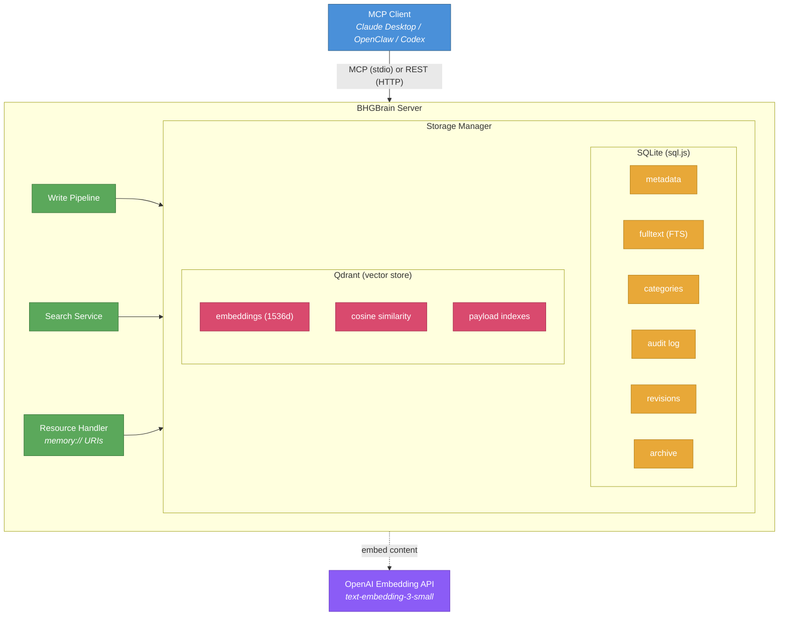
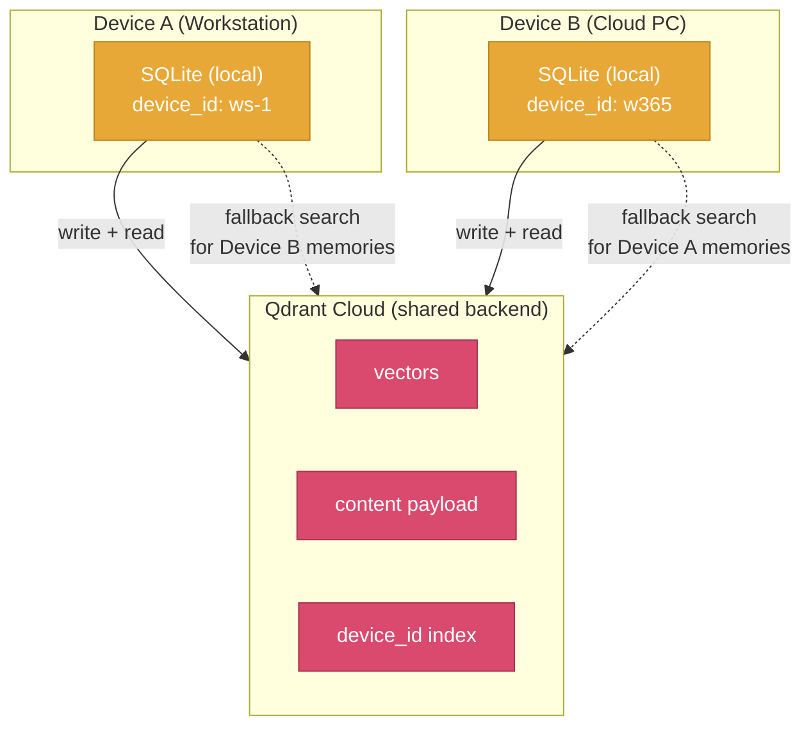
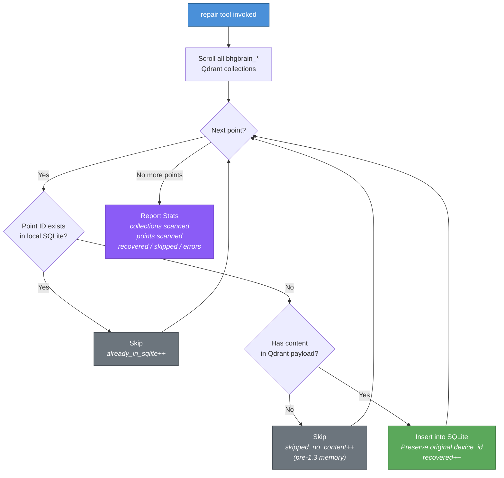
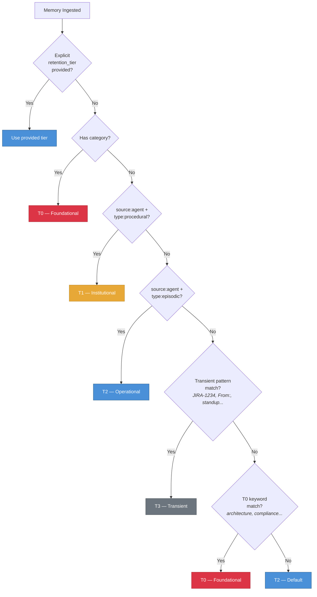
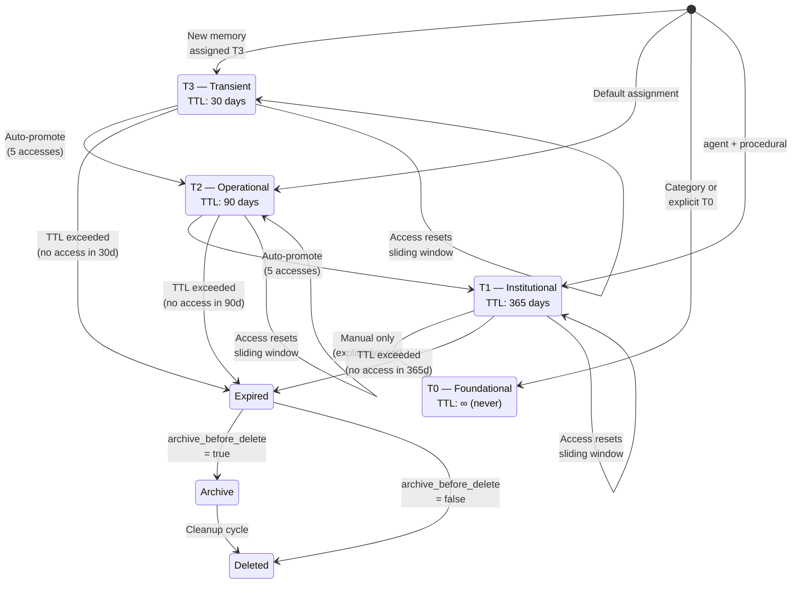
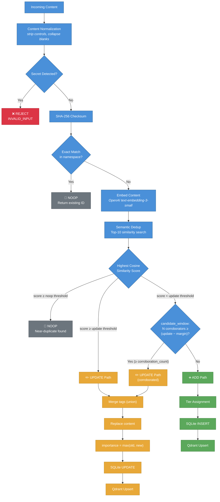
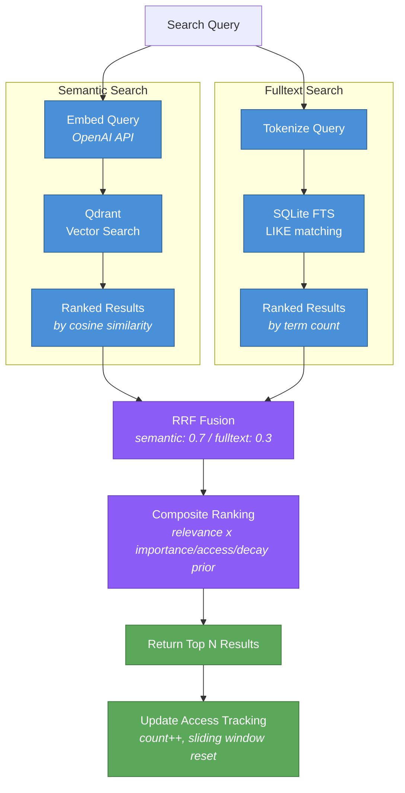
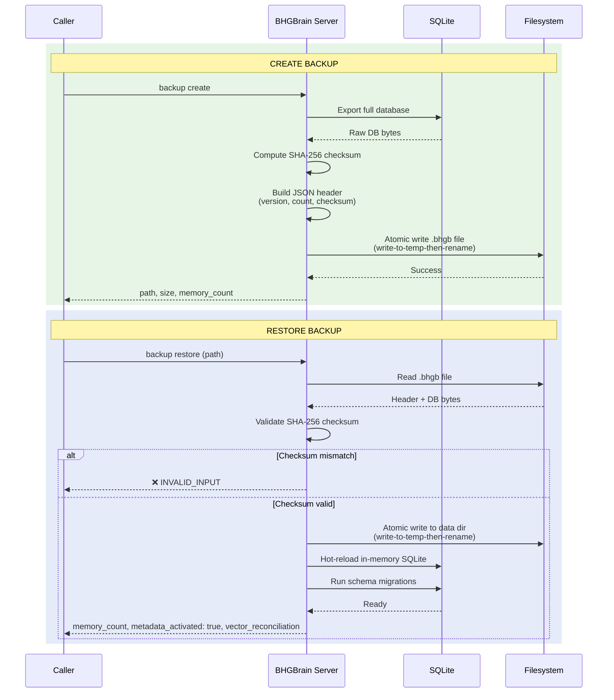

# BHGBrain

Persistentes, vektorbasiertes Gedächtnis für MCP-Clients (Claude, Codex, OpenClaw usw.).

BHGBrain speichert Erinnerungen in SQLite (Metadaten + Volltextsuche) und Qdrant (semantische Vektoren) und stellt sie über das Model Context Protocol (MCP) per stdio bereit, ergänzt um eine REST-API über HTTP. Es ist darauf ausgelegt, KI-Agenten ein dauerhaftes, durchsuchbares Zweitgehirn zu geben, das sitzungsübergreifend bestehen bleibt – mit vollständiger Lebenszyklusverwaltung, automatischer Deduplizierung, gestufter Aufbewahrung und Hybridsuche.

---

## Inhaltsverzeichnis

1. [Überblick & Architektur](#überblick--architektur)
2. [Voraussetzungen](#voraussetzungen)
3. [Qdrant-Einrichtung](#qdrant-einrichtung)
4. [Installation](#installation)
5. [Konfiguration](#konfiguration)
6. [Umgebungsvariablen](#umgebungsvariablen)
7. [Server starten](#server-starten)
8. [MCP-Client-Konfiguration](#mcp-client-konfiguration)
9. [Multi-Device-Speicher](#multi-device-speicher)
   - [Funktionsweise](#funktionsweise)
   - [Geräteidentitätsauflösung](#geräteidentitätsauflösung)
   - [Gemeinsames Qdrant, lokales SQLite](#gemeinsames-qdrant-lokales-sqlite)
   - [Reparatur und Wiederherstellung](#reparatur-und-wiederherstellung)
   - [Migration des Einbettungsmodells](#migration-des-einbettungsmodells)
10. [Speicherverwaltung](#speicherverwaltung)
    - [Speicher-Datenmodell](#speicher-datenmodell)
    - [Speichertypen](#speichertypen)
    - [Namensräume und Sammlungen](#namensräume-und-sammlungen)
    - [Aufbewahrungsstufen](#aufbewahrungsstufen)
    - [Stufenlebenszyklus – Zuweisung, Beförderung, Gleitendes Fenster](#stufenlebenszyklus--zuweisung-beförderung-gleitendes-fenster)
    - [Deduplizierung](#deduplizierung)
    - [Inhaltsnormalisierung](#inhaltsnormalisierung)
    - [Wichtigkeitsbewertung](#wichtigkeitsbewertung)
    - [Kategorien – Persistente Richtlinien-Slots](#kategorien--persistente-richtlinien-slots)
    - [Verfall, Bereinigung und Archivierung](#verfall-bereinigung-und-archivierung)
    - [Warnungen vor Ablauf](#warnungen-vor-ablauf)
    - [Ressourcenlimits und Kapazitätsbudgets](#ressourcenlimits-und-kapazitätsbudgets)
11. [Suche](#suche)
    - [Semantische Suche](#semantische-suche)
    - [Volltextsuche](#volltextsuche)
    - [Hybridsuche](#hybridsuche)
    - [Recall vs. Search – Unterschiede](#recall-vs-search--unterschiede)
    - [Filterung](#filterung)
    - [Score-Schwellenwerte und Stufenverstärkungen](#score-schwellenwerte-und-stufenverstärkungen)
12. [Sicherung & Wiederherstellung](#sicherung--wiederherstellung)
13. [Gesundheitszustand & Metriken](#gesundheitszustand--metriken)
14. [Sicherheit](#sicherheit)
15. [MCP-Ressourcen](#mcp-ressourcen)
16. [MCP-Prompts](#mcp-prompts)
17. [Bootstrap-Prompt](#bootstrap-prompt)
18. [CLI-Referenz](#cli-referenz)
19. [MCP-Tools-Referenz](#mcp-tools-referenz)
20. [Upgrade](#upgrade)
21. [Verhaltenshinweise](#verhaltenshinweise)

---

## Überblick & Architektur

BHGBrain ist ein persistenter Speicherserver, der auf dem Model Context Protocol aufbaut. Er speichert alles, was KI-Agenten sitzungsübergreifend lernen, entscheiden und beobachten – und macht dieses Wissen per semantischem Recall, Volltextsuche und eingebettetem Kontext verfügbar.

### Dual-Store-Architektur


```mermaid
graph TD
    subgraph Client["MCP Client<br/><i>Claude Desktop / OpenClaw / Codex</i>"]
    end

    Client -->|"MCP (stdio) or REST (HTTP)"| Server

    subgraph Server["BHGBrain Server"]
        WP["Write Pipeline"]
        SS["Search Service"]
        RH["Resource Handler<br/><i>memory:// URIs</i>"]

        subgraph Storage["Storage Manager"]
            subgraph SQLite["SQLite (sql.js)"]
                S1["metadata"]
                S2["fulltext (FTS)"]
                S3["categories"]
                S4["audit log"]
                S5["revisions"]
                S6["archive"]
            end
            subgraph Qdrant["Qdrant (vector store)"]
                Q1["embeddings (1536d)"]
                Q2["cosine similarity"]
                Q3["payload indexes"]
            end
        end

        WP --> Storage
        SS --> Storage
        RH --> Storage
    end

    Server -.->|"embed content"| OpenAI["OpenAI Embedding API<br/><i>text-embedding-3-small</i>"]

    classDef client fill:#4a90d9,stroke:#2c5f8a,color:#fff
    classDef server fill:#f0f4f8,stroke:#4a90d9,color:#333
    classDef component fill:#5ba85b,stroke:#3d7a3d,color:#fff
    classDef sqlite fill:#e8a838,stroke:#b8841c,color:#fff
    classDef qdrant fill:#d94a6e,stroke:#a83050,color:#fff
    classDef external fill:#8b5cf6,stroke:#6d3fc4,color:#fff

    class Client client
    class WP,SS,RH component
    class S1,S2,S3,S4,S5,S6 sqlite
    class Q1,Q2,Q3 qdrant
    class OpenAI external
```

- **SQLite** (über `sql.js`, im Arbeitsspeicher mit periodischem atomarem Flush auf die Festplatte) ist das **System of Record** für alle Speicher-Metadaten, den Volltextsuchindex, Kategorien, das Audit-Protokoll, den Revisionsverlauf und Archivdatensätze.
- **Qdrant** enthält semantische Vektoreinbettungen für die Ähnlichkeitssuche. Qdrant wird stets nach einem erfolgreichen SQLite-Schreibvorgang beschrieben; Fehler werden über das Flag `vector_synced` verfolgt und im Health-Endpunkt angezeigt.
- **OpenAI text-embedding-3-small** (Standard, konfigurierbar) erzeugt 1536-dimensionale Einbettungen für jede Erinnerung.
- **Atomare Schreibvorgänge** stellen sicher, dass Datenbankdateien niemals teilweise geschrieben werden – alle Festplatten-I/O-Vorgänge nutzen das Prinzip Schreiben-in-Temp-dann-Umbenennen.
- **Verzögerter Flush** bündelt Metadaten-Updates zum Zugriffsverhalten (bis zu 5 Sekunden), um pro Anfrage ausgelöste Datenbank-Flushes auf leselastigen Pfaden zu vermeiden.

---

## Voraussetzungen

| Anforderung | Version | Hinweise |
|---|---|---|
| Node.js | ≥ 20.0.0 | LTS empfohlen |
| Qdrant | ≥ 1.10 | Muss vor dem Start von BHGBrain laufen. Der mitgelieferte Client (`@qdrant/js-client-rest` `~1.19.0`) ruft die in Qdrant 1.10 eingeführte `query`-API auf; ältere Server schlagen bei der semantischen Suche fehl. |
| OpenAI API-Schlüssel | — | Für Einbettungen (`text-embedding-3-small` standardmäßig). Der Server startet im Degraded-Modus, wenn er fehlt. |

---

## Qdrant-Einrichtung

BHGBrain **erfordert eine externe Qdrant-Instanz**. Auch im Standard-`embedded`-Modus verbindet sich der Server mit `http://localhost:6333` – es ist kein gebündeltes Qdrant-Binary enthalten. Sie müssen es selbst betreiben.

### Option A: Docker (empfohlen)

```bash
docker run -d \
  --name qdrant \
  --restart unless-stopped \
  -p 6333:6333 \
  -v qdrant_storage:/qdrant/storage \
  qdrant/qdrant
```

Prüfen, ob Qdrant läuft:

```bash
curl http://localhost:6333/health
# → {"title":"qdrant - vector search engine","version":"..."}
```

### Option B: Docker Compose

```yaml
services:
  qdrant:
    image: qdrant/qdrant
    restart: unless-stopped
    ports:
      - "6333:6333"
    volumes:
      - qdrant_storage:/qdrant/storage

volumes:
  qdrant_storage:
```

### Option C: Natives Binary

Herunterladen von [https://github.com/qdrant/qdrant/releases](https://github.com/qdrant/qdrant/releases) und ausführen:

```bash
./qdrant
```

### Option D: Qdrant Cloud (externer Modus)

Setzen Sie `qdrant.mode` in Ihrer Konfiguration auf `external` und verweisen Sie `external_url` auf die URL Ihres Cloud-Clusters. Setzen Sie `qdrant.api_key_env` auf den Namen der Umgebungsvariable, die Ihren Qdrant API-Schlüssel enthält.

```jsonc
{
  "qdrant": {
    "mode": "external",
    "external_url": "https://your-cluster.cloud.qdrant.io",
    "api_key_env": "QDRANT_API_KEY"
  }
}
```

---

## Installation

```bash
git clone https://github.com/Big-Hat-Group-Inc/BHGBrain.git
cd BHGBrain
npm install
npm run build
```

Zur globalen Installation als CLI:

```bash
npm install -g .
bhgbrain --help
```

---

## Konfiguration

BHGBrain lädt seine Konfiguration aus:

- **Windows:** `%LOCALAPPDATA%\BHGBrain\config.json`
- **Linux/macOS:** `~/.bhgbrain/config.json`

Die Datei wird beim ersten Start automatisch mit allen Standardwerten erstellt. Bearbeiten Sie sie, um das Verhalten anzupassen. Sie können beim Serverstart auch einen benutzerdefinierten Konfigurationspfad mit `--config=<Pfad>` angeben.

### Vollständige Konfigurationsreferenz

```jsonc
{
  // Datenverzeichnis (absoluter Pfad). Standardmäßig plattformspezifischer Ort.
  "data_dir": null,

  // Geräteidentität für Multi-Device-Setups (siehe Abschnitt Multi-Device-Speicher)
  "device": {
    // Stabiler Gerätebezeichner. Wird automatisch aus dem Hostnamen generiert, wenn nicht angegeben.
    // Muster: ^[a-zA-Z0-9._-]{1,64}$
    // Kann auch über die Umgebungsvariable BHGBRAIN_DEVICE_ID gesetzt werden.
    "id": null
  },

  // Konfiguration des Einbettungsanbieters
  "embedding": {
    // Derzeit wird nur "openai" unterstützt
    "provider": "openai",
    // OpenAI-Modell für Einbettungen. Muss eines der unterstützten Modelle sein:
    // "text-embedding-ada-002", "text-embedding-3-small", "text-embedding-3-large".
    // Ein nicht unterstütztes Modell führt beim Start zu einem Konfigurationsfehler.
    "model": "text-embedding-3-small",
    // Name der Umgebungsvariable mit dem OpenAI API-Schlüssel
    "api_key_env": "OPENAI_API_KEY",
    // Vektordimensionen des Modells. Muss mit der Modellausgabe übereinstimmen.
    // WICHTIG: Eine Änderung nach dem Erstellen von Sammlungen erfordert deren Neuerstellung.
    "dimensions": 1536,
    // Jeder Vektor wird beim Schreiben mit einer anbieterqualifizierten Identität
    // (`<provider>/<model>@<dimensions>`) gestempelt. Weicht die vom Store erwartete
    // Identität (beim ersten Schreiben nach dem Start übernommen) von dieser
    // Konfiguration ab — z. B. nach einem Provider- oder Modellwechsel —, degradiert
    // die `embedding`-Health-Komponente, und solange dieses Flag `true` ist, werden
    // vektorproduzierende Schreibvorgänge mit einem Fehler abgelehnt, der auf den
    // Re-Embed-Modus des `repair`-Tools verweist. Nur auf `false` setzen, wenn
    // Schreibvorgänge absichtlich Einbettungsräume mischen sollen. Siehe
    // „Migration des Einbettungsmodells" unten.
    "refuse_writes_on_model_mismatch": true
  },

  // Qdrant-Verbindungskonfiguration
  "qdrant": {
    // "embedded" = Verbindung zu localhost:6333
    // "external" = Verbindung zu external_url (Qdrant Cloud, Remote-Instanz usw.)
    "mode": "embedded",
    // Wird nur im Embedded-Modus verwendet (derzeit ungenutzt – Qdrant muss extern gestartet werden)
    "embedded_path": "./qdrant",
    // Externe Qdrant-URL (wird verwendet wenn mode = "external")
    "external_url": null,
    // Name der Umgebungsvariable mit dem Qdrant API-Schlüssel (wird verwendet wenn mode = "external")
    "api_key_env": null
  },

  // Transport-Konfiguration
  "transport": {
    "http": {
      // HTTP-Transport aktivieren
      "enabled": true,
      // Host zum Binden. Verwenden Sie 127.0.0.1 nur für Loopback (Standard, sicher).
      // Nicht-Loopback erfordert, dass BHGBRAIN_TOKEN gesetzt ist (oder allow_unauthenticated_http).
      "host": "127.0.0.1",
      // Port, auf dem gehört werden soll
      "port": 3721,
      // Name der Umgebungsvariable mit dem Bearer-Token für HTTP-Authentifizierung
      "bearer_token_env": "BHGBRAIN_TOKEN"
    },
    "stdio": {
      // MCP stdio-Transport aktivieren
      "enabled": true
    }
  },

  // Standardwerte, die angewendet werden, wenn Aufrufer keine Angaben machen
  "defaults": {
    // Standard-Namensraum für alle Operationen
    "namespace": "global",
    // Standard-Sammlung für alle Operationen
    "collection": "general",
    // Standard-Ergebnislimit für Recall-Operationen
    "recall_limit": 5,
    // Standard-Mindestscore für semantische Ähnlichkeit (0-1) beim Recall
    "min_score": 0.6,
    // Maximale Anzahl automatisch eingebetteter Erinnerungen
    "auto_inject_limit": 10,
    // Maximale Zeichenanzahl in Tool-Antwort-Payloads
    "max_response_chars": 50000,
    // Obergrenze pro Namespace für Erinnerungen mit pinned: true (siehe
    // remember/tag und die memory://inject-Dokumentation)
    "pin_limit_per_namespace": 20
  },

  // Einstellungen für Aufbewahrung und Lebenszyklus von Erinnerungen
  "retention": {
    // Tage ohne Zugriff, nach denen eine Erinnerung als Stale-Kandidat gilt
    "decay_after_days": 180,
    // Maximale SQLite-Datenbankgröße in Gigabyte, bevor der Gesundheitsstatus auf degraded wechselt
    "max_db_size_gb": 2,
    // Maximale Gesamtanzahl an Erinnerungen, bevor der Gesundheitsstatus auf over-capacity wechselt
    "max_memories": 500000,
    // Prozentsatz von max_memories, ab dem der Gesundheitsstatus auf degraded wechselt
    "warn_at_percent": 80,

    // TTL pro Stufe in Tagen (null = läuft nie ab)
    "tier_ttl": {
      "T0": null,    // Grundlegend: läuft nie ab
      "T1": 365,     // Institutionell: 1 Jahr ohne Zugriff
      "T2": 90,      // Operativ: 90 Tage ohne Zugriff
      "T3": 30       // Transient: 30 Tage ohne Zugriff
    },

    // Kapazitätsbudgets pro Stufe (null = unbegrenzt)
    "tier_budgets": {
      "T0": null,      // Kein Limit für grundlegendes Wissen
      "T1": 100000,    // 100k institutionelle Erinnerungen
      "T2": 200000,    // 200k operative Erinnerungen
      "T3": 200000     // 200k transiente Erinnerungen
    },

    // Zugriffsanzahl, ab der eine Erinnerung automatisch eine Stufe aufsteigt
    "auto_promote_access_threshold": 5,

    // Wenn true, setzt jeder Zugriff die TTL-Uhr zurück (gleitendes Fenster)
    "sliding_window_enabled": true,

    // Wenn true, werden abgelaufene Erinnerungen vor dem Löschen in die Archivtabelle geschrieben
    "archive_before_delete": true,

    // Cron-Zeitplan für den Hintergrund-Bereinigungsauftrag (Standard: täglich 2 Uhr UTC)
    "cleanup_schedule": "0 2 * * *",

    // Wenn true, führt der Serverprozess `cleanup_schedule` automatisch über einen
    // internen Scheduler aus (derselbe Ausführungspfad wie `bhgbrain gc`). Auf false
    // setzen, um sich nur auf manuelle `bhgbrain gc`-Läufe oder einen externen
    // Cron-Trigger zu verlassen.
    "scheduled_cleanup_enabled": true,

    // Tage vor Ablauf, ab denen Erinnerungen als expiring_soon markiert werden
    "pre_expiry_warning_days": 7,

    // Qdrant-Segment-Kompaktierungsschwelle (kompaktieren, wenn dieser Anteil eines Segments gelöscht ist)
    "compaction_deleted_threshold": 0.10
  },

  // Deduplizierungseinstellungen
  "deduplication": {
    // Semantische Deduplizierung beim Schreiben aktivieren
    "enabled": true,
    // Cosinus-Ähnlichkeitsschwelle, ab der neuer Inhalt als UPDATE eines vorhandenen Inhalts gilt.
    // Stufenspezifische Anpassungen werden zusätzlich angewendet (siehe Abschnitt Deduplizierung unten).
    "similarity_threshold": 0.92,
    // Wie viele der 10 abgerufenen Ähnlichkeitskandidaten der Klassifikator für die
    // Korroboration prüft (1-10; NOOP/DELETE/direktes UPDATE verwenden immer nur den nächsten).
    "candidate_window": 5,
    // Unabhängiger Ausschalter für den unten beschriebenen Korroborationspfad; false stellt
    // die Klassifikation vor der Erweiterung (nur einzelner Kandidat) wieder her,
    // unabhängig von den anderen drei Einstellungen hier.
    "corroboration_enabled": true,
    // Mindestanzahl der Fensterkandidaten (einschließlich des nächsten), die innerhalb von
    // corroboration_margin des Update-Schwellenwerts liegen müssen, um ADD zu UPDATE zu eskalieren.
    "corroboration_count": 2,
    // Wie weit ein Kandidat unter dem Update-Schwellenwert liegen darf und trotzdem
    // zur Korroboration zählt.
    "corroboration_margin": 0.03
  },

  // Suchkonfiguration
  "search": {
    // Gewichtungen für Reciprocal Rank Fusion (RRF) im Hybrid-Modus
    // Müssen sich zu 1.0 summieren
    "hybrid_weights": {
      "semantic": 0.7,
      "fulltext": 0.3
    },
    // Composite-Ranking: ordnet Ergebnisse nach Relevanz x einem Prior aus
    // Wichtigkeit, Zugriffshäufigkeit und stufenabhängigem Recency-Decay
    // (siehe "Composite Ranking" unten). enabled: false stellt die reine
    // Relevanz-Reihenfolge wieder her (Verhalten vor dem Ranking).
    "ranking": {
      "enabled": true,
      "w_importance": 0.3,
      "w_access": 0.2,
      "access_norm": 50,
      // Täglicher exponentieller Decay-Satz pro Retention-Stufe. T0 ist 0 (verfällt nie).
      "decay_per_day": {
        "T0": 0,
        "T1": 0.002,
        "T2": 0.008,
        "T3": 0.02
      }
    },
    // Optionale LLM-Rerank-Stufe, nur für `recall` (siehe "Rerank" unten).
    // Standardmäßig deaktiviert: sendet bei Aktivierung die Anfrage und den
    // Text jedes Kandidaten an das konfigurierte LLM zur Relevanzbewertung,
    // ersetzt `score` (nie `semantic_score`, daher bleibt die min_score-
    // Filterung unberührt) für bewertete Kandidaten. Erfordert einen eigenen
    // BHGBRAIN_RERANK_API_KEY.
    "rerank": {
      "enabled": false,
      "provider": "openai",
      // Wie viele der (bereits gerankten) Kandidaten von `recall` pro Aufruf
      // an das LLM gesendet werden. 1-50.
      "candidate_pool": 20,
      "model": "gpt-4o-mini",
      "model_env": "BHGBRAIN_RERANK_API_KEY",
      // Jeder Fehler (Timeout, Non-2xx, fehlerhafte Antwort) fällt auf die
      // Reihenfolge vor dem Rerank zurück, statt den recall-Aufruf fehlschlagen zu lassen.
      "timeout_ms": 3000
    },
    // Maximal Marginal Relevance-Diversitäts-Neuordnung, angewendet nach dem
    // Composite Ranking (siehe "MMR-Diversitäts-Neuordnung" unten).
    // enabled: false stellt exakt die reine Composite-Relevanz-Reihenfolge wieder her.
    "mmr": {
      "enabled": true,
      "lambda": 0.7,
      "candidate_pool_multiplier": 3,
      "candidate_pool_cap": 50
    },
    // Multi-Query-Expansion: semantische Suche/Recall embedden und durchsuchen
    // mehr als eine Repräsentation der Anfrage und mergen Kandidaten anhand
    // der ID (der höhere Score gewinnt), bevor das Ranking greift (siehe
    // "Multi-Query-Expansion" unten).
    "query_expansion": {
      "enabled": true,
      // Obergrenze der insgesamt durchsuchten Varianten (Original +
      // Stoppwort-bereinigt + LLM-generiert), unabhängig von
      // llm_paraphrase.variant_count.
      "max_variants": 2,
      // Deterministische, modellfreie Variante: die Anfrage ohne englische
      // Stoppwörter, zusätzlich zum Original durchsucht, sofern sie sich
      // unterscheidet und nicht leer ist.
      "keyword_stripped": true,
      // Optionale, modellgestützte Variantengenerierung. Standardmäßig aus:
      // dies ist die erste Live-Pfad-LLM-Chat-Abhängigkeit und fügt pro
      // Aufruf Latenz/Kosten hinzu.
      "llm_paraphrase": {
        "enabled": false,
        // "paraphrase": formuliert die Anfrage um. "hyde": generiert eine
        // hypothetische Antwort-Passage und embedded diese stattdessen
        // (kann Recall verbessern, auf Kosten möglicher halluzinierter
        // Details — siehe README unten).
        "mode": "paraphrase",
        "variant_count": 2,
        // Timeout für die Chat-Completion-Anfrage; jeder Fehlschlag
        // (Timeout, Nicht-2xx, fehlender Key) degradiert stillschweigend
        // zu den modellfreien Varianten oben.
        "timeout_ms": 3000
      }
    }
  },

  // Sicherheitseinstellungen
  "security": {
    // Nicht-Loopback-HTTP-Bindungen standardmäßig ablehnen (fail-closed)
    "require_loopback_http": true,
    // Unauthentifiziertes externes HTTP explizit zulassen (protokolliert eine deutliche Warnung)
    "allow_unauthenticated_http": false,
    // Token-Werte in strukturierten Logs redigieren
    "log_redaction": true,
    // Maximale Anfragen pro Minute pro Client-IP für den HTTP-Transport
    "rate_limit_rpm": 100,
    // Maximale HTTP-Anfrage-Body-Größe in Bytes
    "max_request_size_bytes": 1048576,
    // Express-Einstellung "trust proxy". false (Standard) = req.ip ist der direkte
    // Socket-Peer (Loopback-genau); true = X-Forwarded-For vom vorgeschalteten
    // Reverse-Proxy berücksichtigen. Nur hinter einem vertrauenswürdigen Proxy aktivieren.
    "trust_proxy": false
  },

  // Auto-Inject-Payload-Budget (für memory://inject und memory://inject/{hint})
  "auto_inject": {
    // Budgetmenge, interpretiert gemäß budget_unit unten
    "max_chars": 30000,
    // Token-Budget (null = unbegrenzt, Zeichenbudget gilt)
    "max_tokens": null,
    // Anteil des Budgets, der für den Erinnerungsabschnitt reserviert ist,
    // damit Kategorieninhalt nicht mehr das gesamte Payload verbrauchen
    // kann, bevor eine einzige Erinnerung injiziert wird. 0 stellt das
    // bisherige Verhalten wieder her, bei dem Kategorien das gesamte
    // Budget nutzen können.
    "memory_budget_fraction": 0.4,
    // 'chars' (Standard): max_chars ist ein Zeichenbudget, unverändert
    // gegenüber vor dieser Option. 'tokens': max_chars wird als
    // geschätztes Token-Budget behandelt (Zeichen/4, keine
    // Tokenizer-Abhängigkeit), wodurch das effektive Zeichenbudget jedes
    // Abschnitts mit 4 multipliziert wird.
    "budget_unit": "chars",
    // Gierige Near-Duplicate-Unterdrückung innerhalb des hint-basierten
    // Erinnerungsabschnitts: Ein Kandidat, der deduplication.similarity_threshold
    // gegenüber einer bereits ausgewählten Erinnerung überschreitet, wird übersprungen.
    // Angepinnte Erinnerungen sind in beide Richtungen davon ausgenommen.
    "dedup_suppression": true,
    // Ob angepinnte Erinnerungen immer im Erinnerungsabschnitt enthalten sind
    // (siehe defaults.pin_limit_per_namespace sowie den Parameter `pinned`
    // von remember/tag). false deaktiviert diesen Schritt vollständig; die
    // Pin-Obergrenze wird unabhängig davon weiterhin beim Schreiben durchgesetzt.
    "pinned_enabled": true
  },

  // Observability-Einstellungen
  "observability": {
    // In-Process-Metrikenerfassung aktivieren
    "metrics_enabled": false,
    // Strukturiertes JSON-Logging verwenden (via pino)
    "structured_logging": true,
    // Log-Level: "debug" | "info" | "warn" | "error"
    "log_level": "info"
  },

  // Ingestion-Pipeline-Einstellungen
  "pipeline": {
    // LLM-gestützte Multi-Kandidaten-Extraktion aktivieren: teilt mehrfaktigen
    // `remember`-Inhalt vor Dedup/Schreiben in atomare Kandidaten-Erinnerungen auf.
    // Standard false — bewusst opt-in, da die Aktivierung einen LLM-Aufruf
    // (Kosten + Latenz) bei jedem ausreichend langen `remember` verursacht. Wenn
    // false, oder wenn kein API-Schlüssel aufgelöst wird, erzeugt die Extraktion
    // immer genau einen Kandidaten (heutiges Verhalten).
    "extraction_enabled": false,
    // Chat-Completions-Modell für die Extraktion
    "extraction_model": "gpt-4o-mini",
    // Name der Umgebungsvariable für den API-Schlüssel des Extraktionsmodells; Fallback auf OPENAI_API_KEY
    "extraction_model_env": "BHGBRAIN_EXTRACTION_API_KEY",
    // Inhalt kürzer als dies (Zeichen) überspringt den LLM-Aufruf und geht direkt
    // zur Einzelkandidaten-Extraktion
    "extraction_min_chars": 120,
    // Kandidaten über dieser Grenze werden verworfen (nicht zusammengeführt), protokolliert und gezählt
    "extraction_max_candidates": 6,
    // Timeout für die Extraktionsanfrage in Millisekunden, per AbortController erzwungen
    "extraction_timeout_ms": 4000,
    // Wenn true, Fallback auf Prüfsummen- + Volltext-Ähnlichkeits-Deduplizierung, falls Einbettung nicht verfügbar
    "fallback_to_threshold_dedup": true,
    // Aktiviert eine optionale LLM-gestützte Zusammenfassungsstufe: ein günstiger
    // Chat-Completion-Aufruf erzeugt das `summary`-Feld der Erinnerung statt des
    // kostenlosen, eingebauten extraktiven Summarizers. Standard false — wie bei
    // der Extraktion ist dies ein neuer externer Aufruf mit Kosten-/Latenz-
    // Auswirkungen, bewusst opt-in. Jeder Fehlschlag (fehlender Schlüssel,
    // Nicht-2xx, Timeout, Netzwerkfehler) fällt für diesen Schreibvorgang auf die
    // extraktive Stufe zurück; die Zusammenfassung blockiert oder verhindert nie
    // einen `remember`-/`revert`-Aufruf.
    "summarization_enabled": false,
    // Chat-Completions-Modell für die Zusammenfassung
    "summarization_model": "gpt-4o-mini",
    // Name der Umgebungsvariable für den API-Schlüssel des Zusammenfassungsmodells.
    // Standardmäßig dieselbe Variable wie extraction_model_env (beide sind
    // günstige Modellaufrufe im Schreibpfad gegen dasselbe OpenAI-Konto) — bei
    // Bedarf auf eine andere Variable für einen separaten Schlüssel verweisen.
    "summarization_model_env": "BHGBRAIN_EXTRACTION_API_KEY",
    // Timeout für die Zusammenfassungsanfrage in Millisekunden, per AbortController erzwungen
    "summarization_timeout_ms": 3000
  },

  // Steuert die Qualitätsstufe zur Erzeugung des `summary`-Felds jeder Erinnerung.
  // true (Standard): ein abhängigkeitsfreier extraktiver Summarizer bewertet
  // jeden Satz im Inhalt nach Termhäufigkeit und wählt den repräsentativsten aus
  // (mit Fallback auf die obige LLM-Stufe, wenn pipeline.summarization_enabled
  // true ist und sie erfolgreich antwortet). false: der günstigste mögliche Weg —
  // summary ist einfach die erste Zeile des Inhalts, auf 120 Zeichen gekürzt —
  // unabhängig von pipeline.summarization_enabled.
  "auto_summarize": true
}
```

---

## Umgebungsvariablen

| Variable | Erforderlich | Standard | Beschreibung |
|---|---|---|---|
| `OPENAI_API_KEY` | Ja (für Einbettungen) | — | OpenAI API-Schlüssel. Der Server startet im **Degraded-Modus**, wenn er fehlt – semantische Suche und Ingestion schlagen fehl, Volltextsuche und Kategorie-Lesezugriffe funktionieren weiterhin. |
| `BHGBRAIN_TOKEN` | Erforderlich für nicht-Loopback-HTTP | — | Bearer-Token für HTTP-Authentifizierung. Der Server **verweigert den Start**, wenn der Host nicht Loopback ist und dieser Wert nicht gesetzt ist (außer `allow_unauthenticated_http: true`). |
| `QDRANT_API_KEY` | Erforderlich für Qdrant Cloud | — | Setzen Sie `qdrant.api_key_env` in der Konfiguration auf den Namen dieser Variable. Der Standard-Konfigurationsfeldname ist `QDRANT_API_KEY`. |
| `BHGBRAIN_DEVICE_ID` | Nein | Automatisch aus dem Hostnamen generiert | Überschreibt den Gerätebezeichner für Multi-Device-Setups. Siehe [Geräteidentitätsauflösung](#geräteidentitätsauflösung). |
| `BHGBRAIN_EXTRACTION_API_KEY` | Nein | Fällt auf `OPENAI_API_KEY` zurück | API-Schlüssel für das LLM-Extraktionsmodell, verwendet wenn `pipeline.extraction_enabled` auf `true` steht. Auch der Standardwert von `pipeline.summarization_model_env` (verwendet wenn `pipeline.summarization_enabled` auf `true` steht) — auf eine andere Variable verweisen, wenn ein separater Schlüssel für die Zusammenfassung gewünscht ist. Wird auch von der LLM-Paraphrase/HyDE-Phase der Multi-Query-Expansion gelesen (`search.query_expansion.llm_paraphrase.enabled`, siehe [Multi-Query-Expansion](#multi-query-expansion)), die den Schlüssel auf dieselbe Weise aus `pipeline.extraction_model_env` auflöst und bei fehlender Variable auf `OPENAI_API_KEY` zurückfällt. |
| `BHGBRAIN_RERANK_API_KEY` | Nein | — (**kein** Fallback auf `OPENAI_API_KEY`) | API-Schlüssel für die optionale `recall`-Rerank-Stufe, verwendet wenn `search.rerank.enabled` auf `true` steht. Anders als `BHGBRAIN_EXTRACTION_API_KEY` gibt es hier keinen impliziten Fallback — die Aktivierung des Reranking ist ein bewusster, separat verschlüsselter Opt-in, der nie stillschweigend das Embedding- oder Extraktions-Budget verbraucht. Siehe [Rerank](#rerank). |

Sicheres Bearer-Token generieren:

```bash
bhgbrain server token
# oder ohne die CLI:
node -e "console.log(require('crypto').randomBytes(32).toString('hex'))"
```

---

## Server starten

### stdio-Modus (MCP über stdin/stdout)

Dies ist der Standardmodus für MCP-Clients wie Claude Desktop. Das Flag `--stdio` fordert explizit den stdio-Transport an.

```bash
# Entwicklung (kein Build erforderlich)
npm run dev

# Produktion über CLI
node dist/index.js --stdio

# Mit einer benutzerdefinierten Konfigurationsdatei
node dist/index.js --stdio --config=/path/to/config.json
```

### HTTP-Modus

> Dieser Transport spricht echtes MCP über HTTP — den **Streamable-HTTP**-Transport
> unter `/mcp`, sodass mehrere MCP-Clients einen einzigen, dauerhaft laufenden
> Serverprozess teilen können — zusätzlich zu einer schlichten REST-API
> (`POST /tool/:name`, `GET /resource`) für Skripte, Health-Probes und die CLI. Siehe
> „MCP-Client-Konfiguration", um einen Streamable-HTTP-fähigen Client auf `/mcp`
> zeigen zu lassen.

HTTP ist standardmäßig auf `127.0.0.1:3721` aktiviert. Setzen Sie `BHGBRAIN_TOKEN` vor dem Start, wenn Sie authentifizierten Zugriff wünschen:

```bash
export OPENAI_API_KEY=sk-...
export BHGBRAIN_TOKEN=<your-token>
node dist/index.js
```

Der Server hört standardmäßig auf `http://127.0.0.1:3721`. Verfügbare HTTP-Endpunkte:

| Endpunkt | Authentifizierung erforderlich | Beschreibung |
|---|---|---|
| `GET /health` | Nein | Gesundheitsprüfung (unauthentifiziert für Probe-Kompatibilität) |
| `POST /mcp` | Ja | MCP Streamable HTTP: JSON-RPC-Anfragen; eine `initialize`-Anfrage eröffnet eine neue Sitzung |
| `GET /mcp` | Ja | MCP Streamable HTTP: eigenständiger SSE-Kanal für eine bestehende Sitzung |
| `DELETE /mcp` | Ja | MCP Streamable HTTP: beendet eine Sitzung |
| `POST /tool/:name` | Ja | REST-Komfortschicht: benanntes MCP-Tool direkt aufrufen |
| `GET /resource?uri=...` | Ja | REST-Komfortschicht: MCP-Ressource direkt per URI lesen |
| `GET /metrics` | Ja | Metriken im Prometheus-Format (wenn `metrics_enabled: true`) |

Jede `/mcp`-Sitzung ist ein frischer, In-Memory-MCP-Server, der denselben zugrunde
liegenden Speicher wie jede andere Sitzung und die REST-Endpunkte nutzt — ein Neustart
des Prozesses verwirft alle Sitzungen, und spezifikationskonforme Clients
initialisieren sich automatisch neu.

Beispiel Gesundheitsprüfung:

```bash
curl http://127.0.0.1:3721/health
```

Beispiel Tool-Aufruf über HTTP:

```bash
curl -X POST http://127.0.0.1:3721/tool/remember \
  -H "Authorization: Bearer <your-token>" \
  -H "Content-Type: application/json" \
  -d '{"content": "Our auth service uses JWT with 1h expiry", "type": "semantic", "tags": ["auth", "architecture"]}'
```

---

## MCP-Client-Konfiguration

### Claude Desktop (`claude_desktop_config.json`)

```json
{
  "mcpServers": {
    "bhgbrain": {
      "command": "node",
      "args": ["C:/path/to/BHGBrain/dist/index.js"],
      "env": {
        "OPENAI_API_KEY": "sk-..."
      }
    }
  }
}
```

### Claude Desktop (global installierte CLI)

```json
{
  "mcpServers": {
    "bhgbrain": {
      "command": "bhgbrain",
      "args": ["server", "start"],
      "env": {
        "OPENAI_API_KEY": "sk-..."
      }
    }
  }
}
```

### OpenClaw / mcporter (Streamable-HTTP-Transport)

Der HTTP-Server von BHGBrain spricht echtes MCP unter `/mcp` über den
**Streamable-HTTP**-Transport (siehe „HTTP-Modus") — starten Sie den Server einmal und
richten Sie jeden MCP-Client auf dieselbe URL, sodass sie sich einen dauerhaft
laufenden Prozess und ein SQLite-/Qdrant-Backend teilen, statt dass jeder Client sein
eigenes isoliertes `--stdio`-Kindprozess startet:

```json
{
  "mcpServers": {
    "bhgbrain": {
      "transport": "http",
      "url": "http://127.0.0.1:3721/mcp",
      "headers": {
        "Authorization": "Bearer <your-token>"
      }
    }
  }
}
```

Starten Sie zuerst den Server (`node dist/index.js` oder `bhgbrain server start`) mit
`BHGBRAIN_TOKEN` auf denselben Wert gesetzt wie im obigen Header.

#### stdio-Transport (Alternative: pro Client ein Prozess)

Clients, die nur stdio unterstützen (oder die keinen laufenden Server teilen dürfen),
können weiterhin ihr eigenes `bhgbrain-server --stdio`-Kindprozess starten. Das wird
vollständig unterstützt, allerdings erhält jeder Client, der dies tut, einen eigenen,
isolierten Prozess — kein Zustand wird mit anderen Clients geteilt, bis er nach
SQLite/Qdrant durchgeschrieben wird.

```json
{
  "mcpServers": {
    "bhgbrain": {
      "transport": "stdio",
      "command": "bhgbrain-server",
      "args": ["--stdio"],
      "env": {
        "OPENAI_API_KEY": "sk-...",
        "QDRANT_API_KEY": "..."
      }
    }
  }
}
```

Oder gegen ein Quellcode-Checkout statt der global installierten Binärdatei:

```json
{
  "mcpServers": {
    "bhgbrain": {
      "transport": "stdio",
      "command": "node",
      "args": ["/pfad/zu/BHGBrain/dist/index.js", "--stdio"],
      "env": {
        "OPENAI_API_KEY": "sk-...",
        "QDRANT_API_KEY": "..."
      }
    }
  }
}
```

> **OpenClaw läuft in WSL oder einem Container mit dem stdio-Transport?** BHGBrain
> muss in derselben Umgebung installiert sein. stdio bedeutet, dass der Client den
> Server als Kindprozess startet — der Server kann also nicht in einer separaten
> Distribution oder einem separaten Container liegen. Der Streamable-HTTP-Transport
> oben umgeht dieses Problem vollständig — richten Sie Clients in jeder Umgebung auf
> dieselbe URL `http://host:3721/mcp`. Um Speicher stattdessen über getrennte
> Serverinstanzen hinweg zu teilen, geben Sie jeder Installation ihre eigene
> SQLite-Datenbank und richten Sie alle auf denselben Qdrant-Cluster aus (siehe
> „Multi-Device-Speicher").

---

## Multi-Device-Speicher

BHGBrain unterstützt den Betrieb mehrerer Instanzen auf verschiedenen Maschinen (z. B. eine primäre Workstation und eine Cloud-Entwicklungsumgebung), die dasselbe Qdrant-Cloud-Backend teilen. Jede Instanz pflegt ihre eigene lokale SQLite-Datenbank und liest von einem gemeinsamen Vektorspeicher und schreibt in diesen.

### Funktionsweise


```mermaid
graph TD
    subgraph DevA["Device A (Workstation)"]
        SA["SQLite (local)<br/>device_id: ws-1"]
    end

    subgraph DevB["Device B (Cloud PC)"]
        SB["SQLite (local)<br/>device_id: w365"]
    end

    SA -->|"write + read"| QC
    SB -->|"write + read"| QC

    subgraph QC["Qdrant Cloud (shared backend)"]
        V["vectors"]
        CP["content payload"]
        DI["device_id index"]
    end

    SA -.->|"fallback search<br/>for Device B memories"| QC
    SB -.->|"fallback search<br/>for Device A memories"| QC

    classDef device fill:#4a90d9,stroke:#2c5f8a,color:#fff
    classDef sqlite fill:#e8a838,stroke:#b8841c,color:#fff
    classDef qdrant fill:#d94a6e,stroke:#a83050,color:#fff

    class SA,SB sqlite
    class V,CP,DI qdrant
```

Jeder Speicherschreibvorgang speichert den vollständigen Inhalt sowohl in SQLite (lokal) als auch im Qdrant-Payload (gemeinsam). Das bedeutet:

- **Kein Single Point of Failure**: Wenn die SQLite-Datenbank eines Geräts verloren geht, kann der Inhalt aus Qdrant wiederhergestellt werden.
- **Geräteübergreifende Sichtbarkeit**: Alle Geräte sehen alle Erinnerungen über Qdrant, auch wenn ihr lokales SQLite nur eine Teilmenge enthält.
- **Herkunftsverfolgung**: Jede Erinnerung wird mit der `device_id` der Instanz getaggt, die sie erstellt hat.

### Geräteidentitätsauflösung

Jede BHGBrain-Instanz löst beim Start eine stabile `device_id` auf, wobei folgende Prioritätsreihenfolge gilt:

1. **Umgebungsvariable**: `BHGBRAIN_DEVICE_ID` — hat Vorrang vor einem persistierten Wert, entsprechend dem "Umgebungsvariablen gewinnen"-Vertrag, der für jeden anderen `BHGBRAIN_*`-Override gilt (siehe [Konfiguration vs. Umgebung](#konfiguration)). Überschreibt sie ein zuvor persistiertes `device.id`, wird der neue Wert erneut persistiert.
2. **Explizite/persistierte Konfiguration**: Feld `device.id` in `config.json`
3. **Automatisch generiert**: Abgeleitet von `os.hostname()`, in Kleinbuchstaben umgewandelt und auf `[a-zA-Z0-9._-]` bereinigt

Beim ersten Start wird die aufgelöste ID in `config.json` persistiert, damit sie über Neustarts hinweg stabil bleibt, auch wenn sich der Hostname später ändert. `config.json` wird nur neu geschrieben, wenn die Geräte-ID neu generiert oder durch einen Umgebungsvariablen-Override geändert wurde — ein Start im stabilen Zustand mit bereits persistierter, unveränderter ID schreibt nicht.

```jsonc
// config.json — device-Abschnitt
{
  "device": {
    "id": "cpc-kevin-98f91"   // automatisch aus dem Hostnamen generiert, oder explizit gesetzt
  }
}
```

Die `device_id` erscheint in:
- Jedem Qdrant-Payload (als schlüsselwort-indiziertes Feld)
- Jedem SQLite-Erinnerungsdatensatz
- Suchergebnissen (damit Aufrufer identifizieren können, welches Gerät eine Erinnerung erstellt hat)

### Gemeinsames Qdrant, lokales SQLite

Jedes Gerät pflegt seine eigene SQLite-Datenbank unabhängig. Es gibt kein Synchronisationsprotokoll zwischen Geräten — Qdrant ist die gemeinsame Schicht.

**Was jedes Gerät sieht:**

| Quelle | Gerät A sieht | Gerät B sieht |
|---|---|---|
| Erinnerungen von Gerät A (über lokales SQLite) | ✅ Vollständiger Datensatz | ❌ Nicht im lokalen SQLite |
| Erinnerungen von Gerät A (über Qdrant-Fallback) | ✅ Vollständiger Datensatz | ✅ Inhalt aus Qdrant-Payload |
| Erinnerungen von Gerät B (über lokales SQLite) | ❌ Nicht im lokalen SQLite | ✅ Vollständiger Datensatz |
| Erinnerungen von Gerät B (über Qdrant-Fallback) | ✅ Inhalt aus Qdrant-Payload | ✅ Vollständiger Datensatz |

Wenn eine Suche eine Erinnerung zurückgibt, die in Qdrant existiert, aber nicht im lokalen SQLite, konstruiert BHGBrain das Ergebnis aus dem Qdrant-Payload, anstatt es stillschweigend zu verwerfen. Das bedeutet, dass beide Geräte vollständige Suchergebnisse erhalten, unabhängig davon, welches Gerät die Erinnerung erstellt hat.

### Reparatur und Wiederherstellung


```mermaid
flowchart TD
    START["repair tool invoked"] --> SCROLL["Scroll all bhgbrain_*<br/>Qdrant collections"]
    SCROLL --> LOOP{"Next point?"}
    LOOP -->|Yes| CHECK{"Point ID exists<br/>in local SQLite?"}
    CHECK -->|Yes| SKIP1["Skip<br/><i>already_in_sqlite++</i>"]
    SKIP1 --> LOOP
    CHECK -->|No| CONTENT{"Has content<br/>in Qdrant payload?"}
    CONTENT -->|No| SKIP2["Skip<br/><i>skipped_no_content++</i><br/><i>(pre-1.3 memory)</i>"]
    SKIP2 --> LOOP
    CONTENT -->|Yes| INSERT["Insert into SQLite<br/><i>Preserve original device_id</i><br/><i>recovered++</i>"]
    INSERT --> LOOP
    LOOP -->|"No more points"| REPORT["Report Stats<br/><i>collections scanned</i><br/><i>points scanned</i><br/><i>recovered / skipped / errors</i>"]

    classDef start fill:#4a90d9,stroke:#2c5f8a,color:#fff
    classDef skip fill:#6c757d,stroke:#495057,color:#fff
    classDef recover fill:#5ba85b,stroke:#3d7a3d,color:#fff
    classDef report fill:#8b5cf6,stroke:#6d3fc4,color:#fff

    class START start
    class SKIP1,SKIP2 skip
    class INSERT recover
    class REPORT report
```

Das `repair`-Tool rekonstruiert die lokale SQLite-Datenbank eines Geräts aus Qdrant. Verwenden Sie es nach:

- Einrichtung eines neuen Geräts, das ein bestehendes Qdrant-Backend teilt
- Wiederherstellung nach SQLite-Datenverlust
- Migration auf eine neue Maschine

```json
// Vorschau, was wiederhergestellt würde (keine Änderungen)
{ "dry_run": true }

// Alle Erinnerungen aus Qdrant in lokales SQLite wiederherstellen
{ "dry_run": false }

// Nur Erinnerungen eines bestimmten Geräts wiederherstellen
{ "device_id": "cpc-kevin-98f91", "dry_run": false }
```

Das repair-Tool:
- Durchläuft alle Punkte über alle `bhgbrain_*` Qdrant-Sammlungen
- Fügt jede Erinnerung mit `content` in ihrem Qdrant-Payload, die im lokalen SQLite fehlt, ein
- Bewahrt die ursprüngliche `device_id`-Herkunft (oder taggt mit der lokalen Geräte-ID, falls keine vorhanden)
- Berichtet: durchsuchte Sammlungen, durchsuchte Punkte, wiederhergestellt, übersprungen (kein Inhalt), Fehler

**Hinweis**: Erinnerungen, die vor dem Feature Content-in-Qdrant gespeichert wurden (vor 1.3), haben keinen Inhalt in ihrem Qdrant-Payload und können nicht über repair wiederhergestellt werden. Nur Metadaten (Tags, Typ, Wichtigkeit) bleiben für diese Einträge erhalten.

### Migration des Einbettungsmodells

Jeder Vektor wird beim Schreiben mit einer anbieterqualifizierten Identität versehen —
`<provider>/<model>@<dimensions>` (z. B. `openai/text-embedding-3-small@1536`) — sowohl
in der SQLite-Zeile als auch im Qdrant-Payload. Der Store merkt sich diese Identität
zusätzlich als Erwartung, die beim ersten Schreibvorgang nach dem Start übernommen wird.

Grund dafür: Das Mischen von Einbettungsräumen ist eine stille Korruption. Wenn Sie
`embedding.provider` oder `embedding.model` in `config.json` bei gleichbleibender
Dimensionalität ändern (z. B. Wechsel zu einer Azure-Deployment derselben Modellfamilie),
erkennt dies auf Qdrant-Ebene nichts — neue Vektoren landen in derselben Sammlung wie
alte, Kosinus-Ähnlichkeit zwischen den beiden Räumen ist bedeutungslos, und sowohl die
Recall-Relevanz als auch die Deduplizierung (die Scores des nächsten Kandidaten und
des Kandidatenfensters, die in die 0.92/0.98-Schwellenwerte einfließen) verschlechtern sich still. Eine Dimensionsänderung
schlägt stattdessen laut mit einem kryptischen Qdrant-Fehler fehl; die Herkunfts-Stempel
machen beide Fälle laut und handlungsfähig.

**Ablauf nach einer Modelländerung:**

1. Beim nächsten Start (oder Health-Check) stimmt die erwartete Identität des Stores
   nicht mehr mit der aktiven Konfiguration überein. Die `embedding`-Health-Komponente
   wird degradiert mit einer Meldung, die beide Identitäten nennt, und eine strukturierte
   `embedding_identity_mismatch`-Warnung wird geloggt.
2. Solange `embedding.refuse_writes_on_model_mismatch` auf `true` steht (Standard),
   schlagen vektorproduzierende Schreibvorgänge (remember, tag-getriggerte
   Re-Embeddings, Restore-Reconciliation) mit einem handlungsfähigen
   `CONFLICT`-Fehler fehl, der auf den Re-Embed-Pfad verweist. Lesevorgänge
   funktionieren weiter — Recall und Search bedienen weiterhin die alten Vektoren,
   nur mit degradiertem Health-Status.
3. Migration durchführen:

   ```bash
   bhgbrain repair --re-embed              # veraltete Stempel migrieren
   bhgbrain repair --re-embed --dry-run    # Vorschau, wie viele Zeilen betroffen wären
   bhgbrain repair --re-embed --include-legacy   # auch Zeilen ohne jeden Stempel einbeziehen
   ```

   Oder über das `repair`-MCP-Tool mit `mode: "re-embed"` (siehe
   [MCP-Tools-Referenz](#mcp-tools-referenz)). Die Migration embedded betroffene
   Erinnerungen in begrenzten, fortsetzbaren Batches — der Stempel selbst ist der
   Fortschrittsmarker, sodass ein unterbrochener Lauf ohne Wiederholung bereits
   abgeschlossener Zeilen fortgesetzt werden kann, und ein einzelner
   Embed/Upsert-Fehler wird isoliert statt den ganzen Batch abzubrechen.
4. Sobald keine veralteten Stempel mehr übrig sind, aktualisiert sich die erwartete
   Identität des Stores automatisch, und die `embedding`-Degradation verschwindet —
   ohne Neustart.

**Hinweise:**
- Alte Zeilen, die vor der Herkunfts-Stempelung geschrieben wurden, haben keinen
  Stempel (`null`) und gelten als „unbekannt" — sie werden beim Re-Embed
  ausgeschlossen, sofern nicht `--include-legacy` / `include_legacy: true`
  übergeben wird, damit ein erstes Upgrade nicht überraschend ein vollständiges
  Re-Embedding des gesamten Bestands (und dessen Embedding-API-Kosten) auslöst.
- Re-Embedding wird immer vom Betreiber ausgelöst — nie automatisch, da es die
  kostenpflichtige Embedding-API einmal pro migrierter Erinnerung aufruft.
- Setzen Sie `embedding.refuse_writes_on_model_mismatch` nur dann auf `false`,
  wenn Sie absichtlich zulassen möchten, dass Schreibvorgänge fortfahren und
  Einbettungsräume mischen (z. B. ein bewusstes, überwachtes Migrationsfenster) —
  der Stempel dokumentiert weiterhin, was passiert ist.
- Archivierte Erinnerungen werden nie neu eingebettet; ihre Vektoren sind bereits
  absichtlich entfernt (siehe [Verfall, Bereinigung und Archivierung](#verfall-bereinigung-und-archivierung)).

### Multi-Device-Konfigurationsbeispiel

**Gerät A** (`config.json`):
```jsonc
{
  "device": { "id": "workstation" },
  "qdrant": {
    "mode": "external",
    "external_url": "https://your-cluster.cloud.qdrant.io",
    "api_key_env": "QDRANT_API_KEY"
  }
}
```

**Gerät B** (`config.json`):
```jsonc
{
  "device": { "id": "cloud-pc" },
  "qdrant": {
    "mode": "external",
    "external_url": "https://your-cluster.cloud.qdrant.io",
    "api_key_env": "QDRANT_API_KEY"
  }
}
```

Beide verweisen auf denselben Qdrant-Cluster. Jedes erhält seine eigene `device_id`. Alle Erinnerungen fließen in dieselben Vektorsammlungen und sind für beide Instanzen sichtbar.

---

## Speicherverwaltung

Dieser Abschnitt beschreibt den vollständigen Speicherlebenszyklus – von der Aufnahme über die Klassifizierung, Deduplizierung, Zugriffsverfolgung, Beförderung, Verfall bis hin zum endgültigen Ablauf oder zur dauerhaften Aufbewahrung.

### Speicher-Datenmodell

Jede in BHGBrain gespeicherte Erinnerung ist ein `MemoryRecord` mit folgenden Feldern:

| Feld | Typ | Beschreibung |
|---|---|---|
| `id` | `string (UUID)` | Global eindeutiger Bezeichner |
| `namespace` | `string` | Scoping-Namensraum (z. B. `"global"`, `"project/alpha"`, `"user/kevin"`) |
| `collection` | `string` | Untergruppe innerhalb eines Namensraums (z. B. `"general"`, `"architecture"`, `"decisions"`) |
| `type` | `"episodic" \| "semantic" \| "procedural"` | Speichertyp (siehe Speichertypen) |
| `category` | `string \| null` | Kategoriename, wenn diese Erinnerung an eine persistente Richtlinienkategorie gebunden ist |
| `content` | `string` | Der vollständige Speicherinhalt (bis zu 100.000 Zeichen) |
| `summary` | `string` | Automatisch generierte Zusammenfassung der ersten Zeile (bis zu 120 Zeichen) |
| `tags` | `string[]` | Freie Tags (alphanumerisch + Bindestriche, max. 20 Tags, max. 100 Zeichen je Tag) |
| `source` | `"cli" \| "api" \| "agent" \| "import"` | Wie die Erinnerung erstellt wurde |
| `checksum` | `string` | SHA-256-Hash des normalisierten Inhalts (wird für exakte Deduplizierung verwendet) |
| `embedding` | `number[]` | Vektoreinbettung (nicht in SQLite gespeichert; liegt in Qdrant) |
| `importance` | `number (0–1)` | Wichtigkeitsbewertung (Standard 0.5) |
| `retention_tier` | `"T0" \| "T1" \| "T2" \| "T3"` | Lebenszyklusstufe, die TTL und Bereinigungsverhalten steuert |
| `expires_at` | `string (ISO 8601) \| null` | Ablaufzeitstempel (null für T0 – läuft nie ab) |
| `decay_eligible` | `boolean` | Ob die Erinnerung an der TTL-Bereinigung teilnimmt (false für T0) |
| `review_due` | `string (ISO 8601) \| null` | T1-Überprüfungsdatum (gesetzt auf created_at + 365 Tage; bei Zugriff zurückgesetzt) |
| `access_count` | `number` | Anzahl der Abrufe dieser Erinnerung |
| `last_accessed` | `string (ISO 8601)` | Zeitstempel des letzten Abrufs |
| `last_operation` | `"ADD" \| "UPDATE" \| "DELETE" \| "NOOP"` | Zuletzt angewendeter Schreibvorgang |
| `merged_from` | `string \| null` | ID der Erinnerung, aus der diese zusammengeführt wurde (Deduplizierungs-UPDATE-Pfad) |
| `archived` | `boolean` | Ob diese Erinnerung soft-archiviert ist (von Suche/Recall ausgeschlossen) |
| `vector_synced` | `boolean` | Ob der Qdrant-Vektor mit dem SQLite-Zustand synchron ist |
| `pinned` | `boolean` | Ob diese Erinnerung immer in `memory://inject`-Payloads enthalten ist, begrenzt durch `defaults.pin_limit_per_namespace`; hat keine Auswirkung auf `search`/`recall` |
| `device_id` | `string \| null` | Bezeichner der BHGBrain-Instanz, die diese Erinnerung erstellt hat (siehe [Multi-Device-Speicher](#multi-device-speicher)) |
| `created_at` | `string (ISO 8601)` | Erstellungszeitstempel |
| `updated_at` | `string (ISO 8601)` | Letzter Aktualisierungszeitstempel |
| `last_accessed` | `string (ISO 8601)` | Letzter Abrufzeitstempel |

#### SQLite-Schema

Die Tabelle `memories` verfügt über umfassende Indizes für effizientes Filtern:

```sql
CREATE INDEX idx_memories_namespace   ON memories(namespace);
CREATE INDEX idx_memories_collection  ON memories(namespace, collection);
CREATE INDEX idx_memories_checksum    ON memories(namespace, checksum);
CREATE INDEX idx_memories_type        ON memories(namespace, type);
CREATE INDEX idx_memories_category    ON memories(category);
CREATE INDEX idx_memories_tier        ON memories(namespace, collection, retention_tier);
CREATE INDEX idx_memories_expiry      ON memories(decay_eligible, expires_at);
CREATE INDEX idx_memories_review_due  ON memories(retention_tier, review_due);
CREATE INDEX idx_memories_archived    ON memories(archived);
CREATE INDEX idx_memories_vector_sync ON memories(vector_synced);
CREATE INDEX idx_memories_pinned      ON memories(namespace, pinned);
```

#### Qdrant-Payload-Indizes

Jede Qdrant-Sammlung pflegt folgende Payload-Indizes für effizientes vektorseitiges Filtern:

- `namespace` (Schlüsselwort)
- `type` (Schlüsselwort)
- `retention_tier` (Schlüsselwort)
- `decay_eligible` (Boolean)
- `expires_at` (Integer – gespeichert als Unix-Epoch-Sekunden)
- `device_id` (Schlüsselwort)

---

### Speichertypen

Jede Erinnerung wird einem von drei semantischen Typen zugeordnet. Der Typ wird für die Filterung bei Recall und Suche verwendet und beeinflusst die bei der Aufnahme zugewiesene Standard-Aufbewahrungsstufe.

| Typ | Bedeutung | Typische Inhalte | Standard-Stufe |
|---|---|---|---|
| `episodic` | Ein spezifisches Ereignis, eine Beobachtung oder ein Vorfall zu einem bestimmten Zeitpunkt | Besprechungsergebnisse, Debugging-Sitzungen, Aufgabenkontext, was während eines Sprints passiert ist | `T2` (operativ) |
| `semantic` | Eine Tatsache, ein Konzept oder ein Wissenselement, das nicht an einen bestimmten Zeitpunkt gebunden ist | Wie ein System funktioniert, was ein Begriff bedeutet, ein Konfigurationswert, ein Datenmodell | `T2` (operativ) |
| `procedural` | Ein Prozess, ein Arbeitsablauf oder eine Schritt-für-Schritt-Anleitung | Runbooks, Deployment-Schritte, Codierungsstandards, Vorgehensweisen bei Aufgaben | `T1` (institutionell) |

**Wie der Typ die Stufenzuweisung beeinflusst:**
- `source: agent` + `type: procedural` → automatisch `T1` (institutionell) zugewiesen
- `source: agent` + `type: episodic` → automatisch `T2` (operativ) zugewiesen
- `source: cli` (beliebiger Typ) → automatisch `T2` (operativ) zugewiesen
- `source: import` mit T0-Inhaltssignalen → `T0` unabhängig vom Typ

Wenn Sie keinen Typ angeben, verwendet die Pipeline standardmäßig `"semantic"`.

---

### Namensräume und Sammlungen

**Namensräume** sind übergeordnete Scoping-Bezeichner, die Erinnerungen aus verschiedenen Kontexten, Benutzern oder Projekten voneinander isolieren. Alle Tool-Operationen erfordern einen Namensraum (Standard: `"global"`).

- Namensraum-Muster: `^[a-zA-Z0-9/-]{1,200}$` – alphanumerische Zeichen, Bindestriche und Schrägstriche
- Beispiele: `"global"`, `"project/alpha"`, `"user/kevin"`, `"tenant/acme-corp"`
- Erinnerungen in verschiedenen Namensräumen werden in gegenseitigen Suchen niemals zurückgegeben
- Jedes Namensraum+Sammlungs-Paar wird einer eigenen Qdrant-Sammlung zugeordnet (benannt `bhgbrain_{namespace}_{collection}`)

**Sammlungen** sind Untergruppen innerhalb eines Namensraums. Sie ermöglichen es, Erinnerungen nach Thema oder Zweck zu partitionieren, ohne vollständig getrennte Namensräume zu erstellen.

- Sammlungs-Muster: `^[a-zA-Z0-9-]{1,100}$`
- Beispiele: `"general"`, `"architecture"`, `"decisions"`, `"onboarding"`
- Sammlungen werden in der SQLite-Tabelle `collections` mit ihrem Einbettungsmodell und ihren Dimensionen verfolgt, die bei der Erstellung festgelegt werden – Sie können keine Einbettungsmodelle innerhalb einer Sammlung mischen
- Verwenden Sie das MCP-Tool `collections`, um Sammlungen aufzulisten, zu erstellen oder zu löschen

**Isolierungsgarantien:**
- SQLite-Abfragen filtern immer zuerst nach `namespace`
- Qdrant-Suchen enthalten einen `namespace`-Payload-Filter, auch wenn eine bestimmte Sammlung durchsucht wird
- Das Löschen einer Sammlung entfernt alle zugehörigen Erinnerungen aus sowohl SQLite als auch Qdrant

---

### Aufbewahrungsstufen

Jeder Erinnerung wird bei der Aufnahme eine **Aufbewahrungsstufe** zugewiesen, die ihren gesamten Lebenszyklus bestimmt – wie lange sie gespeichert bleibt, wie sie bereinigt wird, wie streng sie dedupliziert wird und ob sie jemals abläuft.

| Stufe | Bezeichnung | Standard-TTL | Verfallsberechtigt | Beispiele |
|---|---|---|---|---|
| `T0` | **Grundlegend** | Nie (dauerhaft) | Nein | Architektur-Referenzen, gesetzliche Anforderungen, Unternehmensrichtlinien, Compliance-Vorgaben, Buchhaltungsstandards, ADRs, Sicherheits-Runbooks |
| `T1` | **Institutionell** | 365 Tage seit letztem Zugriff | Ja (mit review_due-Verfolgung) | Software-Designentscheidungen, API-Verträge, Deployment-Runbooks, Codierungsstandards, Lieferantenvereinbarungen, prozedurales Wissen |
| `T2` | **Operativ** | 90 Tage seit letztem Zugriff | Ja | Projektstatus, Sprint-Entscheidungen, Besprechungsergebnisse, technische Untersuchungen, aktueller Aufgabenkontext |
| `T3` | **Transient** | 30 Tage seit letztem Zugriff | Ja | Trouble-Tickets, E-Mail-Zusammenfassungen, Tagesberichte, ad-hoc-Debugging-Sitzungen, kurzlebige Aufgabennotizen |

**Wesentliche Eigenschaften nach Stufe:**

- **T0**: `expires_at` ist immer `null`. `decay_eligible` ist immer `false`. T0-Erinnerungen können nicht automatisch bereinigt werden. Aktualisierungen von T0-Erinnerungen lösen einen Revisions-Snapshot in der Tabelle `memory_revisions` aus (append-only-Verlauf). T0-Erinnerungen verfallen im Composite Ranking nie (`decay_per_day.T0` ist standardmäßig `0`) und behalten so über alle Suchmodi hinweg einen dauerhaften Ranking-Vorteil.

- **T1**: `review_due` wird auf `created_at + 365 Tage` gesetzt und bei jedem Zugriff zurückgesetzt. Erinnerungen, die ihrem `expires_at` nahekommen, werden in den Suchergebnissen mit `expiring_soon: true` markiert.

- **T2**: Die Standard-Stufe für die meisten Erinnerungen. 90-Tage-Gleitfenster – jeder Zugriff setzt die TTL-Uhr zurück.

- **T3**: Die aggressivste Stufe. Per Mustererkennung identifizierte transiente Inhalte (Tickets, E-Mails, Standup-Notizen) werden automatisch hier eingestuft. 30-Tage-Gleitfenster.

**Kapazitätsbudgets:**

| Stufe | Standard-Budget | Hinweise |
|---|---|---|
| T0 | Unbegrenzt | Grundlegendes Wissen muss immer Platz finden |
| T1 | 100.000 | Institutionelles Wissen |
| T2 | 200.000 | Operative Erinnerungen |
| T3 | 200.000 | Transiente Erinnerungen |

Wenn ein Stufenbudget überschritten wird, meldet der Health-Endpunkt `degraded` und der Bereinigungsauftrag priorisiert diese Stufe im nächsten Zyklus.

---

### Stufenlebenszyklus – Zuweisung, Beförderung, Gleitendes Fenster

#### Stufenzuweisung

Die Stufenzuweisung erfolgt in der Schreibpipeline in dieser Prioritätsreihenfolge:

1. **Explizite Aufrufer-Überschreibung:** Wenn `retention_tier` an das Tool `remember` übergeben wird, wird dieser Wert bedingungslos verwendet.

2. **Kategoriebasiert:** Wenn die Erinnerung an eine Kategorie gebunden ist (über das Feld `category`), ist sie immer `T0`. Kategorien repräsentieren persistente Richtlinien-Slots und laufen nie ab.

3. **Quelle + Typ-Heuristiken:**
   - `source: agent` + `type: procedural` → `T1`
   - `source: agent` + `type: episodic` → `T2`
   - `source: cli` → `T2`

4. **Inhalts-Mustererkennung für transiente Signale (→ T3):**
   - Jira/Ticket-Referenzen: `JIRA-1234`, `incident-456`, `case-789`
   - E-Mail-Metadaten: `From:`, `Subject:`, `fw:`, `re:`
   - Zeitliche Marker: `today`, `this week`, `by friday`, `standup`, `meeting minutes`, `action items`
   - Quartalreferenzen: `Q1 2026`, `Q3 2025`

5. **T0-Schlüsselwortsignale (→ T0 für Importe):**
   Wenn `source: import` und der Inhalt oder die Tags eines der folgenden enthält:
   `architecture`, `design decision`, `adr`, `rfc`, `contract`, `schema`, `legal`, `compliance`, `policy`, `standard`, `accounting`, `security`, `runbook`
   → wird `T0` zugewiesen.

6. **T0-Schlüsselwortsignale (→ T0 für alle Quellen):**
   Die gleichen T0-Schlüsselwörter werden für alle Quellen geprüft (die T3-transienten Muster werden zuerst geprüft). Wenn ein T0-Schlüsselwort ohne transientes Muster übereinstimmt, ist die Erinnerung `T0`.

7. **Standard:** `T2` – der sichere, nachsichtige Standard.


```mermaid
flowchart TD
    START["Memory Ingested"] --> Q1{"Explicit<br/>retention_tier<br/>provided?"}
    Q1 -->|Yes| USE["Use provided tier"]
    Q1 -->|No| Q2{"Has category?"}
    Q2 -->|Yes| T0A["T0 — Foundational"]
    Q2 -->|No| Q3{"source:agent +<br/>type:procedural?"}
    Q3 -->|Yes| T1A["T1 — Institutional"]
    Q3 -->|No| Q4{"source:agent +<br/>type:episodic?"}
    Q4 -->|Yes| T2A["T2 — Operational"]
    Q4 -->|No| Q5{"Transient pattern<br/>match?<br/><i>JIRA-1234, From:, standup...</i>"}
    Q5 -->|Yes| T3A["T3 — Transient"]
    Q5 -->|No| Q6{"T0 keyword<br/>match?<br/><i>architecture, compliance...</i>"}
    Q6 -->|Yes| T0B["T0 — Foundational"]
    Q6 -->|No| T2B["T2 — Default"]

    classDef t0 fill:#dc3545,stroke:#a71d2a,color:#fff
    classDef t1 fill:#e8a838,stroke:#b8841c,color:#fff
    classDef t2 fill:#4a90d9,stroke:#2c5f8a,color:#fff
    classDef t3 fill:#6c757d,stroke:#495057,color:#fff
    classDef decision fill:#f0f4f8,stroke:#4a90d9,color:#333

    class T0A,T0B t0
    class T1A t1
    class T2A,T2B,USE t2
    class T3A t3
```

#### Bei Zuweisung berechnete Stufenmetadaten

```typescript
{
  retention_tier: "T2",               // zugewiesene Stufe
  expires_at: "2026-06-14T12:00:00Z", // created_at + TTL-Tage
  decay_eligible: true,               // false nur für T0
  review_due: null                    // nur für T1 gesetzt
}
```

Für T1-Erinnerungen wird `review_due` auf `created_at + tier_ttl.T1` (Standard 365 Tage) gesetzt und bei jedem Abruf zurückgesetzt.

#### Automatische Beförderung bei Zugriff

Wenn eine Erinnerung in Stufe `T2` oder `T3` den Zugriffsschwellenwert (`auto_promote_access_threshold`, Standard 5) erreicht, wird sie automatisch eine Stufe befördert:

- `T3` → `T2`
- `T2` → `T1`

Eine automatische Beförderung zu `T0` ist nicht möglich. Das manuelle Hochstufen auf `T0` ist möglich, indem `retention_tier: "T0"` bei einem nachfolgenden `remember`-Aufruf übergeben wird (was den UPDATE-Pfad auslöst) oder über die CLI `bhgbrain tier set <id> T0`.

Beförderung ist **monoton** – eine automatische Rückstufung findet nie statt. Eine Stufenrückstufung erfordert eine explizite Benutzeraktion.

Wenn eine Erinnerung befördert wird, wird ihr `expires_at` aus der TTL der neuen Stufe neu berechnet, wobei der aktuelle Zeitstempel als Gleitfenster-Ankerpunkt verwendet wird.


```mermaid
stateDiagram-v2
    [*] --> T3: New memory<br/>assigned T3

    T3: T3 — Transient<br/>TTL: 30 days
    T2: T2 — Operational<br/>TTL: 90 days
    T1: T1 — Institutional<br/>TTL: 365 days
    T0: T0 — Foundational<br/>TTL: ∞ (never)

    T3 --> T2: Auto-promote<br/>(5 accesses)
    T2 --> T1: Auto-promote<br/>(5 accesses)
    T1 --> T0: Manual only<br/>(explicit tier set)

    T3 --> Expired: TTL exceeded<br/>(no access in 30d)
    T2 --> Expired: TTL exceeded<br/>(no access in 90d)
    T1 --> Expired: TTL exceeded<br/>(no access in 365d)

    T3 --> T3: Access resets<br/>sliding window
    T2 --> T2: Access resets<br/>sliding window
    T1 --> T1: Access resets<br/>sliding window

    Expired --> Archive: archive_before_delete<br/>= true
    Expired --> Deleted: archive_before_delete<br/>= false
    Archive --> Deleted: Cleanup cycle

    [*] --> T2: Default assignment
    [*] --> T0: Category or<br/>explicit T0
    [*] --> T1: agent + procedural
```

#### Gleitende Fenster-Ablaufzeit

Wenn `sliding_window_enabled: true` (der Standard), setzt jeder erfolgreiche Abruf über `recall`, `search` oder `memory://inject` die TTL-Uhr zurück:

```
neues expires_at = max(aktuelles expires_at, jetzt + tier_ttl)
```

Das bedeutet: Eine aktiv genutzte Erinnerung läuft nie ab, während eine nie abgerufene Erinnerung ihre TTL erreicht und bereinigt wird. Erinnerungen, auf die kurz vor Ablauf einmalig zugegriffen wird, erhalten ab diesem Zugriff ein vollständiges neues TTL-Fenster.

Die Zugriffsverfolgung erfolgt gebündelt nach jeder Suche (bis zu 5 Sekunden verzögerter Flush), um synchrone Datenbankschreibvorgänge auf dem Lesepfad zu vermeiden.

---

### Deduplizierung

BHGBrain verhindert das Speichern doppelter oder nahezu doppelter Inhalte durch eine zweiphasige Deduplizierungspipeline.


```mermaid
flowchart TD
    A["Incoming Content"] --> B["Content Normalization<br/><i>strip controls, collapse blanks</i>"]
    B --> C{"Secret Detected?"}
    C -->|Yes| REJECT["❌ REJECT<br/>INVALID_INPUT"]
    C -->|No| D["SHA-256 Checksum"]
    D --> E{"Exact Match<br/>in namespace?"}
    E -->|Yes| NOOP1["🔄 NOOP<br/>Return existing ID"]
    E -->|No| F["Embed Content<br/><i>OpenAI text-embedding-3-small</i>"]
    F --> G["Semantic Dedup<br/>Top-10 similarity search"]
    G --> H{"Highest Cosine<br/>Similarity Score"}
    H -->|"score ≥ noop threshold"| NOOP2["🔄 NOOP<br/>Near-duplicate found"]
    H -->|"score ≥ update threshold"| UPD["✏️ UPDATE Path"]
    H -->|"score < update threshold"| WIN{"candidate_window:<br/>N corroborators ≥<br/>(update − margin)?"}
    WIN -->|"Yes (≥ corroboration_count)"| CORR["✏️ UPDATE Path<br/>(corroborated)"]
    WIN -->|"No"| ADD["➕ ADD Path"]

    UPD --> U1["Merge tags (union)"]
    CORR --> U1
    U1 --> U2["Replace content"]
    U2 --> U3["importance = max(old, new)"]
    U3 --> U4["SQLite UPDATE"]
    U4 --> U5["Qdrant Upsert"]

    ADD --> A1["Tier Assignment"]
    A1 --> A2["SQLite INSERT"]
    A2 --> A3["Qdrant Upsert"]

    classDef reject fill:#dc3545,stroke:#a71d2a,color:#fff
    classDef noop fill:#6c757d,stroke:#495057,color:#fff
    classDef update fill:#e8a838,stroke:#b8841c,color:#fff
    classDef add fill:#5ba85b,stroke:#3d7a3d,color:#fff
    classDef process fill:#4a90d9,stroke:#2c5f8a,color:#fff

    class REJECT reject
    class NOOP1,NOOP2 noop
    class UPD,CORR,U1,U2,U3,U4,U5 update
    class ADD,A1,A2,A3 add
    class A,B,C,D,E,F,G,H,WIN process
```

#### Phase 1: Exakte Deduplizierung (Prüfsumme)

Bevor eine Einbettung generiert wird, wird der normalisierte Inhalt mit SHA-256 gehasht. Wenn bereits eine Erinnerung mit demselben Namensraum und derselben Prüfsumme existiert (und nicht archiviert ist), gibt die Operation sofort `NOOP` zurück, ohne API-Aufrufe zu machen.

```
checksum = SHA-256(normalizeContent(content))
```

#### Phase 2: Semantische Deduplizierung (Vektorähnlichkeit)

Wenn keine exakte Übereinstimmung gefunden wird, wird der Inhalt eingebettet und die 10 ähnlichsten vorhandenen Erinnerungen in der Sammlung werden aus Qdrant abgerufen. Basierend auf Kosinus-Ähnlichkeitsscores und der zugewiesenen Stufe der Erinnerung wird eine von vier Entscheidungen getroffen:

| Entscheidung | Bedingung | Auswirkung |
|---|---|---|
| `NOOP` | Score des nächsten Kandidaten ≥ NOOP-Schwellenwert | Inhalt gilt als Duplikat; ID der vorhandenen Erinnerung wird ohne Schreibvorgang zurückgegeben |
| `DELETE` | Score des nächsten Kandidaten ≥ UPDATE-Schwellenwert **und** der Inhalt macht die Übereinstimmung explizit ungültig (z. B. "nicht mehr wahr", "Korrektur:", "vergiss das") | Die vorhandene Erinnerung wird gelöscht und der Kandidat wird als neue Erinnerung gespeichert, die über `merged_from` darauf verweist |
| `DELETE` (opt-in) | Score des nächsten Kandidaten liegt im UPDATE-Band, die Phrasen-Heuristik oben hat **nicht** angeschlagen, `pipeline.contradiction_detection.enabled` ist `true`, und eine LLM-Entailment-Prüfung klassifiziert den Kandidaten relativ zur vorhandenen Erinnerung als `contradict` | Gleiche Wirkung wie das phrasenbasierte `DELETE` oben — die vorhandene Erinnerung wird gelöscht und der Kandidat wird als neue Erinnerung gespeichert, die über `merged_from` darauf verweist |
| `UPDATE` | Score des nächsten Kandidaten ≥ UPDATE-Schwellenwert | Inhalt ist eine Aktualisierung einer vorhandenen; Tags zusammenführen, Inhalt und Prüfsumme aktualisieren, ID beibehalten |
| `UPDATE` (korroboriert) | Score des nächsten Kandidaten < UPDATE-Schwellenwert, **aber** mindestens `deduplication.corroboration_count` Kandidaten innerhalb des Fensters der obersten `deduplication.candidate_window` (einschließlich des nächsten) erreichen ≥ `UPDATE-Schwellenwert − deduplication.corroboration_margin` | Mehrere nahezu identische Erinnerungen bilden unabhängig einen Cluster nahe dem Schwellenwert; Zusammenführung mit dem höchstbewerteten Kandidaten, genau wie bei einem direkten `UPDATE` |
| `ADD` | Score des nächsten Kandidaten < UPDATE-Schwellenwert und kein korroborierter Cluster gefunden | Wirklich neue Erinnerung; mit neuer UUID erstellen |

Das obige Diagramm zeigt die Pfade NOOP/UPDATE/ADD; DELETE ist eine Variante des UPDATE-Pfads, die ausgelöst wird, wenn entweder die phrasenbasierte Ungültigkeits-Heuristik anschlägt, oder (opt-in, siehe unten) eine LLM-Entailment-Prüfung einen Kandidaten im UPDATE-Band als Widerspruch zur vorhandenen Erinnerung klassifiziert. NOOP und DELETE werden immer ausschließlich anhand des nächsten Kandidaten entschieden — Korroboration gilt für sie nie (siehe "Kandidatenfenster und Korroboration" unten).

**Widerspruchserkennung (opt-in, standardmäßig aus):** Die obige Phrasen-Heuristik erkennt nur Kandidaten, die explizit sagen, dass sie eine Korrektur sind ("nicht mehr wahr", "Korrektur:", ...). Ein Kandidat zum gleichen Thema, der ohne eine dieser Phrasen widerspricht — z. B. "Wir sind zu Postgres migriert", wenn der Speicher bereits "wir verwenden MySQL" enthält — fällt stillschweigend durch zu `UPDATE`, und beide Fakten koexistieren. Wird `pipeline.contradiction_detection.enabled: true` gesetzt, schließt das diese Lücke: Für Kandidaten, die im UPDATE-Band landen *und* die Phrasen-Heuristik nicht bereits ausgelöst haben, macht die Pipeline einen einzigen LLM-Aufruf (unter Wiederverwendung der `pipeline.extraction_model` / `pipeline.extraction_model_env`-Zugangsdaten — keine separate Modell- oder API-Schlüssel-Konfiguration), der den Kandidaten relativ zur vorhandenen Erinnerung als `agree`, `refine` oder `contradict` klassifiziert. Nur `contradict` ändert das Verhalten und führt zum gleichen Lösch-und-Ersetzen-Pfad wie die Phrasen-Heuristik; `agree`/`refine` fallen beide durch zum bestehenden `UPDATE`-Merge, identisch zum heutigen Verhalten. Die Phrasen-Heuristik wird immer zuerst geprüft und bricht ohne LLM-Aufruf ab, sobald sie zutrifft, sodass explizite Korrekturen weiterhin kostenlos und sofort bleiben.

| `pipeline.contradiction_detection.*`-Feld | Standard | Bedeutung |
|---|---|---|
| `enabled` | `false` | Schaltet die LLM-Entailment-Prüfung für Schreibvorgänge im UPDATE-Band ein. Standardmäßig aus: keine Verhaltensänderung, keine zusätzliche Latenz/Kosten, bis ein Betreiber sich dafür entscheidet. |
| `timeout_ms` | `5000` | Obergrenze für den Entailment-Aufruf. Bei Timeout, Netzwerkfehler, Nicht-2xx-Antwort oder einer nicht parsbaren/nicht gelisteten Klassifikation greift die Pipeline auf den bisherigen Zustand zurück — sie verfährt genau so, als wäre die Funktion für diesen Schreibvorgang deaktiviert — und protokolliert eine `contradiction_check_degraded`-Warnung, statt den Schreibvorgang zu blockieren oder abzulehnen. |

**Abzuwägender Kompromiss vor der Aktivierung:** Die heutige Lücke ist ein falsch-negatives Ergebnis (ein echter Widerspruch bleibt unentdeckt; beide Erinnerungen bleiben bestehen, und eine spätere explizite Korrektur behebt es trotzdem). Eine fehlerhafte LLM-Klassifikation von `refine` als `contradict` ist ein falsch-positives Ergebnis, das stillschweigend eine Erinnerung löscht, die noch zutraf — und da Löschen-und-Ersetzen den Inhalt der gelöschten Erinnerung nicht in der Revisionshistorie bewahrt, ist dieser Verlust nicht trivial rückgängig zu machen. Die Prüfung ist konservativ formuliert (Temperatur 0, "nicht sicher → kein contradict") und ist deshalb standardmäßig deaktiviert; wer sie aktiviert, sollte diesen Kompromiss im Blick haben.

**Stufenspezifische Deduplizierungsschwellenwerte:**

Der Basis-`similarity_threshold` (Standard 0.92) wird pro Stufe angepasst, da T0/T1-Erinnerungen strengere Übereinstimmung erfordern (Beinahe-Duplikate können beabsichtigte Versionierung darstellen), und T3 aggressiver ist:

| Stufe | NOOP-Schwellenwert | UPDATE-Schwellenwert |
|---|---|---|
| `T0` | 0.98 | max(Basis, 0.95) |
| `T1` | 0.98 | max(Basis, 0.95) |
| `T2` | 0.98 | Basis (0.92) |
| `T3` | 0.95 | max(Basis, 0.90) |

**Kandidatenfenster und Korroboration:**

Die Qdrant-Ähnlichkeitssuche ruft bereits die obersten 10 Kandidaten ab, aber standardmäßig prüft der Klassifikator für NOOP/DELETE/direktes UPDATE nur den einzigen nächsten. Wenn dieser nächste Kandidat *unter* dem UPDATE-Schwellenwert liegt, prüft die Pipeline zusätzlich, ob mehrere andere Kandidaten unabhängig voneinander nahe demselben Schwellenwert clustern — mehrere Beinahe-Wiederholungen derselben Tatsache sollten zu einer Erinnerung zusammengeführt werden, statt jeweils eine neue Variante per ADD anzulegen. Konkret: Liegen innerhalb der obersten `deduplication.candidate_window` Kandidaten (Standard 5, gedeckelt bei 10 — der bereits abgerufenen Obergrenze) mindestens `deduplication.corroboration_count` (Standard 2) mit einem Score ≥ `UPDATE-Schwellenwert − deduplication.corroboration_margin` (Standard 0.03), klassifiziert der Schreibvorgang `UPDATE` gegen den höchstbewerteten dieser Kandidaten statt `ADD`. Dies ist ausschließlich eine Einwegeskalation: Sie kann ein `ADD` in ein `UPDATE` verwandeln, ändert aber nie eine `NOOP`- oder `DELETE`-Entscheidung, und zielt immer auf den höchstbewerteten Kandidaten (keine neue Logik zur Konfliktlösung nötig). Mit `deduplication.corroboration_enabled: false` wird dieser Pfad vollständig deaktiviert und die Klassifikation vor der Erweiterung (nur einzelner Kandidat) wiederhergestellt; dies ist unabhängig von `deduplication.enabled`, das die semantische Deduplizierung insgesamt abschaltet. Wenn der Korroborationspfad greift, wird eine strukturierte `corroborated_dedup`-Warnung protokolliert (`targetId`, `topScore`, `corroborators`), damit Betreiber überwachen können, wie oft er auslöst, und Marge/Anzahl anpassen können.

**UPDATE-Zusammenführungsverhalten:**
- Tags werden vereinigt (vorhandene Tags ∪ neue Tags)
- Inhalt wird durch die neue Version ersetzt
- Wichtigkeit wird auf `max(vorhandene Wichtigkeit, neue Wichtigkeit)` gesetzt
- Aufbewahrungsstufe und Ablaufzeit werden aus der Klassifizierung des neuen Inhalts neu berechnet

**Fallback-Verhalten:**
Wenn der Einbettungsanbieter nicht verfügbar ist und `pipeline.fallback_to_threshold_dedup: true`, wechselt die Pipeline auf einen vektorlosen Dedup-Pfad, statt den Schreibvorgang fehlschlagen zu lassen. Exakte Prüfsummen-Treffer führen weiterhin sofort zu `NOOP` wie in Phase 1. Für alles andere nutzt die Pipeline die SQLite-Volltextsuche über denselben Namensraum/dieselbe Sammlung, um die ähnlichste vorhandene Erinnerung zu finden, und bewertet sie mit einer deterministischen Wortüberlappungs-Ähnlichkeit (nicht dem Vektor-Kosinuswert); bei Erreichen oder Überschreiten des `UPDATE`-Schwellenwerts wird der Inhalt in diese Erinnerung zusammengeführt (`UPDATE`, mit `vector_synced: false`), andernfalls wird er als neue Erinnerung nur in SQLite geschrieben (`ADD`, `vector_synced: false`). In beiden Fällen ist die Erinnerung für die Volltextsuche verfügbar, aber nicht für die semantische Suche, bis die Qdrant-Synchronisation wiederhergestellt ist, und das Erreichen dieses Pfads protokolliert eine strukturierte `degraded_write`-Warnung.

---

### Inhaltsnormalisierung

Vor der Prüfsummenbildung, Einbettung oder Speicherung durchläuft jeder Inhalt die Normalisierungspipeline:

1. **Entfernung von Steuerzeichen:** ASCII-Steuerzeichen (0x00–0x08, 0x0B, 0x0C, 0x0E–0x1F, 0x7F) werden entfernt. Zeilenvorschub (0x0A) und Wagenrücklauf (0x0D) bleiben erhalten.

2. **CRLF-Normalisierung:** `\r\n` → `\n`

3. **Entfernung abschließender Leerzeichen:** Leerzeichen und Tabulatoren am Zeilenende werden entfernt.

4. **Zusammenfassung übermäßiger Leerzeilen:** Drei oder mehr aufeinanderfolgende Zeilenumbrüche werden auf zwei reduziert.

5. **Trimmung führender/abschließender Leerzeichen:** Der gesamte String wird getrimmt.

6. **Geheimnis-Erkennung:** Vor der Speicherung wird der Inhalt auf Muster für gängige Anmeldedaten-Formate geprüft:
   - `api_key=...`, `secret=...`, `token=...`, `password=...`
   - AWS-Zugriffsschlüssel-IDs (`AKIA...`)
   - GitHub Personal Access Tokens (`ghp_...`)
   - OpenAI API-Schlüssel (`sk-...`)
   - PEM-Private-Keys (`-----BEGIN ... PRIVATE KEY-----`)

   Wenn ein Geheimnis erkannt wird, wird der Schreibvorgang mit `INVALID_INPUT` **abgelehnt**:
   > `Content appears to contain credentials or secrets. Memory rejected for safety.`

7. **Zusammenfassungsgenerierung:** Die erste Zeile des normalisierten Inhalts wird als Zusammenfassung extrahiert (bei mehr als 120 Zeichen mit `...` gekürzt). Die Zusammenfassung wird in SQLite gespeichert und für die einfache Anzeige ohne Abruf des vollständigen Inhalts verwendet.

---

### Wichtigkeitsbewertung

Jede Erinnerung hat ein Feld `importance` – ein Float-Wert von 0.0 bis 1.0.

**Standard:** `0.5`, wenn nicht vom Aufrufer angegeben.

**Verwendung:**
- Bei Deduplizierungs-UPDATE-Zusammenführungen wird die Wichtigkeit auf `max(vorhandene, neue)` gesetzt – Wichtigkeit steigt durch Zusammenführungen nur.
- Stale-Erinnerungskandidaten (vom Konsolidierungsdurchgang markiert) müssen `importance < 0.5` haben und keine Kategorie, um für den Stale-Markierungsdurchgang in Frage zu kommen. Dies schützt hochwertige Erinnerungen vor der Stale-Markierung.
- Zukünftige LLM-basierte Extraktion kann Wichtigkeit basierend auf Inhaltsanalyse zuweisen.

**Wichtigkeit setzen:**
Übergeben Sie `importance` explizit im Tool `remember`. Werte reichen von `0.0` (sehr geringer Wert, sollte aggressiv verfallen) bis `1.0` (kritisch, sollte erhalten bleiben).

```json
{
  "content": "Our HIPAA BAA requires all PHI to be encrypted at rest using AES-256",
  "type": "semantic",
  "tags": ["compliance", "hipaa", "security"],
  "importance": 0.9,
  "retention_tier": "T0"
}
```

---

### Kategorien – Persistente Richtlinien-Slots

Kategorien sind ein spezieller Speichermechanismus für persistenten, immer eingebetteten Richtlinienkontext. Im Gegensatz zu regulären Erinnerungen (die über semantische Suche abgerufen werden) ist Kategorieninhalt immer im Payload der Ressource `memory://inject` enthalten.

Kategorien sind für Informationen konzipiert, die immer im Kontextfenster der KI vorhanden sein sollen: Unternehmenswerte, Architekturprinzipien, Codierungsstandards und ähnliche dauerhaft gültige Richtlinien.

#### Kategorie-Slots

Jede Kategorie wird einem von vier benannten Slots zugewiesen:

| Slot | Zweck | Beispiele |
|---|---|---|
| `company-values` | Kernprinzipien, Unternehmenskultur, Markenstimme | „Wir priorisieren Sicherheit über Geschwindigkeit", „Keine PII in Logs speichern" |
| `architecture` | Systemarchitektur, Komponententopologie, wichtige Designentscheidungen | Service-Map, API-Verträge, Technologieentscheidungen |
| `coding-requirements` | Codierungsstandards, Konventionen, erforderliche Muster | „Immer async/await verwenden", „Zod für alle Validierungen verwenden", Namenskonventionen |
| `custom` | Alles andere, das dauerhaften Kontext verdient | Projektspezifische Regeln, Disambiguierungsleitfäden, Entitätskarten |

#### Kategorienverhalten

- Kategorien sind **immer T0** – sie laufen nie ab, verfallen nie und können nicht durch das Aufbewahrungssystem bereinigt werden.
- Kategorieninhalt wird als Volltext in SQLite gespeichert (nicht in Qdrant eingebettet).
- Im Payload von `memory://inject` wird Kategorieninhalt vor allen regulären Erinnerungen vorangestellt.
- Kategorien unterstützen Revisionen – wenn Sie eine Kategorie mit `category set` aktualisieren, erhöht sich der Zähler `revision`.
- Kategorienamen müssen eindeutig sein. Sie können mehrere Kategorien pro Slot haben (z. B. `"api-contracts"` und `"database-schema"` beide im Slot `"architecture"`).
- Kategorieninhalt kann bis zu 100.000 Zeichen umfassen.

#### Kategorien verwalten

```json
// Alle Kategorien auflisten
{ "action": "list" }

// Eine bestimmte Kategorie abrufen
{ "action": "get", "name": "api-contracts" }

// Kategorie erstellen oder aktualisieren
{
  "action": "set",
  "name": "coding-standards",
  "slot": "coding-requirements",
  "content": "## Coding Standards\n\n- Use TypeScript strict mode\n- All functions must have JSDoc comments\n- Tests required for all public APIs"
}

// Kategorie löschen
{ "action": "delete", "name": "coding-standards" }
```

---

### Verfall, Bereinigung und Archivierung

#### Hintergrund-Bereinigung

Der Server führt einen geplanten Bereinigungsauftrag aus (Standard: täglich um 2:00 Uhr UTC, konfigurierbar über `retention.cleanup_schedule` als Cron-Ausdruck; deaktivierbar mit `retention.scheduled_cleanup_enabled: false`). Er läuft über denselben Codepfad wie der manuelle Befehl `bhgbrain gc`, sodass geplante und manuelle Läufe sich identisch verhalten.

**Bereinigungsphasen:**

1. **Abgelaufene Erinnerungen identifizieren:** SQLite nach allen Erinnerungen abfragen, bei denen `decay_eligible = true` UND `expires_at < now()`. Nur `T2`/`T3` sind für direktes Archivieren-und-Löschen berechtigt:
   - `T0` ist immer ausgeschlossen (T0 ist nie verfallsberechtigt).
   - `T1` wird nie direkt gelöscht. Abgelaufene oder `review_due`-überfällige `T1`-Erinnerungen werden stattdessen im GC-Ergebnis als **Review-Kandidaten** ausgewiesen, damit ein Operator entscheiden kann, ob sie befördert, neu gespeichert oder manuell gelöscht werden — oder sie über MCP mit dem Tool `review` (`action: "list"` / `"keep"` / `"archive"`; siehe [MCP-Tools-Referenz](#mcp-tools-referenz)) auflisten und disponieren.

2. **Vor dem Löschen archivieren (wenn aktiviert):** Für jeden `T2`/`T3`-Kandidaten wird ein Zusammenfassungsdatensatz in die Tabelle `memory_archive` geschrieben und ein eigenständiges `ARCHIVE`-Audit-Ereignis protokolliert:

   ```sql
   memory_archive {
     id            INTEGER (autoincrement)
     memory_id     TEXT    -- original memory UUID
     summary       TEXT    -- the memory's summary text
     tier          TEXT    -- tier it was in when deleted
     namespace     TEXT    -- namespace it belonged to
     created_at    TEXT    -- original creation timestamp
     expired_at    TEXT    -- when cleanup ran
     access_count  INTEGER -- total accesses during lifetime
     tags          TEXT    -- JSON array of tags
   }
   ```

   Schlägt die Archivierung einer Erinnerung fehl, wird diese Erinnerung von der Löschung ausgenommen (bei aktivierter Archivierung wird nie ohne dauerhaften Archivdatensatz gelöscht) und der Lauf als degradiert gemeldet, statt abzubrechen oder eine Ausnahme zu werfen.

3. **Aus Qdrant löschen:** Alle abgelaufenen Punkt-IDs stapelweise aus den jeweiligen Qdrant-Sammlungen löschen.

4. **Aus SQLite löschen:** Abgelaufene Zeilen aus den Tabellen `memories` und `memories_fts` entfernen.

5. **Audit-Protokoll:** Jede bestätigte Löschung wird in der Tabelle `audit_log` mit `operation: FORGET` und `client_id: "system"` aufgezeichnet. Archivierung, Beförderung, T0-Revision und Archiv-Wiederherstellung erhalten jeweils einen eigenen Operationscode (`ARCHIVE`, `PROMOTE`, `REVISE`, `RESTORE`) statt in generischen `ADD`/`UPDATE`/`FORGET`-Einträgen zu verschwinden — jedes Lifecycle-Übergangsereignis trägt in der Spalte `details` eine JSON-Nutzlast `{memory_id, prior_tier, new_tier, actor, timestamp, action}`.

6. **Kompaktierung (schwellenwertgesteuert, nicht pro Löschung):** Für jeden Namespace/Collection-Bereich, in dem dieser Lauf gelöscht hat, wird der Qdrant-Segmentoptimierer über `optimizers_config.deleted_threshold` zur Freigabe von Speicherplatz angestoßen, sobald der Anteil gelöschter Vektoren `retention.compaction_deleted_threshold` überschreitet.

7. **Flush:** SQLite wird nach allen Löschungen atomar auf die Festplatte geschrieben.

8. **Gesundheitssignal:** Ist während eines Laufs ein Archivierungs- oder Löschschritt fehlgeschlagen, wird das Ergebnis gespeichert und erscheint bis zum nächsten sauberen GC-Lauf als degradierte `retention`-Komponente in `health://status`.

Ein GC-Lauf — manuell oder geplant — wirft nie eine Ausnahme an seinen Aufrufer: Unerwartete Fehler werden abgefangen, die laufende Lifecycle-Sperre wird immer freigegeben, und das Ergebnis wird als `degraded: true` mit dem bereits abgeschlossenen Arbeitsstand gemeldet.

#### T0-Revisionsverlauf

Wenn eine T0 (grundlegende) Erinnerung über das Tool `remember` aktualisiert wird (was den UPDATE-Deduplizierungspfad auslöst), wird der vorherige Inhalt vor Anwendung der Aktualisierung in die Tabelle `memory_revisions` gespeichert:

```sql
memory_revisions {
  id         INTEGER (autoincrement)
  memory_id  TEXT    -- the T0 memory's UUID
  revision   INTEGER -- incrementing revision number
  content    TEXT    -- full prior content
  updated_at TEXT    -- when the update occurred
  updated_by TEXT    -- client_id that performed the update
}
```

Nur T0-Erinnerungen haben einen Revisionsverlauf. Die Vektoreinbettung in Qdrant spiegelt immer nur den aktuellen Inhalt wider.

Der Revisionsverlauf ist über das Tool `revisions` (`action: "list"`) oder die Ressource `memory://{id}/revisions` lesbar, neueste zuerst. `revisions` (`action: "revert"`) stellt den Inhalt einer Erinnerung auf eine gewählte vorherige Revision zurück — mit erneutem Embedding, erneutem Upsert des Vektors und dem Anhängen (nicht Überschreiben) des Reverts selbst als neuer Verlaufseintrag — und protokolliert ein `REVISE`-Audit-Ereignis mit der Quellrevision. Siehe [MCP-Tools-Referenz](#mcp-tools-referenz) und [MCP-Ressourcen](#mcp-ressourcen).

#### Stale-Markierung (Konsolidierungsdurchgang)

Der Befehl `bhgbrain gc --consolidate` (oder `RetentionService.runConsolidation()`) führt einen sekundären Durchgang durch, der Erinnerungen als **Stale**-Kandidaten markiert:

- Jede Erinnerung, auf die in den letzten `retention.decay_after_days` (Standard 180) Tagen nicht zugegriffen wurde, wird als Stale-Kandidat markiert.
- Nur Erinnerungen mit `importance < 0.5` und ohne Kategorie sind berechtigt.
- Stale-Erinnerungen werden nicht sofort gelöscht; sie werden zu Kandidaten für den nächsten GC-Bereinigungszyklus.

#### Archivsuche und Wiederherstellung

Gelöschte Erinnerungen (wenn `archive_before_delete: true`) können über die CLI eingesehen und wiederhergestellt werden:

```bash
bhgbrain archive list                 # Kürzlich archivierte Erinnerungen auflisten
bhgbrain archive search <query>       # Archiv per Text durchsuchen
bhgbrain archive restore <memory_id>  # Eine archivierte Erinnerung wiederherstellen
```

**Wiederherstellungssemantik:** Eine wiederhergestellte Erinnerung wird als **neue** Erinnerung (auf ihrer ursprünglichen Stufe) aus dem archivierten Zusammenfassungstext neu erstellt. Der ursprüngliche Inhalt (wenn er länger als die Zusammenfassung war) kann nicht wiederhergestellt werden – das Archiv speichert nur die 120-Zeichen-Zusammenfassung. Die wiederhergestellte Erinnerung erhält neue Zeitstempel und eine neue UUID und wird in Qdrant neu eingebettet. Das CLI-`archive restore` löscht zusätzlich die Archivzeile nach der Wiederherstellung.

MCP-Clients haben einen entsprechenden Pfad: Der Parameter `include_archived` des `search`-Tools findet archivierte Erinnerungen per Zusammenfassungs-/Tag-Textabgleich (markiert mit `archived: true`, nie als Zugriff protokolliert), und die `restore`-Aktion des `review`-Tools erstellt eine aktive Erinnerung aus einem Archiveintrag neu — markiert mit `restored-from-archive`, wobei die Archivzeile (anders als beim CLI-Pfad) **beibehalten** wird, sodass ihr Ursprung nachvollziehbar bleibt. Siehe [MCP-Tools-Referenz](#mcp-tools-referenz).

---

### Warnungen vor Ablauf

Erinnerungen, die dem Ablauf nahekommen (innerhalb von `retention.pre_expiry_warning_days` Tagen, Standard 7), werden in den Suchergebnissen markiert:

```json
{
  "id": "...",
  "content": "...",
  "retention_tier": "T2",
  "expires_at": "2026-03-22T12:00:00Z",
  "expiring_soon": true
}
```

Das Flag `expiring_soon` erscheint in:
- `recall`-Ergebnissen
- `search`-Ergebnissen
- Dem Payload der Ressource `memory://inject`

Dies ermöglicht KI-Agenten zu erkennen, wenn Erinnerungen kurz vor dem Ablauf stehen, und zu entscheiden, ob sie befördert werden sollen (durch erneutes Speichern mit einem expliziten `retention_tier: "T1"` oder `"T0"`).

---

### Ressourcenlimits und Kapazitätsbudgets

BHGBrain überwacht die Kapazität und meldet Warnungen über das Gesundheitssystem:

| Limit | Konfigurationsschlüssel | Standard | Verhalten bei Überschreitung |
|---|---|---|---|
| Maximale Gesamterinnerungen | `retention.max_memories` | 500.000 | Gesundheitsstatus meldet `degraded`; Bereinigungsauftrag priorisiert Bereinigung |
| Maximale DB-Größe | `retention.max_db_size_gb` | 2 GB | Gesundheitsstatus meldet `degraded` (überwacht, nicht durchgesetzt) |
| Warnschwelle | `retention.warn_at_percent` | 80 % | Gesundheitsstatus meldet `degraded`, wenn `Anzahl > max_memories * 0.8` |
| T1-Budget | `retention.tier_budgets.T1` | 100.000 | Gesundheitsstatus meldet `over_capacity: true`; Aufbewahrungskomponente degradiert |
| T2-Budget | `retention.tier_budgets.T2` | 200.000 | Gleich |
| T3-Budget | `retention.tier_budgets.T3` | 200.000 | Gleich |

T0 hat kein Kapazitätsbudget. Grundlegendes Wissen muss immer erhalten bleiben.

Das Feld `retention.over_capacity` des Health-Endpunkts ist `true`, wenn ein konfiguriertes Budget überschritten wird. Das Objekt `retention.counts_by_tier` zeigt die aktuelle Anzahl in jeder Stufe, die Sie mit Ihren konfigurierten Budgets vergleichen können.

---

## Suche

BHGBrain unterstützt drei Suchmodi, die unabhängig oder kombiniert verwendet werden können.

### Semantische Suche

Die semantische Suche verwendet OpenAI-Einbettungen und Qdrant-Vektorähnlichkeit (Kosinus-Distanz), um Erinnerungen zu finden, die konzeptionell ähnlich zur Abfrage sind – auch wenn sie andere Wörter verwenden.

**Funktionsweise:**
1. Der Abfragestring wird mit demselben Modell wie die gespeicherten Erinnerungen eingebettet (`text-embedding-3-small`, 1536 Dimensionen).
2. Qdrant wird nach den nächsten Nachbarn in der Zielsammlung abgefragt.
3. Qdrant wendet Payload-Filter an, um abgelaufene Erinnerungen auszuschließen: Nur Erinnerungen, bei denen `decay_eligible = false` (T0/T1) ODER `expires_at > now()`, werden zurückgegeben.
4. Ergebnisse werden nach Kosinus-Ähnlichkeitsscore sortiert (0.0–1.0, höher bedeutet ähnlicher).
5. Zugriffsmetadaten werden für jede zurückgegebene Erinnerung aktualisiert (access_count++, last_accessed, gleitende Fenster-Ablaufzeitrücksetzung).

**Wann zu verwenden:** Konzeptuelle Abfragen, Fragen zur Funktionsweise von Systemen, Abrufen von Architekturentscheidungen ohne genaue Schlüsselwörter zu kennen.

**Anforderungen:** Erfordert, dass der Einbettungsanbieter gesund ist. Gibt `EMBEDDING_UNAVAILABLE`-Fehler zurück, wenn OpenAI nicht erreichbar ist.

```json
// Semantische Suche über das search-Tool
{
  "query": "how does authentication work",
  "mode": "semantic",
  "namespace": "global",
  "limit": 10
}
```

---

### Volltextsuche

Die Volltextsuche verwendet SQLites interne Textübereinstimmung, um Erinnerungen zu finden, die bestimmte Wörter oder Phrasen enthalten.

**Funktionsweise:**
1. Die Abfrage wird in Kleinbuchstaben-Terme aufgeteilt.
2. Jeder Term wird gegen die Schattentabelle `memories_fts` mit `LIKE %term%` auf den Spalten `content`, `summary` und `tags` abgeglichen.
3. Ergebnisse werden nach der Anzahl übereinstimmender Terme sortiert (mehr Übereinstimmungen = höherer Rang).
4. Der Rang wird auf einen Score von 0.0–1.0 normalisiert: `min(1.0, Termanzahl / 10)`.
5. Archivierte Erinnerungen sind ausgeschlossen (die FTS-Tabelle wird mit der Haupterinnerungstabelle synchron gehalten – archivierte Zeilen werden aus FTS entfernt).
6. Zugriffsmetadaten werden für zurückgegebene Ergebnisse aktualisiert.

**Wann zu verwenden:** Exakte Schlüsselwortsuchen, Suche nach spezifischen Bezeichnern (Speicher-IDs, Projektnamen, Systemnamen), wenn Sie die genaue verwendete Terminologie kennen.

**Anforderungen:** Funktioniert auch wenn der Einbettungsanbieter nicht verfügbar ist (kein Qdrant für Volltextsuche erforderlich).

```json
// Volltextsuche über das search-Tool
{
  "query": "JIRA-1234 authentication",
  "mode": "fulltext",
  "namespace": "global",
  "limit": 10
}
```

---

### Hybridsuche


```mermaid
flowchart TD
    Q["Search Query"] --> P1 & P2

    subgraph Semantic["Semantic Search"]
        P1["Embed Query<br/><i>OpenAI API</i>"] --> QD["Qdrant<br/>Vector Search"]
        QD --> SR["Ranked Results<br/><i>by cosine similarity</i>"]
    end

    subgraph Fulltext["Fulltext Search"]
        P2["Tokenize Query"] --> FTS["SQLite FTS<br/>LIKE matching"]
        FTS --> FR["Ranked Results<br/><i>by term count</i>"]
    end

    SR --> RRF["RRF Fusion<br/><i>semantic: 0.7 / fulltext: 0.3</i>"]
    FR --> RRF
    RRF --> RANK["Composite Ranking<br/><i>relevance x importance/access/decay prior</i>"]
    RANK --> TOP["Return Top N Results"]
    TOP --> TRACK["Update Access Tracking<br/><i>count++, sliding window reset</i>"]

    classDef search fill:#4a90d9,stroke:#2c5f8a,color:#fff
    classDef fusion fill:#8b5cf6,stroke:#6d3fc4,color:#fff
    classDef result fill:#5ba85b,stroke:#3d7a3d,color:#fff

    class P1,QD,SR,P2,FTS,FR search
    class RRF,RANK fusion
    class TOP,TRACK result
```

Die Hybridsuche kombiniert semantische und Volltextergebnisse mit **Reciprocal Rank Fusion (RRF)**, einem rangbasierten Fusionsalgorithmus, der robust gegenüber Score-Skalenunterschieden zwischen den beiden Retrievalsystemen ist.

**Funktionsweise:**
1. Sowohl semantische Suche als auch Volltextsuche werden unabhängig ausgeführt (wo möglich parallel).
2. Jede Methode ruft bis zu `limit * 2` Kandidaten ab.
3. RRF-Fusion kombiniert die sortierten Listen:

   ```
   RRF_score(Element) = (semantic_weight / (K + semantischer_Rang))
                      + (fulltext_weight  / (K + Volltext_Rang))
   ```
   
   Wobei `K = 60` (Standard-RRF-Konstante), `semantic_weight = 0.7`, `fulltext_weight = 0.3` (konfigurierbar über `search.hybrid_weights`).

4. Elemente, die nur in einer Liste erscheinen, erhalten `0` Beitrag von der anderen.
5. Die zusammengeführte Liste wird nach RRF-Score (absteigend) sortiert.
6. **Composite Ranking** (siehe unten) wird auf die Ergebnisse jedes Modus angewendet, einschließlich dieses RRF-Scores, und die Liste wird nach dem Composite-Score neu sortiert.
7. Die Top-`limit`-Ergebnisse werden zurückgegeben.

**Graceful Degradation:** Wenn der Einbettungsanbieter nicht verfügbar ist, fällt die Hybridsuche stillschweigend auf nur-Volltext-Ergebnisse zurück, anstatt einen Fehler zu melden.

**Wann zu verwenden:** Standard für die meisten Abfragen – die Hybridsuche liefert den besten Recall, da eine Erinnerung durch semantisches Matching zurückgegeben werden kann, auch wenn die Schlüsselwörter nicht übereinstimmen, oder durch Volltext, auch wenn die Einbettung leicht abweicht.

```json
// Hybridsuche (Standardmodus)
{
  "query": "authentication JWT expiry",
  "mode": "hybrid",
  "namespace": "global",
  "limit": 10
}
```

---

### Composite Ranking

Jeder Suchmodus (`semantic`, `fulltext`, `hybrid`) sortiert seine Ergebnisse nach einem Composite-Score statt nach reiner Relevanz. Die Relevanz (Kosinus-Ähnlichkeit, FTS-Rang oder RRF-Score, je nach Modus) wird mit einem **Prior** multipliziert, der aus Signalen abgeleitet wird, die jede Erinnerung bereits trägt – `importance`, `access_count` und wie kürzlich sie aktualisiert wurde –, sodass eine oft bestätigte, als wichtig markierte oder kürzlich bearbeitete Erinnerung ein gleich relevantes, aber veraltetes Duplikat übertrifft.

```
final_score = relevance x (w_base + w_importance x importance + w_access x log1p(access_count) / log1p(access_norm))
                        x exp(-decay_per_day[tier] x age_days)
```

- `w_base` ist fest auf `1.0` gesetzt und nicht konfigurierbar.
- `age_days` wird ab `updated_at` gemessen, sodass ein `UPDATE` das effektive Alter einer Erinnerung zurücksetzt – eine gerade bearbeitete Erinnerung ist wieder "jung".
- `T0`-Erinnerungen haben standardmäßig einen `decay_per_day` von `0` und verfallen daher nie, was grundlegendem Wissen einen dauerhaften Vorteil verschafft (dies ersetzt den alten pauschalen `+0.1` T0-Bonus).
- Die Zugriffshäufigkeit wird log-gedämpft (`log1p`), sodass wenige zusätzliche Abrufe die Reihenfolge nicht dominieren können, und durch `access_norm` (Standard `50`) normalisiert, damit der Zugriffsterm größenordnungsmäßig mit dem Wichtigkeitsterm vergleichbar bleibt.

**Konfiguration** (`search.ranking` in `config.json`, siehe [Konfiguration](#konfiguration)):

| Feld | Standard | Bedeutung |
|---|---|---|
| `enabled` | `true` | Auf `false` setzen, um Composite Ranking vollständig zu deaktivieren und die reine Relevanz-Reihenfolge wiederherzustellen. |
| `w_importance` | `0.3` | Gewichtung der `importance` (0–1) einer Erinnerung. |
| `w_access` | `0.2` | Gewichtung der log-gedämpften Zugriffsanzahl. |
| `access_norm` | `50` | Normalisiert den Zugriffsanzahl-Term; größere Werte erfordern mehr Zugriffe für denselben Bonus. |
| `decay_per_day.T0` / `T1` / `T2` / `T3` | `0` / `0.002` / `0.008` / `0.02` | Pro-Stufe exponentieller Decay-Satz auf `age_days`. Der Standard für `T2` ergibt eine Halbwertszeit von etwa 87 Tagen, passend zur 90-Tage-TTL. |

**Was Composite Ranking *nicht* beeinflusst:** die rohen Felder `semantic_score` und `fulltext_score` jedes Ergebnisses sowie das Feld, auf das der `min_score`-Schwellenwert von `recall` angewendet wird (`semantic_score`) – siehe [Recall vs. Search](#recall-vs-search--unterschiede). Composite Ranking ändert die *Reihenfolge* der Ergebnisse, niemals, welche Erinnerungen die `min_score`-Schwelle passieren.

---

### Rerank

`recall` unterstützt eine optionale Stufe, die den Kandidaten-Pool vor der `min_score`-Filterung und dem Abschneiden auf `limit` mit einer LLM-Relevanzbewertung neu bewertet. Composite Ranking und MMR (oben) leiten ihre Reihenfolge vollständig aus dem Query-Embedding ab – ein grober Proxy, der das Feld zuverlässig auf ein plausibles Top-20 eingrenzt, dieses Top-20 aber häufig falsch ordnet. Reranking investiert einen zusätzlichen LLM-Aufruf pro `recall`, um Anfrage und den *Text* jedes Kandidaten gemeinsam zu bewerten – auf Kosten zusätzlicher Latenz.

**Standardmäßig deaktiviert.** Standardinstallationen führen den zusätzlichen Aufruf nie aus – `recall` bleibt bytegenau unverändert, bis `search.rerank.enabled: true` gesetzt wird.

**Reihenfolge der Ranking-Pipeline:** Relevanz → Composite-Prior → MMR-Diversitäts-Neuordnung → **Rerank** (nur `recall`) → `min_score`-Filterung und Abschneiden auf `limit`.

**Funktionsweise:**
1. Bei Aktivierung erweitert `recall` seinen abgerufenen Kandidaten-Pool auf mindestens `search.rerank.candidate_pool`.
2. Die obersten `candidate_pool`-Kandidaten (nach Score vor dem Rerank) werden zusammen mit dem Anfragetext in einem einzigen gebündelten Aufruf an das konfigurierte LLM gesendet.
3. Das LLM liefert pro Kandidat eine Relevanzbewertung im Bereich `[0, 1]`. Der `score` jedes erfolgreich bewerteten Kandidaten wird durch die geclampte Bewertung ersetzt (der Rohwert wird zusätzlich als `rerank_score` im Ergebnis bereitgestellt), und die gesamte Liste wird nach dem neuen `score` neu sortiert.
4. Jeder Kandidat, den die Antwort auslässt oder der nicht geparst werden kann, behält seinen Score von vor dem Rerank, statt verworfen zu werden.
5. `min_score` und `limit` werden anschließend genau wie zuvor angewendet – `min_score` ist auf `semantic_score` kalibriert, das Reranking nie verändert, sodass Filterung und Ergebniszugehörigkeit unabhängig davon sind, ob Reranking gelaufen ist.

**Fehler führen immer zu einem sanften Rückfall:** Ein Fehler des Providers, ein Timeout oder eine fehlerhafte Antwort fällt auf die Reihenfolge vor dem Rerank zurück – `recall` schlägt nie fehl, weil das Reranking fehlgeschlagen ist. Der Rückfall ist über den Metrik-Zähler `search_rerank_degraded` und ein strukturiertes `rerank_degraded`-Warn-Log beobachtbar.

**Nur auf `recall` beschränkt:** `search` sowie `memory://inject`/`memory://inject/{hint}` sind von der `search.rerank`-Konfiguration in diesem Release nicht betroffen.

**Konfiguration** (`search.rerank` in `config.json`, siehe [Konfiguration](#konfiguration)):

| Feld | Standard | Bedeutung |
|---|---|---|
| `enabled` | `false` | Auf `true` setzen, um die Rerank-Stufe für `recall` zu aktivieren. |
| `provider` | `"openai"` | Rerank-Provider. Aktuell der einzige unterstützte Wert. |
| `candidate_pool` | `20` | Wie viele der (bereits gerankten) Kandidaten von `recall` pro Aufruf an das LLM gesendet werden, `1`-`50`. |
| `model` | `"gpt-4o-mini"` | Für die Bewertung verwendetes Chat-Completions-Modell. |
| `model_env` | `"BHGBRAIN_RERANK_API_KEY"` | Name der Umgebungsvariable mit dem API-Schlüssel. **Kein Fallback** auf `OPENAI_API_KEY` – siehe [Umgebungsvariablen](#umgebungsvariablen). |
| `timeout_ms` | `3000` | Anfrage-Timeout; ein Timeout fällt wie jeder andere Fehler auf die Reihenfolge vor dem Rerank zurück. |

**Unabhängig von der Extraktions-Pipeline:** Reranking löst sein eigenes `search.rerank.model`/`model_env` auf und liest nie `pipeline.extraction_model`/`extraction_model_env` – es funktioniert unabhängig davon, ob `pipeline.extraction_enabled` gesetzt ist.

---

### MMR-Diversitäts-Neuordnung

`recall` und `search` (in den Modi `semantic` und `hybrid`) wenden nach dem Composite Ranking einen weiteren Neuordnungsschritt an: **Maximal Marginal Relevance (MMR)**. Composite Ranking allein kann weiterhin ein Top-K liefern, das von mehreren nahezu identischen Erinnerungen dominiert wird – zwei Fakten mit einer Kosinus-Ähnlichkeit von 0,85 etwa überstehen beide die Schreibzeit-Deduplizierung (die nur ≥ 0,92 zusammenführt) und landen beide gemeinsam nahe der Spitze. MMR tauscht einen konfigurierbaren Anteil der Top-Relevanz gegen Diversität, sodass die zurückgegebene Seite ihre Plätze auf *unterschiedliche* Fakten verteilt.

**Reihenfolge der Ranking-Pipeline:** Relevanz (Kosinus / FTS-Rang / RRF) → Composite-Prior (Wichtigkeit/Zugriff/Decay) → **MMR-Diversitäts-Neuordnung** → nachgelagerte `min_score`-/Typ-/Tag-Filterung und Kürzung auf das `limit` des Aufrufers.

**Funktionsweise:**
1. `recall`/`search` holen einen größeren Kandidatenpool als `limit`, damit tatsächlich Spielraum zur Diversifizierung besteht.
2. Der Composite-Score jedes Kandidaten wird über den abgerufenen Pool min-max-normalisiert, sodass `lambda` unabhängig davon dasselbe bedeutet, ob die Pool-Scores kosinus-skaliert (semantischer Modus) oder RRF-skaliert sind (hybrider Modus, typischerweise um zwei Größenordnungen kleiner).
3. Ausgehend vom höchstbewerteten Kandidaten wählt MMR gierig den nächsten Kandidaten, der `lambda * normalisierte_relevanz - (1 - lambda) * max_ähnlichkeit_zu_bereits_ausgewählten` maximiert, wobei Ähnlichkeit die Kosinus-Ähnlichkeit zu jedem bereits ausgewählten Kandidaten mit Vektor ist.
4. Dies ist eine **Neuordnung des gesamten Pools, niemals eine Kürzung** – jeder abgerufene Kandidat ist danach noch vorhanden, nur neu angeordnet. `min_score`, Typ-/Tag-Filterung und die Kürzung auf `limit` laufen alle nachgelagert ab, mechanisch unverändert, sodass eine `min_score`-Schwelle niemals zu wenige Ergebnisse liefern kann, nur weil MMR zuvor gelaufen ist.
5. Kandidaten ohne Vektor (z. B. ein reiner Volltext-Treffer im hybriden Modus) werden nie bestraft und können andere nie bestrafen – sie tragen mit Ähnlichkeit `0` bei.

**Der Volltextmodus ist nicht betroffen:** `mode: 'fulltext'` führt keine Vektoren, gegen die diversifiziert werden könnte, daher läuft MMR nie, unabhängig von `search.mmr.enabled`.

**Konfiguration** (`search.mmr` in `config.json`, siehe [Konfiguration](#konfiguration)):

| Feld | Standard | Bedeutung |
|---|---|---|
| `enabled` | `true` | Auf `false` setzen, um MMR vollständig zu deaktivieren und exakt die reine Composite-Relevanz-Reihenfolge wiederherzustellen. |
| `lambda` | `0.7` | Abwägung zwischen Relevanz und Diversität, `0`–`1`. Nahe `1` nähert sich der reinen Composite-Relevanz-Reihenfolge an; nahe `0` bevorzugt Unähnlichkeit zwischen Kandidaten gegenüber Relevanz. |
| `candidate_pool_multiplier` | `3` | Erweitert den aus dem Store abgerufenen Pool auf `limit * candidate_pool_multiplier`, wenn MMR anwendbar ist, und schafft so echten Diversifizierungsspielraum über das `limit` des Aufrufers hinaus. |
| `candidate_pool_cap` | `50` | Obergrenze für die Größe des erweiterten Pools, unabhängig von `limit * candidate_pool_multiplier`. |

**Nicht dasselbe wie die Nahdublikat-Unterdrückung von `memory://inject/{hint}`:** Diese Resource-Vorlage (siehe [MCP-Ressourcen](#mcp-ressourcen)) verfügt bereits über einen eigenen, separaten Nahdublikat-Mechanismus – eine harte Schwellenwert-Verwerfung (die `deduplication.similarity_threshold`, Standard `0.92`, wiederverwendet) statt des kontinuierlichen Relevanz-/Diversitäts-Kompromisses von MMR. Beide sind absichtlich unabhängig: Die `search.mmr`-Konfiguration hat keine Auswirkung auf `memory://inject/{hint}` und umgekehrt.

---

### Multi-Query-Expansion

`recall` und `search` (in den Modi `semantic` und `hybrid`) embedden und durchsuchen mehr als eine Repräsentation der Anfrage, nicht nur den wörtlichen String. Eine umgangssprachliche Anfrage wie "wie deployen wir" kann so weit von einer Erinnerung entfernt embeddet werden, die als "Deployment läuft über `docker-compose up -d`" formuliert ist, dass die Kosinus-Ähnlichkeit unter `min_score` fällt – obwohl die Erinnerung die Frage eindeutig beantwortet. Multi-Query-Expansion erweitert den für einen einzelnen Aufruf durchsuchten Kandidatenpool, sodass eine solche Erinnerung trotzdem auftaucht.

**Reihenfolge der Ranking-Pipeline:** Query-Expansion (Varianten-Embed/-Suche + Merge) → Relevanz (Kosinus / FTS-Rang / RRF) → Composite-Prior → MMR-Diversitäts-Neuordnung → nachgelagerte `min_score`-/Typ-/Tag-Filterung und Kürzung auf das `limit` des Aufrufers. Query-Expansion verändert nur, welche Kandidaten in die Pipeline eintreten; jede nachfolgende Stufe bleibt im Mechanismus unverändert.

**Zwei unabhängig aktivierbare Phasen:**

1. **Stoppwort-bereinigte Variante (standardmäßig an, kein Modell).** Zusätzlich zur Originalanfrage wird eine deterministische Variante mit einer kleinen, festen Menge englischer Stoppwörter embeddet und durchsucht (z. B. "how do we deploy" → "deploy"), sofern sie sich vom Original unterscheidet und nicht leer ist. Eine reine Stoppwort-Anfrage ("is it") oder eine bereits nur aus Inhaltswörtern bestehende Anfrage ("deploy production") erzeugt keine zusätzliche Variante. Beide Embeddings laufen über einen gebündelten `embedBatch`-Aufruf, sodass diese Phase nur eine zusätzliche Qdrant-Anfrage kostet, nicht einen zusätzlichen Embedding-API-Aufruf.
2. **LLM-Paraphrase / HyDE (standardmäßig aus, modellabhängig).** Wenn `search.query_expansion.llm_paraphrase.enabled` auf `true` steht *und* sich ein API-Schlüssel auflösen lässt (aus `pipeline.extraction_model_env`, mit Fallback auf `OPENAI_API_KEY`), erzeugt ein Chat-Completion-Aufruf 1–3 zusätzliche Varianten – entweder umformulierte Paraphrasen der Anfrage (`mode: "paraphrase"`, Standard) oder eine hypothetische Antwort-Passage, die stattdessen embeddet wird (`mode: "hyde"`). HyDE kann den Recall verbessern, riskiert aber, das Embedding in Richtung halluzinierter Details (Tool-Namen, Zahlen) zu ziehen, die in der Anfrage nie erwähnt wurden – daher ist es optional statt Standard. Jeder Fehlschlag – fehlender Schlüssel, Nicht-2xx-Antwort, Timeout – degradiert stillschweigend zu den Phase-1-Varianten; ein Suchaufruf schlägt nie fehl, nur weil die Paraphrasen-Generierung fehlschlug.

**Merging:** Kandidaten aus jeder durchsuchten Variante werden anhand der Speicher-ID zusammengeführt, wobei der **höchste** Score pro ID erhalten bleibt (nicht summiert oder gemittelt – eine von zwei Varianten getroffene Erinnerung wird nicht gegenüber einer nur von ihrer besten Variante getroffenen Erinnerung überhöht), bevor auf das `limit` des Aufrufers gekürzt wird und Scoring/Ranking fortgesetzt werden. Das bedeutet, `semantic_score` eines Ergebnisses bedeutet jetzt "bester Score über alle durchsuchten Varianten hinweg" statt "Score gegen die wörtliche Anfrage" – eine Änderung dessen, was das Feld repräsentiert, auch wenn sein Wertebereich und seine Kalibrierung gegenüber `min_score`/Composite Ranking unverändert bleiben.

**Nicht auf Volltext angewendet:** Der eigenständige `mode: "fulltext"` und der Volltext-Zweig von Hybrid durchsuchen immer nur die einzelne Originalanfrage – die konjunktive `LIKE`-basierte Term-Übereinstimmung hat eine verwandte, aber separate Stoppwort-Schwäche, die unabhängig verfolgt wird (Umstellung von Volltext auf einen echten BM25-Index).

**Konfiguration** (`search.query_expansion` in `config.json`, siehe [Konfiguration](#konfiguration)):

| Feld | Standard | Bedeutung |
|---|---|---|
| `enabled` | `true` | Abschalter für das gesamte Feature. `false` stellt exakt das Kostenprofil vor der Query-Expansion wieder her (ein Embedding pro Anfrage). |
| `max_variants` | `2` | Obergrenze der insgesamt durchsuchten Varianten (Original + Stoppwort-bereinigt + LLM), unabhängig von `llm_paraphrase.variant_count`. Varianten über der Grenze werden verworfen, nicht aufgeschoben. |
| `keyword_stripped` | `true` | Aktiviert Phase 1 (die deterministische, modellfreie Variante). |
| `llm_paraphrase.enabled` | `false` | Aktiviert Phase 2. Erfordert einen auflösbaren API-Schlüssel, sonst wird die LLM-Expansion stillschweigend übersprungen (einmal beim Start protokolliert, nicht pro Aufruf). |
| `llm_paraphrase.mode` | `"paraphrase"` | `"paraphrase"` formuliert die Anfrage um; `"hyde"` generiert eine hypothetische Antwort-Passage zum Embedden. |
| `llm_paraphrase.variant_count` | `2` | Wie viele Paraphrase-/HyDE-Varianten pro Aufruf angefordert werden (1–3). |
| `llm_paraphrase.timeout_ms` | `3000` | Timeout für die Chat-Completion-Anfrage; ein Timeout zählt als Fehlschlag und degradiert zu Phase 1. |

---

### Recall vs. Search – Unterschiede

BHGBrain bietet zwei Tools für den Speicherabruf mit unterschiedlicher Semantik:

| Aspekt | `recall` | `search` |
|---|---|---|
| **Hauptzweck** | Die für den aktuellen Kontext relevantesten Erinnerungen abrufen | Den Speicher erkunden und untersuchen |
| **Suchmodus** | Immer semantisch (Vektorähnlichkeit) | Konfigurierbar: `semantic`, `fulltext` oder `hybrid` (Standard) |
| **Ergebnislimit** | 1–20 (Standard 5) | 1–50 (Standard 10) |
| **Score-Filterung** | `min_score`-Filter angewendet (Standard 0.6) | Kein Score-Filter |
| **Typ-Filterung** | Optionaler `type`-Filter (`episodic`/`semantic`/`procedural`) | Kein Typ-Filter |
| **Tag-Filterung** | Optionaler `tags`-Filter (beliebiger übereinstimmender Tag) | Kein Tag-Filter |
| **Namensraum** | Erforderlich (Standard `global`) | Erforderlich (Standard `global`) |
| **Sammlung** | Optional – weglassen, um alle Sammlungen zu durchsuchen | Optional |
| **Zugriffsverfolgung** | Ja – jeder Recall aktualisiert access_count und gleitendes Fenster | Ja – gleiches Verhalten |
| **Beabsichtigter Aufrufer** | KI-Agenten während der Aufgabenausführung | Menschen oder Admin-Agenten bei Untersuchungen |

**Score-Filterung bei Recall:**
Der Parameter `min_score` (Standard 0.6) fungiert als Qualitätssicherung – er wird auf das Feld `semantic_score` (Kosinus-Ähnlichkeit) angewendet, nicht auf den Composite-Rank-`score`, da `recall` im semantischen Modus läuft – nur Erinnerungen mit einer Kosinus-Ähnlichkeit ≥ 0.6 werden zurückgegeben. Dies verhindert irrelevante Ergebnisse. Sie können `min_score` senken, um mehr Ergebnisse auf Kosten der Präzision abzurufen.

```json
// Recall-Beispiel – semantisch, gefiltert nach Typ und Tags
{
  "query": "authentication architecture decisions",
  "namespace": "global",
  "type": "semantic",
  "tags": ["auth", "architecture"],
  "limit": 5,
  "min_score": 0.6
}
```

---

### Filterung

Sowohl `recall` als auch `search` unterstützen Namensraum- und Sammlungs-Scoping sowie Zeitraum-Filterung (`after`/`before`). `recall` unterstützt zusätzlich Typ- und Tag-Filterung.

**Namensraum-Filterung:** Wird immer angewendet. Alle Suchen sind auf einen einzelnen Namensraum beschränkt. Es gibt keine namensraumübergreifende Suche.

**Sammlungs-Filterung:** Optional. Wenn weggelassen:
- Bei der semantischen Suche wird die Qdrant-Sammlung `bhgbrain_{namespace}_general` durchsucht (die Standard-Sammlung für den Namensraum).
- Bei der Volltextsuche werden alle Erinnerungen im Namensraum unabhängig von der Sammlung durchsucht.

**Typ-Filterung (nur `recall`):** Übergeben Sie `"type": "episodic"` | `"semantic"` | `"procedural"`, um Ergebnisse auf einen einzelnen Speichertyp zu beschränken. Der Filter wird in den Speicher hinuntergereicht (ein Qdrant-Payload-Filter auf dem semantischen Pfad, ein SQL-Prädikat auf dem Volltext-Pfad), sodass `limit` passende Erinnerungen zählt, statt für nicht passende Kandidaten verbraucht zu werden, bevor die Filterung greift. Eine defensive Nachprüfung nach dem Abruf läuft weiterhin und sollte im Normalfall wirkungslos bleiben; entfernt sie doch einmal ein vom Speicher zurückgegebenes Ergebnis, erhöht sich ein `recall_zero_after_filter`-Zähler, damit Filter-Aushungerung beobachtbar bleibt.

**Tag-Filterung (nur `recall`):** Übergeben Sie `"tags": ["auth", "security"]`, um Ergebnisse auf Erinnerungen zu beschränken, die mindestens einen der angegebenen Tags haben (beliebige Übereinstimmung). Wie bei der Typ-Filterung wird dies in den Speicher hinuntergereicht, statt erst nach dem Abruf angewendet zu werden.

**Zeitraum-Filterung (`recall` und `search`):** Übergeben Sie `after` und/oder `before` (ISO-8601-Zeitstempel), um Ergebnisse auf Erinnerungen zu beschränken, deren `created_at` im angeforderten Zeitraum liegt – beide Grenzen sind einschließlich, und jede kann für ein offenes Ende weggelassen werden. Die Grenzen vergleichen mit `created_at` (wann die Erinnerung erstmals aufgezeichnet wurde), nicht mit `updated_at` (das das separate Recency-Decay-Signal im Composite Ranking steuert). Wie bei Typ/Tags wird der Filter in den Speicher hinuntergereicht, sodass `limit` Treffer innerhalb des Zeitraums zählt. Ein fehlerhafter Zeitstempel oder ein `after` nach `before` wird abgelehnt, bevor ein Speicher abgefragt wird.

---

### Score-Schwellenwerte und Composite Ranking

**`min_score` (nur recall):** Ein Mindestkosinus-Ähnlichkeitsscore zwischen 0 und 1, angewendet speziell auf das Feld `semantic_score` – nicht auf den Composite-Rank-`score` – da `recall` fest im semantischen Modus arbeitet und der Standardwert von `min_score` auf einen Kosinus-Ähnlichkeitsbereich kalibriert ist, nicht auf hybride RRF-Scores oder den Composite-Prior. Erinnerungen unter diesem Schwellenwert werden aus `recall`-Ergebnissen ausgeschlossen. Standard: 0.6.

**Ausschluss abgelaufener Erinnerungen:** Qdrants Vektorsuchfilter schließt Erinnerungen aus, bei denen `decay_eligible = true UND expires_at < now()`. T0/T1-Erinnerungen (decay_eligible = false) werden nie durch den vektorseitigen Filter ausgeschlossen. Auf der SQLite-Seite überprüft der Lifecycle-Service den Ablauf jeder aus dem Vektorspeicher zurückgegebenen Erinnerung erneut.

**Composite Ranking (alle Modi):** `score` ist die Relevanz multipliziert mit einem Prior aus Wichtigkeit, Zugriff und Aktualität – siehe [Composite Ranking](#composite-ranking) oben. T0-Erinnerungen (grundlegend) verfallen standardmäßig nie, sodass architektonisch bedeutsame Inhalte auch mit zunehmendem Alter dauerhaft gut platziert bleiben.

---

## Sicherung & Wiederherstellung


```mermaid
sequenceDiagram
    participant C as Caller
    participant S as BHGBrain Server
    participant DB as SQLite
    participant FS as Filesystem

    rect rgb(230, 245, 230)
        Note over C,FS: CREATE BACKUP
        C->>S: backup create
        S->>DB: Export full database
        DB-->>S: Raw DB bytes
        S->>S: Compute SHA-256 checksum
        S->>S: Build JSON header<br/>(version, count, checksum)
        S->>FS: Atomic write .bhgb file<br/>(write-to-temp-then-rename)
        FS-->>S: Success
        S-->>C: path, size, memory_count
    end

    rect rgb(230, 235, 250)
        Note over C,FS: RESTORE BACKUP
        C->>S: backup restore (path)
        S->>FS: Read .bhgb file
        FS-->>S: Header + DB bytes
        S->>S: Validate SHA-256 checksum

        alt Checksum mismatch
            S-->>C: ❌ INVALID_INPUT
        else Checksum valid
            S->>FS: Atomic write to data dir<br/>(write-to-temp-then-rename)
            S->>DB: Hot-reload in-memory SQLite
            S->>DB: Run schema migrations
            DB-->>S: Ready
            S-->>C: memory_count, metadata_activated: true, vector_reconciliation
        end
    end
```

### Sicherung erstellen

```json
{ "action": "create" }
```

Oder über CLI:
```bash
bhgbrain backup create
```

Sicherungen erfassen die gesamte SQLite-Datenbank (alle Erinnerungen, Kategorien, Sammlungen, Audit-Protokoll, Revisionen und Archivdatensätze) als einzelne `.bhgb`-Datei im Unterverzeichnis `backups/` Ihres Datenverzeichnisses.

**Sicherungsdateiformat:**
```
[4 Bytes: Header-Länge (UInt32LE)]
[Header-Bytes: JSON-Header]
[verbleibende Bytes: SQLite-Datenbankexport]
```

Der JSON-Header enthält:
```json
{
  "version": 1,
  "memory_count": 1234,
  "checksum": "<sha256 of db data>",
  "created_at": "2026-03-15T12:00:00Z",
  "embedding_model": "text-embedding-3-small",
  "embedding_dimensions": 1536
}
```

**Was NICHT in der Sicherung enthalten ist:**
- Qdrant-Vektordaten sind **nicht** enthalten. Nach der Wiederherstellung aus einer Sicherung müssen Qdrant-Sammlungen durch erneutes Einbetten der Inhalte neu aufgebaut werden. Bis dahin funktioniert die Volltextsuche, aber nicht die semantische Suche.

**Sicherungsintegrität:** Ein SHA-256-Prüfsumme der Datenbankdaten wird im Header gespeichert und bei der Wiederherstellung überprüft. Wenn die Datei beschädigt ist, schlägt die Wiederherstellung mit `INVALID_INPUT: Backup integrity check failed` fehl. Nachdem die wiederhergestellte Datenbank aktiviert wurde, wird ihre Erinnerungsanzahl außerdem gegen `memory_count` im Header abgeglichen — eine Abweichung lässt die Wiederherstellung mit `INTERNAL` fehlschlagen (protokolliert als `backup_restore_count_mismatch`), statt eine erfolgreiche Antwort über stillschweigend falsche Daten zurückzugeben.

**Sicherungsmetadaten** werden in der SQLite-Tabelle `backup_metadata` verfolgt, damit `backup list` Informationen über historische Sicherungen zurückgeben kann.

### Sicherungen auflisten

```json
{ "action": "list" }
```

Gibt zurück:
```json
{
  "backups": [
    {
      "path": "/home/user/.bhgbrain/backups/2026-03-15T12-00-00-000Z.bhgb",
      "size_bytes": 2048576,
      "memory_count": 1234,
      "created_at": "2026-03-15T12:00:00Z"
    }
  ]
}
```

### Aus Sicherung wiederherstellen

```json
{
  "action": "restore",
  "path": "/home/user/.bhgbrain/backups/2026-03-15T12-00-00-000Z.bhgb"
}
```

**Wiederherstellungsprozess:**
1. Prüfen, ob die Datei vorhanden ist und die Integritätsprüfsumme übereinstimmt.

2. Die eingebettete SQLite-Datenbank atomar in das Datenverzeichnis schreiben (Schreiben-in-Temp-dann-Umbenennen).
3. Die im-Arbeitsspeicher-SQLite-Datenbank aus der wiederhergestellten Datei ohne Neustart des Prozesses neu laden.
4. Schema-Migrationen auf der neu geladenen Datenbank ausführen, um Vorwärtskompatibilität sicherzustellen.
5. Vektoren gegen tatsächliche Abweichungen (Drift) abgleichen (siehe unten) und `{ memory_count: <Anzahl>, metadata_activated: true, vector_reconciliation: {...} }` zurückgeben.

**Wiederherstellung ist live:** Die wiederhergestellte Datenbank ist sofort aktiv. Ein Neustart des Servers ist nicht erforderlich. Die Antwort enthält `metadata_activated: true` zur Bestätigung.

**Prüfung der Erinnerungsanzahl nach der Aktivierung:** Da ein Backup ein Byte-für-Byte-Export der SQLite-Datenbank ist, muss die Erinnerungsanzahl nach der Aktivierung exakt `memory_count` aus dem Header entsprechen. Andernfalls wirft die Wiederherstellung `INTERNAL: Backup restore integrity check failed: expected <N> memories after activation but found <M>` und protokolliert ein `backup_restore_count_mismatch`-Ereignis — der Aufruf gibt keine erfolgreiche Antwort zurück.

**Die Vektor-Abgleichung ist drift-basiert und begrenzt.** Die Wiederherstellung leert und re-embedded nicht bedingungslos den gesamten Bestand: Sie vergleicht die Inhalts-Prüfsumme jeder wiederhergestellten Erinnerung mit dem bereits in Qdrant gespeicherten Vektor und markiert nur neue oder inhaltlich geänderte Erinnerungen für ein erneutes Embedding. Wenn sich das Embedding-Modell/die Dimensionen seit der Erstellung des Backups geändert haben oder der Qdrant-Zustand nicht gelesen werden kann, greift stattdessen ein vollständiger Neuaufbau. Sobald diese Drift-Prüfung abgeschlossen ist, wird die Restore-Lifecycle-Sperre freigegeben — `vector_reconciliation.state` ist sofort `"reconciled"`, wenn nichts abgewichen ist, oder `"reconciling"`, wenn das erneute Embedding der abweichenden Teilmenge in einer begrenzten Hintergrundaufgabe (Timeout und Batch-Obergrenze pro Durchlauf, mit automatischen Wiederholungsversuchen) fortgesetzt wird, nachdem der Aufruf bereits zurückgekehrt ist. Fragen Sie `health://status` (`components.vector_reconciliation`) ab, um den Fortschritt zu beobachten.

**Schutz vor gleichzeitiger Wiederherstellung:** Wenn bereits eine Wiederherstellung läuft, geben nachfolgende Wiederherstellungsanfragen `INVALID_INPUT: Backup restore already in progress` zurück. Diese Sperre deckt nur die Metadaten-Aktivierung und die Drift-Prüfung ab, nicht das Hintergrund-Re-Embedding, und wird daher auch bei einer großen Wiederherstellung schnell wieder freigegeben.

---

## Gesundheitszustand & Metriken

### Health-Endpunkt

```bash
GET /health        # HTTP
# oder über CLI:
bhgbrain health
```

Gibt einen `HealthSnapshot` zurück:

```json
{
  "status": "healthy",
  "components": {
    "sqlite": { "status": "healthy" },
    "qdrant": { "status": "healthy" },
    "embedding": { "status": "healthy" },
    "retention": { "status": "healthy" }
  },
  "memory_count": 1234,
  "db_size_bytes": 8388608,
  "uptime_seconds": 86400,
  "retention": {
    "counts_by_tier": {
      "T0": 42,
      "T1": 310,
      "T2": 882,
      "T3": 0
    },
    "expiring_soon": 5,
    "archived_count": 128,
    "unsynced_vectors": 0,
    "over_capacity": false,
    "cleanup_lag_seconds": 120
  }
}
```

`components.retention` wird ebenfalls `"degraded"` (mit Nachricht), wenn der letzte GC-Lauf — geplant oder manuell — einen teilweisen Fehler gemeldet hat (ein Archivierungs- oder Löschschritt ist fehlgeschlagen), unabhängig vom Kapazitätsdruck der Stufen. Der Status wird beim nächsten sauberen GC-Lauf wieder auf `"healthy"` zurückgesetzt.

`components.sqlite` bleibt `"healthy"`, führt aber eine `message`, wenn das laufende SQLite-Build kein `fts5`-Modul besitzt: Die Volltextsuche läuft dann über den alten `LIKE`-basierten Matcher (siehe [Volltextsuche](#volltextsuche)) statt über einen FTS5/BM25-Index. Dies wird auch einmalig beim Start protokolliert (`event: "fts5_unavailable"`).

**Gesamtstatus-Logik:**
- `unhealthy` — wenn SQLite oder Qdrant fehlerhaft ist
- `degraded` — wenn Einbettung degradiert/fehlerhaft ist, ODER Aufbewahrung degradiert ist (über Kapazität oder nicht synchronisierte Vektoren)
- `healthy` — alle Komponenten sind gesund

**Komponentenstatus:**

| Komponente | Gesunder Zustand | Degradierter Zustand | Fehlerhafter Zustand |
|---|---|---|---|
| `sqlite` | `SELECT 1` erfolgreich | — | Abfrage wirft Fehler |
| `qdrant` | Eine begrenzte, lesende Vektorabfrage ist erfolgreich (ein leeres Ergebnis oder eine noch nicht angelegte Collection gelten ebenfalls als gesund) | — | Die Vektorabfrage selbst schlägt fehl, auch wenn der Server erreichbar ist |
| `embedding` | Embed-API-Aufruf erfolgreich | Fehlende Anmeldedaten oder nicht erreichbar | — |
| `retention` | Alle Budgets innerhalb der Limits, keine nicht synchronisierten Vektoren | Budget überschritten ODER nicht synchronisierte Vektoren > 0 | — |

**HTTP-Statuscodes:**
- `200` für sowohl `healthy` als auch `degraded`
- `503` für `unhealthy`

Einbettungsgesundheit wird 30 Sekunden lang zwischengespeichert, um API-Aufrufe zu OpenAI pro Probe zu vermeiden.

### Metriken

Wenn `observability.metrics_enabled: true`, ist ein Metriken-Endpunkt verfügbar:

```bash
GET /metrics
```

Gibt Metriken im Prometheus-Textformat zurück: eine `# TYPE <name> <counter|gauge|histogram>`-Zeile
einmal pro Metrikname, gefolgt von `name{label="value",...} value`-Zeilen (der `{...}`-Teil entfällt bei
Metriken ohne Labels, sodass die Ausgabe abwärtskompatibel zum vorherigen labellosen Format bleibt).

| Metrik | Typ | Beschreibung |
|---|---|---|
| `bhgbrain_tool_calls_total` | Zähler | Gesamte Tool-Aufrufe |
| `bhgbrain_tool_handler_ms_avg` | Histogramm | Durchschnittliche Tool-Handler-Latenz in Millisekunden, mit den Labels `tool` (Tool-Name) und `status` (`ok`/`error`). Wird bei jedem Aufruf erfasst, auch bei Fehlern. |
| `bhgbrain_tool_handler_ms_p50` | Histogramm | 50. Perzentil der Tool-Handler-Latenz, mit den Labels `tool` und `status` |
| `bhgbrain_tool_handler_ms_p95` | Histogramm | 95. Perzentil der Tool-Handler-Latenz, mit den Labels `tool` und `status` |
| `bhgbrain_tool_handler_ms_p99` | Histogramm | 99. Perzentil der Tool-Handler-Latenz, mit den Labels `tool` und `status` |
| `bhgbrain_tool_handler_ms_count` | Zähler | Anzahl der Tool-Handler-Latenzmessungen, mit den Labels `tool` und `status` |
| `embedding_embed_batch_ms_p95` | Histogramm | 95. Perzentil der Embedding-Batch-Latenz |
| `search_total_ms_p95` | Histogramm | 95. Perzentil der End-to-End-Suchlatenz |
| `search_result_count_avg` | Histogramm | Durchschnittliche Anzahl der pro `search`/`recall`-Aufruf zurückgegebenen Ergebnisse, mit `mode`-Label (`semantic`/`fulltext`/`hybrid`). Zählt nur modus-spezifische Ergebnisse - von `include_archived` angehängte archivierte Treffer sind ausgeschlossen. |
| `search_result_count_p50` | Histogramm | 50. Perzentil der Ergebnisanzahl, mit `mode`-Label |
| `search_result_count_p95` | Histogramm | 95. Perzentil der Ergebnisanzahl, mit `mode`-Label |
| `search_result_count_p99` | Histogramm | 99. Perzentil der Ergebnisanzahl, mit `mode`-Label |
| `search_result_count_count` | Zähler | Anzahl der `search_result_count`-Stichproben, mit `mode`-Label |
| `search_result_score_avg` | Histogramm | Durchschnittlicher zusammengesetzter Ergebnis-Score pro `search`/`recall`-Aufruf, mit `mode`-Label. Ein Sample pro Ergebnis; archivierte Treffer sind ausgeschlossen, da sie einen Platzhalter-Score (keinen Relevanz-Score) tragen. |
| `search_result_score_p50` | Histogramm | 50. Perzentil des zusammengesetzten Ergebnis-Scores, mit `mode`-Label |
| `search_result_score_p95` | Histogramm | 95. Perzentil des zusammengesetzten Ergebnis-Scores, mit `mode`-Label |
| `search_result_score_p99` | Histogramm | 99. Perzentil des zusammengesetzten Ergebnis-Scores, mit `mode`-Label |
| `search_result_score_count` | Zähler | Anzahl der `search_result_score`-Stichproben, mit `mode`-Label |
| `bhgbrain_memory_count` | Messuhr | Aktuelle Gesamt-Erinnerungsanzahl (bei Schreiben/Löschen aktualisiert) |
| `bhgbrain_rate_limit_buckets` | Messuhr | Aktive Rate-Limit-Verfolgungseimer |
| `bhgbrain_rate_limited_total` | Zähler | Gesamt rate-limitierte Anfragen |
| `recall_zero_after_filter` | Zähler | Wird erhöht, wenn die defensive Nachprüfung von `recall` (Typ/Tags/`after`/`before`) nach dem Abruf ein Ergebnis entfernt, das der Speicher bereits als passend gemeldet hatte – ein Signal für Filter-Aushungerung, das im Normalfall bei 0 bleiben sollte |
| `search_zero_after_filter` | Zähler | Wird erhöht, wenn die defensive `after`/`before`-Nachprüfung von `search` nach dem Abruf ein Ergebnis entfernt, das der Speicher bereits als passend gemeldet hatte – ein Signal für Filter-Aushungerung, das im Normalfall bei 0 bleiben sollte |
| `search_embedding_degraded` | Zähler | Wird erhöht, wenn eine Suche im Modus `hybrid` auf reinen Volltext zurückfällt, weil der Embedding-Provider oder der Vektorspeicher nicht verfügbar ist, mit `namespace`-Label |

Zum Beispiel:

```
# TYPE bhgbrain_tool_handler_ms_p95 histogram
bhgbrain_tool_handler_ms_p95{tool="recall",status="ok"} 12
bhgbrain_tool_handler_ms_p95{tool="remember",status="error"} 340
```

Histogramme verwenden einen begrenzten Ringpuffer der letzten 1.000 Messungen **pro Label-Kombination**
(jede Tool-/Status-Kombination erhält also ihr eigenes 1.000-Messungen-Fenster). Metriken sind nur im
Prozess – es gibt keinen externen Push. Da Fehler jetzt in `bhgbrain_tool_handler_ms` enthalten sind,
spiegeln p95/p99 den langsamen Fehler-Tail wider (Timeouts, geöffnete Circuit-Breaker usw.) und können
höher ausfallen als bevor diese Metrik Fehler erfasste.

---

## Sicherheit

### HTTP-Authentifizierung

Im HTTP-Modus erfordern Anfragen an alle Endpunkte außer `/health` ein Bearer-Token:

```
Authorization: Bearer <your-token>
```

Der Token-Wert wird aus der in `transport.http.bearer_token_env` genannten Umgebungsvariable gelesen (Standard: `BHGBRAIN_TOKEN`). Wenn die Umgebungsvariable nicht gesetzt ist, werden alle HTTP-Anfragen durchgelassen (eine Warnung wird protokolliert, aber Auth wird nicht durchgesetzt – für nur-Loopback-Bindungen ist dies akzeptabel).

Das übermittelte Token wird mit einem zeitkonstanten Vergleich (`crypto.timingSafeEqual`) gegen das konfigurierte Geheimnis geprüft, sodass eine Abweichung keine Zeitinformationen darüber preisgibt, welches Byte abweicht. Tokens mit einer anderen Länge als das konfigurierte Geheimnis schlagen sofort fehl (fail-closed), ohne den zeitkonstanten Vergleich zu versuchen.

**Fail-Closed für externe Bindungen:** Wenn der HTTP-Host nicht Loopback ist (nicht `127.0.0.1`, `localhost` oder `::1`) und kein Token konfiguriert ist, **verweigert der Server den Start**:

```
SECURITY: HTTP binding to "0.0.0.0" is externally reachable but no bearer token is configured...
```

Um unauthentifizierten externen Zugriff explizit zuzulassen (nicht empfohlen), setzen Sie:
```json
{ "security": { "allow_unauthenticated_http": true } }
```

Beim Start wird eine deutlich sichtbare Warnung protokolliert, wenn dies aktiv ist.

### Loopback-Durchsetzung

Standardmäßig werden nicht-Loopback-HTTP-Bindungen abgelehnt, noch bevor die Auth-Prüfung erfolgt:

```json
{ "security": { "require_loopback_http": true } }
```

Um an eine nicht-Loopback-Adresse zu binden (z. B. für Remote-Clients in einem LAN):
```json
{
  "transport": { "http": { "host": "0.0.0.0" } },
  "security": { "require_loopback_http": false }
}
```

Stellen Sie sicher, dass `BHGBRAIN_TOKEN` in dieser Konfiguration gesetzt ist.

### Proxy-Vertrauen

`security.trust_proxy` (Standard `false`) wird direkt an Express' `app.set('trust proxy', ...)` übergeben und bestimmt damit, wie `req.ip` abgeleitet wird und auf welche Identität der Rate-Limiter sich stützt:

- **Deaktiviert (Standard):** `req.ip` ist der direkte Socket-Peer. Das ist für die dokumentierte, nur-Loopback-Bereitstellung korrekt. Steht dennoch ein Reverse-Proxy davor, werden alle proxierten Clients auf die einzelne IP des Proxys zusammengefasst, und vom Aufrufer gesetzte `X-Forwarded-For`-Header werden ignoriert (sie können also nicht zum Aufsplitten oder Umgehen von Rate-Limits gefälscht werden).
- **Aktiviert:** `req.ip` berücksichtigt das vom direkten Peer gesetzte `X-Forwarded-For`. Nur hinter einem Reverse-Proxy aktivieren, dem Sie vertrauen, diesen Header korrekt zu setzen – ohne einen solchen vertrauenswürdigen Proxy davor kann jeder Client seine Rate-Limit-Identität fälschen.

```json
{ "security": { "trust_proxy": true } }
```

### Rate Limiting

HTTP-Anfragen werden pro Client-IP-Adresse rate-limitiert:

- Standard: 100 Anfragen pro Minute (`security.rate_limit_rpm`)
- Rate-Limit-Status ist auf die vertrauenswürdige IP geknüpft, wie oben über `security.trust_proxy` abgeleitet (nicht den `x-client-id`-Header)
- Überschreitende Clients erhalten HTTP 429 mit `{ error: { code: "RATE_LIMITED", retryable: true } }`
- Anfragen ohne ableitbare Client-IP schlagen fail-closed mit HTTP 400 (`INVALID_INPUT`) fehl, statt sich einen gemeinsamen Ausweich-Bucket zu teilen
- Antwortheader enthalten `X-RateLimit-Limit` und `X-RateLimit-Remaining`
- Abgelaufene Rate-Limit-Eimer werden alle 30 Sekunden bereinigt
- Der Rate-Limit-Status ist pro Server-/Middleware-Instanz gekapselt, sodass unabhängige Instanzen (z. B. in Tests) sich nie Buckets teilen

### Begrenzung der Anfragegröße

HTTP-Anfrage-Bodies sind auf `security.max_request_size_bytes` begrenzt (Standard 1 MB = 1.048.576 Bytes). Zu große Anfragen erhalten HTTP 413.

### Log-Redigierung

Wenn `security.log_redaction: true` (Standard), werden in der Log-Ausgabe erscheinende Bearer-Tokens redigiert. Logs über Authentifizierungsfehler zeigen nur eine verkürzte Vorschau ungültiger Tokens. Erinnerungsinhaltsfelder (`content`, `preview`, `summary` sowie jedes verschachtelte `*.content`) werden auf dieselbe Weise aus der strukturierten Log-Ausgabe redigiert — durchgesetzt über die konfigurierten Redact-Pfade des Loggers, nicht durch Auslassung an einzelnen Log-Aufrufstellen.

### Geheimnis-Erkennung im Inhalt

Die Schreibpipeline scannt alle eingehenden Speicherinhalte auf Anmeldedaten und Geheimnisse vor der Speicherung. Alle Inhalte, die Anmeldedaten-Mustern entsprechen, werden mit `INVALID_INPUT` abgelehnt. Dies gilt für alle Tools und Transporte.

---

## MCP-Ressourcen

BHGBrain stellt zusätzlich zu Tools MCP-Ressourcen (lesbar über `ReadResource`) bereit.

### Statische Ressourcen

| URI | Name | Beschreibung |
|---|---|---|
| `memory://list` | Erinnerungsliste | Cursor-paginierte Liste von Erinnerungen (neueste zuerst) |
| `memory://inject` | Sitzungs-Inject | Budgetierter Kontextblock für Auto-Inject (Kategorien + top Erinnerungen) |
| `category://list` | Kategorien | Alle Kategorien mit Vorschau |
| `collection://list` | Sammlungen | Alle Sammlungen mit Erinnerungsanzahl |
| `health://status` | Gesundheitsstatus | Vollständiger Gesundheits-Snapshot |

### Ressourcen-Templates (Parametrisiert)

| URI-Template | Name | Beschreibung |
|---|---|---|
| `memory://{id}` | Erinnerungsdetails | Vollständiger Erinnerungsdatensatz per UUID |
| `memory://{id}/revisions` | Erinnerungsrevisionen | Revisionsverlauf einer Erinnerung, neueste zuerst |
| `memory://inject/{hint}` | Sitzungs-Inject (mit Hinweis) | Budgetierter Kontextblock, dessen Erinnerungsabschnitt per hybrider Relevanz zum Hinweis statt nach Aktualität ausgewählt wird |
| `category://{name}` | Kategorie | Vollständiger Kategorieninhalt nach Name |
| `collection://{name}` | Sammlung | Erinnerungen in einer bestimmten Sammlung |

### Ressourcenlisten-Änderungsbenachrichtigungen (list_changed)

BHGBrain deklariert die MCP-Fähigkeit `resources.listChanged`. Nachdem ein
`collections`-Aufruf mit `action: "create"` oder `"delete"` bzw. ein
`category`-Aufruf mit `action: "set"` oder `"delete"` erfolgreich war, sendet der
Server eine `notifications/resources/list_changed`-Benachrichtigung, damit ein
verbundener Client weiß, dass sich `collection://list` / `category://list` geändert
haben, statt sich auf eine veraltete zwischengespeicherte Kopie zu verlassen.
Lesende Aktionen (`list`, `get`) und fehlgeschlagene Mutationen lösen niemals eine
Benachrichtigung aus; auch einfache Speicherschreibvorgänge (`remember`, `forget`
usw.) tun dies nicht — `memory://list` ändert sich dafür bei jedem Aufruf zu häufig.
Diese Benachrichtigung wird nur über den stdio-Transport gesendet (ein
langlebiger `Server` pro stdio-Verbindung); sie ist nicht mit den
sitzungsbasierten Streamable-HTTP-`/mcp`-Verbindungen verdrahtet.

### `memory://list` — Paginierte Erinnerungsauflistung

Abfrageparameter:
- `namespace` — aufzulistender Namensraum (Standard: `global`)
- `limit` — Seitengröße, 1–100 (Standard: 20)
- `cursor` — undurchsichtiger Cursor aus vorheriger Antwort für Paginierung

Antwort:
```json
{
  "items": [/* MemoryRecord-Objekte */],
  "cursor": "2026-03-15T12:00:00.000Z|<uuid>",
  "total_results": 1234,
  "truncated": true
}
```

Die Paginierung verwendet zusammengesetzte Cursor (`created_at|id`) für stabile Sortierung. Gleichstände mit demselben Zeitstempel werden durch die ID aufgelöst, sodass keine Zeile über Seiten hinweg übersprungen oder dupliziert wird.

`memory://list` und `memory://{id}` wenden dieselbe Lifecycle-Sichtbarkeitsregel wie `search`/`recall` an: Eine abgelaufene, verfallsberechtigte `T2`/`T3`-Erinnerung wird ausgeschlossen (Abfragen über `memory://{id}` liefern `NOT_FOUND`). `T0`- und `T1`-Erinnerungen bleiben unabhängig von einem vorübergehenden Ablauf sichtbar.

### `memory://inject` — Sitzungskontext-Injektion

Die Inject-Ressource erstellt einen budgetierten Text-Payload für die Einbettung in ein LLM-Kontextfenster:

1. Kategorieninhalte werden zuerst vorangestellt (vollständiger Inhalt, in Reihenfolge),
   begrenzt auf ihren reservierten Budgetanteil:
   `(1 - auto_inject.memory_budget_fraction) × Budget`. Was Kategorien ungenutzt
   lassen, fließt in den Erinnerungsabschnitt unten (keine Verschwendung).
2. **Angepinnte Erinnerungen werden als Nächstes immer eingeschlossen**, vor der
   Auswahl nach Aktualität/Relevanz, unabhängig davon, wo sie sonst eingestuft
   würden (siehe [Erinnerungen für garantierte Injektion anpinnen](#erinnerungen-für-garantierte-injektion-anpinnen)
   unten).
3. Erinnerungen werden in das verbleibende Budget angehängt (Inhalt oder
   Zusammenfassung je nach verfügbarem Platz) — immer mindestens
   `auto_inject.memory_budget_fraction × Budget`, sofern Erinnerungen existieren,
   sodass Kategorieninhalt den Erinnerungsabschnitt nicht mehr aushungern kann.
   - `memory://inject` (ohne Hinweis): oberste Erinnerungen nach **Aktualität**,
     unverändert gegenüber vor dieser Option.
   - `memory://inject/{hint}`: oberste Erinnerungen nach **hybrider Relevanz** zum
     Hinweis (siehe unten).
   - Eine Erinnerung, die sowohl angepinnt ist als auch hier unabhängig ausgewählt
     würde, wird (per ID) aus diesem Schritt ausgeschlossen, sodass sie genau
     einmal erscheint und keinen zusätzlichen Platz von `auto_inject_limit`
     verbraucht.
4. Der Payload wird bei `auto_inject.max_chars` abgeschnitten, interpretiert gemäß
   `auto_inject.budget_unit` (Standard 30.000 Zeichen). Dies gilt auch für
   angepinnten Inhalt: Übersteigen die angepinnten Erinnerungen eines Namespace
   allein den reservierten Anteil des Erinnerungsabschnitts, werden sie wie jeder
   andere Inhalt pro Eintrag abgeschnitten, und `truncated` ist `true`.

Abfrageparameter:
- `namespace` — Namensraum für den Inject (Standard: `global`)

Antwort:
```json
{
  "content": "## company-standards (company-values)\n...\n## api-contracts (architecture)\n...\n- [semantic] Our auth service uses JWT...\n",
  "truncated": false,
  "total_results": 42,
  "categories_count": 2,
  "memories_count": 10
}
```

Das Berühren einer Erinnerung über `memory://{id}` erhöht deren Zugriffsanzahl und plant einen verzögerten Flush.

### `memory://inject/{hint}` — Relevanzbasierte Sitzungsinjektion

Eine parametrisierte Variante von `memory://inject`, die den Erinnerungsabschnitt per
**hybrider Relevanz zu einem übergebenen Hinweis** (Aufgabenphrase, Repo-Name oder
Thema) statt nach Aktualität auswählt:

- Der Hinweis ist ein URI-Pfadsegment: einmal URI-dekodiert, getrimmt und auf 500
  Zeichen begrenzt (dasselbe Limit wie `search`/`recall` für eine Abfrage), bevor er
  die hybride Suche über den aufgelösten Namensraum steuert.
- Die Auswahl verwendet dasselbe Composite-/RRF-Ranking, dieselbe
  Ablauffilterung und dasselbe Top-K-Limit (`defaults.auto_inject_limit`) wie ein
  normaler `search`/`recall`-Aufruf. Anders als der Pfad ohne Hinweis
  **zeichnet ein Lesevorgang mit Hinweis Zugriffe auf** — er ist in jeder relevanten
  Hinsicht ein Recall.
- Ist der Embedding-Anbieter nicht verfügbar, degradiert die Auswahl elegant auf den
  Volltext-Zweig — das Payload wird trotzdem erzeugt, nur ohne den semantischen Beitrag.
- Ein leerer Hinweis (nach dem Trimmen leer) fällt auf das oben beschriebene
  Aktualitätsverhalten zurück.
- **Near-Duplicate-Unterdrückung**: Ist `auto_inject.dedup_suppression` `true`
  (Standard), wird ein Kandidat übersprungen, dessen Vektorähnlichkeit zu einer
  bereits ausgewählten Erinnerung `deduplication.similarity_threshold` überschreitet;
  das freigewordene Budget geht an den nächsten unterschiedlichen Kandidaten.
  **Angepinnte Erinnerungen sind davon in beide Richtungen ausgenommen**: Zwei
  einander stark ähnliche angepinnte Erinnerungen werden beide injiziert (nie
  gegenseitig unterdrückt), und eine angepinnte Erinnerung unterdrückt niemals
  einen nach Relevanz ausgewählten Kandidaten, der ihr zufällig stark ähnelt —
  und wird auch nicht durch ihn unterdrückt.

Beispiel: `memory://inject/deploy%20to%20production` bedingt die Auswahl auf
"deploy to production".

Die Antwortstruktur ist identisch zu `memory://inject`.

### Erinnerungen für garantierte Injektion anpinnen

`memory://inject` und `memory://inject/{hint}` wählen ihren Erinnerungsabschnitt
normalerweise nach Aktualität oder Relevanz aus, was bedeutet, dass eine
bestimmte Tatsache nur dann in den injizierten Kontext gelangt, wenn sie gut
genug eingestuft wird — eine kritische Betriebsregel („immer pnpm verwenden,
niemals npm") kann stillschweigend herausfallen, wenn nichts kürzlich darauf
verwiesen hat und sie nicht zum aktuellen Hinweis passt. **Anpinnen** schließt
diese Lücke: Eine angepinnte Erinnerung wird immer in den Erinnerungsabschnitt
aufgenommen, unabhängig von ihrer Einstufung nach Aktualität oder Relevanz.

- **Setzbar über `remember`** beim Schreiben (`pinned: true`/`false`) — bei
  einem Dedup-`UPDATE` bleibt der bestehende Pin-Status der Erinnerung erhalten,
  wenn `pinned` weggelassen wird, sodass eine Inhaltskorrektur eine kritische
  Tatsache nicht stillschweigend entpinnt; zum Ändern explizit angeben.
- **Setzbar über `tag`** als dedizierter, leichtgewichtiger Umschalter
  (`pinned: true`/`false`), der weder den Inhalt berührt noch dessen erneute
  Übermittlung erfordert.
- **Pro Namespace begrenzt**: `defaults.pin_limit_per_namespace` (Standard `20`)
  begrenzt, wie viele Erinnerungen gleichzeitig angepinnt sein können,
  durchgesetzt beim Schreiben. Wird die Obergrenze beim Anpinnen überschritten,
  wird `INVALID_INPUT` zurückgegeben — zuerst eine andere Erinnerung entpinnen,
  um Platz zu schaffen.
- **Nutzt das vorhandene Budget des Erinnerungsabschnitts**
  (`auto_inject.memory_budget_fraction`-Anteil) — es gibt kein separates
  Kontingent. Übersteigt angepinnter Inhalt allein diesen Anteil, wird er wie
  jeder andere Inhalt pro Eintrag abgeschnitten, und das `truncated`-Flag des
  Payloads wird gesetzt.
- **Von der Near-Duplicate-Unterdrückung ausgenommen** in beide Richtungen
  (siehe oben).
- **Keine Auswirkung auf `search`/`recall`**: `pinned` erscheint nie in
  `SearchResult` und beeinflusst weder Ranking noch Reihenfolge — dies
  unterscheidet sich bewusst von der Aufbewahrungsstufe `T0`, die nur
  Aufbewahrung/Ranking beeinflusst und selbst keine Garantie für die
  Injektions-Aufnahme bietet. Eine Erinnerung kann `T0` und angepinnt sein,
  `T0` und nicht angepinnt, oder jede beliebige Stufe und angepinnt — beide sind
  orthogonal.
- **Abschaltbar**: `auto_inject.pinned_enabled: false` (Standard `true`)
  deaktiviert den Schritt zur Aufnahme angepinnter Erinnerungen vollständig —
  beide Inject-Vorlagen verhalten sich dann, als wäre keine Erinnerung
  angepinnt. Die Obergrenze pro Namespace wird unabhängig von diesem Schalter
  weiterhin beim Schreiben durchgesetzt.
- **Dauerhaft**: Der Pin-Status wird im Qdrant-Payload persistiert und durch
  `repair --mode from-qdrant` sowie die geräteübergreifende Synchronisation
  wiederhergestellt, sodass er einen SQLite-Wiederaufbau übersteht.

### `memory://{id}/revisions` — Revisionsverlauf

Liefert den aufgezeichneten Revisionsverlauf einer Erinnerung, neueste zuerst, unter denselben Sichtbarkeitsregeln wie `memory://{id}` (`NOT_FOUND` bei unbekannter oder durch Sichtbarkeitsregeln ausgeschlossener Erinnerung). Nur T0-Erinnerungen sammeln Revisionen (siehe [T0-Revisionsverlauf](#t0-revisionsverlauf)), andere Stufen liefern eine leere Liste.

Antwort:
```json
{
  "id": "<uuid>",
  "revisions": [
    { "id": 2, "memory_id": "<uuid>", "revision": 2, "content": "...", "updated_at": "2026-03-15T12:00:00.000Z", "updated_by": "client-a" },
    { "id": 1, "memory_id": "<uuid>", "revision": 1, "content": "...", "updated_at": "2026-03-10T09:00:00.000Z", "updated_by": "client-a" }
  ]
}
```

Für stdio-Clients ohne Ressourcen-Unterstützung liefert die Aktion `list` des `revisions`-Tools dieselben Daten (siehe [MCP-Tools-Referenz](#mcp-tools-referenz)).

---

## MCP-Prompts

BHGBrain deklariert die MCP-Fähigkeit `prompts` und stellt neben Tools und
Ressourcen zwei Prompts über `ListPrompts`/`GetPrompt` bereit:

| Prompt | Argumente | Beschreibung |
|---|---|---|
| `bootstrap-interview` | `section` (optional, `1`–`10`) | Führt durch das Bootstrap-Interview über das `bootstrap`-Tool. Ohne `section` gibt es eine Übersicht aller Abschnitte; mit `section` springt man direkt zu dessen Fragen. Eine ungültige oder außerhalb des Bereichs liegende `section` wird als JSON-RPC-InvalidParams-Fehler abgelehnt. |
| `session-context` | `hint` (optional) | Liefert denselben budgetierten `memory://inject`- (bzw. `memory://inject/{hint}`-) Kontextblock als einzelne Prompt-Nachricht, zum Vorbereiten einer neuen Sitzung. |

Beide Prompts liefern eine einzelne Nachricht mit Rolle `user`. Für Clients ohne
Prompt-Unterstützung ist dieselbe Funktionalität direkt über das `bootstrap`-Tool
bzw. die `memory://inject`-Ressource erreichbar — die Prompts sind eine
Auffindbarkeits-Schicht, kein neues Verhalten.

Beispiel:

```json
// Verfügbare Prompts auflisten
{ "method": "prompts/list" }

// Direkt zu Abschnitt 3 des Bootstrap-Interviews springen
{ "method": "prompts/get", "params": { "name": "bootstrap-interview", "arguments": { "section": "3" } } }

// Sitzungskontext-Block, thematisch fokussiert
{ "method": "prompts/get", "params": { "name": "session-context", "arguments": { "hint": "deploy to production" } } }
```

---

## Bootstrap-Prompt

`BootstrapPrompt.txt` enthält einen strukturierten Interview-Prompt zum Aufbau eines **beruflichen Zweitgehirn-Profils** mit einem KI-Agenten.

Verwenden Sie es, wenn Sie einen neuen KI-Assistenten einrichten oder wenn Sie BHGBrain mit einem umfangreichen, strukturierten Profil Ihres Arbeitskontexts, Entitäten, Mandanten und Disambiguierungsregeln befüllen möchten.

### Verwendung

1. Beginnen Sie eine neue Unterhaltung mit Ihrem KI-Assistenten (Claude, GPT-4 usw.).
2. Fügen Sie den gesamten Inhalt von `BootstrapPrompt.txt` als erste Nachricht ein.
3. Lassen Sie den Agenten Sie Abschnitt für Abschnitt interviewen.
4. Am Ende produziert der Agent ein strukturiertes Profil, das Sie über `bhgbrain.remember`-Aufrufe (oder `mcporter call bhgbrain.remember`) in BHGBrain speichern können.

### Abgedeckte Themen

Das Interview durchläuft 10 Abschnitte:

| Abschnitt | Was erfasst wird |
|---|---|
| 1. Identität & Rolle | Name, Titel, primäre vs. kundenorientierte Rollen |
| 2. Verantwortlichkeiten | Was Sie verantworten, was Sie beeinflussen |
| 3. Ziele | 30-Tage-, Quartals- und Jahresziele |
| 4. Kommunikationsstil | Wie Sie Informationen präsentiert haben möchten |
| 5. Arbeitsmuster | Strategisches Denken vs. Ausführungsfenster |
| 6. Tools & Systeme | Informationsquellen, wichtige Plattformen |
| 7. Unternehmens- & Entitätskarte | Jede Organisation, Kunde, Produkt und Beziehung |
| 8. GitHub / Repository-Struktur | Organisationen, Repos, wem was gehört |
| 9. Mandanten- & Umgebungskarte | Azure-Mandanten, Entwicklung/Staging/Produktion |
| 10. Betriebsregeln | Namenskonventionen, Disambiguierung, Standardannahmen |

Das Ergebnis ist ein sauberes strukturiertes Profil mit allen 10 Abschnitten plus einem Disambiguierungsleitfaden – genau das, was BHGBrain benötigt, um Fragen zu Ihrer Arbeit zuverlässig zu beantworten.

**Bootstrap-Erinnerungen werden standardmäßig T0.** Über den Bootstrap-Prozess aufgenommene Inhalte sollten mit `source: import` und `tags: ["bootstrap", "profile"]` markiert werden. Der heuristische Klassifizierer erkennt diese Signale und weist die T0 (grundlegende) Stufe zu.

---

## CLI-Referenz

```bash
# Speicheroperationen
bhgbrain list                         # Aktuelle Erinnerungen auflisten (neueste zuerst)
bhgbrain search <query>               # Hybridsuche
bhgbrain show <id>                    # Vollständige Erinnerungsdetails anzeigen
bhgbrain forget <id>                  # Erinnerung dauerhaft löschen

# Stufenverwaltung
bhgbrain tier show <id>               # Stufe, Ablauf, Zugriffsanzahl für eine Erinnerung anzeigen
bhgbrain tier set <id> <T0|T1|T2|T3> # Aufbewahrungsstufe einer Erinnerung ändern
bhgbrain tier list --tier T0          # Alle Erinnerungen in einer bestimmten Stufe auflisten

# Archivverwaltung
bhgbrain archive list                 # Archivierte (gelöschte) Erinnerungszusammenfassungen auflisten
bhgbrain archive search <query>       # Archiv per Text durchsuchen
bhgbrain archive restore <id>         # Archivierte Erinnerung als neue T2-Erinnerung wiederherstellen

# Statistiken und Diagnosen
bhgbrain stats                        # DB-Statistiken, Sammlungsübersicht
bhgbrain stats --by-tier              # Erinnerungsanzahl aufgeteilt nach Aufbewahrungsstufe
bhgbrain stats --expiring             # Erinnerungen anzeigen, die in den nächsten 7 Tagen ablaufen
bhgbrain health                       # Vollständige Systemgesundheitsprüfung

# Garbage Collection (archiviert + löscht abgelaufene T2/T3; T1 wird als
# reviewCandidates ausgewiesen statt gelöscht; Qdrant-Kompaktierung läuft
# automatisch, sobald der Anteil gelöschter Vektoren einer betroffenen
# Collection den konfigurierten Schwellenwert überschreitet — siehe
# retention.compaction_deleted_threshold)
bhgbrain gc                           # Bereinigung ausführen
bhgbrain gc --dry-run                 # Kandidaten und Review-Elemente anzeigen, ohne zu löschen
bhgbrain gc --tier T3                 # Nur T3-Erinnerungen bereinigen

# Audit-Protokoll
bhgbrain audit                        # Aktuelle Audit-Einträge anzeigen

# Reparatur (Multi-Geräte-Wiederherstellung)
bhgbrain repair --from-qdrant                # Lokale SQLite aus Qdrant wiederherstellen (standardmäßig nur Erinnerungen des aktuellen Geräts)
bhgbrain repair --from-qdrant --all-devices  # Aus den Erinnerungen aller Geräte wiederherstellen, nicht nur des aktuellen

# Reparatur (Migration des Einbettungsmodells — siehe Migration des Einbettungsmodells)
bhgbrain repair --re-embed                   # Vektoren mit veraltetem Embedding-Stempel migrieren
bhgbrain repair --re-embed --dry-run         # Vorschau, wie viele Zeilen betroffen wären
bhgbrain repair --re-embed --include-legacy  # Auch Zeilen ohne jeden Stempel einbeziehen
bhgbrain repair --re-embed --batch-size 100  # Batch-Größe anpassen (Standard 50)

# Kategorieverwaltung
bhgbrain category list                # Alle Kategorien auflisten
bhgbrain category get <name>          # Kategorieninhalt anzeigen
bhgbrain category set <name>          # Kategorieninhalt setzen/aktualisieren (interaktiv)
bhgbrain category delete <name>       # Kategorie löschen

# Sicherungsverwaltung
bhgbrain backup create                # Sicherung im Datenverzeichnis erstellen
bhgbrain backup list                  # Alle bekannten Sicherungen auflisten
bhgbrain backup restore <path>        # Aus einer .bhgb-Sicherungsdatei wiederherstellen

# Serververwaltung
bhgbrain server start                 # MCP-Server starten
bhgbrain server status                # Prüfen, ob der Server läuft und gesund ist
bhgbrain server token                 # Neues zufälliges Bearer-Token generieren
```

---

## MCP-Tools-Referenz

BHGBrain stellt 12 MCP-Tools bereit. Alle Tools validieren Eingaben mit Zod-Schemas und geben strukturiertes JSON zurück. Fehler verwenden einen konsistenten Umschlag:

```json
{
  "error": {
    "code": "INVALID_INPUT | NOT_FOUND | CONFLICT | AUTH_REQUIRED | RATE_LIMITED | EMBEDDING_UNAVAILABLE | INTERNAL",
    "message": "Menschenlesbare Beschreibung",
    "retryable": true
  }
}
```

**Titel und Annotationen:** Jedes Tool deklariert einen menschenlesbaren `title` und
MCP-Verhaltens-`annotations` (`readOnlyHint`, `destructiveHint`, `idempotentHint` und
`openWorldHint: false` — jedes Tool arbeitet auf dem lokalen Speicher, niemals auf
einer offenen externen Domäne). `recall` und `search` sind `readOnlyHint: true` und
lassen `destructiveHint`/`idempotentHint` weg (laut Spezifikation bedeutungslos,
sobald `readOnlyHint` gesetzt ist). `forget`, `collections`, `category`, `backup` und
`revisions` deklarieren `destructiveHint: true`. Dadurch behandelt ein
spezifikationskonformer Client Lesevorgänge nicht mehr als genauso gefährlich wie
ein Löschen — was unter den MCP-Spec-Standardwerten (`readOnlyHint: false`,
`destructiveHint: true`) passiert, wenn ein Tool Annotationen ganz weglässt.

**outputSchema:** `recall`, `search` und `remember` deklarieren ein `outputSchema`,
das die Form ihres `structuredContent` beschreibt (angelehnt an die Typen
`SearchResult`/`WriteResult`), sodass MCP-Clients Ergebnisse validieren können, statt
nur den Text-Block als JSON zu parsen. Die Ergebnisformen der übrigen zehn Tools sind
aktionsabhängig und noch nicht schema-beschrieben.

---

### `remember` — Erinnerung speichern

Inhalt in BHGBrain mit automatischer Deduplizierung, Normalisierung, Einbettung und Stufenklassifizierung speichern.

**Eingabe:**

| Parameter | Typ | Erforderlich | Standard | Beschreibung |
|---|---|---|---|---|
| `content` | `string` | **Ja** | — | Der zu speichernde Inhalt. Max. 100.000 Zeichen. Steuerzeichen werden entfernt. Inhalte, die Geheimnismuster enthalten, werden abgelehnt. |
| `namespace` | `string` | Nein | `"global"` | Namensraum-Scope. Muster: `^[a-zA-Z0-9/-]{1,200}$` |
| `collection` | `string` | Nein | `"general"` | Sammlung innerhalb des Namensraums. Max. 100 Zeichen. |
| `type` | `"episodic" \| "semantic" \| "procedural"` | Nein | `"semantic"` | Speichertyp. Beeinflusst die Standard-Stufenzuweisung. |
| `tags` | `string[]` | Nein | `[]` | Tags für Filterung und Klassifizierung. Max. 20 Tags, jeder max. 100 Zeichen. Muster: `^[a-zA-Z0-9-]+$` |
| `category` | `string` | Nein | — | An einen Kategorie-Slot binden (impliziert T0-Stufe). Max. 100 Zeichen. |
| `importance` | `number (0–1)` | Nein | `0.5` | Wichtigkeitsbewertung. Höhere Werte werden bei der Stale-Bereinigung priorisiert. |
| `source` | `"cli" \| "api" \| "agent" \| "import"` | Nein | `"cli"` | Quelle der Erinnerung. Beeinflusst die Standard-Stufe (z. B. agent+procedural → T1). |
| `retention_tier` | `"T0" \| "T1" \| "T2" \| "T3"` | Nein | automatisch zugewiesen | Explizite Stufenüberschreibung. Hat Vorrang vor allen Heuristiken. |
| `pinned` | `boolean` | Nein | `false` bei ADD; bei UPDATE beibehalten | Pinnt diese Erinnerung, sodass sie immer in `memory://inject`-Payloads enthalten ist, begrenzt durch `defaults.pin_limit_per_namespace` (Standard 20). Bei einem Dedup-`UPDATE` bleibt der bestehende Pin-Status der Erinnerung erhalten, wenn `pinned` weggelassen wird — zum Ändern explizit angeben. Wird beim Neu-Pinnen die Obergrenze pro Namespace überschritten, wird `INVALID_INPUT` zurückgegeben. |

**Lange Inhalte werden abgelehnt, nicht stillschweigend zu einem „Mush-Vektor" verarbeitet:** Inhalte, die länger sind als `pipeline.long_content_threshold_chars` (Konfiguration, Standard `8.000` Zeichen ≈ 1–2 Seiten), werden mit einem `INVALID_INPUT`-Fehler abgelehnt, der die Zeichenanzahl, den Schwellenwert und die Lösung nennt: Verwenden Sie stattdessen das `import`-Tool mit `format: "freeform"`, oder teilen Sie den Inhalt in mehrere `remember`-Aufrufe auf. Dies ist beabsichtigt: Die Einbettung mehrerer tausend Wörter als einzelner Vektor erzeugt einen minderwertigen „Mush-Vektor", der viele unterschiedliche Anfragen schwach statt einer Anfrage präzise trifft. Die Obergrenze von 100.000 Zeichen aus der Tabelle oben gilt weiterhin als absolutes Maximum, aber `long_content_threshold_chars` ist die Grenze, auf die Aufrufer zuerst stoßen.

**Ausgabe:**

```json
{
  "id": "3f4a1b2c-...",
  "summary": "Our auth service uses JWT with 1h expiry",
  "type": "semantic",
  "operation": "ADD",
  "created_at": "2026-03-15T12:00:00Z"
}
```

> **Hinweis zum MCP-Umschlag (seit v1.17.0):** Das oben (und im
> Multi-Kandidaten-Beispiel unten) gezeigte Objekt/Array ist das, was
> `handleRemember` intern zurückgibt, und genau das, was `POST /tool/:name` (REST)
> weiterhin zurückgibt. Über den **MCP-Transport** (stdio und Streamable-HTTP
> `/mcp`) normalisiert die `CallTool`-Antwort ein erfolgreiches Ergebnis auf
> `{ "results": [...] }` — ein einelementiges Array für einen einzelnen Kandidaten,
> mehrere Elemente bei einer Aufteilung durch Multi-Kandidaten-Extraktion — sowohl in
> `structuredContent` als auch im JSON-Text-Block, sodass ein einziges `outputSchema`
> beide Fälle beschreiben kann. Ein spröder MCP-seitiger Parser, der das nackte Objekt
> erwartet, muss angepasst werden, um `results[0]` zu lesen (oder über `results` zu
> iterieren); REST-Clients sind nicht betroffen.

`operation` ist eines von:
- `ADD` — neue Erinnerung erstellt
- `UPDATE` — vorhandene ähnliche Erinnerung aktualisiert (Inhalt zusammengeführt)
- `NOOP` — exaktes oder nahezu exaktes Duplikat; vorhandene Erinnerung zurückgegeben

Bei `UPDATE`-Operationen enthält `merged_with_id` die ID der aktualisierten Erinnerung.

**Multi-Kandidaten-Extraktion:** Wenn `pipeline.extraction_enabled` auf `true` steht
(Standard `false`) und der Inhalt mindestens `pipeline.extraction_min_chars` lang ist,
kann `remember` mehrfaktigen Inhalt per LLM-Aufruf in mehrere atomare
Kandidaten-Erinnerungen aufteilen, die jeweils unabhängig dedupliziert/klassifiziert
werden. In diesem Fall gibt das Tool ein **JSON-Array** derselben pro-Kandidat-Objekte
wie oben zurück — einen Eintrag pro Kandidat — statt eines einzelnen Objekts:

```json
[
  {
    "id": "3f4a1b2c-...",
    "summary": "Alice owns the infra repo",
    "type": "semantic",
    "operation": "ADD",
    "created_at": "2026-03-15T12:00:00Z"
  },
  {
    "id": "9c7d2e5f-...",
    "summary": "Deploys go through GitHub Actions",
    "type": "semantic",
    "operation": "ADD",
    "created_at": "2026-03-15T12:00:00Z"
  }
]
```

Jede Art von Extraktionsfehler (Netzwerkfehler, Timeout, fehlerhafte/leere Antwort)
fällt transparent auf die heutige Einzelobjekt-Antwort zurück — Extraktion blockiert
oder verhindert niemals einen `remember`-Aufruf. Aufrufer, die annehmen, dass
`remember` immer ein einzelnes Objekt zurückgibt, müssen aktualisiert werden, um
zwischen Array und Objekt zu unterscheiden, bevor `extraction_enabled` aktiviert wird.

**Beispiele:**

```json
// Architekturentscheidung speichern (T0)
{
  "content": "Authentication uses JWT tokens signed with RS256. Public keys are rotated every 90 days and published at /.well-known/jwks.json",
  "type": "semantic",
  "tags": ["auth", "jwt", "architecture"],
  "importance": 0.9,
  "retention_tier": "T0"
}

// Besprechungsergebnis speichern (T2, automatisch zugewiesen)
{
  "content": "Sprint 14 retrospective: team agreed to add integration tests before merging new endpoints",
  "type": "episodic",
  "tags": ["sprint", "retrospective"],
  "source": "agent"
}

// Runbook speichern (T1 über prozeduralen Typ)
{
  "content": "## Deployment Runbook\n1. Run `npm run build`\n2. Push to staging\n3. Run smoke tests\n4. Tag release\n5. Deploy to prod",
  "type": "procedural",
  "tags": ["deployment", "runbook"],
  "source": "import",
  "importance": 0.8
}
```

---

### `recall` — Semantischer Recall

Die relevantesten Erinnerungen für eine Abfrage mithilfe semantischer (Vektor-) Ähnlichkeitssuche mit optionaler Filterung abrufen.

**Eingabe:**

| Parameter | Typ | Erforderlich | Standard | Beschreibung |
|---|---|---|---|---|
| `query` | `string` | **Ja** | — | Recall-Abfrage. Max. 500 Zeichen. |
| `namespace` | `string` | Nein | `"global"` | Zu durchsuchender Namensraum. |
| `collection` | `string` | Nein | — | Auf eine bestimmte Sammlung beschränken. Weglassen, um die Standard-Sammlung zu durchsuchen. |
| `type` | `"episodic" \| "semantic" \| "procedural"` | Nein | — | Ergebnisse auf einen bestimmten Speichertyp filtern. In den Speicher hinuntergereicht, sodass `limit` passende Erinnerungen zählt. |
| `tags` | `string[]` | Nein | — | Auf Erinnerungen mit mindestens einem übereinstimmenden Tag filtern (beliebige Übereinstimmung). In den Speicher hinuntergereicht, sodass `limit` passende Erinnerungen zählt. |
| `limit` | `integer (1–20)` | Nein | `5` | Maximale Anzahl der Ergebnisse. |
| `min_score` | `number (0–1)` | Nein | `0.6` | Mindestkosinus-Ähnlichkeitsscore, angewendet auf `semantic_score` (nicht auf den fusionierten/angepassten `score`). Ergebnisse unter diesem Schwellenwert werden ausgeschlossen. |
| `after` | `string (ISO-8601-Datumszeit)` | Nein | - | Nur Erinnerungen mit `created_at >= after` (einschließlich). Filtert nach Erstellungszeitpunkt, nicht nach `updated_at`. Wird in den Speicher hinuntergereicht, sodass `limit` passende Erinnerungen zählt. |
| `before` | `string (ISO-8601-Datumszeit)` | Nein | - | Nur Erinnerungen mit `created_at <= before` (einschließlich). Filtert nach Erstellungszeitpunkt, nicht nach `updated_at`. Wird in den Speicher hinuntergereicht, sodass `limit` passende Erinnerungen zählt. |
| `follow_links` | `boolean` | Nein | `false` | Gibt zusätzlich die Ein-Hop-Nachbarn jedes Ergebnisses zurück (Kanten, die über das `relate`-Tool erstellt wurden, beide Richtungen, alle Relationen). Angehängte Einträge sind mit `linked_from`/`link_relation`/`link_direction` markiert, damit ein Client einen erweiterten Nachbarn von einem direkt relevanten Treffer unterscheiden kann; siehe `relate` unten. |

**Ausgabe:**

```json
{
  "results": [
    {
      "id": "3f4a1b2c-...",
      "content": "Authentication uses JWT tokens signed with RS256...",
      "summary": "Authentication uses JWT tokens signed with RS256",
      "type": "semantic",
      "tags": ["auth", "jwt", "architecture"],
      "score": 0.87,
      "semantic_score": 0.87,
      "retention_tier": "T0",
      "expires_at": null,
      "expiring_soon": false,
      "created_at": "2026-01-01T00:00:00Z",
      "last_accessed": "2026-03-15T12:00:00Z"
    }
  ]
}
```

Mit `follow_links: true` werden die Ein-Hop-Nachbarn jedes Basisergebnisses nach den
Basisergebnissen angehängt (ohne die Anzahl der von `limit` erlaubten Basisergebnisse
zu verringern), dedupliziert gegen die Basismenge und untereinander, und insgesamt auf
`limit` angehängte Einträge begrenzt. Angehängte Einträge tragen `score: 0` (ein
Platzhalter, kein Relevanzscore — dieselbe Konvention wie bei `include_archived` von
`search`) sowie `linked_from` (die ID des Basisergebnisses), `link_relation` und
`link_direction` (`"outgoing"`, wenn das Basisergebnis die Quelle der Kante ist,
`"incoming"`, wenn es das Ziel ist). Ein bereits archivierter Nachbar wird übersprungen.

---

### `forget` — Erinnerung löschen

Eine bestimmte Erinnerung dauerhaft per UUID löschen. Entfernt aus sowohl SQLite als auch Qdrant. Erstellt einen Audit-Protokolleintrag.

**Eingabe:**

| Parameter | Typ | Erforderlich | Beschreibung |
|---|---|---|---|
| `id` | `string (UUID)` | **Ja** | Die zu löschende Erinnerungs-ID. |

**Ausgabe:**

```json
{
  "deleted": true,
  "id": "3f4a1b2c-..."
}
```

Gibt `NOT_FOUND`-Fehler zurück, wenn die ID nicht existiert oder bereits archiviert ist.

---

### `search` — Multi-Modus-Suche

Erinnerungen mithilfe semantischer, Volltext- oder Hybrid-Modi durchsuchen. Bietet mehr Kontrolle als `recall` und unterstützt höhere Ergebnislimits.

**Eingabe:**

| Parameter | Typ | Erforderlich | Standard | Beschreibung |
|---|---|---|---|---|
| `query` | `string` | **Ja** | — | Suchabfrage. Max. 500 Zeichen. |
| `namespace` | `string` | Nein | `"global"` | Zu durchsuchender Namensraum. |
| `collection` | `string` | Nein | — | Auf eine bestimmte Sammlung beschränken. |
| `mode` | `"semantic" \| "fulltext" \| "hybrid"` | Nein | `"hybrid"` | Suchalgorithmus. |
| `limit` | `integer (1–50)` | Nein | `10` | Maximale Anzahl der Ergebnisse. |
| `include_archived` | `boolean` | Nein | `false` | Durchsucht zusätzlich archivierte Erinnerungen (siehe [Verfall, Bereinigung und Archivierung](#verfall-bereinigung-und-archivierung)) per Zusammenfassungs-/Tag-Textabgleich. Treffer werden nach den aktiven Ergebnissen angehängt, mit `archived: true` markiert und reduzieren nie, wie viele aktive Ergebnisse `limit` zulässt. Archivtreffer werden nicht als Zugriff protokolliert. |
| `after` | `string (ISO-8601-Datumszeit)` | Nein | - | Nur Erinnerungen mit `created_at >= after` (einschließlich). Filtert nach Erstellungszeitpunkt, nicht nach `updated_at`. Wird in den Vektor-/Volltextspeicher hinuntergereicht — der erste hinuntergereichte Filter von `search`. |
| `before` | `string (ISO-8601-Datumszeit)` | Nein | - | Nur Erinnerungen mit `created_at <= before` (einschließlich). Filtert nach Erstellungszeitpunkt, nicht nach `updated_at`. Wird in den Vektor-/Volltextspeicher hinuntergereicht. |

**Ausgabe:** Gleiche Struktur wie `recall` — `{ "results": [...] }` — aber ohne den `min_score`-Filter und mit Unterstützung von bis zu 50 Ergebnissen. Archivtreffer (bei `include_archived: true`) tragen `archived: true`, verwenden die gespeicherte Zusammenfassung als `content` und haben keinen aussagekräftigen `score` (es sind Metadaten-Texttreffer, keine gerankten Ergebnisse).

---

### `tag` — Tags verwalten

Tags zu einer Erinnerung hinzufügen oder entfernen und/oder sie pinnen oder entpinnen. Tags und Pin-Status werden atomar aktualisiert; Inhalt und Einbettung der Erinnerung sind nicht betroffen.

**Eingabe:**

| Parameter | Typ | Erforderlich | Standard | Beschreibung |
|---|---|---|---|---|
| `id` | `string (UUID)` | **Ja** | — | Zu tagende Erinnerung. |
| `add` | `string[]` | Nein | `[]` | Hinzuzufügende Tags. Max. 20 Tags insgesamt nach der Zusammenführung. |
| `remove` | `string[]` | Nein | `[]` | Zu entfernende Tags. |
| `pinned` | `boolean` | Nein | unverändert | Pinnt (`true`) oder entpinnt (`false`) diese Erinnerung, unabhängig von Tags — ein dedizierter Umschalter fürs Inject-Pinning, der keine erneute Übermittlung des Inhalts erfordert. Weglassen, um den Pin-Status unverändert zu lassen. Wird eine noch nicht angepinnte Erinnerung angepinnt, während der Namespace bereits an der Obergrenze `defaults.pin_limit_per_namespace` liegt, wird `INVALID_INPUT` zurückgegeben. |

**Ausgabe:**

```json
{
  "id": "3f4a1b2c-...",
  "tags": ["auth", "architecture", "jwt"]
}
```

Gibt `INVALID_INPUT` zurück, wenn das Hinzufügen von Tags das Limit von 20 Tags überschreiten würde, oder wenn das Pinnen `defaults.pin_limit_per_namespace` überschreiten würde.

---

### `collections` — Sammlungen verwalten

Sammlungen innerhalb eines Namensraums auflisten, erstellen oder löschen.

**Eingabe:**

| Parameter | Typ | Erforderlich | Standard | Beschreibung |
|---|---|---|---|---|
| `action` | `"list" \| "create" \| "delete"` | **Ja** | — | Auszuführende Aktion. |
| `namespace` | `string` | Nein | `"global"` | Namensraum-Kontext. |
| `name` | `string` | Erforderlich für `create`/`delete` | — | Sammlungsname. Max. 100 Zeichen. |
| `force` | `boolean` | Nein | `false` | Erforderlich, um eine nicht leere Sammlung zu löschen (löscht alle Erinnerungen). |

**`list`-Ausgabe:**
```json
{
  "collections": [
    { "name": "general", "count": 42 },
    { "name": "architecture", "count": 10 }
  ]
}
```

**`create`-Ausgabe:**
```json
{ "ok": true, "namespace": "global", "name": "architecture" }
```

**`delete`-Ausgabe:**
```json
{ "ok": true, "namespace": "global", "name": "architecture", "deleted_memory_count": 10 }
```

**Wichtig:** Das Löschen einer nicht leeren Sammlung ohne `force: true` gibt einen `CONFLICT`-Fehler zurück:
```json
{
  "error": {
    "code": "CONFLICT",
    "message": "Collection \"architecture\" is not empty (10 memories). Retry with force=true to delete all collection data.",
    "retryable": false
  }
}
```

---

### `category` — Richtlinienkategorien verwalten

Persistente Richtlinienkategorien verwalten – immer verfügbare Kontextblöcke, die jedem `memory://inject`-Payload vorangestellt werden.

**Eingabe:**

| Parameter | Typ | Erforderlich | Beschreibung |
|---|---|---|---|
| `action` | `"list" \| "get" \| "set" \| "delete"` | **Ja** | Auszuführende Aktion. |
| `name` | `string` | Erforderlich für `get`/`set`/`delete` | Kategoriename. Max. 100 Zeichen. |
| `slot` | `"company-values" \| "architecture" \| "coding-requirements" \| "custom"` | Erforderlich für `set` (Standard `"custom"`) | Kategorie-Slot-Typ. |
| `content` | `string` | Erforderlich für `set` | Kategorieninhalt. Max. 100.000 Zeichen. |

**`list`-Ausgabe:**
```json
{
  "categories": [
    {
      "name": "coding-standards",
      "slot": "coding-requirements",
      "preview": "## Coding Standards\n\n- Use TypeScript strict mode...",
      "revision": 3,
      "updated_at": "2026-03-01T10:00:00Z"
    }
  ]
}
```

**`get`-Ausgabe:**
```json
{
  "name": "coding-standards",
  "slot": "coding-requirements",
  "content": "## Coding Standards\n\n- Use TypeScript strict mode\n...",
  "revision": 3,
  "updated_at": "2026-03-01T10:00:00Z"
}
```

**`set`-Ausgabe:** Gibt den vollständigen Kategoriedatensatz zurück (gleich wie `get`).

**`delete`-Ausgabe:**
```json
{ "ok": true, "name": "coding-standards" }
```

---

### `backup` — Sicherung und Wiederherstellung

Speichersicherungen erstellen, auflisten oder wiederherstellen.

**Eingabe:**

| Parameter | Typ | Erforderlich | Beschreibung |
|---|---|---|---|
| `action` | `"create" \| "list" \| "restore"` | **Ja** | Auszuführende Aktion. |
| `path` | `string` | Erforderlich für `restore` | Absoluter Pfad zur `.bhgb`-Sicherungsdatei. |

**`create`-Ausgabe:**
```json
{
  "path": "/home/user/.bhgbrain/backups/2026-03-15T12-00-00-000Z.bhgb",
  "size_bytes": 2048576,
  "memory_count": 1234,
  "created_at": "2026-03-15T12:00:00Z"
}
```

**`list`-Ausgabe:**
```json
{
  "backups": [
    {
      "path": "...",
      "size_bytes": 2048576,
      "memory_count": 1234,
      "created_at": "2026-03-15T12:00:00Z"
    }
  ]
}
```

**`restore`-Ausgabe:**
```json
{
  "memory_count": 1234,
  "metadata_activated": true,
  "vector_reconciliation": {
    "status": "degraded",
    "state": "reconciling",
    "unsynced_vectors": 42,
    "message": "Restore activated SQLite metadata; vector reconciliation for the drifted subset is continuing in the background."
  }
}
```
`vector_reconciliation.state` ist `"reconciled"`, wenn kein Vektor tatsächlich abgewichen ist (nichts erneut einzubetten), oder `"reconciling"`, während eine begrenzte Hintergrundaufgabe die abweichende/fehlende Teilmenge erneut einbettet. Siehe [Aus Sicherung wiederherstellen](#aus-sicherung-wiederherstellen).

---

### `revisions` — Revisionsverlauf auflisten oder zurücksetzen

Listet den Revisionsverlauf einer Erinnerung auf oder setzt deren Inhalt auf eine vorherige Revision zurück. Die Namensraum-Sichtbarkeit wird wie bei `forget` und `tag` aufgelöst (die Erinnerung wird zuerst per ID nachgeschlagen). Nur T0-Erinnerungen sammeln Revisionen — siehe [T0-Revisionsverlauf](#t0-revisionsverlauf).

**Eingabe:**

| Parameter | Typ | Erforderlich | Standard | Beschreibung |
|---|---|---|---|---|
| `action` | `"list" \| "revert"` | **Ja** | - | Auszuführende Operation. |
| `id` | `string (UUID)` | **Ja** | - | Die Erinnerungs-ID. |
| `revision` | `number` | Erforderlich für `revert` | - | Die Revisionsnummer, auf die zurückgesetzt werden soll. |

**Ausgabe (`action: "list"`):**

```json
{
  "id": "3f4a1b2c-...",
  "revisions": [
    { "id": 2, "memory_id": "3f4a1b2c-...", "revision": 2, "content": "...", "updated_at": "2026-03-15T12:00:00.000Z", "updated_by": "client-a" },
    { "id": 1, "memory_id": "3f4a1b2c-...", "revision": 1, "content": "...", "updated_at": "2026-03-10T09:00:00.000Z", "updated_by": "client-a" }
  ]
}
```

Eine Erinnerung ohne Inhaltsänderungen liefert ein leeres `revisions`-Array, keinen Fehler.

**Ausgabe (`action: "revert"`):**

```json
{
  "id": "3f4a1b2c-...",
  "revision": 1,
  "content": "der wiederhergestellte Inhalt"
}
```

**Hinweise:**
- Der Revert stellt den Inhalt der Zielrevision über denselben Pfad wieder her, den auch der UPDATE-Deduplizierungspfad von `remember` nutzt: neue Prüfsumme, neu eingebetteter Vektor, erneutes Upsert in Qdrant. Der Inhalt vor dem Revert wird als neuer, anhängender Verlaufseintrag erhalten (der Verlauf wird nie überschrieben).
- Ein `REVISE`-Audit-Ereignis protokolliert die Quellrevisionsnummer, unterscheidbar vom generischen REVISE, das die Schreib-Pipeline bei gewöhnlichen T0-Inhaltsänderungen protokolliert.
- Der Revert benötigt den Embedding-Provider — ist dieser nicht verfügbar, schlägt der Revert mit `EMBEDDING_UNAVAILABLE` fehl und die Erinnerung bleibt vollständig unverändert (kein Teil-Schreibvorgang, keine Vektor-Desynchronisierung).
- Ein Revert auf eine nicht existierende Revisionsnummer liefert `NOT_FOUND`.

---

### `review` — Review-Warteschlange und Archiv-Wiederherstellung

Listet die T1-Review-Warteschlange auf und disponiert sie, und stellt archivierte Erinnerungen wieder her. Schließt die Leseseite des gestuften Lebenszyklus: `review_due` (auf T1-Erinnerungen gestempelt, siehe [Stufenlebenszyklus](#stufenlebenszyklus--zuweisung-beförderung-gleitendes-fenster)) und `archived_memories` (siehe [Verfall, Bereinigung und Archivierung](#verfall-bereinigung-und-archivierung)) hatten bisher zwar einen Schreibpfad, aber keine MCP-seitige Leseoberfläche. Die Inhaltsrevision wird hier bewusst nicht dupliziert — dafür den UPDATE-Pfad von `remember` verwenden.

**Eingabe:**

| Parameter | Typ | Erforderlich | Standard | Beschreibung |
|---|---|---|---|---|
| `action` | `"list" \| "keep" \| "archive" \| "restore"` | **Ja** | - | Auszuführende Operation. |
| `id` | `string (UUID)` | Erforderlich für `keep`/`archive`/`restore` | - | Die Erinnerungs-ID. Bei `restore` die ursprüngliche Erinnerungs-ID, die im Archiv nachgeschlagen wird. |
| `days` | `integer (0–3650)` | Nein | `0` | (nur `list`) Vorlauffenster in Tagen über „jetzt fällig" hinaus. `0` liefert nur bereits fällige Erinnerungen. |
| `namespace` | `string` | Nein | `"global"` | Namensraum-Bereich. |
| `limit` | `integer (1–100)` | Nein | `20` | (nur `list`) Seitengröße. |
| `cursor` | `string` | Nein | - | (nur `list`) Paginierungs-Cursor eines vorherigen `list`-Aufrufs. |

**Ausgabe (`action: "list"`):**

```json
{
  "items": [
    {
      "id": "3f4a1b2c-...",
      "namespace": "global",
      "collection": "general",
      "summary": "Deployment-Runbook für den Payments-Service",
      "tags": ["deployment", "runbook"],
      "retention_tier": "T1",
      "review_due": "2026-03-01T00:00:00.000Z",
      "expires_at": "2026-03-01T00:00:00.000Z"
    }
  ],
  "cursor": "2026-03-01T00:00:00.000Z|3f4a1b2c-..."
}
```

Die Einträge sind nicht archivierte T1-Erinnerungen, deren `review_due` bei oder vor „jetzt + `days`" liegt, zurückgegeben mit dem am längsten fälligen zuerst. `cursor` ist `null`, sobald die letzte Seite erreicht ist; für die nächste Seite als `cursor`-Eingabe zurückgeben.

**Ausgabe (`action: "keep"`):**

```json
{
  "id": "3f4a1b2c-...",
  "review_due": "2027-03-01T00:00:00.000Z",
  "expires_at": "2027-03-01T00:00:00.000Z"
}
```

Bestätigt, dass die Erinnerung weiterhin zutrifft: verlängert sowohl `review_due` als auch `expires_at` gemäß der Lebenszyklusrichtlinie der Stufe der Erinnerung (unter Wiederverwendung derselben Berechnung, die `remember` und zugriffsgesteuerte Promotion nutzen), unabhängig von `sliding_window_enabled` — eine explizite menschliche Bestätigung erhält die volle Verlängerung, selbst wenn die passive Gleitfenster-Erneuerung deaktiviert ist. Protokolliert ein `REVISE`-Audit-Ereignis, das eine Review-Bestätigung vermerkt. Liefert `NOT_FOUND`, falls die Erinnerung nicht existiert.

**Ausgabe (`action: "archive"`):**

```json
{ "id": "3f4a1b2c-...", "archived": true }
```

Leitet die Erinnerung über denselben Archivierungsübergang, den auch GC nutzt: ihr Vektor wird entfernt, ihre Zeile wird nach `archived_memories` verschoben (Zusammenfassung, Tags, Stufe und Zugriffsstatistiken werden beibehalten; Inhalt und Vektor nicht), und ein `ARCHIVE`-Audit-Ereignis wird protokolliert. Liefert `NOT_FOUND`, falls die ID nie existiert hat, und `CONFLICT`, falls sie bereits archiviert ist.

**Ausgabe (`action: "restore"`):**

```json
{
  "id": "9c2e5f10-...",
  "restored_from": "3f4a1b2c-...",
  "archive_id": 42,
  "restored": true
}
```

Erstellt eine aktive Erinnerung aus der gespeicherten Zusammenfassung und den Tags des Archiveintrags neu, auf der ursprünglichen Stufe — ein **Stub mit Herkunftsnachweis**, keine Wiederbelebung: der ursprüngliche Inhalt und Vektor wurden nie aufbewahrt, daher ist der Inhalt der wiederhergestellten Erinnerung ihre archivierte Zusammenfassung, versehen mit ihren ursprünglichen Tags plus einem `restored-from-archive`-Markierungs-Tag, und frisch eingebettet, damit sie an der Suche teilnimmt. Die Archivzeile wird beibehalten (nicht gelöscht), anders als beim CLI-Befehl `archive restore`. Protokolliert ein `RESTORE`-Audit-Ereignis, das den Archivursprung verknüpft. Liefert `NOT_FOUND`, falls für die angegebene ID kein Archiveintrag existiert.

---

### `relate` — Erinnerungen mit typisierten Kanten verbinden

Verbindet Erinnerungen mit typisierten, gerichteten Kanten — einer allgemeinen,
vom Aufrufer autorisierten Beziehung neben dem automatischen `merged_from`-Ersetzungs
zeiger der Write-Pipeline (den `relate` unangetastet lässt). Fünf Relationen werden
unterstützt: `refines`, `contradicts`, `derived_from`, `about_same_entity`, `follows`.
Kanten sind gerichtet (`from_id` → `to_id`), aber `list` und `follow_links` von
`recall` (siehe oben) durchlaufen beide Richtungen, sodass konzeptionell symmetrische
Relationen (`contradicts`, `about_same_entity`) sich in der Praxis symmetrisch
verhalten.

**Eingabe:**

| Parameter | Typ | Erforderlich | Standard | Beschreibung |
|---|---|---|---|---|
| `action` | `"add" \| "list" \| "remove"` | **Ja** | — | Die auszuführende Operation. |
| `from_id` | `string (UUID)` | Erforderlich für `add`/`remove` | — | Quell-Erinnerungs-ID. |
| `to_id` | `string (UUID)` | Erforderlich für `add`/`remove` | — | Ziel-Erinnerungs-ID. Muss sich von `from_id` unterscheiden. |
| `relation` | `"refines" \| "contradicts" \| "derived_from" \| "about_same_entity" \| "follows"` | Erforderlich für `add`/`remove` | — | Kantentyp. |
| `id` | `string (UUID)` | Erforderlich für `list` | — | Die Erinnerung, deren Kanten aufgelistet werden sollen. |
| `direction` | `"from" \| "to" \| "both"` | Nein | `"both"` | (nur `list`) Kanten relativ zu `id` nach Richtung filtern. |

**Ausgabe (`action: "add"`):**

```json
{
  "id": 42,
  "namespace": "global",
  "from_id": "3f4a1b2c-...",
  "to_id": "9c2e5f10-...",
  "relation": "refines",
  "created_at": "2026-03-01T00:00:00.000Z",
  "created": true
}
```

Idempotent: Das erneute Hinzufügen einer bereits vorhandenen Kante (gleiche `from_id`,
`to_id` und `relation`) liefert die vorhandene Zeile mit `created: false` zurück, statt
einen Fehler auszulösen oder ein Duplikat zu erstellen. Liefert `NOT_FOUND`, falls eine
der beiden Erinnerungs-IDs nicht existiert, und `INVALID_INPUT`, falls `from_id === to_id`
oder die beiden Erinnerungen zu unterschiedlichen Namensräumen gehören
(Cross-Collection-Verknüpfungen innerhalb desselben Namensraums sind erlaubt).

**Ausgabe (`action: "list"`):**

```json
{
  "id": "3f4a1b2c-...",
  "links": [
    {
      "id": 42,
      "from_id": "3f4a1b2c-...",
      "to_id": "9c2e5f10-...",
      "relation": "refines",
      "direction": "outgoing",
      "created_at": "2026-03-01T00:00:00.000Z",
      "created_by": "c1"
    }
  ]
}
```

Liefert jede Kante, die `id` berührt, in beide Richtungen, sofern `direction` sie nicht
einschränkt, jede markiert mit `outgoing` (`id` ist `from_id`) oder `incoming` (`id` ist
`to_id`). Verwendet den archiv-inklusiven Lookup, sodass Kanten einer bald zu
archivierenden Erinnerung weiterhin auflistbar bleiben. Liefert `NOT_FOUND`, falls `id`
nicht existiert.

**Ausgabe (`action: "remove"`):**

```json
{ "removed": true, "from_id": "3f4a1b2c-...", "to_id": "9c2e5f10-...", "relation": "refines" }
```

Löscht die benannte Kante. Liefert `NOT_FOUND`, falls sie nicht existiert.

Das Löschen einer Erinnerung (über `forget` oder die `archive`-Aktion von `review`)
löscht kaskadierend jede Kante, die auf sie verwiesen hat, sodass `memory_links` nie
einen verwaisten Verweis auf eine fehlende Erinnerung enthält. Für `relate` wird keine
neue `AuditOperation` protokolliert — die Kantentabelle selbst, mit `created_at`/
`created_by` auf jeder Zeile, ist der dauerhafte Nachweis.

---

### `repair` — SQLite aus Qdrant wiederherstellen oder veraltete Embedding-Stempel migrieren

Repariert den lokalen Zustand aus externen Quellen. `mode: "from-qdrant"` (Standard)
stellt Erinnerungen aus Qdrant in der lokalen SQLite-Datenbank wieder her — verwendet
für Multi-Device-Setups, Datenwiederherstellung nach Verlust oder Onboarding neuer
Geräte. `mode: "re-embed"` migriert Erinnerungen, deren Embedding-Stempel von
`embedding.provider`/`embedding.model` abweicht — siehe
[Migration des Einbettungsmodells](#migration-des-einbettungsmodells). Siehe auch
[Reparatur und Wiederherstellung](#reparatur-und-wiederherstellung).

**Eingabe:**

| Parameter | Typ | Erforderlich | Standard | Beschreibung |
|---|---|---|---|---|
| `mode` | `"from-qdrant" \| "re-embed"` | Nein | `"from-qdrant"` | Welche Reparaturoperation ausgeführt wird. |
| `dry_run` | `boolean` | Nein | `false` | Wenn `true`, wird berichtet, was sich ändern würde, ohne Änderungen vorzunehmen. |
| `device_id` | `string` | Nein | — | (nur `from-qdrant`) Wiederherstellung auf Erinnerungen eines bestimmten Geräts beschränken. Schließt sich mit `all_devices` gegenseitig aus. |
| `all_devices` | `boolean` | Nein | `false` | (nur `from-qdrant`) Erinnerungen von allen Geräten ausdrücklich wiederherstellen. Schließt sich mit `device_id` gegenseitig aus. Dies ist auch das Standardverhalten, wenn keines der beiden Felder angegeben wird. |
| `include_legacy` | `boolean` | Nein | `false` | (nur `re-embed`) Auch alte Zeilen ohne jeden Embedding-Stempel einbeziehen, nicht nur Zeilen mit abweichendem Modell. |
| `batch_size` | `number` | Nein | `50` | (nur `re-embed`) Erinnerungen pro Batch (1-500). |

**Ausgabe (`mode: "from-qdrant"`):**

```json
{
  "dry_run": false,
  "all_devices": true,
  "device_id_filter": null,
  "collections_scanned": 2,
  "points_scanned": 47,
  "already_in_sqlite": 12,
  "skipped_no_content": 3,
  "recovered": 32,
  "errors": 0
}
```

**Hinweise:**
- Nur Punkte mit `content` in ihrem Qdrant-Payload können wiederhergestellt werden. Vor-1.3-Erinnerungen ohne Inhalt in Qdrant werden als `skipped_no_content` gemeldet.
- Wiederhergestellte Erinnerungen bewahren ihre ursprüngliche `device_id` aus dem Qdrant-Payload. Wenn keine `device_id` im Payload existiert, wird die lokale Geräte-ID verwendet.
- Wiederhergestellte Erinnerungen bewahren außerdem, welchen Embedding-Stempel (falls vorhanden) ihr Quellvektor bereits trug, statt die aktive Konfigurationsidentität zu beanspruchen — die Wiederherstellung rekonstruiert Metadaten für einen bestehenden Vektor, sie erzeugt keinen neuen.
- Die gleichzeitige Angabe von `device_id` und `all_devices: true` wird als ungültige Eingabe abgelehnt.
- Nach der Wiederherstellung führen Sie `npm run build` aus und starten Sie den Server bei Bedarf neu. Die wiederhergestellten Erinnerungen sind sofort für Suche und Recall verfügbar.

**Ausgabe (`mode: "re-embed"`):**

```json
{
  "mode": "re-embed",
  "dry_run": false,
  "active_identity": "openai/text-embedding-3-small@1536",
  "include_legacy": false,
  "updated": 118,
  "failed": 0,
  "remaining": 0,
  "bound_reached": false,
  "converged": true
}
```

**Hinweise:**
- Die Auswahl basiert auf dem Stempel selbst, sodass ein unterbrochener Lauf sicher fortgesetzt wird — bereits neu gestempelte Zeilen passen beim nächsten Aufruf einfach nicht mehr auf die Auswahlbedingung.
- Ein Embed/Upsert-Fehler pro Erinnerung wird isoliert (in `failed` gezählt, für einen späteren Lauf belassen), statt den gesamten Batch abzubrechen.
- `converged: true` bedeutet, dass keine veralteten Stempel mehr verbleiben (im Rahmen des angeforderten `include_legacy`); die erwartete Identität des Stores wird aktualisiert, und die `embedding`-Health-Degradation verschwindet sofort, ohne Neustart.
- Auch über die CLI verfügbar: `bhgbrain repair --re-embed [--include-legacy] [--batch-size <n>] [--dry-run]`.

---

### `consolidate` — Auffinden und Zusammenführen von Duplikat-Clustern

Findet und führt nahezu doppelte, bereits vorhandene Erinnerungen zusammen — schließt die Lücke auf der Lesenseite, die die schreibzeitige Duplikaterkennung offen lässt. Die Duplikaterkennung (siehe [Deduplizierung](#deduplizierung)) vergleicht einen eingehenden Schreibvorgang immer nur mit dem bereits Gespeicherten; nichts schaut *rückwärts* über bereits existierende Erinnerungen. Importe und Schreibvorgänge während eines Ausfalls (ein Embedding-Provider-Ausfall, der auf eine losere Checksum/Jaccard-Heuristik zurückfällt) hinterlassen regelmäßig Beinahe-Duplikate, die die schreibzeitige Duplikaterkennung im Nachhinein strukturell nicht erfassen kann. `action: "list"` durchsucht einen Namensraum/eine Collection nach Clustern von Beinahe-Duplikaten mittels einer begrenzten, paginierten Ähnlichkeitsabfrage pro Punkt (niemals ein vollständiger paarweiser Scan); `action: "merge"` führt ein explizit vom Menschen gewähltes Cluster in eine Ziel-Erinnerung zusammen und nutzt dabei denselben Archivierungsübergang wie das `review`-Werkzeug pro Quelle. Es gibt keinen automatischen oder geplanten Merge-Pfad — `merge` erfordert immer eine explizite `target_id` und `source_ids`.

**Eingabe:**

| Parameter | Typ | Erforderlich | Standard | Beschreibung |
|---|---|---|---|---|
| `action` | `"list" \| "merge"` | **Ja** | - | Welche Operation ausgeführt werden soll. |
| `namespace` | `string` | Nein | `"global"` | Namensraum-Geltungsbereich. |
| `collection` | `string` | Nein | `"general"` | Collection-Geltungsbereich. Cluster überspannen niemals mehrere Collections. |
| `cursor` | `string` | Nein | - | (nur `list`) Paginierungs-Cursor aus einem vorherigen `list`-Aufruf. |
| `min_cluster_size` | `integer (>= 2)` | Nein | `2` | (nur `list`) Cluster, die kleiner sind, werden aus dem Ergebnis entfernt. |
| `target_id` | `string (UUID)` | Erforderlich für `merge` | - | Die Erinnerung, in die alle Quellen zusammengeführt werden. Inhalt und Embedding bleiben unverändert. |
| `source_ids` | `array<string (UUID)>` | Erforderlich für `merge` | - | Erinnerungs-IDs, die in `target_id` zusammengeführt und archiviert werden. Darf `target_id` nicht enthalten. |

**Ausgabe (`action: "list"`):**

```json
{
  "clusters": [
    {
      "members": [
        {
          "id": "3f4a1b2c-...",
          "summary": "Deployment-Runbook für den Payments-Service",
          "tags": ["deployment", "runbook"],
          "importance": 0.7,
          "access_count": 4,
          "updated_at": "2026-02-01T00:00:00.000Z"
        },
        {
          "id": "9c2e5f10-...",
          "summary": "Payments-Service Deployment-Runbook (v2)",
          "tags": ["deployment"],
          "importance": 0.5,
          "access_count": 1,
          "updated_at": "2026-01-15T00:00:00.000Z"
        }
      ],
      "suggested_target": "3f4a1b2c-..."
    }
  ],
  "cursor": null
}
```

Erinnerungen werden zu einem Cluster gruppiert, wenn sie innerhalb der gescannten Seite durch eine Ähnlichkeitskante bei oder über `consolidation.similarity_threshold` (Standard `0.9` — bewusst unterhalb der schreibzeitigen UPDATE-Schwellenwerte der Duplikaterkennung, sodass `list` Kandidaten aufzeigt, die die Duplikaterkennung selbst nicht automatisch zusammengeführt hätte) verbunden sind. `suggested_target` ist **nur ein Hinweis**: das Mitglied mit der höchsten `importance` (bei Gleichstand entscheidet `access_count`, dann die zuletzt aktualisierte `updated_at`). `merge` leitet `target_id` niemals daraus ab — ein Aufrufer muss sie explizit benennen. `cursor` ist `null`, sobald die gescannte Seite kleiner als `consolidation.max_scan_per_call` ist; zum Fortsetzen des Scans über mehrere Aufrufe hinweg zurückgeben.

**Ausgabe (`action: "merge"`):**

```json
{ "target_id": "3f4a1b2c-...", "merged": ["9c2e5f10-..."], "failed": [] }
```

Bei Erfolg werden die `tags` des Ziels zur Vereinigung seiner eigenen Tags und aller Quell-Tags, seine `importance` wird zum Maximum über Ziel und alle Quellen, und sein `merged_from`-Feld verzeichnet jede zusammengeführte Quell-ID (kommagetrennt, an einen etwaigen vorherigen Wert angehängt — eine Erinnerung kann im Laufe ihres Lebens Ziel mehrerer Konsolidierungen sein). Jede Quelle wird über denselben Übergang archiviert, den die `archive`-Aktion von `review` verwendet: Vektor entfernt, Zeile nach `archived_memories` verschoben, und ein `ARCHIVE`-Audit-Ereignis mit `action: "consolidate"` und `merged_into` (verweist auf das Ziel) wird aufgezeichnet. Lehnt mit `INVALID_INPUT` ab, wenn `target_id` in `source_ids` enthalten ist oder eine Quelle zu einem anderen Namensraum/einer anderen Collection als das Ziel gehört (in diesem Fall wird nichts archiviert), und mit `NOT_FOUND`, wenn eine Quell-ID nie existiert hat. Eine bereits archivierte Quelle wird stillschweigend übersprungen statt abgelehnt, sodass ein erneuter `merge`-Aufruf nach einem teilweise erfolgreichen Versuch sicher ist. Schlägt die Archivierung einer Quelle mittendrin fehl, unterscheiden die Arrays `merged`/`failed` in der Antwort, was erfolgreich war und was nicht — die fehlgeschlagene Quelle bleibt aktiv, nicht sowohl archiviert als auch nicht gelöscht.

---

## Upgrade

### 1.2 → 1.3 (Multi-Device-Speicher & Datenresilienz)

**Keine manuelle Migration erforderlich.** BHGBrain aktualisiert automatisch beim Start.

Was beim ersten Start nach dem Upgrade passiert:

- **SQLite**: Eine nullable `device_id`-Spalte wird zur Tabelle `memories` hinzugefügt. Vorhandene Erinnerungen behalten `device_id = null` (vor der Migration).
- **Qdrant**: Ein `device_id`-Schlüsselwort-Index wird auf jeder Sammlung erstellt (verwaltet durch `ensureCollection`).
- **Konfiguration**: Ein `device.id`-Feld wird aufgelöst (aus Konfiguration, Umgebungsvariable oder Hostname) und in `config.json` persistiert.
- **Schreibpfad**: Alle neuen Erinnerungen speichern `content`, `summary` und `device_id` im Qdrant-Payload neben der Vektoreinbettung.
- **Suchpfad**: Wenn eine Erinnerung in Qdrant existiert, aber nicht im lokalen SQLite, wird das Suchergebnis aus dem Qdrant-Payload konstruiert, anstatt verworfen zu werden.

**Neues Tool**: `repair` — rekonstruiert lokales SQLite aus Qdrant. Führen Sie dies auf jedem Gerät mit einer leeren oder unvollständigen SQLite-Datenbank aus, um gemeinsame Erinnerungen wiederherzustellen.

**Neuer Konfigurationsabschnitt**:
```jsonc
{
  "device": {
    "id": "my-workstation"  // optional — wird automatisch aus dem Hostnamen generiert, wenn nicht angegeben
  }
}
```

**Abwärtskompatibel**: Vor-1.3-Erinnerungen ohne `device_id` oder Inhalt in Qdrant funktionieren weiterhin normal. Sie können lediglich nicht über das `repair`-Tool wiederhergestellt werden.

**Verfeinerungen nach 1.3 (1.4.10)**: Ein Audit des Multi-Device-Features fand und behob eine echte Migrationslücke sowie einige Vertragsabweichungen:

- Der `device_id`-Qdrant-Payload-Index wird jetzt bei jedem `ensureCollection`-Aufruf **bedingungslos** sichergestellt, nicht nur bei der Erstellung einer neuen Sammlung — Sammlungen, die vor diesem Feature erstellt wurden, werden nun ebenfalls migriert.
- `BHGBRAIN_DEVICE_ID` hat jetzt **Vorrang** vor einer persistierten `device.id`, entsprechend dem an anderer Stelle verwendeten „Umgebungsvariablen gewinnen"-Vertrag. Überschreibt sie einen persistierten Wert, wird der neue Wert erneut persistiert.
- `config.json` wird nur neu geschrieben, wenn die Geräte-ID neu generiert oder durch einen Umgebungsvariablen-Override geändert wurde, nicht bei jedem Start.
- Das `repair`-Tool erhielt ein explizites `all_devices`-Boolean, das sich mit `device_id` gegenseitig ausschließt, als dokumentierter All-Devices-Pfad (das bisherige implizite Verhalten „`device_id` weglassen" funktioniert unverändert weiter).

---

### 1.0 → 1.2 (Gestufter Speicherlebenszyklus)

**Keine manuelle Migration erforderlich.** BHGBrain aktualisiert bestehende Datenbanken beim Start automatisch.

Was beim ersten Start nach dem Upgrade passiert:

- Das SQLite-Schema wird in-place migriert – neue Spalten (`retention_tier`, `expires_at`, `decay_eligible`, `review_due`, `archived`, `vector_synced`) werden mit sicheren Standardwerten zur Tabelle `memories` hinzugefügt.
- Allen vorhandenen Erinnerungen wird `retention_tier = T2` (Standard-Aufbewahrung, standardmäßig 90-Tage-TTL) zugewiesen.
- Qdrant-Sammlungen bleiben unverändert – keine Neu-Indizierung erforderlich.
- Bestehende `config.json`-Dateien sind vollständig vorwärtskompatibel. Neue Konfigurationsfelder (`retention.tier_ttl`, `retention.tier_budgets` usw.) werden aus den Standardwerten angewendet.

**Sicherung vor dem Upgrade empfohlen** (Vorsichtsmaßnahme):

```bash
bhgbrain backup create
```

Die Sicherung wird im Datenverzeichnis gespeichert (`%LOCALAPPDATA%\BHGBrain\` unter Windows, `~/.bhgbrain/` unter Linux/macOS).

---

## Verhaltenshinweise

### Löschsemantik für Sammlungen

`collections.delete` lehnt nicht leere Sammlungen standardmäßig ab. Verwenden Sie `force: true`, um zu überschreiben:

```json
{
  "action": "delete",
  "namespace": "global",
  "name": "general",
  "force": true
}
```

### Aktivierung der Sicherungswiederherstellung

`backup.restore` lädt den Laufzeit-SQLite-Zustand vor der Rückgabe des Erfolgs neu. Wiederherstellungsantworten enthalten `metadata_activated: true`, wenn die wiederhergestellten Daten sofort aktiv sind. Der Server muss nicht neu gestartet werden.

Die Wiederherstellung erwirbt eine Fail-Safe-Sperre (`beginRestoreOperation()`), die gleichzeitige Schreibvorgänge nur so lange blockiert, wie SQLite aktiviert und die wiederhergestellten Vektoren auf Abweichungen (Drift) gegenüber Qdrant geprüft werden. Vektoren werden **nicht** bedingungslos geleert und neu eingebettet: Nur Erinnerungen, deren Inhalts-Prüfsumme von Qdrant abweicht (oder dort fehlt), werden für ein erneutes Embedding markiert, sodass eine Wiederherstellung ohne Abweichungen abgeschlossen wird, ohne den Embedding-Anbieter überhaupt aufzurufen. Wenn sich das Embedding-Modell/die Dimensionen seit der Erstellung des Backups geändert haben oder der Qdrant-Zustand nicht gelesen werden kann, greift stattdessen ein vollständiger Neuaufbau.

Sobald die Drift-Prüfung abgeschlossen ist, wird die Sperre freigegeben — das erneute Embedding der abweichenden Teilmenge (falls vorhanden) läuft in einer begrenzten Hintergrundaufgabe (Timeout und Batch-Obergrenze pro Durchlauf), anstatt den Wiederherstellungsaufruf zu blockieren oder andere Schreibvorgänge währenddessen aufzuhalten. Bei vorübergehenden Fehlern wird automatisch mit Backoff wiederholt; falls die Abgleichung nie vollständig aufholt, meldet `health://status` weiterhin `vector_reconciliation.state: "pending"` (oder `"reconciling"`, während ein Durchlauf läuft), anstatt die semantische Suche stillschweigend leer zu lassen. Der Fortschritt wird in Batch-Granularität auf die Festplatte geschrieben, sodass ein harter Absturz während der Abgleichung höchstens einen Batch an Arbeit verliert — ein Neustart setzt über idempotentes Re-Upsert sicher bei der verbleibenden nicht synchronisierten Menge fort.

### HTTP-Absicherung

- `/health` ist absichtlich unauthentifiziert für Probe-Kompatibilität.
- Rate Limiting verwendet die vertrauenswürdige Anfragen-Identität (IP) und ignoriert `x-client-id` für die Durchsetzung.
- Die `client_id` in Audit-/Anfrageprotokollen wird ebenso von der vertrauenswürdigen Anfragen-Identität (`req.ip`) abgeleitet, niemals vom vom Aufrufer angegebenen `x-client-id`-Header — dieser Header wird nur als nicht-maßgeblicher Debug-Hinweis akzeptiert und nie für die Audit-Spur vertraut.
- `memory://list` erzwingt `limit`-Grenzen von `1..100`; ungültige Werte geben `INVALID_INPUT` zurück.

### Fail-Closed-Authentifizierung

- Nicht-Loopback-HTTP-Bindungen erfordern standardmäßig ein Bearer-Token.
- Wenn `BHGBRAIN_TOKEN` nicht gesetzt ist und der Host nicht Loopback ist, verweigert der Server den Start.
- Um unauthentifizierten externen Zugriff explizit zuzulassen, setzen Sie `security.allow_unauthenticated_http: true` in der Konfiguration. Beim Start wird eine deutlich sichtbare Warnung protokolliert.

### Degradierter Einbettungsmodus

- Wenn beim Start Anmeldedaten des Einbettungsanbieters fehlen, startet der Server im **Degraded-Modus** anstatt abzustürzen.
- Einbettungsabhängige Operationen (semantische Suche, Speicheraufnahme) geben bei der Anfrage `EMBEDDING_UNAVAILABLE` zurück.
- Volltextsuche und Kategorie-Lesezugriffe funktionieren im Degraded-Modus weiterhin.
- Health-Probes melden den Einbettungsstatus als `degraded`, ohne echte API-Aufrufe zu machen.

### MCP-Antwortverträge

- Tool-Aufruf-Antworten enthalten strukturierte JSON-Payloads.
- Fehlerantworten setzen `isError: true` im MCP-Protokoll für clientseitiges Routing.
- Parametrisierte Ressourcen (`memory://{id}`, `memory://inject/{hint}`, `category://{name}`, `collection://{name}`) werden als MCP-Ressource-Templates über `resources/templates/list` bereitgestellt.

### Suche und Paginierung

- **Sammlungs-Scoping:** Volltext- und Hybridsuche respektieren den vom Aufrufer angegebenen `collection`-Filter sowohl in semantischen als auch lexikalischen Kandidatensätzen.
- **Stabile Paginierung:** `memory://list` verwendet zusammengesetzte Cursor (`created_at|id`) für deterministische Sortierung. Zeilen mit demselben Zeitstempel werden nicht übersprungen oder über Seiten hinweg dupliziert.
- **Abhängigkeitsdarstellung:** Die semantische Suche gibt Qdrant-Fehler als explizite Fehler weiter, anstatt stillschweigend leere Ergebnisse zurückzugeben.

### Betriebliche Observability

- **Begrenzte Metriken:** Histogramm-Werte verwenden einen begrenzten Ringpuffer (letzte 1.000 Messungen).
- **Metrik-Semantik:** Histogramm-Metriken geben `_avg`- und `_count`-Suffixe aus.
- **Atomare Schreibvorgänge:** Datenbank- und Sicherungsdatei-Schreibvorgänge verwenden Schreiben-in-Temp-dann-Umbenennen, um abgebrochene Teildateien bei Abstürzen zu verhindern.
- **Verzögerter Flush:** Zugriffsmetadaten auf dem Lesepfad (Touch-Zähler) verwenden begrenztes asynchrones Batching (5-Sekunden-Fenster) anstelle von synchronen vollständigen Datenbank-Flushes pro Anfrage.
- **Speicherübergreifende Konsistenz:** SQLite-Updates werden rückgängig gemacht, wenn die entsprechende Qdrant-Operation fehlschlägt.

### T0-Revisionsverlauf

Wenn eine T0 (grundlegende) Erinnerung aktualisiert wird, wird die vorherige Version automatisch in die Tabelle `memory_revisions` gespeichert. Dies bietet einen append-only Audit-Trail für kritische Wissensänderungen. Die aktuelle Revision ist das, was Qdrant speichert; frühere Revisionen sind nur über Volltext durchsuchbar.

### Kompatibilität des Einbettungsmodells

Sammlungen sperren ihr Einbettungsmodell und ihre Dimensionen bei der Erstellung. Wenn Sie `embedding.model` oder `embedding.dimensions` in der Konfiguration ändern, werden neue Erinnerungen in vorhandenen Sammlungen mit einem `CONFLICT`-Fehler abgelehnt, bis Sie eine neue Sammlung erstellen. Dies verhindert das Mischen inkompatibler Einbettungsräume im selben Qdrant-Index.

### Geheimnis-Erkennung

Die Schreibpipeline lehnt alle Inhalte ab, die Mustern für API-Schlüssel, Datenbank-Anmeldedaten, Private Keys und gängige Geheimnis-Formate entsprechen. Dies ist ein Sicherheitsnetz – verwenden Sie BHGBrain niemals als Geheimnisstore.

### Stufenbeförderung erreicht T0 nicht

Die automatische Beförderung über die Zugriffsanzahl kann `T3 → T2` und `T2 → T1` befördern, aber **niemals zu T0**. Die T0-Zuweisung erfordert explizite Absicht: Entweder `retention_tier: "T0"` im `remember`-Aufruf übergeben oder die Erinnerung an eine Kategorie binden. Dies stellt sicher, dass grundlegende Erinnerungen immer bewusst designiert werden.
