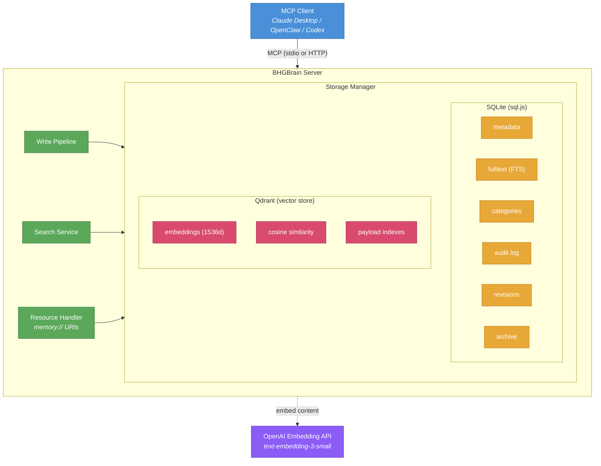
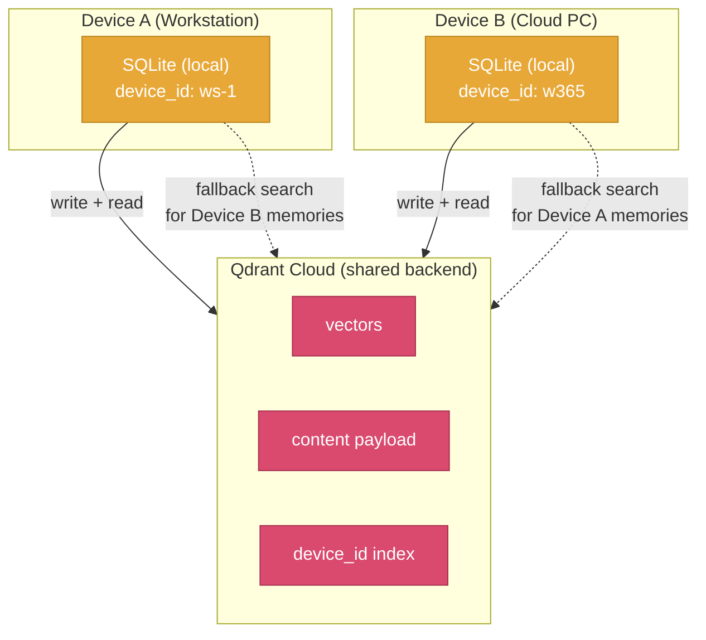
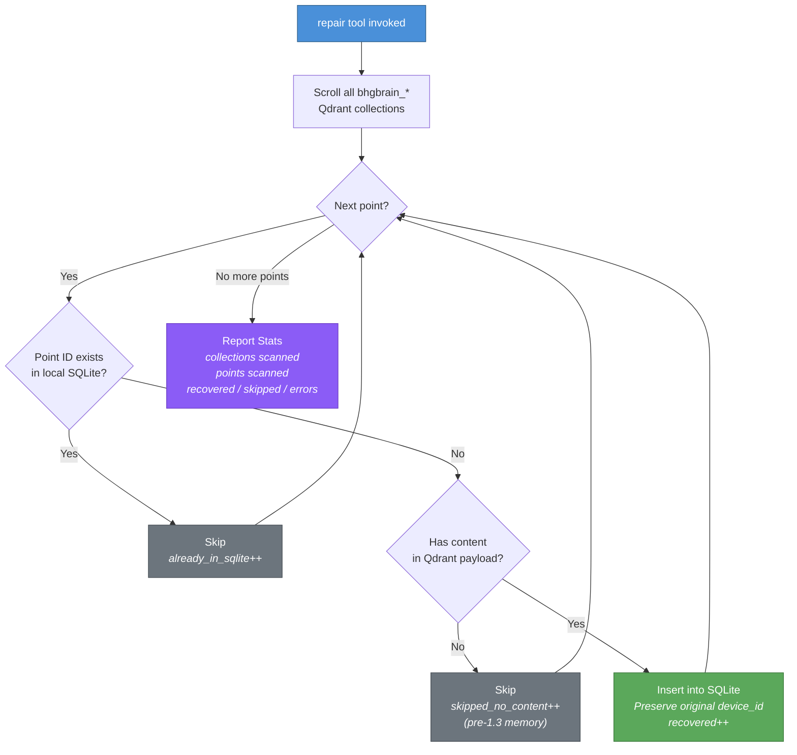
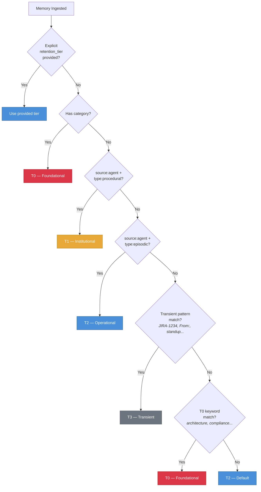
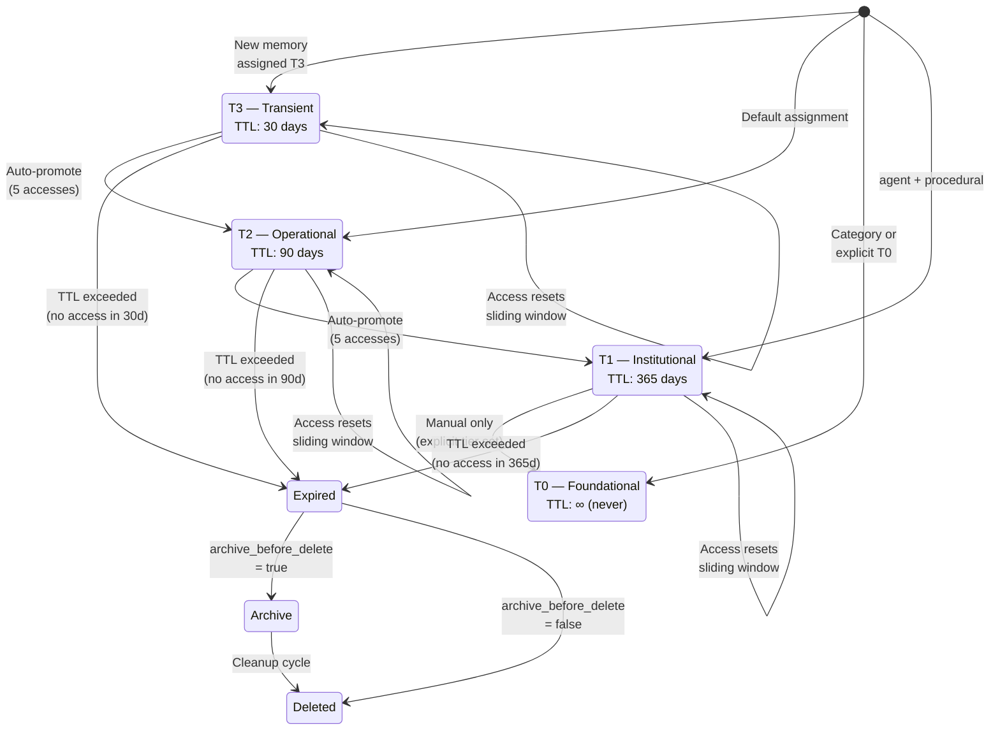
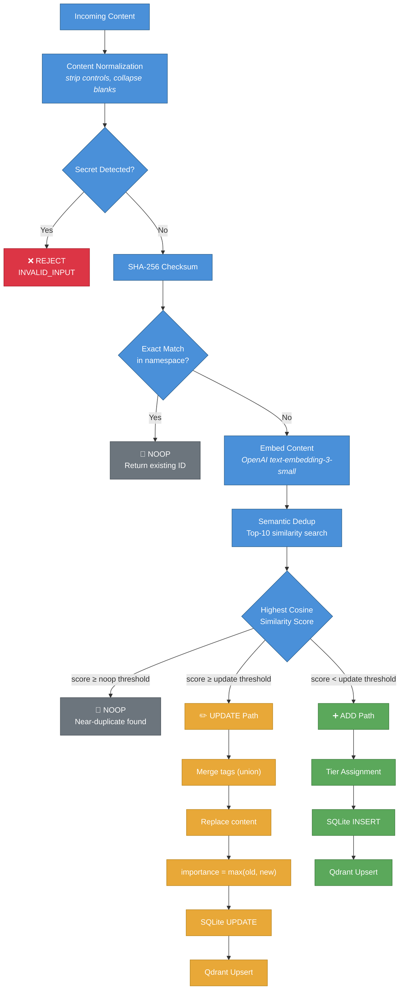
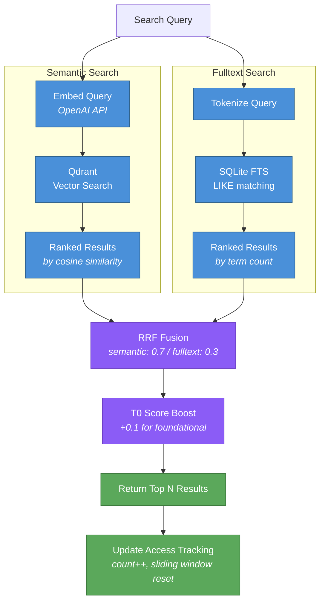
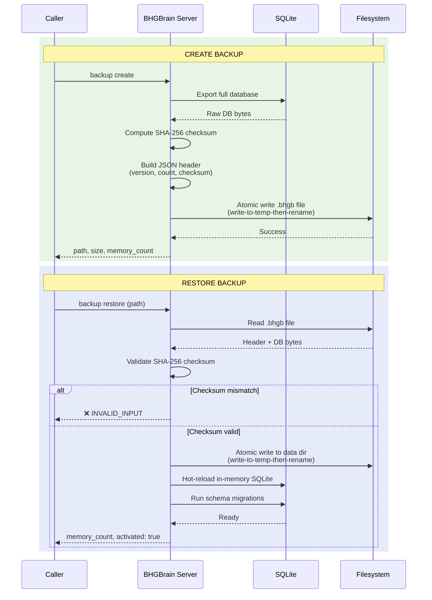

# BHGBrain

Memoria persistente respaldada por vectores para clientes MCP (Claude, Codex, OpenClaw, etc.).

BHGBrain almacena memorias en SQLite (metadatos + búsqueda de texto completo) y Qdrant (vectores semánticos), exponiéndolas a través del Model Context Protocol (MCP) vía stdio o HTTP. Está diseñado para dar a los agentes de IA un segundo cerebro duradero y consultable que persiste entre sesiones — con gestión completa del ciclo de vida, deduplicación automática, retención por niveles y búsqueda híbrida.

---

## Tabla de Contenidos

1. [Descripción General y Arquitectura](#descripción-general-y-arquitectura)
2. [Requisitos Previos](#requisitos-previos)
3. [Configuración de Qdrant](#configuración-de-qdrant)
4. [Instalación](#instalación)
5. [Configuración](#configuración)
6. [Variables de Entorno](#variables-de-entorno)
7. [Ejecución del Servidor](#ejecución-del-servidor)
8. [Configuración del Cliente MCP](#configuración-del-cliente-mcp)
9. [Memoria Multi-Dispositivo](#memoria-multi-dispositivo)
   - [Cómo Funciona](#cómo-funciona)
   - [Resolución de Identidad de Dispositivo](#resolución-de-identidad-de-dispositivo)
   - [Qdrant Compartido, SQLite Local](#qdrant-compartido-sqlite-local)
   - [Reparación y Recuperación](#reparación-y-recuperación)
10. [Gestión de Memorias](#gestión-de-memorias)
    - [Modelo de Datos de Memoria](#modelo-de-datos-de-memoria)
    - [Tipos de Memoria](#tipos-de-memoria)
    - [Namespaces y Colecciones](#namespaces-y-colecciones)
    - [Niveles de Retención](#niveles-de-retención)
    - [Ciclo de Vida por Nivel — Asignación, Promoción, Ventana Deslizante](#ciclo-de-vida-por-nivel--asignación-promoción-ventana-deslizante)
    - [Deduplicación](#deduplicación)
    - [Normalización de Contenido](#normalización-de-contenido)
    - [Puntuación de Importancia](#puntuación-de-importancia)
    - [Categorías — Slots de Política Persistente](#categorías--slots-de-política-persistente)
    - [Decaimiento, Limpieza y Archivado](#decaimiento-limpieza-y-archivado)
    - [Advertencias de Expiración Anticipada](#advertencias-de-expiración-anticipada)
    - [Límites de Recursos y Presupuestos de Capacidad](#límites-de-recursos-y-presupuestos-de-capacidad)
11. [Búsqueda](#búsqueda)
    - [Búsqueda Semántica](#búsqueda-semántica)
    - [Búsqueda de Texto Completo](#búsqueda-de-texto-completo)
    - [Búsqueda Híbrida](#búsqueda-híbrida)
    - [Recall vs Search — Diferencias](#recall-vs-search--diferencias)
    - [Filtrado](#filtrado)
    - [Umbrales de Puntuación y Bonificaciones por Nivel](#umbrales-de-puntuación-y-bonificaciones-por-nivel)
12. [Copia de Seguridad y Restauración](#copia-de-seguridad-y-restauración)
13. [Salud y Métricas](#salud-y-métricas)
14. [Seguridad](#seguridad)
15. [Recursos MCP](#recursos-mcp)
16. [Prompt de Bootstrap](#prompt-de-bootstrap)
17. [Referencia de la CLI](#referencia-de-la-cli)
18. [Referencia de Herramientas MCP](#referencia-de-herramientas-mcp)
19. [Actualización](#actualización)
20. [Notas de Comportamiento](#notas-de-comportamiento)

---

## Descripción General y Arquitectura

BHGBrain es un servidor de memoria persistente construido sobre el Model Context Protocol. Almacena todo lo que los agentes de IA aprenden, deciden y observan a lo largo de las sesiones — y luego pone ese conocimiento a disposición mediante recall semántico, búsqueda de texto completo y contexto inyectado.

### Arquitectura de Doble Almacén



- **SQLite** (vía `sql.js`, en memoria con volcado atómico periódico a disco) es el **sistema de registro** para todos los metadatos de memoria, índice de búsqueda de texto completo, categorías, historial de auditoría, historial de revisiones y registros de archivo.
- **Qdrant** almacena embeddings de vectores semánticos para búsqueda por similitud. Qdrant siempre se escribe después de que SQLite tiene éxito; los fallos se rastrean mediante el indicador `vector_synced` y se exponen en el endpoint de salud.
- **OpenAI text-embedding-3-small** (por defecto, configurable) genera embeddings de 1536 dimensiones para cada memoria.
- Las **escrituras atómicas** garantizan que los archivos de base de datos nunca se escriban parcialmente — todas las E/S de disco utilizan escritura-en-temporal-luego-renombrar.
- El **volcado diferido** agrupa las actualizaciones de metadatos de acceso (hasta 5 segundos) para evitar volcados de base de datos por solicitud en rutas de lectura intensiva.

---

## Requisitos Previos

| Requisito | Versión | Notas |
|---|---|---|
| Node.js | ≥ 20.0.0 | Se recomienda LTS |
| Qdrant | ≥ 1.9 | Debe estar en ejecución antes de iniciar BHGBrain |
| Clave API de OpenAI | — | Para embeddings (`text-embedding-3-small` por defecto). El servidor inicia en modo degradado si no está presente. |

---

## Configuración de Qdrant

BHGBrain **requiere una instancia externa de Qdrant**. Incluso en el modo `embedded` predeterminado, el servidor se conecta a `http://localhost:6333` — no hay ningún binario de Qdrant incluido. Debes ejecutarlo tú mismo.

### Opción A: Docker (recomendado)

```bash
docker run -d \
  --name qdrant \
  --restart unless-stopped \
  -p 6333:6333 \
  -v qdrant_storage:/qdrant/storage \
  qdrant/qdrant
```

Verificar que está en ejecución:

```bash
curl http://localhost:6333/health
# → {"title":"qdrant - vector search engine","version":"..."}
```

### Opción B: Docker Compose

```yaml
services:
  qdrant:
    image: qdrant/qdrant
    restart: unless-stopped
    ports:
      - "6333:6333"
    volumes:
      - qdrant_storage:/qdrant/storage

volumes:
  qdrant_storage:
```

### Opción C: Binario nativo

Descarga desde [https://github.com/qdrant/qdrant/releases](https://github.com/qdrant/qdrant/releases) y ejecuta:

```bash
./qdrant
```

### Opción D: Qdrant Cloud (modo externo)

Establece `qdrant.mode` en `external` en tu configuración y apunta `external_url` a la URL de tu clúster en la nube. Establece `qdrant.api_key_env` con el nombre de la variable de entorno que contiene tu clave API de Qdrant.

```jsonc
{
  "qdrant": {
    "mode": "external",
    "external_url": "https://your-cluster.cloud.qdrant.io",
    "api_key_env": "QDRANT_API_KEY"
  }
}
```

---

## Instalación

```bash
git clone https://github.com/Big-Hat-Group-Inc/BHGBrain.git
cd BHGBrain
npm install
npm run build
```

Para instalar globalmente como CLI:

```bash
npm install -g .
bhgbrain --help
```

---

## Configuración

BHGBrain carga su configuración desde:

- **Windows:** `%LOCALAPPDATA%\BHGBrain\config.json`
- **Linux/macOS:** `~/.bhgbrain/config.json`

El archivo se crea automáticamente en el primer arranque con todos los valores predeterminados aplicados. Edítalo para personalizar el comportamiento. También puedes pasar una ruta de configuración personalizada con `--config=<ruta>` al iniciar el servidor.

### Referencia Completa de Configuración

```jsonc
{
  // Directorio de datos (ruta absoluta). Por defecto, ubicación apropiada para la plataforma.
  "data_dir": null,

  // Identidad de dispositivo para configuraciones multi-dispositivo (ver sección Memoria Multi-Dispositivo)
  "device": {
    // Identificador estable de dispositivo. Auto-generado desde el hostname si se omite.
    // Patrón: ^[a-zA-Z0-9._-]{1,64}$
    // También puede establecerse vía la variable de entorno BHGBRAIN_DEVICE_ID.
    "id": null
  },

  // Configuración del proveedor de embeddings
  "embedding": {
    // Solo se admite "openai" actualmente
    "provider": "openai",
    // Modelo de OpenAI a usar para embeddings
    "model": "text-embedding-3-small",
    // Nombre de la variable de entorno que contiene la clave API de OpenAI
    "api_key_env": "OPENAI_API_KEY",
    // Dimensiones vectoriales producidas por el modelo. Debe coincidir con la salida del modelo.
    // IMPORTANTE: Cambiar esto después de crear colecciones requiere recrearlas.
    "dimensions": 1536
  },

  // Configuración de conexión a Qdrant
  "qdrant": {
    // "embedded" = conectarse a localhost:6333
    // "external" = conectarse a external_url (Qdrant Cloud, instancia remota, etc.)
    "mode": "embedded",
    // Solo se usa para el modo embedded (actualmente sin uso — Qdrant debe iniciarse externamente)
    "embedded_path": "./qdrant",
    // URL externa de Qdrant (se usa cuando mode = "external")
    "external_url": null,
    // Nombre de la variable de entorno que contiene la clave API de Qdrant (se usa cuando mode = "external")
    "api_key_env": null
  },

  // Configuración de transporte
  "transport": {
    "http": {
      // Habilitar transporte HTTP
      "enabled": true,
      // Host al que enlazarse. Usa 127.0.0.1 solo para loopback (por defecto, seguro).
      // Los enlaces no-loopback requieren que BHGBRAIN_TOKEN esté configurado (o allow_unauthenticated_http).
      "host": "127.0.0.1",
      // Puerto en el que escuchar
      "port": 3721,
      // Nombre de la variable de entorno que contiene el bearer token para autenticación HTTP
      "bearer_token_env": "BHGBRAIN_TOKEN"
    },
    "stdio": {
      // Habilitar transporte MCP stdio
      "enabled": true
    }
  },

  // Valores predeterminados aplicados cuando los llamadores no los especifican
  "defaults": {
    // Namespace predeterminado para todas las operaciones
    "namespace": "global",
    // Colección predeterminada para todas las operaciones
    "collection": "general",
    // Límite de resultados predeterminado para operaciones de recall
    "recall_limit": 5,
    // Puntuación mínima de similitud semántica predeterminada (0-1) para recall
    "min_score": 0.6,
    // Número máximo de memorias incluidas en el payload de auto-inject
    "auto_inject_limit": 10,
    // Número máximo de caracteres en los payloads de respuesta de herramientas
    "max_response_chars": 50000
  },

  // Configuración de retención y ciclo de vida de memorias
  "retention": {
    // Días sin acceso tras los cuales una memoria se convierte en candidata a obsolescencia
    "decay_after_days": 180,
    // Tamaño máximo de la base de datos SQLite en gigabytes antes de que el estado de salud informe degradado
    "max_db_size_gb": 2,
    // Número máximo total de memorias antes de que el estado de salud informe sobrecapacidad
    "max_memories": 500000,
    // Porcentaje de max_memories en el que el estado de salud informa degradado
    "warn_at_percent": 80,

    // TTL por nivel en días (null = nunca expira)
    "tier_ttl": {
      "T0": null,    // Fundacional: nunca expira
      "T1": 365,     // Institucional: 1 año sin acceso
      "T2": 90,      // Operacional: 90 días sin acceso
      "T3": 30       // Transitorio: 30 días sin acceso
    },

    // Presupuestos de capacidad por nivel (null = ilimitado)
    "tier_budgets": {
      "T0": null,      // Sin límite en el conocimiento fundacional
      "T1": 100000,    // 100k memorias institucionales
      "T2": 200000,    // 200k memorias operacionales
      "T3": 200000     // 200k memorias transitorias
    },

    // Umbral de recuento de accesos para auto-promover una memoria un nivel
    "auto_promote_access_threshold": 5,

    // Cuando es true, cada acceso restablece el reloj de TTL (ventana deslizante)
    "sliding_window_enabled": true,

    // Cuando es true, las memorias expiradas se escriben en la tabla de archivo antes de eliminarlas
    "archive_before_delete": true,

    // Horario cron para el trabajo de limpieza en segundo plano (por defecto: 2am diariamente)
    "cleanup_schedule": "0 2 * * *",

    // Días antes de la expiración en los que las memorias se marcan como expiring_soon
    "pre_expiry_warning_days": 7,

    // Umbral de compactación de segmentos de Qdrant (compactar cuando esta fracción de un segmento está eliminada)
    "compaction_deleted_threshold": 0.10
  },

  // Configuración de deduplicación
  "deduplication": {
    // Habilitar deduplicación semántica al escribir
    "enabled": true,
    // Umbral de similitud coseno por encima del cual el nuevo contenido se considera una ACTUALIZACIÓN del existente.
    // Los ajustes específicos por nivel se aplican además de esto (ver sección de Deduplicación más adelante).
    "similarity_threshold": 0.92
  },

  // Configuración de búsqueda
  "search": {
    // Pesos usados para Reciprocal Rank Fusion (RRF) en modo híbrido
    // Deben sumar 1.0
    "hybrid_weights": {
      "semantic": 0.7,
      "fulltext": 0.3
    }
  },

  // Configuración de seguridad
  "security": {
    // Rechazar enlaces HTTP no-loopback por defecto (fail-closed)
    "require_loopback_http": true,
    // Permitir explícitamente HTTP externo sin autenticación (registra una advertencia de alta visibilidad)
    "allow_unauthenticated_http": false,
    // Redactar valores de tokens en logs estructurados
    "log_redaction": true,
    // Número máximo de solicitudes por minuto por IP de cliente para transporte HTTP
    "rate_limit_rpm": 100,
    // Tamaño máximo del cuerpo de solicitudes HTTP en bytes
    "max_request_size_bytes": 1048576
  },

  // Presupuesto del payload de auto-inject (para el recurso memory://inject)
  "auto_inject": {
    // Número máximo de caracteres incluidos en el payload de inject
    "max_chars": 30000,
    // Presupuesto de tokens (null = ilimitado, se aplica el presupuesto de caracteres)
    "max_tokens": null
  },

  // Configuración de observabilidad
  "observability": {
    // Habilitar la recolección de métricas en proceso
    "metrics_enabled": false,
    // Usar logging JSON estructurado (vía pino)
    "structured_logging": true,
    // Nivel de log: "debug" | "info" | "warn" | "error"
    "log_level": "info"
  },

  // Configuración del pipeline de ingesta
  "pipeline": {
    // Habilitar el paso de extracción (actualmente ejecuta extracción determinística de un solo candidato)
    "extraction_enabled": true,
    // Modelo usado para extracción basada en LLM (planificado para uso futuro)
    "extraction_model": "gpt-4o-mini",
    // Nombre de la variable de entorno para la clave API del modelo de extracción
    "extraction_model_env": "BHGBRAIN_EXTRACTION_API_KEY",
    // Cuando es true, recurre a dedup solo por checksum si el embedding no está disponible
    "fallback_to_threshold_dedup": true
  },

  // Auto-resumir el contenido de la memoria en la ingesta
  "auto_summarize": true
}
```

---

## Variables de Entorno

| Variable | Requerida | Predeterminado | Descripción |
|---|---|---|---|
| `OPENAI_API_KEY` | Sí (para embeddings) | — | Clave API de OpenAI. El servidor inicia en **modo degradado** si no está presente — la búsqueda semántica y la ingesta fallarán, pero la búsqueda de texto completo y las lecturas de categorías siguen funcionando. |
| `BHGBRAIN_TOKEN` | Requerida para HTTP no-loopback | — | Bearer token para autenticación HTTP. El servidor **se niega a iniciar** si el host es no-loopback y esto no está configurado (a menos que `allow_unauthenticated_http: true`). |
| `QDRANT_API_KEY` | Requerida para Qdrant Cloud | — | Establece `qdrant.api_key_env` en la configuración con el nombre de esta variable. El nombre predeterminado del campo de configuración es `QDRANT_API_KEY`. |
| `BHGBRAIN_DEVICE_ID` | No | Auto-generado desde el hostname | Anular el identificador de dispositivo para configuraciones multi-dispositivo. Ver [Resolución de Identidad de Dispositivo](#resolución-de-identidad-de-dispositivo). |
| `BHGBRAIN_EXTRACTION_API_KEY` | No | Usa `OPENAI_API_KEY` como respaldo | Clave API para el modelo de extracción LLM (uso futuro). |

Generar un bearer token seguro:

```bash
bhgbrain server token
# o sin la CLI:
node -e "console.log(require('crypto').randomBytes(32).toString('hex'))"
```

---

## Ejecución del Servidor

### Modo stdio (MCP sobre stdin/stdout)

Este es el modo predeterminado utilizado por clientes MCP como Claude Desktop. El indicador `--stdio` solicita explícitamente el transporte stdio.

```bash
# Desarrollo (no se requiere compilación)
npm run dev

# Producción vía CLI
node dist/index.js --stdio

# Con un archivo de configuración personalizado
node dist/index.js --stdio --config=/path/to/config.json
```

### Modo HTTP

HTTP está habilitado por defecto en `127.0.0.1:3721`. Establece `BHGBRAIN_TOKEN` antes de iniciar si deseas acceso autenticado:

```bash
export OPENAI_API_KEY=sk-...
export BHGBRAIN_TOKEN=<your-token>
node dist/index.js
```

El servidor escucha en `http://127.0.0.1:3721` por defecto. Endpoints HTTP disponibles:

| Endpoint | Auth Requerida | Descripción |
|---|---|---|
| `GET /health` | No | Verificación de salud (sin autenticación para compatibilidad con sondas) |
| `POST /tool/:name` | Sí | Invocar una herramienta MCP por nombre |
| `GET /resource?uri=...` | Sí | Leer un recurso MCP por URI |
| `GET /metrics` | Sí | Métricas en formato Prometheus (si `metrics_enabled: true`) |

Ejemplo de verificación de salud:

```bash
curl http://127.0.0.1:3721/health
```

Ejemplo de llamada a herramienta vía HTTP:

```bash
curl -X POST http://127.0.0.1:3721/tool/remember \
  -H "Authorization: Bearer <your-token>" \
  -H "Content-Type: application/json" \
  -d '{"content": "Our auth service uses JWT with 1h expiry", "type": "semantic", "tags": ["auth", "architecture"]}'
```

---

## Configuración del Cliente MCP

### Claude Desktop (`claude_desktop_config.json`)

```json
{
  "mcpServers": {
    "bhgbrain": {
      "command": "node",
      "args": ["C:/path/to/BHGBrain/dist/index.js"],
      "env": {
        "OPENAI_API_KEY": "sk-..."
      }
    }
  }
}
```

### Claude Desktop (CLI instalada globalmente)

```json
{
  "mcpServers": {
    "bhgbrain": {
      "command": "bhgbrain",
      "args": ["server", "start"],
      "env": {
        "OPENAI_API_KEY": "sk-..."
      }
    }
  }
}
```

### OpenClaw / mcporter (transporte HTTP)

```json
{
  "mcpServers": {
    "bhgbrain": {
      "transport": "http",
      "url": "http://127.0.0.1:3721",
      "headers": {
        "Authorization": "Bearer <your-token>"
      }
    }
  }
}
```

O usando búsqueda de variable de entorno si tu mcporter lo admite:

```json
{
  "mcpServers": {
    "bhgbrain": {
      "transport": "stdio",
      "command": "node",
      "args": ["C:/Temp/GitHub/BHGBrain/dist/index.js"],
      "env": {
        "OPENAI_API_KEY": "sk-...",
        "QDRANT_API_KEY": "..."
      }
    }
  }
}
```

---

## Memoria Multi-Dispositivo

BHGBrain soporta la ejecución de múltiples instancias en diferentes máquinas (p.ej., una estación de trabajo principal y un entorno de desarrollo en la nube) que comparten el mismo backend de Qdrant Cloud. Cada instancia mantiene su propia base de datos SQLite local mientras lee y escribe en un almacén de vectores compartido.

### Cómo Funciona



Cada escritura de memoria almacena el contenido completo tanto en SQLite (local) como en el payload de Qdrant (compartido). Esto significa:

- **Sin punto único de fallo**: Si el SQLite de un dispositivo se pierde, el contenido puede recuperarse desde Qdrant.
- **Visibilidad entre dispositivos**: Todos los dispositivos ven todas las memorias vía Qdrant, incluso si su SQLite local solo tiene un subconjunto.
- **Seguimiento de procedencia**: Cada memoria se etiqueta con el `device_id` de la instancia que la creó.

### Resolución de Identidad de Dispositivo

Cada instancia de BHGBrain resuelve un `device_id` estable al iniciar, usando este orden de prioridad:

1. **Configuración explícita**: Campo `device.id` en `config.json`
2. **Variable de entorno**: `BHGBRAIN_DEVICE_ID`
3. **Auto-generado**: Derivado de `os.hostname()`, en minúsculas y sanitizado a `[a-zA-Z0-9._-]`

En la primera ejecución, el ID resuelto se persiste en `config.json` para que permanezca estable entre reinicios, incluso si el hostname cambia posteriormente.

```jsonc
// config.json — sección de dispositivo
{
  "device": {
    "id": "cpc-kevin-98f91"   // auto-generado desde el hostname, o establecido explícitamente
  }
}
```

El `device_id` aparece en:
- Cada payload de Qdrant (como campo indexado por keyword)
- Cada registro de memoria en SQLite
- Resultados de búsqueda (para que los llamadores puedan identificar qué dispositivo creó una memoria)

### Qdrant Compartido, SQLite Local

Cada dispositivo mantiene su propia base de datos SQLite de forma independiente. No hay protocolo de sincronización entre dispositivos — Qdrant es la capa compartida.

**Lo que ve cada dispositivo:**

| Fuente | Dispositivo A ve | Dispositivo B ve |
|---|---|---|
| Memorias del Dispositivo A (vía SQLite local) | ✅ Registro completo | ❌ No está en SQLite local |
| Memorias del Dispositivo A (vía fallback de Qdrant) | ✅ Registro completo | ✅ Contenido desde payload de Qdrant |
| Memorias del Dispositivo B (vía SQLite local) | ❌ No está en SQLite local | ✅ Registro completo |
| Memorias del Dispositivo B (vía fallback de Qdrant) | ✅ Contenido desde payload de Qdrant | ✅ Registro completo |

Cuando una búsqueda devuelve una memoria que existe en Qdrant pero no en el SQLite local, BHGBrain construye el resultado desde el payload de Qdrant en lugar de descartarla silenciosamente. Esto significa que ambos dispositivos obtienen resultados de búsqueda completos independientemente de qué dispositivo creó la memoria.

### Reparación y Recuperación



La herramienta `repair` reconstruye el SQLite local de un dispositivo desde Qdrant. Úsala después de:

- Configurar un nuevo dispositivo que comparte un backend de Qdrant existente
- Recuperarse de una pérdida de datos de SQLite
- Migrar a una nueva máquina

```json
// Vista previa de lo que se recuperaría (sin cambios)
{ "dry_run": true }

// Recuperar todas las memorias desde Qdrant al SQLite local
{ "dry_run": false }

// Recuperar solo memorias creadas por un dispositivo específico
{ "device_id": "cpc-kevin-98f91", "dry_run": false }
```

La herramienta de reparación:
- Recorre todos los puntos en todas las colecciones `bhgbrain_*` de Qdrant
- Inserta cualquier memoria con `content` en su payload de Qdrant que falte en el SQLite local
- Preserva la procedencia original del `device_id` (o etiqueta con el ID del dispositivo local si no existe ninguno)
- Reporta: colecciones escaneadas, puntos escaneados, recuperados, omitidos (sin contenido), errores

**Nota**: Las memorias almacenadas antes de que se añadiera la función de contenido en Qdrant (pre-1.3) no tienen contenido en su payload de Qdrant y no pueden recuperarse vía reparación. Solo los metadatos (etiquetas, tipo, importancia) sobreviven para esas entradas.

### Ejemplo de Configuración Multi-Dispositivo

**Dispositivo A** (`config.json`):
```jsonc
{
  "device": { "id": "workstation" },
  "qdrant": {
    "mode": "external",
    "external_url": "https://your-cluster.cloud.qdrant.io",
    "api_key_env": "QDRANT_API_KEY"
  }
}
```

**Dispositivo B** (`config.json`):
```jsonc
{
  "device": { "id": "cloud-pc" },
  "qdrant": {
    "mode": "external",
    "external_url": "https://your-cluster.cloud.qdrant.io",
    "api_key_env": "QDRANT_API_KEY"
  }
}
```

Ambos apuntan al mismo clúster de Qdrant. Cada uno obtiene su propio `device_id`. Todas las memorias fluyen a las mismas colecciones de vectores y son visibles para ambas instancias.

---

## Gestión de Memorias

Esta sección describe el ciclo de vida completo de las memorias — desde la ingesta hasta la clasificación, deduplicación, seguimiento de accesos, promoción, decaimiento y eventual expiración o retención permanente.

### Modelo de Datos de Memoria

Cada memoria almacenada en BHGBrain es un `MemoryRecord` con los siguientes campos:

| Campo | Tipo | Descripción |
|---|---|---|
| `id` | `string (UUID)` | Identificador único global |
| `namespace` | `string` | Namespace de alcance (p.ej., `"global"`, `"project/alpha"`, `"user/kevin"`) |
| `collection` | `string` | Sub-agrupación dentro de un namespace (p.ej., `"general"`, `"architecture"`, `"decisions"`) |
| `type` | `"episodic" \| "semantic" \| "procedural"` | Tipo de memoria (ver Tipos de Memoria) |
| `category` | `string \| null` | Nombre de categoría si esta memoria está adjunta a una categoría de política persistente |
| `content` | `string` | El contenido completo de la memoria (hasta 100.000 caracteres) |
| `summary` | `string` | Resumen de la primera línea generado automáticamente (hasta 120 caracteres) |
| `tags` | `string[]` | Etiquetas de forma libre (alfanumérico + guiones, máx. 20 etiquetas, máx. 100 chars cada una) |
| `source` | `"cli" \| "api" \| "agent" \| "import"` | Cómo se creó la memoria |
| `checksum` | `string` | Hash SHA-256 del contenido normalizado (usado para deduplicación exacta) |
| `embedding` | `number[]` | Embedding vectorial (no almacenado en SQLite; vive en Qdrant) |
| `importance` | `number (0–1)` | Puntuación de importancia (por defecto 0.5) |
| `retention_tier` | `"T0" \| "T1" \| "T2" \| "T3"` | Nivel del ciclo de vida que gobierna el TTL y el comportamiento de limpieza |
| `expires_at` | `string (ISO 8601) \| null` | Marca de tiempo de expiración (null para T0 — nunca expira) |
| `decay_eligible` | `boolean` | Si la memoria participa en la limpieza por TTL (false para T0) |
| `review_due` | `string (ISO 8601) \| null` | Fecha de revisión T1 (establecida en created_at + 365 días; se restablece en el acceso) |
| `access_count` | `number` | Número de veces que esta memoria ha sido recuperada |
| `last_accessed` | `string (ISO 8601)` | Marca de tiempo de la recuperación más reciente |
| `last_operation` | `"ADD" \| "UPDATE" \| "DELETE" \| "NOOP"` | Operación de escritura más reciente aplicada |
| `merged_from` | `string \| null` | ID de la memoria desde la que se fusionó esta (ruta UPDATE de dedup) |
| `archived` | `boolean` | Si esta memoria está archivada de forma flexible (excluida de búsqueda/recall) |
| `vector_synced` | `boolean` | Si el vector de Qdrant está sincronizado con el estado de SQLite |
| `device_id` | `string \| null` | Identificador de la instancia de BHGBrain que creó esta memoria (ver [Memoria Multi-Dispositivo](#memoria-multi-dispositivo)) |
| `created_at` | `string (ISO 8601)` | Marca de tiempo de creación |
| `updated_at` | `string (ISO 8601)` | Marca de tiempo de la última actualización |
| `last_accessed` | `string (ISO 8601)` | Marca de tiempo de la última recuperación |

#### Esquema SQLite

La tabla `memories` tiene índices exhaustivos para un filtrado eficiente:

```sql
CREATE INDEX idx_memories_namespace   ON memories(namespace);
CREATE INDEX idx_memories_collection  ON memories(namespace, collection);
CREATE INDEX idx_memories_checksum    ON memories(namespace, checksum);
CREATE INDEX idx_memories_type        ON memories(namespace, type);
CREATE INDEX idx_memories_category    ON memories(category);
CREATE INDEX idx_memories_tier        ON memories(namespace, collection, retention_tier);
CREATE INDEX idx_memories_expiry      ON memories(decay_eligible, expires_at);
CREATE INDEX idx_memories_review_due  ON memories(retention_tier, review_due);
CREATE INDEX idx_memories_archived    ON memories(archived);
CREATE INDEX idx_memories_vector_sync ON memories(vector_synced);
```

#### Índices de Payload de Qdrant

Cada colección de Qdrant mantiene los siguientes índices de payload para un filtrado eficiente en el lado vectorial:

- `namespace` (keyword)
- `type` (keyword)
- `retention_tier` (keyword)
- `decay_eligible` (boolean)
- `expires_at` (integer — almacenado como segundos de época Unix)
- `device_id` (keyword)

---

### Tipos de Memoria

Cada memoria se clasifica en uno de tres tipos semánticos. El tipo se usa para filtrar en recall y búsqueda, e influye en el nivel de retención predeterminado asignado durante la ingesta.

| Tipo | Significado | Contenido Típico | Nivel Predeterminado |
|---|---|---|---|
| `episodic` | Un evento, observación u ocurrencia específica en un momento del tiempo | Resultados de reuniones, sesiones de depuración, contexto de tareas, lo que ocurrió durante un sprint | `T2` (operacional) |
| `semantic` | Un hecho, concepto o pieza de conocimiento no vinculada a un momento específico | Cómo funciona un sistema, qué significa un término, un valor de configuración, un modelo de datos | `T2` (operacional) |
| `procedural` | Un proceso, flujo de trabajo o instrucción de cómo hacer algo | Runbooks, pasos de despliegue, estándares de codificación, cómo realizar una tarea | `T1` (institucional) |

**Cómo el tipo afecta la asignación de nivel:**
- `source: agent` + `type: procedural` → auto-asignado `T1` (institucional)
- `source: agent` + `type: episodic` → auto-asignado `T2` (operacional)
- `source: cli` (cualquier tipo) → auto-asignado `T2` (operacional)
- `source: import` con señales de contenido T0 → `T0` independientemente del tipo

Si no proporcionas un tipo, el pipeline usa `"semantic"` por defecto.

---

### Namespaces y Colecciones

Los **namespaces** son identificadores de alcance de nivel superior que aíslan memorias de diferentes contextos, usuarios o proyectos. Todas las operaciones de herramientas requieren un namespace (por defecto: `"global"`).

- Patrón de namespace: `^[a-zA-Z0-9/-]{1,200}$` — caracteres alfanuméricos, guiones y barras diagonales
- Ejemplos: `"global"`, `"project/alpha"`, `"user/kevin"`, `"tenant/acme-corp"`
- Las memorias en diferentes namespaces nunca se devuelven en las búsquedas de los demás
- Cada par namespace+colección se mapea a una colección separada de Qdrant (llamada `bhgbrain_{namespace}_{collection}`)

Las **colecciones** son sub-grupos dentro de un namespace. Te permiten particionar memorias por tema o propósito sin crear namespaces completamente separados.

- Patrón de colección: `^[a-zA-Z0-9-]{1,100}$`
- Ejemplos: `"general"`, `"architecture"`, `"decisions"`, `"onboarding"`
- Las colecciones se rastrean en la tabla SQLite `collections` con su modelo de embedding y dimensiones bloqueados al momento de la creación — no puedes mezclar modelos de embedding dentro de una colección
- Usa la herramienta MCP `collections` para listar, crear o eliminar colecciones

**Garantías de aislamiento:**
- Las consultas SQLite siempre filtran primero por `namespace`
- Las búsquedas de Qdrant incluyen un filtro de payload `namespace` incluso al buscar en una colección específica
- Eliminar una colección elimina todas las memorias asociadas tanto de SQLite como de Qdrant

---

### Niveles de Retención

A cada memoria se le asigna un **nivel de retención** en el momento de la ingesta que gobierna todo su ciclo de vida — cuánto tiempo vive, cómo se limpia, qué tan estrictamente se deduplica y si alguna vez expira.

| Nivel | Etiqueta | TTL Predeterminado | Elegible para Decaimiento | Ejemplos |
|---|---|---|---|---|
| `T0` | **Fundacional** | Nunca (permanente) | No | Referencias de arquitectura, requisitos legales, políticas de empresa, mandatos de cumplimiento, estándares contables, ADRs, runbooks de seguridad |
| `T1` | **Institucional** | 365 días desde el último acceso | Sí (con seguimiento de review_due) | Decisiones de diseño de software, contratos de API, runbooks de despliegue, estándares de codificación, acuerdos con proveedores, conocimiento procedimental |
| `T2` | **Operacional** | 90 días desde el último acceso | Sí | Estado del proyecto, decisiones de sprint, resultados de reuniones, investigaciones técnicas, contexto de tareas actuales |
| `T3` | **Transitorio** | 30 días desde el último acceso | Sí | Tickets de soporte, resúmenes de correos, informes diarios, sesiones de depuración ad-hoc, notas de tareas de corta duración |

**Propiedades clave por nivel:**

- **T0**: `expires_at` es siempre `null`. `decay_eligible` es siempre `false`. Las memorias T0 no pueden ser limpiadas automáticamente. Las actualizaciones a memorias T0 desencadenan una instantánea de revisión en la tabla `memory_revisions` (historial de solo adición). Las memorias T0 reciben un impulso de puntuación de +0.1 en los resultados de búsqueda híbrida.

- **T1**: `review_due` se establece en `created_at + 365 días` y se restablece en cada acceso. Las memorias que se acercan a su `expires_at` se marcan con `expiring_soon: true` en los resultados de búsqueda.

- **T2**: El nivel predeterminado para la mayoría de las memorias. Ventana deslizante de 90 días — cada acceso restablece el reloj de TTL.

- **T3**: El nivel más agresivo. El contenido transitorio identificado por patrones (tickets, correos, notas de standup) se clasifica automáticamente aquí. Ventana deslizante de 30 días.

**Presupuestos de capacidad:**

| Nivel | Presupuesto Predeterminado | Notas |
|---|---|---|
| T0 | Ilimitado | El conocimiento fundacional debe caber siempre |
| T1 | 100.000 | Conocimiento institucional |
| T2 | 200.000 | Memorias operacionales |
| T3 | 200.000 | Memorias transitorias |

Cuando se supera el presupuesto de un nivel, el endpoint de salud informa `degraded` y el trabajo de limpieza prioriza ese nivel en el siguiente ciclo.

---

### Ciclo de Vida por Nivel — Asignación, Promoción, Ventana Deslizante

#### Asignación de Nivel

La asignación de nivel ocurre durante el pipeline de escritura, en este orden de prioridad:

1. **Anulación explícita del llamador:** Si se pasa `retention_tier` a la herramienta `remember`, se usa incondicionalmente.

2. **Basado en categoría:** Si la memoria está adjunta a una categoría (vía el campo `category`), siempre es `T0`. Las categorías representan slots de política persistente y nunca expiran.

3. **Heurísticas de fuente + tipo:**
   - `source: agent` + `type: procedural` → `T1`
   - `source: agent` + `type: episodic` → `T2`
   - `source: cli` → `T2`

4. **Coincidencia de patrones de contenido para señales transitorias (→ T3):**
   - Referencias de Jira/tickets: `JIRA-1234`, `incident-456`, `case-789`
   - Metadatos de correo: `From:`, `Subject:`, `fw:`, `re:`
   - Marcadores temporales: `today`, `this week`, `by friday`, `standup`, `meeting minutes`, `action items`
   - Referencias de trimestre: `Q1 2026`, `Q3 2025`

5. **Señales de palabras clave T0 (→ T0 para importaciones):**
   Si `source: import` y el contenido o las etiquetas contienen cualquiera de:
   `architecture`, `design decision`, `adr`, `rfc`, `contract`, `schema`, `legal`, `compliance`, `policy`, `standard`, `accounting`, `security`, `runbook`
   → asignado `T0`.

6. **Señales de palabras clave T0 (→ T0 para cualquier fuente):**
   Se verifican las mismas palabras clave T0 para todas las fuentes (primero se verifican los patrones transitorios T3). Si una palabra clave T0 coincide sin un patrón transitorio, la memoria es `T0`.

7. **Predeterminado:** `T2` — el predeterminado seguro y tolerante.



#### Metadatos de Nivel Calculados en la Asignación

```typescript
{
  retention_tier: "T2",               // nivel asignado
  expires_at: "2026-06-14T12:00:00Z", // created_at + días TTL
  decay_eligible: true,               // false solo para T0
  review_due: null                    // establecido solo para T1
}
```

Para memorias T1, `review_due` se establece en `created_at + tier_ttl.T1` (365 días por defecto) y se restablece en cada recuperación.

#### Auto-Promoción por Acceso

Cuando una memoria en el nivel `T2` o `T3` alcanza el umbral de acceso (`auto_promote_access_threshold`, por defecto 5), se promueve automáticamente un nivel:

- `T3` → `T2`
- `T2` → `T1`

La promoción no puede ocurrir automáticamente a `T0`. La actualización manual a `T0` es posible pasando `retention_tier: "T0"` en una llamada `remember` posterior (lo que desencadena la ruta UPDATE) o vía el comando CLI `bhgbrain tier set <id> T0`.

La promoción es **monotónica** — la degradación automática nunca ocurre. La degradación de nivel requiere acción explícita del usuario.

Cuando se promueve una memoria, su `expires_at` se recalcula desde el TTL del nuevo nivel usando la marca de tiempo actual como ancla de la ventana deslizante.



#### Expiración con Ventana Deslizante

Cuando `sliding_window_enabled: true` (el valor predeterminado), cada recuperación exitosa vía `recall`, `search` o `memory://inject` restablece el reloj de TTL:

```
new expires_at = max(current expires_at, now + tier_ttl)
```

Esto significa que una memoria en uso activo nunca expira, mientras que una memoria que nunca es recuperada alcanza su TTL y se limpia. Las memorias a las que se accede una vez en el último momento reciben una ventana TTL completamente nueva desde ese acceso.

El seguimiento de accesos se realiza en lote después de cada búsqueda (volcado diferido de hasta 5 segundos) para evitar escrituras síncronas en la base de datos en la ruta de lectura.

---

### Deduplicación

BHGBrain evita almacenar contenido duplicado o casi duplicado mediante un pipeline de deduplicación en dos fases.



#### Fase 1: Deduplicación Exacta (Checksum)

Antes de generar cualquier embedding, el contenido normalizado se hashea con SHA-256. Si ya existe una memoria con el mismo namespace y checksum (y no está archivada), la operación devuelve `NOOP` inmediatamente sin ninguna llamada a la API.

```
checksum = SHA-256(normalizeContent(content))
```

#### Fase 2: Deduplicación Semántica (Similitud Vectorial)

Si no se encuentra ninguna coincidencia exacta, el contenido se embede y se recuperan de Qdrant las 10 memorias existentes más similares en la colección. Basándose en las puntuaciones de similitud coseno y el nivel asignado a la memoria, se toma una de tres decisiones:

| Decisión | Condición | Efecto |
|---|---|---|
| `NOOP` | Puntuación ≥ umbral noop | El contenido se considera un duplicado; devuelve el ID de la memoria existente sin escribir |
| `UPDATE` | Puntuación ≥ umbral update | El contenido es una actualización del existente; fusiona etiquetas, actualiza contenido y checksum, preserva el ID |
| `ADD` | Puntuación < umbral update | Memoria genuinamente nueva; crea con un nuevo UUID |

**Umbrales de deduplicación específicos por nivel:**

El `similarity_threshold` base (por defecto 0.92) se ajusta por nivel porque las memorias T0/T1 requieren coincidencias más estrictas (los casi-duplicados pueden representar versionado intencional), y T3 es más agresivo:

| Nivel | Umbral NOOP | Umbral UPDATE |
|---|---|---|
| `T0` | 0.98 | max(base, 0.95) |
| `T1` | 0.98 | max(base, 0.95) |
| `T2` | 0.98 | base (0.92) |
| `T3` | 0.95 | max(base, 0.90) |

**Comportamiento de fusión en UPDATE:**
- Las etiquetas se unen (etiquetas existentes ∪ etiquetas nuevas)
- El contenido se reemplaza con la nueva versión
- La importancia se establece en `max(importancia existente, importancia nueva)`
- El nivel de retención y la expiración se recalculan desde la clasificación del nuevo contenido

**Comportamiento de reserva:**
Si el proveedor de embeddings no está disponible y `pipeline.fallback_to_threshold_dedup: true`, el pipeline recurre a la deduplicación solo por checksum y escribe la memoria solo en SQLite (con `vector_synced: false`). La memoria estará disponible para búsqueda de texto completo pero no para búsqueda semántica hasta que se restaure la sincronización con Qdrant.

---

### Normalización de Contenido

Antes de calcular el checksum, embeder o almacenar, todo el contenido pasa por el pipeline de normalización:

1. **Eliminación de caracteres de control:** Los caracteres de control ASCII (0x00–0x08, 0x0B, 0x0C, 0x0E–0x1F, 0x7F) se eliminan. El salto de línea (0x0A) y el retorno de carro (0x0D) se preservan.

2. **Normalización CRLF:** `\r\n` → `\n`

3. **Eliminación de espacios en blanco al final de línea:** Los espacios y tabulaciones al final de las líneas se eliminan.

4. **Colapso de líneas en blanco excesivas:** Tres o más saltos de línea consecutivos se colapsan a dos.

5. **Recorte de espacios en blanco iniciales/finales:** La cadena completa se recorta.

6. **Detección de secretos:** Antes del almacenamiento, el contenido se verifica contra patrones para formatos comunes de credenciales:
   - `api_key=...`, `secret=...`, `token=...`, `password=...`
   - IDs de clave de acceso AWS (`AKIA...`)
   - Tokens de acceso personal de GitHub (`ghp_...`)
   - Claves API de OpenAI (`sk-...`)
   - Claves privadas PEM (`-----BEGIN ... PRIVATE KEY-----`)

   Si se detecta un secreto, la escritura es **rechazada** con `INVALID_INPUT`:
   > `Content appears to contain credentials or secrets. Memory rejected for safety.`

7. **Generación de resumen:** La primera línea del contenido normalizado se extrae como resumen (truncado a 120 caracteres con `...` si es más larga). El resumen se almacena en SQLite y se usa para visualización ligera sin recuperar el contenido completo.

---

### Puntuación de Importancia

Cada memoria tiene un campo `importance` — un float de 0.0 a 1.0.

**Predeterminado:** `0.5` si no lo proporciona el llamador.

**Cómo se usa:**
- Durante las fusiones UPDATE de deduplicación, la importancia se establece en `max(existente, nueva)` — la importancia solo aumenta a través de fusiones.
- Los candidatos a memorias obsoletas (marcados por el paso de consolidación) deben tener `importance < 0.5` y sin categoría para ser elegibles para el paso de marcado de obsolescencia. Esto protege las memorias de alta importancia de ser marcadas como obsoletas.
- La extracción futura basada en LLM puede asignar importancia basándose en el análisis del contenido.

**Configuración de importancia:**
Pasa `importance` explícitamente en la herramienta `remember`. Los valores van de `0.0` (valor muy bajo, debe decaer agresivamente) a `1.0` (crítico, debe preservarse).

```json
{
  "content": "Our HIPAA BAA requires all PHI to be encrypted at rest using AES-256",
  "type": "semantic",
  "tags": ["compliance", "hipaa", "security"],
  "importance": 0.9,
  "retention_tier": "T0"
}
```

---

### Categorías — Slots de Política Persistente

Las categorías son un mecanismo de almacenamiento especial para contexto de política persistente, siempre inyectado. A diferencia de las memorias regulares (que se recuperan vía búsqueda semántica), el contenido de las categorías siempre se incluye en el payload del recurso `memory://inject`.

Las categorías están diseñadas para información que debe estar siempre presente en la ventana de contexto de la IA: valores de empresa, principios de arquitectura, estándares de codificación y políticas permanentes similares.

#### Slots de Categoría

Cada categoría se asigna a uno de cuatro slots con nombre:

| Slot | Propósito | Ejemplos |
|---|---|---|
| `company-values` | Principios básicos, cultura, voz de marca | "Priorizamos la seguridad sobre la velocidad", "Nunca almacenar PII en logs" |
| `architecture` | Arquitectura del sistema, topología de componentes, decisiones de diseño clave | Mapa de servicios, contratos de API, elecciones tecnológicas |
| `coding-requirements` | Estándares de codificación, convenciones, patrones requeridos | "Siempre usar async/await", "Usar Zod para toda validación", convenciones de nombres |
| `custom` | Cualquier otra cosa que justifique contexto siempre activo | Reglas específicas del proyecto, guías de desambiguación, mapas de entidades |

#### Comportamiento de las Categorías

- Las categorías son **siempre T0** — nunca expiran, nunca decaen y el sistema de retención no puede limpiarlas.
- El contenido de las categorías se almacena como texto completo en SQLite (no se embede en Qdrant).
- En el payload `memory://inject`, el contenido de las categorías se antepone antes que cualquier memoria regular.
- Las categorías admiten revisiones — cuando actualizas una categoría con `category set`, el contador `revision` se incrementa.
- Los nombres de categoría deben ser únicos. Puedes tener múltiples categorías por slot (p.ej., `"api-contracts"` y `"database-schema"` ambas en el slot `"architecture"`).
- El contenido de las categorías puede tener hasta 100.000 caracteres.

#### Gestión de Categorías

```json
// Listar todas las categorías
{ "action": "list" }

// Obtener una categoría específica
{ "action": "get", "name": "api-contracts" }

// Crear o actualizar una categoría
{
  "action": "set",
  "name": "coding-standards",
  "slot": "coding-requirements",
  "content": "## Coding Standards\n\n- Use TypeScript strict mode\n- All functions must have JSDoc comments\n- Tests required for all public APIs"
}

// Eliminar una categoría
{ "action": "delete", "name": "coding-standards" }
```

---

### Decaimiento, Limpieza y Archivado

#### Limpieza en Segundo Plano

El sistema de retención ejecuta un trabajo de limpieza programado (por defecto: diariamente a las 2:00 AM, configurable vía `retention.cleanup_schedule` como expresión cron). También puedes desencadenar la limpieza manualmente vía `bhgbrain gc`.

**Fases de limpieza:**

1. **Identificar memorias expiradas:** Consultar SQLite para todas las memorias donde `decay_eligible = true` Y `expires_at < now()`. Las memorias T0 siempre se excluyen (T0 nunca es elegible para decaimiento).

2. **Archivar antes de eliminar (si está habilitado):** Para cada memoria expirada, escribir un registro de resumen en la tabla `memory_archive`:

   ```sql
   memory_archive {
     id            INTEGER (autoincrement)
     memory_id     TEXT    -- UUID de la memoria original
     summary       TEXT    -- el texto de resumen de la memoria
     tier          TEXT    -- nivel en el que estaba cuando se eliminó
     namespace     TEXT    -- namespace al que pertenecía
     created_at    TEXT    -- marca de tiempo de creación original
     expired_at    TEXT    -- cuando se ejecutó la limpieza
     access_count  INTEGER -- total de accesos durante su vida útil
     tags          TEXT    -- array JSON de etiquetas
   }
   ```

3. **Eliminar de Qdrant:** Eliminar en lote todos los IDs de puntos expirados de sus respectivas colecciones de Qdrant.

4. **Eliminar de SQLite:** Eliminar filas expiradas de las tablas `memories` y `memories_fts`.

5. **Log de auditoría:** Cada eliminación se registra en la tabla `audit_log` con `operation: FORGET` y `client_id: "system"`.

6. **Volcado:** SQLite se vuelca atómicamente a disco después de todas las eliminaciones.

#### Historial de Revisiones T0

Cuando se actualiza una memoria T0 (fundacional) vía la herramienta `remember` (desencadenando la ruta de dedup UPDATE), el contenido anterior se captura en la tabla `memory_revisions` antes de aplicar la actualización:

```sql
memory_revisions {
  id         INTEGER (autoincrement)
  memory_id  TEXT    -- el UUID de la memoria T0
  revision   INTEGER -- número de revisión incremental
  content    TEXT    -- contenido previo completo
  updated_at TEXT    -- cuándo ocurrió la actualización
  updated_by TEXT    -- client_id que realizó la actualización
}
```

Solo las memorias T0 tienen historial de revisiones. El embedding vectorial en Qdrant siempre refleja solo el contenido actual.

#### Marcado de Obsolescencia (Paso de Consolidación)

El comando `bhgbrain gc --consolidate` (o `RetentionService.runConsolidation()`) realiza un segundo paso que marca memorias como candidatas **obsoletas**:

- Cualquier memoria a la que no se haya accedido en los últimos `retention.decay_after_days` (por defecto 180) días se marca como candidata obsoleta.
- Solo las memorias con `importance < 0.5` y sin categoría son elegibles.
- Las memorias obsoletas no se eliminan inmediatamente; se convierten en candidatas para el siguiente ciclo de limpieza GC.

#### Búsqueda y Restauración de Archivo

Las memorias eliminadas (cuando `archive_before_delete: true`) pueden inspeccionarse y restaurarse:

```bash
bhgbrain archive list                 # Listar resúmenes de memorias archivadas (eliminadas)
bhgbrain archive search <query>       # Buscar en el archivo por texto
bhgbrain archive restore <memory_id>  # Restaurar una memoria archivada
```

**Semántica de restauración:** Una memoria restaurada se recrea como una **nueva** memoria `T2` a partir del texto de resumen archivado. El contenido original (si es más largo que el resumen) no puede recuperarse — el archivo almacena solo el resumen de 120 caracteres. La memoria restaurada recibe marcas de tiempo nuevas y un nuevo UUID, y se re-embede en Qdrant.

---

### Advertencias de Expiración Anticipada

Las memorias que se acercan a la expiración (dentro de `retention.pre_expiry_warning_days` días, por defecto 7) se marcan en los resultados de búsqueda:

```json
{
  "id": "...",
  "content": "...",
  "retention_tier": "T2",
  "expires_at": "2026-03-22T12:00:00Z",
  "expiring_soon": true
}
```

El indicador `expiring_soon` aparece en:
- Resultados de `recall`
- Resultados de `search`
- El payload del recurso `memory://inject`

Esto permite a los agentes de IA notar cuándo las memorias están a punto de expirar y decidir si promoverlas (re-guardando con un `retention_tier: "T1"` o `"T0"` explícito).

---

### Límites de Recursos y Presupuestos de Capacidad

BHGBrain monitoriza la capacidad y muestra advertencias a través del sistema de salud:

| Límite | Clave de Config | Predeterminado | Comportamiento al excederse |
|---|---|---|---|
| Máximo de memorias totales | `retention.max_memories` | 500.000 | El estado de salud informa `degraded`; el trabajo de limpieza prioriza la limpieza |
| Tamaño máximo de BD | `retention.max_db_size_gb` | 2 GB | El estado de salud informa `degraded` (monitorizado, no aplicado) |
| Umbral de advertencia | `retention.warn_at_percent` | 80% | El estado de salud informa `degraded` cuando `count > max_memories * 0.8` |
| Presupuesto T1 | `retention.tier_budgets.T1` | 100.000 | El estado de salud informa `over_capacity: true`; el componente de retención se degrada |
| Presupuesto T2 | `retention.tier_budgets.T2` | 200.000 | Igual |
| Presupuesto T3 | `retention.tier_budgets.T3` | 200.000 | Igual |

T0 no tiene presupuesto de capacidad. El conocimiento fundacional siempre debe preservarse.

El campo `retention.over_capacity` del endpoint de salud es `true` si se supera cualquier presupuesto configurado. El objeto `retention.counts_by_tier` muestra el recuento actual en cada nivel, que puedes comparar con tus presupuestos configurados.

---

## Búsqueda

BHGBrain admite tres modos de búsqueda que pueden usarse de forma independiente o combinada.

### Búsqueda Semántica

La búsqueda semántica usa embeddings de OpenAI y similitud vectorial de Qdrant (distancia coseno) para encontrar memorias conceptualmente similares a la consulta — incluso si usan palabras diferentes.

**Cómo funciona:**
1. La cadena de consulta se embede usando el mismo modelo que las memorias almacenadas (`text-embedding-3-small`, 1536 dimensiones).
2. Se consulta a Qdrant por los vecinos más cercanos en la colección objetivo.
3. Qdrant aplica filtros de payload para excluir memorias expiradas: solo se devuelven memorias donde `decay_eligible = false` (T0/T1) O `expires_at > now()`.
4. Los resultados se ordenan por puntuación de similitud coseno (0.0–1.0, mayor es más similar).
5. Los metadatos de acceso se actualizan para cada memoria devuelta (access_count++, last_accessed, restablecimiento de expiración de ventana deslizante).

**Cuándo usar:** Consultas conceptuales, preguntas sobre cómo funciona algo, recuperar decisiones arquitectónicas sin conocer palabras clave exactas.

**Requisitos:** Requiere que el proveedor de embeddings esté en buen estado. Devuelve el error `EMBEDDING_UNAVAILABLE` si OpenAI no es accesible.

```json
// Búsqueda semántica vía la herramienta search
{
  "query": "how does authentication work",
  "mode": "semantic",
  "namespace": "global",
  "limit": 10
}
```

---

### Búsqueda de Texto Completo

La búsqueda de texto completo usa la coincidencia de texto interno de SQLite para encontrar memorias que contienen palabras o frases específicas.

**Cómo funciona:**
1. La consulta se divide en términos en minúsculas.
2. Cada término se compara con la tabla shadow `memories_fts` usando `LIKE %term%` en las columnas `content`, `summary` y `tags`.
3. Los resultados se ordenan por el número de términos coincidentes (más coincidencias = mayor rango).
4. El rango se normaliza a una puntuación de 0.0–1.0: `min(1.0, term_count / 10)`.
5. Las memorias archivadas se excluyen (la tabla FTS se mantiene sincronizada con la tabla principal de memorias — las filas archivadas se eliminan de FTS).
6. Los metadatos de acceso se actualizan para los resultados devueltos.

**Cuándo usar:** Búsquedas exactas de palabras clave, búsqueda de identificadores específicos (IDs de memoria, nombres de proyectos, nombres de sistemas), cuando conoces la terminología exacta utilizada.

**Requisitos:** Funciona incluso cuando el proveedor de embeddings no está disponible (no se necesita Qdrant para texto completo).

```json
// Búsqueda de texto completo vía la herramienta search
{
  "query": "JIRA-1234 authentication",
  "mode": "fulltext",
  "namespace": "global",
  "limit": 10
}
```

---

### Búsqueda Híbrida



La búsqueda híbrida combina resultados semánticos y de texto completo usando **Reciprocal Rank Fusion (RRF)**, un algoritmo de fusión basado en rangos que es robusto a las diferencias de escala de puntuación entre los dos sistemas de recuperación.

**Cómo funciona:**
1. Tanto la búsqueda semántica como la de texto completo se ejecutan de forma independiente (en paralelo donde sea posible).
2. Cada método recupera hasta `limit * 2` candidatos.
3. La fusión RRF combina las listas ordenadas:

   ```
   RRF_score(item) = (semantic_weight / (K + semantic_rank))
                   + (fulltext_weight  / (K + fulltext_rank))
   ```
   
   Donde `K = 60` (constante RRF estándar), `semantic_weight = 0.7`, `fulltext_weight = 0.3` (configurable vía `search.hybrid_weights`).

4. Los elementos que aparecen en solo una lista reciben `0` de contribución de la otra.
5. La lista fusionada se ordena por puntuación RRF (descendente).
6. Las memorias T0 reciben un **impulso de puntuación de +0.1** aplicado después de la fusión RRF, asegurando que el conocimiento fundacional aparezca de forma prominente.
7. Se devuelven los `limit` resultados superiores.

**Degradación elegante:** Si el proveedor de embeddings no está disponible, la búsqueda híbrida silenciosamente recurre a resultados solo de texto completo en lugar de devolver un error.

**Cuándo usar:** Por defecto para la mayoría de las consultas — la búsqueda híbrida proporciona el mejor recall porque una memoria puede ser devuelta por coincidencia semántica aunque las palabras clave no coincidan, o por texto completo aunque el embedding esté ligeramente desviado.

```json
// Búsqueda híbrida (modo predeterminado)
{
  "query": "authentication JWT expiry",
  "mode": "hybrid",
  "namespace": "global",
  "limit": 10
}
```

---

### Recall vs Search — Diferencias

BHGBrain expone dos herramientas para la recuperación de memorias con diferentes semánticas:

| Aspecto | `recall` | `search` |
|---|---|---|
| **Propósito principal** | Recuperar memorias más relevantes para el contexto actual | Explorar e investigar el almacén de memorias |
| **Modo de búsqueda** | Siempre semántico (similitud vectorial) | Configurable: `semantic`, `fulltext` o `hybrid` (predeterminado) |
| **Límite de resultados** | 1–20 (predeterminado 5) | 1–50 (predeterminado 10) |
| **Filtrado por puntuación** | Filtro `min_score` aplicado (predeterminado 0.6) | Sin filtro de puntuación |
| **Filtrado por tipo** | Filtro `type` opcional (`episodic`/`semantic`/`procedural`) | Sin filtro de tipo |
| **Filtrado por etiquetas** | Filtro `tags` opcional (cualquier etiqueta coincidente) | Sin filtro de etiquetas |
| **Namespace** | Requerido (predeterminado `global`) | Requerido (predeterminado `global`) |
| **Colección** | Opcional — omitir para buscar en todas las colecciones | Opcional |
| **Seguimiento de accesos** | Sí — cada recall actualiza access_count y ventana deslizante | Sí — mismo comportamiento |
| **Llamador previsto** | Agentes de IA durante la ejecución de tareas | Humanos o agentes administrativos haciendo investigación |

**Filtrado por puntuación en recall:**
El parámetro `min_score` (predeterminado 0.6) actúa como una compuerta de calidad — solo se devuelven memorias con similitud coseno ≥ 0.6. Esto previene resultados irrelevantes. Puedes reducir `min_score` para recuperar más resultados a expensas de la precisión.

```json
// Ejemplo de recall — semántico, filtrado por tipo y etiquetas
{
  "query": "authentication architecture decisions",
  "namespace": "global",
  "type": "semantic",
  "tags": ["auth", "architecture"],
  "limit": 5,
  "min_score": 0.6
}
```

---

### Filtrado

Tanto `recall` como `search` admiten alcance por namespace y colección. `recall` además admite filtrado por tipo y etiqueta.

**Filtrado por namespace:** Siempre aplicado. Todas las búsquedas se limitan a un solo namespace. No hay búsqueda entre namespaces.

**Filtrado por colección:** Opcional. Si se omite:
- En búsqueda semántica, se busca en la colección de Qdrant `bhgbrain_{namespace}_general` (la colección predeterminada para el namespace).
- En búsqueda de texto completo, se buscan todas las memorias en el namespace independientemente de la colección.

**Filtrado por tipo (solo `recall`):** Pasa `"type": "episodic"` | `"semantic"` | `"procedural"` para restringir los resultados a un solo tipo de memoria. El filtrado se aplica después de la búsqueda semántica, por lo que el conjunto completo de candidatos se recupera primero de Qdrant.

**Filtrado por etiquetas (solo `recall`):** Pasa `"tags": ["auth", "security"]` para restringir los resultados a memorias que tienen al menos una de las etiquetas especificadas. El filtrado se aplica después de la recuperación.

---

### Umbrales de Puntuación y Bonificaciones por Nivel

**`min_score` (solo recall):** Una puntuación mínima de similitud coseno entre 0 y 1. Las memorias por debajo de este umbral se excluyen de los resultados de `recall`. Predeterminado: 0.6.

**Exclusión de memorias expiradas:** El filtro de búsqueda vectorial de Qdrant excluye memorias donde `decay_eligible = true AND expires_at < now()`. Las memorias T0/T1 (decay_eligible = false) nunca son excluidas por el filtro del lado vectorial. En el lado de SQLite, el servicio de ciclo de vida re-verifica la expiración en cualquier memoria devuelta desde el almacén de vectores.

**Impulso de puntuación T0 (búsqueda híbrida):** Después de la fusión RRF, las memorias T0 (fundacionales) reciben un +0.1 adicional añadido a su puntuación. Esto asegura que el contenido arquitectónicamente significativo aparezca en los resultados híbridos incluso si su terminología exacta no coincide bien con la consulta.

---

## Copia de Seguridad y Restauración



### Creación de una Copia de Seguridad

```json
{ "action": "create" }
```

O vía CLI:
```bash
bhgbrain backup create
```

Las copias de seguridad capturan toda la base de datos SQLite (todas las memorias, categorías, colecciones, log de auditoría, revisiones y registros de archivo) como un único archivo `.bhgb` en el subdirectorio `backups/` de tu directorio de datos.

**Formato del archivo de copia de seguridad:**
```
[4 bytes: longitud de cabecera (UInt32LE)]
[bytes de cabecera: cabecera JSON]
[bytes restantes: exportación de base de datos SQLite]
```

La cabecera JSON contiene:
```json
{
  "version": 1,
  "memory_count": 1234,
  "checksum": "<sha256 of db data>",
  "created_at": "2026-03-15T12:00:00Z",
  "embedding_model": "text-embedding-3-small",
  "embedding_dimensions": 1536
}
```

**Lo que NO está en la copia de seguridad:**
- Los datos vectoriales de Qdrant **no** están incluidos. Después de restaurar desde una copia de seguridad, las colecciones de Qdrant deben reconstruirse re-embediendo el contenido. Hasta entonces, la búsqueda de texto completo funciona pero la búsqueda semántica no.

**Integridad de la copia de seguridad:** Un checksum SHA-256 de los datos de la base de datos se almacena en la cabecera y se verifica en la restauración. Si el archivo está corrompido, la restauración falla con `INVALID_INPUT: Backup integrity check failed`.

Los **metadatos de copia de seguridad** se rastrean en la tabla SQLite `backup_metadata` para que `backup list` pueda devolver información sobre copias de seguridad históricas.

### Listado de Copias de Seguridad

```json
{ "action": "list" }
```

Devuelve:
```json
{
  "backups": [
    {
      "path": "/home/user/.bhgbrain/backups/2026-03-15T12-00-00-000Z.bhgb",
      "size_bytes": 2048576,
      "memory_count": 1234,
      "created_at": "2026-03-15T12:00:00Z"
    }
  ]
}
```

### Restauración desde una Copia de Seguridad

```json
{
  "action": "restore",
  "path": "/home/user/.bhgbrain/backups/2026-03-15T12-00-00-000Z.bhgb"
}
```

**Proceso de restauración:**
1. Validar que el archivo existe y el checksum de integridad coincide.

2. Escribir atómicamente la base de datos SQLite embebida en el directorio de datos (escritura-en-temporal-luego-renombrar).
3. Recargar en caliente la base de datos SQLite en memoria desde el archivo restaurado sin reiniciar el proceso.
4. Ejecutar migraciones de esquema en la base de datos recargada para garantizar compatibilidad futura.
5. Devolver `{ memory_count: <count>, activated: true }`.

**La restauración es en vivo:** La base de datos restaurada está inmediatamente activa. No es necesario reiniciar el servidor. La respuesta incluye `activated: true` para confirmar esto.

**Protección contra restauración concurrente:** Si ya hay una restauración en progreso, las solicitudes de restauración posteriores devuelven `INVALID_INPUT: Backup restore already in progress`.

---

## Salud y Métricas

### Endpoint de Salud

```bash
GET /health        # HTTP
# o vía CLI:
bhgbrain health
```

Devuelve un `HealthSnapshot`:

```json
{
  "status": "healthy",
  "components": {
    "sqlite": { "status": "healthy" },
    "qdrant": { "status": "healthy" },
    "embedding": { "status": "healthy" },
    "retention": { "status": "healthy" }
  },
  "memory_count": 1234,
  "db_size_bytes": 8388608,
  "uptime_seconds": 86400,
  "retention": {
    "counts_by_tier": {
      "T0": 42,
      "T1": 310,
      "T2": 882,
      "T3": 0
    },
    "expiring_soon": 5,
    "archived_count": 128,
    "unsynced_vectors": 0,
    "over_capacity": false
  }
}
```

**Lógica del estado general:**
- `unhealthy` — si SQLite o Qdrant no están en buen estado
- `degraded` — si el embedding está degradado/no disponible, O si la retención está degradada (sobre capacidad o vectores no sincronizados)
- `healthy` — todos los componentes están en buen estado

**Estados de componentes:**

| Componente | Condición saludable | Condición degradada | Condición no saludable |
|---|---|---|---|
| `sqlite` | `SELECT 1` tiene éxito | — | La consulta lanza excepción |
| `qdrant` | `getCollections()` tiene éxito | — | Conexión rechazada |
| `embedding` | La llamada a la API de embed tiene éxito | Credenciales faltantes o no accesible | — |
| `retention` | Todos los presupuestos dentro de los límites, sin vectores no sincronizados | Presupuesto excedido O vectores no sincronizados > 0 | — |

**Códigos de estado HTTP:**
- `200` tanto para `healthy` como para `degraded`
- `503` para `unhealthy`

El estado de salud del embedding se almacena en caché durante 30 segundos para evitar llamadas a la API de OpenAI por sonda.

### Métricas

Si `observability.metrics_enabled: true`, hay un endpoint de métricas disponible:

```bash
GET /metrics
```

Devuelve métricas de valor clave en texto plano (formato compatible con Prometheus):

| Métrica | Tipo | Descripción |
|---|---|---|
| `bhgbrain_tool_calls_total` | contador | Total de invocaciones de herramientas |
| `bhgbrain_tool_duration_seconds_avg` | histograma | Duración promedio de llamadas a herramientas |
| `bhgbrain_tool_duration_seconds_count` | contador | Número de muestras de duración de llamadas a herramientas |
| `bhgbrain_memory_count` | medidor | Recuento total de memorias actual (actualizado en escritura/eliminación) |
| `bhgbrain_rate_limit_buckets` | medidor | Cubos de seguimiento de límite de tasa activos |
| `bhgbrain_rate_limited_total` | contador | Total de solicitudes con límite de tasa excedido |

Los histogramas usan un búfer circular acotado de las últimas 1.000 muestras. Las métricas son solo en proceso — no hay push externo.

---

## Seguridad

### Autenticación HTTP

Al ejecutarse en modo HTTP, las solicitudes a todos los endpoints excepto `/health` requieren un token `Bearer`:

```
Authorization: Bearer <your-token>
```

El valor del token se lee desde la variable de entorno nombrada en `transport.http.bearer_token_env` (predeterminado: `BHGBRAIN_TOKEN`). Si la variable de entorno no está configurada, todas las solicitudes HTTP pasan (se registra una advertencia pero la autenticación no se aplica — para enlaces solo de loopback esto es aceptable).

**Fail-closed para enlaces externos:** Si el host HTTP es no-loopback (no `127.0.0.1`, `localhost` o `::1`) y no se ha configurado ningún token, el servidor **se niega a iniciar**:

```
SECURITY: HTTP binding to "0.0.0.0" is externally reachable but no bearer token is configured...
```

Para permitir explícitamente el acceso externo sin autenticación (no recomendado), establece:
```json
{ "security": { "allow_unauthenticated_http": true } }
```

Se registra una advertencia de alta visibilidad al inicio cuando esto está activo.

### Aplicación de Loopback

Por defecto, los enlaces HTTP no-loopback se rechazan incluso antes de la verificación de autenticación:

```json
{ "security": { "require_loopback_http": true } }
```

Para enlazarse a una dirección no-loopback (p.ej., para clientes remotos en una LAN):
```json
{
  "transport": { "http": { "host": "0.0.0.0" } },
  "security": { "require_loopback_http": false }
}
```

Asegúrate de que `BHGBRAIN_TOKEN` esté configurado en esta configuración.

### Límite de Tasa

Las solicitudes HTTP tienen límite de tasa por dirección IP de cliente:

- Predeterminado: 100 solicitudes por minuto (`security.rate_limit_rpm`)
- El estado del límite de tasa se basa en la IP confiable (no en el encabezado `x-client-id`)
- Los clientes que exceden el límite reciben HTTP 429 con `{ error: { code: "RATE_LIMITED", retryable: true } }`
- Los encabezados de respuesta incluyen `X-RateLimit-Limit` y `X-RateLimit-Remaining`
- Los cubos de límite de tasa expirados se barren cada 30 segundos

### Límite de Tamaño de Solicitud

Los cuerpos de solicitudes HTTP están limitados a `security.max_request_size_bytes` (predeterminado 1 MB = 1.048.576 bytes). Las solicitudes demasiado grandes reciben HTTP 413.

### Redacción de Logs

Cuando `security.log_redaction: true` (predeterminado), los bearer tokens que aparecen en la salida de logs se redactan. Los logs de fallo de autenticación muestran solo una vista previa truncada de los tokens inválidos.

### Detección de Secretos en el Contenido

El pipeline de escritura escanea todo el contenido de memoria entrante en busca de credenciales y secretos antes del almacenamiento. Cualquier contenido que coincida con patrones de credenciales se rechaza con `INVALID_INPUT`. Esto se aplica a todas las herramientas y transportes.

---

## Recursos MCP

BHGBrain expone recursos MCP (legibles vía `ReadResource`) además de las herramientas.

### Recursos Estáticos

| URI | Nombre | Descripción |
|---|---|---|
| `memory://list` | Lista de Memorias | Lista paginada con cursor de memorias (más recientes primero) |
| `memory://inject` | Inject de Sesión | Bloque de contexto con presupuesto para auto-inject (categorías + memorias principales) |
| `category://list` | Categorías | Todas las categorías con vistas previas |
| `collection://list` | Colecciones | Todas las colecciones con recuentos de memorias |
| `health://status` | Estado de Salud | Instantánea completa de salud |

### Plantillas de Recursos (Parametrizadas)

| Plantilla URI | Nombre | Descripción |
|---|---|---|
| `memory://{id}` | Detalles de Memoria | Registro completo de memoria por UUID |
| `category://{name}` | Categoría | Contenido completo de categoría por nombre |
| `collection://{name}` | Colección | Memorias en una colección específica |

### `memory://list` — Listado Paginado de Memorias

Parámetros de consulta:
- `namespace` — namespace a listar (predeterminado: `global`)
- `limit` — tamaño de página, 1–100 (predeterminado: 20)
- `cursor` — cursor opaco de la respuesta anterior para paginación

Respuesta:
```json
{
  "items": [/* objetos MemoryRecord */],
  "cursor": "2026-03-15T12:00:00.000Z|<uuid>",
  "total_results": 1234,
  "truncated": true
}
```

La paginación usa cursores compuestos (`created_at|id`) para un orden estable. Los empates en la misma marca de tiempo se desempatan por ID, asegurando que ninguna fila se omita o duplique entre páginas.

### `memory://inject` — Inyección de Contexto de Sesión

El recurso inject construye un payload de texto con presupuesto para inyectar en una ventana de contexto LLM:

1. Todo el contenido de categorías se antepone primero (contenido completo, en orden).
2. Las memorias recientes principales se añaden a continuación (contenido o resumen dependiendo del espacio).
3. El payload se trunca en `auto_inject.max_chars` (predeterminado 30.000 caracteres).

Parámetros de consulta:
- `namespace` — namespace desde el que inyectar (predeterminado: `global`)

Respuesta:
```json
{
  "content": "## company-standards (company-values)\n...\n## api-contracts (architecture)\n...\n- [semantic] Our auth service uses JWT...\n",
  "truncated": false,
  "total_results": 42,
  "categories_count": 2,
  "memories_count": 10
}
```

Acceder a una memoria vía `memory://{id}` incrementa su recuento de accesos y programa un volcado diferido.

---

## Prompt de Bootstrap

`BootstrapPrompt.txt` contiene un prompt de entrevista estructurado para construir un **perfil de segundo cerebro de trabajo** con un agente de IA.

Úsalo al incorporar un nuevo asistente de IA o cuando quieras poblar BHGBrain con un perfil rico y estructurado de tu contexto de trabajo, entidades, tenants y reglas de desambiguación.

### Cómo usarlo

1. Inicia una conversación nueva con tu asistente de IA (Claude, GPT-4, etc.).
2. Pega el contenido completo de `BootstrapPrompt.txt` como tu primer mensaje.
3. Deja que el agente te entreviste sección por sección.
4. Al final, el agente producirá un perfil estructurado que puedes guardar en BHGBrain vía llamadas `bhgbrain.remember` (o `mcporter call bhgbrain.remember`).

### Lo que cubre

La entrevista recorre 10 secciones:

| Sección | Lo que captura |
|---|---|
| 1. Identidad y rol | Nombre, títulos, roles principales vs orientados al cliente |
| 2. Responsabilidades | Lo que posees, lo que influencias |
| 3. Objetivos | Prioridades a 30 días, trimestrales, anuales |
| 4. Estilo de comunicación | Cómo quieres que se presente la información |
| 5. Patrones de trabajo | Ventanas de pensamiento estratégico vs ejecución |
| 6. Herramientas y sistemas | Fuentes de verdad, plataformas clave |
| 7. Mapa de empresa y entidades | Cada organización, cliente, producto y relación |
| 8. Estructura GitHub / repositorio | Organizaciones, repos, quién posee qué |
| 9. Mapa de tenant y entorno | Tenants de Azure, dev/staging/prod |
| 10. Reglas operativas | Convenciones de nombres, desambiguación, supuestos predeterminados |

La salida produce un perfil estructurado limpio con las 10 secciones más una guía de desambiguación — exactamente lo que BHGBrain necesita para responder preguntas sobre tu trabajo de manera confiable.

**Las memorias de bootstrap tienen por defecto T0.** El contenido ingestado vía el flujo de bootstrap debe etiquetarse con `source: import` y `tags: ["bootstrap", "profile"]`. El clasificador heurístico reconoce estas señales y asigna el nivel T0 (fundacional).

---

## Referencia de la CLI

```bash
# Operaciones de memoria
bhgbrain list                         # Listar memorias recientes (más nuevas primero)
bhgbrain search <query>               # Búsqueda híbrida
bhgbrain show <id>                    # Mostrar detalles completos de una memoria
bhgbrain forget <id>                  # Eliminar una memoria permanentemente

# Gestión de niveles
bhgbrain tier show <id>               # Mostrar nivel, expiración, recuento de accesos de una memoria
bhgbrain tier set <id> <T0|T1|T2|T3> # Cambiar el nivel de retención de una memoria
bhgbrain tier list --tier T0          # Listar todas las memorias en un nivel específico

# Gestión del archivo
bhgbrain archive list                 # Listar resúmenes de memorias archivadas (eliminadas)
bhgbrain archive search <query>       # Buscar en el archivo por texto
bhgbrain archive restore <id>         # Restaurar una memoria archivada como nueva memoria T2

# Estadísticas y diagnósticos
bhgbrain stats                        # Estadísticas de BD, resumen de colecciones
bhgbrain stats --by-tier              # Desglose del recuento de memorias por nivel de retención
bhgbrain stats --expiring             # Mostrar memorias que expiran en los próximos 7 días
bhgbrain health                       # Verificación completa del estado del sistema

# Recolección de basura
bhgbrain gc                           # Ejecutar limpieza (eliminar memorias no-T0 expiradas)
bhgbrain gc --dry-run                 # Mostrar qué se limpiaría sin eliminar
bhgbrain gc --tier T3                 # Limpiar solo memorias T3
bhgbrain gc --consolidate             # GC + paso de consolidación de marcado de obsolescencia
bhgbrain gc --force-compact           # Forzar compactación de segmentos de Qdrant después de GC

# Log de auditoría
bhgbrain audit                        # Mostrar entradas de auditoría recientes

# Gestión de categorías
bhgbrain category list                # Listar todas las categorías
bhgbrain category get <name>          # Mostrar contenido de una categoría
bhgbrain category set <name>          # Establecer/actualizar contenido de una categoría (interactivo)
bhgbrain category delete <name>       # Eliminar una categoría

# Gestión de copias de seguridad
bhgbrain backup create                # Crear una copia de seguridad en el directorio de datos
bhgbrain backup list                  # Listar todas las copias de seguridad conocidas
bhgbrain backup restore <path>        # Restaurar desde un archivo de copia de seguridad .bhgb

# Gestión del servidor
bhgbrain server start                 # Iniciar el servidor MCP
bhgbrain server status                # Verificar si el servidor está en ejecución y en buen estado
bhgbrain server token                 # Generar un nuevo bearer token aleatorio
```

---

## Referencia de Herramientas MCP

BHGBrain expone 9 herramientas MCP. Todas las herramientas validan la entrada con esquemas Zod y devuelven JSON estructurado. Los errores usan un sobre consistente:

```json
{
  "error": {
    "code": "INVALID_INPUT | NOT_FOUND | CONFLICT | AUTH_REQUIRED | RATE_LIMITED | EMBEDDING_UNAVAILABLE | INTERNAL",
    "message": "Descripción legible por humanos",
    "retryable": true
  }
}
```

---

### `remember` — Almacenar una Memoria

Almacena contenido en BHGBrain con deduplicación automática, normalización, embedding y clasificación por nivel.

**Entrada:**

| Parámetro | Tipo | Requerido | Predeterminado | Descripción |
|---|---|---|---|---|
| `content` | `string` | **Sí** | — | El contenido a almacenar. Máx. 100.000 caracteres. Los caracteres de control se eliminan. El contenido que coincide con patrones de secretos se rechaza. |
| `namespace` | `string` | No | `"global"` | Alcance del namespace. Patrón: `^[a-zA-Z0-9/-]{1,200}$` |
| `collection` | `string` | No | `"general"` | Colección dentro del namespace. Máx. 100 chars. |
| `type` | `"episodic" \| "semantic" \| "procedural"` | No | `"semantic"` | Tipo de memoria. Influye en la asignación predeterminada de nivel. |
| `tags` | `string[]` | No | `[]` | Etiquetas para filtrado y clasificación. Máx. 20 etiquetas, cada una máx. 100 chars. Patrón: `^[a-zA-Z0-9-]+$` |
| `category` | `string` | No | — | Adjuntar a un slot de categoría (implica nivel T0). Máx. 100 chars. |
| `importance` | `number (0–1)` | No | `0.5` | Puntuación de importancia. Los valores más altos se priorizan en la limpieza de obsolescencia. |
| `source` | `"cli" \| "api" \| "agent" \| "import"` | No | `"cli"` | Fuente de la memoria. Afecta al nivel predeterminado (p.ej., agent+procedural → T1). |
| `retention_tier` | `"T0" \| "T1" \| "T2" \| "T3"` | No | auto-asignado | Anulación explícita del nivel. Tiene precedencia sobre todas las heurísticas. |

**Salida:**

```json
{
  "id": "3f4a1b2c-...",
  "summary": "Our auth service uses JWT with 1h expiry",
  "type": "semantic",
  "operation": "ADD",
  "created_at": "2026-03-15T12:00:00Z"
}
```

`operation` es uno de:
- `ADD` — nueva memoria creada
- `UPDATE` — memoria similar existente fue actualizada (contenido fusionado)
- `NOOP` — duplicado exacto o casi exacto; se devuelve la memoria existente

Para operaciones `UPDATE`, `merged_with_id` contiene el ID de la memoria que fue actualizada.

**Ejemplos:**

```json
// Almacenar una decisión arquitectónica (T0)
{
  "content": "Authentication uses JWT tokens signed with RS256. Public keys are rotated every 90 days and published at /.well-known/jwks.json",
  "type": "semantic",
  "tags": ["auth", "jwt", "architecture"],
  "importance": 0.9,
  "retention_tier": "T0"
}

// Almacenar el resultado de una reunión (T2, asignado automáticamente)
{
  "content": "Sprint 14 retrospective: team agreed to add integration tests before merging new endpoints",
  "type": "episodic",
  "tags": ["sprint", "retrospective"],
  "source": "agent"
}

// Almacenar un runbook (T1 vía tipo procedural)
{
  "content": "## Deployment Runbook\n1. Run `npm run build`\n2. Push to staging\n3. Run smoke tests\n4. Tag release\n5. Deploy to prod",
  "type": "procedural",
  "tags": ["deployment", "runbook"],
  "source": "import",
  "importance": 0.8
}
```

---

### `recall` — Recall Semántico

Recupera las memorias más relevantes para una consulta usando búsqueda de similitud semántica (vectorial) con filtrado opcional.

**Entrada:**

| Parámetro | Tipo | Requerido | Predeterminado | Descripción |
|---|---|---|---|---|
| `query` | `string` | **Sí** | — | Consulta de recall. Máx. 500 caracteres. |
| `namespace` | `string` | No | `"global"` | Namespace en el que buscar. |
| `collection` | `string` | No | — | Filtrar a una colección específica. Omitir para buscar en la colección predeterminada. |
| `type` | `"episodic" \| "semantic" \| "procedural"` | No | — | Filtrar resultados a un tipo de memoria específico. Se aplica después de la recuperación. |
| `tags` | `string[]` | No | — | Filtrar a memorias con al menos una etiqueta coincidente. Se aplica después de la recuperación. |
| `limit` | `integer (1–20)` | No | `5` | Número máximo de resultados. |
| `min_score` | `number (0–1)` | No | `0.6` | Puntuación mínima de similitud coseno. Los resultados por debajo de este umbral se excluyen. |

**Salida:**

```json
{
  "results": [
    {
      "id": "3f4a1b2c-...",
      "content": "Authentication uses JWT tokens signed with RS256...",
      "summary": "Authentication uses JWT tokens signed with RS256",
      "type": "semantic",
      "tags": ["auth", "jwt", "architecture"],
      "score": 0.87,
      "semantic_score": 0.87,
      "retention_tier": "T0",
      "expires_at": null,
      "expiring_soon": false,
      "created_at": "2026-01-01T00:00:00Z",
      "last_accessed": "2026-03-15T12:00:00Z"
    }
  ]
}
```

---

### `forget` — Eliminar una Memoria

Elimina permanentemente una memoria específica por su UUID. Elimina tanto de SQLite como de Qdrant. Crea una entrada en el log de auditoría.

**Entrada:**

| Parámetro | Tipo | Requerido | Descripción |
|---|---|---|---|
| `id` | `string (UUID)` | **Sí** | El ID de la memoria a eliminar. |

**Salida:**

```json
{
  "deleted": true,
  "id": "3f4a1b2c-..."
}
```

Devuelve el error `NOT_FOUND` si el ID no existe o ya está archivado.

---

### `search` — Búsqueda Multi-Modo

Busca memorias usando modos semántico, de texto completo o híbrido. Ofrece más control que `recall` y admite límites de resultados más altos.

**Entrada:**

| Parámetro | Tipo | Requerido | Predeterminado | Descripción |
|---|---|---|---|---|
| `query` | `string` | **Sí** | — | Consulta de búsqueda. Máx. 500 caracteres. |
| `namespace` | `string` | No | `"global"` | Namespace en el que buscar. |
| `collection` | `string` | No | — | Filtrar a una colección específica. |
| `mode` | `"semantic" \| "fulltext" \| "hybrid"` | No | `"hybrid"` | Algoritmo de búsqueda. |
| `limit` | `integer (1–50)` | No | `10` | Número máximo de resultados. |

**Salida:** Misma estructura que `recall` — `{ "results": [...] }` — pero sin la compuerta `min_score` y admitiendo hasta 50 resultados.

---

### `tag` — Gestionar Etiquetas

Añade o elimina etiquetas de una memoria. Las etiquetas se fusionan/filtran atómicamente; el contenido y el embedding de la memoria no se ven afectados.

**Entrada:**

| Parámetro | Tipo | Requerido | Predeterminado | Descripción |
|---|---|---|---|---|
| `id` | `string (UUID)` | **Sí** | — | Memoria a etiquetar. |
| `add` | `string[]` | No | `[]` | Etiquetas a añadir. Máx. 20 etiquetas totales tras la fusión. |
| `remove` | `string[]` | No | `[]` | Etiquetas a eliminar. |

**Salida:**

```json
{
  "id": "3f4a1b2c-...",
  "tags": ["auth", "architecture", "jwt"]
}
```

Devuelve `INVALID_INPUT` si añadir etiquetas excedería el límite de 20 etiquetas.

---

### `collections` — Gestionar Colecciones

Lista, crea o elimina colecciones dentro de un namespace.

**Entrada:**

| Parámetro | Tipo | Requerido | Predeterminado | Descripción |
|---|---|---|---|---|
| `action` | `"list" \| "create" \| "delete"` | **Sí** | — | Acción a realizar. |
| `namespace` | `string` | No | `"global"` | Contexto del namespace. |
| `name` | `string` | Requerido para `create`/`delete` | — | Nombre de la colección. Máx. 100 chars. |
| `force` | `boolean` | No | `false` | Requerido para eliminar una colección no vacía (elimina todas las memorias). |

**Salida de `list`:**
```json
{
  "collections": [
    { "name": "general", "count": 42 },
    { "name": "architecture", "count": 10 }
  ]
}
```

**Salida de `create`:**
```json
{ "ok": true, "namespace": "global", "name": "architecture" }
```

**Salida de `delete`:**
```json
{ "ok": true, "namespace": "global", "name": "architecture", "deleted_memory_count": 10 }
```

**Importante:** Eliminar una colección no vacía sin `force: true` devuelve un error `CONFLICT`:
```json
{
  "error": {
    "code": "CONFLICT",
    "message": "Collection \"architecture\" is not empty (10 memories). Retry with force=true to delete all collection data.",
    "retryable": false
  }
}
```

---

### `category` — Gestionar Categorías de Política

Gestiona categorías de política persistentes — bloques de contexto siempre disponibles que se anteponen a cada payload `memory://inject`.

**Entrada:**

| Parámetro | Tipo | Requerido | Descripción |
|---|---|---|---|
| `action` | `"list" \| "get" \| "set" \| "delete"` | **Sí** | Acción a realizar. |
| `name` | `string` | Requerido para `get`/`set`/`delete` | Nombre de la categoría. Máx. 100 chars. |
| `slot` | `"company-values" \| "architecture" \| "coding-requirements" \| "custom"` | Requerido para `set` (predeterminado a `"custom"`) | Tipo de slot de categoría. |
| `content` | `string` | Requerido para `set` | Contenido de la categoría. Máx. 100.000 caracteres. |

**Salida de `list`:**
```json
{
  "categories": [
    {
      "name": "coding-standards",
      "slot": "coding-requirements",
      "preview": "## Coding Standards\n\n- Use TypeScript strict mode...",
      "revision": 3,
      "updated_at": "2026-03-01T10:00:00Z"
    }
  ]
}
```

**Salida de `get`:**
```json
{
  "name": "coding-standards",
  "slot": "coding-requirements",
  "content": "## Coding Standards\n\n- Use TypeScript strict mode\n...",
  "revision": 3,
  "updated_at": "2026-03-01T10:00:00Z"
}
```

**Salida de `set`:** Devuelve el registro completo de categoría (igual que `get`).

**Salida de `delete`:**
```json
{ "ok": true, "name": "coding-standards" }
```

---

### `backup` — Copia de Seguridad y Restauración

Crea, lista o restaura copias de seguridad de memorias.

**Entrada:**

| Parámetro | Tipo | Requerido | Descripción |
|---|---|---|---|
| `action` | `"create" \| "list" \| "restore"` | **Sí** | Acción a realizar. |
| `path` | `string` | Requerido para `restore` | Ruta absoluta al archivo de copia de seguridad `.bhgb`. |

**Salida de `create`:**
```json
{
  "path": "/home/user/.bhgbrain/backups/2026-03-15T12-00-00-000Z.bhgb",
  "size_bytes": 2048576,
  "memory_count": 1234,
  "created_at": "2026-03-15T12:00:00Z"
}
```

**Salida de `list`:**
```json
{
  "backups": [
    {
      "path": "...",
      "size_bytes": 2048576,
      "memory_count": 1234,
      "created_at": "2026-03-15T12:00:00Z"
    }
  ]
}
```

**Salida de `restore`:**
```json
{ "memory_count": 1234, "activated": true }
```

---

### `repair` — Reconstruir SQLite desde Qdrant

Recuperar memorias desde Qdrant a la base de datos SQLite local. Se usa para configuración multi-dispositivo, recuperación de pérdida de datos o incorporación de nuevos dispositivos. Ver [Reparación y Recuperación](#reparación-y-recuperación).

**Entrada:**

| Parámetro | Tipo | Requerido | Predeterminado | Descripción |
|---|---|---|---|---|
| `dry_run` | `boolean` | No | `false` | Cuando es `true`, reporta lo que se recuperaría sin hacer cambios. |
| `device_id` | `string` | No | — | Filtrar la recuperación a memorias creadas por un dispositivo específico. Omitir para recuperar todas. |

**Salida:**

```json
{
  "collections_scanned": 2,
  "points_scanned": 47,
  "already_in_sqlite": 12,
  "skipped_no_content": 3,
  "recovered": 32,
  "errors": 0
}
```

**Notas:**
- Solo los puntos con `content` en su payload de Qdrant pueden recuperarse. Las memorias pre-1.3 sin contenido en Qdrant se reportan como `skipped_no_content`.
- Las memorias recuperadas preservan su `device_id` original del payload de Qdrant. Si no existe `device_id` en el payload, se usa el ID del dispositivo local.
- Después de la recuperación, ejecuta `npm run build` y reinicia el servidor si es necesario. Las memorias recuperadas están inmediatamente disponibles para búsqueda y recall.

---

## Actualización

### 1.2 → 1.3 (Memoria Multi-Dispositivo y Resiliencia de Datos)

**No se requiere migración manual.** BHGBrain actualiza automáticamente al iniciar.

Lo que ocurre en el primer inicio después de la actualización:

- **SQLite**: Se añade una columna nullable `device_id` a la tabla `memories`. Las memorias existentes permanecen con `device_id = null` (pre-migración).
- **Qdrant**: Se crea un índice keyword `device_id` en cada colección (gestionado por `ensureCollection`).
- **Config**: Se resuelve un campo `device.id` (desde la configuración, variable de entorno o hostname) y se persiste en `config.json`.
- **Ruta de escritura**: Todas las nuevas memorias almacenan `content`, `summary` y `device_id` en el payload de Qdrant junto con el embedding vectorial.
- **Ruta de búsqueda**: Si una memoria existe en Qdrant pero no en el SQLite local, el resultado de búsqueda se construye desde el payload de Qdrant en lugar de ser descartado.

**Nueva herramienta**: `repair` — reconstruye el SQLite local desde Qdrant. Ejecútala en cualquier dispositivo que tenga una base de datos SQLite vacía o incompleta para recuperar memorias compartidas.

**Nueva sección de configuración**:
```jsonc
{
  "device": {
    "id": "my-workstation"  // opcional — auto-generado desde el hostname si se omite
  }
}
```

**Retrocompatible**: Las memorias pre-1.3 sin `device_id` o contenido en Qdrant continúan funcionando normalmente. Simplemente no pueden recuperarse vía la herramienta `repair`.

---

### 1.0 → 1.2 (Ciclo de Vida de Memoria por Niveles)

**No se requiere migración manual.** BHGBrain actualiza automáticamente las bases de datos existentes al inicio.

Lo que ocurre en el primer inicio después de la actualización:

- El esquema SQLite se migra en el sitio — se añaden nuevas columnas (`retention_tier`, `expires_at`, `decay_eligible`, `review_due`, `archived`, `vector_synced`) a la tabla `memories` con valores predeterminados seguros.
- A todas las memorias existentes se les asigna `retention_tier = T2` (retención estándar, TTL de 90 días por defecto).
- Las colecciones de Qdrant no cambian — no se requiere re-indexación.
- Los archivos `config.json` existentes son totalmente compatibles hacia adelante. Los nuevos campos de configuración (`retention.tier_ttl`, `retention.tier_budgets`, etc.) se aplican desde los predeterminados.

**Se recomienda hacer una copia de seguridad antes de actualizar** (por precaución):

```bash
bhgbrain backup create
```

La copia de seguridad se almacena en el directorio de datos (`%LOCALAPPDATA%\BHGBrain\` en Windows, `~/.bhgbrain/` en Linux/macOS).

---

## Notas de Comportamiento

### Semántica de Eliminación de Colecciones

`collections.delete` rechaza las colecciones no vacías por defecto. Usa `force: true` para anular esto:

```json
{
  "action": "delete",
  "namespace": "global",
  "name": "general",
  "force": true
}
```

### Activación de Restauración de Copia de Seguridad

`backup.restore` recarga el estado SQLite en tiempo de ejecución antes de devolver el éxito. Las respuestas de restauración incluyen `activated: true` cuando los datos restaurados están inmediatamente activos. No es necesario reiniciar el servidor.

### Fortalecimiento HTTP

- `/health` es intencionalmente sin autenticación para compatibilidad con sondas.
- El límite de tasa se basa en la identidad de solicitud confiable (IP) e ignora `x-client-id` para su aplicación.
- `memory://list` aplica límites de `limit` de `1..100`; los valores inválidos devuelven `INVALID_INPUT`.

### Autenticación Fail-Closed

- Los enlaces HTTP no-loopback requieren un bearer token por defecto.
- Si `BHGBRAIN_TOKEN` no está configurado y el host es no-loopback, el servidor se niega a iniciar.
- Para permitir explícitamente el acceso externo sin autenticación, establece `security.allow_unauthenticated_http: true` en la configuración. Se registra una advertencia de alta visibilidad al inicio.

### Modo de Embedding Degradado

- Si las credenciales del proveedor de embeddings faltan al inicio, el servidor inicia en **modo degradado** en lugar de fallar.
- Las operaciones que dependen de embeddings (búsqueda semántica, ingesta de memorias) devuelven `EMBEDDING_UNAVAILABLE` en el momento de la solicitud.
- La búsqueda de texto completo y las lecturas de categorías siguen funcionando en modo degradado.
- Las sondas de salud informan el estado del embedding como `degraded` sin realizar llamadas reales a la API.

### Contratos de Respuesta MCP

- Las respuestas de llamadas a herramientas incluyen payloads JSON estructurados.
- Las respuestas de error establecen `isError: true` en el protocolo MCP para el enrutamiento del lado del cliente.
- Los recursos parametrizados (`memory://{id}`, `category://{name}`, `collection://{name}`) se exponen como plantillas de recursos MCP vía `resources/templates/list`.

### Búsqueda y Paginación

- **Alcance de colección:** La búsqueda de texto completo e híbrida respeta el filtro `collection` proporcionado por el llamador tanto en los conjuntos de candidatos semánticos como léxicos.
- **Paginación estable:** `memory://list` usa cursores compuestos (`created_at|id`) para un orden determinista. Las filas que comparten la misma marca de tiempo no se omiten ni se duplican entre páginas.
- **Surfacing de dependencias:** La búsqueda semántica propaga los fallos de Qdrant como errores explícitos en lugar de devolver resultados vacíos silenciosamente.

### Observabilidad Operacional

- **Métricas acotadas:** Los valores del histograma usan un búfer circular acotado (últimas 1.000 muestras).
- **Semántica de métricas:** Las métricas de histograma emiten sufijos `_avg` y `_count`.
- **Escrituras atómicas:** Las escrituras de archivos de base de datos y copia de seguridad usan escritura-en-temporal-luego-renombrar para prevenir archivos parciales truncados en caso de fallo.
- **Volcado diferido:** Los metadatos de acceso en la ruta de lectura (recuentos de toque) usan agrupación asíncrona acotada (ventana de 5s) en lugar de volcados síncronos completos de base de datos por solicitud.
- **Consistencia entre almacenes:** Las actualizaciones de SQLite se revierten si la operación correspondiente de Qdrant falla.

### Historial de Revisiones T0

Cuando se actualiza una memoria T0 (fundacional), la versión anterior se captura automáticamente en la tabla `memory_revisions`. Esto proporciona un historial de auditoría de solo adición para cambios de conocimiento crítico. La revisión actual es siempre lo que Qdrant almacena; las revisiones anteriores solo son consultables vía texto completo.

### Compatibilidad del Modelo de Embedding

Las colecciones bloquean su modelo de embedding y dimensiones al momento de la creación. Si cambias `embedding.model` o `embedding.dimensions` en la configuración, las nuevas memorias en colecciones existentes serán rechazadas con un error `CONFLICT` hasta que crees una nueva colección. Esto previene mezclar espacios de embedding incompatibles en el mismo índice de Qdrant.

### Detección de Secretos

El pipeline de escritura rechaza cualquier contenido que coincida con patrones de claves API, credenciales de base de datos, claves privadas y formatos comunes de secretos. Esto es una red de seguridad — nunca uses BHGBrain como bóveda de secretos.

### La Promoción de Nivel No Alcanza T0

La promoción automática por recuento de accesos puede promover `T3 → T2` y `T2 → T1`, pero **nunca a T0**. La asignación de T0 requiere intención explícita: pasa `retention_tier: "T0"` en la llamada `remember`, o adjunta la memoria a una categoría. Esto asegura que las memorias fundacionales siempre sean designadas deliberadamente.
