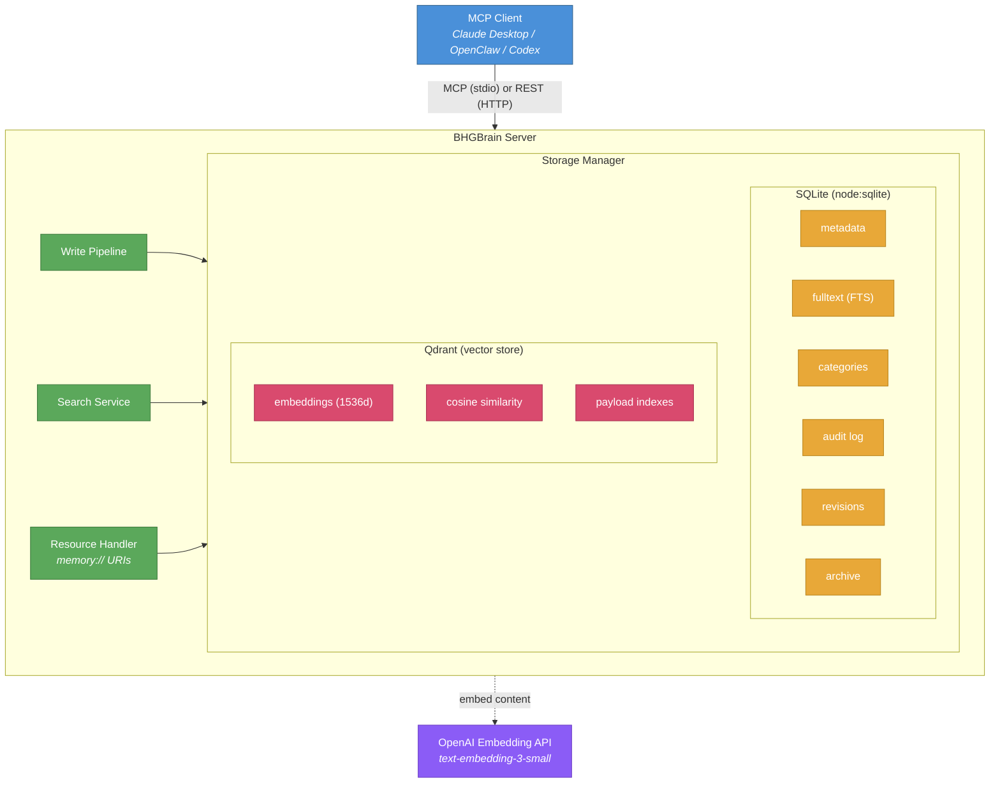
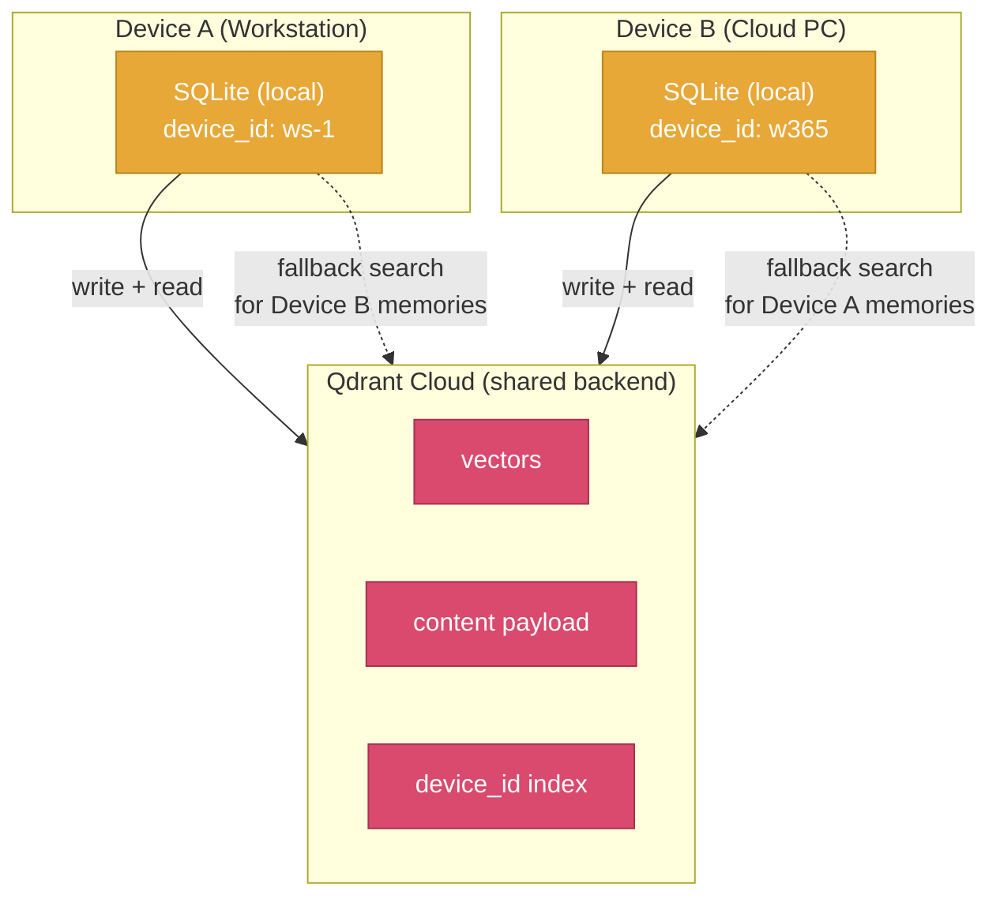
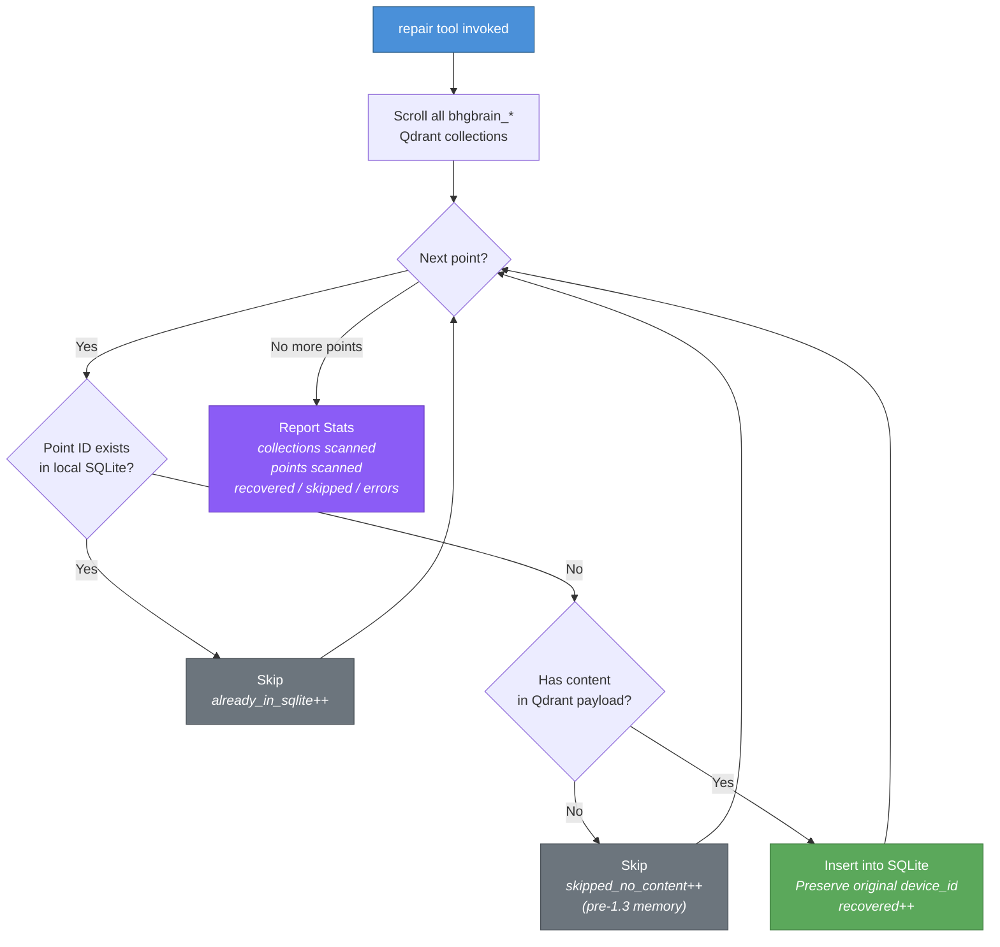
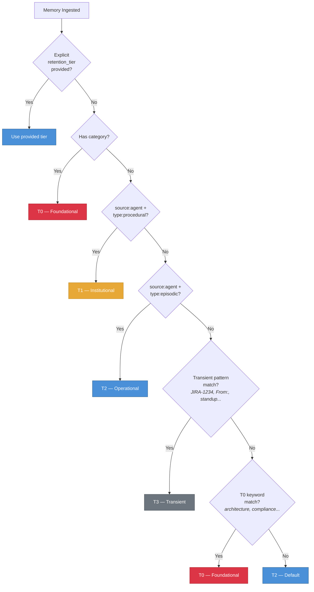
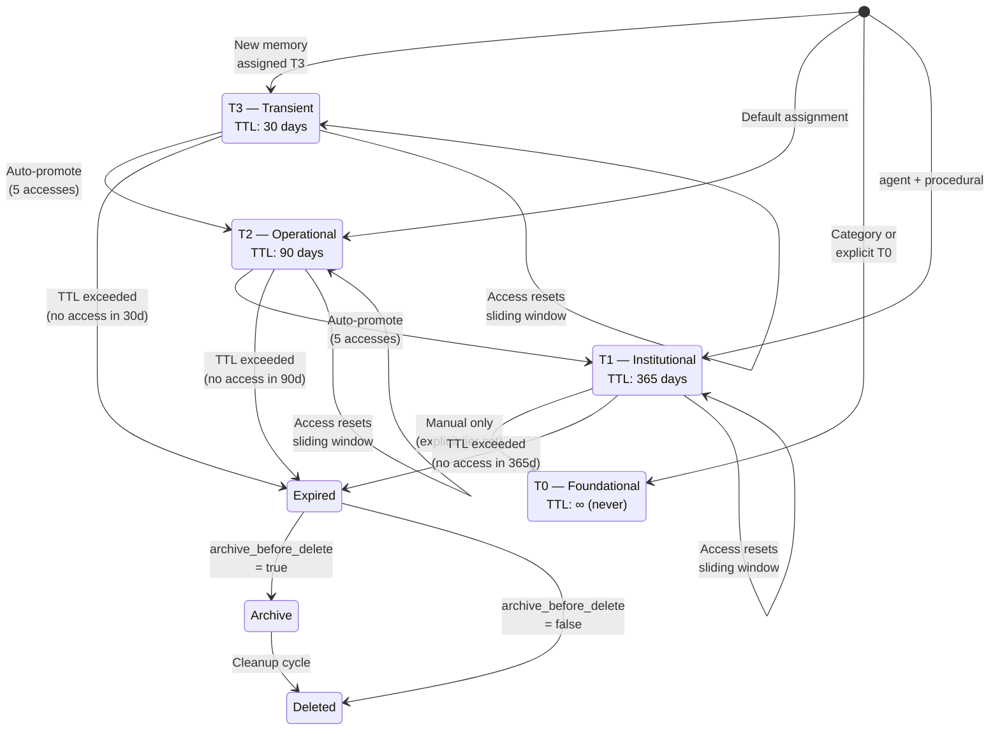
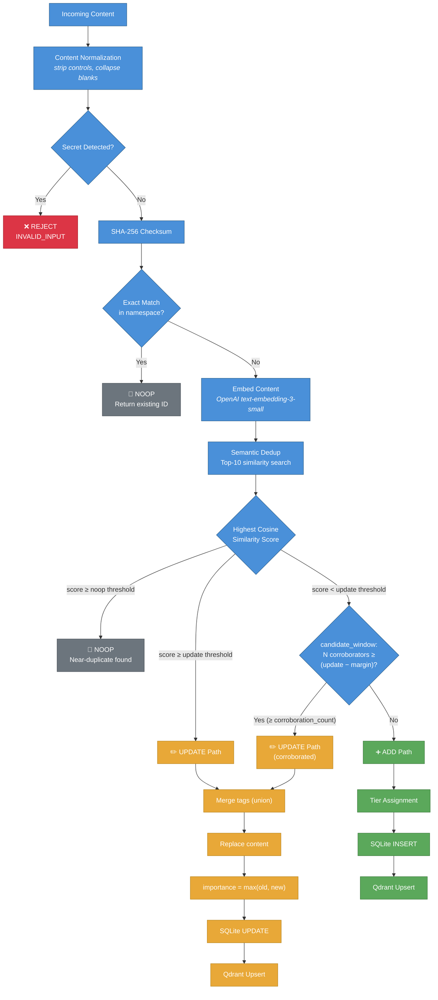
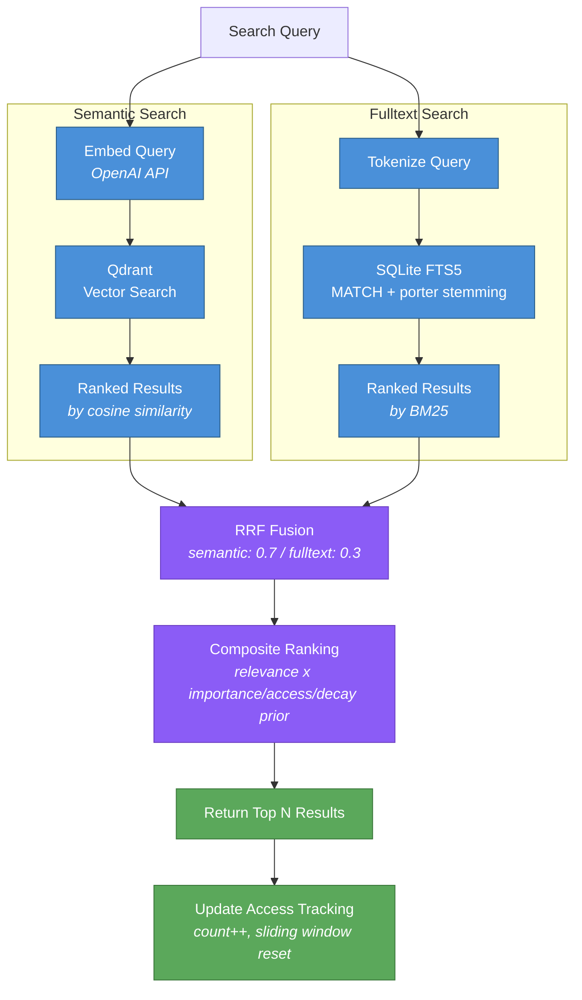
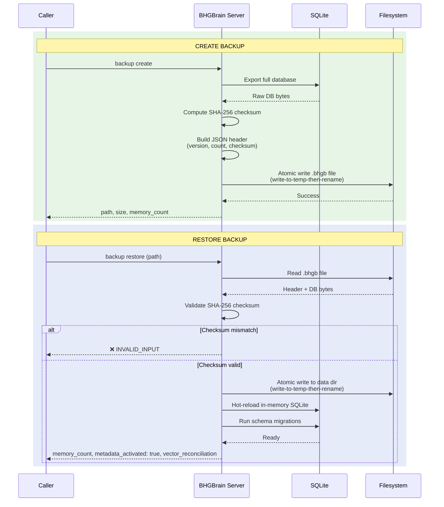

# BHGBrain

Mémoire persistante avec indexation vectorielle pour les clients MCP (Claude, Codex, OpenClaw, etc.).

BHGBrain stocke les souvenirs dans SQLite (métadonnées + recherche plein texte) et Qdrant (vecteurs sémantiques), et les expose via le Model Context Protocol (MCP) en mode stdio, complété par une API REST sur HTTP. Il est conçu pour offrir aux agents IA un second cerveau durable et consultable, persistant d'une session à l'autre — avec gestion complète du cycle de vie, déduplication automatique, rétention par niveaux et recherche hybride.

---

## Table des matières

1. [Vue d'ensemble et architecture](#vue-densemble-et-architecture)
2. [Prérequis](#prérequis)
3. [Configuration de Qdrant](#configuration-de-qdrant)
4. [Installation](#installation)
5. [Configuration](#configuration)
6. [Variables d'environnement](#variables-denvironnement)
7. [Démarrage du serveur](#démarrage-du-serveur)
8. [Configuration du client MCP](#configuration-du-client-mcp)
9. [Mémoire multi-appareils](#mémoire-multi-appareils)
   - [Fonctionnement](#fonctionnement)
   - [Résolution de l'identité de l'appareil](#résolution-de-lidentité-de-lappareil)
   - [Qdrant partagé, SQLite local](#qdrant-partagé-sqlite-local)
   - [Réparation et récupération](#réparation-et-récupération)
   - [Migration du modèle d'embedding](#migration-du-modèle-dembedding)
10. [Gestion de la mémoire](#gestion-de-la-mémoire)
    - [Modèle de données](#modèle-de-données)
    - [Types de mémoire](#types-de-mémoire)
    - [Espaces de noms et collections](#espaces-de-noms-et-collections)
    - [Niveaux de rétention](#niveaux-de-rétention)
    - [Cycle de vie des niveaux — Attribution, Promotion, Fenêtre glissante](#cycle-de-vie-des-niveaux--attribution-promotion-fenêtre-glissante)
    - [Déduplication](#déduplication)
    - [Étiquetage automatique](#étiquetage-automatique)
    - [Provenance du contenu](#provenance-du-contenu)
    - [Normalisation du contenu](#normalisation-du-contenu)
    - [Score d'importance](#score-dimportance)
    - [Catégories — Emplacements de politique persistants](#catégories--emplacements-de-politique-persistants)
    - [Déclin, nettoyage et archivage](#déclin-nettoyage-et-archivage)
    - [Distillation de mémoire](#distillation-de-mémoire)
    - [Avertissements de pré-expiration](#avertissements-de-pré-expiration)
    - [Limites de ressources et budgets de capacité](#limites-de-ressources-et-budgets-de-capacité)
11. [Recherche](#recherche)
    - [Recherche sémantique](#recherche-sémantique)
    - [Recherche plein texte](#recherche-plein-texte)
    - [Recherche hybride](#recherche-hybride)
    - [Recall vs Search — Différences](#recall-vs-search--différences)
    - [Filtrage](#filtrage)
    - [Seuils de score et boosts par niveau](#seuils-de-score-et-boosts-par-niveau)
12. [Sauvegarde et restauration](#sauvegarde-et-restauration)
13. [Santé et métriques](#santé-et-métriques)
14. [Sécurité](#sécurité)
15. [Ressources MCP](#ressources-mcp)
16. [Prompts MCP](#prompts-mcp)
17. [Amorçage](#amorçage)
18. [Référence CLI](#référence-cli)
19. [Référence des outils MCP](#référence-des-outils-mcp)
20. [Docker](#docker)
21. [Mise à jour](#mise-à-jour)
22. [Notes de comportement](#notes-de-comportement)

---

## Vue d'ensemble et architecture

BHGBrain est un serveur de mémoire persistante construit sur le Model Context Protocol. Il stocke tout ce que les agents IA apprennent, décident et observent au fil des sessions — puis rend ces connaissances disponibles via un rappel sémantique, une recherche plein texte et un contexte injecté.

### Architecture à double stockage



- **SQLite** (via le `DatabaseSync` natif de `node:sqlite`, journalisation WAL avec durabilité au niveau des commits) est la **source de référence** pour toutes les métadonnées de mémoire, l'index de recherche plein texte, les catégories, la piste d'audit, l'historique des révisions et les enregistrements d'archive.
- **Qdrant** stocke les embeddings vectoriels sémantiques pour la recherche par similarité. Qdrant est toujours écrit après la réussite de SQLite ; les échecs sont suivis via l'indicateur `vector_synced` et exposés dans le point de terminaison de santé.
- **OpenAI text-embedding-3-small** (par défaut, configurable) génère des embeddings en 1536 dimensions pour chaque souvenir.
- **Les écritures atomiques** garantissent que les fichiers de base de données ne sont jamais partiellement écrits — toutes les E/S disque utilisent le mécanisme d'écriture-vers-temp-puis-renommage.
- **La vidange différée** regroupe les mises à jour des métadonnées d'accès (jusqu'à 5 secondes) pour éviter des vidanges de base de données par requête sur les chemins à lecture intensive.

---

## Prérequis

| Prérequis | Version | Notes |
|---|---|---|
| Node.js | ≥ 22.0.0 | LTS recommandé |
| Qdrant | ≥ 1.10 | Doit être en cours d'exécution avant de démarrer BHGBrain. Le client fourni (`@qdrant/js-client-rest` `~1.19.0`) appelle l'API `query` introduite dans Qdrant 1.10 ; les serveurs plus anciens échoueront lors de la recherche sémantique. |
| Clé API OpenAI | — | Pour les embeddings (`text-embedding-3-small` par défaut). Le serveur démarre en mode dégradé en cas d'absence. |

---

## Configuration de Qdrant

BHGBrain **nécessite une instance Qdrant externe**. Même en mode `embedded` par défaut, le serveur se connecte à `http://localhost:6333` — il n'y a pas de binaire Qdrant intégré. Vous devez le faire fonctionner vous-même.

### Option A : Docker (recommandé)

```bash
docker run -d \
  --name qdrant \
  --restart unless-stopped \
  -p 6333:6333 \
  -v qdrant_storage:/qdrant/storage \
  qdrant/qdrant
```

Vérifiez qu'il fonctionne :

```bash
curl http://localhost:6333/health
# → {"title":"qdrant - vector search engine","version":"..."}
```

### Option B : Docker Compose

```yaml
services:
  qdrant:
    image: qdrant/qdrant
    restart: unless-stopped
    ports:
      - "6333:6333"
    volumes:
      - qdrant_storage:/qdrant/storage

volumes:
  qdrant_storage:
```

### Option C : Binaire natif

Téléchargez depuis [https://github.com/qdrant/qdrant/releases](https://github.com/qdrant/qdrant/releases) et exécutez :

```bash
./qdrant
```

### Option D : Qdrant Cloud (mode externe)

Définissez `qdrant.mode` sur `external` dans votre configuration et pointez `external_url` vers l'URL de votre cluster cloud. Définissez `qdrant.api_key_env` sur le nom de la variable d'environnement contenant votre clé API Qdrant.

```jsonc
{
  "qdrant": {
    "mode": "external",
    "external_url": "https://your-cluster.cloud.qdrant.io",
    "api_key_env": "QDRANT_API_KEY"
  }
}
```

Pour Azure, `embedding.model` correspond au nom de déploiement transmis en amont, pas à l'étiquette publique de la famille de modèles. Les identifiants Azure sont chargés une seule fois au démarrage depuis `AZURE_FOUNDRY_API_KEY` ; faire tourner ce secret nécessite un redémarrage ou un rechargement explicite de la configuration.

`embedding.model` DOIT être l'un des modèles pris en charge — `text-embedding-ada-002`, `text-embedding-3-small` ou `text-embedding-3-large` — pour **les deux** fournisseurs `openai` et `azure-foundry`. Ceci est vérifié au démarrage : un modèle non pris en charge ou mal orthographié (ou, pour Azure, un nom de déploiement qui ne correspond à aucune famille de modèles prise en charge) fait échouer immédiatement la validation de la configuration avec une erreur listant les modèles pris en charge, plutôt que de démarrer et de produire silencieusement des vecteurs de mauvaise dimension.

> **Provisionnement depuis zéro ?** Les scripts PowerShell dans [`scripts/azure/`](./scripts/azure/README.md) créent une ressource Azure AI Foundry / Azure OpenAI, déploient un modèle d'embedding (avec le nom de déploiement calqué sur le nom du modèle, comme requis), et configurent le `config.json` de BHGBrain ainsi que `AZURE_FOUNDRY_API_KEY` pour vous — en partant de rien d'autre qu'un abonnement Azure.

---

## Installation

```bash
git clone https://github.com/Big-Hat-Group-Inc/BHGBrain.git
cd BHGBrain
npm install
npm run build
```

Pour l'installer globalement en tant que CLI :

```bash
npm install -g .
bhgbrain --help
```

---

## Configuration

BHGBrain charge sa configuration depuis :

- **Windows :** `%LOCALAPPDATA%\BHGBrain\config.json`
- **Linux/macOS :** `~/.bhgbrain/config.json`

Le fichier est créé automatiquement au premier démarrage avec toutes les valeurs par défaut appliquées. Modifiez-le pour personnaliser le comportement. Vous pouvez également passer un chemin de configuration personnalisé avec `--config=<chemin>` au démarrage du serveur.

### Référence complète de la configuration

```jsonc
{
  // Répertoire de données (chemin absolu). Par défaut, l'emplacement adapté à la plateforme.
  "data_dir": null,

  // Identité de l'appareil pour les configurations multi-appareils (voir section Mémoire multi-appareils)
  "device": {
    // Identifiant stable de l'appareil. Auto-généré à partir du hostname si omis.
    // Modèle : ^[a-zA-Z0-9._-]{1,64}$
    // Peut également être défini via la variable d'environnement BHGBRAIN_DEVICE_ID.
    "id": null
  },

  // Configuration du fournisseur d'embeddings
  "embedding": {
    // Fournisseur : "openai" ou "azure-foundry"
    "provider": "openai",
    // Nom du modèle (pour OpenAI) ou nom de déploiement Azure (pour Azure).
    // Doit être l'un des modèles pris en charge : "text-embedding-ada-002",
    // "text-embedding-3-small", "text-embedding-3-large". Une valeur non prise
    // en charge fait échouer la validation de la configuration au démarrage,
    // pour l'un ou l'autre fournisseur.
    "model": "text-embedding-3-small",
    // Nom de la variable d'environnement contenant la clé API OpenAI (ignoré pour Azure)
    "api_key_env": "OPENAI_API_KEY",
    // Dimensions vectorielles produites par le modèle. Doit correspondre à la sortie du modèle.
    // IMPORTANT : Modifier cette valeur après la création de collections nécessite de les recréer.
    "dimensions": 1536,
    // Délai d'expiration des requêtes en millisecondes
    "request_timeout_ms": 30000,
    // Nombre maximal d'entrées par requête d'embedding (seuil de découpage en blocs)
    "max_batch_inputs": 2048,
    // Configuration des nouvelles tentatives pour les échecs transitoires
    "retry": {
      "max_attempts": 3,
      "backoff_ms": 1000
    },
    // Chaque vecteur est estampillé à l'écriture avec une identité qualifiée par
    // fournisseur (`<provider>/<model>@<dimensions>`). Si l'identité attendue
    // enregistrée par le store (adoptée à la première écriture suivant le
    // démarrage) diffère de cette configuration — p. ex. après un changement de
    // fournisseur ou de modèle — le composant de santé `embedding` se dégrade
    // et, tant que ce drapeau vaut true, les écritures produisant des vecteurs
    // sont refusées avec une erreur nommant le mode re-embed de l'outil
    // `repair`. Ne le mettez à false que si vous voulez intentionnellement que
    // les écritures mélangent des espaces d'embedding. Voir « Migration du
    // modèle d'embedding » ci-dessous.
    "refuse_writes_on_model_mismatch": true,
    // Configuration spécifique à Azure (requise quand provider = "azure-foundry")
    "azure": {
      // Nom de la ressource Azure utilisé pour construire l'URL du point de terminaison
      "resource_name": "my-foundry-resource",
      // Nom de la variable d'environnement contenant la clé API Azure
      "api_key_env": "AZURE_FOUNDRY_API_KEY"
    }
  },

  // Configuration de connexion Qdrant
  "qdrant": {
    // "embedded" = connexion à localhost:6333
    // "external" = connexion à external_url (Qdrant Cloud, instance distante, etc.)
    "mode": "embedded",
    // Utilisé uniquement en mode embedded (actuellement inutilisé — Qdrant doit être démarré en externe)
    "embedded_path": "./qdrant",
    // URL Qdrant externe (utilisée quand mode = "external")
    "external_url": null,
    // Nom de la variable d'env contenant la clé API Qdrant (utilisée quand mode = "external")
    "api_key_env": null
  },

  // Configuration du transport
  "transport": {
    "http": {
      // Activer le transport HTTP
      "enabled": true,
      // Hôte d'écoute. Utilisez 127.0.0.1 pour loopback uniquement (par défaut, sécurisé).
      // Non-loopback nécessite que BHGBRAIN_TOKEN soit défini (ou allow_unauthenticated_http).
      "host": "127.0.0.1",
      // Port d'écoute
      "port": 3721,
      // Nom de la variable d'env contenant le token Bearer pour l'auth HTTP
      "bearer_token_env": "BHGBRAIN_TOKEN",
      // Timeouts de socket appliqués au http.Server sous-jacent (ms). Les valeurs par
      // défaut sont sûres pour un proxy : keep-alive au-dessus du timeout d'inactivité
      // courant de 60s d'un reverse proxy, et headers timeout au-dessus de cela (Node
      // exige headers_timeout_ms > keep_alive_timeout_ms pour éviter les conditions de
      // course ECONNRESET — la validation de la configuration rejette une valeur qui ne
      // satisfait pas cela).
      "keep_alive_timeout_ms": 65000,
      "headers_timeout_ms": 66000,
      // Temps autorisé pour recevoir entièrement une requête ; ne borne pas les
      // réponses SSE de longue durée sur GET /mcp, qui ne font que recevoir une
      // requête, pas en envoyer une.
      "request_timeout_ms": 300000
    },
    "stdio": {
      // Activer le transport MCP stdio
      "enabled": true
    }
  },

  // Valeurs par défaut appliquées lorsqu'elles ne sont pas spécifiées par les appelants
  "defaults": {
    // Espace de noms par défaut pour toutes les opérations
    "namespace": "global",
    // Collection par défaut pour toutes les opérations
    "collection": "general",
    // Limite de résultats par défaut pour les opérations de rappel
    "recall_limit": 5,
    // Score de similarité sémantique minimal par défaut (0-1) pour le rappel
    "min_score": 0.6,
    // Nombre maximum de souvenirs inclus dans la charge utile d'injection automatique
    "auto_inject_limit": 10,
    // Nombre maximum de caractères dans les charges utiles de réponse des outils
    "max_response_chars": 50000,
    // Limite par namespace des souvenirs avec pinned: true (voir la
    // documentation de remember/tag et de memory://inject)
    "pin_limit_per_namespace": 20
  },

  // Paramètres de rétention et du cycle de vie de la mémoire
  "retention": {
    // Jours sans accès après lesquels un souvenir devient candidat à la péremption
    "decay_after_days": 180,
    // Taille maximale de la base de données SQLite en gigaoctets avant que la santé signale un état dégradé
    "max_db_size_gb": 2,
    // Nombre maximum total de souvenirs avant que la santé signale une surcapacité
    "max_memories": 500000,
    // Pourcentage de max_memories à partir duquel la santé signale un état dégradé
    "warn_at_percent": 80,

    // TTL par niveau en jours (null = n'expire jamais)
    "tier_ttl": {
      "T0": null,    // Fondamental : n'expire jamais
      "T1": 365,     // Institutionnel : 1 an sans accès
      "T2": 90,      // Opérationnel : 90 jours sans accès
      "T3": 30       // Transitoire : 30 jours sans accès
    },

    // Budgets de capacité par niveau (null = illimité)
    "tier_budgets": {
      "T0": null,      // Pas de limite pour les connaissances fondamentales
      "T1": 100000,    // 100 000 souvenirs institutionnels
      "T2": 200000,    // 200 000 souvenirs opérationnels
      "T3": 200000     // 200 000 souvenirs transitoires
    },

    // Seuil de comptage d'accès pour la promotion automatique d'un souvenir d'un niveau
    "auto_promote_access_threshold": 5,

    // Quand true, chaque accès réinitialise l'horloge TTL (fenêtre glissante)
    "sliding_window_enabled": true,

    // Quand true, les souvenirs expirés sont écrits dans la table d'archive avant suppression
    "archive_before_delete": true,

    // Planification cron pour la tâche de nettoyage en arrière-plan (par défaut : 2h du matin UTC quotidiennement)
    "cleanup_schedule": "0 2 * * *",

    // Quand true, le processus serveur exécute `cleanup_schedule` automatiquement via
    // un planificateur interne (même chemin d'exécution que `bhgbrain gc`). Mettre à
    // false pour ne dépendre que d'exécutions manuelles de `bhgbrain gc` ou d'un
    // déclencheur cron externe.
    "scheduled_cleanup_enabled": true,

    // Jours avant expiration à partir desquels les souvenirs sont signalés comme expiring_soon
    "pre_expiry_warning_days": 7,

    // Seuil de compaction de segment Qdrant (compacter quand cette fraction d'un segment est supprimée)
    "compaction_deleted_threshold": 0.10,

    // Limites sur les deux tables d'historique en ajout seul (audit_log,
    // memory_revisions), appliquées par le même nettoyage planifié
    // (bhgbrain gc / scheduled_cleanup_enabled) qui exécute le reste de la
    // rétention ci-dessus. `null` désactive la purge correspondante (le
    // comportement précédent « conserver indéfiniment »). audit_log_max_entries
    // conserve les N lignes les plus récentes par horodatage ;
    // revisions_per_memory_max conserve les N révisions les plus élevées par
    // souvenir. Les valeurs par défaut sont généreuses — un store doit être
    // réellement pérenne avant qu'une purge ne supprime la moindre ligne. Une
    // exécution à blanc (`bhgbrain gc --dry-run`) ne purge jamais.
    "audit_log_max_entries": 50000,
    "revisions_per_memory_max": 20,

    // Distillation de mémoire planifiée : regroupe les souvenirs épisodiques
    // T2/T3 liés et encore actifs, et consolide chaque cluster qualifiant en
    // un souvenir sémantique T1 durable via un appel LLM, en archivant les
    // sources avec leur lignée (voir « Distillation de mémoire » ci-dessous).
    // Désactivée par défaut et sans effet sans clé API d'extraction configurée.
    "distillation": {
      // Interrupteur principal. false (par défaut) : le planificateur ne
      // démarre jamais, et `bhgbrain distill` ignore chaque cluster (no_key)
      // tant qu'aucune clé API d'extraction n'est configurée.
      "enabled": false,

      // Expression cron pour la tâche de distillation en arrière-plan (UTC).
      // Par défaut une heure après cleanup_schedule, pour qu'un stockage
      // tout juste archivé par GC ne soit pas aussi en cours de distillation
      // au même moment.
      "schedule": "0 3 * * *",

      // Seuil de similarité cosinus à partir duquel deux souvenirs
      // épisodiques T2/T3 sont regroupés dans le même cluster.
      // Volontairement conservateur — une fusion erronée n'est pas
      // réversible une fois les sources archivées.
      "similarity_threshold": 0.85,

      // Un cluster plus petit que cette taille est laissé tel quel (signal trop faible).
      "min_cluster_size": 3,

      // Un cluster plus grand que cette taille est scindé de façon
      // déterministe en blocs de cette taille plutôt que distillé en un seul.
      "max_cluster_size": 20,

      // Limite supérieure de clusters distillés (appels LLM) par exécution planifiée.
      "max_clusters_per_run": 10
    }
  },

  // Paramètres de déduplication
  "deduplication": {
    // Activer la déduplication sémantique à l'écriture
    "enabled": true,
    // Seuil de similarité cosinus au-delà duquel le nouveau contenu est considéré comme une MISE À JOUR du contenu existant.
    // Des ajustements spécifiques au niveau sont appliqués en supplément (voir section Déduplication ci-dessous).
    "similarity_threshold": 0.92,
    // Combien des 10 candidats de similarité récupérés le classificateur évalue
    // pour la corroboration (1-10 ; NOOP/DELETE/UPDATE direct n'utilisent toujours que le plus proche).
    "candidate_window": 5,
    // Interrupteur indépendant pour le chemin de corroboration décrit ci-dessous ; false
    // restaure la classification d'avant l'élargissement (candidat unique uniquement),
    // quels que soient les trois autres réglages ci-dessous.
    "corroboration_enabled": true,
    // Nombre minimal de candidats de la fenêtre (y compris le plus proche) devant
    // se situer dans corroboration_margin du seuil de mise à jour pour faire passer ADD à UPDATE.
    "corroboration_count": 2,
    // De combien un candidat peut se situer sous le seuil de mise à jour tout en
    // comptant encore pour la corroboration.
    "corroboration_margin": 0.03
  },

  // Configuration de la recherche
  "search": {
    // Poids utilisés pour la Reciprocal Rank Fusion (RRF) en mode hybride
    // Doit totaliser 1.0
    "hybrid_weights": {
      "semantic": 0.7,
      "fulltext": 0.3
    },
    // Classement composite : ordonne les résultats par pertinence x un prior
    // dérivé de l'importance, de la fréquence d'accès et de la décroissance
    // liée à l'ancienneté selon le niveau (voir "Classement Composite"
    // ci-dessous). enabled: false rétablit le tri par pertinence pure.
    "ranking": {
      "enabled": true,
      "w_importance": 0.3,
      "w_access": 0.2,
      "access_norm": 50,
      // Taux de décroissance exponentielle quotidien par niveau de rétention. T0 vaut 0 (ne décroît jamais).
      "decay_per_day": {
        "T0": 0,
        "T1": 0.002,
        "T2": 0.008,
        "T3": 0.02
      }
    },
    // Étape de rerank LLM optionnelle, pour `recall` uniquement (voir
    // « Rerank » ci-dessous). Désactivée par défaut : lorsqu'elle est
    // activée, envoie la requête et le texte de chaque candidat au LLM
    // configuré pour un jugement de pertinence, remplaçant `score` (jamais
    // `semantic_score`, donc le filtrage min_score n'est pas affecté) pour
    // les candidats notés. Nécessite sa propre BHGBRAIN_RERANK_API_KEY.
    "rerank": {
      "enabled": false,
      "provider": "openai",
      // Combien des candidats déjà classés de `recall` sont envoyés au LLM
      // par appel. 1-50.
      "candidate_pool": 20,
      "model": "gpt-4o-mini",
      "model_env": "BHGBRAIN_RERANK_API_KEY",
      // Tout échec (timeout, réponse non 2xx, réponse malformée) dégrade
      // vers l'ordre pré-rerank plutôt que de faire échouer l'appel recall.
      "timeout_ms": 3000
    },
    // Réordonnancement par diversité Maximal Marginal Relevance, appliqué
    // après le classement composite (voir « Réordonnancement par diversité
    // MMR » ci-dessous). enabled: false rétablit exactement le tri par
    // pertinence composite pure.
    "mmr": {
      "enabled": true,
      "lambda": 0.7,
      "candidate_pool_multiplier": 3,
      "candidate_pool_cap": 50
    },
    // Expansion multi-requête : la recherche/recall sémantique vectorise et
    // recherche plus d'une représentation de la requête, en fusionnant les
    // candidats par id (le score le plus élevé l'emporte) avant le
    // classement (voir « Expansion multi-requête » ci-dessous).
    "query_expansion": {
      "enabled": true,
      // Limite supérieure du nombre total de variantes recherchées
      // (originale + sans mots vides + générées par LLM), indépendante de
      // llm_paraphrase.variant_count.
      "max_variants": 2,
      // Variante déterministe, sans modèle : la requête sans mots vides
      // anglais, recherchée aux côtés de l'originale dès qu'elle en diffère
      // et n'est pas vide.
      "keyword_stripped": true,
      // Génération de variantes optionnelle, assistée par modèle.
      // Désactivée par défaut : c'est la première dépendance de chat LLM
      // sur le chemin actif et elle ajoute latence/coût par appel.
      "llm_paraphrase": {
        "enabled": false,
        // "paraphrase" : reformule la requête. "hyde" : génère un passage
        // de réponse hypothétique et le vectorise à la place (peut
        // améliorer le recall, au prix d'éventuels détails hallucinés —
        // voir le README ci-dessous).
        "mode": "paraphrase",
        "variant_count": 2,
        // Délai d'expiration de la requête de chat-completion ; tout échec
        // (délai dépassé, réponse non-2xx, clé manquante) dégrade
        // silencieusement vers les variantes sans modèle ci-dessus.
        "timeout_ms": 3000
      }
    }
  },

  // Paramètres de sécurité
  "security": {
    // Rejeter les liaisons HTTP non-loopback par défaut (sécurisé en cas d'échec)
    "require_loopback_http": true,
    // Autoriser explicitement l'accès HTTP externe non authentifié (journalise un avertissement très visible)
    "allow_unauthenticated_http": false,
    // Masquer les valeurs de token dans les journaux structurés
    "log_redaction": true,
    // Nombre maximum de requêtes par minute par IP client pour le transport HTTP
    "rate_limit_rpm": 100,
    // Taille maximale du corps de requête HTTP en octets
    "max_request_size_bytes": 1048576,
    // Paramètre "trust proxy" d'Express. false (par défaut) = req.ip est le pair
    // socket direct (précis pour loopback) ; true = respecte X-Forwarded-For envoyé
    // par le proxy inverse en amont. À activer uniquement derrière un proxy de confiance.
    "trust_proxy": false
  },

  // Budget de charge utile d'injection automatique (pour memory://inject et memory://inject/{hint})
  "auto_inject": {
    // Quantité du budget, interprétée selon budget_unit ci-dessous
    "max_chars": 30000,
    // Budget de tokens (null = illimité, le budget en caractères s'applique)
    "max_tokens": null,
    // Fraction du budget réservée à la section des souvenirs, afin que le
    // contenu des catégories ne puisse plus consommer toute la charge
    // utile avant qu'un seul souvenir soit injecté. 0 restaure le
    // comportement préexistant où les catégories peuvent utiliser tout
    // le budget.
    "memory_budget_fraction": 0.4,
    // 'chars' (par défaut) : max_chars est un budget de caractères,
    // inchangé par rapport à avant cette option. 'tokens' : max_chars est
    // traité comme un budget de tokens estimé (caractères/4, sans
    // dépendance à un tokenizer), multipliant par 4 le budget de
    // caractères effectif de chaque section.
    "budget_unit": "chars",
    // Suppression gloutonne des quasi-doublons dans la section des
    // souvenirs sélectionnée par indice : un candidat dont la similarité
    // dépasse deduplication.similarity_threshold par rapport à un
    // souvenir déjà sélectionné est ignoré. Les souvenirs épinglés en sont
    // exemptés dans les deux sens.
    "dedup_suppression": true,
    // Si les souvenirs épinglés sont toujours inclus dans la section des
    // souvenirs (voir defaults.pin_limit_per_namespace et le paramètre
    // `pinned` de remember/tag). false désactive complètement cette étape ;
    // la limite d'épinglage reste appliquée à l'écriture quoi qu'il arrive.
    "pinned_enabled": true
  },

  // Paramètres d'observabilité
  "observability": {
    // Activer la collecte de métriques en cours de processus
    "metrics_enabled": false,
    // Utiliser la journalisation JSON structurée (via pino)
    "structured_logging": true,
    // Niveau de journalisation : "debug" | "info" | "warn" | "error"
    "log_level": "info"
  },

  // Paramètres du pipeline d'ingestion
  "pipeline": {
    // Active l'extraction multi-candidats basée sur LLM : divise le contenu
    // `remember` à faits multiples en souvenirs candidats atomiques avant
    // déduplication/écriture. Par défaut false — opt-in délibéré, car
    // l'activer dépense un appel LLM (coût + latence) sur chaque `remember`
    // suffisamment long. Quand false, ou si aucune clé API ne se résout,
    // l'extraction émet toujours exactement un candidat (comportement actuel).
    "extraction_enabled": false,
    // Modèle de chat-completions utilisé pour l'extraction
    "extraction_model": "gpt-4o-mini",
    // Nom de la variable d'env pour la clé API du modèle d'extraction ; se rabat sur OPENAI_API_KEY
    "extraction_model_env": "BHGBRAIN_EXTRACTION_API_KEY",
    // Un contenu plus court que ceci (caractères) saute l'appel LLM et passe
    // directement à l'extraction à candidat unique
    "extraction_min_chars": 120,
    // Les candidats au-delà de cette limite sont abandonnés (pas fusionnés), journalisés et comptés
    "extraction_max_candidates": 6,
    // Délai d'expiration de la requête d'extraction en millisecondes, appliqué via AbortController
    "extraction_timeout_ms": 4000,
    // Quand true, se rabat sur la déduplication par somme de contrôle + similarité plein texte si l'embedding est indisponible
    "fallback_to_threshold_dedup": true,
    // Active un niveau optionnel de résumé basé sur LLM : un appel de
    // chat-completion peu coûteux produit le champ `summary` du souvenir au
    // lieu du résumeur extractif gratuit et intégré. Par défaut false — comme
    // pour l'extraction, il s'agit d'un nouvel appel externe avec des
    // implications de coût/latence, opt-in délibéré. Tout échec (clé
    // manquante, réponse non-2xx, délai dépassé, erreur réseau) se rabat sur
    // le niveau extractif pour cette écriture ; le résumé ne bloque ni ne fait
    // jamais échouer un appel `remember`/`revert`.
    "summarization_enabled": false,
    // Modèle de chat-completions utilisé pour le résumé
    "summarization_model": "gpt-4o-mini",
    // Nom de la variable d'env pour la clé API du modèle de résumé. Par défaut
    // la même variable que extraction_model_env (les deux sont des appels de
    // modèle peu coûteux sur le chemin d'écriture contre le même compte
    // OpenAI) — pointez-la ailleurs pour une clé séparée.
    "summarization_model_env": "BHGBRAIN_EXTRACTION_API_KEY",
    // Délai d'expiration de la requête de résumé en millisecondes, appliqué via AbortController
    "summarization_timeout_ms": 3000,
    // Étiquetage de contenu déterministe et sans dépendance : dérive des tags
    // supplémentaires à partir de tokens en forme de code, de chemins de
    // fichiers, d'abréviations de dépôt (owner/repo) et de @mentions présents
    // dans le contenu normalisé, puis les unit avec les tags fournis par
    // l'appelant. Aucun appel LLM, aucun réseau. `false` restaure exactement le
    // comportement antérieur à cette fonctionnalité. Voir « Étiquetage
    // automatique » ci-dessous.
    "auto_tag_enabled": true,
    // Borne supérieure de tags auto-dérivés ajoutés par souvenir, appliquée
    // avant la fusion avec les tags fournis par l'appelant et le troncage à la
    // limite de 20 tags par souvenir (le troncage privilégie toujours les tags
    // fournis par l'appelant).
    "auto_tag_max_per_memory": 6
  },

  // Contrôle le niveau de qualité utilisé pour générer le champ `summary` de
  // chaque souvenir. true (par défaut) : un résumeur extractif sans
  // dépendance note chaque phrase du contenu par fréquence de termes et
  // choisit la plus représentative (se rabattant en outre sur le niveau LLM
  // ci-dessus quand pipeline.summarization_enabled est true et qu'il répond).
  // false : le chemin le moins coûteux possible — summary est simplement la
  // première ligne du contenu, tronquée à 120 caractères — quel que soit
  // pipeline.summarization_enabled.
  "auto_summarize": true
}
```

---

## Variables d'environnement

| Variable | Obligatoire | Défaut | Description |
|---|---|---|---|
| `OPENAI_API_KEY` | Oui (pour le fournisseur OpenAI) | — | Clé API OpenAI. Le serveur démarre en **mode dégradé** si elle est absente — la recherche sémantique et l'ingestion échoueront, mais la recherche plein texte et les lectures de catégories fonctionneront encore. |
| `AZURE_FOUNDRY_API_KEY` | Oui (pour le fournisseur Azure) | — | Clé API Azure pour le point de terminaison d'embeddings compatible Azure OpenAI. Requise quand `embedding.provider = "azure-foundry"`. |
| `BHGBRAIN_TOKEN` | Obligatoire pour HTTP non-loopback | — | Token Bearer pour l'authentification HTTP. Le serveur **refuse de démarrer** si l'hôte est non-loopback et que ce token n'est pas défini (sauf si `allow_unauthenticated_http: true`). |
| `QDRANT_API_KEY` | Obligatoire pour Qdrant Cloud | — | Définissez `qdrant.api_key_env` dans la configuration sur le nom de cette variable. Le nom de champ de configuration par défaut est `QDRANT_API_KEY`. |
| `BHGBRAIN_DEVICE_ID` | Non | Auto-généré à partir du hostname | Remplace l'identifiant de l'appareil pour les configurations multi-appareils. Voir [Résolution de l'identité de l'appareil](#résolution-de-lidentité-de-lappareil). |
| `BHGBRAIN_EXTRACTION_API_KEY` | Non | Se rabat sur `OPENAI_API_KEY` | Clé API pour le modèle d'extraction LLM, utilisée quand `pipeline.extraction_enabled` vaut `true`. Également la valeur par défaut de `pipeline.summarization_model_env` (utilisée quand `pipeline.summarization_enabled` vaut `true`) — pointez ce champ vers une autre variable si vous voulez une clé séparée pour le résumé. Également lue par la phase de paraphrase/HyDE LLM de l'expansion multi-requête (`search.query_expansion.llm_paraphrase.enabled`, voir [Expansion multi-requête](#expansion-multi-requête)), qui résout la clé de la même façon depuis `pipeline.extraction_model_env`, avec repli sur `OPENAI_API_KEY` si non définie. |
| `BHGBRAIN_RERANK_API_KEY` | Non | — (**aucun** repli sur `OPENAI_API_KEY`) | Clé API pour l'étape de rerank optionnelle de `recall`, utilisée quand `search.rerank.enabled` vaut `true`. Contrairement à `BHGBRAIN_EXTRACTION_API_KEY`, il n'y a pas de repli implicite — activer le rerank est un opt-in délibéré, avec sa propre clé, qui ne consomme jamais silencieusement la clé/le budget d'embedding ou d'extraction. Voir [Rerank](#rerank). |

Générez un token Bearer sécurisé :

```bash
bhgbrain server token
# ou sans le CLI :
node -e "console.log(require('crypto').randomBytes(32).toString('hex'))"
```

---

## Démarrage du serveur

### Mode stdio (MCP via stdin/stdout)

C'est le mode par défaut utilisé par les clients MCP tels que Claude Desktop. L'indicateur `--stdio` demande explicitement le transport stdio.

```bash
# Développement (aucune compilation requise)
npm run dev

# Production via CLI
node dist/index.js --stdio

# Avec un fichier de configuration personnalisé
node dist/index.js --stdio --config=/chemin/vers/config.json
```

### Mode HTTP

> Ce transport parle du vrai MCP sur HTTP — le transport **Streamable HTTP** sur
> `/mcp`, permettant à plusieurs clients MCP de partager un seul processus serveur de
> longue durée — en plus d'une simple API REST (`POST /tool/:name`, `GET /resource`)
> pour les scripts, les sondes de santé et la CLI. Voir « Configuration des clients
> MCP » pour pointer un client compatible Streamable HTTP vers `/mcp`.

HTTP est activé par défaut sur `127.0.0.1:3721`. Définissez `BHGBRAIN_TOKEN` avant de démarrer si vous souhaitez un accès authentifié :

```bash
export OPENAI_API_KEY=sk-...
export BHGBRAIN_TOKEN=<votre-token>
node dist/index.js
```

Le serveur écoute par défaut sur `http://127.0.0.1:3721`. Points de terminaison HTTP disponibles :

| Point de terminaison | Auth requise | Description |
|---|---|---|
| `GET /health` | Non | Vérification de santé (non authentifiée pour la compatibilité des sondes) |
| `POST /mcp` | Oui | MCP Streamable HTTP : requêtes JSON-RPC ; une requête `initialize` crée une nouvelle session |
| `GET /mcp` | Oui | MCP Streamable HTTP : canal SSE autonome pour une session existante |
| `DELETE /mcp` | Oui | MCP Streamable HTTP : termine une session |
| `POST /tool/:name` | Oui | Couche de confort REST : invoquer directement un outil MCP nommé |
| `GET /resource?uri=...` | Oui | Couche de confort REST : lire directement une ressource MCP par URI |
| `GET /metrics` | Oui | Métriques au format Prometheus (si `metrics_enabled: true`) |

Chaque session `/mcp` est un serveur MCP neuf, en mémoire, partageant le même stockage
sous-jacent que toute autre session et les points de terminaison REST — redémarrer le
processus supprime toutes les sessions, et les clients conformes à la spécification se
réinitialisent automatiquement.

Exemple de vérification de santé :

```bash
curl http://127.0.0.1:3721/health
```

Exemple d'appel d'outil via HTTP :

```bash
curl -X POST http://127.0.0.1:3721/tool/remember \
  -H "Authorization: Bearer <votre-token>" \
  -H "Content-Type: application/json" \
  -d '{"content": "Our auth service uses JWT with 1h expiry", "type": "semantic", "tags": ["auth", "architecture"]}'
```

---

## Configuration du client MCP

### Claude Desktop (`claude_desktop_config.json`)

```json
{
  "mcpServers": {
    "bhgbrain": {
      "command": "node",
      "args": ["C:/path/to/BHGBrain/dist/index.js"],
      "env": {
        "OPENAI_API_KEY": "sk-..."
      }
    }
  }
}
```

### Claude Desktop (CLI installé globalement)

```json
{
  "mcpServers": {
    "bhgbrain": {
      "command": "bhgbrain",
      "args": ["server", "start"],
      "env": {
        "OPENAI_API_KEY": "sk-..."
      }
    }
  }
}
```

### OpenClaw / mcporter (transport Streamable HTTP)

Le serveur HTTP de BHGBrain parle du vrai MCP sur `/mcp` via le transport
**Streamable HTTP** (voir « Mode HTTP ») — démarrez le serveur une fois et pointez
chaque client MCP vers la même URL, afin qu'ils partagent un seul processus de longue
durée et un backend SQLite/Qdrant commun, plutôt que chaque client ne lance son propre
processus enfant `--stdio` isolé :

```json
{
  "mcpServers": {
    "bhgbrain": {
      "transport": "http",
      "url": "http://127.0.0.1:3721/mcp",
      "headers": {
        "Authorization": "Bearer <your-token>"
      }
    }
  }
}
```

Démarrez d'abord le serveur (`node dist/index.js` ou `bhgbrain server start`) avec
`BHGBRAIN_TOKEN` défini à la même valeur que dans l'en-tête ci-dessus.

#### Transport stdio (alternative : un processus par client)

Les clients qui ne prennent en charge que stdio (ou qui ne doivent pas partager un
serveur en cours d'exécution) peuvent toujours lancer leur propre processus enfant
`bhgbrain-server --stdio`. Cela reste entièrement pris en charge, mais chaque client
qui le fait obtient son propre processus isolé — aucun état n'est partagé avec les
autres clients tant qu'il n'a pas été écrit dans SQLite/Qdrant.

```json
{
  "mcpServers": {
    "bhgbrain": {
      "transport": "stdio",
      "command": "bhgbrain-server",
      "args": ["--stdio"],
      "env": {
        "OPENAI_API_KEY": "sk-...",
        "QDRANT_API_KEY": "..."
      }
    }
  }
}
```

Ou sur une copie des sources plutôt que sur le binaire installé globalement :

```json
{
  "mcpServers": {
    "bhgbrain": {
      "transport": "stdio",
      "command": "node",
      "args": ["/chemin/vers/BHGBrain/dist/index.js", "--stdio"],
      "env": {
        "OPENAI_API_KEY": "sk-...",
        "QDRANT_API_KEY": "..."
      }
    }
  }
}
```

> **OpenClaw tourne dans WSL ou dans un conteneur avec le transport stdio ?** BHGBrain
> doit être installé dans ce même environnement. stdio signifie que le client lance le
> serveur comme processus enfant : le serveur ne peut donc pas résider dans une autre
> distribution ou un autre conteneur. Le transport Streamable HTTP ci-dessus évite
> entièrement ce problème — pointez les clients de n'importe quel environnement vers la
> même URL `http://host:3721/mcp`. Pour partager la mémoire entre des instances de
> serveur séparées, donnez à chaque installation sa propre base SQLite et pointez-les
> toutes vers le même cluster Qdrant (voir « Mémoire multi-appareils »).

---

## Mémoire multi-appareils

BHGBrain prend en charge l'exécution de plusieurs instances sur différentes machines (par ex. un poste de travail principal et un environnement de développement cloud) qui partagent le même backend Qdrant Cloud. Chaque instance maintient sa propre base de données SQLite locale tout en lisant et écrivant dans un magasin vectoriel partagé.

### Fonctionnement



Chaque écriture de souvenir stocke le contenu complet dans SQLite (local) et dans la charge utile Qdrant (partagée). Cela signifie :

- **Aucun point de défaillance unique** : Si le SQLite d'un appareil est perdu, le contenu peut être récupéré depuis Qdrant.
- **Visibilité inter-appareils** : Tous les appareils voient tous les souvenirs via Qdrant, même si leur SQLite local n'en contient qu'un sous-ensemble.
- **Suivi de la provenance** : Chaque souvenir est étiqueté avec le `device_id` de l'instance qui l'a créé.

### Résolution de l'identité de l'appareil

Chaque instance BHGBrain résout un `device_id` stable au démarrage, en utilisant cet ordre de priorité :

1. **Variable d'environnement** : `BHGBRAIN_DEVICE_ID` — a la priorité sur une valeur persistée, conformément au contrat « les variables d'environnement gagnent » appliqué à tout autre override `BHGBRAIN_*` (voir [Configuration vs. environnement](#configuration)). Lorsqu'elle remplace un `device.id` déjà persisté, la nouvelle valeur est re-persistée.
2. **Configuration explicite/persistée** : champ `device.id` dans `config.json`
3. **Auto-généré** : Dérivé de `os.hostname()`, mis en minuscules et assaini en `[a-zA-Z0-9._-]`

Au premier lancement, l'ID résolu est persisté dans `config.json` afin qu'il reste stable entre les redémarrages, même si le hostname change ultérieurement. `config.json` n'est réécrit que lorsque l'id de l'appareil a été nouvellement généré ou modifié par un override d'environnement — un démarrage en état stable avec un id déjà persisté et inchangé n'entraîne aucune écriture.

```jsonc
// config.json — section device
{
  "device": {
    "id": "cpc-kevin-98f91"   // auto-généré depuis le hostname, ou défini explicitement
  }
}
```

Le `device_id` apparaît dans :
- Chaque charge utile Qdrant (en tant que champ indexé par mot-clé)
- Chaque enregistrement de souvenir SQLite
- Les résultats de recherche (pour que les appelants puissent identifier quel appareil a créé un souvenir)

### Qdrant partagé, SQLite local

Chaque appareil maintient sa propre base de données SQLite de manière indépendante. Il n'y a pas de protocole de synchronisation entre les appareils — Qdrant est la couche partagée.

**Ce que chaque appareil voit :**

| Source | L'appareil A voit | L'appareil B voit |
|---|---|---|
| Souvenirs de l'appareil A (via SQLite local) | ✅ Enregistrement complet | ❌ Absent du SQLite local |
| Souvenirs de l'appareil A (via repli Qdrant) | ✅ Enregistrement complet | ✅ Contenu depuis la charge utile Qdrant |
| Souvenirs de l'appareil B (via SQLite local) | ❌ Absent du SQLite local | ✅ Enregistrement complet |
| Souvenirs de l'appareil B (via repli Qdrant) | ✅ Contenu depuis la charge utile Qdrant | ✅ Enregistrement complet |

Lorsqu'une recherche renvoie un souvenir qui existe dans Qdrant mais pas dans le SQLite local, BHGBrain construit le résultat à partir de la charge utile Qdrant au lieu de l'ignorer silencieusement. Cela signifie que les deux appareils obtiennent des résultats de recherche complets, quel que soit l'appareil qui a créé le souvenir.

### Réparation et récupération



L'outil `repair` reconstruit le SQLite local d'un appareil à partir de Qdrant. Utilisez-le après :

- La configuration d'un nouvel appareil qui partage un backend Qdrant existant
- La récupération après une perte de données SQLite
- La migration vers une nouvelle machine

```json
// Aperçu de ce qui serait récupéré (aucune modification)
{ "dry_run": true }

// Récupérer tous les souvenirs de Qdrant dans le SQLite local
{ "dry_run": false }

// Récupérer uniquement les souvenirs créés par un appareil spécifique
{ "device_id": "cpc-kevin-98f91", "dry_run": false }
```

L'outil de réparation :
- Parcourt tous les points de toutes les collections Qdrant `bhgbrain_*`
- Insère tout souvenir ayant du `content` dans sa charge utile Qdrant et absent du SQLite local
- Préserve la provenance `device_id` d'origine (ou étiquette avec l'ID de l'appareil local si aucun n'existe)
- Rapporte : collections parcourues, points parcourues, récupérés, ignorés (sans contenu), erreurs

**Note** : Les souvenirs stockés avant l'ajout de la fonctionnalité de contenu dans Qdrant (pré-1.3) n'ont pas de contenu dans leur charge utile Qdrant et ne peuvent pas être récupérés via l'outil de réparation. Seules les métadonnées (tags, type, importance) subsistent pour ces entrées.

### Migration du modèle d'embedding

Chaque vecteur est estampillé à l'écriture avec une identité qualifiée par
fournisseur — `<provider>/<model>@<dimensions>` (p. ex. `openai/text-embedding-3-small@1536`)
— à la fois sur la ligne SQLite et dans la charge utile Qdrant. Le store mémorise
également cette identité comme attente, adoptée à la première écriture suivant le
démarrage.

Cela existe parce que mélanger des espaces d'embedding est une corruption
silencieuse : si vous changez `embedding.provider` ou `embedding.model` dans
`config.json` en gardant les mêmes dimensions (p. ex. en passant à un déploiement
Azure de la même famille de modèles), rien au niveau de Qdrant ne le détecte — les
nouveaux vecteurs se retrouvent dans la même collection que les anciens, la
similarité cosinus entre les deux espaces n'a plus de sens, et la pertinence du
recall comme la déduplication (les scores du candidat le plus proche et de la
fenêtre de candidats alimentant les seuils 0.92/0.98) se dégradent silencieusement. Un changement de dimensions échoue
bruyamment avec une erreur Qdrant opaque à la place ; l'estampillage de provenance
rend les deux cas bruyants et actionnables.

**Ce qui se passe après un changement de modèle :**

1. Au prochain démarrage (ou bilan de santé), l'identité attendue enregistrée par le
   store ne correspond plus à la configuration active. Le composant de santé
   `embedding` se dégrade avec un message nommant les deux identités, et un
   avertissement structuré `embedding_identity_mismatch` est journalisé.
2. Tant que `embedding.refuse_writes_on_model_mismatch` vaut `true` (par défaut),
   les écritures produisant des vecteurs (remember, ré-embeddings déclenchés par
   tag, réconciliation de restauration) échouent avec une erreur `CONFLICT`
   actionnable nommant le chemin de ré-embedding. Les lectures continuent de
   fonctionner — recall et search continuent de servir les anciens vecteurs, avec
   simplement une santé dégradée.
3. Exécutez la migration :

   ```bash
   bhgbrain repair --re-embed              # migrer les lignes à l'estampille obsolète
   bhgbrain repair --re-embed --dry-run    # prévisualiser combien de lignes seraient ré-embeddées
   bhgbrain repair --re-embed --include-legacy   # inclure aussi les lignes sans aucune estampille
   ```

   Ou via l'outil MCP `repair` avec `mode: "re-embed"` (voir
   [Référence des outils MCP](#référence-des-outils-mcp)). La migration ré-embedde
   les souvenirs non concordants par lots bornés et reprenables — l'estampille
   elle-même sert de marqueur de progression, si bien qu'une exécution interrompue
   reprend sans répéter les lignes déjà traitées, et l'échec d'un seul
   embed/upsert est isolé plutôt que d'interrompre tout le lot.
4. Une fois qu'il ne reste plus de lignes à l'estampille obsolète, l'identité
   attendue du store se met à jour automatiquement et la dégradation de santé
   `embedding` disparaît — sans redémarrage.

**Notes :**
- Les lignes héritées écrites avant l'estampillage de provenance n'ont aucune
  estampille (`null`) et sont traitées comme « inconnues » — exclues du
  ré-embedding sauf si `--include-legacy` / `include_legacy: true` est passé,
  afin qu'une première mise à niveau ne déclenche pas par surprise un
  ré-embedding complet du corpus (et son coût d'API d'embedding).
- Le ré-embedding est toujours initié par l'opérateur — jamais automatiquement,
  car il appelle l'API d'embedding payante une fois par souvenir migré.
- Ne définissez `embedding.refuse_writes_on_model_mismatch` sur `false` que si
  vous souhaitez intentionnellement que les écritures continuent en mélangeant
  les espaces d'embedding (p. ex. une fenêtre de migration délibérée et
  surveillée) — l'estampille continue d'enregistrer ce qui s'est passé.
- Les souvenirs archivés ne sont jamais ré-embeddés ; leurs vecteurs sont déjà
  supprimés par conception (voir
  [Déclin, nettoyage et archivage](#déclin-nettoyage-et-archivage)).

### Exemple de configuration multi-appareils

**Appareil A** (`config.json`) :
```jsonc
{
  "device": { "id": "workstation" },
  "qdrant": {
    "mode": "external",
    "external_url": "https://your-cluster.cloud.qdrant.io",
    "api_key_env": "QDRANT_API_KEY"
  }
}
```

**Appareil B** (`config.json`) :
```jsonc
{
  "device": { "id": "cloud-pc" },
  "qdrant": {
    "mode": "external",
    "external_url": "https://your-cluster.cloud.qdrant.io",
    "api_key_env": "QDRANT_API_KEY"
  }
}
```

Les deux pointent vers le même cluster Qdrant. Chacun obtient son propre `device_id`. Tous les souvenirs convergent vers les mêmes collections vectorielles et sont visibles par les deux instances.

---

## Gestion de la mémoire

Cette section décrit le cycle de vie complet de la mémoire — de l'ingestion à la classification, en passant par la déduplication, le suivi des accès, la promotion, le déclin et l'expiration finale ou la rétention permanente.

### Modèle de données

Chaque souvenir stocké dans BHGBrain est un `MemoryRecord` avec les champs suivants :

| Champ | Type | Description |
|---|---|---|
| `id` | `string (UUID)` | Identifiant unique mondial |
| `namespace` | `string` | Espace de noms de portée (ex. `"global"`, `"project/alpha"`, `"user/kevin"`) |
| `collection` | `string` | Sous-groupe au sein d'un espace de noms (ex. `"general"`, `"architecture"`, `"decisions"`) |
| `type` | `"episodic" \| "semantic" \| "procedural"` | Type de mémoire (voir Types de mémoire) |
| `category` | `string \| null` | Nom de catégorie si ce souvenir est rattaché à une catégorie de politique persistante |
| `content` | `string` | Contenu complet du souvenir (jusqu'à 100 000 caractères) |
| `summary` | `string` | Résumé auto-généré de la première ligne (jusqu'à 120 caractères) |
| `tags` | `string[]` | Tags libres (alphanumériques + tirets, max 20 tags, max 100 caractères chacun). Inclut les tags fournis par l'appelant et les tags auto-dérivés du contenu — voir [Étiquetage automatique](#étiquetage-automatique). |
| `source` | `"cli" \| "api" \| "agent" \| "import" \| "distillation"` | Comment le souvenir a été créé. `"distillation"` n'est écrit que par la tâche de distillation planifiée (voir [Distillation de mémoire](#distillation-de-mémoire)) |
| `checksum` | `string` | Hachage SHA-256 du contenu normalisé (utilisé pour la déduplication exacte) |
| `embedding` | `number[]` | Embedding vectoriel (non stocké dans SQLite ; réside dans Qdrant) |
| `importance` | `number (0–1)` | Score d'importance (par défaut 0,5) |
| `retention_tier` | `"T0" \| "T1" \| "T2" \| "T3"` | Niveau de cycle de vie régissant le TTL et le comportement de nettoyage |
| `expires_at` | `string (ISO 8601) \| null` | Horodatage d'expiration (null pour T0 — n'expire jamais) |
| `decay_eligible` | `boolean` | Si le souvenir participe au nettoyage TTL (false pour T0) |
| `review_due` | `string (ISO 8601) \| null` | Date de révision T1 (définie à created_at + 365 jours ; réinitialisée à l'accès) |
| `access_count` | `number` | Nombre de fois que ce souvenir a été récupéré |
| `last_accessed` | `string (ISO 8601)` | Horodatage de la dernière récupération |
| `last_operation` | `"ADD" \| "UPDATE" \| "DELETE" \| "NOOP"` | Opération d'écriture la plus récente appliquée |
| `merged_from` | `string \| null` | ID du souvenir dont celui-ci a été fusionné (chemin UPDATE de déduplication) |
| `derived_from` | `string[] \| null` | IDs des souvenirs épisodiques T2/T3 archivés dont ce souvenir a été distillé. Défini uniquement par la tâche de distillation ; `null` pour toute écriture ordinaire (voir [Distillation de mémoire](#distillation-de-mémoire)) |
| `archived` | `boolean` | Si ce souvenir est archivé de façon logicielle (exclu de la recherche/du rappel) |
| `vector_synced` | `boolean` | Si le vecteur Qdrant est synchronisé avec l'état SQLite |
| `pinned` | `boolean` | Si ce souvenir est toujours inclus dans les charges utiles `memory://inject`, limité par `defaults.pin_limit_per_namespace` ; sans effet sur `search`/`recall` |
| `device_id` | `string \| null` | Identifiant de l'instance BHGBrain qui a créé ce souvenir (voir [Mémoire multi-appareils](#mémoire-multi-appareils)) |
| `created_at` | `string (ISO 8601)` | Horodatage de création |
| `updated_at` | `string (ISO 8601)` | Horodatage de la dernière mise à jour |
| `last_accessed` | `string (ISO 8601)` | Horodatage du dernier accès |

#### Schéma SQLite

La table `memories` dispose d'index complets pour un filtrage efficace :

```sql
CREATE INDEX idx_memories_namespace   ON memories(namespace);
CREATE INDEX idx_memories_collection  ON memories(namespace, collection);
CREATE INDEX idx_memories_checksum    ON memories(namespace, checksum);
CREATE INDEX idx_memories_type        ON memories(namespace, type);
CREATE INDEX idx_memories_category    ON memories(category);
CREATE INDEX idx_memories_tier        ON memories(namespace, collection, retention_tier);
CREATE INDEX idx_memories_expiry      ON memories(decay_eligible, expires_at);
CREATE INDEX idx_memories_review_due  ON memories(retention_tier, review_due);
CREATE INDEX idx_memories_archived    ON memories(archived);
CREATE INDEX idx_memories_vector_sync ON memories(vector_synced);
CREATE INDEX idx_memories_pinned      ON memories(namespace, pinned);
```

#### Index de charge utile Qdrant

Chaque collection Qdrant maintient les index de charge utile suivants pour un filtrage efficace côté vecteur :

- `namespace` (keyword)
- `type` (keyword)
- `retention_tier` (keyword)
- `decay_eligible` (boolean)
- `expires_at` (integer — stocké en secondes epoch Unix)
- `device_id` (keyword)

---

### Types de mémoire

Chaque souvenir est classifié dans l'un des trois types sémantiques. Le type est utilisé pour le filtrage dans les opérations de rappel et de recherche, et il influence le niveau de rétention par défaut attribué lors de l'ingestion.

| Type | Signification | Contenu typique | Niveau par défaut |
|---|---|---|---|
| `episodic` | Un événement, une observation ou une occurrence spécifique à un moment précis | Résultats de réunions, sessions de débogage, contexte de tâche, ce qui s'est passé durant un sprint | `T2` (opérationnel) |
| `semantic` | Un fait, un concept ou une information non liés à un moment précis | Comment un système fonctionne, la signification d'un terme, une valeur de configuration, un modèle de données | `T2` (opérationnel) |
| `procedural` | Un processus, un flux de travail ou des instructions de réalisation | Runbooks, étapes de déploiement, normes de codage, comment effectuer une tâche | `T1` (institutionnel) |

**Influence du type sur l'attribution du niveau :**
- `source: agent` + `type: procedural` → attribué automatiquement `T1` (institutionnel)
- `source: agent` + `type: episodic` → attribué automatiquement `T2` (opérationnel)
- `source: cli` (n'importe quel type) → attribué automatiquement `T2` (opérationnel)
- `source: import` avec signaux de contenu T0 → `T0` indépendamment du type

Si vous ne fournissez pas de type, le pipeline prend `"semantic"` par défaut.

---

### Espaces de noms et collections

**Les espaces de noms** sont des identificateurs de portée de premier niveau qui isolent les souvenirs de différents contextes, utilisateurs ou projets. Toutes les opérations d'outils nécessitent un espace de noms (par défaut : `"global"`).

- Modèle d'espace de noms : `^[a-zA-Z0-9/-]{1,200}$` — caractères alphanumériques, tirets et barres obliques
- Exemples : `"global"`, `"project/alpha"`, `"user/kevin"`, `"tenant/acme-corp"`
- Les souvenirs dans différents espaces de noms ne sont jamais renvoyés dans les recherches des uns et des autres
- Chaque paire espace de noms+collection correspond à une collection Qdrant distincte (nommée `bhgbrain_{namespace}_{collection}`)

**Les collections** sont des sous-groupes au sein d'un espace de noms. Elles permettent de partitionner les souvenirs par sujet ou par objectif sans créer des espaces de noms entièrement séparés.

- Modèle de collection : `^[a-zA-Z0-9-]{1,100}$`
- Exemples : `"general"`, `"architecture"`, `"decisions"`, `"onboarding"`
- Les collections sont suivies dans la table SQLite `collections` avec leur modèle d'embedding et leurs dimensions verrouillés au moment de la création — vous ne pouvez pas mélanger des modèles d'embedding au sein d'une collection
- Utilisez l'outil MCP `collections` pour lister, créer ou supprimer des collections

**Garanties d'isolation :**
- Les requêtes SQLite filtrent toujours d'abord par `namespace`
- Les recherches Qdrant incluent un filtre de charge utile `namespace` même lors de la recherche dans une collection spécifique
- La suppression d'une collection supprime tous les souvenirs associés de SQLite et de Qdrant

---

### Niveaux de rétention

Chaque souvenir se voit attribuer un **niveau de rétention** lors de l'ingestion qui régit l'intégralité de son cycle de vie — sa durée de vie, son mode de nettoyage, la rigueur de sa déduplication et s'il expire un jour.

| Niveau | Libellé | TTL par défaut | Éligible au déclin | Exemples |
|---|---|---|---|---|
| `T0` | **Fondamental** | Jamais (permanent) | Non | Références d'architecture, exigences légales, politiques d'entreprise, mandats de conformité, normes comptables, ADRs, runbooks de sécurité |
| `T1` | **Institutionnel** | 365 jours depuis le dernier accès | Oui (avec suivi review_due) | Décisions de conception logicielle, contrats API, runbooks de déploiement, normes de codage, accords fournisseurs, connaissances procédurales |
| `T2` | **Opérationnel** | 90 jours depuis le dernier accès | Oui | État du projet, décisions de sprint, résultats de réunions, investigations techniques, contexte de tâche actuel |
| `T3` | **Transitoire** | 30 jours depuis le dernier accès | Oui | Tickets d'incidents, résumés d'e-mails, rapports quotidiens, sessions de débogage ad hoc, notes de tâches éphémères |

**Propriétés clés par niveau :**

- **T0** : `expires_at` est toujours `null`. `decay_eligible` est toujours `false`. Les souvenirs T0 ne peuvent pas être nettoyés automatiquement. Les mises à jour des souvenirs T0 déclenchent un instantané de révision dans la table `memory_revisions` (historique en ajout seul). Les souvenirs T0 ne décroissent jamais dans le classement composite (`decay_per_day.T0` vaut `0` par défaut), ce qui leur donne un avantage de classement durable dans tous les modes de recherche.

- **T1** : `review_due` est défini à `created_at + 365 jours` et réinitialisé à chaque accès. Les souvenirs approchant leur `expires_at` sont signalés avec `expiring_soon: true` dans les résultats de recherche.

- **T2** : Le niveau par défaut pour la plupart des souvenirs. Fenêtre glissante de 90 jours — chaque accès réinitialise l'horloge TTL.

- **T3** : Le niveau le plus agressif. Le contenu transitoire correspondant à des modèles (tickets, e-mails, notes de standup) est automatiquement classifié ici. Fenêtre glissante de 30 jours.

**Budgets de capacité :**

| Niveau | Budget par défaut | Notes |
|---|---|---|
| T0 | Illimité | Les connaissances fondamentales doivent toujours tenir |
| T1 | 100 000 | Connaissances institutionnelles |
| T2 | 200 000 | Souvenirs opérationnels |
| T3 | 200 000 | Souvenirs transitoires |

Lorsqu'un budget de niveau est dépassé, le point de terminaison de santé signale `degraded` et la tâche de nettoyage priorise ce niveau lors du prochain cycle.

---

### Cycle de vie des niveaux — Attribution, Promotion, Fenêtre glissante

#### Attribution du niveau

L'attribution du niveau se produit durant le pipeline d'écriture, dans cet ordre de priorité :

1. **Remplacement explicite par l'appelant :** Si `retention_tier` est passé à l'outil `remember`, il est utilisé sans condition.

2. **Basé sur la catégorie :** Si le souvenir est rattaché à une catégorie (via le champ `category`), il est toujours `T0`. Les catégories représentent des emplacements de politique persistants et n'expirent jamais.

3. **Heuristiques source + type :**
   - `source: agent` + `type: procedural` → `T1`
   - `source: agent` + `type: episodic` → `T2`
   - `source: cli` → `T2`

4. **Correspondance de modèles de contenu pour les signaux transitoires (→ T3) :**
   - Références Jira/ticket : `JIRA-1234`, `incident-456`, `case-789`
   - Métadonnées d'e-mail : `From:`, `Subject:`, `fw:`, `re:`
   - Marqueurs temporels : `today`, `this week`, `by friday`, `standup`, `meeting minutes`, `action items`
   - Références de trimestre : `Q1 2026`, `Q3 2025`

5. **Signaux de mots-clés T0 (→ T0 pour les imports) :**
   Si `source: import` et que le contenu ou les tags contiennent l'un des éléments suivants :
   `architecture`, `design decision`, `adr`, `rfc`, `contract`, `schema`, `legal`, `compliance`, `policy`, `standard`, `accounting`, `security`, `runbook`
   → attribué `T0`.

6. **Signaux de mots-clés T0 (→ T0 pour toute source) :**
   Les mêmes mots-clés T0 sont vérifiés pour toutes les sources (les modèles transitoires T3 sont vérifiés en premier). Si un mot-clé T0 correspond sans modèle transitoire, le souvenir est `T0`.

7. **Par défaut :** `T2` — le défaut sûr et tolérant.



#### Métadonnées de niveau calculées lors de l'attribution

```typescript
{
  retention_tier: "T2",               // niveau attribué
  expires_at: "2026-06-14T12:00:00Z", // created_at + jours TTL
  decay_eligible: true,               // false uniquement pour T0
  review_due: null                    // défini pour T1 uniquement
}
```

Pour les souvenirs T1, `review_due` est défini à `created_at + tier_ttl.T1` (par défaut 365 jours) et est réinitialisé à chaque récupération.

#### Promotion automatique à l'accès

Lorsqu'un souvenir de niveau `T2` ou `T3` atteint le seuil d'accès (`auto_promote_access_threshold`, par défaut 5), il est automatiquement promu d'un niveau :

- `T3` → `T2`
- `T2` → `T1`

La promotion ne peut pas se produire automatiquement vers `T0`. La mise à niveau manuelle vers `T0` est possible en passant `retention_tier: "T0"` lors d'un appel `remember` ultérieur (ce qui déclenche le chemin UPDATE) ou via la CLI `bhgbrain tier set <id> T0`.

La promotion est **monotone** — la rétrogradation automatique ne se produit jamais. La rétrogradation de niveau nécessite une action explicite de l'utilisateur.

Lorsqu'un souvenir est promu, son `expires_at` est recalculé à partir du TTL du nouveau niveau en utilisant l'horodatage actuel comme ancre de la fenêtre glissante.



#### Expiration par fenêtre glissante

Lorsque `sliding_window_enabled: true` (par défaut), chaque récupération réussie via `recall`, `search` ou `memory://inject` réinitialise l'horloge TTL :

```
nouveau expires_at = max(expires_at actuel, maintenant + tier_ttl)
```

Cela signifie qu'un souvenir activement utilisé n'expire jamais, tandis qu'un souvenir jamais récupéré atteint son TTL et est nettoyé. Les souvenirs auxquels on accède une seule fois à la dernière minute obtiennent une nouvelle fenêtre TTL complète à partir de cet accès.

Le suivi des accès est effectué par lot après chaque recherche (vidange différée jusqu'à 5 secondes) pour éviter des écritures synchrones en base de données sur le chemin de lecture.

---

### Déduplication

BHGBrain empêche le stockage de contenu en double ou quasi-double grâce à un pipeline de déduplication en deux phases.



#### Phase 1 : Déduplication exacte (somme de contrôle)

Avant la génération d'un embedding, le contenu normalisé est haché avec SHA-256. Si un souvenir avec le même espace de noms et la même somme de contrôle existe déjà (et n'est pas archivé), l'opération renvoie `NOOP` immédiatement sans aucun appel API.

```
checksum = SHA-256(normalizeContent(content))
```

#### Phase 2 : Déduplication sémantique (similarité vectorielle)

Si aucune correspondance exacte n'est trouvée, le contenu est intégré et les 10 souvenirs existants les plus similaires dans la collection sont récupérés depuis Qdrant. En fonction des scores de similarité cosinus et du niveau attribué au souvenir, l'une des quatre décisions est prise :

| Décision | Condition | Effet |
|---|---|---|
| `NOOP` | Score du candidat le plus proche ≥ seuil noop | Le contenu est considéré comme un doublon ; renvoyer l'ID du souvenir existant sans écriture |
| `DELETE` | Score du candidat le plus proche ≥ seuil update **et** le contenu invalide explicitement la correspondance (p. ex. « n'est plus vrai », « correction : », « oublie ça ») | Le souvenir existant est supprimé et le candidat est stocké comme nouveau souvenir y faisant référence via `merged_from` |
| `DELETE` (optionnel) | Le score du candidat le plus proche est dans la bande update, l'heuristique de phrases ci-dessus ne s'est **pas** déclenchée, `pipeline.contradiction_detection.enabled` vaut `true`, et une vérification d'entailment par LLM classe le candidat comme `contradict` par rapport au souvenir correspondant | Même effet que le `DELETE` déclenché par phrase ci-dessus — le souvenir existant est supprimé et le candidat est stocké comme nouveau souvenir y faisant référence via `merged_from` |
| `UPDATE` | Score du candidat le plus proche ≥ seuil update | Le contenu est une mise à jour de l'existant ; fusionner les tags, mettre à jour le contenu et la somme de contrôle, conserver l'ID |
| `UPDATE` (corroboré) | Score du candidat le plus proche < seuil update, **mais** au moins `deduplication.corroboration_count` candidats dans la fenêtre des `deduplication.candidate_window` meilleurs (y compris le plus proche) obtiennent ≥ `seuil update − deduplication.corroboration_margin` | Plusieurs souvenirs quasi identiques forment indépendamment un groupe proche du seuil ; fusion avec le candidat au score le plus élevé, exactement comme un `UPDATE` direct |
| `ADD` | Score du candidat le plus proche < seuil update et aucun groupe corroboré trouvé | Souvenir véritablement nouveau ; créer avec un nouvel UUID |

Le diagramme ci-dessus montre les chemins NOOP/UPDATE/ADD ; DELETE est une variante du chemin UPDATE déclenchée soit par l'heuristique d'invalidation basée sur les phrases, soit (optionnel, voir ci-dessous) lorsqu'une vérification d'entailment par LLM classe un candidat de la bande update comme contredisant le souvenir existant. NOOP et DELETE sont toujours décidés uniquement en fonction du candidat le plus proche — la corroboration ne s'y applique jamais (voir « Fenêtre de candidats et corroboration » ci-dessous).

**Détection de contradiction (optionnelle, désactivée par défaut) :** l'heuristique de phrases ci-dessus ne détecte que les candidats qui indiquent explicitement qu'ils sont une correction (« n'est plus vrai », « correction : », ...). Un candidat sur le même sujet qui entre en conflit sans utiliser l'une de ces phrases — p. ex. « Nous sommes passés à Postgres » arrivant alors que le stockage contient déjà « nous utilisons MySQL » — passe silencieusement en `UPDATE` et les deux faits coexistent. Définir `pipeline.contradiction_detection.enabled: true` comble cette lacune : pour les candidats qui atterrissent dans la bande update *et* qui n'ont pas déjà déclenché l'heuristique de phrases, le pipeline effectue un appel LLM (en réutilisant les identifiants `pipeline.extraction_model` / `pipeline.extraction_model_env` — pas de configuration de modèle ou de clé API séparée) qui classe le candidat par rapport au souvenir correspondant comme `agree`, `refine`, ou `contradict`. Seul `contradict` change le comportement, en dirigeant vers le même chemin de suppression-remplacement que l'heuristique de phrases ; `agree`/`refine` retombent tous deux dans la fusion `UPDATE` existante, identique au comportement actuel. L'heuristique de phrases est toujours vérifiée en premier et court-circuite sans appel LLM dès qu'elle correspond, donc les corrections explicites restent gratuites et instantanées.

| Champ `pipeline.contradiction_detection.*` | Par défaut | Signification |
|---|---|---|
| `enabled` | `false` | Active la vérification d'entailment par LLM pour les écritures dans la bande update. Désactivé par défaut : aucun changement de comportement, aucune latence/coût supplémentaire, jusqu'à ce qu'un opérateur y adhère. |
| `timeout_ms` | `5000` | Limite supérieure de l'appel d'entailment. En cas de timeout, d'erreur réseau, de réponse non-2xx, ou de classification non analysable/hors liste, le pipeline se dégrade proprement — il procède exactement comme si la fonctionnalité était désactivée pour cette écriture — et enregistre un avertissement `contradiction_check_degraded` plutôt que de bloquer ou rejeter l'écriture. |

**Compromis à peser avant d'activer :** l'écart actuel est un faux *négatif* (une contradiction réelle passe inaperçue ; les deux souvenirs persistent, et une correction explicite ultérieure corrige toujours le problème). Une mauvaise classification par le LLM de `refine` en `contradict` est un faux *positif* qui supprime silencieusement un souvenir qui était encore vrai — et comme la suppression-remplacement ne préserve pas le contenu du souvenir supprimé dans l'historique des révisions, cette perte n'est pas trivialement récupérable. La vérification est formulée de manière conservatrice (température 0, « pas confiant → pas contradict ») et est livrée désactivée par défaut pour cette raison ; activez-la en gardant ce compromis à l'esprit.

**Seuils de déduplication spécifiques au niveau :**

Le `similarity_threshold` de base (par défaut 0,92) est ajusté par niveau car les souvenirs T0/T1 nécessitent une correspondance plus stricte (les quasi-doublons peuvent représenter une gestion de version intentionnelle), et T3 est plus agressif :

| Niveau | Seuil NOOP | Seuil UPDATE |
|---|---|---|
| `T0` | 0,98 | max(base, 0,95) |
| `T1` | 0,98 | max(base, 0,95) |
| `T2` | 0,98 | base (0,92) |
| `T3` | 0,95 | max(base, 0,90) |

**Fenêtre de candidats et corroboration :**

La recherche de similarité Qdrant récupère déjà les 10 meilleurs candidats, mais par défaut le classificateur n'inspecte que le seul plus proche pour les décisions NOOP/DELETE/UPDATE direct. Lorsque ce candidat le plus proche se situe *en dessous* du seuil update, le pipeline vérifie en plus si plusieurs autres candidats forment indépendamment un groupe proche du même seuil — plusieurs quasi-répétitions d'un même fait devraient fusionner en un seul souvenir plutôt que chacune ajoutant une nouvelle variante via ADD. Concrètement : au sein des `deduplication.candidate_window` candidats les plus proches (par défaut 5, plafonné à 10 — la limite déjà récupérée), si au moins `deduplication.corroboration_count` (par défaut 2) d'entre eux obtiennent un score ≥ `seuil update − deduplication.corroboration_margin` (par défaut 0,03), l'écriture classe `UPDATE` contre le candidat au score le plus élevé parmi eux plutôt que `ADD`. Il s'agit d'une escalade à sens unique uniquement : elle peut transformer un `ADD` en `UPDATE`, mais ne change jamais une décision `NOOP` ou `DELETE`, et vise toujours le candidat au score le plus élevé (aucune nouvelle logique de départage nécessaire). Définissez `deduplication.corroboration_enabled: false` pour désactiver entièrement ce chemin et restaurer la classification d'avant l'élargissement (candidat unique uniquement) ; ceci est indépendant de `deduplication.enabled`, qui désactive entièrement la déduplication sémantique. Lorsque le chemin de corroboration se déclenche, il émet un avertissement structuré `corroborated_dedup` (`targetId`, `topScore`, `corroborators`) afin que les opérateurs puissent surveiller sa fréquence de déclenchement et ajuster la marge/le nombre.

**Comportement de fusion UPDATE :**
- Les tags sont réunis (tags existants ∪ nouveaux tags)
- Le contenu est remplacé par la nouvelle version
- L'importance est définie à `max(importance existante, nouvelle importance)`
- Le niveau de rétention et l'expiration sont recalculés à partir de la classification du nouveau contenu

**Comportement de repli :**
Si le fournisseur d'embedding est indisponible et que `pipeline.fallback_to_threshold_dedup: true`, le pipeline passe sur un chemin de déduplication sans vecteur au lieu de faire échouer l'écriture. Les correspondances exactes de somme de contrôle continuent de court-circuiter vers `NOOP` comme en phase 1. Pour le reste, le pipeline utilise la recherche plein texte SQLite sur le même namespace/collection pour trouver le souvenir existant le plus proche et le note avec une similarité déterministe de chevauchement de mots (et non le score cosinus vectoriel) ; au seuil `update` ou au-delà, le contenu est fusionné dans ce souvenir (`UPDATE`, avec `vector_synced: false`), sinon il est écrit comme nouveau souvenir dans SQLite uniquement (`ADD`, `vector_synced: false`). Dans tous les cas, le souvenir est disponible pour la recherche plein texte mais pas pour la recherche sémantique jusqu'à ce que la synchronisation Qdrant soit rétablie, et l'entrée dans ce chemin journalise un avertissement structuré `degraded_write`.

---

### Étiquetage automatique

La plupart des écritures n'ont aucun tag fourni par l'appelant, ce qui laisse le
filtre `tags` de `recall`/`search` et la pondération 2× des correspondances de tags
en recherche plein texte sans rien sur quoi agir. Lorsque `pipeline.auto_tag_enabled`
vaut `true` (par défaut), le pipeline d'écriture exécute un extracteur déterministe
et sans dépendance sur le contenu normalisé de chaque candidat — aucun appel LLM,
aucun réseau — et unit les résultats avec les tags fournis par l'appelant, le cas
échéant. L'extraction a lieu avant la classification de déduplication, donc elle ne
change jamais la classification `ADD`/`UPDATE`/`DELETE`/`NOOP` d'une écriture.

**Catégories d'extraction** (par ordre de priorité — les catégories les plus
prioritaires sont conservées en premier si l'ensemble de tags combiné doit être
tronqué) :

1. **Tokens en forme de code** — spans de code en ligne markdown
   (`` `useEffect` ``) et identifiants camelCase/PascalCase/`snake_case`/à points
   (`extractionEnabled`, `search.ranking.enabled`), avec un plancher de 5 caractères
   pour réduire le bruit des correspondances courtes accidentelles.
2. **Chemins de fichiers** — chemins séparés par des barres obliques se terminant
   par une extension reconnue (`src/pipeline/index.ts`), plus un ensemble fermé de
   noms de fichiers à points (`package.json`, `README.md`, `Dockerfile`, ...)
   reconnus sans nécessiter de répertoire.
3. **Abréviations de dépôt** — tokens à deux segments en forme `owner/repo` dont le
   segment final ne porte aucune extension reconnue (`bhgbrain/core`) ; un token dont
   le segment final porte une extension est classé comme chemin de fichier à la
   place.
4. **@Mentions** — tokens en forme `@handle` non immédiatement précédés d'un
   caractère de mot, à l'exclusion des adresses e-mail (`jsmith@example.com` ne
   produit aucun tag de mention).

**Slugification :** chaque token trouvé est normalisé pour satisfaire le
`TagSchema` (`^[a-zA-Z0-9-]+$`, max 100 caractères) sans modification — mis en
minuscules, un `@` initial mappé sur un préfixe `at-` (afin que `@jsmith` devienne
`at-jsmith` au lieu d'entrer en collision avec un tag de mot simple), chaque suite
d'autres caractères réduite à un unique `-`, les `-` de début/fin supprimés, et
tronqué à 100 caractères. Les candidats se réduisant à moins de 2 caractères après
slugification sont écartés. Exemples : `src/pipeline/index.ts` →
`src-pipeline-index-ts`, `bhgbrain/core` → `bhgbrain-core`, `` `useEffect` `` →
`useeffect`.

**Fusion et plafonds :** les tags auto-dérivés sont dédupliqués et unis aux tags
fournis par l'appelant (`tags de l'appelant ∪ tags automatiques`, ceux de
l'appelant toujours listés en premier), puis tronqués à la limite existante de 20
tags par souvenir — le troncage supprime toujours d'abord les tags auto-dérivés,
jamais un tag fourni par l'appelant. Lors d'un `UPDATE`, les tags auto-dérivés
entrent dans la fusion de tags existante exactement comme n'importe quel autre tag
candidat.

| Champ de configuration | Défaut | Signification |
|---|---|---|
| `pipeline.auto_tag_enabled` | `true` | Interrupteur d'arrêt. `false` restaure exactement le comportement antérieur à cette fonctionnalité : les tags candidats sont exactement l'entrée `tags` fournie par l'appelant. |
| `pipeline.auto_tag_max_per_memory` | `6` | Borne supérieure de tags auto-dérivés ajoutés par souvenir, appliquée avant la fusion avec les tags fournis par l'appelant. |

Aucun changement de schéma ou de stockage : les tags auto-dérivés sont stockés comme
des entrées ordinaires du tableau `tags` — même colonne, même pondération 2× en
recherche plein texte, même propagation du filtre `tags` dans `recall`/`search`.
`import` et `remember` passent tous deux par le même pipeline d'écriture, donc les
deux en bénéficient sans câblage séparé.

**Imprécision connue :** l'extraction basée sur des motifs étiquette parfois de la
prose capitalisée ordinaire ou des noms de marque qui se trouvent avoir une forme
camelCase/PascalCase (par ex. `GitHub` → `github`) — ceci est accepté comme inhérent
à un extracteur déterministe v1, et non comme une compréhension sémantique ; utilisez
l'action `remove` de l'outil `tag` pour corriger les cas atypiques, ou définissez
`pipeline.auto_tag_enabled: false` pour désactiver entièrement l'extraction.

---

### Provenance du contenu

Les champs `origin`/`confidence` de `remember` permettent d'enregistrer *d'où provient
le contenu d'un souvenir* et *à quel point lui faire confiance* — distinct de
`embedding_model` (voir [Migration du modèle
d'embedding](#migration-du-modèle-dembedding)), qui enregistre quel modèle
d'embedding a produit le *vecteur*, pas d'où vient l'affirmation.

- **`origin`** (`{ session_id?, tool?, repo?, branch? }`, tous les champs sont des
  chaînes libres optionnelles) identifie la session/l'outil/le dépôt/la branche qui
  a produit un souvenir. `null` lorsque l'appelant ne fournit rien — le cas courant,
  et toujours le cas pour les souvenirs écrits avant l'existence de ce champ. N'est
  pas dérivé automatiquement du transport MCP : il n'existe pas d'identité
  session/outil standardisée entre clients (Claude CLI, Codex, Gemini, ...), donc
  ceci est fourni exclusivement par l'appelant.
- **`confidence`** (`number`, `[0, 1]`) indique à quel point faire confiance au
  contenu d'un souvenir. Lorsqu'un appel à `remember` l'omet, la valeur par défaut
  est prise par `source` depuis `pipeline.default_confidence` (configuration,
  valeurs par défaut `cli: 1.0, api: 1.0, agent: 0.7, import: 0.5`) — une
  affirmation explicite de l'utilisateur reçoit par défaut une confiance totale,
  une inférence d'agent reçoit par défaut une confiance moindre. Lors d'un `UPDATE`
  de déduplication, `confidence` fusionne via `max(existant, entrant)` (une seconde
  confirmation ne réduit jamais la confiance, même politique que `importance`) ;
  `origin` n'est remplacé que si l'appel entrant en fournit un, sinon l'`origin`
  existant est conservé.

Les deux champs sont exposés sur chaque chemin de lecture qui renvoie déjà des
enregistrements de souvenirs — `recall`, `search`, `memory://{id}`,
`memory://list` — sans nouvel outil ni nouvelle ressource. Exemple d'appel à
`remember` :

```json
{
  "content": "The user said the deploy window is Tuesdays 2-4pm UTC.",
  "origin": { "session_id": "sess-abc123", "tool": "claude-code", "repo": "BHGBrain", "branch": "main" },
  "confidence": 1.0
}
```

| Champ de configuration | Par défaut | Signification |
|---|---|---|
| `pipeline.default_confidence.cli` | `1.0` | `confidence` par défaut pour les écritures `source: "cli"` qui l'omettent. |
| `pipeline.default_confidence.api` | `1.0` | `confidence` par défaut pour les écritures `source: "api"` qui l'omettent. |
| `pipeline.default_confidence.agent` | `0.7` | `confidence` par défaut pour les écritures `source: "agent"` qui l'omettent. |
| `pipeline.default_confidence.import` | `0.5` | `confidence` par défaut pour les écritures `source: "import"` qui l'omettent. |

---

### Normalisation du contenu

Avant la vérification de somme de contrôle, l'embedding ou le stockage, tout le contenu passe par le pipeline de normalisation :

1. **Suppression des caractères de contrôle :** Les caractères de contrôle ASCII (0x00–0x08, 0x0B, 0x0C, 0x0E–0x1F, 0x7F) sont supprimés. Le saut de ligne (0x0A) et le retour chariot (0x0D) sont conservés.

2. **Normalisation CRLF :** `\r\n` → `\n`

3. **Suppression des espaces de fin de ligne :** Les espaces et tabulations en fin de lignes sont supprimés.

4. **Réduction des lignes vides excessives :** Trois ou plusieurs sauts de ligne consécutifs sont réduits à deux.

5. **Suppression des espaces de début et de fin :** La chaîne entière est rognée.

6. **Détection de secrets :** Avant le stockage, le contenu est vérifié par rapport à des modèles de formats d'identifiants courants :
   - `api_key=...`, `secret=...`, `token=...`, `password=...`
   - Identifiants d'accès AWS (`AKIA...`)
   - Tokens d'accès personnels GitHub (`ghp_...`)
   - Clés API OpenAI (`sk-...`)
   - Clés privées PEM (`-----BEGIN ... PRIVATE KEY-----`)

   Si un secret est détecté, l'écriture est **rejetée** avec `INVALID_INPUT` :
   > `Content appears to contain credentials or secrets. Memory rejected for safety.`

7. **Génération de résumé :** La première ligne du contenu normalisé est extraite comme résumé (tronquée à 120 caractères avec `...` si plus longue). Le résumé est stocké dans SQLite et utilisé pour l'affichage léger sans récupération du contenu complet.

---

### Score d'importance

Chaque souvenir possède un champ `importance` — un flottant de 0,0 à 1,0.

**Par défaut :** `0,5` si non fourni par l'appelant.

**Comment il est utilisé :**
- Lors des fusions UPDATE de déduplication, l'importance est définie à `max(existante, nouvelle)` — l'importance ne fait qu'augmenter par les fusions.
- Les candidats à la péremption (signalés par le passage de consolidation) doivent avoir `importance < 0,5` et aucune catégorie pour être éligibles au marquage de péremption. Cela protège les souvenirs à haute importance d'être marqués comme périmés.
- L'extraction future basée sur LLM pourrait attribuer une importance en fonction de l'analyse du contenu.

**Définir l'importance :**
Passez `importance` explicitement dans l'outil `remember`. Les valeurs vont de `0,0` (valeur très faible, devrait décroître de manière agressive) à `1,0` (critique, devrait être préservé).

```json
{
  "content": "Our HIPAA BAA requires all PHI to be encrypted at rest using AES-256",
  "type": "semantic",
  "tags": ["compliance", "hipaa", "security"],
  "importance": 0.9,
  "retention_tier": "T0"
}
```

---

### Catégories — Emplacements de politique persistants

Les catégories sont un mécanisme de stockage spécial pour le contexte de politique persistant, toujours injecté. Contrairement aux souvenirs ordinaires (récupérés par recherche sémantique), le contenu des catégories est toujours inclus dans la charge utile de la ressource `memory://inject`.

Les catégories sont conçues pour les informations qui doivent toujours être présentes dans la fenêtre de contexte de l'IA : valeurs de l'entreprise, principes d'architecture, normes de codage et politiques permanentes similaires.

#### Emplacements de catégorie

Chaque catégorie est assignée à l'un des quatre emplacements nommés :

| Emplacement | Objectif | Exemples |
|---|---|---|
| `company-values` | Principes fondamentaux, culture, voix de la marque | « Nous priorisons la sécurité sur la vitesse », « Ne jamais stocker de données personnelles dans les logs » |
| `architecture` | Architecture système, topologie des composants, décisions de conception clés | Carte des services, contrats API, choix technologiques |
| `coding-requirements` | Normes de codage, conventions, modèles requis | « Toujours utiliser async/await », « Utiliser Zod pour toute validation », conventions de nommage |
| `custom` | Tout autre élément justifiant un contexte toujours actif | Règles spécifiques au projet, guides de désambiguïsation, cartes d'entités |

#### Comportement des catégories

- Les catégories sont **toujours T0** — elles n'expirent jamais, ne déclinent jamais et ne peuvent pas être nettoyées par le système de rétention.
- Le contenu des catégories est stocké en texte intégral dans SQLite (non intégré dans Qdrant).
- Dans la charge utile `memory://inject`, le contenu des catégories est ajouté en préfixe avant tous les souvenirs ordinaires.
- Les catégories prennent en charge les révisions — lorsque vous mettez à jour une catégorie avec `category set`, le compteur `revision` s'incrémente.
- Les noms de catégories doivent être uniques. Vous pouvez avoir plusieurs catégories par emplacement (ex. `"api-contracts"` et `"database-schema"` toutes deux dans l'emplacement `"architecture"`).
- Le contenu des catégories peut comporter jusqu'à 100 000 caractères.

#### Gestion des catégories

```json
// Lister toutes les catégories
{ "action": "list" }

// Obtenir une catégorie spécifique
{ "action": "get", "name": "api-contracts" }

// Créer ou mettre à jour une catégorie
{
  "action": "set",
  "name": "coding-standards",
  "slot": "coding-requirements",
  "content": "## Coding Standards\n\n- Use TypeScript strict mode\n- All functions must have JSDoc comments\n- Tests required for all public APIs"
}

// Supprimer une catégorie
{ "action": "delete", "name": "coding-standards" }
```

---

### Déclin, nettoyage et archivage

#### Nettoyage en arrière-plan

Le serveur exécute une tâche de nettoyage planifiée (par défaut : quotidiennement à 2h00 UTC, configurable via `retention.cleanup_schedule` en expression cron ; désactivable avec `retention.scheduled_cleanup_enabled: false`). Elle s'exécute sur le même chemin de code que la commande manuelle `bhgbrain gc`, donc les exécutions planifiées et manuelles se comportent de façon identique.

**Phases de nettoyage :**

1. **Identifier les souvenirs expirés :** Interroger SQLite pour tous les souvenirs où `decay_eligible = true` ET `expires_at < now()`. Seuls `T2`/`T3` sont éligibles à l'archivage-et-suppression direct :
   - `T0` est toujours exclu (T0 n'est jamais éligible au déclin).
   - `T1` n'est jamais supprimé directement. Les souvenirs `T1` expirés ou dont `review_due` est dépassé sont présentés comme **candidats à révision** dans le résultat du GC, afin qu'un opérateur décide de les promouvoir, de les ré-enregistrer ou de les supprimer manuellement — ou, via MCP, de les lister et de les dispositionner avec l'outil `review` (`action: "list"` / `"keep"` / `"archive"` ; voir [Référence des outils MCP](#référence-des-outils-mcp)).

2. **Archiver avant suppression (si activé) :** Pour chaque candidat `T2`/`T3`, un enregistrement de résumé est écrit dans la table `memory_archive` et un événement d'audit `ARCHIVE` distinct est consigné :

   ```sql
   memory_archive {
     id            INTEGER (autoincrement)
     memory_id     TEXT    -- UUID du souvenir d'origine
     summary       TEXT    -- le texte de résumé du souvenir
     tier          TEXT    -- niveau dans lequel il se trouvait lors de la suppression
     namespace     TEXT    -- espace de noms auquel il appartenait
     created_at    TEXT    -- horodatage de création d'origine
     expired_at    TEXT    -- quand le nettoyage a été exécuté
     access_count  INTEGER -- total des accès durant la durée de vie
     tags          TEXT    -- tableau JSON de tags
   }
   ```

   Si l'archivage d'un souvenir échoue, ce souvenir est exclu de la suppression (jamais supprimé sans enregistrement d'archive durable quand l'archivage est activé) et l'exécution est signalée comme dégradée plutôt que d'être abandonnée ou de lever une erreur.

3. **Supprimer de Qdrant :** Supprimer en lot tous les IDs de points expirés de leurs collections Qdrant respectives.

4. **Supprimer de SQLite :** Supprimer les lignes expirées des tables `memories` et `memories_fts`.

5. **Journal d'audit :** Chaque suppression confirmée est enregistrée dans la table `audit_log` avec `operation: FORGET` et `client_id: "system"`. L'archivage, la promotion, la révision T0 et la restauration d'archive obtiennent chacun leur propre code d'opération distinct (`ARCHIVE`, `PROMOTE`, `REVISE`, `RESTORE`) plutôt que de se fondre dans des entrées génériques `ADD`/`UPDATE`/`FORGET` — chaque événement de transition de cycle de vie porte dans la colonne `details` une charge JSON `{memory_id, prior_tier, new_tier, actor, timestamp, action}`.

6. **Compaction (pilotée par seuil, pas par suppression) :** Pour chaque paire espace de noms/collection touchée par des suppressions durant cette exécution, une fois que le ratio de vecteurs supprimés dépasse `retention.compaction_deleted_threshold`, l'exécution incite l'optimiseur de segments Qdrant à récupérer de l'espace via `optimizers_config.deleted_threshold`.

7. **Purge des tables d'historique :** `audit_log` (les `retention.audit_log_max_entries` lignes les plus récentes, par horodatage) et `memory_revisions` (les `retention.revisions_per_memory_max` révisions les plus élevées par souvenir) sont réduites à leurs limites configurées — ces deux tables en ajout seul grossiraient sinon indéfiniment. `null` sur l'une ou l'autre limite désactive la purge correspondante. Entièrement ignorée lors d'une exécution à blanc. Les nombres purgés sont rapportés comme `audit_pruned`/`revisions_pruned` dans le résultat du GC et journalisés dans l'événement `retention_gc`.

8. **Vidange :** SQLite est vidé atomiquement sur disque après toutes les suppressions.

9. **Signal de santé :** Si une étape d'archivage ou de suppression échoue en cours de route, le résultat de l'exécution est persisté et apparaît comme un composant `retention` dégradé dans `health://status` jusqu'à la prochaine exécution de GC propre.

Une exécution de GC — manuelle ou planifiée — ne lève jamais d'erreur vers son appelant : les échecs inattendus sont capturés, le verrou de cycle de vie en cours est toujours libéré, et le résultat est signalé comme `degraded: true` avec le travail déjà accompli intact.

#### Historique des révisions T0

Lorsqu'un souvenir T0 (fondamental) est mis à jour via l'outil `remember` (déclenchant le chemin de déduplication UPDATE), le contenu précédent est instantané dans la table `memory_revisions` avant l'application de la mise à jour :

```sql
memory_revisions {
  id         INTEGER (autoincrement)
  memory_id  TEXT    -- UUID du souvenir T0
  revision   INTEGER -- numéro de révision incrémental
  content    TEXT    -- contenu précédent complet
  updated_at TEXT    -- quand la mise à jour a eu lieu
  updated_by TEXT    -- client_id qui a effectué la mise à jour
}
```

Seuls les souvenirs T0 ont un historique de révisions. L'embedding vectoriel dans Qdrant reflète toujours uniquement le contenu actuel.

L'historique des révisions est consultable via l'outil `revisions` (`action: "list"`) ou la ressource `memory://{id}/revisions`, du plus récent au plus ancien. `revisions` (`action: "revert"`) restaure le contenu d'un souvenir à une révision antérieure choisie — en ré-embeddant, en ré-upsertant le vecteur, et en ajoutant (sans réécrire) le revert lui-même comme une nouvelle entrée d'historique — et enregistre un événement d'audit `REVISE` portant la révision source. Voir [Référence des outils MCP](#référence-des-outils-mcp) et [Ressources MCP](#ressources-mcp).

#### Marquage de péremption (passage de consolidation)

La commande `bhgbrain gc --consolidate` (ou `RetentionService.runConsolidation()`) effectue un passage secondaire qui marque les souvenirs comme **périmés** candidats :

- Tout souvenir non consulté au cours des derniers `retention.decay_after_days` jours (par défaut 180) est signalé comme candidat à la péremption.
- Seuls les souvenirs avec `importance < 0,5` et aucune catégorie sont éligibles.
- Les souvenirs périmés ne sont pas supprimés immédiatement ; ils deviennent candidats pour le prochain cycle de nettoyage GC.

#### Recherche et restauration dans les archives

Les souvenirs supprimés (lorsque `archive_before_delete: true`) peuvent être inspectés et restaurés depuis la CLI :

```bash
bhgbrain archive list                 # Lister les résumés de souvenirs récemment archivés
bhgbrain archive search <query>       # Rechercher dans les archives par texte
bhgbrain archive restore <memory_id>  # Restaurer un souvenir archivé
```

**Sémantique de restauration :** Un souvenir restauré est recréé en tant que **nouveau** souvenir (à son niveau d'origine) à partir du texte de résumé archivé. Le contenu original (s'il est plus long que le résumé) ne peut pas être récupéré — l'archive ne stocke que le résumé de 120 caractères. Le souvenir restauré reçoit de nouveaux horodatages et un nouvel UUID, et est ré-intégré dans Qdrant. La commande CLI `archive restore` supprime en plus la ligne d'archive une fois la restauration effectuée.

Les clients MCP disposent d'un chemin équivalent : le paramètre `include_archived` de l'outil `search` trouve les souvenirs archivés par correspondance de termes sur le résumé/les tags — chaque terme de la requête séparé par des espaces doit correspondre indépendamment au résumé conservé ou aux tags (marqués `archived: true`, jamais enregistrés comme accès) — et l'action `restore` de l'outil `review` recrée un souvenir actif à partir d'un enregistrement archivé — étiqueté `restored-from-archive`, avec la ligne d'archive **conservée** (contrairement au chemin CLI) afin que son origine reste inspectable. Voir [Référence des outils MCP](#référence-des-outils-mcp).

---

### Distillation de mémoire

<a id="distillation-de-mémoire"></a>

Une tâche « de sommeil » planifiée qui transforme des clusters de souvenirs
épisodiques `T2`/`T3` liés et encore actifs en un unique souvenir sémantique `T1`
durable — par ex. cinq souvenirs distincts comme « déployé via GitHub Actions »,
« CI basculé vers Actions », « runner Actions figé sur node20 » deviennent un seul
souvenir : « nous déployons via GitHub Actions. » **Désactivée par défaut**
(`retention.distillation.enabled: false`) — c'est la seule fonctionnalité de
BHGBrain effectuant un appel LLM sortant, et l'archivage des sources fait perdre
leur contenu complet de façon irréversible ; elle nécessite donc une activation
délibérée.

**Activation :**

1. Définir `retention.distillation.enabled: true` dans `config.json`.
2. Fournir une clé API d'extraction : `pipeline.extraction_model_env` (par défaut
   `BHGBRAIN_EXTRACTION_API_KEY`) doit pointer vers une variable d'environnement
   définie — aucune nouvelle variable d'environnement n'est introduite ; la
   distillation réutilise la même clé déjà documentée pour
   `pipeline.extraction_enabled` et `search.rerank`.

**Fonctionnement (à chaque exécution planifiée, ou via `bhgbrain distill`) :**

1. **Regrouper (clustering) :** Pour chaque espace de noms/collection contenant
   des souvenirs épisodiques `T2`/`T3`, leurs vecteurs sont récupérés depuis
   Qdrant et les souvenirs dont la similarité cosinus est
   `≥ retention.distillation.similarity_threshold` (par défaut `0.85`) sont
   unis en composantes connexes via un union-find glouton. Les clusters plus
   petits que `min_cluster_size` (par défaut `3`) sont laissés tels quels ;
   ceux plus grands que `max_cluster_size` (par défaut `20`) sont scindés en
   blocs de cette taille. Au plus `max_clusters_per_run` (par défaut `10`)
   clusters — les plus grands d'abord — sont traités par exécution.
2. **Distiller :** Pour chaque cluster qualifiant, le contenu de ses membres
   (du plus ancien au plus récent) est envoyé au `pipeline.extraction_model`
   configuré en un seul appel de complétion de chat, en demandant un unique
   fait consolidé. En cas de sources contradictoires, le prompt demande au
   modèle de privilégier la source la plus récemment mise à jour — une
   atténuation, pas une détection de contradiction par inférence logique. Un
   cluster est **ignoré** (jamais un échec dur de la tâche) en l'absence de
   clé API configurée ou en cas d'échec de l'appel LLM ; les ignorés sont
   comptabilisés par motif (`no_key` / `llm_error`).
3. **Écrire :** Le fait consolidé est écrit via le même pipeline d'écriture
   que `remember` utilise pour tout autre souvenir — déduplication par
   somme de contrôle, embedding, journalisation d'audit — avec
   `source: "distillation"`, `type: "semantic"`, `retention_tier: "T1"`, et
   `derived_from` défini avec les IDs sources du cluster. Un cluster qui se
   reforme après une exécution de distillation précédente **met à jour** le
   souvenir distillé antérieur (via le chemin de déduplication normal) au
   lieu de créer un doublon.
4. **Archiver les sources :** C'est seulement après confirmation de
   l'écriture durable du souvenir distillé que les souvenirs sources du
   cluster sont archivés puis supprimés via le même chemin `memory_archive`
   que GC utilise, avec une entrée d'audit `DISTILL` dédiée (`action:
   "distill"`) référençant à la fois l'ID du nouveau souvenir et les IDs des
   sources archivées. Si l'archivage/la suppression échoue après une
   écriture distillée réussie, celle-ci n'est **pas** annulée — les sources
   restent actives et l'exécution est signalée comme dégradée (une source
   toujours active est sans danger : une exécution ultérieure peut la
   regrouper à nouveau, et le chemin de déduplication met à jour plutôt que
   de dupliquer).

```bash
bhgbrain distill                      # Exécuter la distillation
bhgbrain distill --dry-run            # Afficher les clusters candidats (IDs + résumés) sans appeler le LLM ni rien écrire/archiver
```

Le champ `retention.distillation` de `health://status` rapporte `last_run_at`,
`last_run_degraded`, et les compteurs cumulés `distilled_total`/`skipped_total`,
et les compteurs/histogrammes `bhgbrain_distill_*` suivent la même convention de
nommage que `bhgbrain_gc_*` (voir [Santé et métriques](#santé-et-métriques)).

---

### Avertissements de pré-expiration

Les souvenirs approchant l'expiration (dans `retention.pre_expiry_warning_days` jours, par défaut 7) sont signalés dans les résultats de recherche :

```json
{
  "id": "...",
  "content": "...",
  "retention_tier": "T2",
  "expires_at": "2026-03-22T12:00:00Z",
  "expiring_soon": true
}
```

L'indicateur `expiring_soon` apparaît dans :
- Les résultats de `recall`
- Les résultats de `search`
- La charge utile de la ressource `memory://inject`

Cela permet aux agents IA de remarquer quand des souvenirs sont sur le point d'expirer et de décider s'il faut les promouvoir (en les re-sauvegardant avec un `retention_tier: "T1"` ou `"T0"` explicite).

---

### Limites de ressources et budgets de capacité

BHGBrain surveille la capacité et expose les avertissements via le système de santé :

| Limite | Clé de configuration | Par défaut | Comportement en cas de dépassement |
|---|---|---|---|
| Nombre total maximum de souvenirs | `retention.max_memories` | 500 000 | La santé signale `degraded` ; la tâche de nettoyage priorise le nettoyage |
| Taille maximale de la base de données | `retention.max_db_size_gb` | 2 Go | La santé signale `degraded` (surveillé, non appliqué) |
| Seuil d'avertissement | `retention.warn_at_percent` | 80 % | La santé signale `degraded` quand `count > max_memories * 0,8` |
| Budget T1 | `retention.tier_budgets.T1` | 100 000 | La santé signale `over_capacity: true` ; le composant de rétention se dégrade |
| Budget T2 | `retention.tier_budgets.T2` | 200 000 | Idem |
| Budget T3 | `retention.tier_budgets.T3` | 200 000 | Idem |

T0 n'a pas de budget de capacité. Les connaissances fondamentales doivent toujours être préservées.

Le champ `retention.over_capacity` du point de terminaison de santé est `true` si un budget configuré est dépassé. L'objet `retention.counts_by_tier` affiche le nombre actuel dans chaque niveau, que vous pouvez comparer à vos budgets configurés.

---

## Recherche

BHGBrain prend en charge trois modes de recherche pouvant être utilisés indépendamment ou combinés.

### Recherche sémantique

La recherche sémantique utilise les embeddings OpenAI et la similarité vectorielle Qdrant (distance cosinus) pour trouver des souvenirs conceptuellement similaires à la requête — même s'ils utilisent des mots différents.

**Comment ça fonctionne :**
1. La chaîne de requête est intégrée en utilisant le même modèle que les souvenirs stockés (`text-embedding-3-small`, 1536 dimensions).
2. Qdrant est interrogé pour les voisins les plus proches dans la collection cible.
3. Qdrant applique des filtres de charge utile pour exclure les souvenirs expirés : seuls les souvenirs où `decay_eligible = false` (T0/T1) OU `expires_at > maintenant()` sont renvoyés.
4. Les résultats sont classés par score de similarité cosinus (0,0–1,0, plus élevé signifie plus similaire).
5. Les métadonnées d'accès sont mises à jour pour chaque souvenir renvoyé (access_count++, last_accessed, réinitialisation de l'expiration de la fenêtre glissante).

**Quand l'utiliser :** Requêtes conceptuelles, questions sur le fonctionnement d'un système, récupération de décisions d'architecture sans connaître les mots-clés exacts.

**Prérequis :** Nécessite que le fournisseur d'embedding soit sain. Renvoie une erreur `EMBEDDING_UNAVAILABLE` si OpenAI est injoignable.

```json
// Recherche sémantique via l'outil search
{
  "query": "how does authentication work",
  "mode": "semantic",
  "namespace": "global",
  "limit": 10
}
```

---

### Recherche plein texte

La recherche plein texte utilise un véritable index FTS5 de SQLite pour trouver des souvenirs contenant des mots ou des expressions spécifiques, avec une racinisation (stemming) en anglais et un classement de pertinence BM25.

**Comment ça fonctionne :**
1. La requête est divisée en termes en minuscules.
2. Chaque terme est mis en correspondance en tant que phrase littérale avec la table virtuelle FTS5 `memories_fts` (colonnes `content`/`summary`/`tags`, tokenizer `porter unicode61`), reliés par `AND` — chaque terme doit correspondre, et la syntaxe FTS5 intégrée dans un terme (`NEAR`, `*`, parenthèses, `AND`/`OR`, filtres de colonne) est traitée comme du texte littéral inerte plutôt qu'interprétée comme un opérateur.
3. Le tokenizer `porter` applique la racinisation à la fois à l'index et à la requête, de sorte qu'un terme de requête correspond à d'autres formes fléchies du même mot (par ex. "runs" correspond à "running" ; "deploy" correspond à "deployed") — pas seulement des sous-chaînes exactes.
4. Les résultats sont classés avec `bm25()`, pondérant les correspondances dans `summary` et `tags` 2x plus que les correspondances dans `content` (reflétant la pondération par fréquence de termes d'avant FTS5).
5. Les souvenirs archivés sont exclus (la table FTS est maintenue synchronisée avec la table principale des souvenirs — les lignes archivées sont supprimées de FTS).
6. Les métadonnées d'accès sont mises à jour pour les résultats renvoyés.

**Repli (fallback) :** si le build SQLite en cours d'exécution n'a pas le module `fts5` compilé (vérifié via une sonde de capacité au démarrage, non supposé), la recherche plein texte se replie sur un comparateur `LIKE '%terme%'` hérité avec un rang de fréquence de termes fait main, plutôt que d'échouer. C'est visible, pas silencieux : le composant `sqlite` de `health://status` porte un `message`, et un avertissement `fts5_unavailable` est journalisé une fois au démarrage. Voir [Point de terminaison de santé](#point-de-terminaison-de-santé).

**Quand l'utiliser :** Recherches exactes par mots-clés, recherche d'identifiants spécifiques (IDs de souvenirs, noms de projets, noms de systèmes), lorsque vous connaissez la terminologie exacte utilisée.

**Prérequis :** Fonctionne même lorsque le fournisseur d'embedding est indisponible (aucun Qdrant requis pour le plein texte).

```json
// Recherche plein texte via l'outil search
{
  "query": "JIRA-1234 authentication",
  "mode": "fulltext",
  "namespace": "global",
  "limit": 10
}
```

---

### Recherche hybride



La recherche hybride combine les résultats sémantiques et plein texte en utilisant la **Reciprocal Rank Fusion (RRF)**, un algorithme de fusion basé sur le rang robuste aux différences d'échelle de score entre les deux systèmes de récupération.

**Comment ça fonctionne :**
1. La recherche sémantique et la recherche plein texte s'exécutent indépendamment (en parallèle si possible).
2. Chaque méthode récupère jusqu'à `limit * 2` candidats.
3. La fusion RRF combine les listes classées :

   ```
   RRF_score(item) = (poids_sémantique / (K + rang_sémantique))
                   + (poids_plein_texte  / (K + rang_plein_texte))
   ```
   
   Où `K = 60` (constante RRF standard), `poids_sémantique = 0,7`, `poids_plein_texte = 0,3` (configurable via `search.hybrid_weights`).

4. Les éléments n'apparaissant que dans une liste reçoivent une contribution `0` de l'autre.
5. La liste fusionnée est triée par score RRF (décroissant).
6. Le **classement composite** (voir ci-dessous) est appliqué aux résultats de chaque mode, y compris ce score RRF, et la liste est retriée selon le score composite.
7. Les `limit` premiers résultats sont renvoyés.

**Dégradation gracieuse :** Si le fournisseur d'embedding est indisponible, la recherche hybride se rabat silencieusement sur des résultats plein texte uniquement plutôt que de générer une erreur.

**Quand l'utiliser :** Par défaut pour la plupart des requêtes — la recherche hybride offre le meilleur rappel car un souvenir peut être renvoyé par correspondance sémantique même si les mots-clés ne correspondent pas, ou par plein texte même si l'embedding est légèrement décalé.

```json
// Recherche hybride (mode par défaut)
{
  "query": "authentication JWT expiry",
  "mode": "hybrid",
  "namespace": "global",
  "limit": 10
}
```

---

### Classement Composite

Chaque mode de recherche (`semantic`, `fulltext`, `hybrid`) trie ses résultats selon un score composite plutôt que par pertinence seule. La pertinence (similarité cosinus, rang FTS, ou score RRF selon le mode) est multipliée par un **prior** dérivé de signaux que chaque souvenir porte déjà — `importance`, `access_count`, et son ancienneté depuis la dernière mise à jour — de sorte qu'un souvenir confirmé utile à de nombreuses reprises, marqué comme important, ou récemment modifié dépasse un doublon obsolète tout aussi pertinent.

```
final_score = relevance x (w_base + w_importance x importance + w_access x log1p(access_count) / log1p(access_norm))
                        x exp(-decay_per_day[tier] x age_days)
```

- `w_base` est fixé à `1.0` et n'est pas configurable.
- `age_days` est mesuré à partir de `updated_at`, de sorte qu'une `UPDATE` réinitialise l'ancienneté effective d'un souvenir — un souvenir tout juste modifié redevient « jeune ».
- Les souvenirs `T0` ont par défaut un `decay_per_day` de `0` et ne décroissent donc jamais, donnant aux connaissances fondamentales un avantage durable (ceci remplace l'ancien boost fixe de `+0,1` pour T0).
- La fréquence d'accès est amortie logarithmiquement (`log1p`) afin qu'une poignée d'accès supplémentaires ne puisse pas dominer le classement, et normalisée par `access_norm` (par défaut `50`) pour que le terme d'accès reste d'une échelle comparable au terme d'importance.

**Configuration** (`search.ranking` dans `config.json`, voir [Configuration](#configuration)) :

| Champ | Par défaut | Signification |
|---|---|---|
| `enabled` | `true` | Passer à `false` pour désactiver entièrement le classement composite et rétablir le tri par pertinence pure. |
| `w_importance` | `0.3` | Poids appliqué à l'`importance` (0–1) d'un souvenir. |
| `w_access` | `0.2` | Poids appliqué au nombre d'accès amorti logarithmiquement. |
| `access_norm` | `50` | Normalise le terme du nombre d'accès ; des valeurs plus élevées nécessitent plus d'accès pour atteindre le même boost. |
| `decay_per_day.T0` / `T1` / `T2` / `T3` | `0` / `0.002` / `0.008` / `0.02` | Taux de décroissance exponentielle par niveau appliqué à `age_days`. La valeur par défaut de `T2` donne une demi-vie d'environ 87 jours, alignée sur son TTL de 90 jours. |

**Ce que le classement composite n'affecte *pas* :** les champs bruts `semantic_score` et `fulltext_score` de chaque résultat, ainsi que le champ auquel s'applique le seuil `min_score` de `recall` (`semantic_score`) — voir [Recall vs Search](#recall-vs-search--différences). Le classement composite change l'*ordre* des résultats, jamais les souvenirs qui franchissent le seuil `min_score`.

---

### Rerank

`recall` prend en charge une étape optionnelle qui réévalue son pool de candidats avec un jugement de pertinence LLM avant le filtrage `min_score` et la troncature à `limit`. Le classement composite et le MMR (ci-dessus) dérivent tous deux leur ordre entièrement de l'embedding de la requête — un proxy grossier qui restreint de façon fiable le champ à un top 20 plausible, mais qui ordonne fréquemment mal ce top 20. Le rerank investit un appel LLM supplémentaire par `recall` pour juger ensemble la requête et le *texte* de chaque candidat, au prix d'une latence supplémentaire.

**Désactivé par défaut.** Les installations standard ne font jamais l'appel supplémentaire — `recall` reste identique bit à bit tant que `search.rerank.enabled: true` n'est pas défini.

**Ordre du pipeline de classement :** pertinence → prior composite → réordonnancement de diversité MMR → **rerank** (`recall` uniquement) → filtrage `min_score` et troncature à `limit`.

**Fonctionnement :**
1. Lorsqu'il est activé, `recall` élargit son pool de candidats récupérés à au moins `search.rerank.candidate_pool`.
2. Les `candidate_pool` meilleurs candidats (selon leur score avant rerank) sont envoyés au LLM configuré en un seul appel groupé, avec le texte de la requête.
3. Le LLM renvoie un jugement de pertinence dans `[0, 1]` par candidat. Le `score` de chaque candidat noté avec succès est remplacé par le jugement plafonné (sa valeur brute est aussi exposée en tant que `rerank_score` sur le résultat), et la liste entière est retriée selon le nouveau `score`.
4. Tout candidat que la réponse omet, ou qui échoue à être analysé, conserve son score d'avant rerank plutôt que d'être écarté.
5. `min_score` et `limit` sont ensuite appliqués exactement comme avant — `min_score` est calibré sur `semantic_score`, que le rerank ne touche jamais, donc le filtrage et l'appartenance des résultats ne sont pas affectés par l'exécution ou non du rerank.

**L'échec dégrade toujours en douceur :** une erreur du fournisseur, un timeout ou une réponse malformée dégrade vers l'ordre pré-rerank — `recall` n'échoue jamais parce que le rerank a échoué. La dégradation est observable via le compteur de métrique `search_rerank_degraded` et un log d'avertissement structuré `rerank_degraded`.

**Limité à `recall` uniquement :** `search` ainsi que `memory://inject`/`memory://inject/{hint}` ne sont pas affectés par la configuration `search.rerank` dans cette version.

**Configuration** (`search.rerank` dans `config.json`, voir [Configuration](#configuration)) :

| Champ | Défaut | Signification |
|---|---|---|
| `enabled` | `false` | Mettre `true` pour activer l'étape de rerank pour `recall`. |
| `provider` | `"openai"` | Fournisseur de rerank. Actuellement la seule valeur prise en charge. |
| `candidate_pool` | `20` | Combien des candidats déjà classés de `recall` sont envoyés au LLM par appel, `1`-`50`. |
| `model` | `"gpt-4o-mini"` | Modèle de chat-completions utilisé pour la notation. |
| `model_env` | `"BHGBRAIN_RERANK_API_KEY"` | Nom de la variable d'environnement contenant la clé API. **Aucun repli** sur `OPENAI_API_KEY` — voir [Variables d'environnement](#variables-denvironnement). |
| `timeout_ms` | `3000` | Timeout de la requête ; un timeout dégrade vers l'ordre pré-rerank comme tout autre échec. |

**Indépendant du pipeline d'extraction :** le rerank résout ses propres `search.rerank.model`/`model_env` et ne lit jamais `pipeline.extraction_model`/`extraction_model_env` — il fonctionne que `pipeline.extraction_enabled` soit défini ou non.

---

### Réordonnancement par diversité MMR

`recall` et `search` (dans les modes `semantic` et `hybrid`) appliquent un réordonnancement supplémentaire après le classement composite : la **Maximal Marginal Relevance (MMR)**. Le classement composite seul peut encore renvoyer un top-K dominé par plusieurs souvenirs quasi identiques — deux faits à une similarité cosinus de 0,85, par exemple, survivent tous deux à la déduplication à l'écriture (qui ne fusionne qu'à partir de ≥ 0,92) et se retrouvent tous deux près du sommet ensemble. MMR échange une quantité configurable de pertinence maximale contre de la diversité, afin que la page renvoyée consacre ses emplacements à des faits *distincts* plutôt que redondants.

**Ordre du pipeline de classement :** pertinence (cosinus / rang FTS / RRF) → prior composite (importance/accès/décroissance) → **réordonnancement par diversité MMR** → filtrage en aval par `min_score` / type / étiquettes et troncature au `limit` de l'appelant.

**Fonctionnement :**
1. `recall`/`search` récupèrent un ensemble de candidats plus large que `limit`, afin qu'il existe une réelle marge de diversification.
2. Le score composite de chaque candidat est normalisé min-max sur l'ensemble récupéré, de sorte que `lambda` conserve la même signification, que les scores de l'ensemble soient à l'échelle cosinus (mode sémantique) ou à l'échelle RRF (mode hybride, généralement inférieure de deux ordres de grandeur).
3. En partant du candidat le mieux noté, MMR sélectionne de façon gloutonne le candidat suivant qui maximise `lambda * pertinence_normalisée - (1 - lambda) * similarité_maximale_avec_les_déjà_sélectionnés`, où la similarité est la similarité cosinus avec chaque candidat déjà sélectionné disposant d'un vecteur.
4. Il s'agit d'un **réordonnancement de l'ensemble complet, jamais d'une troncature** — chaque candidat récupéré reste présent ensuite, seulement réordonné. Le `min_score`, le filtrage par type/étiquettes et la troncature au `limit` s'exécutent tous en aval, sans changement de mécanisme, de sorte qu'un seuil `min_score` ne peut jamais renvoyer trop peu de résultats simplement parce que MMR s'est exécuté avant.
5. Les candidats sans vecteur (une correspondance uniquement en texte intégral en mode hybride, par exemple) ne sont jamais pénalisés et ne peuvent jamais pénaliser les autres — ils contribuent avec une similarité de `0`.

**Le mode texte intégral n'est pas affecté :** `mode: 'fulltext'` ne comporte aucun vecteur contre lequel diversifier, donc MMR ne s'exécute jamais, quel que soit `search.mmr.enabled`.

**Configuration** (`search.mmr` dans `config.json`, voir [Configuration](#configuration)) :

| Champ | Défaut | Signification |
|---|---|---|
| `enabled` | `true` | Mettre à `false` pour désactiver complètement MMR et rétablir exactement le tri par pertinence composite pure. |
| `lambda` | `0.7` | Compromis pertinence/diversité, `0`–`1`. Proche de `1`, se rapproche du tri par pertinence composite pure ; proche de `0`, favorise la dissimilarité entre candidats plutôt que la pertinence. |
| `candidate_pool_multiplier` | `3` | Élargit l'ensemble récupéré depuis le store à `limit * candidate_pool_multiplier` lorsque MMR est éligible, offrant une réelle marge de diversification au-delà du `limit` de l'appelant. |
| `candidate_pool_cap` | `50` | Borne supérieure de la taille de l'ensemble élargi, quel que soit `limit * candidate_pool_multiplier`. |

**Ce n'est pas la même chose que la suppression des quasi-doublons de `memory://inject/{hint}` :** ce modèle de ressource (voir [Référence des ressources MCP](#ressources-mcp)) dispose déjà de son propre mécanisme de quasi-doublons, distinct — un rejet à seuil strict (réutilisant `deduplication.similarity_threshold`, par défaut `0.92`) plutôt que le compromis continu pertinence/diversité de MMR. Les deux sont intentionnellement indépendants : la configuration `search.mmr` n'a aucun effet sur `memory://inject/{hint}`, et réciproquement.

---

### Expansion multi-requête

`recall` et `search` (en modes `semantic` et `hybrid`) vectorisent et recherchent plus d'une représentation de la requête, pas seulement la chaîne littérale. Une requête conversationnelle comme « comment déploie-t-on » peut se vectoriser assez loin d'une mémoire formulée « le déploiement se fait via `docker-compose up -d` » pour que la similarité cosinus tombe sous `min_score`, alors même que la mémoire répond clairement à la question. L'expansion de requête élargit le pool de candidats recherché pour un seul appel afin qu'une telle mémoire remonte quand même.

**Ordre du pipeline de classement :** expansion de requête (vectorisation/recherche des variantes + fusion) → pertinence (cosinus / rang FTS / RRF) → prior composite → réordonnancement par diversité MMR → filtrage `min_score`/type/tags en aval et troncature au `limit` de l'appelant. L'expansion de requête ne change que les candidats qui entrent dans le pipeline ; chaque étape suivante reste inchangée dans son mécanisme.

**Deux phases activables indépendamment :**

1. **Variante sans mots vides (activée par défaut, sans modèle).** En plus de la requête originale, une variante déterministe avec un petit ensemble fixe de mots vides anglais retirés (par ex. « how do we deploy » → « deploy ») est vectorisée et recherchée elle aussi, dès qu'elle diffère de l'originale et n'est pas vide. Une requête entièrement composée de mots vides (« is it ») ou déjà composée uniquement de mots pleins (« deploy production ») ne produit pas de variante supplémentaire. Les deux vectorisations passent par un seul appel `embedBatch` groupé, si bien que cette phase ne coûte qu'un aller-retour Qdrant supplémentaire, pas un appel d'API d'embedding supplémentaire.
2. **Paraphrase LLM / HyDE (désactivée par défaut, conditionnée au modèle).** Lorsque `search.query_expansion.llm_paraphrase.enabled` vaut `true` *et* qu'une clé API se résout (depuis `pipeline.extraction_model_env`, avec repli sur `OPENAI_API_KEY`), un appel de chat-completion génère 1 à 3 variantes supplémentaires — soit des paraphrases reformulées de la requête (`mode: "paraphrase"`, par défaut), soit un passage de réponse hypothétique à vectoriser à la place (`mode: "hyde"`). HyDE peut améliorer le recall mais risque d'attirer l'embedding vers des détails hallucinés (noms d'outils, chiffres) jamais mentionnés dans la requête, d'où son caractère optionnel plutôt que par défaut. Tout échec — clé manquante, réponse non-2xx, délai dépassé — dégrade silencieusement vers les variantes de la phase 1 ; un appel de recherche n'échoue jamais parce que la génération de paraphrase a échoué.

**Fusion :** les candidats de chaque variante recherchée sont fusionnés par id de mémoire, en conservant le score **maximal** par id (ni somme ni moyenne — une mémoire trouvée par deux variantes n'est pas gonflée par rapport à une mémoire trouvée seulement par sa meilleure variante), puis tronqués au `limit` de l'appelant avant que le scoring/classement ne se poursuive. Cela signifie que `semantic_score` sur un résultat représente désormais « le meilleur score parmi toutes les variantes recherchées », plutôt que « le score contre la requête littérale » — un changement de ce que représente ce champ, même si sa plage numérique et son calibrage vis-à-vis de `min_score`/du classement composite restent inchangés.

**Non appliqué au texte intégral :** le `mode: "fulltext"` autonome et la branche texte intégral du mode hybride recherchent toujours uniquement la requête originale — l'index FTS5/BM25 (voir [Recherche plein texte](#recherche-plein-texte)) applique une racinisation à chaque terme, ce qui comble la majeure partie de l'écart d'inflexion pour lequel l'expansion de requête existe, mais il ne supprime pas les mots vides, donc une requête entièrement composée de mots vides ne renvoie toujours rien via la branche texte intégral.

**Configuration** (`search.query_expansion` dans `config.json`, voir [Configuration](#configuration)) :

| Champ | Défaut | Signification |
|---|---|---|
| `enabled` | `true` | Interrupteur général de la fonctionnalité. `false` rétablit exactement le profil de coût antérieur à l'expansion (une vectorisation par requête). |
| `max_variants` | `2` | Borne supérieure du nombre total de variantes (originale + sans mots vides + LLM), indépendante de `llm_paraphrase.variant_count`. Les variantes au-delà de la limite sont abandonnées, pas mises en file d'attente. |
| `keyword_stripped` | `true` | Active la phase 1 (la variante déterministe sans modèle). |
| `llm_paraphrase.enabled` | `false` | Active la phase 2. Nécessite une clé API résoluble, sinon l'expansion LLM est silencieusement ignorée (journalisée une seule fois au démarrage, pas à chaque appel). |
| `llm_paraphrase.mode` | `"paraphrase"` | `"paraphrase"` reformule la requête ; `"hyde"` génère un passage de réponse hypothétique à vectoriser. |
| `llm_paraphrase.variant_count` | `2` | Combien de variantes de paraphrase/HyDE demander par appel (1–3). |
| `llm_paraphrase.timeout_ms` | `3000` | Délai d'expiration de la requête de chat-completion ; un dépassement compte comme un échec et dégrade vers la phase 1. |

---

### Recall vs Search — Différences

BHGBrain expose deux outils de récupération de mémoire avec des sémantiques différentes :

| Aspect | `recall` | `search` |
|---|---|---|
| **Objectif principal** | Récupérer les souvenirs les plus pertinents pour le contexte actuel | Explorer et investiguer le magasin de souvenirs |
| **Mode de recherche** | Toujours sémantique (similarité vectorielle) | Configurable : `semantic`, `fulltext` ou `hybrid` (par défaut) |
| **Limite de résultats** | 1–20 (par défaut 5) | 1–50 (par défaut 10) |
| **Filtrage par score** | Filtre `min_score` appliqué (par défaut 0,6) | Aucun filtre de score |
| **Filtrage par type** | Filtre `type` optionnel (`episodic`/`semantic`/`procedural`) | Aucun filtre de type |
| **Filtrage par tags** | Filtre `tags` optionnel (tout tag correspondant) | Aucun filtre de tags |
| **Espace de noms** | Obligatoire (par défaut `global`) | Obligatoire (par défaut `global`) |
| **Collection** | Optionnel — omettre pour rechercher dans toutes les collections | Optionnel |
| **Suivi des accès** | Oui — chaque rappel met à jour access_count et la fenêtre glissante | Oui — même comportement |
| **Appelant prévu** | Agents IA lors de l'exécution de tâches | Humains ou agents administrateurs faisant une investigation |

**Filtrage par score dans recall :**
Le paramètre `min_score` (par défaut 0,6) agit comme un filtre de qualité — il est appliqué au champ `semantic_score` (similarité cosinus), et non au `score` de classement composite, puisque `recall` s'exécute en mode sémantique — seuls les souvenirs avec une similarité cosinus ≥ 0,6 sont renvoyés. Cela évite les résultats non pertinents. Vous pouvez abaisser `min_score` pour récupérer plus de résultats au détriment de la précision.

```json
// Exemple de recall — sémantique, filtré par type et tags
{
  "query": "authentication architecture decisions",
  "namespace": "global",
  "type": "semantic",
  "tags": ["auth", "architecture"],
  "limit": 5,
  "min_score": 0.6
}
```

---

### Filtrage

`recall` et `search` prennent tous deux en charge la portée par espace de noms et collection, ainsi que le filtrage temporel (`after`/`before`). `recall` prend en charge en outre le filtrage par type et par tags.

**Filtrage par espace de noms :** Toujours appliqué. Toutes les recherches sont limitées à un seul espace de noms. Il n'y a pas de recherche inter-espaces de noms.

**Filtrage par collection :** Optionnel. Si omis :
- En recherche sémantique, la collection Qdrant `bhgbrain_{namespace}_general` est recherchée (la collection par défaut pour l'espace de noms).
- En recherche plein texte, tous les souvenirs dans l'espace de noms sont recherchés indépendamment de la collection.

**Filtrage par type (`recall` uniquement) :** Passez `"type": "episodic"` | `"semantic"` | `"procedural"` pour restreindre les résultats à un seul type de mémoire. Le filtre est propagé jusque dans le magasin (un filtre de payload Qdrant sur le chemin sémantique, un prédicat SQL sur le chemin plein texte), afin que `limit` compte les mémoires correspondantes au lieu d'être consommé par des candidats non correspondants avant que le filtrage n'intervienne. Une revérification défensive après récupération continue de s'exécuter et devrait rester un no-op en régime stable ; si elle supprime un jour un résultat renvoyé par le magasin, un compteur `recall_zero_after_filter` est incrémenté afin que la famine de filtrage reste observable.

**Filtrage par tags (`recall` uniquement) :** Passez `"tags": ["auth", "security"]` pour restreindre les résultats aux souvenirs ayant au moins l'un des tags spécifiés (correspondance sur l'un quelconque). Comme le filtrage par type, ceci est propagé jusque dans le magasin plutôt qu'appliqué seulement après récupération.

**Filtrage temporel (`recall` et `search`) :** Passez `after` et/ou `before` (horodatages ISO 8601) pour restreindre les résultats aux souvenirs dont `created_at` se situe dans la fenêtre demandée — les deux bornes sont inclusives, et l'une ou l'autre peut être omise pour une fenêtre ouverte. Les bornes se comparent à `created_at` (quand le souvenir a été enregistré pour la première fois), pas à `updated_at` (qui pilote le signal distinct de décroissance par récence dans le classement composite). Comme pour type/tags, le filtre est propagé jusque dans le magasin, de sorte que `limit` compte les correspondances dans la fenêtre. Un horodatage malformé ou un `after` postérieur à `before` est rejeté avant toute interrogation du magasin.

---

### Seuils de score et classement composite

**`min_score` (recall uniquement) :** Un score de similarité cosinus minimal entre 0 et 1, appliqué spécifiquement au champ `semantic_score` — et non au `score` de classement composite — car `recall` impose le mode sémantique et la valeur par défaut de `min_score` est calibrée pour une plage de similarité cosinus, pas pour des scores RRF hybrides ni pour le prior composite. Les souvenirs en dessous de ce seuil sont exclus des résultats de `recall`. Par défaut : 0,6.

**Exclusion des souvenirs expirés :** Le filtre de recherche vectorielle de Qdrant exclut les souvenirs où `decay_eligible = true ET expires_at < maintenant()`. Les souvenirs T0/T1 (decay_eligible = false) ne sont jamais exclus par le filtre côté vecteur. Côté SQLite, le service de cycle de vie revérifie l'expiration sur tout souvenir renvoyé par le magasin vectoriel.

**Classement composite (tous modes) :** `score` est la pertinence multipliée par un prior d'importance, d'accès et d'ancienneté — voir [Classement Composite](#classement-composite) ci-dessus. Les souvenirs T0 (fondamentaux) ne décroissent jamais par défaut, garantissant que le contenu architecturalement significatif reste durablement bien classé à mesure qu'il vieillit.

---

## Sauvegarde et restauration



### Création d'une sauvegarde

```json
{ "action": "create" }
```

Ou via CLI :
```bash
bhgbrain backup create
```

Les sauvegardes capturent l'intégralité de la base de données SQLite (tous les souvenirs, catégories, collections, journal d'audit, révisions et enregistrements d'archive) en tant que fichier `.bhgb` unique dans le sous-répertoire `backups/` de votre répertoire de données.

**Format de fichier de sauvegarde :**
```
[4 octets : longueur de l'en-tête (UInt32LE)]
[octets d'en-tête : en-tête JSON]
[octets restants : export de la base de données SQLite]
```

L'en-tête JSON contient :
```json
{
  "version": 1,
  "memory_count": 1234,
  "checksum": "<sha256 des données db>",
  "created_at": "2026-03-15T12:00:00Z",
  "embedding_model": "text-embedding-3-small",
  "embedding_dimensions": 1536
}
```

**Ce qui n'est PAS dans la sauvegarde :**
- Les données vectorielles Qdrant **ne sont pas** incluses. Après la restauration depuis une sauvegarde, les collections Qdrant doivent être reconstruites en ré-intégrant le contenu. En attendant, la recherche plein texte fonctionne mais pas la recherche sémantique.

**Intégrité de la sauvegarde :** Une somme de contrôle SHA-256 des données de la base de données est stockée dans l'en-tête et vérifiée lors de la restauration. Si le fichier est corrompu, la restauration échoue avec `INVALID_INPUT: Backup integrity check failed`. Une fois la base de données restaurée activée, son nombre de mémoires est également comparé à `memory_count` dans l'en-tête ; en cas d'écart, la restauration échoue avec `INTERNAL` (journalisé comme `backup_restore_count_mismatch`) plutôt que de renvoyer une réponse réussie sur des données silencieusement erronées.

Les **métadonnées de sauvegarde** sont suivies dans la table SQLite `backup_metadata` pour que `backup list` puisse retourner des informations sur les sauvegardes historiques.

### Lister les sauvegardes

```json
{ "action": "list" }
```

Renvoie :
```json
{
  "backups": [
    {
      "path": "/home/user/.bhgbrain/backups/2026-03-15T12-00-00-000Z.bhgb",
      "size_bytes": 2048576,
      "memory_count": 1234,
      "created_at": "2026-03-15T12:00:00Z"
    }
  ]
}
```

### Restauration depuis une sauvegarde

```json
{
  "action": "restore",
  "path": "/home/user/.bhgbrain/backups/2026-03-15T12-00-00-000Z.bhgb"
}
```

**Processus de restauration :**
1. Valider l'existence du fichier et la correspondance de la somme de contrôle d'intégrité.

2. Écrire atomiquement la base de données SQLite intégrée dans le répertoire de données (écriture-vers-temp-puis-renommage).
3. Recharger à chaud la base de données SQLite en mémoire depuis le fichier restauré sans redémarrer le processus.
4. Exécuter les migrations de schéma sur la base de données rechargée pour assurer la compatibilité ascendante.
5. Réconcilier les vecteurs par rapport à la dérive (drift) réelle (voir ci-dessous) et renvoyer `{ memory_count: <count>, metadata_activated: true, vector_reconciliation: {...} }`.

**La restauration est en direct :** La base de données restaurée est immédiatement active. Il n'est pas nécessaire de redémarrer le serveur. La réponse inclut `metadata_activated: true` pour le confirmer.

**Vérification du nombre de mémoires après activation :** Une sauvegarde étant un export octet pour octet de la base de données SQLite, le nombre de mémoires après activation doit correspondre exactement à `memory_count` de l'en-tête. Sinon, la restauration lève `INTERNAL: Backup restore integrity check failed: expected <N> memories after activation but found <M>` et journalise un événement `backup_restore_count_mismatch` — l'appel ne renvoie pas de réponse réussie.

**La réconciliation des vecteurs ne porte que sur la dérive réelle et est bornée.** La restauration ne vide pas et ne réintègre pas inconditionnellement l'intégralité du corpus : elle compare la somme de contrôle du contenu de chaque mémoire restaurée au vecteur déjà stocké dans Qdrant et ne marque pour un nouvel embedding que les mémoires nouvelles ou dont le contenu a changé. Si le modèle/les dimensions d'embedding ont changé depuis la création de la sauvegarde, ou si l'état de Qdrant ne peut pas être lu, la restauration bascule à la place sur une reconstruction complète. Une fois cette vérification de dérive terminée, le verrou de cycle de vie de la restauration est libéré — `vector_reconciliation.state` vaut `"reconciled"` immédiatement si rien n'a dérivé, ou `"reconciling"` si le réembedding du sous-ensemble en dérive se poursuit dans une tâche d'arrière-plan bornée (un délai d'expiration et un plafond de lots par passage, avec des relances automatiques) après que l'appel a déjà renvoyé sa réponse. Interrogez `health://status` (`components.vector_reconciliation`) pour suivre son achèvement.

**Protection contre les restaurations simultanées :** Si une restauration est déjà en cours, les demandes de restauration ultérieures renvoient `INVALID_INPUT: Backup restore already in progress`. Ce verrou ne couvre que l'activation des métadonnées et la vérification de dérive, pas le réembedding en arrière-plan, il est donc libéré rapidement même pour une restauration volumineuse.

---

## Santé et métriques

### Point de terminaison de santé

```bash
GET /health        # HTTP
# ou via CLI :
bhgbrain health
```

Renvoie un `HealthSnapshot` :

```json
{
  "status": "healthy",
  "components": {
    "sqlite": { "status": "healthy" },
    "qdrant": { "status": "healthy" },
    "embedding": { "status": "healthy" },
    "retention": { "status": "healthy" }
  },
  "memory_count": 1234,
  "db_size_bytes": 8388608,
  "uptime_seconds": 86400,
  "retention": {
    "counts_by_tier": {
      "T0": 42,
      "T1": 310,
      "T2": 882,
      "T3": 0
    },
    "expiring_soon": 5,
    "archived_count": 128,
    "unsynced_vectors": 0,
    "over_capacity": false,
    "cleanup_lag_seconds": 120
  }
}
```

`components.retention` passe également à `"degraded"` (avec un message) lorsque la dernière exécution de GC — planifiée ou manuelle — a signalé un échec partiel (une étape d'archivage ou de suppression a échoué), indépendamment de la pression de capacité par niveau. Il revient à `"healthy"` à la prochaine exécution de GC propre.

`components.sqlite` reste `"healthy"` mais porte un `message` lorsque la version de SQLite en cours d'exécution n'a pas de module `fts5` : la recherche plein texte s'exécute alors avec l'ancien comparateur basé sur `LIKE` (voir [Recherche plein texte](#recherche-plein-texte)) plutôt qu'un index FTS5/BM25. Ceci est également journalisé une fois au démarrage (`event: "fts5_unavailable"`).

**Logique de statut global :**
- `unhealthy` — si SQLite ou Qdrant est défaillant
- `degraded` — si l'embedding est dégradé/défaillant, OU si la rétention est dégradée (surcapacité ou vecteurs non synchronisés)
- `healthy` — tous les composants sont sains

**Statuts des composants :**

| Composant | Condition saine | Condition dégradée | Condition défaillante |
|---|---|---|---|
| `sqlite` | `SELECT 1` réussit | — | La requête génère une exception |
| `qdrant` | Une requête vectorielle bornée et en lecture seule réussit (un résultat vide ou une collection pas encore créée comptent aussi comme sains) | — | La requête vectorielle elle-même échoue, même si le serveur est joignable |
| `embedding` | L'appel API d'intégration réussit | Identifiants manquants ou injoignable | — |
| `retention` | Tous les budgets dans les limites, aucun vecteur non synchronisé | Budget dépassé OU vecteurs non synchronisés > 0 | — |

**Codes de statut HTTP :**
- `200` pour `healthy` et `degraded`
- `503` pour `unhealthy`

La santé de l'embedding est mise en cache pendant 30 secondes pour éviter les appels API par sonde vers OpenAI.

### Métriques

Si `observability.metrics_enabled: true`, un point de terminaison de métriques est disponible :

```bash
GET /metrics
```

Renvoie des métriques au format d'exposition texte de Prometheus : une ligne `# TYPE <name>
<counter|gauge|histogram>` une fois par nom de métrique, suivie de lignes `name{label="value",...}
value` (le segment `{...}` est omis pour les métriques sans étiquette, ce qui garde la sortie
rétrocompatible avec le format précédent sans étiquette).

| Métrique | Type | Description |
|---|---|---|
| `bhgbrain_tool_calls_total` | compteur | Total des invocations d'outils |
| `bhgbrain_tool_handler_ms_avg` | histogramme | Latence moyenne du gestionnaire d'outil en millisecondes, étiquetée `tool` (nom de l'outil) et `status` (`ok`/`error`). Enregistrée à chaque appel, y compris les échecs. |
| `bhgbrain_tool_handler_ms_p50` | histogramme | 50e centile de la latence du gestionnaire d'outil, étiquetée `tool` et `status` |
| `bhgbrain_tool_handler_ms_p95` | histogramme | 95e centile de la latence du gestionnaire d'outil, étiquetée `tool` et `status` |
| `bhgbrain_tool_handler_ms_p99` | histogramme | 99e centile de la latence du gestionnaire d'outil, étiquetée `tool` et `status` |
| `bhgbrain_tool_handler_ms_count` | compteur | Nombre d'échantillons de latence du gestionnaire d'outil, étiquetée `tool` et `status` |
| `embedding_embed_batch_ms_p95` | histogramme | 95e centile de la latence des lots d'embeddings |
| `search_total_ms_p95` | histogramme | 95e centile de la latence de recherche de bout en bout |
| `search_result_count_avg` | histogramme | Nombre moyen de résultats renvoyés par appel `search`/`recall`, étiqueté `mode` (`semantic`/`fulltext`/`hybrid`). Ne compte que les résultats spécifiques au mode - les correspondances archivées ajoutées par `include_archived` sont exclues. |
| `search_result_count_p50` | histogramme | 50e centile du nombre de résultats, étiqueté `mode` |
| `search_result_count_p95` | histogramme | 95e centile du nombre de résultats, étiqueté `mode` |
| `search_result_count_p99` | histogramme | 99e centile du nombre de résultats, étiqueté `mode` |
| `search_result_count_count` | compteur | Nombre d'échantillons `search_result_count`, étiqueté `mode` |
| `search_result_score_avg` | histogramme | Score composite moyen des résultats par appel `search`/`recall`, étiqueté `mode`. Un échantillon par résultat ; exclut les correspondances archivées, qui portent un score de remplacement (non un score de pertinence). |
| `search_result_score_p50` | histogramme | 50e centile du score composite des résultats, étiqueté `mode` |
| `search_result_score_p95` | histogramme | 95e centile du score composite des résultats, étiqueté `mode` |
| `search_result_score_p99` | histogramme | 99e centile du score composite des résultats, étiqueté `mode` |
| `search_result_score_count` | compteur | Nombre d'échantillons `search_result_score`, étiqueté `mode` |
| `bhgbrain_memory_count` | jauge | Nombre total actuel de souvenirs (mis à jour à l'écriture/suppression) |
| `bhgbrain_rate_limit_buckets` | jauge | Compartiments de suivi de la limitation de débit actifs |
| `bhgbrain_rate_limited_total` | compteur | Total des requêtes avec limitation de débit |
| `recall_zero_after_filter` | compteur | Incrémenté lorsque la revérification défensive de type/tags/`after`/`before` après récupération de `recall` supprime un résultat que le magasin avait déjà déclaré correspondant — un signal de famine de filtrage qui devrait rester à 0 en régime stable |
| `search_zero_after_filter` | compteur | Incrémenté lorsque la revérification défensive `after`/`before` après récupération de `search` supprime un résultat que le magasin avait déjà déclaré correspondant — un signal de famine de filtrage qui devrait rester à 0 en régime stable |
| `search_embedding_degraded` | compteur | Incrémenté lorsqu'une recherche en mode `hybrid` bascule vers le plein texte uniquement parce que le fournisseur d'embeddings ou le magasin vectoriel est indisponible, étiqueté `namespace` |

Par exemple :

```
# TYPE bhgbrain_tool_handler_ms_p95 histogram
bhgbrain_tool_handler_ms_p95{tool="recall",status="ok"} 12
bhgbrain_tool_handler_ms_p95{tool="remember",status="error"} 340
```

Les histogrammes utilisent un tampon circulaire limité des 1 000 derniers échantillons **par
combinaison d'étiquettes** (chaque paire outil/statut a sa propre fenêtre de 1 000 échantillons). Les
métriques sont en cours de processus uniquement — il n'y a pas de poussée externe. Comme les échecs
sont désormais inclus dans `bhgbrain_tool_handler_ms`, ses p95/p99 reflètent la traîne lente des échecs
(délais d'attente, ouvertures de disjoncteur, etc.) et peuvent afficher des valeurs plus élevées
qu'avant que cette métrique n'enregistre les échecs.

---

## Sécurité

### Authentification HTTP

En mode HTTP, les requêtes vers tous les points de terminaison sauf `/health` nécessitent un token `Bearer` :

```
Authorization: Bearer <votre-token>
```

La valeur du token est lue depuis la variable d'environnement nommée dans `transport.http.bearer_token_env` (par défaut : `BHGBRAIN_TOKEN`). Si la variable d'environnement n'est pas définie, toutes les requêtes HTTP sont autorisées (un avertissement est journalisé mais l'authentification n'est pas appliquée — pour les liaisons loopback uniquement, c'est acceptable).

Le token fourni est comparé au secret configuré à l'aide d'une comparaison en temps constant (`crypto.timingSafeEqual`), de sorte qu'une non-correspondance ne divulgue pas d'information temporelle sur l'octet qui diffère. Les tokens dont la longueur diffère de celle du secret configuré échouent immédiatement en mode fermé, sans tenter la comparaison en temps constant.

**Sécurité fermée pour les liaisons externes :** Si l'hôte HTTP est non-loopback (ni `127.0.0.1`, ni `localhost`, ni `::1`) et qu'aucun token n'est configuré, le serveur **refuse de démarrer** :

```
SECURITY: HTTP binding to "0.0.0.0" is externally reachable but no bearer token is configured...
```

Pour autoriser explicitement l'accès externe non authentifié (non recommandé), définissez :
```json
{ "security": { "allow_unauthenticated_http": true } }
```

Un avertissement très visible est journalisé au démarrage lorsque ceci est actif.

### Application du loopback

Par défaut, les liaisons HTTP non-loopback sont rejetées avant même la vérification d'authentification :

```json
{ "security": { "require_loopback_http": true } }
```

Pour lier à une adresse non-loopback (ex. pour des clients distants sur un réseau local) :
```json
{
  "transport": { "http": { "host": "0.0.0.0" } },
  "security": { "require_loopback_http": false }
}
```

Assurez-vous que `BHGBRAIN_TOKEN` est défini dans cette configuration.

### Confiance envers le proxy

`security.trust_proxy` (par défaut `false`) est transmis directement à `app.set('trust proxy', ...)` d'Express, ce qui contrôle la façon dont `req.ip` est dérivé et donc l'identité utilisée par le limiteur de débit :

- **Désactivé (par défaut) :** `req.ip` est le pair socket direct. C'est précis pour le déploiement loopback uniquement documenté. Si un proxy inverse se trouve tout de même en amont, tous les clients proxifiés s'effondrent vers l'IP unique du proxy, et les en-têtes `X-Forwarded-For` fournis par l'appelant sont ignorés (ils ne peuvent donc pas être falsifiés pour scinder ou contourner les limites de débit).
- **Activé :** `req.ip` respecte `X-Forwarded-For` défini par le pair immédiat. À activer uniquement derrière un proxy inverse en qui vous avez confiance pour définir correctement cet en-tête — l'activer sans proxy de confiance en amont permet à tout client de falsifier son identité de limitation de débit.

```json
{ "security": { "trust_proxy": true } }
```

### Limitation de débit

Les requêtes HTTP sont limitées en débit par adresse IP client :

- Par défaut : 100 requêtes par minute (`security.rate_limit_rpm`)
- L'état de limitation de débit est indexé sur l'IP de confiance, dérivée selon `security.trust_proxy` ci-dessus (pas l'en-tête `x-client-id`)
- Les clients dépassant la limite reçoivent HTTP 429 avec `{ error: { code: "RATE_LIMITED", retryable: true } }`
- Les requêtes sans IP client dérivable échouent en mode fermé avec HTTP 400 (`INVALID_INPUT`) plutôt que de partager un compartiment de repli unique
- Les en-têtes de réponse incluent `X-RateLimit-Limit` et `X-RateLimit-Remaining`
- Les compartiments de limitation de débit expirés sont balayés toutes les 30 secondes
- L'état de limitation de débit est propre à chaque instance de serveur/middleware, de sorte que des instances indépendantes (par ex. dans les tests) ne partagent jamais de compartiments

### Limitation de la taille des requêtes

Les corps de requête HTTP sont limités à `security.max_request_size_bytes` (par défaut 1 Mo = 1 048 576 octets). Les requêtes surdimensionnées reçoivent HTTP 413.

### Masquage dans les journaux

Lorsque `security.log_redaction: true` (par défaut), les tokens Bearer apparaissant dans la sortie des journaux sont masqués. Les journaux d'échec d'authentification ne montrent qu'un aperçu tronqué des tokens invalides. Les champs de contenu de mémoire (`content`, `preview`, `summary`, et tout `*.content` imbriqué) sont masqués de la même façon dans la sortie de journaux structurés — appliqué via les chemins de masquage configurés du logger, et non par omission à chaque point de journalisation.

### Détection de secrets dans le contenu

Le pipeline d'écriture analyse tout contenu de souvenir entrant à la recherche d'identifiants et de secrets avant le stockage. Tout contenu correspondant à des modèles d'identifiants est rejeté avec `INVALID_INPUT`. Cela s'applique à tous les outils et transports.

---

## Ressources MCP

BHGBrain expose des ressources MCP (lisibles via `ReadResource`) en plus des outils.

### Ressources statiques

| URI | Nom | Description |
|---|---|---|
| `memory://list` | Liste de souvenirs | Liste paginée par curseur des souvenirs (les plus récents en premier) |
| `memory://inject` | Injection de session | Bloc de contexte budgété pour l'injection automatique (catégories + meilleurs souvenirs) |
| `category://list` | Catégories | Toutes les catégories avec aperçus |
| `collection://list` | Collections | Toutes les collections avec le nombre de souvenirs |
| `health://status` | État de santé | Instantané de santé complet |

### Modèles de ressources (paramétrés)

| Modèle URI | Nom | Description |
|---|---|---|
| `memory://{id}` | Détails du souvenir | Enregistrement de souvenir complet par UUID |
| `memory://{id}/revisions` | Révisions du souvenir | Historique des révisions d'un souvenir, du plus récent au plus ancien |
| `memory://inject/{hint}` | Injection de session (avec indice) | Bloc de contexte budgété dont la section de souvenirs est sélectionnée par pertinence hybride à l'indice, plutôt que par récence |
| `category://{name}` | Catégorie | Contenu complet de la catégorie par nom |
| `collection://{name}` | Collection | Souvenirs dans une collection spécifique |

### Notifications de changement de liste de ressources (list_changed)

BHGBrain déclare la capacité MCP `resources.listChanged`. Après le succès d'un
appel `collections` avec `action: "create"` ou `"delete"`, ou d'un appel `category`
avec `action: "set"` ou `"delete"`, le serveur envoie une notification
`notifications/resources/list_changed` afin qu'un client connecté sache que
`collection://list` / `category://list` a changé, plutôt que de se fier à une copie
en cache obsolète. Les actions de lecture (`list`, `get`) et les mutations
échouées ne déclenchent jamais de notification ; les écritures de souvenirs
simples (`remember`, `forget`, etc.) non plus — `memory://list` change trop souvent
par appel pour que la notification y soit utile. Cette notification n'est envoyée
que via le transport stdio (un `Server` unique à durée de vie longue par connexion
stdio) ; elle n'est pas connectée aux connexions par session du transport
Streamable HTTP `/mcp`.

### `memory://list` — Liste paginée des souvenirs

Paramètres de requête :
- `namespace` — espace de noms à lister (par défaut : `global`)
- `limit` — taille de page, 1–100 (par défaut : 20)
- `cursor` — curseur opaque de la réponse précédente pour la pagination

Réponse :
```json
{
  "items": [/* objets MemoryRecord */],
  "cursor": "2026-03-15T12:00:00.000Z|<uuid>",
  "total_results": 1234,
  "truncated": true
}
```

La pagination utilise des curseurs composites (`created_at|id`) pour un ordre stable. Les liens à la même horodatage sont brisés par ID, garantissant qu'aucune ligne n'est sautée ou dupliquée entre les pages.

`memory://list` et `memory://{id}` appliquent la même règle de visibilité de cycle de vie que `search`/`recall` : un souvenir `T2`/`T3` expiré et éligible au déclin est exclu (les lectures via `memory://{id}` renvoient `NOT_FOUND`). Les souvenirs `T0` et `T1` restent visibles indépendamment de l'expiration transitoire.

### `memory://inject` — Injection de contexte de session

La ressource d'injection construit une charge utile textuelle budgétée pour l'injection dans une fenêtre de contexte LLM :

1. Le contenu des catégories est préfixé en premier (contenu complet, dans l'ordre),
   plafonné à sa part réservée du budget :
   `(1 - auto_inject.memory_budget_fraction) × budget`. Ce que les catégories
   laissent inutilisé passe à la section des souvenirs ci-dessous (aucun gaspillage).
2. **Les souvenirs épinglés sont toujours inclus ensuite**, avant la sélection par
   récence/pertinence, quel que soit le rang qu'ils auraient autrement (voir
   [Épingler des souvenirs pour une injection garantie](#épingler-des-souvenirs-pour-une-injection-garantie)
   ci-dessous).
3. Les souvenirs sont ajoutés dans le budget restant (contenu ou résumé selon
   l'espace disponible) — toujours au moins `auto_inject.memory_budget_fraction ×
   budget` lorsque des souvenirs existent, afin que le contenu des catégories ne
   puisse plus affamer la section des souvenirs.
   - `memory://inject` (sans indice) : meilleurs souvenirs par **récence**,
     inchangé par rapport à avant cette option.
   - `memory://inject/{hint}` : meilleurs souvenirs par **pertinence hybride** à
     l'indice (voir ci-dessous).
   - Un souvenir à la fois épinglé et sélectionné ici indépendamment est exclu de
     cette étape (par ID), afin qu'il apparaisse exactement une fois et ne
     consomme pas une place supplémentaire de `auto_inject_limit`.
4. La charge utile est tronquée à `auto_inject.max_chars`, interprété selon
   `auto_inject.budget_unit` (par défaut 30 000 caractères). Cela s'applique aussi
   au contenu épinglé : si les souvenirs épinglés d'un namespace dépassent à eux
   seuls la part réservée de la section des souvenirs, ils sont tronqués par
   élément comme tout autre contenu et `truncated` vaut `true`.

Paramètres de requête :
- `namespace` — espace de noms depuis lequel injecter (par défaut : `global`)

Réponse :
```json
{
  "content": "## company-standards (company-values)\n...\n## api-contracts (architecture)\n...\n- [semantic] Our auth service uses JWT...\n",
  "truncated": false,
  "total_results": 42,
  "categories_count": 2,
  "memories_count": 10
}
```

Accéder à un souvenir via `memory://{id}` incrémente son nombre d'accès et planifie une vidange différée.

### `memory://inject/{hint}` — Injection de session conditionnée par la pertinence

Une variante paramétrée de `memory://inject` qui sélectionne la section des
souvenirs par **pertinence hybride à un indice** fourni par l'appelant (une phrase
de tâche, un nom de dépôt ou un sujet) plutôt que par récence :

- L'indice est un segment de chemin URI : décodé une fois, découpé et plafonné à
  500 caractères (la même limite que `search`/`recall` appliquent à une requête),
  avant de piloter la recherche hybride sur l'espace de noms résolu.
- La sélection réutilise le même classement composite/RRF, le même filtrage
  d'expiration et la même limite top-K (`defaults.auto_inject_limit`) qu'un appel
  normal à `search`/`recall`. Contrairement au chemin sans indice, une lecture avec
  indice **enregistre l'accès** sur les souvenirs sélectionnés — c'est un recall à
  tous égards pertinents.
- Si le fournisseur d'embeddings est indisponible, la sélection dégrade avec
  élégance vers la branche plein texte — la charge utile est tout de même produite,
  simplement sans la contribution sémantique.
- Un indice vide (vide après découpage) revient au comportement de récence décrit
  ci-dessus.
- **Suppression des quasi-doublons** : lorsque `auto_inject.dedup_suppression` est
  `true` (par défaut), un candidat dont la similarité vectorielle avec un souvenir
  déjà sélectionné dépasse `deduplication.similarity_threshold` est ignoré, et le
  budget libéré revient au candidat distinct suivant. **Les souvenirs épinglés en
  sont exemptés dans les deux sens** : deux souvenirs épinglés quasi-doublons sont
  tous deux injectés (jamais supprimés l'un par rapport à l'autre), et un souvenir
  épinglé ne supprime jamais — et n'est jamais supprimé par — un candidat
  sélectionné par pertinence qui s'avère être un quasi-doublon de celui-ci.

Exemple : `memory://inject/deploy%20to%20production` conditionne la sélection sur
"deploy to production".

La forme de la réponse est identique à `memory://inject`.

### Épingler des souvenirs pour une injection garantie

`memory://inject` et `memory://inject/{hint}` sélectionnent normalement leur
section de souvenirs par récence ou pertinence, ce qui signifie qu'un fait précis
n'atteint le contexte injecté que s'il se classe bien — une règle opérationnelle
critique (« toujours utiliser pnpm, jamais npm ») peut disparaître silencieusement
si rien ne l'a référencée récemment et qu'elle ne correspond pas à l'indice actuel.
**L'épinglage** comble cette lacune : un souvenir épinglé est toujours inclus dans
la section des souvenirs, quel que soit son rang par récence ou pertinence.

- **Défini via `remember`** au moment de l'écriture (`pinned: true`/`false`) — lors
  d'un `UPDATE` de déduplication, omettre `pinned` conserve l'état d'épinglage
  existant du souvenir, de sorte qu'une correction de contenu ne le désépingle pas
  silencieusement ; passez-le explicitement pour le modifier.
- **Défini via `tag`** comme un interrupteur dédié et léger (`pinned: true`/`false`)
  qui ne touche pas au contenu ni ne nécessite de le renvoyer.
- **Limité par namespace** : `defaults.pin_limit_per_namespace` (par défaut `20`)
  plafonne le nombre de souvenirs pouvant être épinglés à la fois, appliqué à
  l'écriture. Épingler au-delà de la limite renvoie `INVALID_INPUT` ; désépinglez-en
  un d'abord pour faire de la place.
- **Puise dans le budget existant de la section des souvenirs** (la part
  `auto_inject.memory_budget_fraction`) — il n'y a pas de réservation séparée. Si le
  contenu épinglé dépasse à lui seul cette part, il est tronqué par élément comme
  tout autre contenu et le drapeau `truncated` de la charge utile est activé.
- **Exempté de la suppression des quasi-doublons** dans les deux sens (voir
  ci-dessus).
- **Aucun effet sur `search`/`recall`** : `pinned` n'apparaît jamais dans
  `SearchResult` et n'influence jamais le classement ou l'ordre — ceci est
  délibérément distinct du niveau de rétention `T0`, qui n'affecte que la
  rétention/le classement et n'offre aucune garantie d'inclusion dans l'injection.
  Un souvenir peut être `T0` et épinglé, `T0` et non épinglé, ou n'importe quel
  niveau et épinglé — les deux sont orthogonaux.
- **Interrupteur d'arrêt** : `auto_inject.pinned_enabled: false` (par défaut
  `true`) désactive entièrement l'étape d'inclusion des souvenirs épinglés — les
  deux modèles d'injection se comportent alors comme si aucun souvenir n'était
  épinglé. La limite par namespace reste appliquée à l'écriture quel que soit cet
  interrupteur.
- **Durable** : l'état d'épinglage est persisté dans la charge utile Qdrant et
  restauré par `repair --mode from-qdrant` et la synchronisation multi-appareils,
  de sorte qu'il survit à une reconstruction de SQLite.

### `memory://{id}/revisions` — Historique des révisions

Renvoie l'historique des révisions enregistré d'un souvenir, du plus récent au plus ancien, sous les mêmes règles de visibilité que `memory://{id}` (`NOT_FOUND` pour un souvenir inconnu ou exclu par la visibilité). Seuls les souvenirs T0 accumulent des révisions (voir [Historique des révisions T0](#historique-des-révisions-t0)), les autres niveaux renvoient donc une liste vide.

Réponse :
```json
{
  "id": "<uuid>",
  "revisions": [
    { "id": 2, "memory_id": "<uuid>", "revision": 2, "content": "...", "updated_at": "2026-03-15T12:00:00.000Z", "updated_by": "client-a" },
    { "id": 1, "memory_id": "<uuid>", "revision": 1, "content": "...", "updated_at": "2026-03-10T09:00:00.000Z", "updated_by": "client-a" }
  ]
}
```

Pour un client stdio sans support des ressources, utilisez plutôt l'action `list` de l'outil `revisions` (mêmes données — voir [Référence des outils MCP](#référence-des-outils-mcp)).

---

## Prompts MCP

BHGBrain déclare la capacité MCP `prompts` et sert deux prompts via
`ListPrompts`/`GetPrompt`, aux côtés de ses outils et ressources :

| Prompt | Arguments | Description |
|---|---|---|
| `bootstrap-interview` | `section` (optionnel, `1`–`10`) | Guide l'[entretien d'amorçage](#option-1--outil-damorçage-interactif-recommandé) via l'outil `bootstrap`. Omettre `section` donne un aperçu de toutes les sections ; la préciser saute directement aux questions de cette section. Une `section` hors limites ou non entière est rejetée comme une erreur JSON-RPC InvalidParams. |
| `session-context` | `hint` (optionnel) | Renvoie le même bloc de contexte budgété `memory://inject` (ou `memory://inject/{hint}` si `hint` est fourni) sous forme d'un unique message de prompt, pour préparer une nouvelle session. |

Les deux prompts renvoient un unique message de rôle `user`. Pour les clients sans
support des prompts, la même fonctionnalité reste accessible directement via
l'outil `bootstrap` et la ressource `memory://inject` respectivement — les prompts
sont une couche de découvrabilité, pas un nouveau comportement.

Exemple :

```json
// Lister les prompts disponibles
{ "method": "prompts/list" }

// Sauter directement à la section 3 de l'entretien d'amorçage
{ "method": "prompts/get", "params": { "name": "bootstrap-interview", "arguments": { "section": "3" } } }

// Obtenir le bloc de contexte de session, orienté vers un sujet
{ "method": "prompts/get", "params": { "name": "session-context", "arguments": { "hint": "deploy to production" } } }
```

---

## Amorçage

BHGBrain propose trois façons de construire votre profil de travail, de l'entretien entièrement guidé à l'import en masse.

### Option 1 : Outil d'amorçage interactif (recommandé)

L'outil MCP `bootstrap` mène un entretien à état persistant en 10 sections directement au sein de BHGBrain. Il suit la progression, stocke les souvenirs au fur et à mesure, et prend en charge la pause/reprise entre sessions.

```json
// Démarrer (ou reprendre) l'entretien
{ "name": "bootstrap", "arguments": { "action": "start" } }

// Soumettre les réponses d'une section
{ "name": "bootstrap", "arguments": { "action": "submit", "section": 1, "answers": "Jane Doe, CTO chez Acme Corp..." } }

// Vérifier la progression
{ "name": "bootstrap", "arguments": { "action": "status" } }

// Refaire une section
{ "name": "bootstrap", "arguments": { "action": "reset", "section": 3 } }
```

L'outil renvoie les questions de la section suivante après chaque soumission, ce qui permet à l'agent de mener la conversation naturellement. Les sessions persistent en SQLite — vous pouvez fermer votre client et reprendre là où vous en étiez.

### Option 2 : Import de profil en masse

Si vous disposez déjà d'un document de profil complet (issu d'un amorçage précédent, d'un wiki, ou de notes structurées), utilisez l'outil `import` pour l'ingérer en une seule fois :

```json
// Importer un profil d'amorçage en 10 sections
{ "name": "import", "arguments": { "format": "profile", "content": "## 1. Identity & Role\n..." } }

// Importer du markdown libre sous forme de souvenirs
{ "name": "import", "arguments": { "format": "freeform", "content": "## Architecture\nWe use microservices..." } }

// Prévisualiser ce qui serait stocké, sans écrire
{ "name": "import", "arguments": { "format": "profile", "content": "...", "dry_run": true } }
```

L'outil découpe le document en souvenirs distincts avec la collection, le niveau, le type, l'importance et les tags corrects par section. La déduplication s'applique — réimporter après des mises à jour est sûr.

### Option 3 : Prompt d'amorçage manuel

`BootstrapPrompt.txt` contient un prompt d'entretien autonome que vous pouvez coller dans n'importe quelle conversation IA. L'agent vous interviewe section par section et appelle `bhgbrain.remember` pour chaque fait. Cela fonctionne avec n'importe quel client connecté au MCP, sans nécessiter les outils `bootstrap` ou `import`.

### Ce qu'il couvre

Les trois méthodes parcourent les mêmes 10 sections :

| Section | Ce qu'elle capture |
|---|---|
| 1. Identité et rôle | Nom, titres, rôles principaux vs orientés client |
| 2. Responsabilités | Ce que vous gérez, ce que vous influencez |
| 3. Objectifs | Priorités à 30 jours, trimestrielles, annuelles |
| 4. Style de communication | Comment vous souhaitez que les informations soient présentées |
| 5. Modes de travail | Fenêtres de réflexion stratégique vs d'exécution |
| 6. Outils et systèmes | Sources de vérité, plateformes clés |
| 7. Carte d'entreprise et d'entités | Chaque organisation, client, produit et relation |
| 8. Structure GitHub / dépôts | Orgs, dépôts, qui possède quoi |
| 9. Carte des locataires et environnements | Locataires Azure, dev/staging/prod |
| 10. Règles de fonctionnement | Conventions de nommage, désambiguïsation, hypothèses par défaut |

**Les souvenirs d'amorçage sont T0 par défaut.** Le contenu ingéré via le flux d'amorçage est étiqueté avec la source appropriée (`agent` pour l'outil bootstrap, `import` pour l'import en masse) et se voit attribuer les niveaux selon le tableau de correspondance des sections.

---

## Référence CLI

```bash
# Opérations sur les souvenirs
bhgbrain list                         # Lister les souvenirs récents (les plus récents en premier)
bhgbrain search <query>               # Recherche hybride
bhgbrain show <id>                    # Afficher les détails complets d'un souvenir
bhgbrain forget <id>                  # Supprimer définitivement un souvenir

# Gestion des niveaux
bhgbrain tier show <id>               # Afficher le niveau, l'expiration, le nombre d'accès d'un souvenir
bhgbrain tier set <id> <T0|T1|T2|T3> # Changer le niveau de rétention d'un souvenir
bhgbrain tier list --tier T0          # Lister tous les souvenirs dans un niveau spécifique

# Gestion des archives
bhgbrain archive list                 # Lister les résumés des souvenirs archivés (supprimés)
bhgbrain archive search <query>       # Rechercher dans les archives par texte
bhgbrain archive restore <id>         # Restaurer un souvenir archivé en tant que nouveau souvenir T2

# Statistiques et diagnostics
bhgbrain stats                        # Statistiques de la base de données, résumé des collections
bhgbrain stats --by-tier              # Décomposition du nombre de souvenirs par niveau de rétention
bhgbrain stats --expiring             # Afficher les souvenirs expirant dans les 7 prochains jours
bhgbrain health                       # Vérification complète de la santé du système

# Ramasse-miettes (archive + supprime les T2/T3 expirés ; T1 est présenté
# comme reviewCandidates plutôt que supprimé ; la compaction Qdrant s'exécute
# automatiquement dès que le ratio de vecteurs supprimés d'une collection
# concernée dépasse le seuil configuré — voir retention.compaction_deleted_threshold)
bhgbrain gc                           # Exécuter le nettoyage
bhgbrain gc --dry-run                 # Afficher les candidats et éléments à réviser sans supprimer
bhgbrain gc --tier T3                 # Nettoyer uniquement les souvenirs T3

# Distillation de mémoire (consolide les souvenirs épisodiques T2/T3 en
# souvenirs sémantiques T1 via un appel LLM — voir Distillation de mémoire.
# Désactivée par défaut ; nécessite retention.distillation.enabled: true
# et une clé API d'extraction)
bhgbrain distill                      # Exécuter la distillation
bhgbrain distill --dry-run            # Afficher les clusters candidats sans appeler le LLM ni rien écrire/archiver

# Journal d'audit
bhgbrain audit                        # Afficher les entrées d'audit récentes

# Réparation (récupération multi-appareils)
bhgbrain repair --from-qdrant                # Hydrater le SQLite local depuis Qdrant (mémoires de l'appareil actuel uniquement, par défaut)
bhgbrain repair --from-qdrant --all-devices  # Hydrater à partir des mémoires de tous les appareils, pas seulement de l'appareil actuel

# Réparation (migration du modèle d'embedding — voir Migration du modèle d'embedding)
bhgbrain repair --re-embed                   # Migrer les vecteurs à l'estampille d'embedding obsolète
bhgbrain repair --re-embed --dry-run         # Prévisualiser combien de lignes seraient ré-embeddées
bhgbrain repair --re-embed --include-legacy  # Inclure aussi les lignes sans aucune estampille
bhgbrain repair --re-embed --batch-size 100  # Ajuster la taille de lot (par défaut 50)

# Gestion des catégories
bhgbrain category list                # Lister toutes les catégories
bhgbrain category get <name>          # Afficher le contenu d'une catégorie
bhgbrain category set <name>          # Définir/mettre à jour le contenu d'une catégorie (interactif)
bhgbrain category delete <name>       # Supprimer une catégorie

# Gestion des sauvegardes
bhgbrain backup create                # Créer une sauvegarde dans le répertoire de données
bhgbrain backup list                  # Lister toutes les sauvegardes connues
bhgbrain backup restore <path>        # Restaurer depuis un fichier de sauvegarde .bhgb

# Gestion du serveur
bhgbrain server start                 # Démarrer le serveur MCP
bhgbrain server status                # Vérifier si le serveur est en cours d'exécution et sain
bhgbrain server token                 # Générer un nouveau token Bearer aléatoire
```

---

## Référence des outils MCP

BHGBrain expose 12 outils MCP. Tous les outils valident les entrées avec des schémas Zod et renvoient du JSON structuré. Les erreurs utilisent une enveloppe cohérente :

```json
{
  "error": {
    "code": "INVALID_INPUT | NOT_FOUND | CONFLICT | AUTH_REQUIRED | RATE_LIMITED | EMBEDDING_UNAVAILABLE | INTERNAL",
    "message": "Description lisible par l'humain",
    "retryable": true
  }
}
```

**Titres et annotations :** chaque outil déclare un `title` lisible par l'humain et
des `annotations` de comportement MCP (`readOnlyHint`, `destructiveHint`,
`idempotentHint` et `openWorldHint: false` — chaque outil opère sur le stockage
local, jamais sur un domaine externe ouvert). `recall` et `search` sont
`readOnlyHint: true` et omettent `destructiveHint`/`idempotentHint` (dénués de sens
selon la spécification une fois `readOnlyHint` activé). `forget`, `collections`,
`category`, `backup` et `revisions` déclarent `destructiveHint: true`. Cela signifie
qu'un client conforme à la spécification ne traite plus chaque lecture comme aussi
dangereuse qu'une suppression — ce qui se produit sous les valeurs par défaut de la
spécification MCP (`readOnlyHint: false`, `destructiveHint: true`) lorsqu'un outil
omet complètement les annotations.

**outputSchema :** `recall`, `search` et `remember` déclarent un `outputSchema`
décrivant la forme de leur `structuredContent` (reflétant les types
`SearchResult`/`WriteResult`), afin que les clients MCP puissent valider les
résultats au lieu de simplement analyser le bloc de texte en JSON. Les formes de
résultat des dix autres outils dépendent de l'action et ne sont pas encore décrites
par un schéma.

---

### `remember` — Stocker un souvenir

Stocke du contenu dans BHGBrain avec déduplication automatique, normalisation, intégration et classification par niveau.

**Entrée :**

| Paramètre | Type | Obligatoire | Par défaut | Description |
|---|---|---|---|---|
| `content` | `string` | **Oui** | — | Le contenu à stocker. Max 100 000 caractères. Les caractères de contrôle sont supprimés. Le contenu correspondant à des modèles de secrets est rejeté. |
| `namespace` | `string` | Non | `"global"` | Portée de l'espace de noms. Modèle : `^[a-zA-Z0-9/-]{1,200}$` |
| `collection` | `string` | Non | `"general"` | Collection au sein de l'espace de noms. Max 100 caractères. |
| `type` | `"episodic" \| "semantic" \| "procedural"` | Non | `"semantic"` | Type de mémoire. Influence l'attribution du niveau par défaut. |
| `tags` | `string[]` | Non | `[]` | Tags pour le filtrage et la classification. Max 20 tags, chacun max 100 caractères. Modèle : `^[a-zA-Z0-9-]+$`. Le souvenir stocké peut inclure des tags supplémentaires auto-dérivés du contenu — voir [Étiquetage automatique](#étiquetage-automatique). |
| `category` | `string` | Non | — | Rattacher à un emplacement de catégorie (implique le niveau T0). Max 100 caractères. |
| `importance` | `number (0–1)` | Non | `0,5` | Score d'importance. Les valeurs plus élevées sont prioritaires lors du nettoyage des périmés. |
| `source` | `"cli" \| "api" \| "agent" \| "import"` | Non | `"cli"` | Source du souvenir. Affecte le niveau par défaut (ex. agent+procedural → T1). |
| `retention_tier` | `"T0" \| "T1" \| "T2" \| "T3"` | Non | auto-attribué | Remplacement de niveau explicite. Prend le dessus sur toutes les heuristiques. |
| `pinned` | `boolean` | Non | `false` en ADD ; conservé en UPDATE | Épingle ce souvenir pour qu'il soit toujours inclus dans les charges utiles `memory://inject`, limité par `defaults.pin_limit_per_namespace` (par défaut 20). Lors d'un `UPDATE` de déduplication, omettre `pinned` conserve l'état d'épinglage existant du souvenir — passez-le explicitement pour le modifier. Dépasser la limite par namespace en épinglant un nouveau souvenir renvoie `INVALID_INPUT`. |
| `origin` | `object` | Non | `null` | Provenance du contenu fournie par l'appelant : `{ session_id?, tool?, repo?, branch? }`, tous les champs sont des chaînes libres optionnelles (max 200/100/200/200 caractères respectivement). Les clés inconnues sont rejetées. Distinct du champ d'identité vectorielle `embedding_model` — voir [Provenance du contenu](#provenance-du-contenu). Lors d'un `UPDATE` de déduplication, omettre `origin` conserve la provenance existante du souvenir ; en fournir un la remplace. |
| `confidence` | `number (0–1)` | Non | par `source` (voir ci-dessous) | À quel point faire confiance au contenu de ce souvenir. Valeur par défaut issue de `pipeline.default_confidence[source]` (configuration, valeurs par défaut `cli: 1.0, api: 1.0, agent: 0.7, import: 0.5`) si omis. Lors d'un `UPDATE` de déduplication, la valeur fusionnée est `max(existant, entrant)` — une seconde confirmation ne réduit jamais la confiance. Voir [Provenance du contenu](#provenance-du-contenu). |

**Le contenu long est rejeté, pas transformé silencieusement en « vecteur bouillie » :** le contenu plus long que `pipeline.long_content_threshold_chars` (configuration, valeur par défaut `8 000` caractères ≈ 1–2 pages) est rejeté avec une erreur `INVALID_INPUT` indiquant le nombre de caractères, le seuil, et la solution : appelez `import` avec `format: "freeform"` à la place, ou divisez le contenu en plusieurs appels `remember` plus petits. Ceci est intentionnel : intégrer plusieurs milliers de mots en un seul vecteur produit un « vecteur bouillie » de mauvaise qualité qui correspond faiblement à de nombreuses requêtes non liées plutôt que fortement à une seule. Le plafond absolu de 100 000 caractères du tableau ci-dessus s'applique toujours, mais `long_content_threshold_chars` est la limite que les appelants atteindront en premier.

**Sortie :**

```json
{
  "id": "3f4a1b2c-...",
  "summary": "Our auth service uses JWT with 1h expiry",
  "type": "semantic",
  "operation": "ADD",
  "created_at": "2026-03-15T12:00:00Z"
}
```

> **Note sur l'enveloppe MCP (depuis v1.17.0) :** l'objet/tableau montré ci-dessus
> (et dans l'exemple multi-candidats ci-dessous) est ce que `handleRemember` renvoie
> en interne, et exactement ce que `POST /tool/:name` (REST) continue de renvoyer.
> Sur le **transport MCP** (stdio et Streamable HTTP `/mcp`), la réponse `CallTool`
> normalise un résultat réussi en `{ "results": [...] }` — un tableau à un élément
> pour un seul candidat, plusieurs éléments lorsque l'extraction multi-candidats
> divise le contenu — à la fois dans `structuredContent` et dans le bloc de texte
> JSON, afin qu'un seul `outputSchema` puisse décrire les deux cas. Un analyseur
> côté MCP fragile qui attend l'objet nu doit être mis à jour pour lire
> `results[0]` (ou itérer sur `results`) ; les clients REST ne sont pas affectés.

`operation` est l'un des suivants :
- `ADD` — nouveau souvenir créé
- `UPDATE` — souvenir similaire existant mis à jour (contenu fusionné)
- `NOOP` — doublon exact ou quasi-exact ; souvenir existant renvoyé

Pour les opérations `UPDATE`, `merged_with_id` contient l'ID du souvenir qui a été mis à jour.

**Extraction multi-candidats :** quand `pipeline.extraction_enabled` vaut `true`
(par défaut `false`) et que le contenu fait au moins `pipeline.extraction_min_chars`
caractères, `remember` peut diviser un contenu à faits multiples en plusieurs
souvenirs candidats atomiques via un appel LLM, chacun dédupliqué/classé
indépendamment. Dans ce cas, l'outil renvoie un **tableau JSON** des mêmes objets
par candidat que ci-dessus — une entrée par candidat — au lieu d'un seul objet :

```json
[
  {
    "id": "3f4a1b2c-...",
    "summary": "Alice owns the infra repo",
    "type": "semantic",
    "operation": "ADD",
    "created_at": "2026-03-15T12:00:00Z"
  },
  {
    "id": "9c7d2e5f-...",
    "summary": "Deploys go through GitHub Actions",
    "type": "semantic",
    "operation": "ADD",
    "created_at": "2026-03-15T12:00:00Z"
  }
]
```

Tout échec d'extraction (erreur réseau, timeout, réponse malformée/vide) se replie
de manière transparente sur la réponse à objet unique actuelle — l'extraction ne
bloque ni ne fait jamais échouer un appel `remember`. Tout appelant qui suppose que
`remember` renvoie toujours un objet unique doit être mis à jour pour distinguer
tableau et objet avant d'activer `extraction_enabled`.

**Exemples :**

```json
// Stocker une décision d'architecture (T0)
{
  "content": "Authentication uses JWT tokens signed with RS256. Public keys are rotated every 90 days and published at /.well-known/jwks.json",
  "type": "semantic",
  "tags": ["auth", "jwt", "architecture"],
  "importance": 0.9,
  "retention_tier": "T0"
}

// Stocker un résultat de réunion (T2, attribué automatiquement)
{
  "content": "Sprint 14 retrospective: team agreed to add integration tests before merging new endpoints",
  "type": "episodic",
  "tags": ["sprint", "retrospective"],
  "source": "agent"
}

// Stocker un runbook (T1 via le type procedural)
{
  "content": "## Deployment Runbook\n1. Run `npm run build`\n2. Push to staging\n3. Run smoke tests\n4. Tag release\n5. Deploy to prod",
  "type": "procedural",
  "tags": ["deployment", "runbook"],
  "source": "import",
  "importance": 0.8
}
```

---

### `recall` — Rappel sémantique

Récupère les souvenirs les plus pertinents pour une requête en utilisant la recherche par similarité sémantique (vectorielle) avec filtrage optionnel.

**Entrée :**

| Paramètre | Type | Obligatoire | Par défaut | Description |
|---|---|---|---|---|
| `query` | `string` | **Oui** | — | Requête de rappel. Max 500 caractères. |
| `namespace` | `string` | Non | `"global"` | Espace de noms à rechercher. |
| `collection` | `string` | Non | — | Filtrer sur une collection spécifique. Omettre pour rechercher dans la collection par défaut. |
| `type` | `"episodic" \| "semantic" \| "procedural"` | Non | — | Filtrer les résultats sur un type de mémoire spécifique. Propagé jusque dans le magasin, afin que `limit` compte les mémoires correspondantes. |
| `tags` | `string[]` | Non | — | Filtrer sur les souvenirs ayant au moins un tag correspondant (correspondance sur l'un quelconque). Propagé jusque dans le magasin, afin que `limit` compte les mémoires correspondantes. Correspond aussi bien aux tags fournis par l'appelant qu'aux tags auto-dérivés — voir [Étiquetage automatique](#étiquetage-automatique). |
| `limit` | `integer (1–20)` | Non | `5` | Nombre maximum de résultats. |
| `min_score` | `number (0–1)` | Non | `0,6` | Score de similarité cosinus minimal, appliqué à `semantic_score` (et non au `score` fusionné/ajusté). Les résultats en dessous de ce seuil sont exclus. |
| `after` | `string (date-heure ISO 8601)` | Non | - | N'inclut que les souvenirs avec `created_at >= after` (inclusif). Filtre sur la date de création, pas `updated_at`. Propagé jusque dans le magasin afin que `limit` compte les souvenirs correspondants. |
| `before` | `string (date-heure ISO 8601)` | Non | - | N'inclut que les souvenirs avec `created_at <= before` (inclusif). Filtre sur la date de création, pas `updated_at`. Propagé jusque dans le magasin afin que `limit` compte les souvenirs correspondants. |
| `follow_links` | `boolean` | Non | `false` | Renvoie aussi les voisins à un saut de chaque résultat (arêtes créées via l'outil `relate`, dans les deux directions, toutes relations confondues). Les entrées ajoutées sont marquées `linked_from`/`link_relation`/`link_direction` afin qu'un client distingue un voisin étendu d'un résultat directement pertinent ; voir `relate` ci-dessous. |

**Sortie :**

```json
{
  "results": [
    {
      "id": "3f4a1b2c-...",
      "content": "Authentication uses JWT tokens signed with RS256...",
      "summary": "Authentication uses JWT tokens signed with RS256",
      "type": "semantic",
      "tags": ["auth", "jwt", "architecture"],
      "score": 0.87,
      "semantic_score": 0.87,
      "retention_tier": "T0",
      "expires_at": null,
      "expiring_soon": false,
      "created_at": "2026-01-01T00:00:00Z",
      "last_accessed": "2026-03-15T12:00:00Z",
      "origin": { "session_id": "sess-abc123", "tool": "claude-code", "repo": "BHGBrain", "branch": "main" },
      "confidence": 1.0
    }
  ]
}
```

Chaque résultat porte aussi `origin`/`confidence` (voir [Provenance du
contenu](#provenance-du-contenu) sous `remember`) — `origin` vaut `null` lorsque le
souvenir a été écrit sans en fournir un ; `confidence` prend la valeur par défaut
par source lorsque l'appelant l'a omise.

Avec `follow_links: true`, les voisins à un saut de chaque résultat de base sont
ajoutés après les résultats de base (sans jamais réduire le nombre de résultats de
base autorisés par `limit`), dédupliqués par rapport à l'ensemble de base et entre eux,
et plafonnés à `limit` entrées ajoutées au total. Les entrées ajoutées portent
`score: 0` (un espace réservé, pas un score de pertinence — la même convention que
`include_archived` de `search`) ainsi que `linked_from` (l'id du résultat de base),
`link_relation` et `link_direction` (`"outgoing"` si le résultat de base est la source
de l'arête, `"incoming"` s'il en est la cible). Un voisin déjà archivé est ignoré.

---

### `forget` — Supprimer un souvenir

Supprime définitivement un souvenir spécifique par son UUID. Supprime de SQLite et de Qdrant. Crée une entrée dans le journal d'audit.

**Entrée :**

| Paramètre | Type | Obligatoire | Description |
|---|---|---|---|
| `id` | `string (UUID)` | **Oui** | L'ID du souvenir à supprimer. |

**Sortie :**

```json
{
  "deleted": true,
  "id": "3f4a1b2c-..."
}
```

Renvoie une erreur `NOT_FOUND` si l'ID n'existe pas ou est déjà archivé.

---

### `search` — Recherche multi-mode

Recherche des souvenirs en utilisant les modes sémantique, plein texte ou hybride. Offre plus de contrôle que `recall` et prend en charge des limites de résultats plus élevées.

**Entrée :**

| Paramètre | Type | Obligatoire | Par défaut | Description |
|---|---|---|---|---|
| `query` | `string` | **Oui** | — | Requête de recherche. Max 500 caractères. |
| `namespace` | `string` | Non | `"global"` | Espace de noms à rechercher. |
| `collection` | `string` | Non | — | Filtrer sur une collection spécifique. |
| `mode` | `"semantic" \| "fulltext" \| "hybrid"` | Non | `"hybrid"` | Algorithme de recherche. |
| `limit` | `integer (1–50)` | Non | `10` | Nombre maximum de résultats. |
| `include_archived` | `boolean` | Non | `false` | Recherche aussi dans les souvenirs archivés (voir [Déclin, nettoyage et archivage](#déclin-nettoyage-et-archivage)) par correspondance de termes sur le résumé/les tags : chaque terme de la requête séparé par des espaces doit correspondre au résumé conservé ou aux tags (sous-chaîne insensible à la casse par terme) ; une requête sans termes ne renvoie rien. Les correspondances sont ajoutées après les résultats actifs, marquées `archived: true`, et ne réduisent jamais le nombre de résultats actifs autorisés par `limit`. Les correspondances archivées ne sont jamais enregistrées comme accès. |
| `after` | `string (date-heure ISO 8601)` | Non | - | N'inclut que les souvenirs avec `created_at >= after` (inclusif). Filtre sur la date de création, pas `updated_at`. Propagé jusque dans le magasin vectoriel/plein texte — le premier filtre propagé de `search`. |
| `before` | `string (date-heure ISO 8601)` | Non | - | N'inclut que les souvenirs avec `created_at <= before` (inclusif). Filtre sur la date de création, pas `updated_at`. Propagé jusque dans le magasin vectoriel/plein texte. |

**Sortie :** Même structure que `recall` — `{ "results": [...] }` — mais sans le filtre `min_score` et supportant jusqu'à 50 résultats. Les correspondances archivées (quand `include_archived: true`) portent `archived: true`, utilisent le résumé conservé comme `content`, et n'ont pas de `score` significatif (ce sont des correspondances de termes sur les métadonnées, pas des résultats classés).

---

### `tag` — Gérer les tags

Ajouter ou supprimer des tags d'un souvenir, et/ou l'épingler ou le désépingler. Les tags et l'état d'épinglage sont mis à jour de façon atomique ; le contenu et l'embedding du souvenir ne sont pas affectés.

**Entrée :**

| Paramètre | Type | Obligatoire | Par défaut | Description |
|---|---|---|---|---|
| `id` | `string (UUID)` | **Oui** | — | Souvenir à tagger. |
| `add` | `string[]` | Non | `[]` | Tags à ajouter. Max 20 tags au total après fusion. |
| `remove` | `string[]` | Non | `[]` | Tags à supprimer. |
| `pinned` | `boolean` | Non | inchangé | Épingle (`true`) ou désépingle (`false`) ce souvenir, indépendamment des tags — un interrupteur dédié pour l'épinglage d'injection qui ne nécessite pas de renvoyer le contenu. Omettez-le pour laisser l'état d'épinglage inchangé. Épingler un souvenir pas encore épinglé alors que le namespace est déjà à `defaults.pin_limit_per_namespace` renvoie `INVALID_INPUT`. |

**Sortie :**

```json
{
  "id": "3f4a1b2c-...",
  "tags": ["auth", "architecture", "jwt"]
}
```

Renvoie `INVALID_INPUT` si l'ajout de tags dépasserait la limite de 20 tags, ou si l'épinglage dépasserait `defaults.pin_limit_per_namespace`.

---

### `collections` — Gérer les collections

Lister, créer ou supprimer des collections au sein d'un espace de noms.

**Entrée :**

| Paramètre | Type | Obligatoire | Par défaut | Description |
|---|---|---|---|---|
| `action` | `"list" \| "create" \| "delete"` | **Oui** | — | Action à effectuer. |
| `namespace` | `string` | Non | `"global"` | Contexte de l'espace de noms. |
| `name` | `string` | Obligatoire pour `create`/`delete` | — | Nom de la collection. Max 100 caractères. |
| `force` | `boolean` | Non | `false` | Obligatoire pour supprimer une collection non vide (supprime tous les souvenirs). |

**Sortie `list` :**
```json
{
  "collections": [
    { "name": "general", "count": 42 },
    { "name": "architecture", "count": 10 }
  ]
}
```

**Sortie `create` :**
```json
{ "ok": true, "namespace": "global", "name": "architecture" }
```

**Sortie `delete` :**
```json
{ "ok": true, "namespace": "global", "name": "architecture", "deleted_memory_count": 10 }
```

**Important :** La suppression d'une collection non vide sans `force: true` renvoie une erreur `CONFLICT` :
```json
{
  "error": {
    "code": "CONFLICT",
    "message": "Collection \"architecture\" is not empty (10 memories). Retry with force=true to delete all collection data.",
    "retryable": false
  }
}
```

---

### `category` — Gérer les catégories de politique

Gérer les catégories de politique persistantes — blocs de contexte toujours disponibles qui sont préfixés dans chaque charge utile `memory://inject`.

**Entrée :**

| Paramètre | Type | Obligatoire | Description |
|---|---|---|---|
| `action` | `"list" \| "get" \| "set" \| "delete"` | **Oui** | Action à effectuer. |
| `name` | `string` | Obligatoire pour `get`/`set`/`delete` | Nom de la catégorie. Max 100 caractères. |
| `slot` | `"company-values" \| "architecture" \| "coding-requirements" \| "custom"` | Obligatoire pour `set` (par défaut `"custom"`) | Type d'emplacement de catégorie. |
| `content` | `string` | Obligatoire pour `set` | Contenu de la catégorie. Max 100 000 caractères. |

**Sortie `list` :**
```json
{
  "categories": [
    {
      "name": "coding-standards",
      "slot": "coding-requirements",
      "preview": "## Coding Standards\n\n- Use TypeScript strict mode...",
      "revision": 3,
      "updated_at": "2026-03-01T10:00:00Z"
    }
  ]
}
```

**Sortie `get` :**
```json
{
  "name": "coding-standards",
  "slot": "coding-requirements",
  "content": "## Coding Standards\n\n- Use TypeScript strict mode\n...",
  "revision": 3,
  "updated_at": "2026-03-01T10:00:00Z"
}
```

**Sortie `set` :** Renvoie l'enregistrement de catégorie complet (identique à `get`).

**Sortie `delete` :**
```json
{ "ok": true, "name": "coding-standards" }
```

---

### `backup` — Sauvegarde et restauration

Créer, lister ou restaurer des sauvegardes de mémoire.

**Entrée :**

| Paramètre | Type | Obligatoire | Description |
|---|---|---|---|
| `action` | `"create" \| "list" \| "restore"` | **Oui** | Action à effectuer. |
| `path` | `string` | Obligatoire pour `restore` | Chemin absolu vers le fichier de sauvegarde `.bhgb`. |

**Sortie `create` :**
```json
{
  "path": "/home/user/.bhgbrain/backups/2026-03-15T12-00-00-000Z.bhgb",
  "size_bytes": 2048576,
  "memory_count": 1234,
  "created_at": "2026-03-15T12:00:00Z"
}
```

**Sortie `list` :**
```json
{
  "backups": [
    {
      "path": "...",
      "size_bytes": 2048576,
      "memory_count": 1234,
      "created_at": "2026-03-15T12:00:00Z"
    }
  ]
}
```

**Sortie `restore` :**
```json
{
  "memory_count": 1234,
  "metadata_activated": true,
  "vector_reconciliation": {
    "status": "degraded",
    "state": "reconciling",
    "unsynced_vectors": 42,
    "message": "Restore activated SQLite metadata; vector reconciliation for the drifted subset is continuing in the background."
  }
}
```
`vector_reconciliation.state` vaut `"reconciled"` quand aucun vecteur n'a réellement dérivé (rien à réintégrer), ou `"reconciling"` tant qu'une tâche d'arrière-plan bornée réintègre le sous-ensemble en dérive ou manquant. Voir [Restauration depuis une sauvegarde](#restauration-depuis-une-sauvegarde).

---

### `bootstrap` — Amorçage interactif

Mène un entretien à état persistant en 10 sections pour construire votre profil de travail. Prend en charge la pause/reprise entre sessions.

**Entrée :**

| Paramètre | Type | Obligatoire | Par défaut | Description |
|---|---|---|---|---|
| `action` | `"start" \| "submit" \| "status" \| "reset"` | **Oui** | — | Action à effectuer. |
| `section` | `integer (1-10)` | Pour submit/reset | — | Numéro de section pour laquelle soumettre des réponses ou à réinitialiser. |
| `answers` | `string` | Pour submit | — | Vos réponses pour la section. Max 500 000 caractères. |
| `namespace` | `string` | Non | `"profile"` | Portée de l'espace de noms. |

**Actions :**

- **`start`** — Crée une nouvelle session ou reprend une session existante. Renvoie le titre, les questions et les instructions de la première section incomplète.
- **`submit`** — Stocke les réponses sous forme de souvenirs distincts pour la section donnée, la marque comme complète, et renvoie la section suivante.
- **`status`** — Renvoie un aperçu de la progression : quelles sections sont complètes, le nombre de souvenirs, la dernière mise à jour.
- **`reset`** — Supprime tous les souvenirs d'une section et la marque comme en attente pour une nouvelle collecte.

**Sortie (start) :**

```json
{
  "complete": false,
  "current_section": 1,
  "title": "Identity & Role",
  "questions": ["What is your full name...?", "..."],
  "progress": { "complete": 0, "total": 10 }
}
```

**Notes :**
- Les sessions sont persistées en SQLite — survivent aux redémarrages du client.
- Une session par espace de noms. Appeler `start` sur une session existante la reprend.
- Soumettre à une section déjà complète renvoie une erreur ; utilisez `reset` d'abord.

---

### `import` — Import de profil en masse

Importe un profil structuré ou un document libre sous forme de souvenirs distincts en une seule fois.

**Entrée :**

| Paramètre | Type | Obligatoire | Par défaut | Description |
|---|---|---|---|---|
| `format` | `"profile" \| "freeform"` | **Oui** | — | `"profile"` pour une sortie d'amorçage en 10 sections, `"freeform"` pour du markdown libre. |
| `content` | `string` | **Oui** | — | Le texte du document à importer. Max 500 000 caractères. |
| `namespace` | `string` | Non | `"profile"` | Portée de l'espace de noms. |
| `dry_run` | `boolean` | Non | `false` | Si `true`, renvoie un aperçu de ce qui serait stocké sans écrire. |

**Sortie :**

```json
{
  "dry_run": false,
  "format": "profile",
  "memories_created": 24,
  "duplicates_skipped": 2,
  "collections": ["identity", "goals", "entities", "..."],
  "sections_processed": 10
}
```

**Notes :**
- `format: "profile"` reconnaît les titres de section `## N.` et associe chacun à la collection, au niveau, au type, à l'importance et aux tags corrects.
- `format: "freeform"` découpe selon les titres et les limites de paragraphes avec des métadonnées par défaut (collection : `general`, niveau : `T2`).
- La déduplication s'applique via le pipeline d'écriture existant — réimporter est sûr.
- `dry_run: true` renvoie des aperçus de souvenirs sans aucune écriture.
- Les titres numérotés en dehors des 10 sections mappées au stockage (par exemple un document rédigé selon un ancien modèle à 12 sections) ne sont pas ignorés silencieusement — leurs numéros sont signalés dans `sections_ignored` afin que vous sachiez qu'un contenu a été sauté plutôt que de le perdre sans avertissement.
- Si [`remember`](#remember--stocker-un-souvenir) a rejeté votre contenu pour dépassement de `pipeline.long_content_threshold_chars`, utilisez ici `import` avec `format: "freeform"` à la place — il découpe le document selon les limites de titres/paragraphes et embedde chaque fragment indépendamment, évitant le problème du vecteur unique bouillie contre lequel le seuil de `remember` protège.

---

### `revisions` — Lister ou restaurer l'historique des révisions d'un souvenir

Liste l'historique des révisions d'un souvenir, ou restaure son contenu à une révision antérieure. La visibilité par espace de noms est résolue comme pour `forget` et `tag` (le souvenir est d'abord recherché par ID). Seuls les souvenirs T0 accumulent des révisions — voir [Historique des révisions T0](#historique-des-révisions-t0).

**Entrée :**

| Paramètre | Type | Requis | Défaut | Description |
|---|---|---|---|---|
| `action` | `"list" \| "revert"` | **Oui** | - | Opération à effectuer. |
| `id` | `string (UUID)` | **Oui** | - | L'ID du souvenir. |
| `revision` | `number` | Requis pour `revert` | - | Le numéro de révision à restaurer. |

**Sortie (`action: "list"`) :**

```json
{
  "id": "3f4a1b2c-...",
  "revisions": [
    { "id": 2, "memory_id": "3f4a1b2c-...", "revision": 2, "content": "...", "updated_at": "2026-03-15T12:00:00.000Z", "updated_by": "client-a" },
    { "id": 1, "memory_id": "3f4a1b2c-...", "revision": 1, "content": "...", "updated_at": "2026-03-10T09:00:00.000Z", "updated_by": "client-a" }
  ]
}
```

Un souvenir sans changement de contenu renvoie un tableau `revisions` vide, pas une erreur.

**Sortie (`action: "revert"`) :**

```json
{
  "id": "3f4a1b2c-...",
  "revision": 1,
  "content": "le contenu restauré"
}
```

**Notes :**
- La restauration applique le contenu de la révision cible via le même chemin que le chemin de déduplication UPDATE de `remember` : nouveau checksum, vecteur ré-embeddé, ré-upserté dans Qdrant. Le contenu précédant la restauration est conservé comme une nouvelle entrée d'historique ajoutée (l'historique n'est jamais réécrit).
- Un événement d'audit `REVISE` enregistre le numéro de révision source, distinguable du REVISE générique que le pipeline d'écriture enregistre lors des changements de contenu T0 ordinaires.
- La restauration nécessite le fournisseur d'embedding — s'il est indisponible, elle échoue avec `EMBEDDING_UNAVAILABLE` et le souvenir reste totalement inchangé (pas d'écriture partielle, pas de désynchronisation du vecteur).
- Restaurer vers un numéro de révision qui n'existe pas pour le souvenir renvoie `NOT_FOUND`.

---

### `review` — File d'attente de révision et récupération d'archive

Liste et dispositionne la file d'attente de révision T1, et restaure les souvenirs archivés. Ferme le côté lecture du cycle de vie par niveaux : `review_due` (estampillé sur les souvenirs T1, voir [Cycle de vie des niveaux](#cycle-de-vie-des-niveaux--attribution-promotion-fenêtre-glissante)) et `archived_memories` (voir [Déclin, nettoyage et archivage](#déclin-nettoyage-et-archivage)) avaient tous deux un chemin d'écriture mais aucune surface de lecture côté MCP jusqu'ici. La révision de contenu n'est délibérément pas dupliquée ici — utilisez le chemin UPDATE de `remember` pour cela.

**Entrée :**

| Paramètre | Type | Requis | Défaut | Description |
|---|---|---|---|---|
| `action` | `"list" \| "keep" \| "archive" \| "restore"` | **Oui** | - | Opération à effectuer. |
| `id` | `string (UUID)` | Requis pour `keep`/`archive`/`restore` | - | L'ID du souvenir. Pour `restore`, l'ID du souvenir original, recherché dans l'archive. |
| `days` | `integer (0–3650)` | Non | `0` | (`list` uniquement) Fenêtre d'anticipation en jours au-delà de « dû maintenant ». `0` renvoie uniquement les souvenirs déjà dus. |
| `namespace` | `string` | Non | `"global"` | Portée de l'espace de noms. |
| `limit` | `integer (1–100)` | Non | `20` | (`list` uniquement) Taille de page. |
| `cursor` | `string` | Non | - | (`list` uniquement) Curseur de pagination renvoyé par un précédent appel `list`. |

**Sortie (`action: "list"`) :**

```json
{
  "items": [
    {
      "id": "3f4a1b2c-...",
      "namespace": "global",
      "collection": "general",
      "summary": "Runbook de déploiement pour le service de paiement",
      "tags": ["deployment", "runbook"],
      "retention_tier": "T1",
      "review_due": "2026-03-01T00:00:00.000Z",
      "expires_at": "2026-03-01T00:00:00.000Z"
    }
  ],
  "cursor": "2026-03-01T00:00:00.000Z|3f4a1b2c-..."
}
```

Les éléments sont des souvenirs T1 non archivés dont `review_due` est à ou avant « maintenant + `days` », renvoyés du plus ancien dû au plus récent. `cursor` vaut `null` une fois la dernière page atteinte ; renvoyez-le en entrée `cursor` pour récupérer la page suivante.

**Sortie (`action: "keep"`) :**

```json
{
  "id": "3f4a1b2c-...",
  "review_due": "2027-03-01T00:00:00.000Z",
  "expires_at": "2027-03-01T00:00:00.000Z"
}
```

Confirme que le souvenir reste exact : prolonge à la fois `review_due` et `expires_at` selon la politique de cycle de vie du niveau du souvenir (en réutilisant le même calcul que `remember` et la promotion déclenchée par accès), indépendamment de `sliding_window_enabled` — une confirmation humaine explicite reçoit l'extension complète même lorsque le renouvellement passif par fenêtre glissante est désactivé. Enregistre un événement d'audit `REVISE` notant une confirmation de révision. Renvoie `NOT_FOUND` si le souvenir n'existe pas.

**Sortie (`action: "archive"`) :**

```json
{ "id": "3f4a1b2c-...", "archived": true }
```

Fait transiter le souvenir par la même transition d'archivage que le GC : son vecteur est supprimé, sa ligne est déplacée vers `archived_memories` (résumé, tags, niveau et statistiques d'accès sont conservés ; le contenu et le vecteur non), et un événement d'audit `ARCHIVE` est enregistré. Renvoie `NOT_FOUND` si l'ID n'a jamais existé, et `CONFLICT` s'il est déjà archivé.

**Sortie (`action: "restore"`) :**

```json
{
  "id": "9c2e5f10-...",
  "restored_from": "3f4a1b2c-...",
  "archive_id": 42,
  "restored": true
}
```

Recrée un souvenir actif à partir du résumé et des tags conservés dans l'enregistrement d'archive, au niveau d'origine — un **stub porteur de provenance**, pas une résurrection : le contenu et le vecteur d'origine n'ont jamais été conservés, donc le contenu du souvenir restauré est son résumé archivé, étiqueté avec ses tags d'origine plus un tag marqueur `restored-from-archive`, et fraîchement ré-embeddé pour qu'il participe à la recherche. La ligne d'archive est conservée (non supprimée), contrairement à la commande CLI `archive restore`. Enregistre un événement d'audit `RESTORE` reliant l'origine de l'archive. Renvoie `NOT_FOUND` s'il n'existe aucun enregistrement d'archive pour l'ID donné.

---

### `feedback` — Enregistrer l'utilité d'un souvenir rappelé

Enregistre si un souvenir précédemment renvoyé par `recall` ou `search` s'est avéré
réellement utile, sous forme d'événement immuable dans une table dédiée
`recall_feedback` rattachée au souvenir. **Cette version est purement additive** :
elle n'a aucun effet sur le classement, le cycle de vie, ni sur aucun résultat de
`recall`/`search`/`review` — aucune agrégation, aucune surface de lecture/liste,
aucun couplage au classement ou au cycle de vie n'existe encore. Les événements sont
collectés afin qu'un futur changement puisse ajuster les poids de `search.ranking`,
les taux de décroissance et les seuils de déduplication à partir de preuves plutôt
que de valeurs par défaut choisies par inspection.

**Entrée :**

| Paramètre | Type | Requis | Défaut | Description |
|---|---|---|---|---|
| `id` | `string (UUID)` | **Oui** | - | L'ID du souvenir issu d'un résultat `recall`/`search` précédent. |
| `useful` | `boolean` | **Oui** | - | Si le résultat était utile. |
| `query` | `string (500 caractères max)` | Non | - | La requête ayant produit ce résultat, conservée pour une analyse future. Non validée par rapport à un appel antérieur. |
| `score` | `number (0-1)` | Non | - | Le score observé par l'appelant pour ce résultat, conservé pour une analyse future. |

**Sortie :**

```json
{
  "id": "3f4a1b2c-...",
  "useful": true,
  "recorded_at": "2026-03-01T00:00:00.000Z"
}
```

Recherche le souvenir de la même manière que `tag`/`forget` (lignes actives
uniquement) et renvoie `NOT_FOUND` s'il n'existe pas, y compris un ID qui n'existe
que dans l'archive. `query`/`score` sont stockés exactement tels que fournis —
`null` en cas d'omission, jamais une valeur par défaut inventée — et ne sont pas
recoupés avec un véritable appel `recall`/`search` antérieur, le même modèle de
confiance que `tag`/`forget` accordent déjà à tout `id` fourni par l'appelant.
Plusieurs événements de feedback pour le même souvenir sont chacun conservés comme
des lignes distinctes ; aucun n'écrase un événement antérieur. L'enregistrement d'un
feedback ne modifie jamais les champs propres du souvenir référencé
(`access_count`, `importance`, `retention_tier`, `review_due`, `updated_at`
restent tous inchangés).

---

### `relate` — Connecter des souvenirs par arêtes typées

Connecte des souvenirs par des arêtes typées et dirigées — une relation générale,
autorisée par l'appelant, à côté du pointeur automatique de remplacement `merged_from`
du pipeline d'écriture (que `relate` laisse intact). Cinq relations sont prises en
charge : `refines`, `contradicts`, `derived_from`, `about_same_entity`, `follows`. Les
arêtes sont dirigées (`from_id` → `to_id`), mais `list` et le `follow_links` de
`recall` (voir ci-dessus) parcourent les deux directions, si bien que les relations
conceptuellement symétriques (`contradicts`, `about_same_entity`) se comportent de
façon symétrique en pratique.

**Entrée :**

| Paramètre | Type | Obligatoire | Par défaut | Description |
|---|---|---|---|---|
| `action` | `"add" \| "list" \| "remove"` | **Oui** | — | L'opération à effectuer. |
| `from_id` | `string (UUID)` | Requis pour `add`/`remove` | — | ID du souvenir source. |
| `to_id` | `string (UUID)` | Requis pour `add`/`remove` | — | ID du souvenir cible. Doit différer de `from_id`. |
| `relation` | `"refines" \| "contradicts" \| "derived_from" \| "about_same_entity" \| "follows"` | Requis pour `add`/`remove` | — | Type d'arête. |
| `id` | `string (UUID)` | Requis pour `list` | — | Le souvenir dont les arêtes sont listées. |
| `direction` | `"from" \| "to" \| "both"` | Non | `"both"` | (`list` uniquement) Filtre les arêtes par direction relative à `id`. |

**Sortie (`action: "add"`) :**

```json
{
  "id": 42,
  "namespace": "global",
  "from_id": "3f4a1b2c-...",
  "to_id": "9c2e5f10-...",
  "relation": "refines",
  "created_at": "2026-03-01T00:00:00.000Z",
  "created": true
}
```

Idempotent : ré-ajouter une arête identique à une arête déjà existante (mêmes
`from_id`, `to_id` et `relation`) renvoie la ligne existante avec `created: false` au
lieu de générer une erreur ou de créer un doublon. Renvoie `NOT_FOUND` si l'un des deux
souvenirs n'existe pas, et `INVALID_INPUT` si `from_id === to_id` ou si les deux
souvenirs appartiennent à des espaces de noms différents (les liens entre collections
au sein d'un même espace de noms sont autorisés).

**Sortie (`action: "list"`) :**

```json
{
  "id": "3f4a1b2c-...",
  "links": [
    {
      "id": 42,
      "from_id": "3f4a1b2c-...",
      "to_id": "9c2e5f10-...",
      "relation": "refines",
      "direction": "outgoing",
      "created_at": "2026-03-01T00:00:00.000Z",
      "created_by": "c1"
    }
  ]
}
```

Renvoie toutes les arêtes touchant `id`, dans les deux directions sauf si `direction`
les restreint, chacune marquée `outgoing` (`id` est `from_id`) ou `incoming` (`id` est
`to_id`). Utilise la recherche incluant les archives, si bien que les arêtes d'un
souvenir sur le point d'être archivé restent listables. Renvoie `NOT_FOUND` si `id`
n'existe pas.

**Sortie (`action: "remove"`) :**

```json
{ "removed": true, "from_id": "3f4a1b2c-...", "to_id": "9c2e5f10-...", "relation": "refines" }
```

Supprime l'arête nommée. Renvoie `NOT_FOUND` si elle n'existe pas.

Supprimer un souvenir (via `forget`, ou l'action `archive` de `review`) supprime en
cascade chaque arête qui le référençait, si bien que `memory_links` ne contient jamais
de référence pendante vers un souvenir manquant. Aucune nouvelle `AuditOperation` n'est
enregistrée pour `relate` — la table des arêtes elle-même, avec `created_at`/
`created_by` sur chaque ligne, constitue l'enregistrement durable.

---

### `repair` — Reconstruire SQLite depuis Qdrant, ou migrer les estampilles d'embedding obsolètes

Répare l'état local à partir de sources externes. `mode: "from-qdrant"` (par défaut)
récupère les souvenirs depuis Qdrant dans la base de données SQLite locale — utilisé
pour la configuration multi-appareils, la récupération après perte de données ou
l'intégration d'un nouvel appareil. `mode: "re-embed"` migre les souvenirs dont
l'estampille d'embedding diffère du `embedding.provider`/`embedding.model` actif —
voir [Migration du modèle d'embedding](#migration-du-modèle-dembedding). Voir aussi
[Réparation et récupération](#réparation-et-récupération).

**Entrée :**

| Paramètre | Type | Obligatoire | Par défaut | Description |
|---|---|---|---|---|
| `mode` | `"from-qdrant" \| "re-embed"` | Non | `"from-qdrant"` | Quelle opération de réparation exécuter. |
| `dry_run` | `boolean` | Non | `false` | Lorsque `true`, rapporte ce qui changerait sans effectuer de modifications. |
| `device_id` | `string` | Non | — | (`from-qdrant` uniquement) Filtrer la récupération aux souvenirs créés par un appareil spécifique. Mutuellement exclusif avec `all_devices`. |
| `all_devices` | `boolean` | Non | `false` | (`from-qdrant` uniquement) Récupérer explicitement les souvenirs de tous les appareils. Mutuellement exclusif avec `device_id`. C'est aussi le comportement par défaut lorsqu'aucun des deux champs n'est fourni. |
| `include_legacy` | `boolean` | Non | `false` | (`re-embed` uniquement) Inclure aussi les lignes héritées sans aucune estampille d'embedding, pas seulement celles avec un modèle différent. |
| `batch_size` | `number` | Non | `50` | (`re-embed` uniquement) Souvenirs ré-embeddés par lot (1-500). |

**Sortie (`mode: "from-qdrant"`) :**

```json
{
  "dry_run": false,
  "all_devices": true,
  "device_id_filter": null,
  "collections_scanned": 2,
  "points_scanned": 47,
  "already_in_sqlite": 12,
  "skipped_no_content": 3,
  "recovered": 32,
  "errors": 0
}
```

**Notes :**
- Seuls les points ayant du `content` dans leur charge utile Qdrant peuvent être récupérés. Les souvenirs pré-1.3 sans contenu dans Qdrant sont rapportés comme `skipped_no_content`.
- Les souvenirs récupérés préservent leur `device_id` d'origine depuis la charge utile Qdrant. Si aucun `device_id` n'existe dans la charge utile, l'ID de l'appareil local est utilisé.
- Les souvenirs récupérés préservent aussi l'identité d'embedding (le cas échéant) déjà estampillée sur leur vecteur source, plutôt que de revendiquer l'identité de la configuration active — la récupération reconstruit des métadonnées pour un vecteur existant, elle n'en produit pas un nouveau.
- Fournir à la fois `device_id` et `all_devices: true` est rejeté comme entrée invalide.
- Après la récupération, exécutez `npm run build` et redémarrez le serveur si nécessaire. Les souvenirs récupérés sont immédiatement disponibles pour la recherche et le rappel.

**Sortie (`mode: "re-embed"`) :**

```json
{
  "mode": "re-embed",
  "dry_run": false,
  "active_identity": "openai/text-embedding-3-small@1536",
  "include_legacy": false,
  "updated": 118,
  "failed": 0,
  "remaining": 0,
  "bound_reached": false,
  "converged": true
}
```

**Notes :**
- La sélection repose sur l'estampille elle-même, si bien qu'une exécution interrompue reprend en toute sécurité — les lignes déjà ré-estampillées avec l'identité active cessent simplement de correspondre à l'appel suivant.
- Un échec embed/upsert par souvenir est isolé (compté dans `failed`, laissé pour une exécution future) plutôt que d'interrompre tout le lot.
- `converged: true` signifie qu'il ne reste plus de lignes à l'estampille obsolète (dans le périmètre `include_legacy` demandé) ; l'identité attendue du store est mise à jour et la dégradation de santé `embedding` se résorbe immédiatement, sans redémarrage.
- Également disponible depuis la CLI : `bhgbrain repair --re-embed [--include-legacy] [--batch-size <n>] [--dry-run]`.

---

### `consolidate` — Découverte et fusion de clusters de doublons

Découvre et fusionne des souvenirs *existants* quasi doublons — comble la lacune côté lecture que la déduplication à l'écriture laisse ouverte. La déduplication (voir [Déduplication](#déduplication)) ne compare qu'une écriture entrante avec ce qui est déjà stocké ; rien ne regarde *en arrière* parmi les souvenirs déjà existants. Les imports et les écritures en fenêtre dégradée (une panne du fournisseur d'embeddings qui bascule vers une heuristique checksum/Jaccard plus laxiste) laissent régulièrement des quasi-doublons que la déduplication à l'écriture ne peut structurellement pas détecter après coup. `action: "list"` explore un namespace/une collection à la recherche de clusters de souvenirs quasi doublons via une requête de similarité par point bornée et paginée (jamais une comparaison exhaustive par paires) ; `action: "merge"` consolide un cluster explicitement choisi par un humain en un souvenir cible, en réutilisant la même transition d'archivage que l'action `archive` de l'outil `review`, source par source. Il n'existe aucune voie de fusion automatique ou planifiée — `merge` requiert toujours un `target_id` et des `source_ids` explicites.

**Entrée :**

| Paramètre | Type | Requis | Défaut | Description |
|---|---|---|---|---|
| `action` | `"list" \| "merge"` | **Oui** | - | L'opération à effectuer. |
| `namespace` | `string` | Non | `"global"` | Portée du namespace. |
| `collection` | `string` | Non | `"general"` | Portée de la collection. Un cluster ne s'étend jamais sur plusieurs collections. |
| `cursor` | `string` | Non | - | (`list` uniquement) Curseur de pagination renvoyé par un appel `list` précédent. |
| `min_cluster_size` | `integer (>= 2)` | Non | `2` | (`list` uniquement) Les clusters plus petits que cette valeur sont exclus du résultat. |
| `target_id` | `string (UUID)` | Requis pour `merge` | - | Le souvenir dans lequel chaque source est fusionnée. Le contenu et l'embedding restent inchangés. |
| `source_ids` | `array<string (UUID)>` | Requis pour `merge` | - | IDs de souvenirs à fusionner dans `target_id` puis à archiver. Ne doit pas inclure `target_id`. |

**Sortie (`action: "list"`) :**

```json
{
  "clusters": [
    {
      "members": [
        {
          "id": "3f4a1b2c-...",
          "summary": "Runbook de déploiement du service de paiement",
          "tags": ["deployment", "runbook"],
          "importance": 0.7,
          "access_count": 4,
          "updated_at": "2026-02-01T00:00:00.000Z"
        },
        {
          "id": "9c2e5f10-...",
          "summary": "Runbook de déploiement du service de paiement (v2)",
          "tags": ["deployment"],
          "importance": 0.5,
          "access_count": 1,
          "updated_at": "2026-01-15T00:00:00.000Z"
        }
      ],
      "suggested_target": "3f4a1b2c-..."
    }
  ],
  "cursor": null
}
```

Les souvenirs sont regroupés en un cluster lorsqu'ils sont reliés, au sein de la page explorée, par une arête de similarité au moins égale à `consolidation.similarity_threshold` (par défaut `0.9` — délibérément en dessous des seuils UPDATE de la déduplication à l'écriture, afin que `list` fasse apparaître des candidats que la déduplication elle-même n'aurait pas fusionnés automatiquement). `suggested_target` n'est **qu'une suggestion** : le membre avec la plus haute `importance` (les égalités sont départagées par `access_count`, puis par le `updated_at` le plus récent). `merge` n'en déduit jamais `target_id` — l'appelant doit le nommer explicitement. `cursor` est `null` dès que la page explorée est plus petite que `consolidation.max_scan_per_call` ; le renvoyer permet de poursuivre l'exploration sur plusieurs appels.

**Sortie (`action: "merge"`) :**

```json
{ "target_id": "3f4a1b2c-...", "merged": ["9c2e5f10-..."], "failed": [] }
```

En cas de succès, les `tags` de la cible deviennent l'union de ses propres tags et de ceux de toutes les sources, son `importance` devient le maximum entre la cible et toutes les sources, et son champ `merged_from` enregistre chaque id source fusionné (séparés par des virgules, ajoutés à toute valeur précédente — un souvenir peut être la cible de plusieurs consolidations au cours de sa vie). Chaque source est archivée via la même transition que l'action `archive` de `review` : le vecteur est supprimé, la ligne déplacée vers `archived_memories`, et un événement d'audit `ARCHIVE` est enregistré avec `action: "consolidate"` et `merged_into` désignant la cible. La requête est rejetée avec `INVALID_INPUT` si `target_id` figure dans `source_ids` ou si une source appartient à un namespace/une collection différent de celui de la cible (rien n'est alors archivé), et avec `NOT_FOUND` si un id source n'a jamais existé. Une source déjà archivée est silencieusement ignorée plutôt que rejetée, de sorte qu'une nouvelle tentative de `merge` après un succès partiel est sûre. Si l'archivage d'une source échoue en cours de route, les tableaux `merged`/`failed` de la réponse distinguent ce qui a réussi de ce qui a échoué — la source en échec reste active, ni archivée ni supprimée.

---

## Docker

BHGBrain fournit un support Docker officiel avec deux modes de déploiement : Qdrant auto-hébergé (conteneur sidecar) et Qdrant Cloud (externe).

### Démarrage rapide

```bash
# 1. Copiez et configurez l'environnement (optionnel — un .env manquant n'interrompt
#    plus le démarrage ; vous avez toujours besoin d'OPENAI_API_KEY pour les embeddings).
cp .env.example .env
# Éditez .env avec votre OPENAI_API_KEY et vos autres paramètres

# 2a. Qdrant auto-hébergé (inclut le sidecar Qdrant)
docker compose --profile self-hosted up

# 2b. Qdrant Cloud (pas de sidecar, configurez BHGBRAIN_QDRANT_URL dans .env)
docker compose up
```

Le serveur est disponible sur `http://localhost:3721` (publié sur le loopback de
l'hôte uniquement par défaut). Vérifiez la santé avec :

```bash
curl http://localhost:3721/health
```

### Paramètres de sécurité par défaut

Le conteneur lie l'API à `0.0.0.0` afin que le port publié soit joignable, et
est **authentifié par défaut** :

- Si `BHGBRAIN_TOKEN` n'est pas défini, le point d'entrée **génère un token bearer**
  au premier démarrage, le persiste dans `/data/bhgbrain-token`, et l'affiche dans les
  journaux. Récupérez-le avec :

  ```bash
  docker compose logs bhgbrain | grep token
  # ou
  docker compose exec bhgbrain cat /data/bhgbrain-token
  ```

- Fournissez votre propre token stable en définissant `BHGBRAIN_TOKEN` dans `.env` :

  ```bash
  echo "BHGBRAIN_TOKEN=$(openssl rand -hex 24)" >> .env
  ```

- Le port publié est mappé sur le loopback de l'hôte (`127.0.0.1:3721:3721`), donc
  l'API n'est pas joignable depuis le réseau local par défaut. Modifiez le mapping
  dans `docker-compose.yml` pour l'exposer à l'extérieur.

- Pour exécuter intentionnellement le serveur **sans** authentification, définissez
  `BHGBRAIN_ALLOW_UNAUTHENTICATED=true` (le serveur journalise un avertissement ;
  non recommandé pour des liaisons non-loopback).

Le conteneur s'exécute également en tant qu'utilisateur non-root (`node`).

L'image définit également `NODE_ENV=production` en défense en profondeur (ce qui
supprime la surcharge du mode développement d'Express). Ce n'est pas ce qui empêche
les réponses d'erreur de fuir des traces de pile — cela est garanti par le middleware
d'erreur JSON terminal dans tous les environnements, conteneur ou non — mais c'est
tout de même une valeur par défaut sensée pour une image d'exécution.

### Profils Compose

| Commande | Ce qui s'exécute |
|---------|-----------|
| `docker compose --profile self-hosted up` | BHGBrain + sidecar Qdrant (port 6333) |
| `docker compose up` | BHGBrain seul (connexion à Qdrant Cloud via variables d'environnement) |

### Variables d'environnement Docker

Ces variables `BHGBRAIN_*` remplacent les valeurs de `config.json` lorsqu'elles sont définies :

| Variable | Champ de config | Défaut dans le conteneur | Description |
|----------|-------------|---------------------|-------------|
| `BHGBRAIN_DATA_DIR` | `data_dir` | `/data` | Chemin du volume du conteneur |
| `BHGBRAIN_HTTP_HOST` | `transport.http.host` | `0.0.0.0` | Adresse de liaison |
| `BHGBRAIN_HTTP_PORT` | `transport.http.port` | `3721` | Port HTTP |
| `BHGBRAIN_QDRANT_MODE` | `qdrant.mode` | `embedded` | `embedded` ou `external` |
| `BHGBRAIN_QDRANT_URL` | `qdrant.external_url` | — | URL du point de terminaison Qdrant |
| `BHGBRAIN_REQUIRE_LOOPBACK` | `security.require_loopback_http` | `false` | Restriction au loopback |
| `BHGBRAIN_ALLOW_UNAUTHENTICATED` | `security.allow_unauthenticated_http` | `false` | Ignorer la vérification d'authentification |
| `BHGBRAIN_LOG_LEVEL` | `observability.log_level` | `info` | Verbosité des journaux |

Plus les variables d'exécution existantes : `OPENAI_API_KEY`, `BHGBRAIN_TOKEN`, `QDRANT_API_KEY`, `BHGBRAIN_DEVICE_ID`.

### Volume

Le volume `/data` persiste la base de données SQLite, le `config.json` résolu, et les sauvegardes entre les redémarrages du conteneur. Cela correspond à `BHGBRAIN_DATA_DIR`.

### Amorçage au premier démarrage

Lorsqu'un conteneur démarre avec un volume `/data` vide et se connecte à une instance Qdrant qui contient déjà des souvenirs, BHGBrain hydrate automatiquement la base de données SQLite locale depuis Qdrant via `bootstrapFromQdrant()`. Aucune étape manuelle de `repair` n'est nécessaire. Cette hydratation automatique n'est délibérément pas limitée par appareil — elle récupère les souvenirs de chaque appareil sur la base de données fraîche et vide. Exécuter manuellement `bhgbrain repair --from-qdrant` par la suite se limite par défaut aux souvenirs de l'appareil courant (passez `--all-devices` pour l'élargir) ; voir [Référence CLI](#référence-cli).

### Construction de l'image

```bash
docker build -t bhgbrain .
```

L'image utilise un build multi-étapes sur `node:22-slim` (~200 Mo en taille finale). Le healthcheck utilise le `fetch()` natif de Node.js — `curl` n'est pas requis.

---

## Mise à jour

### 1.3 → 1.4 (Résilience et observabilité)

**Aucune migration manuelle requise.** Toutes les nouvelles fonctionnalités utilisent des valeurs par défaut rétrocompatibles.

Nouveautés :

- **Disjoncteurs (circuit breakers)** pour OpenAI et Qdrant. Lorsque les échecs consécutifs dépassent le seuil (par défaut 5), le disjoncteur s'ouvre et court-circuite les requêtes pendant 30 secondes avant de sonder la récupération. Les états sont visibles dans le point de terminaison de santé (champ `circuitBreakers`). Configurable via `resilience.circuit_breaker` dans `config.json`.
- **Fournisseur d'embedding Azure.** Ajout du support pour Azure AI Foundry (point de terminaison d'embeddings compatible Azure OpenAI). Configurez `embedding.provider: "azure-foundry"` et fournissez `embedding.azure.resource_name` ainsi que la variable d'environnement `AZURE_FOUNDRY_API_KEY`.
- **Conseils de déploiement Azure.** Traitez `embedding.model` comme le nom du déploiement Azure, validez la qualité de récupération dans un namespace ou une collection canari avant la bascule, et effectuez un retour en arrière en repassant `embedding.provider` à `"openai"` et en redémarrant le processus.
- **Métriques par percentile.** Les métriques d'histogramme émettent désormais des suffixes `_p50`, `_p95` et `_p99` en plus des `_avg` et `_count` existants.
- **Renforcement de la réconciliation post-restauration.** `backup.restore` acquiert désormais une protection de sécurité via `beginRestoreOperation()`, isole les erreurs de réconciliation vectorielle par étape, et publie la progression de façon incrémentale. Un échec du magasin vectoriel pendant la réconciliation renvoie une disponibilité dégradée plutôt qu'un échec complet de la restauration.
- **Routage des journaux stdio.** Les journaux structurés Pino sont redirigés vers stderr quand `--stdio` est actif, ce qui évite de corrompre la poignée de main JSON-RPC du MCP sur stdout.
- **Sécurité des types.** Les casts internes `as any` ont été remplacés par des interfaces typées et `SqlParams` dans l'ensemble du code.
- **Couverture de tests.** Nouvelles suites de tests pour les modules embedding, transport HTTP, métriques, logger, santé et CLI.

**Nouvelle section de configuration** :
```jsonc
{
  "resilience": {
    "circuit_breaker": {
      "failure_threshold": 5,       // échecs consécutifs pour ouvrir
      "open_window_ms": 30000,      // ms avant la sonde half-open
      "half_open_probe_count": 1    // sondes pour fermer
    }
  }
}
```

**Configuration de l'embedding Azure** (ajoute `embedding.azure`) :
```jsonc
{
  "embedding": {
    "provider": "azure-foundry",
    "model": "my-embedding-deployment",
    "dimensions": 1536,
    "azure": {
      "resource_name": "my-foundry-resource"
    }
  }
}
```

---

### 1.2 → 1.3 (Mémoire multi-appareils et résilience des données)

**Aucune migration manuelle requise.** BHGBrain se met automatiquement à niveau au démarrage.

Ce qui se passe au premier démarrage après la mise à jour :

- **SQLite** : Une colonne nullable `device_id` est ajoutée à la table `memories`. Les souvenirs existants conservent `device_id = null` (pré-migration).
- **Qdrant** : Un index de mot-clé `device_id` est créé sur chaque collection (géré par `ensureCollection`).
- **Config** : Un champ `device.id` est résolu (depuis la configuration, l'environnement ou le hostname) et persisté dans `config.json`.
- **Chemin d'écriture** : Tous les nouveaux souvenirs stockent `content`, `summary` et `device_id` dans la charge utile Qdrant aux côtés de l'embedding vectoriel.
- **Chemin de recherche** : Si un souvenir existe dans Qdrant mais pas dans le SQLite local, le résultat de recherche est construit à partir de la charge utile Qdrant au lieu d'être ignoré.

**Nouvel outil** : `repair` — reconstruit le SQLite local à partir de Qdrant. Exécutez-le sur tout appareil ayant une base de données SQLite vide ou incomplète pour récupérer les souvenirs partagés.

**Nouvelle section de configuration** :
```jsonc
{
  "device": {
    "id": "my-workstation"  // optionnel — auto-généré depuis le hostname si omis
  }
}
```

**Rétrocompatible** : Les souvenirs pré-1.3 sans `device_id` ou sans contenu dans Qdrant continuent de fonctionner normalement. Ils ne peuvent simplement pas être récupérés via l'outil `repair`.

**Améliorations post-1.3 (1.4.10)** : Un audit de la fonctionnalité multi-appareils a trouvé et corrigé une véritable lacune de migration ainsi que quelques dérives contractuelles :

- L'index de charge utile Qdrant `device_id` est désormais garanti **inconditionnellement** à chaque appel de `ensureCollection`, pas seulement lors de la création d'une nouvelle collection — les collections créées avant le déploiement de cette fonctionnalité sont désormais également migrées.
- `BHGBRAIN_DEVICE_ID` **a désormais la priorité** sur un `device.id` persisté, conformément au contrat « les variables d'environnement gagnent » utilisé ailleurs. Lorsqu'elle remplace une valeur persistée, la nouvelle valeur est re-persistée.
- `config.json` n'est réécrit que lorsque l'id de l'appareil a été nouvellement généré ou modifié par un override d'environnement, et non à chaque démarrage.
- L'outil `repair` a reçu un booléen explicite `all_devices`, mutuellement exclusif avec `device_id`, comme chemin documenté pour tous les appareils (le comportement implicite précédent « omettre `device_id` » fonctionne toujours sans changement).

---

### 1.0 → 1.2 (Cycle de vie de la mémoire par niveaux)

**Aucune migration manuelle requise.** BHGBrain met automatiquement à niveau les bases de données existantes au démarrage.

Ce qui se passe au premier démarrage après la mise à jour :

- Le schéma SQLite est migré sur place — les nouvelles colonnes (`retention_tier`, `expires_at`, `decay_eligible`, `review_due`, `archived`, `vector_synced`) sont ajoutées à la table `memories` avec des valeurs par défaut sûres.
- Tous les souvenirs existants se voient attribuer `retention_tier = T2` (rétention standard, TTL de 90 jours par défaut).
- Les collections Qdrant sont inchangées — aucune réindexation requise.
- Les fichiers `config.json` existants sont entièrement compatibles en avant. Les nouveaux champs de configuration (`retention.tier_ttl`, `retention.tier_budgets`, etc.) sont appliqués depuis les valeurs par défaut.

**Sauvegarde recommandée avant la mise à jour** (par précaution) :

```bash
bhgbrain backup create
```

La sauvegarde est stockée dans le répertoire de données (`%LOCALAPPDATA%\BHGBrain\` sur Windows, `~/.bhgbrain/` sur Linux/macOS).

---

## Notes de comportement

### Sémantique de suppression des collections

`collections.delete` rejette par défaut les collections non vides. Utilisez `force: true` pour passer outre :

```json
{
  "action": "delete",
  "namespace": "global",
  "name": "general",
  "force": true
}
```

### Activation de la restauration de sauvegarde

`backup.restore` recharge l'état SQLite en cours d'exécution avant de renvoyer le succès. Les réponses de restauration incluent `metadata_activated: true` lorsque les données restaurées sont immédiatement actives. Il n'est pas nécessaire de redémarrer le serveur.

La restauration acquiert un verrou de sécurité (`beginRestoreOperation()`) qui ne bloque les écritures concurrentes que le temps que SQLite soit activé et que les vecteurs restaurés soient vérifiés pour dérive par rapport à Qdrant. Les vecteurs ne sont **pas** vidés et réintégrés inconditionnellement : seules les mémoires dont la somme de contrôle du contenu diffère de Qdrant (ou en est absente) sont marquées pour un nouvel embedding, de sorte qu'une restauration sans dérive s'achève sans même appeler le fournisseur d'embeddings. Si le modèle/les dimensions d'embedding ont changé depuis la prise de la sauvegarde, ou si l'état de Qdrant ne peut pas être lu, la restauration bascule à la place sur une reconstruction complète.

Une fois la vérification de dérive terminée, le verrou est libéré — le réembedding du sous-ensemble en dérive (le cas échéant) s'exécute dans une tâche d'arrière-plan bornée (un délai d'expiration et un plafond de lots par passage) au lieu de retenir l'appel de restauration ou de bloquer les autres écritures pendant sa durée. Il relance automatiquement avec un backoff en cas d'échec transitoire ; s'il ne rattrape jamais complètement son retard, `health://status` continue de signaler `vector_reconciliation.state: "pending"` (ou `"reconciling"` pendant qu'un passage est en cours) plutôt que de laisser silencieusement la recherche sémantique vide. La progression est vidée sur disque par lot, de sorte qu'un plantage brutal pendant la réconciliation ne perd au plus qu'un lot de travail — au redémarrage, on reprend en toute sécurité à partir de l'ensemble non synchronisé restant grâce à un ré-upsert idempotent.

### Renforcement HTTP

- `/health` est intentionnellement non authentifié pour la compatibilité des sondes.
- La limitation de débit est indexée sur l'identité de requête de confiance (IP) et ignore `x-client-id` pour l'application.
- L'identité `client_id` des journaux d'audit/de requête est de même dérivée de l'identité de requête de confiance (`req.ip`), jamais de l'en-tête `x-client-id` fourni par l'appelant — cet en-tête n'est accepté que comme indice de débogage non autoritaire et n'est jamais approuvé pour la piste d'audit.
- `memory://list` applique des bornes `limit` de `1..100` ; les valeurs invalides renvoient `INVALID_INPUT`.
- Chaque chemin d'erreur HTTP — un gestionnaire de route qui lève une exception ou rejette, un corps de requête JSON mal formé, un `?uri=` mal formé sur `GET /resource` — renvoie l'enveloppe structurée `{error:{code,message,retryable}}`. Aucune trace de pile ni page d'erreur HTML ne sort jamais du processus, quel que soit `NODE_ENV` ; un middleware d'erreur terminal Express sert de filet pour tout ce qu'une route ne gère pas elle-même, et les erreurs inattendues sont toujours journalisées côté serveur (simplement pas répercutées dans le corps de la réponse).
- Les réponses désactivent l'en-tête `X-Powered-By` et définissent `X-Content-Type-Options: nosniff`. Les réponses sont compressées en gzip lorsque le client envoie `Accept-Encoding: gzip`, sauf `text/event-stream` (le flux SSE de `/mcp`), qui n'est jamais mis en tampon pour compression.
- `transport.http.keep_alive_timeout_ms` / `headers_timeout_ms` / `request_timeout_ms` (par défaut 65 s / 66 s / 300 s) remplacent les valeurs par défaut des timeouts de socket de Node, trop courtes pour le keep-alive derrière un reverse proxy et trop permissives face aux attaques slow-loris. `headers_timeout_ms` doit être supérieur à `keep_alive_timeout_ms` — la validation de la configuration rejette une valeur qui ne satisfait pas cette contrainte. `request_timeout_ms` ne borne que la réception d'une requête, donc il n'interrompt pas une réponse SSE de longue durée sur `GET /mcp`.

### Arrêt propre (Graceful Shutdown)

Sur `SIGINT`/`SIGTERM` (les deux transports) — et, pour stdio, lorsque le client ferme son extrémité du tube — le serveur :

1. Vide immédiatement tout état SQLite non synchronisé sur le disque.
2. Draine les connexions actives : ferme chaque session MCP ouverte (HTTP) ou le `Server`/transport MCP (stdio).
3. Arrête les minuteries planifiées de nettoyage et de distillation.
4. Ferme la connexion SQLite (point de contrôle du write-ahead log et nouveau vidage si quelque chose est devenu non synchronisé pendant le drainage).
5. Se termine avec le code de sortie `0`.

Un second signal pendant l'arrêt est ignoré — la séquence ci-dessus s'exécute au plus une fois. Si le drainage ne s'est pas terminé dans les **10 secondes**, le serveur journalise un événement `shutdown_timeout`, vide SQLite de manière synchrone une dernière fois, et se termine avec le code de sortie `1` afin que les orchestrateurs (Docker, systemd, Kubernetes) puissent distinguer un arrêt forcé d'un arrêt propre. Cela borne les arrêts par `docker stop`/redémarrage de conteneur à une fenêtre prévisible plutôt que de laisser s'écouler le temps jusqu'à un `SIGKILL`.

### Authentification sécurisée en cas d'échec

- Les liaisons HTTP non-loopback nécessitent par défaut un token Bearer.
- Si `BHGBRAIN_TOKEN` n'est pas défini et que l'hôte est non-loopback, le serveur refuse de démarrer.
- Pour autoriser explicitement l'accès externe non authentifié, définissez `security.allow_unauthenticated_http: true` dans la configuration. Un avertissement très visible est journalisé au démarrage.

### Mode dégradé d'embedding

- Si les identifiants du fournisseur d'embedding sont absents au démarrage, le serveur démarre en **mode dégradé** au lieu de planter.
- Les opérations dépendant de l'embedding (recherche sémantique, ingestion de souvenirs) renvoient `EMBEDDING_UNAVAILABLE` au moment de la requête.
- La recherche plein texte et les lectures de catégories fonctionnent toujours en mode dégradé.
- Les sondes de santé signalent l'état de l'embedding comme `degraded` sans effectuer de vrais appels API.
- Lorsqu'un fournisseur est configuré, sa sonde de santé d'embedding est une **requête unique et bornée** (respectant `embedding.request_timeout_ms`), sans retry/backoff — cohérent entre `openai` et `azure-foundry`. La sonde contourne le circuit breaker et renvoie un booléen, reflétant rapidement l'état actuel du fournisseur au lieu de bloquer plusieurs secondes lors d'une panne.

### Contrats de réponse MCP

- Les réponses aux appels d'outils incluent des charges utiles JSON structurées.
- Les réponses d'erreur définissent `isError: true` dans le protocole MCP pour le routage côté client.
- Les ressources paramétrées (`memory://{id}`, `memory://inject/{hint}`, `category://{name}`, `collection://{name}`) sont exposées comme modèles de ressources MCP via `resources/templates/list`.

### Recherche et pagination

- **Portée de la collection :** La recherche plein texte et hybride respecte le filtre `collection` fourni par l'appelant dans les ensembles de candidats sémantiques et lexicaux.
- **Pagination stable :** `memory://list` utilise des curseurs composites (`created_at|id`) pour un ordre déterministe. Les lignes partageant le même horodatage ne sont pas sautées ou dupliquées entre les pages.
- **Exposition des dépendances :** La recherche sémantique propage les échecs Qdrant comme des erreurs explicites au lieu de renvoyer silencieusement des résultats vides.

### Observabilité opérationnelle

- **Métriques bornées :** Les valeurs d'histogramme utilisent un tampon circulaire borné (1 000 derniers échantillons).
- **Sémantique des métriques :** Les métriques d'histogramme émettent des suffixes `_avg` et `_count`.
- **Écritures atomiques :** Les écritures de fichiers de base de données et de sauvegarde utilisent le mécanisme écriture-vers-temp-puis-renommage pour éviter les fichiers partiellement tronqués en cas de plantage.
- **Vidange différée :** Les métadonnées d'accès sur le chemin de lecture (comptages de touches) utilisent un traitement par lot asynchrone borné (fenêtre de 5 s) au lieu de vidanges synchrones complètes de la base de données par requête.
- **Cohérence inter-magasins :** Les mises à jour SQLite sont annulées si l'opération Qdrant correspondante échoue.

### Historique des révisions T0

Lorsqu'un souvenir T0 (fondamental) est mis à jour, la version précédente est automatiquement instantanée dans la table `memory_revisions`. Cela fournit une piste d'audit en ajout seul pour les modifications de connaissances critiques. La révision actuelle est toujours ce que Qdrant stocke ; les révisions précédentes ne sont consultables que via la recherche plein texte.

### Compatibilité du modèle d'embedding

Les collections verrouillent leur modèle d'embedding et leurs dimensions au moment de la création. Si vous modifiez `embedding.model` ou `embedding.dimensions` dans la configuration, les nouveaux souvenirs dans les collections existantes seront rejetés avec une erreur `CONFLICT` jusqu'à ce que vous créiez une nouvelle collection. Cela empêche le mélange d'espaces d'embedding incompatibles dans le même index Qdrant.

**Notes spécifiques au fournisseur :**
- **OpenAI** : Le champ `embedding.model` spécifie le nom du modèle OpenAI (ex. `text-embedding-3-small`).
- **Azure Foundry** : Le champ `embedding.model` spécifie le nom du déploiement Azure. `embedding.dimensions` doit correspondre aux dimensions de sortie configurées pour ce déploiement.

Assurez-vous de définir `embedding.provider` sur `"openai"` ou `"azure-foundry"` en conséquence.

**Modèles pris en charge et validation au démarrage :** `embedding.model` est validé au démarrage par rapport à un ensemble fixe de modèles pris en charge, pour les deux fournisseurs — `text-embedding-ada-002` (1536 dimensions fixes), `text-embedding-3-small` (jusqu'à 1536 dimensions), `text-embedding-3-large` (jusqu'à 3072 dimensions). Un modèle non pris en charge, ou des `dimensions` hors du plafond du modèle choisi, provoque un échec de validation de la configuration avant le démarrage du serveur, avec une erreur nommant le modèle configuré et listant les modèles pris en charge. Pour Azure, le nom du déploiement configuré dans `embedding.model` doit correspondre à l'une de ces familles de modèles prises en charge ; les déploiements nommés d'après des modèles non pris en charge ne démarreront pas. Ceci remplace un comportement silencieux où un modèle non reconnu pouvait produire des vecteurs avec une dimensionnalité incorrecte par rapport à la collection Qdrant.

**Conseils de migration :**
- Utilisez un namespace ou une collection canari avant de basculer le trafic de production vers Azure.
- Effectuez un retour en arrière en repassant `embedding.provider` à `"openai"` et en redémarrant BHGBrain.
- Ne réutilisez une collection existante que lorsque la famille de modèle et les dimensions configurées restent compatibles ; sinon créez une nouvelle collection pour éviter de mélanger des espaces d'embedding.

### Routage des journaux stdio

En mode de transport stdio (`--stdio`), les journaux structurés pino sont écrits sur **stderr** plutôt que sur stdout. Ceci n'est pas négociable pour la correction du protocole MCP : le SDK MCP utilise stdout exclusivement pour le framing JSON-RPC. Toute sortie non-JSON sur stdout (comme des lignes de journal) ferait échouer la poignée de main d'initialisation des clients MCP.

- En mode HTTP, les journaux continuent d'être écrits sur stdout normalement.
- La fonction `createLogger()` accepte un flux `destination` optionnel ; `index.ts` passe `process.stderr` quand `isStdio` est détecté.
- Pour capturer les journaux du mode stdio dans un fichier : `node dist/index.js --stdio 2>bhgbrain.log`

### Détection de secrets

Le pipeline d'écriture rejette tout contenu correspondant à des modèles de clés API, d'identifiants de base de données, de clés privées et de formats de secrets courants. Il s'agit d'un filet de sécurité — n'utilisez jamais BHGBrain comme coffre-fort de secrets.

### La promotion de niveau n'atteint pas T0

La promotion automatique via le comptage d'accès peut promouvoir `T3 → T2` et `T2 → T1`, mais **jamais vers T0**. L'attribution T0 nécessite une intention explicite : soit passer `retention_tier: "T0"` dans l'appel `remember`, soit rattacher le souvenir à une catégorie. Cela garantit que les souvenirs fondamentaux sont toujours désignés délibérément.
