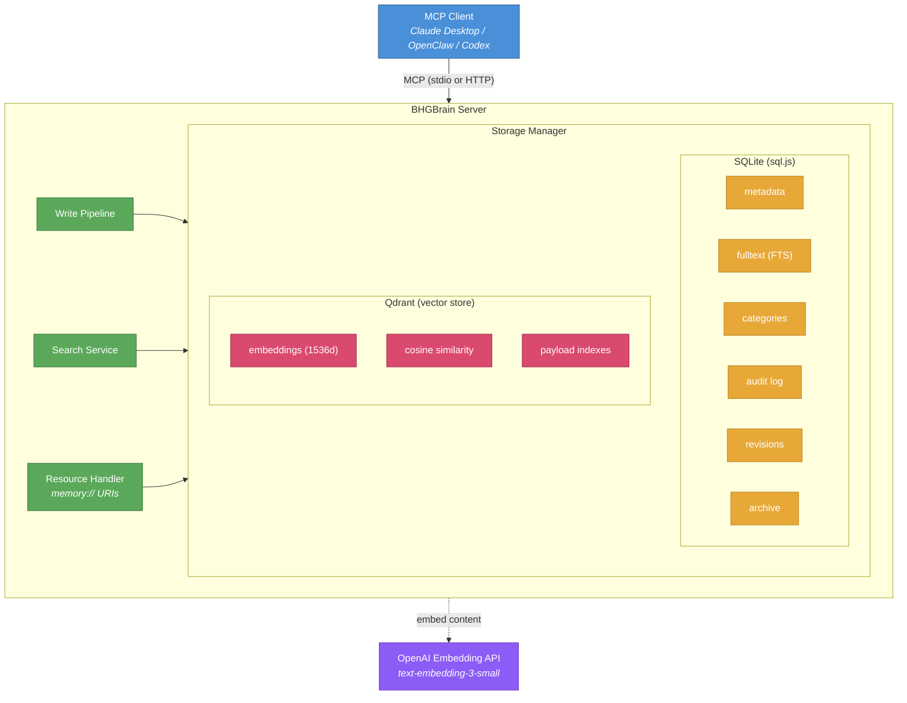
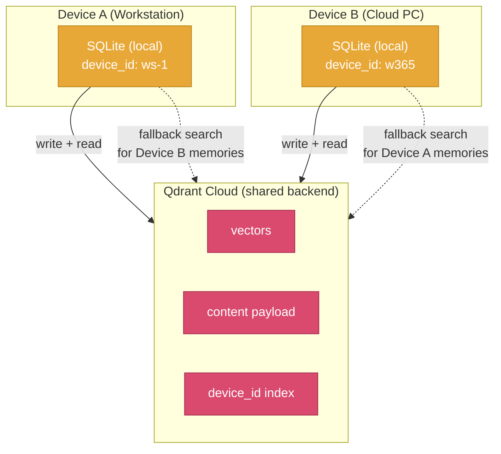
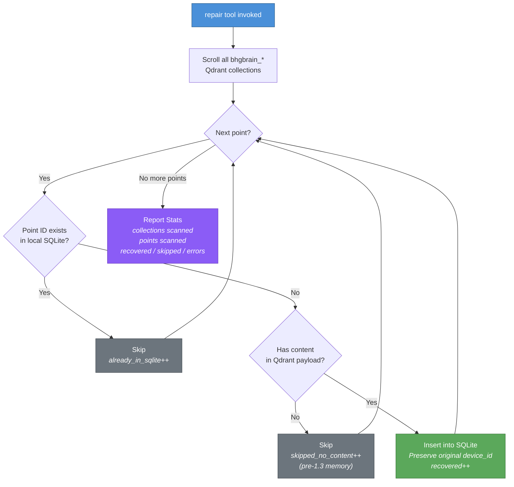
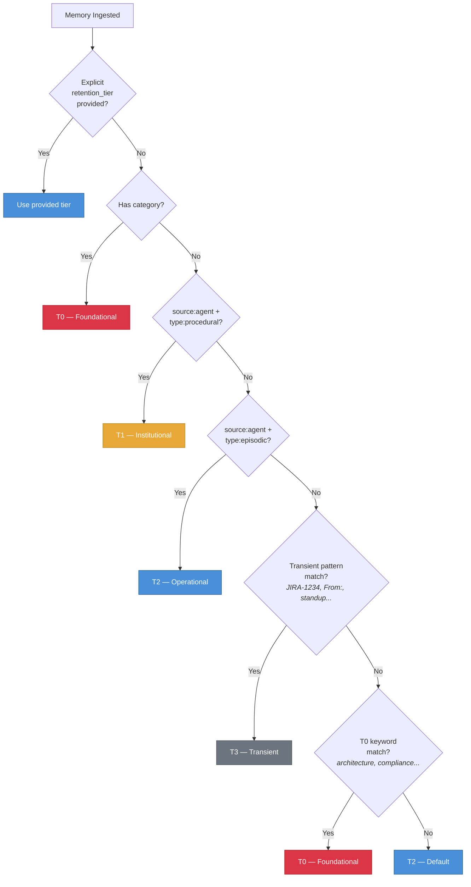
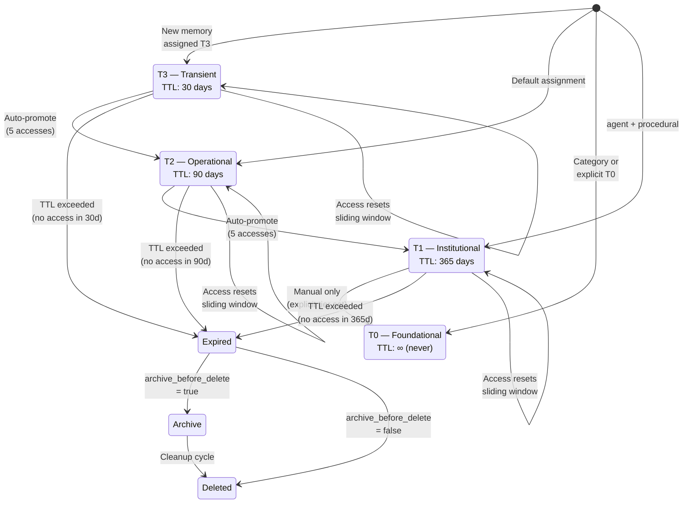
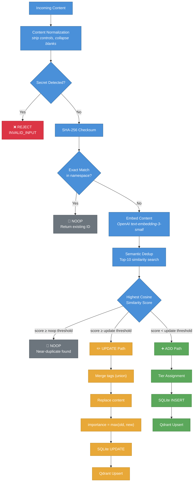
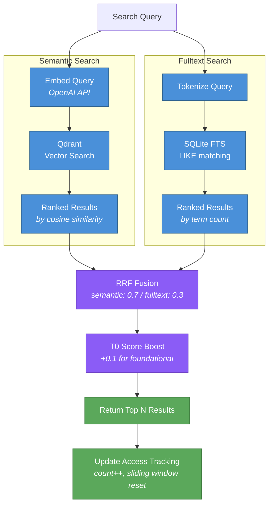
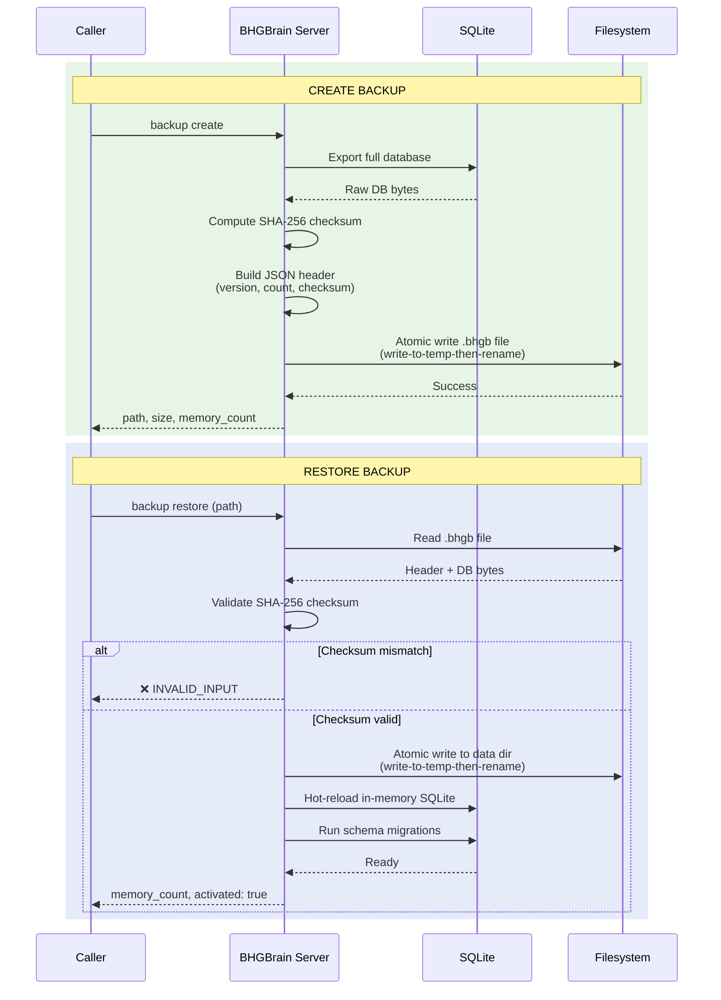

# BHGBrain

Persistent, vector-backed memory for MCP clients (Claude, Codex, OpenClaw, etc.).

BHGBrain stores memories in SQLite (metadata + fulltext search) and Qdrant (semantic vectors), exposing them over the Model Context Protocol (MCP) via stdio or HTTP. It is designed to give AI agents a durable, searchable second brain that persists across sessions - with full lifecycle management, automatic deduplication, tiered retention, and hybrid search.

---

## Table of Contents

1. [Overview & Architecture](#overview--architecture)
2. [Prerequisites](#prerequisites)
3. [Qdrant Setup](#qdrant-setup)
4. [Installation](#installation)
5. [Configuration](#configuration)
6. [Environment Variables](#environment-variables)
7. [Running the Server](#running-the-server)
8. [MCP Client Configuration](#mcp-client-configuration)
9. [Multi-Device Memory](#multi-device-memory)
   - [How It Works](#how-it-works)
   - [Device Identity Resolution](#device-identity-resolution)
   - [Shared Qdrant, Local SQLite](#shared-qdrant-local-sqlite)
   - [Repair and Recovery](#repair-and-recovery)
10. [Memory Management](#memory-management)
   - [Memory Data Model](#memory-data-model)
   - [Memory Types](#memory-types)
   - [Namespaces and Collections](#namespaces-and-collections)
   - [Retention Tiers](#retention-tiers)
   - [Tier Lifecycle - Assignment, Promotion, Sliding Window](#tier-lifecycle--assignment-promotion-sliding-window)
   - [Deduplication](#deduplication)
   - [Content Normalization](#content-normalization)
   - [Importance Scoring](#importance-scoring)
   - [Categories - Persistent Policy Slots](#categories--persistent-policy-slots)
   - [Decay, Cleanup, and Archiving](#decay-cleanup-and-archiving)
   - [Pre-Expiry Warnings](#pre-expiry-warnings)
   - [Resource Limits and Capacity Budgets](#resource-limits-and-capacity-budgets)
11. [Search](#search)
    - [Semantic Search](#semantic-search)
    - [Fulltext Search](#fulltext-search)
    - [Hybrid Search](#hybrid-search)
    - [Recall vs Search - Differences](#recall-vs-search--differences)
    - [Filtering](#filtering)
    - [Score Thresholds and Tier Boosts](#score-thresholds-and-tier-boosts)
12. [Backup & Restore](#backup--restore)
13. [Health & Metrics](#health--metrics)
14. [Security](#security)
15. [MCP Resources](#mcp-resources)
16. [Bootstrap Prompt](#bootstrap-prompt)
17. [CLI Reference](#cli-reference)
18. [MCP Tools Reference](#mcp-tools-reference)
19. [Upgrading](#upgrading)
20. [Behavior Notes](#behavior-notes)

---

## Overview & Architecture

BHGBrain is a persistent memory server built on the Model Context Protocol. It stores everything AI agents learn, decide, and observe across sessions - then makes that knowledge available via semantic recall, fulltext search, and injected context.

### Dual-Store Architecture



- **SQLite** (via `sql.js`, in-memory with periodic atomic flush to disk) is the **system of record** for all memory metadata, fulltext search index, categories, audit trail, revision history, and archive records.
- **Qdrant** holds semantic vector embeddings for similarity search. Qdrant is always written after SQLite succeeds; failures are tracked via the `vector_synced` flag and surfaced in the health endpoint.
- **OpenAI text-embedding-3-small** (default, configurable) generates 1536-dimensional embeddings for every memory.
- **Atomic writes** ensure database files are never partially written - all disk I/O uses write-to-temp-then-rename.
- **Deferred flush** batches access metadata updates (up to 5 seconds) to avoid per-request database flushes on read-heavy paths.

---

## Prerequisites

| Requirement | Version | Notes |
|---|---|---|
| Node.js | ≥ 20.0.0 | LTS recommended |
| Qdrant | ≥ 1.9 | Must be running before starting BHGBrain |
| OpenAI API key | - | For embeddings (`text-embedding-3-small` by default). Server starts in degraded mode if missing. |

---

## Qdrant Setup

BHGBrain **requires an external Qdrant instance**. Even in the default `embedded` mode, the server connects to `http://localhost:6333` - there is no bundled Qdrant binary. You must run it yourself.

### Option A: Docker (recommended)

```bash
docker run -d \
  --name qdrant \
  --restart unless-stopped \
  -p 6333:6333 \
  -v qdrant_storage:/qdrant/storage \
  qdrant/qdrant
```

Verify it's running:

```bash
curl http://localhost:6333/health
# → {"title":"qdrant - vector search engine","version":"..."}
```

### Option B: Docker Compose

```yaml
services:
  qdrant:
    image: qdrant/qdrant
    restart: unless-stopped
    ports:
      - "6333:6333"
    volumes:
      - qdrant_storage:/qdrant/storage

volumes:
  qdrant_storage:
```

### Option C: Native binary

Download from [https://github.com/qdrant/qdrant/releases](https://github.com/qdrant/qdrant/releases) and run:

```bash
./qdrant
```

### Option D: Qdrant Cloud (external mode)

Set `qdrant.mode` to `external` in your config and point `external_url` at your cloud cluster URL. Set `qdrant.api_key_env` to the name of the environment variable holding your Qdrant API key.

```jsonc
{
  "qdrant": {
    "mode": "external",
    "external_url": "https://your-cluster.cloud.qdrant.io",
    "api_key_env": "QDRANT_API_KEY"
  }
}
```

---

## Installation

```bash
git clone https://github.com/Big-Hat-Group-Inc/BHGBrain.git
cd BHGBrain
npm install
npm run build
```

To install globally as a CLI:

```bash
npm install -g .
bhgbrain --help
```

---

## Configuration

BHGBrain loads its configuration from:

- **Windows:** `%LOCALAPPDATA%\BHGBrain\config.json`
- **Linux/macOS:** `~/.bhgbrain/config.json`

The file is created automatically on first run with all defaults applied. Edit it to customise behaviour. You can also pass a custom config path with `--config=<path>` when starting the server.

### Full Configuration Reference

```jsonc
{
  // Data directory (absolute path). Defaults to platform-appropriate location.
  "data_dir": null,

  // Device identity for multi-device setups (see Multi-Device Memory section)
  "device": {
    // Stable device identifier. Auto-generated from hostname if omitted.
    // Pattern: ^[a-zA-Z0-9._-]{1,64}$
    // Can also be set via BHGBRAIN_DEVICE_ID environment variable.
    "id": null
  },

  // Embedding provider configuration
  "embedding": {
    // Only "openai" is supported currently
    "provider": "openai",
    // OpenAI model to use for embeddings
    "model": "text-embedding-3-small",
    // Name of the environment variable holding the OpenAI API key
    "api_key_env": "OPENAI_API_KEY",
    // Vector dimensions produced by the model. Must match the model's output.
    // IMPORTANT: Changing this after collections are created requires recreating collections.
    "dimensions": 1536
  },

  // Qdrant connection configuration
  "qdrant": {
    // "embedded" = connect to localhost:6333
    // "external" = connect to external_url (Qdrant Cloud, remote instance, etc.)
    "mode": "embedded",
    // Only used for embedded mode (currently unused - Qdrant must be started externally)
    "embedded_path": "./qdrant",
    // External Qdrant URL (used when mode = "external")
    "external_url": null,
    // Env var name containing the Qdrant API key (used when mode = "external")
    "api_key_env": null
  },

  // Transport configuration
  "transport": {
    "http": {
      // Enable HTTP transport
      "enabled": true,
      // Host to bind. Use 127.0.0.1 for loopback-only (default, secure).
      // Non-loopback requires BHGBRAIN_TOKEN to be set (or allow_unauthenticated_http).
      "host": "127.0.0.1",
      // Port to listen on
      "port": 3721,
      // Name of the env var holding the bearer token for HTTP auth
      "bearer_token_env": "BHGBRAIN_TOKEN"
    },
    "stdio": {
      // Enable MCP stdio transport
      "enabled": true
    }
  },

  // Default values applied when not specified by callers
  "defaults": {
    // Default namespace for all operations
    "namespace": "global",
    // Default collection for all operations
    "collection": "general",
    // Default result limit for recall operations
    "recall_limit": 5,
    // Default minimum semantic similarity score (0-1) for recall
    "min_score": 0.6,
    // Max memories included in auto-inject payload
    "auto_inject_limit": 10,
    // Maximum characters in tool response payloads
    "max_response_chars": 50000
  },

  // Memory retention and lifecycle settings
  "retention": {
    // Days of zero access after which a memory becomes a stale candidate
    "decay_after_days": 180,
    // Maximum SQLite database size in gigabytes before health reports degraded
    "max_db_size_gb": 2,
    // Maximum total memories before health reports over-capacity
    "max_memories": 500000,
    // Percentage of max_memories at which health reports degraded
    "warn_at_percent": 80,

    // Per-tier TTL in days (null = never expires)
    "tier_ttl": {
      "T0": null,    // Foundational: never expires
      "T1": 365,     // Institutional: 1 year without access
      "T2": 90,      // Operational: 90 days without access
      "T3": 30       // Transient: 30 days without access
    },

    // Per-tier capacity budgets (null = unlimited)
    "tier_budgets": {
      "T0": null,      // No cap on foundational knowledge
      "T1": 100000,    // 100k institutional memories
      "T2": 200000,    // 200k operational memories
      "T3": 200000     // 200k transient memories
    },

    // Access count threshold to auto-promote a memory one tier
    "auto_promote_access_threshold": 5,

    // When true, each access resets the TTL clock (sliding window)
    "sliding_window_enabled": true,

    // When true, expired memories are written to the archive table before deletion
    "archive_before_delete": true,

    // Cron schedule for the background cleanup job (default: 2am daily)
    "cleanup_schedule": "0 2 * * *",

    // Days before expiry at which memories are flagged as expiring_soon
    "pre_expiry_warning_days": 7,

    // Qdrant segment compaction threshold (compact when this fraction of a segment is deleted)
    "compaction_deleted_threshold": 0.10
  },

  // Deduplication settings
  "deduplication": {
    // Enable semantic deduplication on write
    "enabled": true,
    // Cosine similarity threshold above which new content is considered an UPDATE of existing content.
    // Tier-specific adjustments are applied on top (see Deduplication section below).
    "similarity_threshold": 0.92
  },

  // Search configuration
  "search": {
    // Weights used for Reciprocal Rank Fusion (RRF) in hybrid mode
    // Must sum to 1.0
    "hybrid_weights": {
      "semantic": 0.7,
      "fulltext": 0.3
    }
  },

  // Security settings
  "security": {
    // Reject non-loopback HTTP bindings by default (fail-closed)
    "require_loopback_http": true,
    // Explicitly allow unauthenticated external HTTP (logs a high-visibility warning)
    "allow_unauthenticated_http": false,
    // Redact token values in structured logs
    "log_redaction": true,
    // Max requests per minute per client IP for HTTP transport
    "rate_limit_rpm": 100,
    // Maximum HTTP request body size in bytes
    "max_request_size_bytes": 1048576
  },

  // Auto-inject payload budget (for memory://inject resource)
  "auto_inject": {
    // Maximum characters included in the inject payload
    "max_chars": 30000,
    // Token budget (null = unlimited, character budget applies)
    "max_tokens": null
  },

  // Observability settings
  "observability": {
    // Enable in-process metrics collection
    "metrics_enabled": false,
    // Use structured JSON logging (via pino)
    "structured_logging": true,
    // Log level: "debug" | "info" | "warn" | "error"
    "log_level": "info"
  },

  // Ingestion pipeline settings
  "pipeline": {
    // Enable the extraction pass (currently runs deterministic single-candidate extraction)
    "extraction_enabled": true,
    // Model used for LLM-based extraction (planned for future use)
    "extraction_model": "gpt-4o-mini",
    // Env var name for the extraction model API key
    "extraction_model_env": "BHGBRAIN_EXTRACTION_API_KEY",
    // When true, fall back to checksum-only dedup if embedding is unavailable
    "fallback_to_threshold_dedup": true
  },

  // Auto-summarize memory content on ingestion
  "auto_summarize": true
}
```

---

## Environment Variables

| Variable | Required | Default | Description |
|---|---|---|---|
| `OPENAI_API_KEY` | Yes (for embeddings) | — | OpenAI API key. Server starts in **degraded mode** if missing — semantic search and ingestion will fail, but fulltext search and category reads still work. |
| `BHGBRAIN_TOKEN` | Required for non-loopback HTTP | — | Bearer token for HTTP authentication. Server **refuses to start** if the host is non-loopback and this is unset (unless `allow_unauthenticated_http: true`). |
| `QDRANT_API_KEY` | Required for Qdrant Cloud | — | Set `qdrant.api_key_env` in config to the name of this variable. The default config field name is `QDRANT_API_KEY`. |
| `BHGBRAIN_DEVICE_ID` | No | Auto-generated from hostname | Override the device identifier for multi-device setups. See [Device Identity Resolution](#device-identity-resolution). |
| `BHGBRAIN_EXTRACTION_API_KEY` | No | Falls back to `OPENAI_API_KEY` | API key for the LLM extraction model (future use). |

Generate a secure bearer token:

```bash
bhgbrain server token
# or without the CLI:
node -e "console.log(require('crypto').randomBytes(32).toString('hex'))"
```

---

## Running the Server

### stdio mode (MCP over stdin/stdout)

This is the default mode used by MCP clients like Claude Desktop. The `--stdio` flag explicitly requests stdio transport.

```bash
# Development (no build required)
npm run dev

# Production via CLI
node dist/index.js --stdio

# With a custom config file
node dist/index.js --stdio --config=/path/to/config.json
```

> **Log routing in stdio mode:** When `--stdio` is active, all structured logs (pino) are automatically redirected to **stderr**. This is required because stdout is exclusively reserved for the MCP JSON-RPC protocol. Mixing log output into stdout would corrupt the MCP handshake and cause clients to fail to load the server. To capture logs when running in stdio mode, redirect stderr: `node dist/index.js --stdio 2>bhgbrain.log`

### HTTP mode

HTTP is enabled by default on `127.0.0.1:3721`. Set `BHGBRAIN_TOKEN` before starting if you want authenticated access:

```bash
export OPENAI_API_KEY=sk-...
export BHGBRAIN_TOKEN=<your-token>
node dist/index.js
```

The server listens at `http://127.0.0.1:3721` by default. Available HTTP endpoints:

| Endpoint | Auth Required | Description |
|---|---|---|
| `GET /health` | No | Health check (unauthenticated for probe compatibility) |
| `POST /tool/:name` | Yes | Invoke a named MCP tool |
| `GET /resource?uri=...` | Yes | Read an MCP resource by URI |
| `GET /metrics` | Yes | Prometheus-format metrics (if `metrics_enabled: true`) |

Health check example:

```bash
curl http://127.0.0.1:3721/health
```

Tool call example over HTTP:

```bash
curl -X POST http://127.0.0.1:3721/tool/remember \
  -H "Authorization: Bearer <your-token>" \
  -H "Content-Type: application/json" \
  -d '{"content": "Our auth service uses JWT with 1h expiry", "type": "semantic", "tags": ["auth", "architecture"]}'
```

---

## MCP Client Configuration

### Claude Desktop (`claude_desktop_config.json`)

```json
{
  "mcpServers": {
    "bhgbrain": {
      "command": "node",
      "args": ["C:/path/to/BHGBrain/dist/index.js"],
      "env": {
        "OPENAI_API_KEY": "sk-..."
      }
    }
  }
}
```

### Claude Desktop (globally installed CLI)

```json
{
  "mcpServers": {
    "bhgbrain": {
      "command": "bhgbrain",
      "args": ["server", "start"],
      "env": {
        "OPENAI_API_KEY": "sk-..."
      }
    }
  }
}
```

### OpenClaw / mcporter (HTTP transport)

```json
{
  "mcpServers": {
    "bhgbrain": {
      "transport": "http",
      "url": "http://127.0.0.1:3721",
      "headers": {
        "Authorization": "Bearer <your-token>"
      }
    }
  }
}
```

Or using environment variable lookup if your mcporter supports it:

```json
{
  "mcpServers": {
    "bhgbrain": {
      "transport": "stdio",
      "command": "node",
      "args": ["C:/Temp/GitHub/BHGBrain/dist/index.js"],
      "env": {
        "OPENAI_API_KEY": "sk-...",
        "QDRANT_API_KEY": "..."
      }
    }
  }
}
```

---

## Multi-Device Memory

BHGBrain supports running multiple instances across different machines (e.g., a primary workstation and a cloud dev box) that share the same Qdrant Cloud backend. Each instance maintains its own local SQLite database while reading from and writing to a shared vector store.

### How It Works



Every memory write stores the full content in both SQLite (local) and the Qdrant payload (shared). This means:

- **No single point of failure**: If a device's SQLite is lost, content can be recovered from Qdrant.
- **Cross-device visibility**: All devices see all memories via Qdrant, even if their local SQLite only has a subset.
- **Provenance tracking**: Every memory is tagged with the `device_id` of the instance that created it.

### Device Identity Resolution

Each BHGBrain instance resolves a stable `device_id` on startup, using this priority order:

1. **Explicit config**: `device.id` field in `config.json`
2. **Environment variable**: `BHGBRAIN_DEVICE_ID`
3. **Auto-generated**: Derived from `os.hostname()`, lowercased and sanitized to `[a-zA-Z0-9._-]`

On first run, the resolved ID is persisted to `config.json` so it remains stable across restarts, even if the hostname changes later.

```jsonc
// config.json — device section
{
  "device": {
    "id": "cpc-kevin-98f91"   // auto-generated from hostname, or set explicitly
  }
}
```

The `device_id` appears in:
- Every Qdrant payload (as a keyword-indexed field)
- Every SQLite memory record
- Search results (so callers can identify which device created a memory)

### Shared Qdrant, Local SQLite

Each device maintains its own SQLite database independently. There is no sync protocol between devices — Qdrant is the shared layer.

**What each device sees:**

| Source | Device A sees | Device B sees |
|---|---|---|
| Device A's memories (via local SQLite) | ✅ Full record | ❌ Not in local SQLite |
| Device A's memories (via Qdrant fallback) | ✅ Full record | ✅ Content from Qdrant payload |
| Device B's memories (via local SQLite) | ❌ Not in local SQLite | ✅ Full record |
| Device B's memories (via Qdrant fallback) | ✅ Content from Qdrant payload | ✅ Full record |

When a search returns a memory that exists in Qdrant but not in the local SQLite, BHGBrain constructs the result from the Qdrant payload instead of silently dropping it. This means both devices get full search results regardless of which device created the memory.

### Repair and Recovery



The `repair` tool reconstructs a device's local SQLite from Qdrant. Use it after:

- Setting up a new device that shares an existing Qdrant backend
- Recovering from SQLite data loss
- Migrating to a new machine

```json
// Preview what would be recovered (no changes)
{ "dry_run": true }

// Recover all memories from Qdrant into local SQLite
{ "dry_run": false }

// Recover only memories created by a specific device
{ "device_id": "cpc-kevin-98f91", "dry_run": false }
```

The repair tool:
- Scrolls all points across all `bhgbrain_*` Qdrant collections
- Inserts any memory with `content` in its Qdrant payload that is missing from local SQLite
- Preserves the original `device_id` provenance (or tags with the local device's ID if none exists)
- Reports: collections scanned, points scanned, recovered, skipped (no content), errors

**Note**: Memories stored before the content-in-Qdrant feature was added (pre-1.3) do not have content in their Qdrant payload and cannot be recovered via repair. Only metadata (tags, type, importance) survives for those entries.

### Multi-Device Configuration Example

**Device A** (`config.json`):
```jsonc
{
  "device": { "id": "workstation" },
  "qdrant": {
    "mode": "external",
    "external_url": "https://your-cluster.cloud.qdrant.io",
    "api_key_env": "QDRANT_API_KEY"
  }
}
```

**Device B** (`config.json`):
```jsonc
{
  "device": { "id": "cloud-pc" },
  "qdrant": {
    "mode": "external",
    "external_url": "https://your-cluster.cloud.qdrant.io",
    "api_key_env": "QDRANT_API_KEY"
  }
}
```

Both point to the same Qdrant cluster. Each gets its own `device_id`. All memories flow to the same vector collections and are visible to both instances.

---

## Memory Management

This section describes the complete memory lifecycle - from ingestion through classification, deduplication, access tracking, promotion, decay, and eventual expiration or permanent retention.

### Memory Data Model

Every memory stored in BHGBrain is a `MemoryRecord` with the following fields:

| Field | Type | Description |
|---|---|---|
| `id` | `string (UUID)` | Globally unique identifier |
| `namespace` | `string` | Scoping namespace (e.g., `"global"`, `"project/alpha"`, `"user/kevin"`) |
| `collection` | `string` | Sub-grouping within a namespace (e.g., `"general"`, `"architecture"`, `"decisions"`) |
| `type` | `"episodic" \| "semantic" \| "procedural"` | Memory type (see Memory Types) |
| `category` | `string \| null` | Category name if this memory is attached to a persistent policy category |
| `content` | `string` | The full memory content (up to 100,000 characters) |
| `summary` | `string` | Auto-generated first-line summary (up to 120 characters) |
| `tags` | `string[]` | Free-form tags (alphanumeric + hyphens, max 20 tags, max 100 chars each) |
| `source` | `"cli" \| "api" \| "agent" \| "import"` | How the memory was created |
| `checksum` | `string` | SHA-256 hash of normalized content (used for exact deduplication) |
| `embedding` | `number[]` | Vector embedding (not stored in SQLite; lives in Qdrant) |
| `importance` | `number (0-1)` | Importance score (default 0.5) |
| `retention_tier` | `"T0" \| "T1" \| "T2" \| "T3"` | Lifecycle tier governing TTL and cleanup behavior |
| `expires_at` | `string (ISO 8601) \| null` | Expiry timestamp (null for T0 - never expires) |
| `decay_eligible` | `boolean` | Whether the memory participates in TTL cleanup (false for T0) |
| `review_due` | `string (ISO 8601) \| null` | T1 review date (set to created_at + 365 days; reset on access) |
| `access_count` | `number` | Number of times this memory has been retrieved |
| `last_accessed` | `string (ISO 8601)` | Timestamp of most recent retrieval |
| `last_operation` | `"ADD" \| "UPDATE" \| "DELETE" \| "NOOP"` | Most recent write operation applied |
| `merged_from` | `string \| null` | ID of the memory this was merged from (dedup UPDATE path) |
| `archived` | `boolean` | Whether this memory is soft-archived (excluded from search/recall) |
| `vector_synced` | `boolean` | Whether the Qdrant vector is in sync with SQLite state |
| `device_id` | `string \| null` | Identifier of the BHGBrain instance that created this memory (see [Multi-Device Memory](#multi-device-memory)) |
| `created_at` | `string (ISO 8601)` | Creation timestamp |
| `updated_at` | `string (ISO 8601)` | Last update timestamp |
| `last_accessed` | `string (ISO 8601)` | Last retrieval timestamp |

#### SQLite Schema

The `memories` table has comprehensive indexes for efficient filtering:

```sql
CREATE INDEX idx_memories_namespace   ON memories(namespace);
CREATE INDEX idx_memories_collection  ON memories(namespace, collection);
CREATE INDEX idx_memories_checksum    ON memories(namespace, checksum);
CREATE INDEX idx_memories_type        ON memories(namespace, type);
CREATE INDEX idx_memories_category    ON memories(category);
CREATE INDEX idx_memories_tier        ON memories(namespace, collection, retention_tier);
CREATE INDEX idx_memories_expiry      ON memories(decay_eligible, expires_at);
CREATE INDEX idx_memories_review_due  ON memories(retention_tier, review_due);
CREATE INDEX idx_memories_archived    ON memories(archived);
CREATE INDEX idx_memories_vector_sync ON memories(vector_synced);
```

#### Qdrant Payload Indexes

Each Qdrant collection maintains the following payload indexes for efficient vector-side filtering:

- `namespace` (keyword)
- `type` (keyword)
- `retention_tier` (keyword)
- `decay_eligible` (boolean)
- `expires_at` (integer — stored as Unix epoch seconds)
- `device_id` (keyword)

---

### Memory Types

Every memory is classified into one of three semantic types. The type is used for filtering in recall and search, and it influences the default retention tier assigned during ingestion.

| Type | Meaning | Typical Contents | Default Tier |
|---|---|---|---|
| `episodic` | A specific event, observation, or occurrence at a point in time | Meeting outcomes, debugging sessions, task context, what happened during a sprint | `T2` (operational) |
| `semantic` | A fact, concept, or piece of knowledge not tied to a specific time | How a system works, what a term means, a configuration value, a data model | `T2` (operational) |
| `procedural` | A process, workflow, or how-to instruction | Runbooks, deployment steps, coding standards, how to perform a task | `T1` (institutional) |

**How type affects tier assignment:**
- `source: agent` + `type: procedural` → auto-assigned `T1` (institutional)
- `source: agent` + `type: episodic` → auto-assigned `T2` (operational)
- `source: cli` (any type) → auto-assigned `T2` (operational)
- `source: import` with T0 content signals → `T0` regardless of type

If you do not provide a type, the pipeline defaults to `"semantic"`.

---

### Namespaces and Collections

**Namespaces** are top-level scoping identifiers that isolate memories from different contexts, users, or projects. All tool operations require a namespace (default: `"global"`).

- Namespace pattern: `^[a-zA-Z0-9/-]{1,200}$` - alphanumeric characters, hyphens, and forward slashes
- Examples: `"global"`, `"project/alpha"`, `"user/kevin"`, `"tenant/acme-corp"`
- Memories in different namespaces are never returned in each other's searches
- Each namespace+collection pair maps to a separate Qdrant collection (named `bhgbrain_{namespace}_{collection}`)

**Collections** are sub-groups within a namespace. They allow you to partition memories by topic or purpose without creating entirely separate namespaces.

- Collection pattern: `^[a-zA-Z0-9-]{1,100}$`
- Examples: `"general"`, `"architecture"`, `"decisions"`, `"onboarding"`
- Collections are tracked in the SQLite `collections` table with their embedding model and dimensions locked at creation time - you cannot mix embedding models within a collection
- Use the `collections` MCP tool to list, create, or delete collections

**Isolation guarantees:**
- SQLite queries always filter by `namespace` first
- Qdrant searches include a `namespace` payload filter even when searching a specific collection
- Deleting a collection removes all associated memories from both SQLite and Qdrant

---

### Retention Tiers

Every memory is assigned a **retention tier** at ingestion time that governs its entire lifecycle - how long it lives, how it's cleaned up, how strictly it's deduplicated, and whether it ever expires.

| Tier | Label | Default TTL | Decay Eligible | Examples |
|---|---|---|---|---|
| `T0` | **Foundational** | Never (permanent) | No | Architecture references, legal requirements, company policies, compliance mandates, accounting standards, ADRs, security runbooks |
| `T1` | **Institutional** | 365 days from last access | Yes (with review_due tracking) | Software design decisions, API contracts, deployment runbooks, coding standards, vendor agreements, procedural knowledge |
| `T2` | **Operational** | 90 days from last access | Yes | Project status, sprint decisions, meeting outcomes, technical investigations, current task context |
| `T3` | **Transient** | 30 days from last access | Yes | Trouble tickets, email summaries, daily reports, ad-hoc debugging sessions, short-lived task notes |

**Key properties by tier:**

- **T0**: `expires_at` is always `null`. `decay_eligible` is always `false`. T0 memories cannot be automatically cleaned up. Updates to T0 memories trigger a revision snapshot in the `memory_revisions` table (append-only history). T0 memories receive a +0.1 score boost in hybrid search results.

- **T1**: `review_due` is set to `created_at + 365 days` and reset on each access. Memories approaching their `expires_at` are flagged with `expiring_soon: true` in search results.

- **T2**: The default tier for most memories. 90-day sliding window - every access resets the TTL clock.

- **T3**: The most aggressive tier. Pattern-matched transient content (tickets, emails, standup notes) is automatically classified here. 30-day sliding window.

**Capacity budgets:**

| Tier | Default Budget | Notes |
|---|---|---|
| T0 | Unlimited | Foundational knowledge must always fit |
| T1 | 100,000 | Institutional knowledge |
| T2 | 200,000 | Operational memories |
| T3 | 200,000 | Transient memories |

When a tier budget is exceeded, the health endpoint reports `degraded` and the cleanup job prioritizes that tier on the next cycle.

---

### Tier Lifecycle - Assignment, Promotion, Sliding Window

#### Tier Assignment

Tier assignment happens during the write pipeline, in this priority order:

1. **Explicit caller override:** If `retention_tier` is passed to the `remember` tool, it is used unconditionally.

2. **Category-based:** If the memory is attached to a category (via the `category` field), it is always `T0`. Categories represent persistent policy slots and never expire.

3. **Source + type heuristics:**
   - `source: agent` + `type: procedural` → `T1`
   - `source: agent` + `type: episodic` → `T2`
   - `source: cli` → `T2`

4. **Content pattern matching for transient signals (→ T3):**
   - Jira/ticket references: `JIRA-1234`, `incident-456`, `case-789`
   - Email metadata: `From:`, `Subject:`, `fw:`, `re:`
   - Temporal markers: `today`, `this week`, `by friday`, `standup`, `meeting minutes`, `action items`
   - Quarter references: `Q1 2026`, `Q3 2025`

5. **T0 keyword signals (→ T0 for imports):**
   If `source: import` and the content or tags contain any of:
   `architecture`, `design decision`, `adr`, `rfc`, `contract`, `schema`, `legal`, `compliance`, `policy`, `standard`, `accounting`, `security`, `runbook`
   → assigned `T0`.

6. **T0 keyword signals (→ T0 for any source):**
   The same T0 keywords are checked for all sources (the T3 transient patterns are checked first). If a T0 keyword matches without a transient pattern, the memory is `T0`.

7. **Default:** `T2` - the safe, forgiving default.



#### Tier Metadata Computed at Assignment

```typescript
{
  retention_tier: "T2",               // assigned tier
  expires_at: "2026-06-14T12:00:00Z", // created_at + TTL days
  decay_eligible: true,               // false only for T0
  review_due: null                    // set for T1 only
}
```

For T1 memories, `review_due` is set to `created_at + tier_ttl.T1` (default 365 days) and is reset on every retrieval.

#### Auto-Promotion on Access

When a memory in tier `T2` or `T3` reaches the access threshold (`auto_promote_access_threshold`, default 5), it is automatically promoted one tier:

- `T3` → `T2`
- `T2` → `T1`

Promotion cannot happen automatically to `T0`. Manual upgrade to `T0` is possible by passing `retention_tier: "T0"` on a subsequent `remember` call (which triggers the UPDATE path) or via the CLI's `bhgbrain tier set <id> T0`.

Promotion is **monotonic** - automatic demotion never occurs. Tier demotion requires explicit user action.

When a memory is promoted, its `expires_at` is recomputed from the new tier's TTL using the current timestamp as the sliding window anchor.



#### Sliding Window Expiration

When `sliding_window_enabled: true` (the default), every successful retrieval via `recall`, `search`, or `memory://inject` resets the TTL clock:

```
new expires_at = max(current expires_at, now + tier_ttl)
```

This means an actively-used memory never expires, while a memory that is never retrieved hits its TTL and is cleaned up. Memories that are accessed once at the last minute get a full new TTL window from that access.

Access tracking is performed in batch after every search (up to 5-second deferred flush) to avoid synchronous database writes on the read path.

---

### Deduplication

BHGBrain prevents storing duplicate or near-duplicate content through a two-phase deduplication pipeline.



#### Phase 1: Exact Deduplication (Checksum)

Before any embedding is generated, the normalized content is hashed with SHA-256. If a memory with the same namespace and checksum already exists (and is not archived), the operation returns `NOOP` immediately without any API calls.

```
checksum = SHA-256(normalizeContent(content))
```

#### Phase 2: Semantic Deduplication (Vector Similarity)

If no exact match is found, the content is embedded and the top 10 most similar existing memories in the collection are retrieved from Qdrant. Based on cosine similarity scores and the memory's assigned tier, one of three decisions is made:

| Decision | Condition | Effect |
|---|---|---|
| `NOOP` | Score ≥ noop threshold | Content is considered a duplicate; return the existing memory's ID without writing |
| `UPDATE` | Score ≥ update threshold | Content is an update of existing; merge tags, update content and checksum, preserve ID |
| `ADD` | Score < update threshold | Genuinely new memory; create with a new UUID |

**Tier-specific deduplication thresholds:**

The base `similarity_threshold` (default 0.92) is adjusted per tier because T0/T1 memories require stricter matching (near-duplicates may represent intentional versioning), and T3 is more aggressive:

| Tier | NOOP threshold | UPDATE threshold |
|---|---|---|
| `T0` | 0.98 | max(base, 0.95) |
| `T1` | 0.98 | max(base, 0.95) |
| `T2` | 0.98 | base (0.92) |
| `T3` | 0.95 | max(base, 0.90) |

**UPDATE merge behavior:**
- Tags are unioned (existing tags ∪ new tags)
- Content is replaced with the new version
- Importance is set to `max(existing importance, new importance)`
- Retention tier and expiry are recalculated from the new content's classification

**Fallback behavior:**
If the embedding provider is unavailable and `pipeline.fallback_to_threshold_dedup: true`, the pipeline falls back to checksum-only deduplication and writes the memory to SQLite only (with `vector_synced: false`). The memory will be available for fulltext search but not semantic search until Qdrant sync is restored.

---

### Content Normalization

Before checksumming, embedding, or storing, all content goes through the normalization pipeline:

1. **Control character stripping:** ASCII control characters (0x00-0x08, 0x0B, 0x0C, 0x0E-0x1F, 0x7F) are removed. Line feed (0x0A) and carriage return (0x0D) are preserved.

2. **CRLF normalization:** `\r\n` → `\n`

3. **Trailing whitespace removal:** Spaces and tabs at the end of lines are stripped.

4. **Excessive blank line collapsing:** Three or more consecutive newlines are collapsed to two.

5. **Leading/trailing whitespace trimming:** The entire string is trimmed.

6. **Secret detection:** Before storage, content is checked against patterns for common credential formats:
   - `api_key=...`, `secret=...`, `token=...`, `password=...`
   - AWS access key IDs (`AKIA...`)
   - GitHub personal access tokens (`ghp_...`)
   - OpenAI API keys (`sk-...`)
   - PEM private keys (`-----BEGIN ... PRIVATE KEY-----`)

   If a secret is detected, the write is **rejected** with `INVALID_INPUT`:
   > `Content appears to contain credentials or secrets. Memory rejected for safety.`

7. **Summary generation:** The first line of the normalized content is extracted as the summary (truncated to 120 characters with `...` if longer). The summary is stored in SQLite and used for lightweight display without fetching full content.

---

### Importance Scoring

Every memory has an `importance` field - a float from 0.0 to 1.0.

**Default:** `0.5` if not provided by the caller.

**How it's used:**
- During deduplication UPDATE merges, importance is set to `max(existing, new)` - importance only increases through merges.
- Stale memory candidates (flagged by the consolidation pass) must have `importance < 0.5` and no category to be eligible for the stale marking pass. This protects high-importance memories from being marked stale.
- Future LLM-based extraction may assign importance based on content analysis.

**Setting importance:**
Pass `importance` explicitly in the `remember` tool. Values range from `0.0` (very low value, should decay aggressively) to `1.0` (critical, should be preserved).

```json
{
  "content": "Our HIPAA BAA requires all PHI to be encrypted at rest using AES-256",
  "type": "semantic",
  "tags": ["compliance", "hipaa", "security"],
  "importance": 0.9,
  "retention_tier": "T0"
}
```

---

### Categories - Persistent Policy Slots

Categories are a special storage mechanism for persistent, always-injected policy context. Unlike regular memories (which are retrieved via semantic search), category content is always included in the `memory://inject` resource payload.

Categories are designed for information that should always be present in the AI's context window: company values, architectural principles, coding standards, and similar standing policies.

#### Category Slots

Each category is assigned to one of four named slots:

| Slot | Purpose | Examples |
|---|---|---|
| `company-values` | Core principles, culture, brand voice | "We prioritize security over speed", "Never store PII in logs" |
| `architecture` | System architecture, component topology, key design decisions | Service map, API contracts, technology choices |
| `coding-requirements` | Coding standards, conventions, required patterns | "Always use async/await", "Use Zod for all validation", naming conventions |
| `custom` | Anything else that warrants always-on context | Project-specific rules, disambiguation guides, entity maps |

#### Category Behavior

- Categories are **always T0** - they never expire, never decay, and cannot be cleaned up by the retention system.
- Category content is stored as full text in SQLite (not embedded in Qdrant).
- In the `memory://inject` payload, category content is prepended before any regular memories.
- Categories support revisions - when you update a category with `category set`, the `revision` counter increments.
- Category names must be unique. You can have multiple categories per slot (e.g., `"api-contracts"` and `"database-schema"` both in the `"architecture"` slot).
- Category content can be up to 100,000 characters.

#### Managing Categories

```json
// List all categories
{ "action": "list" }

// Get a specific category
{ "action": "get", "name": "api-contracts" }

// Create or update a category
{
  "action": "set",
  "name": "coding-standards",
  "slot": "coding-requirements",
  "content": "## Coding Standards\n\n- Use TypeScript strict mode\n- All functions must have JSDoc comments\n- Tests required for all public APIs"
}

// Delete a category
{ "action": "delete", "name": "coding-standards" }
```

---

### Decay, Cleanup, and Archiving

#### Background Cleanup

The retention system runs a scheduled cleanup job (default: daily at 2:00 AM, configurable via `retention.cleanup_schedule` as a cron expression). You can also trigger cleanup manually via `bhgbrain gc`.

**Cleanup phases:**

1. **Identify expired memories:** Query SQLite for all memories where `decay_eligible = true` AND `expires_at < now()`. T0 memories are always excluded (T0 is never decay eligible).

2. **Archive before delete (if enabled):** For each expired memory, write a summary record to the `memory_archive` table:

   ```sql
   memory_archive {
     id            INTEGER (autoincrement)
     memory_id     TEXT    -- original memory UUID
     summary       TEXT    -- the memory's summary text
     tier          TEXT    -- tier it was in when deleted
     namespace     TEXT    -- namespace it belonged to
     created_at    TEXT    -- original creation timestamp
     expired_at    TEXT    -- when cleanup ran
     access_count  INTEGER -- total accesses during lifetime
     tags          TEXT    -- JSON array of tags
   }
   ```

3. **Delete from Qdrant:** Batch delete all expired point IDs from their respective Qdrant collections.

4. **Delete from SQLite:** Remove expired rows from the `memories` and `memories_fts` tables.

5. **Audit log:** Each deletion is recorded in the `audit_log` table with `operation: FORGET` and `client_id: "system"`.

6. **Flush:** SQLite is flushed atomically to disk after all deletions.

#### T0 Revision History

When a T0 (foundational) memory is updated via the `remember` tool (triggering the UPDATE dedup path), the prior content is snapshotted into the `memory_revisions` table before the update is applied:

```sql
memory_revisions {
  id         INTEGER (autoincrement)
  memory_id  TEXT    -- the T0 memory's UUID
  revision   INTEGER -- incrementing revision number
  content    TEXT    -- full prior content
  updated_at TEXT    -- when the update occurred
  updated_by TEXT    -- client_id that performed the update
}
```

Only T0 memories have revision history. The vector embedding in Qdrant always reflects the current content only.

#### Stale Marking (Consolidation Pass)

The `bhgbrain gc --consolidate` command (or `RetentionService.runConsolidation()`) performs a secondary pass that marks memories as **stale** candidates:

- Any memory not accessed in the last `retention.decay_after_days` (default 180) days is flagged as a stale candidate.
- Only memories with `importance < 0.5` and no category are eligible.
- Stale memories are not deleted immediately; they become candidates for the next GC cleanup cycle.

#### Archive Search and Restore

Deleted memories (when `archive_before_delete: true`) can be inspected and restored:

```bash
bhgbrain archive list                 # List recently archived memories
bhgbrain archive search <query>       # Search archived summaries by text
bhgbrain archive restore <memory_id>  # Restore an archived memory
```

**Restore semantics:** A restored memory is re-created as a **new** `T2` memory from the archived summary text. The original content (if longer than the summary) cannot be recovered - the archive stores only the 120-character summary. The restored memory receives fresh timestamps and a new UUID, and is re-embedded in Qdrant.

---

### Pre-Expiry Warnings

Memories approaching expiration (within `retention.pre_expiry_warning_days` days, default 7) are flagged in search results:

```json
{
  "id": "...",
  "content": "...",
  "retention_tier": "T2",
  "expires_at": "2026-03-22T12:00:00Z",
  "expiring_soon": true
}
```

The `expiring_soon` flag appears in:
- `recall` results
- `search` results
- The `memory://inject` resource payload

This allows AI agents to notice when memories are about to expire and decide whether to promote them (by re-saving with an explicit `retention_tier: "T1"` or `"T0"`).

---

### Resource Limits and Capacity Budgets

BHGBrain monitors capacity and surfaces warnings through the health system:

| Limit | Config Key | Default | Behavior when exceeded |
|---|---|---|---|
| Max total memories | `retention.max_memories` | 500,000 | Health reports `degraded`; cleanup job prioritizes cleanup |
| Max DB size | `retention.max_db_size_gb` | 2 GB | Health reports `degraded` (monitored, not enforced) |
| Warn threshold | `retention.warn_at_percent` | 80% | Health reports `degraded` when `count > max_memories * 0.8` |
| T1 budget | `retention.tier_budgets.T1` | 100,000 | Health reports `over_capacity: true`; retention component degrades |
| T2 budget | `retention.tier_budgets.T2` | 200,000 | Same |
| T3 budget | `retention.tier_budgets.T3` | 200,000 | Same |

T0 has no capacity budget. Foundational knowledge must always be preserved.

The health endpoint's `retention.over_capacity` field is `true` if any configured budget is exceeded. The `retention.counts_by_tier` object shows the current count in each tier, which you can compare against your configured budgets.

---

## Search

BHGBrain supports three search modes that can be used independently or combined.

### Semantic Search

Semantic search uses OpenAI embeddings and Qdrant vector similarity (cosine distance) to find memories that are conceptually similar to the query - even if they use different words.

**How it works:**
1. The query string is embedded using the same model as stored memories (`text-embedding-3-small`, 1536 dimensions).
2. Qdrant is queried for the nearest neighbors in the target collection.
3. Qdrant applies payload filters to exclude expired memories: only memories where `decay_eligible = false` (T0/T1) OR `expires_at > now()` are returned.
4. Results are ranked by cosine similarity score (0.0-1.0, higher is more similar).
5. Access metadata is updated for each returned memory (access_count++, last_accessed, sliding window expiry reset).

**When to use:** Conceptual queries, questions about how something works, retrieving architectural decisions without knowing exact keywords.

**Requirements:** Requires the embedding provider to be healthy. Returns `EMBEDDING_UNAVAILABLE` error if OpenAI is unreachable.

```json
// Semantic search via the search tool
{
  "query": "how does authentication work",
  "mode": "semantic",
  "namespace": "global",
  "limit": 10
}
```

---

### Fulltext Search

Fulltext search uses SQLite's internal text matching to find memories containing specific words or phrases.

**How it works:**
1. The query is split into lowercase terms.
2. Each term is matched against the `memories_fts` shadow table using `LIKE %term%` on `content`, `summary`, and `tags` columns.
3. Results are ranked by the number of matching terms (more matches = higher rank).
4. The rank is normalized to a 0.0-1.0 score: `min(1.0, term_count / 10)`.
5. Archived memories are excluded (the FTS table is kept in sync with the main memories table - archived rows are removed from FTS).
6. Access metadata is updated for returned results.

**When to use:** Exact keyword searches, searching for specific identifiers (memory IDs, project names, system names), when you know the exact terminology used.

**Requirements:** Works even when the embedding provider is unavailable (no Qdrant needed for fulltext).

```json
// Fulltext search via the search tool
{
  "query": "JIRA-1234 authentication",
  "mode": "fulltext",
  "namespace": "global",
  "limit": 10
}
```

---

### Hybrid Search



Hybrid search combines semantic and fulltext results using **Reciprocal Rank Fusion (RRF)**, a rank-based fusion algorithm that is robust to score scale differences between the two retrieval systems.

**How it works:**
1. Both semantic search and fulltext search run independently (in parallel where possible).
2. Each method retrieves up to `limit * 2` candidates.
3. RRF fusion combines the ranked lists:

   ```
   RRF_score(item) = (semantic_weight / (K + semantic_rank))
                   + (fulltext_weight  / (K + fulltext_rank))
   ```

   Where `K = 60` (standard RRF constant), `semantic_weight = 0.7`, `fulltext_weight = 0.3` (configurable via `search.hybrid_weights`).

4. Items appearing in only one list receive `0` contribution from the other.
5. The merged list is sorted by RRF score (descending).
6. T0 memories receive a **+0.1 score boost** applied after RRF fusion, ensuring foundational knowledge surfaces prominently.
7. The top `limit` results are returned.

**Graceful degradation:** If the embedding provider is unavailable, hybrid search silently falls back to fulltext-only results rather than erroring.

**When to use:** Default for most queries - hybrid search provides the best recall because a memory might be returned by semantic matching even if the keywords don't match, or by fulltext even if the embedding is slightly off.

```json
// Hybrid search (default mode)
{
  "query": "authentication JWT expiry",
  "mode": "hybrid",
  "namespace": "global",
  "limit": 10
}
```

---

### Recall vs Search - Differences

BHGBrain exposes two tools for memory retrieval with different semantics:

| Aspect | `recall` | `search` |
|---|---|---|
| **Primary purpose** | Retrieve memories most relevant to current context | Explore and investigate the memory store |
| **Search mode** | Always semantic (vector similarity) | Configurable: `semantic`, `fulltext`, or `hybrid` (default) |
| **Result limit** | 1-20 (default 5) | 1-50 (default 10) |
| **Score filtering** | `min_score` filter applied (default 0.6) | No score filter |
| **Type filtering** | Optional `type` filter (`episodic`/`semantic`/`procedural`) | No type filter |
| **Tag filtering** | Optional `tags` filter (any matching tag) | No tag filter |
| **Namespace** | Required (default `global`) | Required (default `global`) |
| **Collection** | Optional - omit to search across all collections | Optional |
| **Access tracking** | Yes - every recall updates access_count and sliding window | Yes - same behavior |
| **Intended caller** | AI agents during task execution | Humans or admin agents doing investigation |

**Score filtering in recall:**
The `min_score` parameter (default 0.6) acts as a quality gate - only memories with cosine similarity ≥ 0.6 are returned. This prevents irrelevant results. You can lower `min_score` to retrieve more results at the cost of precision.

```json
// Recall example - semantic, filtered by type and tags
{
  "query": "authentication architecture decisions",
  "namespace": "global",
  "type": "semantic",
  "tags": ["auth", "architecture"],
  "limit": 5,
  "min_score": 0.6
}
```

---

### Filtering

Both `recall` and `search` support namespace and collection scoping. `recall` additionally supports type and tag filtering.

**Namespace filtering:** Always applied. All searches are scoped to a single namespace. There is no cross-namespace search.

**Collection filtering:** Optional. If omitted:
- In semantic search, the Qdrant collection `bhgbrain_{namespace}_general` is searched (the default collection for the namespace).
- In fulltext search, all memories in the namespace are searched regardless of collection.

**Type filtering (`recall` only):** Pass `"type": "episodic"` | `"semantic"` | `"procedural"` to restrict results to a single memory type. Filtering is applied after semantic search, so the full candidate set is retrieved from Qdrant first.

**Tag filtering (`recall` only):** Pass `"tags": ["auth", "security"]` to restrict results to memories that have at least one of the specified tags. Filtering is applied post-retrieval.

---

### Score Thresholds and Tier Boosts

**`min_score` (recall only):** A minimum cosine similarity score between 0 and 1. Memories below this threshold are excluded from `recall` results. Default: 0.6.

**Expired memory exclusion:** Qdrant's vector search filter excludes memories where `decay_eligible = true AND expires_at < now()`. T0/T1 memories (decay_eligible = false) are never excluded by the vector-side filter. SQLite-side, the lifecycle service re-checks expiry on any memory returned from the vector store.

**T0 score boost (hybrid search):** After RRF fusion, T0 (foundational) memories receive an additional +0.1 added to their score. This ensures that architecturally significant content surfaces in hybrid results even if its exact terminology doesn't match the query well.

---

## Backup & Restore



### Creating a Backup

```json
{ "action": "create" }
```

Or via CLI:
```bash
bhgbrain backup create
```

Backups capture the entire SQLite database (all memories, categories, collections, audit log, revisions, and archive records) as a single `.bhgb` file in the `backups/` subdirectory of your data directory.

**Backup file format:**
```
[4 bytes: header length (UInt32LE)]
[header bytes: JSON header]
[remaining bytes: SQLite database export]
```

The JSON header contains:
```json
{
  "version": 1,
  "memory_count": 1234,
  "checksum": "<sha256 of db data>",
  "created_at": "2026-03-15T12:00:00Z",
  "embedding_model": "text-embedding-3-small",
  "embedding_dimensions": 1536
}
```

**What is NOT in the backup:**
- Qdrant vector data is **not** included. After restoring from a backup, Qdrant collections must be rebuilt by re-embedding content. Until then, fulltext search works but semantic search does not.

**Backup integrity:** A SHA-256 checksum of the database data is stored in the header and verified on restore. If the file is corrupted, restore fails with `INVALID_INPUT: Backup integrity check failed`.

**Backup metadata** is tracked in the SQLite `backup_metadata` table so `backup list` can return information about historical backups.

### Listing Backups

```json
{ "action": "list" }
```

Returns:
```json
{
  "backups": [
    {
      "path": "/home/user/.bhgbrain/backups/2026-03-15T12-00-00-000Z.bhgb",
      "size_bytes": 2048576,
      "memory_count": 1234,
      "created_at": "2026-03-15T12:00:00Z"
    }
  ]
}
```

### Restoring from Backup

```json
{
  "action": "restore",
  "path": "/home/user/.bhgbrain/backups/2026-03-15T12-00-00-000Z.bhgb"
}
```

**Restore process:**
1. Validate the file exists and the integrity checksum matches.
2. Write the embedded SQLite database atomically to the data directory (write-to-temp-then-rename).
3. Hot-reload the in-memory SQLite database from the restored file without restarting the process.
4. Run schema migrations on the reloaded database to ensure forward compatibility.
5. Return `{ memory_count: <count>, activated: true }`.

**Restore is live:** The restored database is immediately active. There is no need to restart the server. The response includes `activated: true` to confirm this.

**Concurrent restore protection:** If a restore is already in progress, subsequent restore requests return `INVALID_INPUT: Backup restore already in progress`.

---

## Health & Metrics

### Health Endpoint

```bash
GET /health        # HTTP
# or via CLI:
bhgbrain health
```

Returns a `HealthSnapshot`:

```json
{
  "status": "healthy",
  "components": {
    "sqlite": { "status": "healthy" },
    "qdrant": { "status": "healthy" },
    "embedding": { "status": "healthy" },
    "retention": { "status": "healthy" }
  },
  "memory_count": 1234,
  "db_size_bytes": 8388608,
  "uptime_seconds": 86400,
  "retention": {
    "counts_by_tier": {
      "T0": 42,
      "T1": 310,
      "T2": 882,
      "T3": 0
    },
    "expiring_soon": 5,
    "archived_count": 128,
    "unsynced_vectors": 0,
    "over_capacity": false
  }
}
```

**Overall status logic:**
- `unhealthy` - if SQLite or Qdrant is unhealthy
- `degraded` - if embedding is degraded/unhealthy, OR retention is degraded (over capacity or unsynced vectors)
- `healthy` - all components are healthy

**Component statuses:**

| Component | Healthy condition | Degraded condition | Unhealthy condition |
|---|---|---|---|
| `sqlite` | `SELECT 1` succeeds | - | Query throws |
| `qdrant` | `getCollections()` succeeds | - | Connection refused |
| `embedding` | Embed API call succeeds | Missing credentials or unreachable | - |
| `retention` | All budgets within limits, no unsynced vectors | Budget exceeded OR unsynced vectors > 0 | - |

**HTTP status codes:**
- `200` for both `healthy` and `degraded`
- `503` for `unhealthy`

Embedding health is cached for 30 seconds to avoid per-probe API calls to OpenAI.

### Metrics

If `observability.metrics_enabled: true`, a metrics endpoint is available:

```bash
GET /metrics
```

Returns plain-text key-value metrics (Prometheus-compatible format):

| Metric | Type | Description |
|---|---|---|
| `bhgbrain_tool_calls_total` | counter | Total tool invocations |
| `bhgbrain_tool_handler_ms_avg` | histogram | Average tool handler latency in milliseconds |
| `bhgbrain_tool_handler_ms_p50` | histogram | 50th percentile tool handler latency |
| `bhgbrain_tool_handler_ms_p95` | histogram | 95th percentile tool handler latency |
| `bhgbrain_tool_handler_ms_p99` | histogram | 99th percentile tool handler latency |
| `bhgbrain_tool_handler_ms_count` | counter | Number of tool handler latency samples |
| `embedding_embed_batch_ms_p95` | histogram | 95th percentile embedding batch latency |
| `search_total_ms_p95` | histogram | 95th percentile end-to-end search latency |
| `bhgbrain_memory_count` | gauge | Current total memory count (updated on write/delete) |
| `bhgbrain_rate_limit_buckets` | gauge | Active rate limit tracking buckets |
| `bhgbrain_rate_limited_total` | counter | Total rate-limited requests |

Histograms use a bounded circular buffer of the last 1,000 samples. Metrics are in-process only - there is no external push.

---

## Security

### HTTP Authentication

When running in HTTP mode, requests to all endpoints except `/health` require a `Bearer` token:

```
Authorization: Bearer <your-token>
```

The token value is read from the environment variable named in `transport.http.bearer_token_env` (default: `BHGBRAIN_TOKEN`). If the environment variable is not set, all HTTP requests are allowed through (a warning is logged but auth is not enforced - for loopback-only bindings this is acceptable).

**Fail-closed for external bindings:** If the HTTP host is non-loopback (not `127.0.0.1`, `localhost`, or `::1`) and no token is configured, the server **refuses to start**:

```
SECURITY: HTTP binding to "0.0.0.0" is externally reachable but no bearer token is configured...
```

To explicitly allow unauthenticated external access (not recommended), set:
```json
{ "security": { "allow_unauthenticated_http": true } }
```

A high-visibility warning is logged at startup when this is active.

### Loopback Enforcement

By default, non-loopback HTTP bindings are rejected even before the auth check:

```json
{ "security": { "require_loopback_http": true } }
```

To bind to a non-loopback address (e.g., for remote clients on a LAN):
```json
{
  "transport": { "http": { "host": "0.0.0.0" } },
  "security": { "require_loopback_http": false }
}
```

Make sure `BHGBRAIN_TOKEN` is set in this configuration.

### Rate Limiting

HTTP requests are rate-limited per client IP address:

- Default: 100 requests per minute (`security.rate_limit_rpm`)
- Rate limit state is keyed on the trusted IP (not the `x-client-id` header)
- Exceeded clients receive HTTP 429 with `{ error: { code: "RATE_LIMITED", retryable: true } }`
- Response headers include `X-RateLimit-Limit` and `X-RateLimit-Remaining`
- Expired rate limit buckets are swept every 30 seconds

### Request Size Limiting

HTTP request bodies are limited to `security.max_request_size_bytes` (default 1 MB = 1,048,576 bytes). Oversized requests receive HTTP 413.

### Log Redaction

When `security.log_redaction: true` (default), bearer tokens appearing in log output are redacted. Authentication failure logs show only a truncated preview of invalid tokens.

### Secret Detection in Content

The write pipeline scans all incoming memory content for credentials and secrets before storage. Any content matching credential patterns is rejected with `INVALID_INPUT`. This applies to all tools and transports.

---

## MCP Resources

BHGBrain exposes MCP resources (readable via `ReadResource`) in addition to tools.

### Static Resources

| URI | Name | Description |
|---|---|---|
| `memory://list` | Memory List | Cursor-paginated list of memories (newest first) |
| `memory://inject` | Session Inject | Budgeted context block for auto-inject (categories + top memories) |
| `category://list` | Categories | All categories with previews |
| `collection://list` | Collections | All collections with memory counts |
| `health://status` | Health Status | Full health snapshot |

### Resource Templates (Parameterized)

| URI Template | Name | Description |
|---|---|---|
| `memory://{id}` | Memory Details | Full memory record by UUID |
| `category://{name}` | Category | Full category content by name |
| `collection://{name}` | Collection | Memories in a specific collection |

### `memory://list` - Paginated Memory Listing

Query parameters:
- `namespace` - namespace to list (default: `global`)
- `limit` - page size, 1-100 (default: 20)
- `cursor` - opaque cursor from previous response for pagination

Response:
```json
{
  "items": [/* MemoryRecord objects */],
  "cursor": "2026-03-15T12:00:00.000Z|<uuid>",
  "total_results": 1234,
  "truncated": true
}
```

Pagination uses composite cursors (`created_at|id`) for stable ordering. Ties at the same timestamp are broken by ID, ensuring no row is skipped or duplicated across pages.

### `memory://inject` - Session Context Injection

The inject resource builds a budgeted text payload for injecting into an LLM context window:

1. All category content is prepended first (full content, in order).
2. Top recent memories are appended (content or summary depending on space).
3. The payload is truncated at `auto_inject.max_chars` (default 30,000 characters).

Query parameters:
- `namespace` - namespace to inject from (default: `global`)

Response:
```json
{
  "content": "## company-standards (company-values)\n...\n## api-contracts (architecture)\n...\n- [semantic] Our auth service uses JWT...\n",
  "truncated": false,
  "total_results": 42,
  "categories_count": 2,
  "memories_count": 10
}
```

Touching a memory via `memory://{id}` increments its access count and schedules a deferred flush.

---

## Bootstrap Prompt

`BootstrapPrompt.txt` contains a structured interview prompt for building a **work second brain profile** with an AI agent.

Use it when onboarding a new AI assistant or when you want to populate BHGBrain with a rich, structured profile of your work context, entities, tenants, and disambiguation rules.

### How to use it

1. Start a fresh conversation with your AI assistant (Claude, GPT-4, etc.).
2. Paste the entire contents of `BootstrapPrompt.txt` as your first message.
3. Let the agent interview you section by section.
4. At the end, the agent will produce a structured profile you can save to BHGBrain via `bhgbrain.remember` calls (or `mcporter call bhgbrain.remember`).

### What it covers

The interview walks through 10 sections:

| Section | What it captures |
|---|---|
| 1. Identity & role | Name, titles, primary vs client-facing roles |
| 2. Responsibilities | What you own, what you influence |
| 3. Goals | 30-day, quarterly, yearly priorities |
| 4. Communication style | How you want information presented |
| 5. Work patterns | Strategic thinking vs execution windows |
| 6. Tools & systems | Sources of truth, key platforms |
| 7. Company & entity map | Every org, client, product, and relationship |
| 8. GitHub / repo structure | Orgs, repos, who owns what |
| 9. Tenant & environment map | Azure tenants, dev/staging/prod |
| 10. Operating rules | Naming conventions, disambiguation, default assumptions |

The output produces a clean structured profile with all 10 sections plus a disambiguation guide - exactly what BHGBrain needs to answer questions about your work reliably.

**Bootstrap memories default to T0.** Content ingested via the bootstrap flow should be tagged with `source: import` and `tags: ["bootstrap", "profile"]`. The heuristic classifier recognizes these signals and assigns T0 (foundational) tier.

---

## CLI Reference

```bash
# Memory operations
bhgbrain list                         # List recent memories (newest first)
bhgbrain search <query>               # Hybrid search
bhgbrain show <id>                    # Show full memory details
bhgbrain forget <id>                  # Delete a memory permanently

# Tier management
bhgbrain tier show <id>               # Show tier, expiry, access count for a memory
bhgbrain tier set <id> <T0|T1|T2|T3> # Change a memory's retention tier
bhgbrain tier list --tier T0          # List all memories in a specific tier

# Archive management
bhgbrain archive list                 # List archived (deleted) memory summaries
bhgbrain archive search <query>       # Search archive by text
bhgbrain archive restore <id>         # Restore an archived memory as a new T2 memory

# Stats and diagnostics
bhgbrain stats                        # DB stats, collection summary
bhgbrain stats --by-tier              # Memory count breakdown by retention tier
bhgbrain stats --expiring             # Show memories expiring in next 7 days
bhgbrain health                       # Full system health check

# Garbage collection
bhgbrain gc                           # Run cleanup (delete expired non-T0 memories)
bhgbrain gc --dry-run                 # Show what would be cleaned without deleting
bhgbrain gc --tier T3                 # Clean up only T3 memories
bhgbrain gc --consolidate             # GC + stale marking consolidation pass
bhgbrain gc --force-compact           # Force Qdrant segment compaction after GC

# Audit log
bhgbrain audit                        # Show recent audit entries

# Category management
bhgbrain category list                # List all categories
bhgbrain category get <name>          # Show category content
bhgbrain category set <name>          # Set/update category content (interactive)
bhgbrain category delete <name>       # Delete a category

# Backup management
bhgbrain backup create                # Create a backup in the data directory
bhgbrain backup list                  # List all known backups
bhgbrain backup restore <path>        # Restore from a .bhgb backup file

# Server management
bhgbrain server start                 # Start the MCP server
bhgbrain server status                # Check if the server is running and healthy
bhgbrain server token                 # Generate a new random bearer token
```

---

## MCP Tools Reference

BHGBrain exposes 9 MCP tools. All tools validate input with Zod schemas and return structured JSON. Errors use a consistent envelope:

```json
{
  "error": {
    "code": "INVALID_INPUT | NOT_FOUND | CONFLICT | AUTH_REQUIRED | RATE_LIMITED | EMBEDDING_UNAVAILABLE | INTERNAL",
    "message": "Human-readable description",
    "retryable": true
  }
}
```

---

### `remember` - Store a Memory

Store content in BHGBrain with automatic deduplication, normalization, embedding, and tier classification.

**Input:**

| Parameter | Type | Required | Default | Description |
|---|---|---|---|---|
| `content` | `string` | **Yes** | - | The content to store. Max 100,000 characters. Control characters are stripped. Content matching secret patterns is rejected. |
| `namespace` | `string` | No | `"global"` | Namespace scope. Pattern: `^[a-zA-Z0-9/-]{1,200}$` |
| `collection` | `string` | No | `"general"` | Collection within the namespace. Max 100 chars. |
| `type` | `"episodic" \| "semantic" \| "procedural"` | No | `"semantic"` | Memory type. Influences default tier assignment. |
| `tags` | `string[]` | No | `[]` | Tags for filtering and classification. Max 20 tags, each max 100 chars. Pattern: `^[a-zA-Z0-9-]+$` |
| `category` | `string` | No | - | Attach to a category slot (implies T0 tier). Max 100 chars. |
| `importance` | `number (0-1)` | No | `0.5` | Importance score. Higher values are prioritized in stale cleanup. |
| `source` | `"cli" \| "api" \| "agent" \| "import"` | No | `"cli"` | Source of the memory. Affects default tier (e.g., agent+procedural → T1). |
| `retention_tier` | `"T0" \| "T1" \| "T2" \| "T3"` | No | auto-assigned | Explicit tier override. Takes precedence over all heuristics. |

**Output:**

```json
{
  "id": "3f4a1b2c-...",
  "summary": "Our auth service uses JWT with 1h expiry",
  "type": "semantic",
  "operation": "ADD",
  "created_at": "2026-03-15T12:00:00Z"
}
```

`operation` is one of:
- `ADD` - new memory created
- `UPDATE` - existing similar memory was updated (content merged)
- `NOOP` - exact or near-exact duplicate; existing memory returned

For `UPDATE` operations, `merged_with_id` contains the ID of the memory that was updated.

**Examples:**

```json
// Store an architectural decision (T0)
{
  "content": "Authentication uses JWT tokens signed with RS256. Public keys are rotated every 90 days and published at /.well-known/jwks.json",
  "type": "semantic",
  "tags": ["auth", "jwt", "architecture"],
  "importance": 0.9,
  "retention_tier": "T0"
}

// Store a meeting outcome (T2, auto-assigned)
{
  "content": "Sprint 14 retrospective: team agreed to add integration tests before merging new endpoints",
  "type": "episodic",
  "tags": ["sprint", "retrospective"],
  "source": "agent"
}

// Store a runbook (T1 via procedural type)
{
  "content": "## Deployment Runbook\n1. Run `npm run build`\n2. Push to staging\n3. Run smoke tests\n4. Tag release\n5. Deploy to prod",
  "type": "procedural",
  "tags": ["deployment", "runbook"],
  "source": "import",
  "importance": 0.8
}
```

---

### `recall` - Semantic Recall

Retrieve the most relevant memories for a query using semantic (vector) similarity search with optional filtering.

**Input:**

| Parameter | Type | Required | Default | Description |
|---|---|---|---|---|
| `query` | `string` | **Yes** | - | Recall query. Max 500 characters. |
| `namespace` | `string` | No | `"global"` | Namespace to search. |
| `collection` | `string` | No | - | Filter to a specific collection. Omit to search the default collection. |
| `type` | `"episodic" \| "semantic" \| "procedural"` | No | - | Filter results to a specific memory type. Applied post-retrieval. |
| `tags` | `string[]` | No | - | Filter to memories with at least one matching tag. Applied post-retrieval. |
| `limit` | `integer (1-20)` | No | `5` | Maximum number of results. |
| `min_score` | `number (0-1)` | No | `0.6` | Minimum cosine similarity score. Results below this threshold are excluded. |

**Output:**

```json
{
  "results": [
    {
      "id": "3f4a1b2c-...",
      "content": "Authentication uses JWT tokens signed with RS256...",
      "summary": "Authentication uses JWT tokens signed with RS256",
      "type": "semantic",
      "tags": ["auth", "jwt", "architecture"],
      "score": 0.87,
      "semantic_score": 0.87,
      "retention_tier": "T0",
      "expires_at": null,
      "expiring_soon": false,
      "created_at": "2026-01-01T00:00:00Z",
      "last_accessed": "2026-03-15T12:00:00Z"
    }
  ]
}
```

---

### `forget` - Delete a Memory

Permanently delete a specific memory by its UUID. Removes from both SQLite and Qdrant. Creates an audit log entry.

**Input:**

| Parameter | Type | Required | Description |
|---|---|---|---|
| `id` | `string (UUID)` | **Yes** | The memory ID to delete. |

**Output:**

```json
{
  "deleted": true,
  "id": "3f4a1b2c-..."
}
```

Returns `NOT_FOUND` error if the ID does not exist or is already archived.

---

### `search` - Multi-Mode Search

Search memories using semantic, fulltext, or hybrid modes. Offers more control than `recall` and supports higher result limits.

**Input:**

| Parameter | Type | Required | Default | Description |
|---|---|---|---|---|
| `query` | `string` | **Yes** | - | Search query. Max 500 characters. |
| `namespace` | `string` | No | `"global"` | Namespace to search. |
| `collection` | `string` | No | - | Filter to a specific collection. |
| `mode` | `"semantic" \| "fulltext" \| "hybrid"` | No | `"hybrid"` | Search algorithm. |
| `limit` | `integer (1-50)` | No | `10` | Maximum number of results. |

**Output:** Same structure as `recall` - `{ "results": [...] }` - but without the `min_score` gate and supporting up to 50 results.

---

### `tag` - Manage Tags

Add or remove tags from a memory. Tags are merged/filtered atomically; the memory content and embedding are not affected.

**Input:**

| Parameter | Type | Required | Default | Description |
|---|---|---|---|---|
| `id` | `string (UUID)` | **Yes** | - | Memory to tag. |
| `add` | `string[]` | No | `[]` | Tags to add. Max 20 tags total after merge. |
| `remove` | `string[]` | No | `[]` | Tags to remove. |

**Output:**

```json
{
  "id": "3f4a1b2c-...",
  "tags": ["auth", "architecture", "jwt"]
}
```

Returns `INVALID_INPUT` if adding tags would exceed the 20-tag limit.

---

### `collections` - Manage Collections

List, create, or delete collections within a namespace.

**Input:**

| Parameter | Type | Required | Default | Description |
|---|---|---|---|---|
| `action` | `"list" \| "create" \| "delete"` | **Yes** | - | Action to perform. |
| `namespace` | `string` | No | `"global"` | Namespace context. |
| `name` | `string` | Required for `create`/`delete` | - | Collection name. Max 100 chars. |
| `force` | `boolean` | No | `false` | Required to delete a non-empty collection (deletes all memories). |

**`list` output:**
```json
{
  "collections": [
    { "name": "general", "count": 42 },
    { "name": "architecture", "count": 10 }
  ]
}
```

**`create` output:**
```json
{ "ok": true, "namespace": "global", "name": "architecture" }
```

**`delete` output:**
```json
{ "ok": true, "namespace": "global", "name": "architecture", "deleted_memory_count": 10 }
```

**Important:** Deleting a non-empty collection without `force: true` returns a `CONFLICT` error:
```json
{
  "error": {
    "code": "CONFLICT",
    "message": "Collection \"architecture\" is not empty (10 memories). Retry with force=true to delete all collection data.",
    "retryable": false
  }
}
```

---

### `category` - Manage Policy Categories

Manage persistent policy categories - always-available context blocks that are prepended to every `memory://inject` payload.

**Input:**

| Parameter | Type | Required | Description |
|---|---|---|---|
| `action` | `"list" \| "get" \| "set" \| "delete"` | **Yes** | Action to perform. |
| `name` | `string` | Required for `get`/`set`/`delete` | Category name. Max 100 chars. |
| `slot` | `"company-values" \| "architecture" \| "coding-requirements" \| "custom"` | Required for `set` (defaults to `"custom"`) | Category slot type. |
| `content` | `string` | Required for `set` | Category content. Max 100,000 characters. |

**`list` output:**
```json
{
  "categories": [
    {
      "name": "coding-standards",
      "slot": "coding-requirements",
      "preview": "## Coding Standards\n\n- Use TypeScript strict mode...",
      "revision": 3,
      "updated_at": "2026-03-01T10:00:00Z"
    }
  ]
}
```

**`get` output:**
```json
{
  "name": "coding-standards",
  "slot": "coding-requirements",
  "content": "## Coding Standards\n\n- Use TypeScript strict mode\n...",
  "revision": 3,
  "updated_at": "2026-03-01T10:00:00Z"
}
```

**`set` output:** Returns the full category record (same as `get`).

**`delete` output:**
```json
{ "ok": true, "name": "coding-standards" }
```

---

### `backup` - Backup and Restore

Create, list, or restore memory backups.

**Input:**

| Parameter | Type | Required | Description |
|---|---|---|---|
| `action` | `"create" \| "list" \| "restore"` | **Yes** | Action to perform. |
| `path` | `string` | Required for `restore` | Absolute path to the `.bhgb` backup file. |

**`create` output:**
```json
{
  "path": "/home/user/.bhgbrain/backups/2026-03-15T12-00-00-000Z.bhgb",
  "size_bytes": 2048576,
  "memory_count": 1234,
  "created_at": "2026-03-15T12:00:00Z"
}
```

**`list` output:**
```json
{
  "backups": [
    {
      "path": "...",
      "size_bytes": 2048576,
      "memory_count": 1234,
      "created_at": "2026-03-15T12:00:00Z"
    }
  ]
}
```

**`restore` output:**
```json
{ "memory_count": 1234, "activated": true }
```

---

### `repair` — Rebuild SQLite from Qdrant

Recover memories from Qdrant into the local SQLite database. Used for multi-device setup, data loss recovery, or new device onboarding. See [Repair and Recovery](#repair-and-recovery).

**Input:**

| Parameter | Type | Required | Default | Description |
|---|---|---|---|---|
| `dry_run` | `boolean` | No | `false` | When `true`, reports what would be recovered without making changes. |
| `device_id` | `string` | No | — | Filter recovery to memories created by a specific device. Omit to recover all. |

**Output:**

```json
{
  "collections_scanned": 2,
  "points_scanned": 47,
  "already_in_sqlite": 12,
  "skipped_no_content": 3,
  "recovered": 32,
  "errors": 0
}
```

**Notes:**
- Only points with `content` in their Qdrant payload can be recovered. Pre-1.3 memories without content in Qdrant are reported as `skipped_no_content`.
- Recovered memories preserve their original `device_id` from the Qdrant payload. If no `device_id` exists in the payload, the local device's ID is used.
- After recovery, run `npm run build` and restart the server if needed. The recovered memories are immediately available for search and recall.

---

## Upgrading

### 1.2 → 1.3 (Multi-Device Memory & Data Resilience)

**No manual migration required.** BHGBrain automatically upgrades on startup.

What happens on first start after upgrade:

- **SQLite**: A nullable `device_id` column is added to the `memories` table. Existing memories remain `device_id = null` (pre-migration).
- **Qdrant**: A `device_id` keyword index is created on each collection (handled by `ensureCollection`).
- **Config**: A `device.id` field is resolved (from config, env, or hostname) and persisted to `config.json`.
- **Write path**: All new memories store `content`, `summary`, and `device_id` in the Qdrant payload alongside the vector embedding.
- **Search path**: If a memory exists in Qdrant but not in local SQLite, the search result is constructed from the Qdrant payload instead of being dropped.

**New tool**: `repair` — reconstructs local SQLite from Qdrant. Run this on any device that has an empty or incomplete SQLite database to recover shared memories.

**New config section**:
```jsonc
{
  "device": {
    "id": "my-workstation"  // optional — auto-generated from hostname if omitted
  }
}
```

**Backward compatible**: Pre-1.3 memories without `device_id` or content in Qdrant continue to work normally. They simply cannot be recovered via the `repair` tool.

---

### 1.0 → 1.2 (Tiered Memory Lifecycle)

**No manual migration required.** BHGBrain automatically upgrades existing databases on startup.

What happens on first start after upgrade:

- SQLite schema is migrated in-place - new columns (`retention_tier`, `expires_at`, `decay_eligible`, `review_due`, `archived`, `vector_synced`) are added to the `memories` table with safe defaults.
- All existing memories are assigned `retention_tier = T2` (standard retention, 90-day TTL by default).
- Qdrant collections are unchanged - no re-indexing required.
- Existing `config.json` files are fully forward-compatible. New config fields (`retention.tier_ttl`, `retention.tier_budgets`, etc.) are applied from defaults.

**Backup recommended before upgrading** (precautionary):

```bash
bhgbrain backup create
```

The backup is stored in the data directory (`%LOCALAPPDATA%\BHGBrain\` on Windows, `~/.bhgbrain/` on Linux/macOS).

---

## Behavior Notes

### Collections Delete Semantics

`collections.delete` rejects non-empty collections by default. Use `force: true` to override:

```json
{
  "action": "delete",
  "namespace": "global",
  "name": "general",
  "force": true
}
```

### Backup Restore Activation

`backup.restore` reloads runtime SQLite state before returning success. Restore responses include `activated: true` when restored data is immediately active. The server does not need to be restarted.

### HTTP Hardening

- `/health` is intentionally unauthenticated for probe compatibility.
- Rate limiting keys on trusted request identity (IP) and ignores `x-client-id` for enforcement.
- `memory://list` enforces `limit` bounds of `1..100`; invalid values return `INVALID_INPUT`.

### Fail-Closed Authentication

- Non-loopback HTTP bindings require a bearer token by default.
- If `BHGBRAIN_TOKEN` is not set and the host is non-loopback, the server refuses to start.
- To explicitly allow unauthenticated external access, set `security.allow_unauthenticated_http: true` in config. A high-visibility warning is logged at startup.

### Degraded Embedding Mode

- If embedding provider credentials are missing at startup, the server starts in **degraded mode** instead of crashing.
- Embedding-dependent operations (semantic search, memory ingestion) return `EMBEDDING_UNAVAILABLE` at request time.
- Fulltext search and category reads still work in degraded mode.
- Health probes report embedding status as `degraded` without making real API calls.

### MCP Response Contracts

- Tool call responses include structured JSON payloads.
- Error responses set `isError: true` in the MCP protocol for client-side routing.
- Parameterized resources (`memory://{id}`, `category://{name}`, `collection://{name}`) are exposed as MCP resource templates via `resources/templates/list`.

### Search and Pagination

- **Collection scoping:** Fulltext and hybrid search respect the caller-provided `collection` filter in both semantic and lexical candidate sets.
- **Stable pagination:** `memory://list` uses composite cursors (`created_at|id`) for deterministic ordering. Rows sharing the same timestamp are not skipped or duplicated across pages.
- **Dependency surfacing:** Semantic search propagates Qdrant failures as explicit errors instead of returning empty results silently.

### Operational Observability

- **Bounded metrics:** Histogram values use a bounded circular buffer (last 1000 samples).
- **Metric semantics:** Histogram metrics emit `_avg`, `_p50`, `_p95`, `_p99`, and `_count` suffixes.
- **Atomic writes:** Database and backup file writes use write-to-temp-then-rename to prevent truncated partial files on crash.
- **Deferred flush:** Read-path access metadata (touch counts) uses bounded async batching (5s window) instead of synchronous full-database flushes per request.
- **Cross-store consistency:** SQLite updates are rolled back if the corresponding Qdrant operation fails.

### T0 Revision History

When a T0 (foundational) memory is updated, the prior version is automatically snapshotted to the `memory_revisions` table. This provides an append-only audit trail for critical knowledge changes. The current revision is always what Qdrant stores; prior revisions are searchable via fulltext only.

### Embedding Model Compatibility

Collections lock their embedding model and dimensions at creation time. If you change `embedding.model` or `embedding.dimensions` in config, new memories in existing collections will be rejected with a `CONFLICT` error until you create a new collection. This prevents mixing incompatible embedding spaces in the same Qdrant index.

### stdio Log Routing

In stdio transport mode (`--stdio`), pino structured logs are written to **stderr** rather than stdout. This is non-negotiable for MCP protocol correctness: the MCP SDK uses stdout exclusively for JSON-RPC framing. Any non-JSON output on stdout (such as log lines) will cause MCP clients to fail the initialization handshake.

- In HTTP mode, logs continue to write to stdout as normal.
- The `createLogger()` function accepts an optional `destination` stream; `index.ts` passes `process.stderr` when `isStdio` is detected.
- To capture stdio-mode logs to a file: `node dist/index.js --stdio 2>bhgbrain.log`

### Secret Detection

The write pipeline rejects any content matching patterns for API keys, database credentials, private keys, and common secret formats. This is a safety net - never use BHGBrain as a secrets vault.

### Tier Promotion Does Not Reach T0

Automatic promotion via access count can promote `T3 → T2` and `T2 → T1`, but **never to T0**. T0 assignment requires explicit intent: either pass `retention_tier: "T0"` in the `remember` call, or attach the memory to a category. This ensures foundational memories are always deliberately designated.
