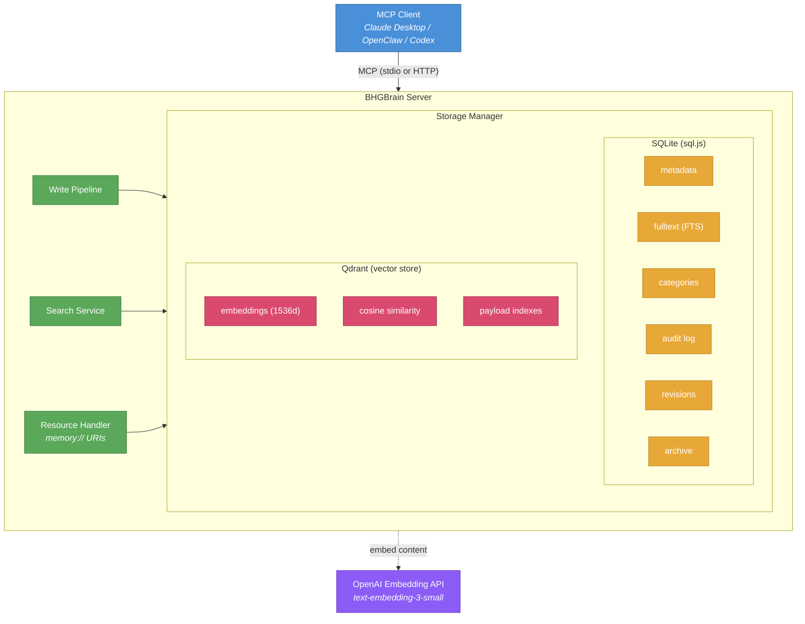
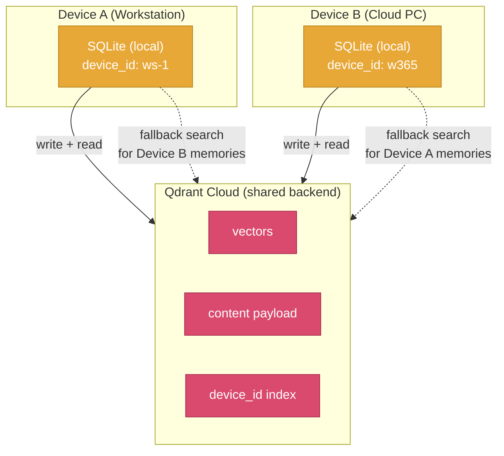
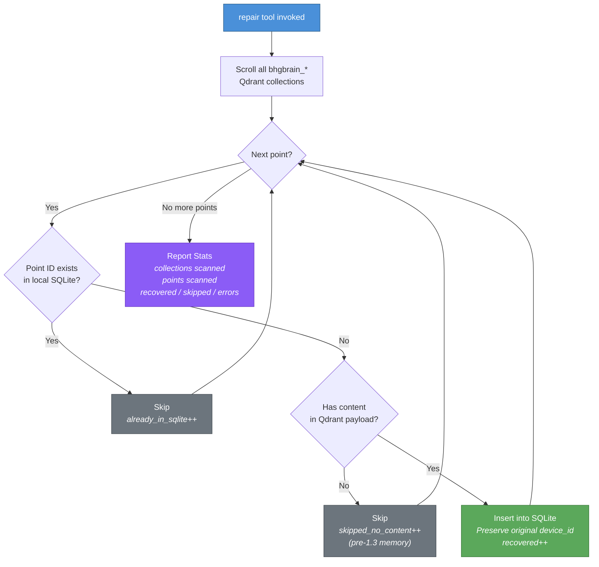
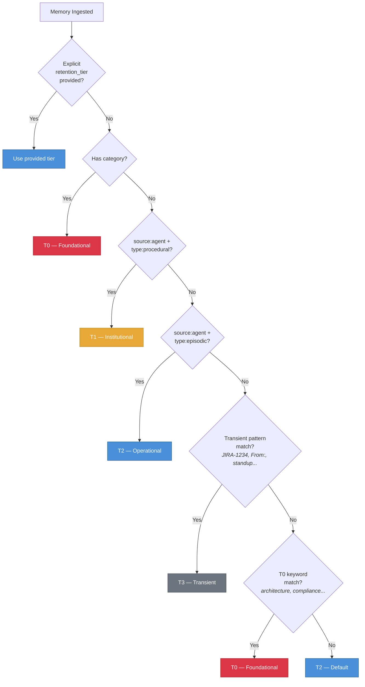
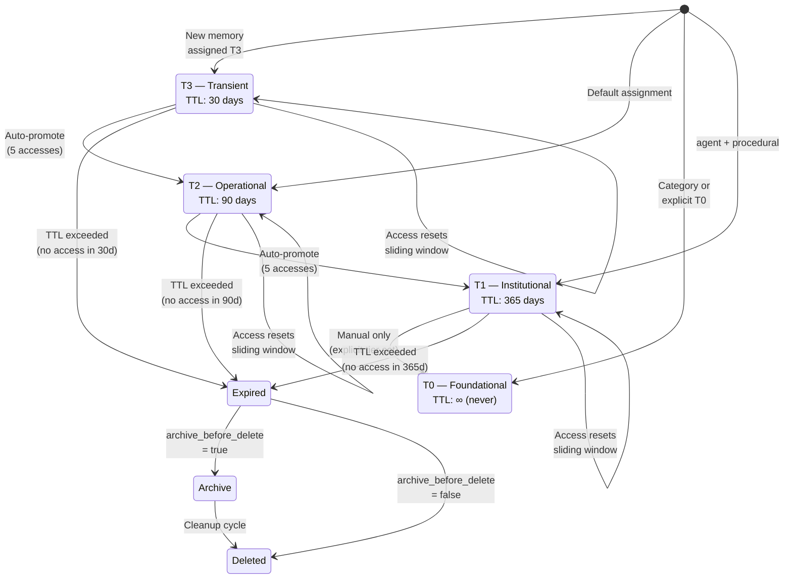
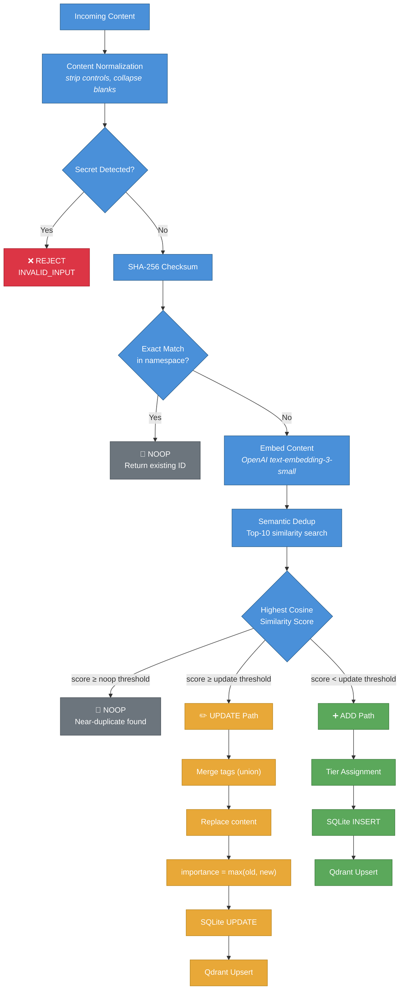
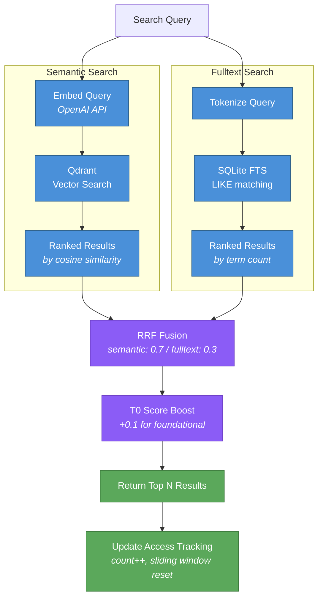
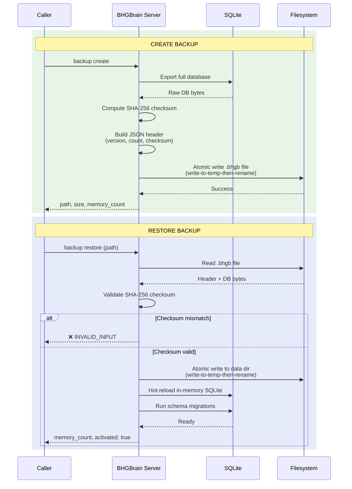

# BHGBrain

为 MCP 客户端（Claude、Codex、OpenClaw 等）提供持久化的向量记忆存储。

BHGBrain 将记忆存储在 SQLite（元数据 + 全文搜索）和 Qdrant（语义向量）中，通过 Model Context Protocol (MCP) 以 stdio 或 HTTP 方式对外暴露。其设计目标是为 AI 智能体提供一个持久化、可搜索的"第二大脑"，能够跨会话保留知识——具备完整的生命周期管理、自动去重、分层保留策略以及混合搜索能力。

---

## 目录

1. [概述与架构](#概述与架构)
2. [前置要求](#前置要求)
3. [Qdrant 配置](#qdrant-配置)
4. [安装](#安装)
5. [配置](#配置)
6. [环境变量](#环境变量)
7. [启动服务器](#启动服务器)
8. [MCP 客户端配置](#mcp-客户端配置)
9. [多设备记忆](#多设备记忆)
   - [工作原理](#工作原理)
   - [设备身份解析](#设备身份解析)
   - [共享 Qdrant，本地 SQLite](#共享-qdrant本地-sqlite)
   - [修复与恢复](#修复与恢复)
10. [记忆管理](#记忆管理)
    - [记忆数据模型](#记忆数据模型)
    - [记忆类型](#记忆类型)
    - [命名空间与集合](#命名空间与集合)
    - [保留层级](#保留层级)
    - [层级生命周期——分配、晋升与滑动窗口](#层级生命周期分配晋升与滑动窗口)
    - [去重](#去重)
    - [内容规范化](#内容规范化)
    - [重要性评分](#重要性评分)
    - [类别——持久化策略槽](#类别持久化策略槽)
    - [衰减、清理与归档](#衰减清理与归档)
    - [到期前警告](#到期前警告)
    - [资源限制与容量预算](#资源限制与容量预算)
11. [搜索](#搜索)
    - [语义搜索](#语义搜索)
    - [全文搜索](#全文搜索)
    - [混合搜索](#混合搜索)
    - [Recall 与 Search 的区别](#recall-与-search-的区别)
    - [过滤](#过滤)
    - [得分阈值与层级加权](#得分阈值与层级加权)
12. [备份与恢复](#备份与恢复)
13. [健康状态与指标](#健康状态与指标)
14. [安全性](#安全性)
15. [MCP 资源](#mcp-资源)
16. [引导提示词](#引导提示词)
17. [CLI 参考](#cli-参考)
18. [MCP 工具参考](#mcp-工具参考)
19. [升级](#升级)
20. [行为说明](#行为说明)

---

## 概述与架构

BHGBrain 是一个构建在 Model Context Protocol 之上的持久化记忆服务器。它存储 AI 智能体在各个会话中学习、决策和观察到的一切信息，并通过语义召回、全文搜索和注入式上下文的方式使这些知识可被访问。

### 双存储架构



- **SQLite**（通过 `sql.js`，以内存方式运行并定期原子性刷写到磁盘）是所有记忆元数据、全文搜索索引、类别、审计追踪、版本历史及归档记录的**权威数据源**。
- **Qdrant** 存储用于相似度搜索的语义向量嵌入。Qdrant 的写入始终在 SQLite 写入成功后进行；写入失败通过 `vector_synced` 标志追踪，并在健康检查端点中呈现。
- **OpenAI text-embedding-3-small**（默认，可配置）为每条记忆生成 1536 维嵌入向量。
- **原子写入**确保数据库文件不会被部分写入——所有磁盘 I/O 均采用"先写临时文件再重命名"的方式。
- **延迟刷写**对访问元数据的更新进行批处理（最多 5 秒），以避免在读密集路径上每次请求都触发数据库刷写。

---

## 前置要求

| 要求 | 版本 | 说明 |
|---|---|---|
| Node.js | ≥ 20.0.0 | 推荐使用 LTS 版本 |
| Qdrant | ≥ 1.9 | 必须在启动 BHGBrain 之前运行 |
| OpenAI API key | — | 用于嵌入（默认使用 `text-embedding-3-small`）。如果缺失，服务器将以降级模式启动。 |

---

## Qdrant 配置

BHGBrain **需要一个外部 Qdrant 实例**。即使在默认的 `embedded` 模式下，服务器也会连接到 `http://localhost:6333`——系统中不内置 Qdrant 二进制文件，你必须自行运行。

### 方案 A：Docker（推荐）

```bash
docker run -d \
  --name qdrant \
  --restart unless-stopped \
  -p 6333:6333 \
  -v qdrant_storage:/qdrant/storage \
  qdrant/qdrant
```

验证是否运行成功：

```bash
curl http://localhost:6333/health
# → {"title":"qdrant - vector search engine","version":"..."}
```

### 方案 B：Docker Compose

```yaml
services:
  qdrant:
    image: qdrant/qdrant
    restart: unless-stopped
    ports:
      - "6333:6333"
    volumes:
      - qdrant_storage:/qdrant/storage

volumes:
  qdrant_storage:
```

### 方案 C：原生二进制文件

从 [https://github.com/qdrant/qdrant/releases](https://github.com/qdrant/qdrant/releases) 下载并运行：

```bash
./qdrant
```

### 方案 D：Qdrant Cloud（外部模式）

在配置中将 `qdrant.mode` 设置为 `external`，并将 `external_url` 指向你的云集群 URL。将 `qdrant.api_key_env` 设置为保存 Qdrant API key 的环境变量名称。

```jsonc
{
  "qdrant": {
    "mode": "external",
    "external_url": "https://your-cluster.cloud.qdrant.io",
    "api_key_env": "QDRANT_API_KEY"
  }
}
```

---

## 安装

```bash
git clone https://github.com/Big-Hat-Group-Inc/BHGBrain.git
cd BHGBrain
npm install
npm run build
```

以 CLI 方式全局安装：

```bash
npm install -g .
bhgbrain --help
```

---

## 配置

BHGBrain 从以下位置加载配置文件：

- **Windows：** `%LOCALAPPDATA%\BHGBrain\config.json`
- **Linux/macOS：** `~/.bhgbrain/config.json`

该文件在首次运行时自动创建，并应用所有默认值。你可以编辑它以自定义行为。启动服务器时也可通过 `--config=<path>` 指定自定义配置文件路径。

### 完整配置参考

```jsonc
{
  // 数据目录（绝对路径）。默认使用平台适配的位置。
  "data_dir": null,

  // 多设备设置的设备身份（参见多设备记忆章节）
  "device": {
    // 稳定的设备标识符。省略时从主机名自动生成。
    // 格式：^[a-zA-Z0-9._-]{1,64}$
    // 也可通过 BHGBRAIN_DEVICE_ID 环境变量设置。
    "id": null
  },

  // 嵌入提供商配置
  "embedding": {
    // 目前仅支持 "openai"
    "provider": "openai",
    // 用于嵌入的 OpenAI 模型
    "model": "text-embedding-3-small",
    // 保存 OpenAI API key 的环境变量名称
    "api_key_env": "OPENAI_API_KEY",
    // 模型输出的向量维度，必须与模型输出匹配。
    // 重要：在集合创建后更改此项需要重建集合。
    "dimensions": 1536
  },

  // Qdrant 连接配置
  "qdrant": {
    // "embedded" = 连接到 localhost:6333
    // "external" = 连接到 external_url（Qdrant Cloud、远程实例等）
    "mode": "embedded",
    // 仅在 embedded 模式下使用（当前未启用——Qdrant 必须在外部启动）
    "embedded_path": "./qdrant",
    // 外部 Qdrant URL（当 mode = "external" 时使用）
    "external_url": null,
    // 包含 Qdrant API key 的环境变量名称（当 mode = "external" 时使用）
    "api_key_env": null
  },

  // 传输配置
  "transport": {
    "http": {
      // 启用 HTTP 传输
      "enabled": true,
      // 绑定的主机地址。使用 127.0.0.1 仅监听回环地址（默认，安全）。
      // 非回环地址要求设置 BHGBRAIN_TOKEN（或 allow_unauthenticated_http）。
      "host": "127.0.0.1",
      // 监听端口
      "port": 3721,
      // 保存 HTTP 认证 Bearer token 的环境变量名称
      "bearer_token_env": "BHGBRAIN_TOKEN"
    },
    "stdio": {
      // 启用 MCP stdio 传输
      "enabled": true
    }
  },

  // 调用方未指定时应用的默认值
  "defaults": {
    // 所有操作的默认命名空间
    "namespace": "global",
    // 所有操作的默认集合
    "collection": "general",
    // recall 操作的默认结果数量
    "recall_limit": 5,
    // recall 的默认最低语义相似度得分（0-1）
    "min_score": 0.6,
    // 自动注入载荷中包含的最大记忆数量
    "auto_inject_limit": 10,
    // 工具响应载荷的最大字符数
    "max_response_chars": 50000
  },

  // 记忆保留与生命周期设置
  "retention": {
    // 零访问天数超过此值后，记忆成为过期候选
    "decay_after_days": 180,
    // SQLite 数据库大小的最大值（GB），超出后健康检查报告降级
    "max_db_size_gb": 2,
    // 总记忆数量上限，超出后健康检查报告超容量
    "max_memories": 500000,
    // max_memories 的百分比阈值，超出后健康检查报告降级
    "warn_at_percent": 80,

    // 各层级的 TTL（天数，null = 永不过期）
    "tier_ttl": {
      "T0": null,    // 基础层：永不过期
      "T1": 365,     // 机构层：无访问后 1 年
      "T2": 90,      // 运营层：无访问后 90 天
      "T3": 30       // 临时层：无访问后 30 天
    },

    // 各层级的容量预算（null = 无限制）
    "tier_budgets": {
      "T0": null,      // 基础知识无上限
      "T1": 100000,    // 10 万条机构记忆
      "T2": 200000,    // 20 万条运营记忆
      "T3": 200000     // 20 万条临时记忆
    },

    // 自动将记忆晋升一个层级所需的访问次数阈值
    "auto_promote_access_threshold": 5,

    // 为 true 时，每次访问都会重置 TTL 计时器（滑动窗口）
    "sliding_window_enabled": true,

    // 为 true 时，过期记忆在删除前写入归档表
    "archive_before_delete": true,

    // 后台清理任务的 cron 计划（默认：每天凌晨 2 点）
    "cleanup_schedule": "0 2 * * *",

    // 在到期前多少天将记忆标记为即将到期
    "pre_expiry_warning_days": 7,

    // Qdrant 分段压缩阈值（当某分段中已删除数据占比超过此比例时触发压缩）
    "compaction_deleted_threshold": 0.10
  },

  // 去重设置
  "deduplication": {
    // 写入时启用语义去重
    "enabled": true,
    // 余弦相似度阈值，超过此值时新内容被认为是对现有内容的更新。
    // 各层级有额外调整（详见下方去重章节）。
    "similarity_threshold": 0.92
  },

  // 搜索配置
  "search": {
    // 混合模式下互惠排名融合（RRF）的权重
    // 权重之和必须为 1.0
    "hybrid_weights": {
      "semantic": 0.7,
      "fulltext": 0.3
    }
  },

  // 安全设置
  "security": {
    // 默认拒绝非回环 HTTP 绑定（安全失败关闭）
    "require_loopback_http": true,
    // 显式允许未认证的外部 HTTP（启动时记录高可见性警告）
    "allow_unauthenticated_http": false,
    // 在结构化日志中脱敏 token 值
    "log_redaction": true,
    // HTTP 传输下每个客户端 IP 每分钟的最大请求数
    "rate_limit_rpm": 100,
    // HTTP 请求体的最大字节数
    "max_request_size_bytes": 1048576
  },

  // 自动注入载荷预算（用于 memory://inject 资源）
  "auto_inject": {
    // 注入载荷中包含的最大字符数
    "max_chars": 30000,
    // Token 预算（null = 无限制，使用字符预算）
    "max_tokens": null
  },

  // 可观测性设置
  "observability": {
    // 启用进程内指标采集
    "metrics_enabled": false,
    // 使用结构化 JSON 日志（通过 pino）
    "structured_logging": true,
    // 日志级别："debug" | "info" | "warn" | "error"
    "log_level": "info"
  },

  // 数据摄入管道设置
  "pipeline": {
    // 启用提取阶段（当前运行确定性单候选提取）
    "extraction_enabled": true,
    // 用于基于 LLM 提取的模型（计划用于未来功能）
    "extraction_model": "gpt-4o-mini",
    // 提取模型 API key 的环境变量名称
    "extraction_model_env": "BHGBRAIN_EXTRACTION_API_KEY",
    // 为 true 时，若嵌入不可用则回退到仅校验和去重
    "fallback_to_threshold_dedup": true
  },

  // 摄入时自动摘要记忆内容
  "auto_summarize": true
}
```

---

## 环境变量

| 变量 | 是否必需 | 默认值 | 说明 |
|---|---|---|---|
| `OPENAI_API_KEY` | 是（用于嵌入） | — | OpenAI API key。缺失时服务器以**降级模式**启动——语义搜索和数据摄入将失败，但全文搜索和类别读取仍正常工作。 |
| `BHGBRAIN_TOKEN` | 非回环 HTTP 时必需 | — | HTTP 认证的 Bearer token。若主机地址为非回环且此变量未设置，服务器**拒绝启动**（除非 `allow_unauthenticated_http: true`）。 |
| `QDRANT_API_KEY` | Qdrant Cloud 时必需 | — | 在配置中将 `qdrant.api_key_env` 设置为此变量名称。默认配置字段名为 `QDRANT_API_KEY`。 |
| `BHGBRAIN_DEVICE_ID` | 否 | 从主机名自动生成 | 覆盖多设备设置的设备标识符。参见[设备身份解析](#设备身份解析)。 |
| `BHGBRAIN_EXTRACTION_API_KEY` | 否 | 回退到 `OPENAI_API_KEY` | LLM 提取模型的 API key（用于未来功能）。 |

生成安全的 Bearer token：

```bash
bhgbrain server token
# 或者不使用 CLI：
node -e "console.log(require('crypto').randomBytes(32).toString('hex'))"
```

---

## 启动服务器

### stdio 模式（通过 stdin/stdout 的 MCP）

这是 Claude Desktop 等 MCP 客户端使用的默认模式。`--stdio` 标志显式请求 stdio 传输。

```bash
# 开发模式（无需构建）
npm run dev

# 通过 CLI 生产运行
node dist/index.js --stdio

# 使用自定义配置文件
node dist/index.js --stdio --config=/path/to/config.json
```

### HTTP 模式

HTTP 默认在 `127.0.0.1:3721` 上启用。如需认证访问，启动前请设置 `BHGBRAIN_TOKEN`：

```bash
export OPENAI_API_KEY=sk-...
export BHGBRAIN_TOKEN=<your-token>
node dist/index.js
```

服务器默认监听 `http://127.0.0.1:3721`。可用的 HTTP 端点：

| 端点 | 是否需要认证 | 说明 |
|---|---|---|
| `GET /health` | 否 | 健康检查（不需认证，兼容探针） |
| `POST /tool/:name` | 是 | 调用指定 MCP 工具 |
| `GET /resource?uri=...` | 是 | 通过 URI 读取 MCP 资源 |
| `GET /metrics` | 是 | Prometheus 格式的指标（需 `metrics_enabled: true`） |

健康检查示例：

```bash
curl http://127.0.0.1:3721/health
```

通过 HTTP 调用工具示例：

```bash
curl -X POST http://127.0.0.1:3721/tool/remember \
  -H "Authorization: Bearer <your-token>" \
  -H "Content-Type: application/json" \
  -d '{"content": "Our auth service uses JWT with 1h expiry", "type": "semantic", "tags": ["auth", "architecture"]}'
```

---

## MCP 客户端配置

### Claude Desktop（`claude_desktop_config.json`）

```json
{
  "mcpServers": {
    "bhgbrain": {
      "command": "node",
      "args": ["C:/path/to/BHGBrain/dist/index.js"],
      "env": {
        "OPENAI_API_KEY": "sk-..."
      }
    }
  }
}
```

### Claude Desktop（全局安装 CLI）

```json
{
  "mcpServers": {
    "bhgbrain": {
      "command": "bhgbrain",
      "args": ["server", "start"],
      "env": {
        "OPENAI_API_KEY": "sk-..."
      }
    }
  }
}
```

### OpenClaw / mcporter（HTTP 传输）

```json
{
  "mcpServers": {
    "bhgbrain": {
      "transport": "http",
      "url": "http://127.0.0.1:3721",
      "headers": {
        "Authorization": "Bearer <your-token>"
      }
    }
  }
}
```

或者在 mcporter 支持环境变量查找时使用：

```json
{
  "mcpServers": {
    "bhgbrain": {
      "transport": "stdio",
      "command": "node",
      "args": ["C:/Temp/GitHub/BHGBrain/dist/index.js"],
      "env": {
        "OPENAI_API_KEY": "sk-...",
        "QDRANT_API_KEY": "..."
      }
    }
  }
}
```

---

## 多设备记忆

BHGBrain 支持在多台机器上运行多个实例（例如，一台主工作站和一台云开发机），共享同一个 Qdrant Cloud 后端。每个实例维护自己的本地 SQLite 数据库，同时读写共享的向量存储。

### 工作原理



每次记忆写入都会将完整内容存储在 SQLite（本地）和 Qdrant payload（共享）中。这意味着：

- **无单点故障**：如果某台设备的 SQLite 丢失，可以从 Qdrant 恢复内容。
- **跨设备可见性**：所有设备都能通过 Qdrant 看到所有记忆，即使它们的本地 SQLite 只有部分子集。
- **来源追踪**：每条记忆都标记了创建它的实例的 `device_id`。

### 设备身份解析

每个 BHGBrain 实例在启动时按以下优先顺序解析一个稳定的 `device_id`：

1. **显式配置**：`config.json` 中的 `device.id` 字段
2. **环境变量**：`BHGBRAIN_DEVICE_ID`
3. **自动生成**：从 `os.hostname()` 派生，转为小写并清理为 `[a-zA-Z0-9._-]`

首次运行时，解析后的 ID 会持久化到 `config.json`，以确保在重启后保持稳定，即使主机名后来发生变化。

```jsonc
// config.json — device 部分
{
  "device": {
    "id": "cpc-kevin-98f91"   // 从主机名自动生成，或显式设置
  }
}
```

`device_id` 出现在：
- 每个 Qdrant payload 中（作为关键字索引字段）
- 每条 SQLite 记忆记录中
- 搜索结果中（便于调用方识别哪台设备创建了该记忆）

### 共享 Qdrant，本地 SQLite

每台设备独立维护自己的 SQLite 数据库。设备之间没有同步协议——Qdrant 是共享层。

**每台设备能看到什么：**

| 来源 | 设备 A 看到 | 设备 B 看到 |
|---|---|---|
| 设备 A 的记忆（通过本地 SQLite） | ✅ 完整记录 | ❌ 不在本地 SQLite 中 |
| 设备 A 的记忆（通过 Qdrant 回退） | ✅ 完整记录 | ✅ 从 Qdrant payload 获取内容 |
| 设备 B 的记忆（通过本地 SQLite） | ❌ 不在本地 SQLite 中 | ✅ 完整记录 |
| 设备 B 的记忆（通过 Qdrant 回退） | ✅ 从 Qdrant payload 获取内容 | ✅ 完整记录 |

当搜索返回一条存在于 Qdrant 但不在本地 SQLite 中的记忆时，BHGBrain 从 Qdrant payload 构建结果，而不是静默丢弃它。这意味着无论哪台设备创建了该记忆，两台设备都能获得完整的搜索结果。

### 修复与恢复



`repair` 工具从 Qdrant 重建设备的本地 SQLite。在以下场景中使用：

- 设置共享现有 Qdrant 后端的新设备
- 从 SQLite 数据丢失中恢复
- 迁移到新机器

```json
// 预览将恢复的内容（不做任何更改）
{ "dry_run": true }

// 从 Qdrant 恢复所有记忆到本地 SQLite
{ "dry_run": false }

// 仅恢复由特定设备创建的记忆
{ "device_id": "cpc-kevin-98f91", "dry_run": false }
```

repair 工具：
- 遍历所有 `bhgbrain_*` Qdrant 集合中的所有点
- 将任何在 Qdrant payload 中包含 `content` 但本地 SQLite 中缺失的记忆插入
- 保留原始的 `device_id` 来源（如果不存在则使用本地设备的 ID 标记）
- 报告：扫描的集合数、扫描的点数、恢复数、跳过数（无内容）、错误数

**注意**：在内容存入 Qdrant 功能添加之前存储的记忆（1.3 之前）在 Qdrant payload 中没有内容，无法通过 repair 恢复。这些条目只有元数据（标签、类型、重要性）能保留。

### 多设备配置示例

**设备 A**（`config.json`）：
```jsonc
{
  "device": { "id": "workstation" },
  "qdrant": {
    "mode": "external",
    "external_url": "https://your-cluster.cloud.qdrant.io",
    "api_key_env": "QDRANT_API_KEY"
  }
}
```

**设备 B**（`config.json`）：
```jsonc
{
  "device": { "id": "cloud-pc" },
  "qdrant": {
    "mode": "external",
    "external_url": "https://your-cluster.cloud.qdrant.io",
    "api_key_env": "QDRANT_API_KEY"
  }
}
```

两者指向同一个 Qdrant 集群。每台设备有自己的 `device_id`。所有记忆流入相同的向量集合，对两个实例均可见。

---

## 记忆管理

本节描述完整的记忆生命周期——从摄入开始，经过分类、去重、访问追踪、晋升、衰减，到最终过期或永久保留。

### 记忆数据模型

BHGBrain 中存储的每条记忆都是一个 `MemoryRecord`，包含以下字段：

| 字段 | 类型 | 说明 |
|---|---|---|
| `id` | `string (UUID)` | 全局唯一标识符 |
| `namespace` | `string` | 作用域命名空间（如 `"global"`、`"project/alpha"`、`"user/kevin"`） |
| `collection` | `string` | 命名空间内的子分组（如 `"general"`、`"architecture"`、`"decisions"`） |
| `type` | `"episodic" \| "semantic" \| "procedural"` | 记忆类型（见记忆类型章节） |
| `category` | `string \| null` | 若该记忆附加到持久化策略类别，则为类别名称 |
| `content` | `string` | 记忆的完整内容（最多 100,000 字符） |
| `summary` | `string` | 自动生成的首行摘要（最多 120 字符） |
| `tags` | `string[]` | 自由格式标签（字母数字 + 连字符，最多 20 个，每个最多 100 字符） |
| `source` | `"cli" \| "api" \| "agent" \| "import"` | 记忆的创建方式 |
| `checksum` | `string` | 规范化内容的 SHA-256 哈希（用于精确去重） |
| `embedding` | `number[]` | 向量嵌入（不存储在 SQLite 中，存在 Qdrant 里） |
| `importance` | `number (0–1)` | 重要性评分（默认 0.5） |
| `retention_tier` | `"T0" \| "T1" \| "T2" \| "T3"` | 管理 TTL 和清理行为的生命周期层级 |
| `expires_at` | `string (ISO 8601) \| null` | 过期时间戳（T0 为 null——永不过期） |
| `decay_eligible` | `boolean` | 记忆是否参与 TTL 清理（T0 为 false） |
| `review_due` | `string (ISO 8601) \| null` | T1 审查日期（设置为 created_at + 365 天，访问时重置） |
| `access_count` | `number` | 该记忆被检索的次数 |
| `last_accessed` | `string (ISO 8601)` | 最近一次检索的时间戳 |
| `last_operation` | `"ADD" \| "UPDATE" \| "DELETE" \| "NOOP"` | 最近一次应用的写操作 |
| `merged_from` | `string \| null` | 该记忆合并自的来源记忆 ID（去重 UPDATE 路径） |
| `archived` | `boolean` | 该记忆是否已软归档（从搜索/召回中排除） |
| `vector_synced` | `boolean` | Qdrant 向量是否与 SQLite 状态同步 |
| `device_id` | `string \| null` | 创建此记忆的 BHGBrain 实例标识符（参见[多设备记忆](#多设备记忆)） |
| `created_at` | `string (ISO 8601)` | 创建时间戳 |
| `updated_at` | `string (ISO 8601)` | 最后更新时间戳 |
| `last_accessed` | `string (ISO 8601)` | 最后检索时间戳 |

#### SQLite Schema

`memories` 表具有全面的索引以支持高效过滤：

```sql
CREATE INDEX idx_memories_namespace   ON memories(namespace);
CREATE INDEX idx_memories_collection  ON memories(namespace, collection);
CREATE INDEX idx_memories_checksum    ON memories(namespace, checksum);
CREATE INDEX idx_memories_type        ON memories(namespace, type);
CREATE INDEX idx_memories_category    ON memories(category);
CREATE INDEX idx_memories_tier        ON memories(namespace, collection, retention_tier);
CREATE INDEX idx_memories_expiry      ON memories(decay_eligible, expires_at);
CREATE INDEX idx_memories_review_due  ON memories(retention_tier, review_due);
CREATE INDEX idx_memories_archived    ON memories(archived);
CREATE INDEX idx_memories_vector_sync ON memories(vector_synced);
```

#### Qdrant Payload 索引

每个 Qdrant 集合维护以下 payload 索引以支持高效的向量侧过滤：

- `namespace`（keyword）
- `type`（keyword）
- `retention_tier`（keyword）
- `decay_eligible`（boolean）
- `expires_at`（integer——以 Unix epoch 秒存储）
- `device_id`（keyword）

---

### 记忆类型

每条记忆被分类为三种语义类型之一。类型用于在召回和搜索中进行过滤，并影响摄入时分配的默认保留层级。

| 类型 | 含义 | 典型内容 | 默认层级 |
|---|---|---|---|
| `episodic` | 某一时间点发生的具体事件、观察或情况 | 会议结果、调试过程、任务上下文、某次 sprint 中发生的事 | `T2`（运营层） |
| `semantic` | 与特定时间无关的事实、概念或知识片段 | 系统工作原理、术语含义、配置值、数据模型 | `T2`（运营层） |
| `procedural` | 流程、工作流或操作指南 | 运维手册、部署步骤、编码规范、如何执行某项任务 | `T1`（机构层） |

**类型对层级分配的影响：**
- `source: agent` + `type: procedural` → 自动分配 `T1`（机构层）
- `source: agent` + `type: episodic` → 自动分配 `T2`（运营层）
- `source: cli`（任意类型）→ 自动分配 `T2`（运营层）
- `source: import` 且包含 T0 内容信号 → 无论类型均为 `T0`

如果未提供类型，管道默认为 `"semantic"`。

---

### 命名空间与集合

**命名空间**是顶层作用域标识符，用于隔离来自不同上下文、用户或项目的记忆。所有工具操作都需要命名空间（默认：`"global"`）。

- 命名空间格式：`^[a-zA-Z0-9/-]{1,200}$`——字母数字字符、连字符和正斜杠
- 示例：`"global"`、`"project/alpha"`、`"user/kevin"`、`"tenant/acme-corp"`
- 不同命名空间中的记忆在搜索时互不干扰
- 每个 namespace+collection 对映射到一个独立的 Qdrant 集合（命名为 `bhgbrain_{namespace}_{collection}`）

**集合**是命名空间内的子分组，允许你按主题或目的对记忆进行分区，而无需创建完全独立的命名空间。

- 集合格式：`^[a-zA-Z0-9-]{1,100}$`
- 示例：`"general"`、`"architecture"`、`"decisions"`、`"onboarding"`
- 集合在 SQLite 的 `collections` 表中追踪，其嵌入模型和维度在创建时锁定——同一集合中不能混用不同的嵌入模型
- 使用 `collections` MCP 工具来列出、创建或删除集合

**隔离保证：**
- SQLite 查询始终优先按 `namespace` 过滤
- Qdrant 搜索即使在针对特定集合时也包含 `namespace` payload 过滤器
- 删除集合会从 SQLite 和 Qdrant 中移除所有关联记忆

---

### 保留层级

每条记忆在摄入时都被分配一个**保留层级**，该层级管理其整个生命周期——存活时长、清理方式、去重严格程度以及是否会过期。

| 层级 | 标签 | 默认 TTL | 衰减资格 | 示例 |
|---|---|---|---|---|
| `T0` | **基础层** | 永不（永久） | 否 | 架构参考、法律要求、公司政策、合规要求、会计准则、ADR、安全运维手册 |
| `T1` | **机构层** | 最后访问后 365 天 | 是（带 review_due 追踪） | 软件设计决策、API 契约、部署运维手册、编码规范、供应商协议、程序性知识 |
| `T2` | **运营层** | 最后访问后 90 天 | 是 | 项目状态、sprint 决策、会议结果、技术调研、当前任务上下文 |
| `T3` | **临时层** | 最后访问后 30 天 | 是 | 工单、邮件摘要、日报、临时调试记录、短期任务笔记 |

**各层级的关键属性：**

- **T0**：`expires_at` 始终为 `null`。`decay_eligible` 始终为 `false`。T0 记忆无法被自动清理。T0 记忆的更新会在应用更新之前在 `memory_revisions` 表中创建版本快照（只追加历史）。T0 记忆在混合搜索结果中获得 +0.1 的得分加权。

- **T1**：`review_due` 设置为 `created_at + 365 天`，每次访问时重置。接近 `expires_at` 的记忆在搜索结果中标记 `expiring_soon: true`。

- **T2**：大多数记忆的默认层级。90 天滑动窗口——每次访问都会重置 TTL 计时器。

- **T3**：最积极的层级。通过模式匹配识别的临时内容（工单、邮件、站会笔记）会自动分类到此层级。30 天滑动窗口。

**容量预算：**

| 层级 | 默认预算 | 说明 |
|---|---|---|
| T0 | 无限制 | 基础知识必须始终容纳 |
| T1 | 100,000 | 机构知识 |
| T2 | 200,000 | 运营记忆 |
| T3 | 200,000 | 临时记忆 |

当某层级预算超限时，健康端点报告 `degraded`，清理任务在下一周期中优先处理该层级。

---

### 层级生命周期——分配、晋升与滑动窗口

#### 层级分配

层级分配发生在写管道中，按以下优先顺序进行：

1. **调用方显式覆盖：** 如果 `remember` 工具传入了 `retention_tier`，则无条件使用该值。

2. **基于类别：** 如果记忆附加到某个类别（通过 `category` 字段），则始终为 `T0`。类别代表持久化策略槽，永不过期。

3. **来源 + 类型启发式规则：**
   - `source: agent` + `type: procedural` → `T1`
   - `source: agent` + `type: episodic` → `T2`
   - `source: cli` → `T2`

4. **临时信号的内容模式匹配（→ T3）：**
   - Jira/工单引用：`JIRA-1234`、`incident-456`、`case-789`
   - 邮件元数据：`From:`、`Subject:`、`fw:`、`re:`
   - 时间标记：`today`、`this week`、`by friday`、`standup`、`meeting minutes`、`action items`
   - 季度引用：`Q1 2026`、`Q3 2025`

5. **T0 关键词信号（→ 导入内容的 T0）：**
   如果 `source: import` 且内容或标签中包含以下任意词：
   `architecture`、`design decision`、`adr`、`rfc`、`contract`、`schema`、`legal`、`compliance`、`policy`、`standard`、`accounting`、`security`、`runbook`
   → 分配 `T0`。

6. **T0 关键词信号（→ 任意来源的 T0）：**
   对所有来源检查相同的 T0 关键词（先检查 T3 临时模式）。如果匹配到 T0 关键词且没有临时模式，则记忆为 `T0`。

7. **默认值：** `T2`——安全且宽容的默认选项。



#### 分配时计算的层级元数据

```typescript
{
  retention_tier: "T2",               // 分配的层级
  expires_at: "2026-06-14T12:00:00Z", // created_at + TTL 天数
  decay_eligible: true,               // 仅 T0 为 false
  review_due: null                    // 仅 T1 设置此字段
}
```

对于 T1 记忆，`review_due` 设置为 `created_at + tier_ttl.T1`（默认 365 天），每次检索时重置。

#### 基于访问的自动晋升

当 `T2` 或 `T3` 层级的记忆达到访问阈值（`auto_promote_access_threshold`，默认 5）时，自动晋升一个层级：

- `T3` → `T2`
- `T2` → `T1`

自动晋升不能到达 `T0`。手动升级到 `T0` 可通过在后续 `remember` 调用中传入 `retention_tier: "T0"`（触发 UPDATE 路径）或通过 CLI 的 `bhgbrain tier set <id> T0` 实现。

晋升是**单向的**——自动降级永远不会发生。层级降级需要用户明确操作。

记忆晋升后，`expires_at` 会以当前时间戳作为滑动窗口锚点，根据新层级的 TTL 重新计算。



#### 滑动窗口过期

当 `sliding_window_enabled: true`（默认值）时，每次通过 `recall`、`search` 或 `memory://inject` 成功检索都会重置 TTL 计时器：

```
new expires_at = max(current expires_at, now + tier_ttl)
```

这意味着被频繁使用的记忆永远不会过期，而从未被检索的记忆会在 TTL 到期后被清理。在最后时刻才被访问一次的记忆会从该访问时间起获得全新的 TTL 窗口。

访问追踪在每次搜索后以批处理方式执行（最多 5 秒延迟刷写），以避免在读路径上进行同步数据库写入。

---

### 去重

BHGBrain 通过两阶段去重管道防止存储重复或近似重复的内容。



#### 第一阶段：精确去重（校验和）

在生成任何嵌入向量之前，先对规范化内容进行 SHA-256 哈希。如果同一命名空间中已存在具有相同校验和的记忆（且未被归档），则操作立即返回 `NOOP`，不进行任何 API 调用。

```
checksum = SHA-256(normalizeContent(content))
```

#### 第二阶段：语义去重（向量相似度）

如果没有找到精确匹配，则对内容进行嵌入，并从 Qdrant 中检索集合内最相似的前 10 条现有记忆。基于余弦相似度得分和记忆分配的层级，做出以下三种决策之一：

| 决策 | 条件 | 效果 |
|---|---|---|
| `NOOP` | 得分 ≥ noop 阈值 | 内容被视为重复；返回现有记忆的 ID 而不写入 |
| `UPDATE` | 得分 ≥ update 阈值 | 内容是对现有内容的更新；合并标签、更新内容和校验和，保留 ID |
| `ADD` | 得分 < update 阈值 | 全新记忆；使用新 UUID 创建 |

**各层级的去重阈值：**

基础 `similarity_threshold`（默认 0.92）按层级调整，因为 T0/T1 记忆需要更严格的匹配（近似重复可能代表有意的版本控制），而 T3 则更积极：

| 层级 | NOOP 阈值 | UPDATE 阈值 |
|---|---|---|
| `T0` | 0.98 | max(base, 0.95) |
| `T1` | 0.98 | max(base, 0.95) |
| `T2` | 0.98 | base (0.92) |
| `T3` | 0.95 | max(base, 0.90) |

**UPDATE 合并行为：**
- 标签取并集（现有标签 ∪ 新标签）
- 内容替换为新版本
- 重要性设置为 `max(现有重要性, 新重要性)`
- 保留层级和过期时间根据新内容的分类结果重新计算

**回退行为：**
如果嵌入提供商不可用且 `pipeline.fallback_to_threshold_dedup: true`，管道回退到仅校验和去重，并仅将记忆写入 SQLite（`vector_synced: false`）。该记忆在 Qdrant 同步恢复之前可用于全文搜索，但不可用于语义搜索。

---

### 内容规范化

在校验和计算、嵌入或存储之前，所有内容都经过规范化管道处理：

1. **控制字符剥离：** 移除 ASCII 控制字符（0x00–0x08、0x0B、0x0C、0x0E–0x1F、0x7F）。换行符（0x0A）和回车符（0x0D）保留。

2. **CRLF 规范化：** `\r\n` → `\n`

3. **行尾空白移除：** 剥离每行末尾的空格和制表符。

4. **多余空行折叠：** 三个或更多连续换行符折叠为两个。

5. **首尾空白裁剪：** 对整个字符串进行裁剪。

6. **密钥检测：** 在存储之前，内容会被检查常见凭据格式的模式：
   - `api_key=...`、`secret=...`、`token=...`、`password=...`
   - AWS 访问密钥 ID（`AKIA...`）
   - GitHub 个人访问令牌（`ghp_...`）
   - OpenAI API keys（`sk-...`）
   - PEM 私钥（`-----BEGIN ... PRIVATE KEY-----`）

   如果检测到密钥，写入操作将被**拒绝**并返回 `INVALID_INPUT`：
   > `Content appears to contain credentials or secrets. Memory rejected for safety.`

7. **摘要生成：** 提取规范化内容的第一行作为摘要（超过 120 字符则附加 `...` 截断）。摘要存储在 SQLite 中，用于轻量展示而无需获取完整内容。

---

### 重要性评分

每条记忆都有一个 `importance` 字段——0.0 到 1.0 之间的浮点数。

**默认值：** 如果调用方未提供，则为 `0.5`。

**使用方式：**
- 在去重 UPDATE 合并期间，重要性设置为 `max(现有值, 新值)`——重要性只会通过合并增加。
- 过期记忆候选（由整合阶段标记）必须满足 `importance < 0.5` 且无类别才有资格进入过期标记阶段。这保护了高重要性记忆不被标记为过期。
- 未来基于 LLM 的提取可能会根据内容分析来赋予重要性。

**设置重要性：**
在 `remember` 工具中显式传入 `importance`。值范围从 `0.0`（价值极低，应积极衰减）到 `1.0`（关键，应保留）。

```json
{
  "content": "Our HIPAA BAA requires all PHI to be encrypted at rest using AES-256",
  "type": "semantic",
  "tags": ["compliance", "hipaa", "security"],
  "importance": 0.9,
  "retention_tier": "T0"
}
```

---

### 类别——持久化策略槽

类别是一种特殊的存储机制，用于存放持久化的、始终注入的策略上下文。与普通记忆（通过语义搜索检索）不同，类别内容始终包含在 `memory://inject` 资源载荷中。

类别设计用于存储始终应出现在 AI 上下文窗口中的信息：公司价值观、架构原则、编码规范以及类似的常驻策略。

#### 类别槽

每个类别分配到四个命名槽之一：

| 槽位 | 用途 | 示例 |
|---|---|---|
| `company-values` | 核心原则、文化、品牌声音 | "我们优先考虑安全性而非速度"、"不要在日志中存储 PII" |
| `architecture` | 系统架构、组件拓扑、关键设计决策 | 服务图、API 契约、技术选型 |
| `coding-requirements` | 编码规范、约定、必需的模式 | "始终使用 async/await"、"使用 Zod 进行所有验证"、命名约定 |
| `custom` | 任何其他值得常驻上下文的内容 | 项目特定规则、消歧义指南、实体映射 |

#### 类别行为

- 类别**始终为 T0**——永不过期、永不衰减，无法被保留系统清理。
- 类别内容以全文存储在 SQLite 中（不嵌入到 Qdrant）。
- 在 `memory://inject` 载荷中，类别内容优先于普通记忆被插入。
- 类别支持版本控制——当你使用 `category set` 更新类别时，`revision` 计数器递增。
- 类别名称必须唯一。每个槽位可以有多个类别（例如，`"api-contracts"` 和 `"database-schema"` 都在 `"architecture"` 槽位中）。
- 类别内容最多可达 100,000 字符。

#### 管理类别

```json
// 列出所有类别
{ "action": "list" }

// 获取特定类别
{ "action": "get", "name": "api-contracts" }

// 创建或更新类别
{
  "action": "set",
  "name": "coding-standards",
  "slot": "coding-requirements",
  "content": "## Coding Standards\n\n- Use TypeScript strict mode\n- All functions must have JSDoc comments\n- Tests required for all public APIs"
}

// 删除类别
{ "action": "delete", "name": "coding-standards" }
```

---

### 衰减、清理与归档

#### 后台清理

保留系统运行定时清理任务（默认：每天凌晨 2:00，可通过 `retention.cleanup_schedule` 以 cron 表达式配置）。也可以通过 `bhgbrain gc` 手动触发清理。

**清理阶段：**

1. **识别过期记忆：** 查询 SQLite 中所有满足 `decay_eligible = true` 且 `expires_at < now()` 的记忆。T0 记忆始终被排除（T0 永远不具备衰减资格）。

2. **删除前归档（若已启用）：** 对每条过期记忆，将摘要记录写入 `memory_archive` 表：

   ```sql
   memory_archive {
     id            INTEGER (autoincrement)
     memory_id     TEXT    -- 原始记忆 UUID
     summary       TEXT    -- 记忆的摘要文本
     tier          TEXT    -- 删除时所在的层级
     namespace     TEXT    -- 所属命名空间
     created_at    TEXT    -- 原始创建时间戳
     expired_at    TEXT    -- 清理执行的时间
     access_count  INTEGER -- 生命周期内的总访问次数
     tags          TEXT    -- 标签的 JSON 数组
   }
   ```

3. **从 Qdrant 删除：** 从各自的 Qdrant 集合中批量删除所有过期的点 ID。

4. **从 SQLite 删除：** 从 `memories` 和 `memories_fts` 表中移除过期行。

5. **审计日志：** 每次删除都记录在 `audit_log` 表中，`operation: FORGET`，`client_id: "system"`。

6. **刷写：** 所有删除完成后，SQLite 原子性刷写到磁盘。

#### T0 版本历史

当 T0（基础层）记忆通过 `remember` 工具更新（触发 UPDATE 去重路径）时，在应用更新之前，旧内容会被快照到 `memory_revisions` 表：

```sql
memory_revisions {
  id         INTEGER (autoincrement)
  memory_id  TEXT    -- T0 记忆的 UUID
  revision   INTEGER -- 递增的版本号
  content    TEXT    -- 完整的旧内容
  updated_at TEXT    -- 更新发生的时间
  updated_by TEXT    -- 执行更新的 client_id
}
```

只有 T0 记忆有版本历史。Qdrant 中的向量嵌入始终反映当前内容。

#### 过期标记（整合阶段）

`bhgbrain gc --consolidate` 命令（或 `RetentionService.runConsolidation()`）执行一个辅助阶段，将记忆标记为**过期**候选：

- 在 `retention.decay_after_days`（默认 180）天内未被访问的任何记忆都被标记为过期候选。
- 只有 `importance < 0.5` 且无类别的记忆才有资格。
- 过期记忆不会立即删除；它们成为下一次 GC 清理周期的候选。

#### 归档搜索与恢复

已删除的记忆（当 `archive_before_delete: true` 时）可以被检查和恢复：

```bash
bhgbrain archive list                 # 列出最近归档的记忆
bhgbrain archive search <query>       # 按文本搜索归档摘要
bhgbrain archive restore <memory_id>  # 恢复已归档的记忆
```

**恢复语义：** 恢复的记忆从归档摘要文本作为**新的** `T2` 记忆重新创建。原始内容（如果比摘要更长）无法恢复——归档仅存储 120 字符的摘要。恢复的记忆获得全新的时间戳和新 UUID，并在 Qdrant 中重新嵌入。

---

### 到期前警告

即将过期（在 `retention.pre_expiry_warning_days` 天内，默认 7 天）的记忆在搜索结果中被标记：

```json
{
  "id": "...",
  "content": "...",
  "retention_tier": "T2",
  "expires_at": "2026-03-22T12:00:00Z",
  "expiring_soon": true
}
```

`expiring_soon` 标志出现在：
- `recall` 结果
- `search` 结果
- `memory://inject` 资源载荷

这允许 AI 智能体注意到即将过期的记忆，并决定是否晋升它们（通过以显式的 `retention_tier: "T1"` 或 `"T0"` 重新保存）。

---

### 资源限制与容量预算

BHGBrain 监控容量并通过健康系统呈现警告：

| 限制 | 配置键 | 默认值 | 超出时的行为 |
|---|---|---|---|
| 最大总记忆数 | `retention.max_memories` | 500,000 | 健康检查报告 `degraded`；清理任务优先处理 |
| 最大数据库大小 | `retention.max_db_size_gb` | 2 GB | 健康检查报告 `degraded`（监控但不强制执行） |
| 警告阈值 | `retention.warn_at_percent` | 80% | 当 `count > max_memories * 0.8` 时健康检查报告 `degraded` |
| T1 预算 | `retention.tier_budgets.T1` | 100,000 | 健康检查报告 `over_capacity: true`；保留组件降级 |
| T2 预算 | `retention.tier_budgets.T2` | 200,000 | 同上 |
| T3 预算 | `retention.tier_budgets.T3` | 200,000 | 同上 |

T0 没有容量预算。基础知识必须始终被保留。

健康端点的 `retention.over_capacity` 字段在任何配置的预算超出时为 `true`。`retention.counts_by_tier` 对象显示每个层级的当前数量，你可以与配置的预算进行比较。

---

## 搜索

BHGBrain 支持三种搜索模式，可以独立使用或组合使用。

### 语义搜索

语义搜索使用 OpenAI 嵌入和 Qdrant 向量相似度（余弦距离）来查找与查询概念上相似的记忆——即使它们使用不同的词语。

**工作原理：**
1. 使用与存储记忆相同的模型（`text-embedding-3-small`，1536 维）对查询字符串进行嵌入。
2. 在目标集合中查询 Qdrant 的最近邻。
3. Qdrant 应用 payload 过滤器以排除过期记忆：仅返回满足 `decay_eligible = false`（T0/T1）或 `expires_at > now()` 的记忆。
4. 结果按余弦相似度得分排序（0.0–1.0，越高越相似）。
5. 更新每条返回记忆的访问元数据（access_count++、last_accessed、滑动窗口过期重置）。

**适用场景：** 概念性查询、关于某事工作原理的问题、检索架构决策但不知道确切关键词时。

**要求：** 需要嵌入提供商正常运行。如果 OpenAI 不可达，返回 `EMBEDDING_UNAVAILABLE` 错误。

```json
// 通过 search 工具进行语义搜索
{
  "query": "how does authentication work",
  "mode": "semantic",
  "namespace": "global",
  "limit": 10
}
```

---

### 全文搜索

全文搜索使用 SQLite 内部文本匹配来查找包含特定词语或短语的记忆。

**工作原理：**
1. 将查询拆分为小写词语。
2. 每个词语通过 `LIKE %term%` 在 `memories_fts` 影子表的 `content`、`summary` 和 `tags` 列中进行匹配。
3. 结果按匹配词语数量排序（匹配越多 = 排名越高）。
4. 排名归一化为 0.0–1.0 的得分：`min(1.0, term_count / 10)`。
5. 已归档记忆被排除（FTS 表与主记忆表保持同步——已归档行从 FTS 中移除）。
6. 更新返回结果的访问元数据。

**适用场景：** 精确关键词搜索、搜索特定标识符（记忆 ID、项目名称、系统名称）、知道确切术语时。

**要求：** 即使嵌入提供商不可用也能工作（全文搜索不需要 Qdrant）。

```json
// 通过 search 工具进行全文搜索
{
  "query": "JIRA-1234 authentication",
  "mode": "fulltext",
  "namespace": "global",
  "limit": 10
}
```

---

### 混合搜索



混合搜索使用**互惠排名融合（Reciprocal Rank Fusion，RRF）**结合语义和全文搜索结果——这是一种基于排名的融合算法，对两种检索系统之间的得分尺度差异具有鲁棒性。

**工作原理：**
1. 语义搜索和全文搜索独立运行（尽可能并行）。
2. 每种方法最多检索 `limit * 2` 个候选。
3. RRF 融合合并排名列表：

   ```
   RRF_score(item) = (semantic_weight / (K + semantic_rank))
                   + (fulltext_weight  / (K + fulltext_rank))
   ```
   
   其中 `K = 60`（标准 RRF 常数），`semantic_weight = 0.7`，`fulltext_weight = 0.3`（可通过 `search.hybrid_weights` 配置）。

4. 仅出现在一个列表中的条目从另一个列表获得 `0` 贡献。
5. 合并后的列表按 RRF 得分降序排序。
6. T0 记忆在 RRF 融合后获得 **+0.1 得分加权**，确保基础知识在结果中突出呈现。
7. 返回前 `limit` 条结果。

**优雅降级：** 如果嵌入提供商不可用，混合搜索会静默回退到仅全文搜索结果，而不是报错。

**适用场景：** 大多数查询的默认选择——混合搜索提供最佳召回率，因为即使关键词不匹配也可能通过语义匹配返回记忆，或者即使嵌入略有偏差也可能通过全文匹配返回。

```json
// 混合搜索（默认模式）
{
  "query": "authentication JWT expiry",
  "mode": "hybrid",
  "namespace": "global",
  "limit": 10
}
```

---

### Recall 与 Search 的区别

BHGBrain 提供两种具有不同语义的记忆检索工具：

| 方面 | `recall` | `search` |
|---|---|---|
| **主要用途** | 检索与当前上下文最相关的记忆 | 探索和调查记忆库 |
| **搜索模式** | 始终为语义（向量相似度） | 可配置：`semantic`、`fulltext` 或 `hybrid`（默认） |
| **结果数量** | 1–20（默认 5） | 1–50（默认 10） |
| **得分过滤** | 应用 `min_score` 过滤（默认 0.6） | 无得分过滤 |
| **类型过滤** | 可选的 `type` 过滤（`episodic`/`semantic`/`procedural`） | 无类型过滤 |
| **标签过滤** | 可选的 `tags` 过滤（任意匹配标签） | 无标签过滤 |
| **命名空间** | 必需（默认 `global`） | 必需（默认 `global`） |
| **集合** | 可选——省略则搜索所有集合 | 可选 |
| **访问追踪** | 是——每次 recall 都更新 access_count 和滑动窗口 | 是——行为相同 |
| **预期调用方** | 执行任务时的 AI 智能体 | 进行调查的人类或管理智能体 |

**recall 中的得分过滤：**
`min_score` 参数（默认 0.6）作为质量关卡——只有余弦相似度 ≥ 0.6 的记忆才会被返回。这防止了不相关的结果。你可以降低 `min_score` 以获取更多结果，但会牺牲精确性。

```json
// Recall 示例——语义搜索，按类型和标签过滤
{
  "query": "authentication architecture decisions",
  "namespace": "global",
  "type": "semantic",
  "tags": ["auth", "architecture"],
  "limit": 5,
  "min_score": 0.6
}
```

---

### 过滤

`recall` 和 `search` 都支持命名空间和集合作用域。`recall` 还额外支持类型和标签过滤。

**命名空间过滤：** 始终应用。所有搜索都限定在单个命名空间内。不支持跨命名空间搜索。

**集合过滤：** 可选。如果省略：
- 在语义搜索中，搜索 Qdrant 集合 `bhgbrain_{namespace}_general`（命名空间的默认集合）。
- 在全文搜索中，搜索命名空间内的所有记忆，不限集合。

**类型过滤（仅 `recall`）：** 传入 `"type": "episodic"` | `"semantic"` | `"procedural"` 以将结果限制为单一记忆类型。过滤在语义搜索后应用，因此从 Qdrant 先检索完整候选集。

**标签过滤（仅 `recall`）：** 传入 `"tags": ["auth", "security"]` 以将结果限制为具有至少一个指定标签的记忆。过滤在检索后应用。

---

### 得分阈值与层级加权

**`min_score`（仅 recall）：** 0 到 1 之间的最低余弦相似度得分。低于此阈值的记忆从 `recall` 结果中排除。默认：0.6。

**过期记忆排除：** Qdrant 的向量搜索过滤器排除满足 `decay_eligible = true AND expires_at < now()` 的记忆。T0/T1 记忆（decay_eligible = false）永远不会被向量侧过滤器排除。在 SQLite 侧，生命周期服务对从向量库返回的任何记忆重新检查过期状态。

**T0 得分加权（混合搜索）：** 在 RRF 融合后，T0（基础层）记忆额外获得 +0.1 的得分加成。这确保架构上重要的内容即使其确切术语与查询匹配不佳，也能在混合结果中浮现。

---

## 备份与恢复



### 创建备份

```json
{ "action": "create" }
```

或通过 CLI：
```bash
bhgbrain backup create
```

备份捕获整个 SQLite 数据库（所有记忆、类别、集合、审计日志、版本历史和归档记录），作为单个 `.bhgb` 文件保存在数据目录的 `backups/` 子目录中。

**备份文件格式：**
```
[4 字节：头部长度（UInt32LE）]
[头部字节：JSON 头部]
[剩余字节：SQLite 数据库导出]
```

JSON 头部包含：
```json
{
  "version": 1,
  "memory_count": 1234,
  "checksum": "<db 数据的 sha256>",
  "created_at": "2026-03-15T12:00:00Z",
  "embedding_model": "text-embedding-3-small",
  "embedding_dimensions": 1536
}
```

**备份中不包含的内容：**
- Qdrant 向量数据**不**包含在内。从备份恢复后，必须通过重新嵌入内容来重建 Qdrant 集合。在此之前，全文搜索可用，但语义搜索不可用。

**备份完整性：** 数据库数据的 SHA-256 校验和存储在头部并在恢复时验证。如果文件损坏，恢复失败并返回 `INVALID_INPUT: Backup integrity check failed`。

**备份元数据**追踪在 SQLite 的 `backup_metadata` 表中，以便 `backup list` 可以返回历史备份信息。

### 列出备份

```json
{ "action": "list" }
```

返回：
```json
{
  "backups": [
    {
      "path": "/home/user/.bhgbrain/backups/2026-03-15T12-00-00-000Z.bhgb",
      "size_bytes": 2048576,
      "memory_count": 1234,
      "created_at": "2026-03-15T12:00:00Z"
    }
  ]
}
```

### 从备份恢复

```json
{
  "action": "restore",
  "path": "/home/user/.bhgbrain/backups/2026-03-15T12-00-00-000Z.bhgb"
}
```

**恢复过程：**
1. 验证文件存在且完整性校验和匹配。

2. 将嵌入的 SQLite 数据库原子性写入数据目录（先写临时文件再重命名）。
3. 从恢复的文件热重载内存中的 SQLite 数据库，无需重启进程。
4. 对重新加载的数据库运行 schema 迁移以确保向前兼容。
5. 返回 `{ memory_count: <count>, activated: true }`。

**恢复是实时的：** 恢复的数据库立即生效。无需重启服务器。响应包含 `activated: true` 以确认这一点。

**并发恢复保护：** 如果恢复操作已在进行中，后续恢复请求返回 `INVALID_INPUT: Backup restore already in progress`。

---

## 健康状态与指标

### 健康端点

```bash
GET /health        # HTTP
# 或通过 CLI：
bhgbrain health
```

返回 `HealthSnapshot`：

```json
{
  "status": "healthy",
  "components": {
    "sqlite": { "status": "healthy" },
    "qdrant": { "status": "healthy" },
    "embedding": { "status": "healthy" },
    "retention": { "status": "healthy" }
  },
  "memory_count": 1234,
  "db_size_bytes": 8388608,
  "uptime_seconds": 86400,
  "retention": {
    "counts_by_tier": {
      "T0": 42,
      "T1": 310,
      "T2": 882,
      "T3": 0
    },
    "expiring_soon": 5,
    "archived_count": 128,
    "unsynced_vectors": 0,
    "over_capacity": false
  }
}
```

**整体状态逻辑：**
- `unhealthy`——如果 SQLite 或 Qdrant 不健康
- `degraded`——如果嵌入已降级/不健康，或保留系统已降级（超容量或向量未同步）
- `healthy`——所有组件均健康

**组件状态：**

| 组件 | 健康条件 | 降级条件 | 不健康条件 |
|---|---|---|---|
| `sqlite` | `SELECT 1` 成功 | — | 查询抛出异常 |
| `qdrant` | `getCollections()` 成功 | — | 连接被拒绝 |
| `embedding` | 嵌入 API 调用成功 | 缺少凭据或无法访问 | — |
| `retention` | 所有预算在限制内，无未同步向量 | 预算超出或未同步向量 > 0 | — |

**HTTP 状态码：**
- `200`——对于 `healthy` 和 `degraded`
- `503`——对于 `unhealthy`

嵌入健康状态缓存 30 秒，以避免每次探针对 OpenAI 发起 API 调用。

### 指标

如果 `observability.metrics_enabled: true`，则可访问指标端点：

```bash
GET /metrics
```

返回纯文本键值指标（Prometheus 兼容格式）：

| 指标 | 类型 | 说明 |
|---|---|---|
| `bhgbrain_tool_calls_total` | counter | 工具调用总次数 |
| `bhgbrain_tool_duration_seconds_avg` | histogram | 平均工具调用时长 |
| `bhgbrain_tool_duration_seconds_count` | counter | 工具调用时长样本数量 |
| `bhgbrain_memory_count` | gauge | 当前总记忆数量（写入/删除时更新） |
| `bhgbrain_rate_limit_buckets` | gauge | 活跃的速率限制追踪桶 |
| `bhgbrain_rate_limited_total` | counter | 被速率限制的请求总数 |

直方图使用最后 1,000 个样本的有界循环缓冲区。指标仅在进程内——不进行外部推送。

---

## 安全性

### HTTP 认证

在 HTTP 模式下运行时，所有端点（`/health` 除外）的请求都需要 `Bearer` token：

```
Authorization: Bearer <your-token>
```

token 值从 `transport.http.bearer_token_env`（默认：`BHGBRAIN_TOKEN`）命名的环境变量中读取。如果环境变量未设置，所有 HTTP 请求都会被放行（会记录警告，但不强制认证——对于仅回环绑定这是可接受的）。

**外部绑定的安全失败关闭：** 如果 HTTP 主机为非回环地址（非 `127.0.0.1`、`localhost` 或 `::1`）且未配置 token，服务器**拒绝启动**：

```
SECURITY: HTTP binding to "0.0.0.0" is externally reachable but no bearer token is configured...
```

要显式允许未认证的外部访问（不推荐），设置：
```json
{ "security": { "allow_unauthenticated_http": true } }
```

启动时会记录高可见性警告。

### 回环强制执行

默认情况下，非回环 HTTP 绑定在认证检查之前就被拒绝：

```json
{ "security": { "require_loopback_http": true } }
```

要绑定到非回环地址（例如，用于局域网上的远程客户端）：
```json
{
  "transport": { "http": { "host": "0.0.0.0" } },
  "security": { "require_loopback_http": false }
}
```

确保在此配置中设置了 `BHGBRAIN_TOKEN`。

### 速率限制

HTTP 请求按客户端 IP 地址进行速率限制：

- 默认：每分钟 100 次请求（`security.rate_limit_rpm`）
- 速率限制状态以受信任的 IP 为键（而非 `x-client-id` 头部）
- 超出限制的客户端收到 HTTP 429 和 `{ error: { code: "RATE_LIMITED", retryable: true } }`
- 响应头包含 `X-RateLimit-Limit` 和 `X-RateLimit-Remaining`
- 每 30 秒清扫一次过期的速率限制桶

### 请求大小限制

HTTP 请求体限制为 `security.max_request_size_bytes`（默认 1 MB = 1,048,576 字节）。超大请求收到 HTTP 413。

### 日志脱敏

当 `security.log_redaction: true`（默认值）时，出现在日志输出中的 Bearer token 会被脱敏。认证失败日志仅显示无效 token 的截断预览。

### 内容中的密钥检测

写管道在存储之前扫描所有传入的记忆内容以检测凭据和密钥。任何匹配凭据模式的内容都会被拒绝并返回 `INVALID_INPUT`。这适用于所有工具和传输方式。

---

## MCP 资源

BHGBrain 除了工具之外还通过 `ReadResource` 暴露 MCP 资源。

### 静态资源

| URI | 名称 | 说明 |
|---|---|---|
| `memory://list` | 记忆列表 | 游标分页的记忆列表（最新优先） |
| `memory://inject` | 会话注入 | 用于自动注入的预算上下文块（类别 + 顶部记忆） |
| `category://list` | 类别列表 | 所有类别及其预览 |
| `collection://list` | 集合列表 | 所有集合及记忆数量 |
| `health://status` | 健康状态 | 完整的健康快照 |

### 资源模板（参数化）

| URI 模板 | 名称 | 说明 |
|---|---|---|
| `memory://{id}` | 记忆详情 | 通过 UUID 获取完整记忆记录 |
| `category://{name}` | 类别 | 通过名称获取完整类别内容 |
| `collection://{name}` | 集合 | 特定集合中的记忆 |

### `memory://list`——分页记忆列表

查询参数：
- `namespace`——要列出的命名空间（默认：`global`）
- `limit`——每页大小，1–100（默认：20）
- `cursor`——来自上一个响应的不透明游标，用于分页

响应：
```json
{
  "items": [/* MemoryRecord 对象 */],
  "cursor": "2026-03-15T12:00:00.000Z|<uuid>",
  "total_results": 1234,
  "truncated": true
}
```

分页使用复合游标（`created_at|id`）以保证稳定排序。相同时间戳的记录按 ID 打破平局，确保跨页不跳过或重复任何行。

### `memory://inject`——会话上下文注入

注入资源构建一个预算文本载荷，用于注入到 LLM 上下文窗口：

1. 所有类别内容优先插入（完整内容，按顺序）。
2. 顶部近期记忆随后附加（根据空间决定使用内容或摘要）。
3. 载荷在 `auto_inject.max_chars`（默认 30,000 字符）处截断。

查询参数：
- `namespace`——要注入的命名空间（默认：`global`）

响应：
```json
{
  "content": "## company-standards (company-values)\n...\n## api-contracts (architecture)\n...\n- [semantic] Our auth service uses JWT...\n",
  "truncated": false,
  "total_results": 42,
  "categories_count": 2,
  "memories_count": 10
}
```

通过 `memory://{id}` 访问记忆会增加其访问次数并安排延迟刷写。

---

## 引导提示词

`BootstrapPrompt.txt` 包含一个结构化的访谈提示词，用于与 AI 智能体共同构建**工作第二大脑档案**。

在引导新 AI 助手时，或当你想用丰富的、结构化的工作上下文、实体、租户和消歧义规则填充 BHGBrain 时，使用它。

### 使用方法

1. 与你的 AI 助手（Claude、GPT-4 等）开始一次全新对话。
2. 将 `BootstrapPrompt.txt` 的全部内容作为第一条消息粘贴。
3. 让智能体逐节访谈你。
4. 最后，智能体会生成一个结构化档案，你可以通过 `bhgbrain.remember` 调用（或 `mcporter call bhgbrain.remember`）将其保存到 BHGBrain。

### 涵盖内容

访谈涵盖 10 个部分：

| 部分 | 捕获内容 |
|---|---|
| 1. 身份与角色 | 姓名、职位、主要职责与面向客户的职责 |
| 2. 职责 | 你负责什么、你有影响力的范围 |
| 3. 目标 | 30 天、季度、年度优先级 |
| 4. 沟通风格 | 你希望信息如何呈现 |
| 5. 工作模式 | 战略思考时间段与执行时间段 |
| 6. 工具与系统 | 真相来源、关键平台 |
| 7. 公司与实体图谱 | 每个组织、客户、产品及关系 |
| 8. GitHub / 代码仓库结构 | 组织、代码库、谁负责什么 |
| 9. 租户与环境图谱 | Azure 租户、开发/预发布/生产环境 |
| 10. 操作规则 | 命名约定、消歧义、默认假设 |

输出生成一个包含所有 10 个部分及消歧义指南的简洁结构化档案——正是 BHGBrain 可靠回答工作相关问题所需的内容。

**引导记忆默认为 T0。** 通过引导流程摄入的内容应标记 `source: import` 和 `tags: ["bootstrap", "profile"]`。启发式分类器识别这些信号并分配 T0（基础层）层级。

---

## CLI 参考

```bash
# 记忆操作
bhgbrain list                         # 列出最近的记忆（最新优先）
bhgbrain search <query>               # 混合搜索
bhgbrain show <id>                    # 显示完整记忆详情
bhgbrain forget <id>                  # 永久删除记忆

# 层级管理
bhgbrain tier show <id>               # 显示记忆的层级、到期时间、访问次数
bhgbrain tier set <id> <T0|T1|T2|T3> # 更改记忆的保留层级
bhgbrain tier list --tier T0          # 列出特定层级中的所有记忆

# 归档管理
bhgbrain archive list                 # 列出已归档（已删除）的记忆摘要
bhgbrain archive search <query>       # 按文本搜索归档
bhgbrain archive restore <id>         # 将已归档记忆恢复为新的 T2 记忆

# 统计与诊断
bhgbrain stats                        # 数据库统计信息、集合摘要
bhgbrain stats --by-tier              # 按保留层级统计记忆数量
bhgbrain stats --expiring             # 显示未来 7 天内到期的记忆
bhgbrain health                       # 完整系统健康检查

# 垃圾回收
bhgbrain gc                           # 运行清理（删除过期的非 T0 记忆）
bhgbrain gc --dry-run                 # 不实际删除地显示将被清理的内容
bhgbrain gc --tier T3                 # 仅清理 T3 记忆
bhgbrain gc --consolidate             # GC + 过期标记整合阶段
bhgbrain gc --force-compact           # GC 后强制 Qdrant 分段压缩

# 审计日志
bhgbrain audit                        # 显示最近的审计条目

# 类别管理
bhgbrain category list                # 列出所有类别
bhgbrain category get <name>          # 显示类别内容
bhgbrain category set <name>          # 设置/更新类别内容（交互式）
bhgbrain category delete <name>       # 删除类别

# 备份管理
bhgbrain backup create                # 在数据目录中创建备份
bhgbrain backup list                  # 列出所有已知备份
bhgbrain backup restore <path>        # 从 .bhgb 备份文件恢复

# 服务器管理
bhgbrain server start                 # 启动 MCP 服务器
bhgbrain server status                # 检查服务器是否运行且健康
bhgbrain server token                 # 生成新的随机 Bearer token
```

---

## MCP 工具参考

BHGBrain 暴露 9 个 MCP 工具。所有工具使用 Zod schema 验证输入并返回结构化 JSON。错误使用统一的信封格式：

```json
{
  "error": {
    "code": "INVALID_INPUT | NOT_FOUND | CONFLICT | AUTH_REQUIRED | RATE_LIMITED | EMBEDDING_UNAVAILABLE | INTERNAL",
    "message": "人类可读的描述",
    "retryable": true
  }
}
```

---

### `remember`——存储记忆

将内容存储到 BHGBrain，具备自动去重、规范化、嵌入和层级分类功能。

**输入：**

| 参数 | 类型 | 是否必需 | 默认值 | 说明 |
|---|---|---|---|---|
| `content` | `string` | **是** | — | 要存储的内容。最多 100,000 字符。控制字符会被剥离。匹配密钥模式的内容会被拒绝。 |
| `namespace` | `string` | 否 | `"global"` | 命名空间作用域。格式：`^[a-zA-Z0-9/-]{1,200}$` |
| `collection` | `string` | 否 | `"general"` | 命名空间内的集合。最多 100 字符。 |
| `type` | `"episodic" \| "semantic" \| "procedural"` | 否 | `"semantic"` | 记忆类型。影响默认层级分配。 |
| `tags` | `string[]` | 否 | `[]` | 用于过滤和分类的标签。最多 20 个标签，每个最多 100 字符。格式：`^[a-zA-Z0-9-]+$` |
| `category` | `string` | 否 | — | 附加到类别槽（意味着 T0 层级）。最多 100 字符。 |
| `importance` | `number (0–1)` | 否 | `0.5` | 重要性评分。较高值在过期清理中优先保留。 |
| `source` | `"cli" \| "api" \| "agent" \| "import"` | 否 | `"cli"` | 记忆来源。影响默认层级（例如 agent+procedural → T1）。 |
| `retention_tier` | `"T0" \| "T1" \| "T2" \| "T3"` | 否 | 自动分配 | 显式层级覆盖。优先于所有启发式规则。 |

**输出：**

```json
{
  "id": "3f4a1b2c-...",
  "summary": "Our auth service uses JWT with 1h expiry",
  "type": "semantic",
  "operation": "ADD",
  "created_at": "2026-03-15T12:00:00Z"
}
```

`operation` 为以下之一：
- `ADD`——创建了新记忆
- `UPDATE`——现有相似记忆已更新（内容已合并）
- `NOOP`——精确或近似重复；返回现有记忆的 ID

对于 `UPDATE` 操作，`merged_with_id` 包含被更新记忆的 ID。

**示例：**

```json
// 存储架构决策（T0）
{
  "content": "Authentication uses JWT tokens signed with RS256. Public keys are rotated every 90 days and published at /.well-known/jwks.json",
  "type": "semantic",
  "tags": ["auth", "jwt", "architecture"],
  "importance": 0.9,
  "retention_tier": "T0"
}

// 存储会议结果（T2，自动分配）
{
  "content": "Sprint 14 retrospective: team agreed to add integration tests before merging new endpoints",
  "type": "episodic",
  "tags": ["sprint", "retrospective"],
  "source": "agent"
}

// 存储运维手册（通过 procedural 类型自动分配 T1）
{
  "content": "## Deployment Runbook\n1. Run `npm run build`\n2. Push to staging\n3. Run smoke tests\n4. Tag release\n5. Deploy to prod",
  "type": "procedural",
  "tags": ["deployment", "runbook"],
  "source": "import",
  "importance": 0.8
}
```

---

### `recall`——语义召回

使用语义（向量）相似度搜索检索与查询最相关的记忆，支持可选过滤。

**输入：**

| 参数 | 类型 | 是否必需 | 默认值 | 说明 |
|---|---|---|---|---|
| `query` | `string` | **是** | — | 召回查询。最多 500 字符。 |
| `namespace` | `string` | 否 | `"global"` | 要搜索的命名空间。 |
| `collection` | `string` | 否 | — | 过滤到特定集合。省略则搜索默认集合。 |
| `type` | `"episodic" \| "semantic" \| "procedural"` | 否 | — | 将结果过滤到特定记忆类型。在检索后应用。 |
| `tags` | `string[]` | 否 | — | 过滤到具有至少一个匹配标签的记忆。在检索后应用。 |
| `limit` | `integer (1–20)` | 否 | `5` | 最大结果数量。 |
| `min_score` | `number (0–1)` | 否 | `0.6` | 最低余弦相似度得分。低于此阈值的结果被排除。 |

**输出：**

```json
{
  "results": [
    {
      "id": "3f4a1b2c-...",
      "content": "Authentication uses JWT tokens signed with RS256...",
      "summary": "Authentication uses JWT tokens signed with RS256",
      "type": "semantic",
      "tags": ["auth", "jwt", "architecture"],
      "score": 0.87,
      "semantic_score": 0.87,
      "retention_tier": "T0",
      "expires_at": null,
      "expiring_soon": false,
      "created_at": "2026-01-01T00:00:00Z",
      "last_accessed": "2026-03-15T12:00:00Z"
    }
  ]
}
```

---

### `forget`——删除记忆

通过 UUID 永久删除特定记忆。从 SQLite 和 Qdrant 中同时移除。创建审计日志条目。

**输入：**

| 参数 | 类型 | 是否必需 | 说明 |
|---|---|---|---|
| `id` | `string (UUID)` | **是** | 要删除的记忆 ID。 |

**输出：**

```json
{
  "deleted": true,
  "id": "3f4a1b2c-..."
}
```

如果 ID 不存在或已被归档，返回 `NOT_FOUND` 错误。

---

### `search`——多模式搜索

使用语义、全文或混合模式搜索记忆。比 `recall` 提供更多控制，支持更高的结果数量限制。

**输入：**

| 参数 | 类型 | 是否必需 | 默认值 | 说明 |
|---|---|---|---|---|
| `query` | `string` | **是** | — | 搜索查询。最多 500 字符。 |
| `namespace` | `string` | 否 | `"global"` | 要搜索的命名空间。 |
| `collection` | `string` | 否 | — | 过滤到特定集合。 |
| `mode` | `"semantic" \| "fulltext" \| "hybrid"` | 否 | `"hybrid"` | 搜索算法。 |
| `limit` | `integer (1–50)` | 否 | `10` | 最大结果数量。 |

**输出：** 与 `recall` 相同的结构——`{ "results": [...] }`——但没有 `min_score` 关卡，支持最多 50 条结果。

---

### `tag`——管理标签

向记忆添加或移除标签。标签原子性地合并/过滤；记忆内容和嵌入不受影响。

**输入：**

| 参数 | 类型 | 是否必需 | 默认值 | 说明 |
|---|---|---|---|---|
| `id` | `string (UUID)` | **是** | — | 要打标签的记忆。 |
| `add` | `string[]` | 否 | `[]` | 要添加的标签。合并后总计最多 20 个标签。 |
| `remove` | `string[]` | 否 | `[]` | 要移除的标签。 |

**输出：**

```json
{
  "id": "3f4a1b2c-...",
  "tags": ["auth", "architecture", "jwt"]
}
```

如果添加标签会超过 20 个标签的限制，返回 `INVALID_INPUT`。

---

### `collections`——管理集合

在命名空间内列出、创建或删除集合。

**输入：**

| 参数 | 类型 | 是否必需 | 默认值 | 说明 |
|---|---|---|---|---|
| `action` | `"list" \| "create" \| "delete"` | **是** | — | 要执行的操作。 |
| `namespace` | `string` | 否 | `"global"` | 命名空间上下文。 |
| `name` | `string` | `create`/`delete` 时必需 | — | 集合名称。最多 100 字符。 |
| `force` | `boolean` | 否 | `false` | 删除非空集合时必需（会删除所有记忆）。 |

**`list` 输出：**
```json
{
  "collections": [
    { "name": "general", "count": 42 },
    { "name": "architecture", "count": 10 }
  ]
}
```

**`create` 输出：**
```json
{ "ok": true, "namespace": "global", "name": "architecture" }
```

**`delete` 输出：**
```json
{ "ok": true, "namespace": "global", "name": "architecture", "deleted_memory_count": 10 }
```

**重要：** 在没有 `force: true` 的情况下删除非空集合会返回 `CONFLICT` 错误：
```json
{
  "error": {
    "code": "CONFLICT",
    "message": "Collection \"architecture\" is not empty (10 memories). Retry with force=true to delete all collection data.",
    "retryable": false
  }
}
```

---

### `category`——管理策略类别

管理持久化策略类别——始终可用的上下文块，预先插入到每个 `memory://inject` 载荷中。

**输入：**

| 参数 | 类型 | 是否必需 | 说明 |
|---|---|---|---|
| `action` | `"list" \| "get" \| "set" \| "delete"` | **是** | 要执行的操作。 |
| `name` | `string` | `get`/`set`/`delete` 时必需 | 类别名称。最多 100 字符。 |
| `slot` | `"company-values" \| "architecture" \| "coding-requirements" \| "custom"` | `set` 时必需（默认 `"custom"`） | 类别槽类型。 |
| `content` | `string` | `set` 时必需 | 类别内容。最多 100,000 字符。 |

**`list` 输出：**
```json
{
  "categories": [
    {
      "name": "coding-standards",
      "slot": "coding-requirements",
      "preview": "## Coding Standards\n\n- Use TypeScript strict mode...",
      "revision": 3,
      "updated_at": "2026-03-01T10:00:00Z"
    }
  ]
}
```

**`get` 输出：**
```json
{
  "name": "coding-standards",
  "slot": "coding-requirements",
  "content": "## Coding Standards\n\n- Use TypeScript strict mode\n...",
  "revision": 3,
  "updated_at": "2026-03-01T10:00:00Z"
}
```

**`set` 输出：** 返回完整的类别记录（与 `get` 相同）。

**`delete` 输出：**
```json
{ "ok": true, "name": "coding-standards" }
```

---

### `backup`——备份与恢复

创建、列出或恢复记忆备份。

**输入：**

| 参数 | 类型 | 是否必需 | 说明 |
|---|---|---|---|
| `action` | `"create" \| "list" \| "restore"` | **是** | 要执行的操作。 |
| `path` | `string` | `restore` 时必需 | `.bhgb` 备份文件的绝对路径。 |

**`create` 输出：**
```json
{
  "path": "/home/user/.bhgbrain/backups/2026-03-15T12-00-00-000Z.bhgb",
  "size_bytes": 2048576,
  "memory_count": 1234,
  "created_at": "2026-03-15T12:00:00Z"
}
```

**`list` 输出：**
```json
{
  "backups": [
    {
      "path": "...",
      "size_bytes": 2048576,
      "memory_count": 1234,
      "created_at": "2026-03-15T12:00:00Z"
    }
  ]
}
```

**`restore` 输出：**
```json
{ "memory_count": 1234, "activated": true }
```

---

### `repair`——从 Qdrant 重建 SQLite

从 Qdrant 恢复记忆到本地 SQLite 数据库。用于多设备设置、数据丢失恢复或新设备接入。参见[修复与恢复](#修复与恢复)。

**输入：**

| 参数 | 类型 | 是否必需 | 默认值 | 说明 |
|---|---|---|---|---|
| `dry_run` | `boolean` | 否 | `false` | 为 `true` 时，报告将恢复的内容但不做任何更改。 |
| `device_id` | `string` | 否 | — | 过滤恢复范围到由特定设备创建的记忆。省略则恢复全部。 |

**输出：**

```json
{
  "collections_scanned": 2,
  "points_scanned": 47,
  "already_in_sqlite": 12,
  "skipped_no_content": 3,
  "recovered": 32,
  "errors": 0
}
```

**注意事项：**
- 只有 Qdrant payload 中包含 `content` 的点才能被恢复。1.3 之前不包含 Qdrant 内容的记忆会被报告为 `skipped_no_content`。
- 恢复的记忆保留其 Qdrant payload 中的原始 `device_id`。如果 payload 中不存在 `device_id`，则使用本地设备的 ID。
- 恢复后，如需要请运行 `npm run build` 并重启服务器。恢复的记忆可立即用于搜索和召回。

---

## 升级

### 1.2 → 1.3（多设备记忆与数据弹性）

**无需手动迁移。** BHGBrain 在启动时自动升级。

升级后首次启动时发生的情况：

- **SQLite**：在 `memories` 表中添加一个可为空的 `device_id` 列。现有记忆保持 `device_id = null`（迁移前状态）。
- **Qdrant**：在每个集合上创建 `device_id` 关键字索引（由 `ensureCollection` 处理）。
- **配置**：解析 `device.id` 字段（来自配置、环境变量或主机名）并持久化到 `config.json`。
- **写入路径**：所有新记忆在 Qdrant payload 中存储 `content`、`summary` 和 `device_id`，与向量嵌入一起。
- **搜索路径**：如果某条记忆存在于 Qdrant 但不在本地 SQLite 中，搜索结果从 Qdrant payload 构建，而不是被丢弃。

**新工具**：`repair`——从 Qdrant 重建本地 SQLite。在任何 SQLite 数据库为空或不完整的设备上运行此工具以恢复共享记忆。

**新配置部分**：
```jsonc
{
  "device": {
    "id": "my-workstation"  // 可选——省略时从主机名自动生成
  }
}
```

**向后兼容**：不包含 `device_id` 或 Qdrant 内容的 1.3 之前的记忆继续正常工作。它们只是无法通过 `repair` 工具恢复。

---

### 1.0 → 1.2（分层记忆生命周期）

**无需手动迁移。** BHGBrain 在启动时自动升级现有数据库。

升级后首次启动时发生的情况：

- SQLite schema 原地迁移——新列（`retention_tier`、`expires_at`、`decay_eligible`、`review_due`、`archived`、`vector_synced`）以安全默认值添加到 `memories` 表。
- 所有现有记忆被分配 `retention_tier = T2`（标准保留，默认 90 天 TTL）。
- Qdrant 集合不变——无需重新索引。
- 现有的 `config.json` 文件完全向前兼容。新的配置字段（`retention.tier_ttl`、`retention.tier_budgets` 等）从默认值应用。

**升级前建议备份**（预防性措施）：

```bash
bhgbrain backup create
```

备份存储在数据目录中（Windows 为 `%LOCALAPPDATA%\BHGBrain\`，Linux/macOS 为 `~/.bhgbrain/`）。

---

## 行为说明

### 集合删除语义

`collections.delete` 默认拒绝非空集合。使用 `force: true` 覆盖：

```json
{
  "action": "delete",
  "namespace": "global",
  "name": "general",
  "force": true
}
```

### 备份恢复激活

`backup.restore` 在返回成功之前重新加载运行时 SQLite 状态。当恢复的数据立即生效时，恢复响应包含 `activated: true`。服务器无需重启。

### HTTP 安全加固

- `/health` 有意设计为无需认证，以兼容探针。
- 速率限制以受信任的请求身份（IP）为键，忽略 `x-client-id` 用于强制执行。
- `memory://list` 强制 `limit` 范围为 `1..100`；无效值返回 `INVALID_INPUT`。

### 安全失败关闭认证

- 非回环 HTTP 绑定默认要求 Bearer token。
- 如果 `BHGBRAIN_TOKEN` 未设置且主机为非回环，服务器拒绝启动。
- 要显式允许未认证的外部访问，在配置中设置 `security.allow_unauthenticated_http: true`。启动时记录高可见性警告。

### 降级嵌入模式

- 如果启动时缺少嵌入提供商凭据，服务器以**降级模式**启动而非崩溃。
- 依赖嵌入的操作（语义搜索、记忆摄入）在请求时返回 `EMBEDDING_UNAVAILABLE`。
- 全文搜索和类别读取在降级模式下仍正常工作。
- 健康探针在不发起真实 API 调用的情况下将嵌入状态报告为 `degraded`。

### MCP 响应契约

- 工具调用响应包含结构化 JSON 载荷。
- 错误响应在 MCP 协议中设置 `isError: true` 以便客户端路由。
- 参数化资源（`memory://{id}`、`category://{name}`、`collection://{name}`）通过 `resources/templates/list` 作为 MCP 资源模板暴露。

### 搜索与分页

- **集合作用域：** 全文和混合搜索在语义和词法候选集中都遵守调用方提供的 `collection` 过滤器。
- **稳定分页：** `memory://list` 使用复合游标（`created_at|id`）保证确定性排序。共享相同时间戳的行在各页间不会被跳过或重复。
- **依赖呈现：** 语义搜索将 Qdrant 失败作为显式错误传播，而不是静默返回空结果。

### 操作可观测性

- **有界指标：** 直方图值使用有界循环缓冲区（最后 1000 个样本）。
- **指标语义：** 直方图指标发出 `_avg` 和 `_count` 后缀。
- **原子写入：** 数据库和备份文件写入使用先写临时文件再重命名的方式，防止崩溃时出现截断的部分文件。
- **延迟刷写：** 读路径的访问元数据（触摸计数）使用有界异步批处理（5 秒窗口），而非每次请求都进行同步的全数据库刷写。
- **跨存储一致性：** 如果相应的 Qdrant 操作失败，SQLite 更新会回滚。

### T0 版本历史

当 T0（基础层）记忆被更新时，先前版本自动快照到 `memory_revisions` 表。这为关键知识变更提供了只追加的审计追踪。当前版本始终是 Qdrant 存储的内容；先前版本仅可通过全文搜索访问。

### 嵌入模型兼容性

集合在创建时锁定其嵌入模型和维度。如果你在配置中更改 `embedding.model` 或 `embedding.dimensions`，现有集合中的新记忆将被拒绝并返回 `CONFLICT` 错误，直到你创建新集合。这防止了在同一 Qdrant 索引中混用不兼容的嵌入空间。

### 密钥检测

写管道拒绝任何匹配 API keys、数据库凭据、私钥和常见密钥格式模式的内容。这是一个安全网——永远不要将 BHGBrain 用作密钥保险库。

### 层级晋升不能到达 T0

通过访问次数的自动晋升可以将 `T3 → T2` 和 `T2 → T1`，但**绝不到达 T0**。T0 分配需要明确的意图：在 `remember` 调用中传入 `retention_tier: "T0"`，或将记忆附加到类别。这确保基础记忆始终是被刻意指定的。
