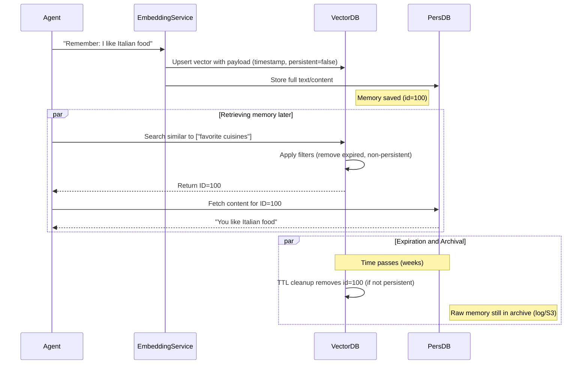
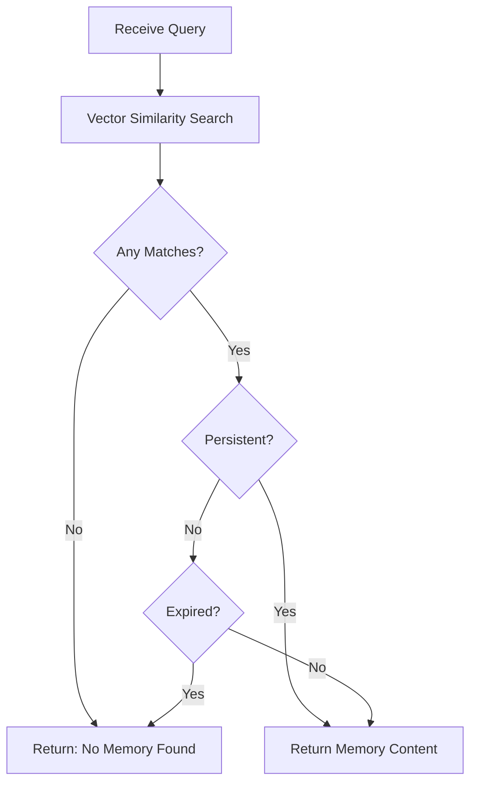

# Executive Summary 

Building a **memory-centric agent platform** requires carefully balancing fast, ephemeral recall with durable, persistent knowledge. A vector store like Qdrant can serve as the “working memory” for similarity search, but it **lacks built-in TTL** or expiration. All automatic expiration must be handled externally【4†L238-L244】. In practice, systems embed timestamps in each memory’s metadata and run background jobs to delete stale items (and rely on Qdrant’s vacuum compaction to reclaim space)【4†L238-L244】【17†L421-L424】. At the same time, key memories should be **flagged as persistent**, often by a metadata flag (e.g. `persistent=true`) so they are excluded from deletion. 

We examine the **full memory lifecycle**: ingestion (vector creation + content storage), retention policies (time-, access-, or relevance-based expiration), synchronization with a long-term store, and eventual archival. We compare storage options (e.g. Qdrant alone vs. a polyglot approach with SQL/NoSQL or object storage) across attributes like latency, throughput, cost, consistency, and legal retention. We survey TTL strategies (time-based TTL, LRU caching, size or score-based evictions, and hybrids) and payload schemas (including fields like timestamp, access-count, version, and provenance). Best practices include indexing TTL timestamps for fast deletes (Qdrant payload indexes) and filtering expired memories during retrieval【4†L238-L244】【5†L107-L114】. 

Finally, we present **three sample architectures** with trade-offs, discuss technology choices (Redis vs. Pinecone vs. Milvus vs. Postgres, etc.), and provide pseudo-code for TTL enforcement and memory queries. Diagrams illustrate a memory’s lifecycle and the decision logic for retrieval vs. expiration. The analysis is backed by Qdrant, Redis, Pinecone, Milvus and other primary sources.

## Vector Stores and Metadata Filtering 

Vector databases store each memory as a *“point”* with an ID, a high-dimensional `vector` and some `payload` metadata【5†L84-L93】. For example, in Qdrant a point might be: 

```json
{
  "id": 123,
  "vector": [...768-dimensional embedding...],
  "payload": {
    "content": "Met Elvis Presley in 1956 at a concert.",
    "timestamp": 1710000000, 
    "persistent": false,
    "source": "conversation"
  }
}
``` 

Here **`timestamp`** (e.g. UNIX time) and **`persistent`** (a boolean flag) are custom metadata. Qdrant supports **filtering queries by payload fields**【5†L122-L131】 – for example, one can restrict a semantic search to points matching `"persistent": false` and `"timestamp": { "$gte": some_time }`. Internally Qdrant uses a specialized HNSW index for vectors and *payload indexes* for filtering. Payload indexes (e.g. on `timestamp` or `persistent`) drastically speed up filter queries【4†L238-L244】. Proper indexing is crucial: Qdrant developers recommend indexing any field used in delete or filter conditions to ensure fast lookups【4†L238-L244】【10†L9-L17】. 

**Expiration in Qdrant:** Qdrant does *not* natively support automatic TTL expiration of points. As confirmed by Qdrant maintainers, you must run your own expiration job. The typical pattern is to add a `timestamp` payload to each memory and periodically delete points older than some cutoff【4†L238-L244】. For example: add `timestamp` when inserting, index it, then have a background task: 

```python
cutoff = now() - TTL_seconds
client.delete(
    collection_name="memories", 
    filter={
      "must": [
         {"key": "persistent", "match": {"value": False}},
         {"key": "timestamp", "range": {"lt": cutoff}}
      ]
    }
)
``` 

This deletes non-persistent memories older than the TTL. Qdrant’s background *vacuum optimizer* will then reclaim space when enough data is marked deleted (by default 20% of a segment)【4†L238-L244】【17†L421-L424】. In practice, set `optimizers_config.deleted_threshold` lower (e.g. 5%) to free space sooner. After deletions, Qdrant’s optimizer prunes the points and their vectors【17†L421-L424】, although compaction may be deferred and controlled by settings. 

By contrast, some vector stores *do* offer native TTL: for example, **Milvus** can be configured with a collection-level TTL so data older than X seconds is auto-deleted【47†L226-L234】. **Weaviate** (v1.36+) similarly supports TTL on objects, with a background process that periodically removes expired items and can even filter expired ones out of queries【55†L88-L96】. **Pinecone** (per its documentation) allows you to upsert vectors with a TTL parameter so they expire automatically – making it ideal for session memory or similar ephemeral data【20†L205-L210】. (Indeed Pinecone’s docs explicitly list TTL as an optional vector attribute【20†L205-L210】.) **Redis** (with RedisVector/RediSearch) also has built-in key expirations and eviction policies, as discussed below. 

## Key Attributes for Memory Storage 

Designing memory storage involves many factors:

- **Latency**: Vector search must be fast (sub-10ms) for real-time agents【32†L148-L152】. In-memory or RAM-optimized systems (Redis, Qdrant in-RAM, or hybrid with memory caching) provide lowest latency; disk-backed systems trade some speed for scale.  

- **Throughput**: Need to support high insert/query rates. Distributed vector stores (sharding, replication) like Qdrant Cloud or Pinecone scale horizontally. In-memory caches (Redis) offer high ops/sec for both reads and writes. 

- **Cost**: In-memory and high-availability clusters cost more. Object storage (S3) or tiered stores (S3 Vectors) offer cost-efficient long-term archival. Cost/latency tradeoffs must be considered: e.g. Amazon’s S3 Vectors promises 90% lower cost for storing massive vectors, at higher query latency (∼100ms)【40†L83-L93】, while Redis or Qdrant deliver sub-ms latency but at higher resource cost. 

- **Consistency**: Vector DBs are often eventually consistent across shards. Qdrant writes are synchronous per shard; Pinecone provides at-least-once writes. Multi-writer conflicts must be handled at the application level (e.g. use unique IDs or versioning in payload). Persistent stores (SQL) provide ACID transactions, while NoSQL might be eventually consistent. If a memory is written to both vector and persistent stores, ensure atomicity via a write-through strategy or outbox/transaction log. 

- **Query Patterns**: The system must support *semantic similarity* queries (ANN search) and also exact filters (by metadata). For example, an agent may query its memory by embedding + timeframe filter. Payload filters (category, user, date range) are common. Systems that support **hybrid queries** (vector + Boolean filters) are preferred【5†L122-L131】. 

- **Metadata and Versioning**: Store provenance (e.g. source ID, conversation ID), timestamps, and a persistence flag in the metadata. For updating memories (e.g. memory reinforcement), use version numbers or vector upsert. If an embedding model changes, you may need a reindex workflow (re-embed or re-insert content). 

- **Security and Access Control**: Use DB-level auth (API keys, RBAC). Qdrant Cloud offers API keys with fine-grained permissions【2†L1-L4】. Always encrypt data at rest (disk encryption, or use services with encryption like managed Redis or cloud vector services). Monitor access and use TLS for connections. 

- **Backup/Restore and Replication**: Backup large vector indexes via snapshots or export. Common strategy: *incremental snapshots* or log-based dumps to S3【37†L133-L142】. For example, Zilliz/Milvus can write incremental logs or periodic snapshots to object storage. In case of failure, replay logs or restore snapshot (note snapshot speed vs. storage tradeoff【37†L133-L142】). Vector indexes (e.g. HNSW graphs) complicate replication: each replica typically holds a full index copy【37†L147-L156】. Many systems use leader-follower or consensus replication (Weaviate uses Raft)【37†L147-L156】 to ensure availability. Plan for offsite backups of both vector and persistent stores. 

- **Garbage Collection and Compaction**: After deletions, the vector store should compact indexes. Qdrant’s vacuum (controlled by `deleted_threshold`) triggers compaction【17†L421-L424】. In Milvus or Weaviate, GC removes expired objects asynchronously【47†L226-L234】【55†L88-L96】. Regular re-indexing or segment compaction may be needed to keep query performance high.

- **Legal/Compliance Retention**: If subject to privacy laws, mark sensitive memories and purge them on request. A retention policy (TTL or manual deletion) can help automate compliance. Maintain audit logs of deletion and access if required by regulations.

## TTL and Expiration Strategies 

Memories must not grow without bound. Common expiration/eviction strategies include: 

- **Time-Based TTL**: Assign each memory a creation timestamp and expire after *T* seconds. This is simplest: e.g. “delete memories older than 30 days”. Implementation: schedule a daily job to remove points with `timestamp < now - 30d`【4†L238-L244】. Most vector DBs require this external job, except those with native TTL (Milvus, Weaviate, Pinecone). 

- **Access-Based (LRU/LFU)**: Track last-access or hit-count for each memory, and expire the least-recently-used (LRU) entries when space is needed. This requires updating a “last_used” timestamp on each query, or using a data structure with automatic eviction (Redis supports LRU eviction policies). For example, Redis can evict the oldest key or the least-used key under memory pressure. This is useful for short-term cache layers【35†L286-L294】.

- **Size-Based Capping**: Set a maximum memory size (number of points or disk space). When exceeded, remove oldest or lowest-priority entries. For instance, “keep most recent 10,000 memories; drop the rest”. This combines time and count limits (e.g. flush everything older than X if count>limit). 

- **Relevance/Score-Based**: Use an LLM or heuristic score to rank memory importance. Periodically prune the lowest-scoring memories. For example, in a chatbot, one might keep memories with “high semantic relevance” or that were frequently retrieved, and drop others. Hybrid policies can weigh time decay with relevance (e.g. weight = relevance / age, evict lowest weights). This approach is custom but can be effective for “memory salience”.

- **Hybrid Strategies**: In practice, combine rules. For example, **“Expire after 1 week OR if total memories > 10000, whichever comes first”**. Or use an aging curve: always delete non-persistent memories after 30 days, but also prune older ones when the DB grows too large. Often a multi-tier approach is used: a short-term cache (with tight TTL/LRU) plus a long-term store (with infrequent TTL).

<table>
<thead>
<tr><th>Strategy</th><th>Description</th><th>Advantages</th><th>Trade-offs/Use-case</th></tr>
</thead><tbody>
<tr><td><b>Time-Based TTL</b></td><td>Expire memories older than a set duration (e.g. 7 days).</td><td>Simple; easy to implement via timestamp filters【4†L238-L244】.</td><td>Ignores usage; may drop important but old info. Requires periodic cleanup job if DB doesn’t support native TTL.</td></tr>
<tr><td><b>Access-Based (LRU)</b></td><td>Evict least-recently-used (or least-frequently-used) memories under storage pressure.</td><td>Automatically focuses on recent context; adapts to query patterns【35†L286-L294】.</td><td>Needs tracking of accesses; can be complex if multiple consumers. In-memory stores like Redis support LRU eviction natively.</td></tr>
<tr><td><b>Size-Based</b></td><td>Keep a fixed-size/total-volume store; drop oldest or low-priority when exceeding limit.</td><td>Controls cost/disk usage; predictable footprint.</td><td>Has to choose which to drop (e.g. by time or score). If not careful, may drop relevant data in bursts.</td></tr>
<tr><td><b>Relevance-Based</b></td><td>Score memories (e.g. via ML or recency) and evict lowest scores.</td><td>Targets truly unimportant items; preserves salient memories longer.</td><td>Requires a scoring model or heuristic; more complex to implement. A hybrid with TTL is often used.</td></tr>
<tr><td><b>Hybrid (Multi-tier)</b></td><td>Combine approaches (e.g. TTL + LRU + cap + priority flag).</td><td>Flexible and adaptive. E.g. reserve “persistent” flag to never expire, others expire by age or LRU.</td><td>Complexity: must tune parameters and implement multiple policies. More control but higher logic overhead.</td></tr>
</tbody>
</table>

Redis’ guidance explicitly recommends combining expiration with recency weighting: e.g. *“expire stale memories automatically while using recency scoring for those that persist”*【35†L286-L294】. Similarly, AWS caching best practices stress using TTLs to avoid stale cache entries【30†L1-L4】. For an agent, a pragmatic default is to mark **persistent memories** (e.g. user profile facts) to never expire, and apply a time-based TTL (like 7–30 days) to ordinary memories【4†L238-L244】, possibly with an LRU limit.

## Metadata and Tagging for Persistence

A key schema decision is how to mark memories as *persistent* or *ephemeral*. A common pattern is to add a boolean field (e.g. `persistent` or `sticky`) in the payload. When a memory is first created, it is marked `persistent = false` by default. If the system or user deems it important (e.g. a known personal preference or fact), you set `persistent = true`. The TTL cleanup job then only deletes where `persistent == false`【4†L238-L244】. 

You should also store:
- **Timestamps:** `created_at` and optionally `last_accessed` or `last_updated`. These allow TTL or LRU checks. For example, Qdrant points can have a `timestamp` integer in payload.
- **Version/Revision:** If memories can be updated, track a `version` field. During an upsert with a new embedding, increment version. This aids conflict resolution (see below).
- **Provenance:** e.g. `source_id` (conversation ID, document ID), `user_id`, or an `origin` tag. This metadata allows tracing a memory’s origin and is useful for audit/compliance. 

Importantly, **payload indexing** on these fields is needed for fast filtering【4†L238-L244】. For example, if we filter TTL deletions by `timestamp`, index that field. If we search only persistent memories, index `persistent`. The Qdrant API allows upserting structured payloads (including nested JSON via RedisJSON/RedisVector if using Redis【32†L148-L152】). 

## Data Model: Vectors + Content + Provenance

Typically, we store **embeddings** (dense vectors) in the vector store and keep the **original content** and detailed fields in a separate persistent store. This is because vector DBs are optimized for numeric search, not for large text or transactional queries. A recommended pattern:

- **Vector Store (fast, ephemeral):** Contains *ID*, *vector(s)*, and minimal payload (timestamp, flags, small metadata, and perhaps a short “embedding of content” or summary). Do *not* duplicate large text fields here if payload size is limited. Instead, store a pointer (e.g. ID) to the content in the persistent store. For example:  
  ```json
  { 
    "id": "mem-123", 
    "vector": [0.01, -0.23, ...], 
    "payload": {"timestamp":1610000000, "persistent":false, "doc_id": 987}
  }
  ```
  
- **Persistent Store (SQL/NoSQL/object):** Contains the full memory record keyed by `doc_id=987`: including the original text/content, full metadata, provenance (e.g. chat context, user ID), and any rich data. This could be a document store (MongoDB, Elasticsearch), a relational table, or even S3 files (with metadata in a database). The persistent store serves as the “ground truth” of memory.

When retrieving, you query the vector store for similarity, then fetch the content from the persistent store using the returned IDs. If a memory has expired or is deleted from the vector store but was flagged persistent, you might still find it in the persistent store and re-index it if needed.

## Synchronization Patterns 

To ensure consistency between the vector store and the persistent storage, consider these integration patterns:

- **Write-Through (Transactional):** On memory creation/update, do both (vector upsert + persistent write) within a transaction or a message queue to ensure atomicity. For example, upon receiving a new memory, your service can insert into the SQL DB and *then* upsert the vector. If one fails, roll back. This ensures the two stores remain in sync. 

- **Write-Behind (Asynchronous):** Write memory to a durable log or queue, and have separate workers update the vector store and persistent store. This decouples latency but risks short inconsistency windows. Use an idempotent queue or change feed so that a crash won’t lose data. 

- **Pointer in Vector Store:** Instead of storing all content in payload, store only `id` in payload and retrieve from SQL/S3 on demand. This keeps the vector index lean. On deletion, you may choose to leave a tombstone in the persistent DB or not delete at all (only remove vector). 

- **Bulk Sync/Refresh:** Periodically reconcile stores. For example, if you change the embedding model, you might re-scan the persistent DB, recompute embeddings, and repopulate the vector DB (or a new collection). 

- **Failover Handling:** If the vector store goes down, you still have all memories in the persistent store (with text). Similarly, if persistent storage is lost, you could rebuild from vector payloads if you store content or S3 pointers. Ensure backups exist for both. 

A typical flowchart could be: User adds memory → Compute embedding → Upsert to VectorDB (with metadata) → Write content to persistent DB. On retrieval: Query VectorDB → Filter out expired (see below) → For each resulting ID, fetch full content from persistent DB. 

## Retrieval and Expiration Logic 

During a memory lookup, you must **exclude expired memories**. This can be done via the vector query’s filter. For example, when querying Qdrant:

```python
# Pseudocode for retrieval respecting TTL and persistence flag
def retrieve_relevant(query_vector, now, TTL_seconds):
    filter = {
       "should": [
         {"key": "persistent", "match": {"value": True}},
         {"key": "timestamp", "range": {"gt": now - TTL_seconds}}
       ]
    }
    hits = client.search(collection="memories", vector=query_vector,
                         filter=filter, top=10)
    results = []
    for hit in hits:
        payload = hit.payload
        # If persistent, always keep; if not, ensure not expired.
        if payload.get("persistent") or payload.get("timestamp", 0) >= now - TTL_seconds:
            results.append(hit)
    return results
```

This logic ensures: **persistent memories are always returned**, and non-persistent ones are only returned if fresh. (In Qdrant you can also use a `must_not` filter or `should` as above to enforce the OR logic on the server side, speeding up pruning【5†L122-L131】.) 

A simplified decision flowchart for query-time is shown below:

```mermaid
flowchart TD
    Q[User Query] --> V[Vector Similarity Search]
    V --> R{Found Memory ID?}
    R -->|No| NR[Return “No relevant memory”]
    R -->|Yes| P{Is Persistent Flag True?}
    P -->|Yes| MR[Return Memory]
    P -->|No| E{Expired? (timestamp < now - TTL)}
    E -->|Yes| NR
    E -->|No| MR
```

This ensures that expired non-persistent memories are silently skipped. (Optionally, one could trigger re-fetch from persistent store or re-add if needed, but typically expiration means “forget this memory”.) 

## Conflict Resolution

If memories may be **updated concurrently** (e.g. multiple LLM instances writing), implement conflict strategies:

- **Idempotent Upserts:** Use deterministic IDs so the same memory is upserted rather than duplicated. For example, use a composite key (e.g. `userID+timestamp` or `chatID+turn`) as the vector ID. 
- **Last-Write-Wins vs Versioning:** If two writes occur, you can accept the latest vector by timestamp (this is simple) or attach a `version` number in metadata. When a worker upserts a higher-version memory, it overwrites.
- **Merge or CRDT:** For richer cases (e.g. merging fragments of memory), you might write custom logic in the application layer before upserting to the DB.

Most vector DBs do not support complex merges internally, so resolution is best handled in your code: always delete or overwrite the old point with the updated one.  

## Monitoring and Alerts

Instrument both vector and persistent stores. Key metrics and alerts include:

- **Query Latency and Throughput:** E.g., Qdrant’s request times or Redis ops/s. Sudden spikes/dips may indicate issues. 
- **Memory Growth:** Track number of points and disk usage. Alert if nearing capacity or if unexpected spikes occur. 
- **Deletion Job Health:** Monitor the success of your TTL cleanup job (e.g. count of deleted points per run, errors). Alert if it stops running. 
- **Vector Index Health:** For HNSW indexes, monitor fragmentation or rebuild frequency. Qdrant Cloud reports “optimizer status” which should be “ok”.  
- **Replica Lag:** In clustered setups, monitor replication lag so reads aren’t stale. 
- **Integration Errors:** Alert if writes to either store fail (e.g. queue consumer down).  
- **Security:** Log and alert on unauthorized access attempts.  
- **Compliance Audits:** If needed, log each deletion or retention event for audit trails.

Use tools like Prometheus/Grafana. Qdrant provides Prometheus metrics and a Web UI for performance tuning. Redis has built-in `MONITOR` and metrics for eviction. Pinecone/Milvus cloud services have dashboards and SLAs. 

## Sample Architectures and Trade-offs

Below are three representative memory-storage architectures. Each emphasizes different trade-offs in complexity, performance, and cost:

| **Architecture**               | **Components**                               | **Pros**                                                                               | **Cons**                                                       | **Example Tech**                        |
|--------------------------------|----------------------------------------------|-----------------------------------------------------------------------------------------|----------------------------------------------------------------|-----------------------------------------|
| **1. Vector-Only (Monolithic)**| Qdrant (vector+metadata only)                | *Simplest setup:* All memory in one system. Low latency retrieval. Built-in filters.【5†L122-L131】 | Payload size limits; not optimized for large content. No built-in TTL (need custom job)【4†L238-L244】. Scaling only via Qdrant clustering.  | Qdrant or Redis with RediSearch+RedisJSON.  |
| **2. Polyglot: Vector + DB**   | Qdrant (vectors) + SQL/NoSQL (content store)  | Vectors in-memory for fast search, content in durable DB. Flexible queries on content. High durability and backup (SQL). | More complex: need sync logic. Two systems to manage. Higher latency join (vector→DB lookup). | Qdrant + PostgreSQL/pgVector or MongoDB; or Milvus + MySQL; Redis + DynamoDB. |
| **3. Multi-Tier (Cache + Archive)** | Redis (in-memory) + Vector DB (cache) + S3 (cold) | Redis for ultra-fast short-term cache with LRU eviction. Qdrant/Pinecone for mid-term memory. S3 (or S3 Vectors) for long-term archival of all data at low cost【40†L83-L93】.  | Very complex. Multiple data movements and consistency to handle. High maintenance overhead. | Redis + Qdrant + S3 (with lifecycle policies or S3 Vectors). |
| **4. Managed Cloud (Serverless)** | Cloud vector (Pinecone/Milvus) + Cloud DB (Dynamo, RDS) | Offloads ops overhead. High reliability and autoscaling. Pinecone TTL lets you skip manual deletes【20†L205-L210】.  | Vendor lock-in; cost may be higher at scale. Less fine-grained control.  | Pinecone (with TTL) + Amazon RDS or DynamoDB + S3 backups. |
| **5. Hybrid Graph + Vector**   | Qdrant + Graph DB (Neo4j)                     | Store factual “knowledge graph” in Neo4j for logical inference, and episodic memories in Qdrant. Rich relationships and queries in Neo4j. | Very complex query integration. Latency if joining graph and vector search. Use-case specific.  | Qdrant + Neo4j/JanusGraph, or Weaviate (vector+graph). |

**Trade-offs:** A single-system approach (1) is easy but may hit limits of payload size and durability. Using a separate persistent store (2) adds reliability and query flexibility at the cost of complexity. Caching layers (3) improve performance but complicate synchronization and increase cost. Serverless cloud offerings (4) simplify operations with pay-as-you-go scaling but can be expensive. In all cases, you must weigh **latency vs durability vs operational complexity**. For example, the Redis blog advocates a unified platform to reduce latency/complexity【32†L148-L152】, but real deployments often still split vector vs full storage.

## Technology Choices 

| **Storage Tier**      | **Tech Options**                             | **Pros**                              | **Cons**                                         |
|-----------------------|----------------------------------------------|---------------------------------------|--------------------------------------------------|
| **In-Memory Cache**   | Redis (OSS or MemoryDB), Memcached          | Blazing fast, built-in TTL/eviction【35†L286-L294】. Good for short-term session memory. | Limited data size, cost of RAM. Not ideal for full history.  |
| **Vector DB (Ephemeral)**   | Qdrant, Pinecone, Milvus, Faiss, Weaviate  | Optimized ANN search. Many support rich filtering. Qdrant: open-source, flexible; Pinecone: managed with built-in TTL【20†L205-L210】; Milvus: enterprise features (TTL, GPU); Faiss: high-performance library for offline. Weaviate: graph features + TTL【55†L88-L96】. | Qdrant needs self-management; Pinecone is paid; Milvus requires ops; Faiss needs custom index pipeline; Weaviate can be heavy for simple tasks. |
| **Persistent Store** | PostgreSQL (+pgvector), MySQL, MongoDB, DynamoDB, Elasticsearch | Relational DBs give ACID transactions, secondary indexes; pgvector adds vector support (good for prototypes). NoSQL (Mongo, Dynamo) scale horizontally for JSON metadata. Search engines (Elasticsearch) add text search on memory contents. Object storage (S3, S3 Vectors【40†L83-L93】) is cheap for large archives. | SQL may not scale easily for massive writes; NoSQL needs custom TTL logic (Mongo has TTL index on a date field). S3 search requires integration (e.g. S3 Vectors + OpenSearch).  |
| **Object Archive**    | S3, Azure Blob, Google Cloud Storage (with or without vector extensions) | Extremely cheap, durable. S3 Vectors now supports up to billions of vectors with subsecond queries for archival use【40†L83-L93】. Great for compliance and full data retention. | High latency unless using specialized access (S3 Vectors). Not suitable for real-time memory retrieval (use LRU cache or vector DB as front-end). |

**Single DB vs Polyglot:** A single database that handles both vectors and content (e.g. Redis with JSON and RediSearch vectors【35†L300-L309】, or Postgres+pgvector) simplifies consistency but often sacrifices performance or flexibility. Polyglot persistence lets you pick the best tool for each need (e.g. Redis for speed, S3 for cheap storage), at the expense of integration complexity. Modern architectures often *combine* several: e.g. Redis as a caching vector store with TTL eviction【35†L286-L294】, backed by a persistent vector DB or data lake.

## Code Examples 

### 1. TTL Enforcement and Background Reaper 

```python
import time
from qdrant_client import QdrantClient

client = QdrantClient(url="http://localhost:6333")

TTL_SECONDS = 7 * 24 * 3600  # one week
def cleanup_task():
    now = int(time.time())
    cutoff = now - TTL_SECONDS
    # Delete points older than cutoff and not marked persistent
    delete_filter = {
        "must": [
            {"key": "timestamp", "range": {"lt": cutoff}},
            {"key": "persistent", "must_not": {"value": True}}
        ]
    }
    client.delete(
        collection_name="memories",
        filter=delete_filter
    )
    print(f"Expired memories before {cutoff} have been deleted.")

# Example: run daily (could be a cron job or asyncio loop)
cleanup_task()
```

This script queries Qdrant for points whose `timestamp < cutoff` and `persistent != True`, then deletes them. Qdrant will free space via its background optimizer. You would run this periodically (e.g. nightly). 

### 2. Upsert with Persistence Flag 

```python
from qdrant_client import QdrantClient, models

client = QdrantClient()

memory_id = 42
embedding = [0.01, -0.23, ...]  # example embedding vector
content = "Alice visited Paris last summer."
is_persistent = False  # or True for long-term facts
now_ts = int(time.time())

point = models.PointStruct(
    id=memory_id,
    vector=embedding,
    payload={
        "content": content,
        "timestamp": now_ts,
        "persistent": is_persistent
    }
)
client.upsert(collection_name="memories", points=[point])
print("Memory upserted.")
```

This writes a new memory point with given `timestamp` and `persistent` flag. If `is_persistent=True`, the cleanup job will ignore it. 

### 3. Retrieval Query (respecting expiration) 

```python
from typing import List

def retrieve_memory(query_vector: List[float], top_k: int = 5):
    now = int(time.time())
    # Build filter: allow persistent OR not-expired
    qdrant_filter = {
        "should": [
            {"key": "persistent", "match": {"value": True}},
            {"key": "timestamp", "range": {"gt": now - TTL_SECONDS}}
        ]
    }
    results = client.search(
        collection_name="memories",
        query_vector=query_vector,
        filter=qdrant_filter,
        top=top_k,
        with_payload=True
    )
    # results is a list of ScoredPoint; extract content
    memories = []
    for res in results:
        payload = res.payload
        if payload.get("persistent") or payload.get("timestamp", 0) >= now - TTL_SECONDS:
            memories.append(payload.get("content"))
    return memories
```

This function searches the vector store, applying a filter that *should* either have `persistent=true` or `timestamp > now-TTL`. It then double-checks expiration before returning content. This ensures we never return an expired memory. 

### 4. Background Compactor (Optional) 

If you use Qdrant **on-disk storage**, you might want a compaction step after many deletes. Qdrant’s optimizer runs automatically, but you can tweak config. For example, to force compaction when >10% deleted:

```python
client.update_collection(
    collection_name="memories",
    optimizer_config=models.OptimizerConfig(
        default_segment_number=1,
        indexing_threshold=1000,
        flush_interval_sec=5,
        max_optimization_threads=1,
        # Set low delete threshold to compact sooner
        deleted_threshold=0.10
    )
)
```

This makes Qdrant reoptimize more aggressively (see [17†L421-L424]). For Redis-based caches, compaction isn’t needed – Redis reclaims memory on delete automatically, and eviction policies maintain size【35†L286-L294】. 

## Diagrams 

Below is a **sequence diagram of the memory lifecycle**, from creation through expiration and archival. It shows an agent producing memories which are stored and later consulted. 



And here is a **flowchart** for retrieval logic with expiration, summarizing the code example above:



This flow ensures only non-expired memories are returned (persistent memories bypass expiration checks). 

## References 

- Qdrant docs on filtering and indexing: “When storing data in Qdrant, each point has a `payload` for metadata”【5†L84-L93】, and filtering queries use payload indices【4†L238-L244】. Qdrant requires external jobs for TTL (see Q&A)【4†L238-L244】 and relies on its vacuum optimizer to reclaim deleted points【17†L421-L424】.
- Redis for AI memory: advocates using *timestamps plus eviction* – “expire stale memories automatically while using recency scoring”【35†L286-L294】.
- Pinecone architecture notes mention built-in TTL: “Vectors can be set to expire automatically — ideal for ephemeral data”【20†L205-L210】.
- Milvus and Weaviate document TTL at the collection level【47†L226-L234】【55†L88-L96】.
- AWS and caching best practices emphasize TTL for freshness【30†L1-L4】.
- Milvus Reference: backup via incremental logs/snapshots (cost vs. time trade-off)【37†L133-L142】; replication and HNSW index overhead【37†L147-L156】.
- Redis AI blog: a unified memory platform simplifies design【32†L148-L152】, with built-in expiration policies【35†L286-L294】 to manage memory decay.
- Qdrant blog (enterprise features) notes API key TTL, illustrating TTL concepts【2†L1-L4】.

These sources inform the strategies and recommendations above, blending vector DB specifics (Qdrant, Milvus, Weaviate) with cache/CDN best practices (Redis, AWS) to architect a robust memory system for AI agents.